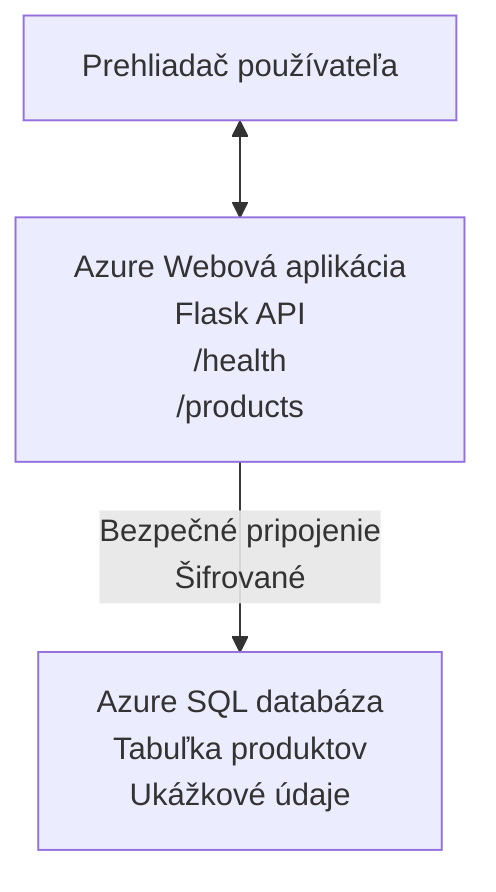

# Nasadenie databázy Microsoft SQL a webovej aplikácie pomocou AZD

⏱️ **Odhadovaný čas**: 20–30 minút | 💰 **Odhadované náklady**: ~15–25 USD/mesiac | ⭐ **Zložitosť**: Stredná

Tento **úplný, fungujúci príklad** ukazuje, ako použiť [Azure Developer CLI (azd)](https://learn.microsoft.com/azure/developer/azure-developer-cli/) na nasadenie Python Flask webovej aplikácie s databázou Microsoft SQL do Azure. Všetok kód je zahrnutý a otestovaný — nie sú potrebné žiadne externé závislosti.

## Čo sa naučíte

Po dokončení tohto príkladu:
- Nasadíte viacvrstvovú aplikáciu (web app + databáza) pomocou infraštruktúry ako kódu
- Nakonfigurujete bezpečné pripojenia k databáze bez tvrdého zakódovania tajomstiev
- Monitorujete zdravie aplikácie pomocou Application Insights
- Efektívne spravujete Azure zdroje pomocou AZD CLI
- Dodržiavate osvedčené postupy Azure pre bezpečnosť, optimalizáciu nákladov a pozorovateľnosť

## Prehľad scenára
- **Web App**: Python Flask REST API s prepojením na databázu
- **Databáza**: Azure SQL Database so vzorovými údajmi
- **Infraštruktúra**: Provisionované pomocou Bicep (modulárne, znovupoužiteľné šablóny)
- **Nasadenie**: Plne automatizované pomocou príkazov `azd`
- **Monitorovanie**: Application Insights pre logy a telemetriu

## Požiadavky

### Potrebné nástroje

Pred začatím si overte, že máte nainštalované tieto nástroje:

1. **[Azure CLI](https://learn.microsoft.com/cli/azure/install-azure-cli)** (verzia 2.50.0 alebo novšia)
   ```sh
   az --version
   # Očakávaný výstup: azure-cli 2.50.0 alebo novší
   ```

2. **[Azure Developer CLI (azd)](https://learn.microsoft.com/azure/developer/azure-developer-cli/install-azd)** (verzia 1.0.0 alebo novšia)
   ```sh
   azd version
   # Očakávaný výstup: azd verzia 1.0.0 alebo novšia
   ```

3. **[Python 3.8+](https://www.python.org/downloads/)** (pre lokálny vývoj)
   ```sh
   python --version
   # Očakávaný výstup: Python 3.8 alebo novší
   ```

4. **[Docker](https://www.docker.com/get-started)** (voliteľné, pre lokálny kontajnerizovaný vývoj)
   ```sh
   docker --version
   # Očakávaný výstup: Docker verzia 20.10 alebo vyššia
   ```

### Požiadavky v Azure

- Aktívne **Azure predplatné** ([vytvoriť bezplatný účet](https://azure.microsoft.com/free/))
- Povolenia na vytváranie zdrojov vo vašom predplatnom
- Rola **Owner** alebo **Contributor** na predplatnom alebo skupine prostriedkov

### Predchádzajúce znalosti

Toto je príklad **strednej úrovne**. Mali by ste poznať:
- Základné operácie v príkazovom riadku
- Základné cloudové koncepty (zdroje, skupiny prostriedkov)
- Základné pochopenie webových aplikácií a databáz

**Nový v AZD?** Začnite najskôr s [Getting Started guide](../../docs/chapter-01-foundation/azd-basics.md).

## Architektúra

Tento príklad nasadzuje dvojvrstvovú architektúru s webovou aplikáciou a SQL databázou:



**Nasadenie zdrojov:**
- **Resource Group**: Kontajner pre všetky zdroje
- **App Service Plan**: Hostovanie na Linuxe (tier B1 pre úsporu nákladov)
- **Web App**: Runtime Python 3.11 s Flask aplikáciou
- **SQL Server**: Spravovaný databázový server s minimálnym TLS 1.2
- **SQL Database**: Základný tier (2GB, vhodné pre vývoj/testovanie)
- **Application Insights**: Monitorovanie a logovanie
- **Log Analytics Workspace**: Centralizované ukladanie logov

**Analógia**: Predstavte si to ako reštaráciu (web app) s mraziacim skladom (databáza). Zákazníci si objednávajú z jedálneho lístka (API endpointy) a kuchyňa (Flask app) vyťahuje suroviny (údaje) zo skladu. Manažér reštaurácie (Application Insights) sleduje všetko, čo sa deje.

## Štruktúra priečinkov

Všetky súbory sú zahrnuté v tomto príklade — nie sú potrebné žiadne externé závislosti:

```
examples/database-app/
│
├── README.md                    # This file
├── azure.yaml                   # AZD configuration file
├── .env.sample                  # Sample environment variables
├── .gitignore                   # Git ignore patterns
│
├── infra/                       # Infrastructure as Code (Bicep)
│   ├── main.bicep              # Main orchestration template
│   ├── abbreviations.json      # Azure naming conventions
│   └── resources/              # Modular resource templates
│       ├── sql-server.bicep    # SQL Server configuration
│       ├── sql-database.bicep  # Database configuration
│       ├── app-service-plan.bicep  # Hosting plan
│       ├── app-insights.bicep  # Monitoring setup
│       └── web-app.bicep       # Web application
│
└── src/
    └── web/                    # Application source code
        ├── app.py              # Flask REST API
        ├── requirements.txt    # Python dependencies
        └── Dockerfile          # Container definition
```

**Čo ktorý súbor robí:**
- **azure.yaml**: Hovorí AZD, čo nasadiť a kam
- **infra/main.bicep**: Orchestruje všetky Azure zdroje
- **infra/resources/*.bicep**: Definície jednotlivých zdrojov (modulárne na opätovné použitie)
- **src/web/app.py**: Flask aplikácia s logikou pre databázu
- **requirements.txt**: Závislosti Python balíčkov
- **Dockerfile**: Inštrukcie na kontajnerizáciu pre nasadenie

## Rýchly štart (krok za krokom)

### Krok 1: Klonujte a prejdite do priečinka

```sh
git clone https://github.com/microsoft/AZD-for-beginners.git
cd AZD-for-beginners/examples/database-app
```

**✓ Kontrola úspechu**: Overte, že vidíte `azure.yaml` a priečinok `infra/`:
```sh
ls
# Očakávané: README.md, azure.yaml, infra/, src/
```

### Krok 2: Autentifikácia v Azure

```sh
azd auth login
```

Týmto sa otvorí váš prehliadač na prihlásenie do Azure. Prihláste sa svojimi Azure prihlasovacími údajmi.

**✓ Kontrola úspechu**: Mali by ste vidieť:
```
Logged in to Azure.
```

### Krok 3: Inicializujte prostredie

```sh
azd init
```

**Čo sa stane**: AZD vytvorí lokálnu konfiguráciu pre vaše nasadenie.

**Výzvy, ktoré sa zobrazia**:
- **Environment name**: Zadajte krátky názov (napr. `dev`, `myapp`)
- **Azure subscription**: Vyberte svoje predplatné zo zoznamu
- **Azure location**: Vyberte región (napr. `eastus`, `westeurope`)

**✓ Kontrola úspechu**: Mali by ste vidieť:
```
SUCCESS: New project initialized!
```

### Krok 4: Provision Azure zdrojov

```sh
azd provision
```

**Čo sa stane**: AZD nasadí všetku infraštruktúru (trvá 5–8 minút):
1. Vytvorí resource group
2. Vytvorí SQL Server a databázu
3. Vytvorí App Service Plan
4. Vytvorí Web App
5. Vytvorí Application Insights
6. Nakonfiguruje sieťovanie a bezpečnosť

**Budete vyzvaní na**:
- **SQL admin username**: Zadajte používateľské meno (napr. `sqladmin`)
- **SQL admin password**: Zadajte silné heslo (uložte si ho!)

**✓ Kontrola úspechu**: Mali by ste vidieť:
```
SUCCESS: Your application was provisioned in Azure in X minutes Y seconds.
You can view the resources created under the resource group rg-<env-name> in Azure Portal:
https://portal.azure.com/#@/resource/subscriptions/.../resourceGroups/rg-<env-name>
```

**⏱️ Čas**: 5–8 minút

### Krok 5: Nasadte aplikáciu

```sh
azd deploy
```

**Čo sa stane**: AZD zostaví a nasadí vašu Flask aplikáciu:
1. Zabalí Python aplikáciu
2. Postaví Docker kontajner
3. Pushne ho do Azure Web App
4. Inicializuje databázu so vzorovými údajmi
5. Spustí aplikáciu

**✓ Kontrola úspechu**: Mali by ste vidieť:
```
SUCCESS: Your application was deployed to Azure in X minutes Y seconds.
You can view the resources created under the resource group rg-<env-name> in Azure Portal:
https://portal.azure.com/#@/resource/subscriptions/.../resourceGroups/rg-<env-name>
```

**⏱️ Čas**: 3–5 minút

### Krok 6: Prezrite si aplikáciu v prehliadači

```sh
azd browse
```

Týmto otvoríte nasadenú webovú aplikáciu v prehliadači na adrese `https://app-<unique-id>.azurewebsites.net`

**✓ Kontrola úspechu**: Mali by ste vidieť JSON výstup:
```json
{
  "message": "Welcome to the Database App API",
  "endpoints": {
    "/": "This help message",
    "/health": "Health check endpoint",
    "/products": "List all products",
    "/products/<id>": "Get product by ID"
  }
}
```

### Krok 7: Otestujte API koncové body

**Kontrola stavu** (overenie pripojenia k databáze):
```sh
curl https://app-<your-id>.azurewebsites.net/health
```

**Očakávaná odpoveď**:
```json
{
  "status": "healthy",
  "database": "connected"
}
```

**Zoznam produktov** (vzorkové údaje):
```sh
curl https://app-<your-id>.azurewebsites.net/products
```

**Očakávaná odpoveď**:
```json
[
  {
    "id": 1,
    "name": "Laptop",
    "description": "High-performance laptop",
    "price": 1299.99,
    "created_at": "2025-11-19T10:30:00"
  },
  ...
]
```

**Zobraziť jeden produkt**:
```sh
curl https://app-<your-id>.azurewebsites.net/products/1
```

**✓ Kontrola úspechu**: Všetky endpointy vracajú JSON dáta bez chýb.

---

**🎉 Gratulujeme!** Úspešne ste nasadili webovú aplikáciu s databázou do Azure pomocou AZD.

## Podrobná konfigurácia

### Premenné prostredia

Tajomstvá sú spravované bezpečne cez konfiguráciu Azure App Service — **nikdy nie tvrdé zakódované v zdrojovom kóde**.

**Automaticky nakonfigurované AZD**:
- `SQL_CONNECTION_STRING`: Pripojenie k databáze s šifrovanými povereniami
- `APPLICATIONINSIGHTS_CONNECTION_STRING`: Endpoint telemetrie pre monitorovanie
- `SCM_DO_BUILD_DURING_DEPLOYMENT`: Umožňuje automatickú inštaláciu závislostí

**Kde sú tajomstvá uložené**:
1. Počas `azd provision` zadávate SQL poverenia cez zabezpečené výzvy
2. AZD ich ukladá do lokálneho súboru `.azure/<env-name>/.env` (ignorované v Gite)
3. AZD ich injektuje do konfigurácie Azure App Service (šifrované v pokoji)
4. Aplikácia ich načítava cez `os.getenv()` pri behu

### Lokálny vývoj

Pre lokálne testovanie vytvorte `.env` súbor zo vzoru:

```sh
cp .env.sample .env
# Upravte .env a nastavte pripojenie na lokálnu databázu.
```

**Postup pri lokálnom vývoji**:
```sh
# Nainštalovať závislosti
cd src/web
pip install -r requirements.txt

# Nastaviť premenné prostredia
export SQL_CONNECTION_STRING="your-local-connection-string"

# Spustiť aplikáciu
python app.py
```

**Testovanie lokálne**:
```sh
curl http://localhost:8000/health
# Očakávané: {"status": "zdravý", "database": "pripojená"}
```

### Infrastruktúra ako kód

Všetky Azure zdroje sú definované v **Bicep šablónach** (priečinok `infra/`):

- **Modulárny dizajn**: Každý typ zdroja má vlastný súbor pre znovupoužiteľnosť
- **Parametrizovateľné**: Prispôsobte SKU, regióny, konvencie pomenovania
- **Osvedčené postupy**: Dodržiava štandardy pomenovania Azure a predvolené bezpečnostné nastavenia
- **Verzované**: Zmeny infraštruktúry sú sledované v Gite

**Príklad prispôsobenia**:
Ak chcete zmeniť tier databázy, upravte `infra/resources/sql-database.bicep`:
```bicep
sku: {
  name: 'Standard'  // Changed from 'Basic'
  tier: 'Standard'
  capacity: 10
}
```

## Najlepšie bezpečnostné postupy

Tento príklad dodržiava osvedčené bezpečnostné postupy Azure:

### 1. **Žiadne tajomstvá v zdrojovom kóde**
- ✅ Poverenia uložené v konfigurácii Azure App Service (šifrované)
- ✅ `.env` súbory vylúčené z Gitu cez `.gitignore`
- ✅ Tajomstvá odovzdávané cez zabezpečené parametre pri provisioning

### 2. **Šifrované pripojenia**
- ✅ TLS 1.2 minimálne pre SQL Server
- ✅ Web App vyžaduje len HTTPS
- ✅ Pripojenia k databáze používajú šifrované kanály

### 3. **Sieťová bezpečnosť**
- ✅ Firewall SQL Servera nakonfigurovaný tak, aby povoľoval len služby Azure
- ✅ Verejný prístup obmedzený (možno ďalej zabezpečiť pomocou Private Endpoints)
- ✅ FTPS vypnutý na Web App

### 4. **Autentifikácia a autorizácia**
- ⚠️ **Aktuálne**: SQL autentifikácia (používateľské meno/heslo)
- ✅ **Odporúčanie pre produkciu**: Použiť Azure Managed Identity pre autentifikáciu bez hesla

**Ako prejsť na Managed Identity** (pre produkciu):
1. Povoliť managed identity na Web App
2. Udeliť identite oprávnenia v SQL
3. Aktualizovať connection string tak, aby používal managed identity
4. Odstrániť autentifikáciu založenú na hesle

### 5. **Auditovanie a súlad**
- ✅ Application Insights loguje všetky požiadavky a chyby
- ✅ Auditovanie SQL databázy je povolené (možno nakonfigurovať pre súlad)
- ✅ Všetky zdroje označené tagmi pre governance

**Kontrolný zoznam bezpečnosti pred produkciou**:
- [ ] Povoliť Azure Defender pre SQL
- [ ] Nakonfigurovať Private Endpoints pre SQL Database
- [ ] Povoliť Web Application Firewall (WAF)
- [ ] Implementovať Azure Key Vault pre rotáciu tajomstiev
- [ ] Nakonfigurovať Microsoft Entra ID autentifikáciu
- [ ] Povoliť diagnostické logovanie pre všetky zdroje

## Optimalizácia nákladov

**Odhadované mesačné náklady** (k novembru 2025):

| Resource | SKU/Tier | Estimated Cost |
|----------|----------|----------------|
| App Service Plan | B1 (Basic) | ~$13/month |
| SQL Database | Basic (2GB) | ~$5/month |
| Application Insights | Pay-as-you-go | ~$2/month (low traffic) |
| **Total** | | **~$20/month** |

**💡 Tipy na úsporu nákladov**:

1. **Použite bezplatnú úroveň na učenie**:
   - App Service: F1 tier (zadarmo, obmedzené hodiny)
   - SQL Database: Použiť Azure SQL Database serverless
   - Application Insights: 5GB/mesiac bezplatné ingestovanie

2. **Zastavte zdroje, keď nie sú v používaní**:
   ```sh
   # Zastavte webovú aplikáciu (databáza si stále účtuje poplatky)
   az webapp stop --name <app-name> --resource-group <rg-name>
   
   # Reštartujte podľa potreby
   az webapp start --name <app-name> --resource-group <rg-name>
   ```

3. **Vymažte všetko po testovaní**:
   ```sh
   azd down
   ```
   Toto odstráni VŠETKY zdroje a zastaví účtovanie.

4. **Vývojové vs. produkčné SKU**:
   - **Vývoj**: Basic tier (použité v tomto príklade)
   - **Produkcia**: Standard/Premium tier s redundanciou

**Monitorovanie nákladov**:
- Zobraziť náklady v [Azure Cost Management](https://portal.azure.com/#view/Microsoft_Azure_CostManagement)
- Nastaviť upozornenia na náklady, aby ste predišli prekvapeniam
- Označiť všetky zdroje tagom `azd-env-name` pre sledovanie

**Alternatíva bezplatnej úrovne**:
Na účely učenia môžete upraviť `infra/resources/app-service-plan.bicep`:
```bicep
sku: {
  name: 'F1'  // Free tier
  tier: 'Free'
}
```
**Poznámka**: Bezplatná úroveň má obmedzenia (60 min/deň CPU, bez always-on).

## Monitorovanie a pozorovateľnosť

### Integrácia Application Insights

Tento príklad obsahuje **Application Insights** pre komplexné monitorovanie:

**Čo sa monitoruje**:
- ✅ HTTP požiadavky (latencia, status kódy, endpointy)
- ✅ Aplikačné chyby a výnimky
- ✅ Vlastné logovanie z Flask aplikácie
- ✅ Stav pripojenia k databáze
- ✅ Výkonnostné metriky (CPU, pamäť)

**Prístup k Application Insights**:
1. Otvorte [Azure Portal](https://portal.azure.com)
2. Prejdite do svojej resource group (`rg-<env-name>`)
3. Kliknite na Application Insights zdroj (`appi-<unique-id>`)

**Užitočné dotazy** (Application Insights → Logs):

**Zobraziť všetky požiadavky**:
```kusto
requests
| where timestamp > ago(1h)
| order by timestamp desc
| project timestamp, name, url, resultCode, duration
```

**Nájsť chyby**:
```kusto
exceptions
| where timestamp > ago(24h)
| order by timestamp desc
| project timestamp, type, outerMessage, operation_Name
```

**Skontrolovať health endpoint**:
```kusto
requests
| where name contains "health"
| summarize count() by resultCode, bin(timestamp, 1h)
```

### Auditovanie SQL databázy

**Auditovanie SQL databázy je povolené** pre sledovanie:
- Prístupy k databáze
- Neúspešné pokusy o prihlásenie
- Zmeny schémy
- Prístup k údajom (pre súlad)

**Prístup k auditným logom**:
1. Azure Portal → SQL Database → Auditing
2. Prezrieť logy v Log Analytics workspace

### Monitorovanie v reálnom čase

**Zobraziť živé metriky**:
1. Application Insights → Live Metrics
2. Zobraziť požiadavky, zlyhania a výkon v reálnom čase

**Nastavenie alertov**:
Vytvorte upozornenia pre kritické udalosti:
- HTTP 500 chyby > 5 za 5 minút
- Zlyhania pripojenia k databáze
- Vysoké časy odozvy (>2 sekundy)

**Príklad vytvorenia upozornenia**:
```sh
az monitor metrics alert create \
  --name "High-Response-Time" \
  --resource-group <rg-name> \
  --scopes <app-insights-resource-id> \
  --condition "avg requests/duration > 2000" \
  --description "Alert when response time exceeds 2 seconds"
```

## Riešenie problémov
### Common Issues and Solutions

#### 1. `azd provision` fails with "Location not available"

**Symptom**:
```
Error: The subscription is not registered for the resource type 'components' in the location 'centralus'.
```

**Solution**:
Choose a different Azure region or register the resource provider:
```sh
az provider register --namespace Microsoft.Insights
```

#### 2. SQL Connection Fails During Deployment

**Symptom**:
```
pyodbc.OperationalError: ('08001', '[08001] [Microsoft][ODBC Driver 18 for SQL Server]TCP Provider...')
```

**Solution**:
- Overte, či firewall SQL Servera povoľuje služby Azure (automaticky nakonfigurované)
- Skontrolujte, či bol administračný SQL heslo zadané správne počas `azd provision`
- Uistite sa, že SQL Server je úplne provisionovaný (môže to trvať 2–3 minúty)

**Verify Connection**:
```sh
# V Azure portáli prejdite na SQL Database → Query editor
# Skúste sa pripojiť pomocou svojich prihlasovacích údajov
```

#### 3. Web App Shows "Application Error"

**Symptom**:
Browser shows generic error page.

**Solution**:
Check application logs:
```sh
# Zobraziť nedávne záznamy
az webapp log tail --name <app-name> --resource-group <rg-name>
```

**Common causes**:
- Chýbajúce premenné prostredia (skontrolujte App Service → Configuration)
- Inštalácia Python balíčkov zlyhala (skontrolujte nasadzovacie logy)
- Chyba pri inicializácii databázy (skontrolujte SQL konektivitu)

#### 4. `azd deploy` Fails with "Build Error"

**Symptom**:
```
Error: Failed to build project
```

**Solution**:
- Uistite sa, že `requirements.txt` nemá syntaktické chyby
- Skontrolujte, či je v `infra/resources/web-app.bicep` špecifikovaný Python 3.11
- Overte, že Dockerfile má správny základný image

**Debug locally**:
```sh
cd src/web
docker build -t test-app .
docker run -p 8000:8000 test-app
```

#### 5. "Unauthorized" When Running AZD Commands

**Symptom**:
```
ERROR: (Unauthorized) The client '<id>' with object id '<id>' does not have authorization
```

**Solution**:
Re-authenticate with Azure:
```sh
# Vyžaduje sa pre pracovné postupy AZD
azd auth login

# Voliteľné, ak priamo používate príkazy Azure CLI
az login
```

Verify you have the correct permissions (Contributor role) on the subscription.

#### 6. High Database Costs

**Symptom**:
Unexpected Azure bill.

**Solution**:
- Skontrolujte, či ste po testovaní nezabudli spustiť `azd down`
- Overte, že SQL Database používa Basic tier (nie Premium)
- Prezrite si náklady v Azure Cost Management
- Nastavte si upozornenia na náklady

### Getting Help

**View All AZD Environment Variables**:
```sh
azd env get-values
```

**Check Deployment Status**:
```sh
az webapp show --name <app-name> --resource-group <rg-name> --query state
```

**Access Application Logs**:
```sh
az webapp log download --name <app-name> --resource-group <rg-name> --log-file app-logs.zip
```

**Need More Help?**
- [AZD Troubleshooting Guide](../../docs/chapter-07-troubleshooting/common-issues.md)
- [Azure App Service Troubleshooting](https://learn.microsoft.com/azure/app-service/troubleshoot-diagnostic-logs)
- [Azure SQL Troubleshooting](https://learn.microsoft.com/azure/azure-sql/database/troubleshoot-common-errors-issues)

## Practical Exercises

### Exercise 1: Verify Your Deployment (Začiatočník)

**Goal**: Confirm all resources are deployed and the application is working.

**Steps**:
1. List all resources in your resource group:
   ```sh
   az resource list --resource-group rg-<env-name> --output table
   ```
   **Expected**: 6-7 resources (Web App, SQL Server, SQL Database, App Service Plan, Application Insights, Log Analytics)

2. Test all API endpoints:
   ```sh
   curl https://app-<your-id>.azurewebsites.net/
   curl https://app-<your-id>.azurewebsites.net/health
   curl https://app-<your-id>.azurewebsites.net/products
   curl https://app-<your-id>.azurewebsites.net/products/1
   ```
   **Expected**: All return valid JSON without errors

3. Check Application Insights:
   - Navigate to Application Insights in Azure Portal
   - Go to "Live Metrics"
   - Refresh your browser on the web app
   **Expected**: See requests appearing in real-time

**Success Criteria**: All 6-7 resources exist, all endpoints return data, Live Metrics shows activity.

---

### Exercise 2: Add a New API Endpoint (Stredne pokročilý)

**Goal**: Extend the Flask application with a new endpoint.

**Starter Code**: Current endpoints in `src/web/app.py`

**Steps**:
1. Edit `src/web/app.py` and add a new endpoint after the `get_product()` function:
   ```python
   @app.route('/products/search/<keyword>')
   def search_products(keyword):
       """Search products by name or description."""
       try:
           conn = get_db_connection()
           cursor = conn.cursor()
           cursor.execute(
               "SELECT id, name, description, price, created_at FROM products WHERE name LIKE ? OR description LIKE ?",
               (f'%{keyword}%', f'%{keyword}%')
           )
           
           products = []
           for row in cursor.fetchall():
               products.append({
                   'id': row[0],
                   'name': row[1],
                   'description': row[2],
                   'price': float(row[3]) if row[3] else None,
                   'created_at': row[4].isoformat() if row[4] else None
               })
           
           cursor.close()
           conn.close()
           
           logger.info(f"Search for '{keyword}' returned {len(products)} results")
           return jsonify(products), 200
           
       except Exception as e:
           logger.error(f"Error searching products: {str(e)}")
           return jsonify({'error': str(e)}), 500
   ```

2. Deploy the updated application:
   ```sh
   azd deploy
   ```

3. Test the new endpoint:
   ```sh
   curl https://app-<your-id>.azurewebsites.net/products/search/laptop
   ```
   **Expected**: Returns products matching "laptop"

**Success Criteria**: New endpoint works, returns filtered results, shows up in Application Insights logs.

---

### Exercise 3: Add Monitoring and Alerts (Pokročilý)

**Goal**: Set up proactive monitoring with alerts.

**Steps**:
1. Create an alert for HTTP 500 errors:
   ```sh
   # Získať ID prostriedku Application Insights
   AI_ID=$(az monitor app-insights component show \
     --app appi-<your-id> \
     --resource-group rg-<env-name> \
     --query id -o tsv)
   
   # Vytvoriť upozornenie
   az monitor metrics alert create \
     --name "High-Error-Rate" \
     --resource-group rg-<env-name> \
     --scopes $AI_ID \
     --condition "count requests/failed > 5" \
     --window-size 5m \
     --evaluation-frequency 1m \
     --description "Alert when >5 failed requests in 5 minutes"
   ```

2. Trigger the alert by causing errors:
   ```sh
   # Žiadosť o neexistujúci produkt
   for i in {1..10}; do curl https://app-<your-id>.azurewebsites.net/products/999; done
   ```

3. Check if the alert fired:
   - Azure Portal → Alerts → Alert Rules
   - Check your email (if configured)

**Success Criteria**: Alert rule is created, triggers on errors, notifications are received.

---

### Exercise 4: Database Schema Changes (Pokročilý)

**Goal**: Add a new table and modify the application to use it.

**Steps**:
1. Connect to SQL Database via Azure Portal Query Editor

2. Create a new `categories` table:
   ```sql
   CREATE TABLE categories (
       id INT PRIMARY KEY IDENTITY(1,1),
       name NVARCHAR(50) NOT NULL,
       description NVARCHAR(200)
   );
   
   INSERT INTO categories (name, description) VALUES
   ('Electronics', 'Electronic devices and accessories'),
   ('Office Supplies', 'Office equipment and supplies');
   
   -- Add category to products table
   ALTER TABLE products ADD category_id INT;
   UPDATE products SET category_id = 1; -- Set all to Electronics
   ```

3. Update `src/web/app.py` to include category information in responses

4. Deploy and test

**Success Criteria**: New table exists, products show category information, application still works.

---

### Exercise 5: Implement Caching (Odborník)

**Goal**: Add Azure Redis Cache to improve performance.

**Steps**:
1. Add Redis Cache to `infra/main.bicep`
2. Update `src/web/app.py` to cache product queries
3. Measure performance improvement with Application Insights
4. Compare response times before/after caching

**Success Criteria**: Redis is deployed, caching works, response times improve by >50%.

**Hint**: Start with [Azure Cache for Redis documentation](https://learn.microsoft.com/azure/azure-cache-for-redis/).

---

## Cleanup

To avoid ongoing charges, delete all resources when done:

```sh
azd down
```

**Confirmation prompt**:
```
? Total resources to delete: 7, are you sure you want to continue? (y/N)
```

Type `y` to confirm.

**✓ Success Check**: 
- All resources are deleted from Azure Portal
- No ongoing charges
- Local `.azure/<env-name>` folder can be deleted

**Alternative** (keep infrastructure, delete data):
```sh
# Vymazať iba skupinu prostriedkov (ponechať konfiguráciu AZD)
az group delete --name rg-<env-name> --yes
```
## Learn More

### Related Documentation
- [Azure Developer CLI Documentation](https://learn.microsoft.com/azure/developer/azure-developer-cli/)
- [Azure SQL Database Documentation](https://learn.microsoft.com/azure/azure-sql/database/)
- [Azure App Service Documentation](https://learn.microsoft.com/azure/app-service/)
- [Application Insights Documentation](https://learn.microsoft.com/azure/azure-monitor/app/app-insights-overview)
- [Bicep Language Reference](https://learn.microsoft.com/azure/azure-resource-manager/bicep/)

### Next Steps in This Course
- **[Container Apps Example](../../../../examples/container-app)**: Deploy microservices with Azure Container Apps
- **[AI Integration Guide](../../../../docs/ai-foundry)**: Add AI capabilities to your app
- **[Deployment Best Practices](../../docs/chapter-04-infrastructure/deployment-guide.md)**: Production deployment patterns

### Advanced Topics
- **Managed Identity**: Remove passwords and use Microsoft Entra ID authentication
- **Private Endpoints**: Secure database connections within a virtual network
- **CI/CD Integration**: Automate deployments with GitHub Actions or Azure DevOps
- **Multi-Environment**: Set up dev, staging, and production environments
- **Database Migrations**: Use Alembic or Entity Framework for schema versioning

### Comparison to Other Approaches

**AZD vs. ARM Templates**:
- ✅ AZD: Higher-level abstraction, simpler commands
- ⚠️ ARM: More verbose, granular control

**AZD vs. Terraform**:
- ✅ AZD: Azure-native, integrated with Azure services
- ⚠️ Terraform: Multi-cloud support, larger ecosystem

**AZD vs. Azure Portal**:
- ✅ AZD: Repeatable, version-controlled, automatable
- ⚠️ Portal: Manual clicks, difficult to reproduce

**Think of AZD as**: Docker Compose for Azure—simplified configuration for complex deployments.

---

## Frequently Asked Questions

**Otázka: Môžem použiť iný programovací jazyk?**  
Odpoveď: Áno! Nahraďte `src/web/` Node.js, C#, Go alebo akýmkoľvek iným jazykom. Aktualizujte `azure.yaml` a Bicep podľa potreby.

**Otázka: Ako pridám ďalšie databázy?**  
Odpoveď: Pridajte ďalší modul SQL Database v `infra/main.bicep` alebo použite PostgreSQL/MySQL z Azure Database services.

**Otázka: Môžem to použiť v produkcii?**  
Odpoveď: Toto je východiskový bod. Pre produkciu pridajte: managed identity, private endpoints, redundanciu, stratégiu zálohovania, WAF a rozšírené monitorovanie.

**Otázka: Čo ak chcem použiť kontajnery namiesto nasadzovania kódu?**  
Odpoveď: Pozrite si [Container Apps Example](../../../../examples/container-app), ktorý používa Docker kontajnery v celom procese.

**Otázka: Ako sa pripojím k databáze z môjho lokálneho stroja?**  
Odpoveď: Pridajte svoju IP do firewallu SQL Servera:
```sh
az sql server firewall-rule create \
  --resource-group rg-<env-name> \
  --server sql-<unique-id> \
  --name AllowMyIP \
  --start-ip-address <your-ip> \
  --end-ip-address <your-ip>
```

**Otázka: Môžem použiť existujúcu databázu namiesto vytvárania novej?**  
Odpoveď: Áno, upravte `infra/main.bicep` tak, aby odkazoval na existujúci SQL Server a aktualizujte parametre connection stringu.

---

> **Poznámka:** Tento príklad demonštruje najlepšie postupy pre nasadenie webovej aplikácie s databázou pomocou AZD. Obsahuje funkčný kód, komplexnú dokumentáciu a praktické cvičenia na upevnenie vedomostí. Pre produkčné nasadenia skontrolujte požiadavky na bezpečnosť, škálovanie, súlad a náklady špecifické pre vašu organizáciu.

**📚 Course Navigation:**
- ← Previous: [Container Apps Example](../../../../examples/container-app)
- → Next: [AI Integration Guide](../../../../docs/ai-foundry)
- 🏠 [Course Home](../../README.md)

---

<!-- CO-OP TRANSLATOR DISCLAIMER START -->
**Vyhlásenie o zodpovednosti**:
Tento dokument bol preložený pomocou AI prekladateľskej služby [Co-op Translator](https://github.com/Azure/co-op-translator). Hoci sa snažíme o presnosť, vezmite prosím na vedomie, že automatické preklady môžu obsahovať chyby alebo nepresnosti. Pôvodný dokument v jeho natívnom jazyku by mal byť považovaný za autoritatívny zdroj. Pre kritické informácie sa odporúča profesionálny ľudský preklad. Nie sme zodpovední za žiadne nedorozumenia alebo nesprávne interpretácie vyplývajúce z použitia tohto prekladu.
<!-- CO-OP TRANSLATOR DISCLAIMER END -->