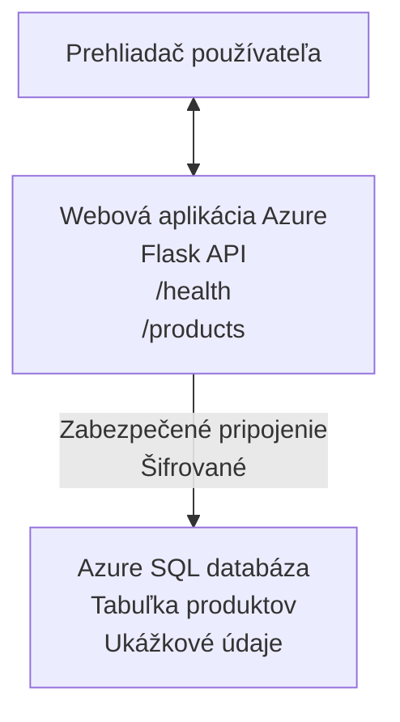

# Nasadenie databázy Microsoft SQL a webovej aplikácie s AZD

⏱️ **Odhadovaný čas**: 20-30 minút | 💰 **Odhadované náklady**: ~$15-25/mesiac | ⭐ **Zložitosť**: Stredná

Tento **úplný, funkčný príklad** ukazuje, ako použiť [Azure Developer CLI (azd)](https://learn.microsoft.com/azure/developer/azure-developer-cli/) na nasadenie Python Flask webovej aplikácie s databázou Microsoft SQL do Azure. Všetok kód je zahrnutý a otestovaný — nie sú potrebné žiadne externé závislosti.

## Čo sa naučíte

Po dokončení tohto príkladu budete:
- Nasadiť viacvrstvovú aplikáciu (webová aplikácia + databáza) pomocou infraštruktúry ako kódu
- Konfigurovať bezpečné pripojenia k databáze bez ukladania tajomstiev do zdrojového kódu
- Monitorovať stav aplikácie pomocou Application Insights
- Efektívne spravovať zdroje Azure pomocou AZD CLI
- Dodržiavať osvedčené postupy Azure pre bezpečnosť, optimalizáciu nákladov a sledovateľnosť

## Prehľad scenára
- **Web App**: Python Flask REST API s prepojením na databázu
- **Database**: Azure SQL Database so vzorovými údajmi
- **Infrastructure**: Poskytované pomocou Bicep (modulárne, znovupoužiteľné šablóny)
- **Deployment**: Plne automatizované pomocou príkazov `azd`
- **Monitoring**: Application Insights pre logy a telemetriu

## Predpoklady

### Požadované nástroje

Pred začatím skontrolujte, či máte nainštalované tieto nástroje:

1. **[Azure CLI](https://learn.microsoft.com/cli/azure/install-azure-cli)** (verzia 2.50.0 alebo vyššia)
   ```sh
   az --version
   # Očakávaný výstup: azure-cli 2.50.0 alebo novší
   ```

2. **[Azure Developer CLI (azd)](https://learn.microsoft.com/azure/developer/azure-developer-cli/install-azd)** (verzia 1.0.0 alebo vyššia)
   ```sh
   azd version
   # Očakávaný výstup: azd verzia 1.0.0 alebo novšia
   ```

3. **[Python 3.8+](https://www.python.org/downloads/)** (pre lokálny vývoj)
   ```sh
   python --version
   # Očakávaný výstup: Python 3.8 alebo novší
   ```

4. **[Docker](https://www.docker.com/get-started)** (voliteľné, pre lokálny kontajnerizovaný vývoj)
   ```sh
   docker --version
   # Očakávaný výstup: Docker verzia 20.10 alebo novšia
   ```

### Požiadavky pre Azure

- Aktívne **predplatné Azure** ([vytvorte si bezplatný účet](https://azure.microsoft.com/free/))
- Povolenia na vytváranie prostriedkov vo vašom predplatnom
- Rola **Owner** alebo **Contributor** na predplatnom alebo v skupine prostriedkov

### Požiadavky na znalosti

Toto je príklad strednej úrovne. Mali by ste ovládať:
- Základné operácie v príkazovom riadku
- Základné cloudové koncepty (prostriedky, skupiny prostriedkov)
- Základné pochopenie webových aplikácií a databáz

**Nový v AZD?** Najprv začnite s [Getting Started guide](../../docs/chapter-01-foundation/azd-basics.md).

## Architektúra

Tento príklad nasadzuje dvojvrstvovú architektúru s webovou aplikáciou a SQL databázou:


**Nasadenie zdrojov:**
- **Resource Group**: Kontajner pre všetky prostriedky
- **App Service Plan**: Hosting na Linuxe (B1 tier pre úsporu nákladov)
- **Web App**: Runtime Python 3.11 s Flask aplikáciou
- **SQL Server**: Spravovaný databázový server s minimálne TLS 1.2
- **SQL Database**: Basic tier (2GB, vhodné pre vývoj/testovanie)
- **Application Insights**: Monitorovanie a zapisovanie logov
- **Log Analytics Workspace**: Centralizované úložisko logov

**Analógia**: Predstavte si to ako reštauráciu (web app) s mraziacou komorou (databáza). Zákazníci objednávajú z menu (API endpointy) a kuchyňa (Flask app) vyberá ingrediencie (údaje) z mrazničky. Manažér reštaurácie (Application Insights) sleduje všetko, čo sa deje.

## Štruktúra priečinkov

Všetky súbory sú zahrnuté v tomto príklade — nie sú potrebné žiadne externé závislosti:

```
examples/database-app/
│
├── README.md                    # This file
├── azure.yaml                   # AZD configuration file
├── .env.sample                  # Sample environment variables
├── .gitignore                   # Git ignore patterns
│
├── infra/                       # Infrastructure as Code (Bicep)
│   ├── main.bicep              # Main orchestration template
│   ├── abbreviations.json      # Azure naming conventions
│   └── resources/              # Modular resource templates
│       ├── sql-server.bicep    # SQL Server configuration
│       ├── sql-database.bicep  # Database configuration
│       ├── app-service-plan.bicep  # Hosting plan
│       ├── app-insights.bicep  # Monitoring setup
│       └── web-app.bicep       # Web application
│
└── src/
    └── web/                    # Application source code
        ├── app.py              # Flask REST API
        ├── requirements.txt    # Python dependencies
        └── Dockerfile          # Container definition
```

**Čo robí každý súbor:**
- **azure.yaml**: Informuje AZD, čo nasadiť a kam
- **infra/main.bicep**: Orchestruje všetky Azure prostriedky
- **infra/resources/*.bicep**: Jednotlivé definície prostriedkov (modulárne pre opätovné použitie)
- **src/web/app.py**: Flask aplikácia s logikou databázy
- **requirements.txt**: Závislosti balíčkov Pythonu
- **Dockerfile**: Inštrukcie pre kontajnerizáciu pri nasadení

## Rýchly štart (krok za krokom)

### Krok 1: Klonovať a prejsť do priečinka

```sh
git clone https://github.com/microsoft/AZD-for-beginners.git
cd AZD-for-beginners/examples/database-app
```

**✓ Kontrola úspechu**: Overte, či vidíte `azure.yaml` a priečinok `infra/`:
```sh
ls
# Očakávané: README.md, azure.yaml, infra/, src/
```

### Krok 2: Overenie identity v Azure

```sh
azd auth login
```

Tým sa otvorí prehliadač na overenie identity v Azure. Prihláste sa pomocou svojich prihlasovacích údajov Azure.

**✓ Kontrola úspechu**: Mali by ste vidieť:
```
Logged in to Azure.
```

### Krok 3: Inicializácia prostredia

```sh
azd init
```

**Čo sa deje**: AZD vytvorí lokálnu konfiguráciu pre vaše nasadenie.

**Výzvy, ktoré uvidíte**:
- **Názov prostredia**: Zadajte krátky názov (napr. `dev`, `myapp`)
- **Predplatné Azure**: Vyberte svoje predplatné zo zoznamu
- **Lokalita Azure**: Vyberte región (napr. `eastus`, `westeurope`)

**✓ Kontrola úspechu**: Mali by ste vidieť:
```
SUCCESS: New project initialized!
```

### Krok 4: Poskytnutie prostriedkov Azure

```sh
azd provision
```

**Čo sa deje**: AZD nasadí celú infraštruktúru (trvá 5–8 minút):
1. Vytvorí resource group
2. Vytvorí SQL Server a databázu
3. Vytvorí App Service Plan
4. Vytvorí Web App
5. Vytvorí Application Insights
6. Nakonfiguruje sieťovanie a bezpečnosť

**Budete vyzvaní na**:
- **Používateľské meno správcu SQL**: Zadajte používateľské meno (napr. `sqladmin`)
- **Heslo správcu SQL**: Zadajte silné heslo (uložte si ho!)

**✓ Kontrola úspechu**: Mali by ste vidieť:
```
SUCCESS: Your application was provisioned in Azure in X minutes Y seconds.
You can view the resources created under the resource group rg-<env-name> in Azure Portal:
https://portal.azure.com/#@/resource/subscriptions/.../resourceGroups/rg-<env-name>
```

**⏱️ Čas**: 5–8 minút

### Krok 5: Nasadiť aplikáciu

```sh
azd deploy
```

**Čo sa deje**: AZD zostaví a nasadí vašu Flask aplikáciu:
1. Zabalí Python aplikáciu
2. Zostaví Docker kontajner
3. Pushne ho do Azure Web App
4. Inicializuje databázu so vzorovými údajmi
5. Spustí aplikáciu

**✓ Kontrola úspechu**: Mali by ste vidieť:
```
SUCCESS: Your application was deployed to Azure in X minutes Y seconds.
You can view the resources created under the resource group rg-<env-name> in Azure Portal:
https://portal.azure.com/#@/resource/subscriptions/.../resourceGroups/rg-<env-name>
```

**⏱️ Čas**: 3–5 minút

### Krok 6: Prehliadanie aplikácie

```sh
azd browse
```

Tým sa otvorí nasadená webová aplikácia v prehliadači na adrese `https://app-<unique-id>.azurewebsites.net`

**✓ Kontrola úspechu**: Mali by ste vidieť JSON výstup:
```json
{
  "message": "Welcome to the Database App API",
  "endpoints": {
    "/": "This help message",
    "/health": "Health check endpoint",
    "/products": "List all products",
    "/products/<id>": "Get product by ID"
  }
}
```

### Krok 7: Otestovať API endpointy

**Kontrola stavu** (overenie pripojenia k databáze):
```sh
curl https://app-<your-id>.azurewebsites.net/health
```

**Očakávaná odpoveď**:
```json
{
  "status": "healthy",
  "database": "connected"
}
```

**Zoznam produktov** (vzorové údaje):
```sh
curl https://app-<your-id>.azurewebsites.net/products
```

**Očakávaná odpoveď**:
```json
[
  {
    "id": 1,
    "name": "Laptop",
    "description": "High-performance laptop",
    "price": 1299.99,
    "created_at": "2025-11-19T10:30:00"
  },
  ...
]
```

**Získať jednotlivý produkt**:
```sh
curl https://app-<your-id>.azurewebsites.net/products/1
```

**✓ Kontrola úspechu**: Všetky endpointy vracajú JSON údaje bez chýb.

---

**🎉 Gratulujeme!** Úspešne ste nasadili webovú aplikáciu s databázou do Azure pomocou AZD.

## Podrobný rozbor konfigurácie

### Premenné prostredia

Tajomstvá sú bezpečne spravované cez konfiguráciu Azure App Service — **nikdy neumiestňujte tajomstvá priamo v zdrojovom kóde**.

**Automaticky nakonfigurované AZD**:
- `SQL_CONNECTION_STRING`: Reťazec pripojenia k databáze s šifrovanými povereniami
- `APPLICATIONINSIGHTS_CONNECTION_STRING`: Koncový bod telemetrie pre monitorovanie
- `SCM_DO_BUILD_DURING_DEPLOYMENT`: Umožňuje automatickú inštaláciu závislostí

**Kde sú tajomstvá uložené**:
1. Počas `azd provision` zadáte SQL poverenia cez zabezpečené výzvy
2. AZD ich uloží do lokálneho súboru `.azure/<env-name>/.env` (ignorovaný v Gite)
3. AZD ich injektuje do konfigurácie Azure App Service (šifrované v pokoji)
4. Aplikácia ich načíta pomocou `os.getenv()` za behu

### Lokálny vývoj

Pre lokálne testovanie vytvorte súbor `.env` z ukážky:

```sh
cp .env.sample .env
# Upravte .env a nastavte v ňom pripojenie na vašu lokálnu databázu
```

**Pracovný postup pre lokálny vývoj**:
```sh
# Nainštalujte závislosti
cd src/web
pip install -r requirements.txt

# Nastavte premenné prostredia
export SQL_CONNECTION_STRING="your-local-connection-string"

# Spustite aplikáciu
python app.py
```

**Test lokálne**:
```sh
curl http://localhost:8000/health
# Očakávané: {"stav": "zdravý", "databáza": "pripojená"}
```

### Infraštruktúra ako kód

Všetky Azure prostriedky sú definované v **Bicep šablónach** (priečinok `infra/`):

- **Modulárny dizajn**: Každý typ prostriedku má vlastný súbor pre znovupoužitie
- **Parametrizované**: Prispôsobte SKU, regióny, konvencie pomenovania
- **Osvedčené postupy**: Dodržiava Azure štandardy pomenovania a predvolené bezpečnostné nastavenia
- **Verzované**: Zmeny infraštruktúry sú sledované v Gite

**Príklad prispôsobenia**:
Ak chcete zmeniť úroveň databázy, upravte `infra/resources/sql-database.bicep`:
```bicep
sku: {
  name: 'Standard'  // Changed from 'Basic'
  tier: 'Standard'
  capacity: 10
}
```

## Najlepšie postupy pre bezpečnosť

Tento príklad dodržiava bezpečnostné osvedčené postupy Azure:

### 1. **Žiadne tajomstvá v zdrojovom kóde**
- ✅ Prihlasovacie údaje uložené v konfigurácii Azure App Service (šifrované)
- ✅ Súbory `.env` vylúčené z Gitu cez `.gitignore`
- ✅ Tajomstvá odovzdávané cez zabezpečené parametre počas provisioningu

### 2. **Šifrované pripojenia**
- ✅ TLS 1.2 minimálne pre SQL Server
- ✅ Pre Web App vynútené iba HTTPS
- ✅ Pripojenia k databáze používajú šifrované kanály

### 3. **Sieťová bezpečnosť**
- ✅ Firewall SQL Servera nakonfigurovaný tak, aby povolil len služby Azure
- ✅ Verejný prístup obmedzený (možno ďalej uzavrieť pomocou Private Endpoints)
- ✅ FTPS zakázané na Web App

### 4. **Autentifikácia a autorizácia**
- ⚠️ **Aktuálne**: SQL autentifikácia (používateľské meno/heslo)
- ✅ **Odporúčanie do produkcie**: Použiť Azure Managed Identity pre autentifikáciu bez hesla

**Na prechod na Managed Identity** (pre produkciu):
1. Povoliť managed identity na Web App
2. Udeliť identity oprávnenia pre SQL
3. Aktualizovať reťazec pripojenia na použitie managed identity
4. Odstrániť autentifikáciu založenú na hesle

### 5. **Auditovanie a súlad**
- ✅ Application Insights loguje všetky požiadavky a chyby
- ✅ Auditovanie SQL databázy povolené (možno konfigurovať pre súlad)
- ✅ Všetky zdroje označené pre governance

**Kontrolný zoznam bezpečnosti pred produkciou**:
- [ ] Enable Azure Defender for SQL
- [ ] Configure Private Endpoints for SQL Database
- [ ] Enable Web Application Firewall (WAF)
- [ ] Implement Azure Key Vault for secret rotation
- [ ] Configure Azure AD authentication
- [ ] Enable diagnostic logging for all resources

## Optimalizácia nákladov

**Odhadované mesačné náklady** (k novembru 2025):

| Zdroj | SKU/Tier | Odhadované náklady |
|----------|----------|----------------|
| App Service Plan | B1 (Basic) | ~$13/mesiac |
| SQL Database | Basic (2GB) | ~$5/mesiac |
| Application Insights | Pay-as-you-go | ~$2/mesiac (nízka záťaž) |
| **Spolu** | | **~$20/mesiac** |

**💡 Tipy na úsporu nákladov**:

1. **Využite bezplatnú úroveň pre učenie sa**:
   - App Service: F1 tier (zadarmo, obmedzené hodiny)
   - SQL Database: Použiť Azure SQL Database serverless
   - Application Insights: 5GB/mesiac bezplatný príjem

2. **Zastavte prostriedky, keď ich nepoužívate**:
   ```sh
   # Zastaviť webovú aplikáciu (databáza stále účtuje poplatky)
   az webapp stop --name <app-name> --resource-group <rg-name>
   
   # Reštartovať podľa potreby
   az webapp start --name <app-name> --resource-group <rg-name>
   ```

3. **Vymažte všetko po testovaní**:
   ```sh
   azd down
   ```
   Tým sa odstránia VŠETKY prostriedky a zastavia sa poplatky.

4. **Vývojové vs. produkčné SKU**:
   - **Vývoj**: Basic tier (použité v tomto príklade)
   - **Produkcia**: Standard/Premium tier s redundanciou

**Sledovanie nákladov**:
- Zobraziť náklady v [Azure Cost Management](https://portal.azure.com/#view/Microsoft_Azure_CostManagement)
- Nastaviť upozornenia na náklady, aby ste sa vyhli prekvapeniam
- Označiť všetky zdroje s `azd-env-name` pre sledovanie

**Alternatíva bezplatnej úrovne**:
Pre učebné účely môžete upraviť `infra/resources/app-service-plan.bicep`:
```bicep
sku: {
  name: 'F1'  // Free tier
  tier: 'Free'
}
```
**Poznámka**: Bezplatná úroveň má obmedzenia (60 min/deň CPU, žiadne always-on).

## Monitorovanie a pozorovateľnosť

### Integrácia Application Insights

Tento príklad zahŕňa **Application Insights** pre komplexné monitorovanie:

**Čo sa monitoruje**:
- ✅ HTTP požiadavky (latencia, stavové kódy, endpointy)
- ✅ Chyby a výnimky aplikácie
- ✅ Vlastné logovanie z Flask aplikácie
- ✅ Stav pripojenia k databáze
- ✅ Výkonnostné metriky (CPU, pamäť)

**Prístup k Application Insights**:
1. Otvorte [Azure Portal](https://portal.azure.com)
2. Prejdite do vašej skupiny prostriedkov (`rg-<env-name>`)
3. Kliknite na Application Insights zdroj (`appi-<unique-id>`)

**Užitočné dopyty** (Application Insights → Logs):

**Zobraziť všetky požiadavky**:
```kusto
requests
| where timestamp > ago(1h)
| order by timestamp desc
| project timestamp, name, url, resultCode, duration
```

**Nájsť chyby**:
```kusto
exceptions
| where timestamp > ago(24h)
| order by timestamp desc
| project timestamp, type, outerMessage, operation_Name
```

**Overiť health endpoint**:
```kusto
requests
| where name contains "health"
| summarize count() by resultCode, bin(timestamp, 1h)
```

### Auditovanie SQL databázy

**Auditovanie SQL databázy je povolené** na sledovanie:
- Vzorce prístupu k databáze
- Neúspešné pokusy o prihlásenie
- Zmeny schémy
- Prístup k údajom (pre súlad)

**Prístup k auditným logom**:
1. Azure Portal → SQL Database → Auditing
2. Zobraziť logy v Log Analytics workspace

### Monitorovanie v reálnom čase

**Zobraziť Live Metrics**:
1. Application Insights → Live Metrics
2. Zobraziť požiadavky, chyby a výkon v reálnom čase

**Nastaviť upozornenia**:
Vytvorte upozornenia pre kritické udalosti:
- HTTP 500 chyby > 5 za 5 minút
- Zlyhania pripojenia k databáze
- Vysoké doby odozvy (>2 sekundy)

**Príklad vytvorenia upozornenia**:
```sh
az monitor metrics alert create \
  --name "High-Response-Time" \
  --resource-group <rg-name> \
  --scopes <app-insights-resource-id> \
  --condition "avg requests/duration > 2000" \
  --description "Alert when response time exceeds 2 seconds"
```

## Riešenie problémov
### Bežné problémy a riešenia

#### 1. `azd provision` zlyhá s "Location not available"

**Symptóm**:
```
Error: The subscription is not registered for the resource type 'components' in the location 'centralus'.
```

**Riešenie**:
Vyberte inú oblasť Azure alebo zaregistrujte poskytovateľa prostriedkov:
```sh
az provider register --namespace Microsoft.Insights
```

#### 2. Zlyhá pripojenie k SQL počas nasadenia

**Symptóm**:
```
pyodbc.OperationalError: ('08001', '[08001] [Microsoft][ODBC Driver 18 for SQL Server]TCP Provider...')
```

**Riešenie**:
- Overte, že firewall SQL Servera povoľuje služby Azure (konfigurované automaticky)
- Skontrolujte, či bol pri `azd provision` správne zadaný adminské heslo pre SQL
- Uistite sa, že SQL Server je plne provisionovaný (môže to trvať 2-3 minúty)

**Overiť pripojenie**:
```sh
# V Azure portáli prejdite na SQL Database → Query editor
# Skúste sa pripojiť pomocou svojich prihlasovacích údajov
```

#### 3. Webová aplikácia zobrazuje "Application Error"

**Symptóm**:
Prehliadač zobrazuje všeobecnú chybovú stránku.

**Riešenie**:
Skontrolujte logy aplikácie:
```sh
# Zobraziť nedávne záznamy
az webapp log tail --name <app-name> --resource-group <rg-name>
```

**Bežné príčiny**:
- Chýbajúce premenné prostredia (skontrolujte App Service → Configuration)
- Inštalácia balíčkov Python zlyhala (skontrolujte logy nasadenia)
- Chyba inicializácie databázy (skontrolujte SQL konektivitu)

#### 4. `azd deploy` zlyhá s "Build Error"

**Symptóm**:
```
Error: Failed to build project
```

**Riešenie**:
- Uistite sa, že `requirements.txt` nemá syntaktické chyby
- Skontrolujte, že Python 3.11 je uvedený v `infra/resources/web-app.bicep`
- Overte, či Dockerfile má správny base image

**Ladiť lokálne**:
```sh
cd src/web
docker build -t test-app .
docker run -p 8000:8000 test-app
```

#### 5. "Unauthorized" pri spúšťaní AZD príkazov

**Symptóm**:
```
ERROR: (Unauthorized) The client '<id>' with object id '<id>' does not have authorization
```

**Riešenie**:
Znovu sa prihláste do Azure:
```sh
azd auth login
az login
```

Overte, že máte správne povolenia (rola Contributor) v subscription.

#### 6. Vysoké náklady na databázu

**Symptóm**:
Nečakaný účet za Azure.

**Riešenie**:
- Skontrolujte, či ste nezabudli spustiť `azd down` po testovaní
- Overte, či SQL Database používa úroveň Basic (nie Premium)
- Preskúmajte náklady v Azure Cost Management
- Nastavte si upozornenia na náklady

### Získanie pomoci

**Zobraziť všetky AZD premenné prostredia**:
```sh
azd env get-values
```

**Skontrolovať stav nasadenia**:
```sh
az webapp show --name <app-name> --resource-group <rg-name> --query state
```

**Prístup k logom aplikácie**:
```sh
az webapp log download --name <app-name> --resource-group <rg-name> --log-file app-logs.zip
```

**Potrebujete viac pomoci?**
- [Príručka riešenia problémov AZD](../../docs/chapter-07-troubleshooting/common-issues.md)
- [Azure App Service Troubleshooting](https://learn.microsoft.com/azure/app-service/troubleshoot-diagnostic-logs)
- [Azure SQL Troubleshooting](https://learn.microsoft.com/azure/azure-sql/database/troubleshoot-common-errors-issues)

## Praktické cvičenia

### Cvičenie 1: Overenie vášho nasadenia (Začiatočník)

**Cieľ**: Potvrdiť, že všetky prostriedky sú nasadené a aplikácia funguje.

**Kroky**:
1. Vypíšte všetky prostriedky v skupine prostriedkov:
   ```sh
   az resource list --resource-group rg-<env-name> --output table
   ```
   **Očakávané**: 6-7 prostriedkov (Web App, SQL Server, SQL Database, App Service Plan, Application Insights, Log Analytics)

2. Otestujte všetky API endpointy:
   ```sh
   curl https://app-<your-id>.azurewebsites.net/
   curl https://app-<your-id>.azurewebsites.net/health
   curl https://app-<your-id>.azurewebsites.net/products
   curl https://app-<your-id>.azurewebsites.net/products/1
   ```
   **Očakávané**: Všetky vracajú validný JSON bez chýb

3. Skontrolujte Application Insights:
   - Prejdite do Application Insights v Azure Porte
   - Choďte na "Live Metrics"
   - Obnovte prehliadač na webovej aplikácii
   **Očakávané**: Vidieť požiadavky v reálnom čase

**Kritériá úspechu**: Všetkých 6-7 prostriedkov existuje, všetky endpointy vracajú dáta, Live Metrics zobrazuje aktivitu.

---

### Cvičenie 2: Pridať nový API endpoint (Stredne pokročilý)

**Cieľ**: Rozšíriť Flask aplikáciu o nový endpoint.

**Ukážkový kód**: Aktuálne endpointy v `src/web/app.py`

**Kroky**:
1. Upraviť `src/web/app.py` a pridať nový endpoint po funkcii `get_product()`:
   ```python
   @app.route('/products/search/<keyword>')
   def search_products(keyword):
       """Search products by name or description."""
       try:
           conn = get_db_connection()
           cursor = conn.cursor()
           cursor.execute(
               "SELECT id, name, description, price, created_at FROM products WHERE name LIKE ? OR description LIKE ?",
               (f'%{keyword}%', f'%{keyword}%')
           )
           
           products = []
           for row in cursor.fetchall():
               products.append({
                   'id': row[0],
                   'name': row[1],
                   'description': row[2],
                   'price': float(row[3]) if row[3] else None,
                   'created_at': row[4].isoformat() if row[4] else None
               })
           
           cursor.close()
           conn.close()
           
           logger.info(f"Search for '{keyword}' returned {len(products)} results")
           return jsonify(products), 200
           
       except Exception as e:
           logger.error(f"Error searching products: {str(e)}")
           return jsonify({'error': str(e)}), 500
   ```

2. Nasadiť aktualizovanú aplikáciu:
   ```sh
   azd deploy
   ```

3. Otestovať nový endpoint:
   ```sh
   curl https://app-<your-id>.azurewebsites.net/products/search/laptop
   ```
   **Očakávané**: Vracia produkty zodpovedajúce "laptop"

**Kritériá úspechu**: Nový endpoint funguje, vracia filtrované výsledky, zobrazuje sa v logoch Application Insights.

---

### Cvičenie 3: Pridať monitoring a upozornenia (Pokročilý)

**Cieľ**: Nastaviť proaktívny monitoring s upozorneniami.

**Kroky**:
1. Vytvorte upozornenie pre HTTP 500 chyby:
   ```sh
   # Získajte ID prostriedku Application Insights
   AI_ID=$(az monitor app-insights component show \
     --app appi-<your-id> \
     --resource-group rg-<env-name> \
     --query id -o tsv)
   
   # Vytvorte upozornenie
   az monitor metrics alert create \
     --name "High-Error-Rate" \
     --resource-group rg-<env-name> \
     --scopes $AI_ID \
     --condition "count requests/failed > 5" \
     --window-size 5m \
     --evaluation-frequency 1m \
     --description "Alert when >5 failed requests in 5 minutes"
   ```

2. Spustite upozornenie vyvolaním chýb:
   ```sh
   # Požiadajte o neexistujúci produkt
   for i in {1..10}; do curl https://app-<your-id>.azurewebsites.net/products/999; done
   ```

3. Skontrolujte, či sa upozornenie spustilo:
   - Azure Portal → Alerts → Alert Rules
   - Skontrolujte svoj e-mail (ak je nastavený)

**Kritériá úspechu**: Pravidlo upozornenia je vytvorené, spúšťa sa pri chybách, prijímajú sa notifikácie.

---

### Cvičenie 4: Zmeny v schéme databázy (Pokročilý)

**Cieľ**: Pridať novú tabuľku a upraviť aplikáciu tak, aby ju používala.

**Kroky**:
1. Pripojte sa k SQL Database cez Query Editor v Azure Porte

2. Vytvorte novú tabuľku `categories`:
   ```sql
   CREATE TABLE categories (
       id INT PRIMARY KEY IDENTITY(1,1),
       name NVARCHAR(50) NOT NULL,
       description NVARCHAR(200)
   );
   
   INSERT INTO categories (name, description) VALUES
   ('Electronics', 'Electronic devices and accessories'),
   ('Office Supplies', 'Office equipment and supplies');
   
   -- Add category to products table
   ALTER TABLE products ADD category_id INT;
   UPDATE products SET category_id = 1; -- Set all to Electronics
   ```

3. Aktualizujte `src/web/app.py`, aby odpovede obsahovali informácie o kategóriách

4. Nasadiť a otestovať

**Kritériá úspechu**: Nová tabuľka existuje, produkty zobrazujú informácie o kategóriách, aplikácia stále funguje.

---

### Cvičenie 5: Implementovať caching (Expert)

**Cieľ**: Pridať Azure Redis Cache pre zlepšenie výkonu.

**Kroky**:
1. Pridať Redis Cache do `infra/main.bicep`
2. Aktualizovať `src/web/app.py`, aby cachoval dotazy na produkty
3. Zmerať zlepšenie výkonu pomocou Application Insights
4. Porovnať doby odozvy pred/po cachovaní

**Kritériá úspechu**: Redis je nasadený, cachovanie funguje, doby odozvy sa zlepšia o >50%.

**Tip**: Začnite s [Azure Cache for Redis documentation](https://learn.microsoft.com/azure/azure-cache-for-redis/).

---

## Vyčistenie

Aby ste sa vyhli pokračujúcim poplatkom, odstráňte všetky prostriedky po dokončení:

```sh
azd down
```

**Potvrdenie**:
```
? Total resources to delete: 7, are you sure you want to continue? (y/N)
```

Napíšte `y` pre potvrdenie.

**✓ Kontrola úspechu**: 
- Všetky prostriedky sú odstránené z Azure Portalu
- Žiadne prebiehajúce poplatky
- Lokálny priečinok `.azure/<env-name>` môže byť vymazaný

**Alternatíva** (ponechať infraštruktúru, vymazať dáta):
```sh
# Vymazať iba skupinu prostriedkov (ponechať konfiguráciu AZD)
az group delete --name rg-<env-name> --yes
```
## Learn More

### Súvisiaca dokumentácia
- [Azure Developer CLI Documentation](https://learn.microsoft.com/azure/developer/azure-developer-cli/)
- [Azure SQL Database Documentation](https://learn.microsoft.com/azure/azure-sql/database/)
- [Azure App Service Documentation](https://learn.microsoft.com/azure/app-service/)
- [Application Insights Documentation](https://learn.microsoft.com/azure/azure-monitor/app/app-insights-overview)
- [Bicep Language Reference](https://learn.microsoft.com/azure/azure-resource-manager/bicep/)

### Ďalšie kroky v tomto kurze
- **[Container Apps Example](../../../../examples/container-app)**: Nasadiť microservices s Azure Container Apps
- **[AI Integration Guide](../../../../docs/ai-foundry)**: Pridať AI schopnosti do vašej aplikácie
- **[Deployment Best Practices](../../docs/chapter-04-infrastructure/deployment-guide.md)**: Vzory nasadenia do produkcie

### Pokročilé témy
- **Managed Identity**: Odstrániť heslá a použiť overovanie Azure AD
- **Private Endpoints**: Zabezpečiť pripojenia k databáze v rámci virtuálnej siete
- **CI/CD Integration**: Automatizovať nasadenia s GitHub Actions alebo Azure DevOps
- **Multi-Environment**: Nastaviť dev, staging a production prostredia
- **Database Migrations**: Použiť Alembic alebo Entity Framework pre verzovanie schémy

### Porovnanie s inými prístupmi

**AZD vs. ARM Templates**:
- ✅ AZD: Vyššia úroveň abstrakcie, jednoduchšie príkazy
- ⚠️ ARM: Viac rozvláčne, detailnejšia kontrola

**AZD vs. Terraform**:
- ✅ AZD: Nativné pre Azure, integrované so službami Azure
- ⚠️ Terraform: Podpora viacerých cloudov, väčšia ekosystém

**AZD vs. Azure Portal**:
- ✅ AZD: Opakovateľné, verzované v kontrolovaní, automatizovateľné
- ⚠️ Portal: Manuálne kliky, ťažko reprodukovateľné

Myslite na AZD ako: Docker Compose pre Azure — zjednodušená konfigurácia pre zložité nasadenia.

---

## Často kladené otázky

**Otázka: Môžem použiť iný programovací jazyk?**  
Odpoveď: Áno! Nahraďte `src/web/` Node.js, C#, Go alebo akýmkoľvek iným jazykom. Aktualizujte `azure.yaml` a Bicep zodpovedajúcim spôsobom.

**Otázka: Ako pridať viac databáz?**  
Odpoveď: Pridajte ďalší modul SQL Database v `infra/main.bicep` alebo použite PostgreSQL/MySQL zo služieb Azure Database.

**Otázka: Môžem to použiť v produkcii?**  
Odpoveď: Toto je východiskový bod. Pre produkciu pridajte: managed identity, private endpoints, redundanciu, stratégiu zálohovania, WAF a rozšírený monitoring.

**Otázka: Čo ak chcem používať kontajnery namiesto nasadzovania kódu?**  
Odpoveď: Pozrite si [Container Apps Example](../../../../examples/container-app), ktorý používa Docker kontajnery.

**Otázka: Ako sa pripojím k databáze z lokálneho počítača?**  
Odpoveď: Pridajte svoju IP do firewallu SQL Servera:
```sh
az sql server firewall-rule create \
  --resource-group rg-<env-name> \
  --server sql-<unique-id> \
  --name AllowMyIP \
  --start-ip-address <your-ip> \
  --end-ip-address <your-ip>
```

**Otázka: Môžem použiť existujúcu databázu namiesto vytvorenia novej?**  
Odpoveď: Áno, upravte `infra/main.bicep`, aby odkazoval na existujúci SQL Server a aktualizujte parametre connection stringu.

---

> **Poznámka:** Tento príklad demonštruje osvedčené postupy pre nasadenie webovej aplikácie s databázou pomocou AZD. Obsahuje fungujúci kód, komplexnú dokumentáciu a praktické cvičenia na upevnenie učenia. Pre produkčné nasadenia skontrolujte bezpečnosť, škálovanie, súlad a požiadavky na náklady špecifické pre vašu organizáciu.

**📚 Navigácia kurzu:**
- ← Predchádzajúce: [Container Apps Example](../../../../examples/container-app)
- → Nasledujúce: [AI Integration Guide](../../../../docs/ai-foundry)
- 🏠 [Domov kurzu](../../README.md)

---

<!-- CO-OP TRANSLATOR DISCLAIMER START -->
**Zrieknutie sa zodpovednosti**:
Tento dokument bol preložený pomocou AI prekladateľskej služby [Co-op Translator](https://github.com/Azure/co-op-translator). Hoci sa usilujeme o presnosť, vezmite prosím na vedomie, že automatické preklady môžu obsahovať chyby alebo nepresnosti. Pôvodný dokument v jeho pôvodnom jazyku by mal byť považovaný za autoritatívny zdroj. Pre kritické informácie sa odporúča profesionálny ľudský preklad. Nie sme zodpovední za žiadne nedorozumenia alebo nesprávne výklady vyplývajúce z použitia tohto prekladu.
<!-- CO-OP TRANSLATOR DISCLAIMER END -->