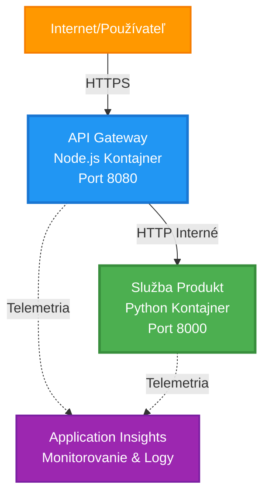
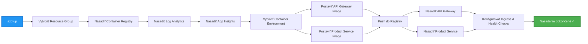

<!--
CO_OP_TRANSLATOR_METADATA:
{
  "original_hash": "eb3a4803a1e80a7f2e64f6bf63738c0f",
  "translation_date": "2025-11-23T12:37:29+00:00",
  "source_file": "examples/microservices/README.md",
  "language_code": "sk"
}
-->
# Architektúra mikroslužieb - Príklad aplikácie v kontajneri

⏱️ **Odhadovaný čas**: 25-35 minút | 💰 **Odhadované náklady**: ~50-100 USD/mesiac | ⭐ **Zložitosť**: Pokročilá

**📚 Vzdelávacia cesta:**
- ← Predchádzajúce: [Jednoduché Flask API](../../../../examples/container-app/simple-flask-api) - Základy jedného kontajnera
- 🎯 **Tu sa nachádzate**: Architektúra mikroslužieb (základ 2 služieb)
- → Ďalej: [Integrácia AI](../../../../docs/ai-foundry) - Pridanie inteligencie do vašich služieb
- 🏠 [Domov kurzu](../../README.md)

---

**Zjednodušená, ale funkčná** architektúra mikroslužieb nasadená do Azure Container Apps pomocou AZD CLI. Tento príklad demonštruje komunikáciu medzi službami, orchestráciu kontajnerov a monitorovanie s praktickým nastavením dvoch služieb.

> **📚 Vzdelávací prístup**: Tento príklad začína s minimálnou architektúrou dvoch služieb (API Gateway + Backend Service), ktorú môžete skutočne nasadiť a učiť sa z nej. Po zvládnutí tohto základu poskytujeme pokyny na rozšírenie na plnohodnotný ekosystém mikroslužieb.

## Čo sa naučíte

Po dokončení tohto príkladu:
- Nasadíte viacero kontajnerov do Azure Container Apps
- Implementujete komunikáciu medzi službami s interným sieťovaním
- Nakonfigurujete škálovanie a zdravotné kontroly na základe prostredia
- Monitorujete distribuované aplikácie pomocou Application Insights
- Pochopíte vzory a osvedčené postupy nasadenia mikroslužieb
- Naučíte sa postupné rozširovanie od jednoduchých po zložité architektúry

## Architektúra

### Fáza 1: Čo budujeme (zahrnuté v tomto príklade)


**Detaily komponentov:**

| Komponent | Účel | Prístup | Zdroje |
|-----------|---------|--------|-----------|
| **API Gateway** | Smeruje externé požiadavky na backendové služby | Verejný (HTTPS) | 1 vCPU, 2GB RAM, 2-20 replík |
| **Product Service** | Spravuje katalóg produktov s dátami v pamäti | Len interný | 0.5 vCPU, 1GB RAM, 1-10 replík |
| **Application Insights** | Centralizované logovanie a distribuované sledovanie | Azure Portal | 1-2 GB/mesiac ingestie dát |

**Prečo začať jednoducho?**
- ✅ Rýchle nasadenie a pochopenie (25-35 minút)
- ✅ Naučte sa základné vzory mikroslužieb bez zložitosti
- ✅ Funkčný kód, ktorý môžete upravovať a experimentovať s ním
- ✅ Nižšie náklady na učenie (~50-100 USD/mesiac oproti 300-1400 USD/mesiac)
- ✅ Získajte istotu pred pridaním databáz a frontov správ

**Analógia**: Predstavte si to ako učenie sa šoférovať. Začínate na prázdnom parkovisku (2 služby), zvládnete základy a potom prejdete na mestskú premávku (5+ služieb s databázami).

### Fáza 2: Budúce rozšírenie (referenčná architektúra)

Keď zvládnete architektúru dvoch služieb, môžete ju rozšíriť na:

```mermaid
graph TB
    User[Používateľ]
    Gateway[API Brána<br/>✅ Zahrnuté]
    Product[Služba Produktov<br/>✅ Zahrnuté]
    Order[Služba Objednávok<br/>🔜 Pridať Ďalej]
    UserSvc[Služba Používateľov<br/>🔜 Pridať Ďalej]
    Notify[Služba Notifikácií<br/>🔜 Pridať Nakoniec]
    
    CosmosDB[(Cosmos DB<br/>🔜 Dáta Produktov)]
    AzureSQL[(Azure SQL<br/>🔜 Dáta Objednávok)]
    ServiceBus[Azure Service Bus<br/>🔜 Asynchrónne Udalosti]
    AppInsights[Application Insights<br/>✅ Zahrnuté]
    
    User --> Gateway
    Gateway --> Product
    Gateway --> Order
    Gateway --> UserSvc
    
    Product --> CosmosDB
    Order --> AzureSQL
    UserSvc --> AzureSQL
    
    Product -.->|Udalosť VytvorenýProdukt| ServiceBus
    ServiceBus -.->|Odoberať| Notify
    ServiceBus -.->|Odoberať| Order
    
    Gateway -.-> AppInsights
    Product -.-> AppInsights
    Order -.-> AppInsights
    UserSvc -.-> AppInsights
    Notify -.-> AppInsights
    
    style Product fill:#4CAF50,stroke:#388E3C,stroke-width:3px,color:#fff
    style Gateway fill:#2196F3,stroke:#1976D2,stroke-width:3px,color:#fff
    style Order fill:#9E9E9E,stroke:#616161,stroke-width:2px,color:#fff
    style UserSvc fill:#9E9E9E,stroke:#616161,stroke-width:2px,color:#fff
    style Notify fill:#9E9E9E,stroke:#616161,stroke-width:2px,color:#fff
```


Pozrite si sekciu "Príručka rozšírenia" na konci pre podrobné pokyny.

## Zahrnuté funkcie

✅ **Objavovanie služieb**: Automatické DNS objavovanie medzi kontajnermi  
✅ **Vyvažovanie záťaže**: Zabudované vyvažovanie záťaže medzi replikami  
✅ **Automatické škálovanie**: Nezávislé škálovanie pre každú službu na základe HTTP požiadaviek  
✅ **Monitorovanie zdravia**: Liveness a readiness kontroly pre obe služby  
✅ **Distribuované logovanie**: Centralizované logovanie pomocou Application Insights  
✅ **Interné sieťovanie**: Bezpečná komunikácia medzi službami  
✅ **Orchestrácia kontajnerov**: Automatické nasadenie a škálovanie  
✅ **Aktualizácie bez výpadkov**: Rolling updates s manažmentom revízií  

## Predpoklady

### Potrebné nástroje

Pred začiatkom overte, že máte nainštalované tieto nástroje:

1. **[Azure Developer CLI (azd)](https://learn.microsoft.com/azure/developer/azure-developer-cli/install-azd)** (verzia 1.0.0 alebo vyššia)
   ```bash
   azd version
   # Očakávaný výstup: azd verzia 1.0.0 alebo vyššia
   ```

2. **[Azure CLI](https://learn.microsoft.com/cli/azure/install-azure-cli)** (verzia 2.50.0 alebo vyššia)
   ```bash
   az --version
   # Očakávaný výstup: azure-cli 2.50.0 alebo vyšší
   ```

3. **[Docker](https://www.docker.com/get-started)** (na lokálny vývoj/testovanie - voliteľné)
   ```bash
   docker --version
   # Očakávaný výstup: Docker verzia 20.10 alebo vyššia
   ```

### Overte svoje nastavenie

Spustite tieto príkazy na potvrdenie pripravenosti:

```bash
# Skontrolujte Azure Developer CLI
azd version
# ✅ Očakávané: azd verzia 1.0.0 alebo vyššia

# Skontrolujte Azure CLI
az --version
# ✅ Očakávané: azure-cli 2.50.0 alebo vyššia

# Skontrolujte Docker (voliteľné)
docker --version
# ✅ Očakávané: Docker verzia 20.10 alebo vyššia
```

**Kritériá úspechu**: Všetky príkazy vrátia čísla verzií, ktoré zodpovedajú minimálnym požiadavkám alebo ich prekračujú.

### Požiadavky na Azure

- Aktívne **Azure predplatné** ([vytvorte si bezplatný účet](https://azure.microsoft.com/free/))
- Oprávnenia na vytváranie zdrojov vo vašom predplatnom
- **Rola prispievateľa** v predplatnom alebo skupine zdrojov

### Požiadavky na vedomosti

Toto je príklad na **pokročilej úrovni**. Mali by ste mať:
- Dokončený [príklad Jednoduché Flask API](../../../../examples/container-app/simple-flask-api) 
- Základné pochopenie architektúry mikroslužieb
- Znalosť REST API a HTTP
- Pochopenie konceptov kontajnerov

**Nováčik v Container Apps?** Začnite s [príkladom Jednoduché Flask API](../../../../examples/container-app/simple-flask-api) na osvojenie základov.

## Rýchly štart (krok za krokom)

### Krok 1: Klonujte a prejdite

```bash
git clone https://github.com/microsoft/AZD-for-beginners.git
cd AZD-for-beginners/examples/microservices
```

**✓ Kontrola úspechu**: Overte, že vidíte `azure.yaml`:
```bash
ls
# Očakávané: README.md, azure.yaml, infra/, src/
```

### Krok 2: Autentifikujte sa s Azure

```bash
azd auth login
```

Týmto sa otvorí váš prehliadač na autentifikáciu Azure. Prihláste sa so svojimi Azure povereniami.

**✓ Kontrola úspechu**: Mali by ste vidieť:
```
Logged in to Azure.
```

### Krok 3: Inicializujte prostredie

```bash
azd init
```

**Výzvy, ktoré uvidíte**:
- **Názov prostredia**: Zadajte krátky názov (napr. `microservices-dev`)
- **Azure predplatné**: Vyberte svoje predplatné
- **Azure lokalita**: Vyberte región (napr. `eastus`, `westeurope`)

**✓ Kontrola úspechu**: Mali by ste vidieť:
```
SUCCESS: New project initialized!
```

### Krok 4: Nasadenie infraštruktúry a služieb

```bash
azd up
```

**Čo sa deje** (trvá 8-12 minút):


**✓ Kontrola úspechu**: Mali by ste vidieť:
```
SUCCESS: Your application was deployed to Azure in X minutes Y seconds.
Endpoint: https://api-gateway-<unique-id>.azurecontainerapps.io
```

**⏱️ Čas**: 8-12 minút

### Krok 5: Otestujte nasadenie

```bash
# Získajte koncový bod brány
GATEWAY_URL=$(azd env get-values | grep API_GATEWAY_URL | cut -d '=' -f2 | tr -d '"')

# Otestujte zdravie API Gateway
curl $GATEWAY_URL/health
```

**✅ Očakávaný výstup:**
```json
{
  "status": "healthy",
  "service": "api-gateway",
  "timestamp": "2025-11-19T10:30:00Z"
}
```

**Testujte službu produktov cez bránu:**
```bash
# Zoznam produktov
curl $GATEWAY_URL/api/products
```

**✅ Očakávaný výstup:**
```json
[
  {"id":1,"name":"Laptop","price":999.99,"stock":50},
  {"id":2,"name":"Mouse","price":29.99,"stock":200},
  {"id":3,"name":"Keyboard","price":79.99,"stock":150}
]
```

**✓ Kontrola úspechu**: Obe koncové body vrátia JSON dáta bez chýb.

---

**🎉 Gratulujeme!** Nasadili ste architektúru mikroslužieb do Azure!

## Štruktúra projektu

Všetky implementačné súbory sú zahrnuté—toto je kompletný, funkčný príklad:

```
microservices/
│
├── README.md                         # This file
├── azure.yaml                        # AZD configuration
├── .gitignore                        # Git ignore patterns
│
├── infra/                           # Infrastructure as Code (Bicep)
│   ├── main.bicep                   # Main orchestration
│   ├── abbreviations.json           # Naming conventions
│   ├── core/                        # Shared infrastructure
│   │   ├── container-apps-environment.bicep  # Container environment + registry
│   │   └── monitor.bicep            # Application Insights + Log Analytics
│   └── app/                         # Service definitions
│       ├── api-gateway.bicep        # API Gateway container app
│       └── product-service.bicep    # Product Service container app
│
└── src/                             # Application source code
    ├── api-gateway/                 # Node.js API Gateway
    │   ├── app.js                   # Express server with routing
    │   ├── package.json             # Node dependencies
    │   └── Dockerfile               # Container definition
    └── product-service/             # Python Product Service
        ├── main.py                  # Flask API with product data
        ├── requirements.txt         # Python dependencies
        └── Dockerfile               # Container definition
```

**Čo robí každý komponent:**

**Infraštuktúra (infra/)**:
- `main.bicep`: Orchestruje všetky Azure zdroje a ich závislosti
- `core/container-apps-environment.bicep`: Vytvára prostredie Container Apps a Azure Container Registry
- `core/monitor.bicep`: Nastavuje Application Insights pre distribuované logovanie
- `app/*.bicep`: Definície jednotlivých kontajnerových aplikácií so škálovaním a zdravotnými kontrolami

**API Gateway (src/api-gateway/)**:
- Verejne prístupná služba, ktorá smeruje požiadavky na backendové služby
- Implementuje logovanie, spracovanie chýb a presmerovanie požiadaviek
- Demonštruje HTTP komunikáciu medzi službami

**Product Service (src/product-service/)**:
- Interná služba s katalógom produktov (v pamäti pre jednoduchosť)
- REST API so zdravotnými kontrolami
- Príklad vzoru backendovej mikroslužby
3. Znovu nasadiť obe služby:

```bash
azd deploy product-service
azd deploy api-gateway
```

4. Otestovať nový endpoint:

```bash
GATEWAY_URL=$(azd env get-values | grep API_GATEWAY_URL | cut -d '=' -f2 | tr -d '"')

# Vytvorte nový produkt
curl -X POST $GATEWAY_URL/api/products \
  -H "Content-Type: application/json" \
  -d '{"name":"USB Cable","price":9.99,"stock":500}'
```

**✅ Očakávaný výstup:**
```json
{"id":6,"name":"USB Cable","description":"","price":9.99,"stock":500}
```

5. Overiť, že sa objaví v zozname:

```bash
curl $GATEWAY_URL/api/products
# Teraz by malo zobrazovať 6 produktov vrátane nového USB kábla
```

**Kritériá úspechu**:
- ✅ POST požiadavka vráti HTTP 201
- ✅ Nový produkt sa objaví v zozname GET /api/products
- ✅ Produkt má automaticky inkrementované ID

**Čas**: 10-15 minút

---

### Cvičenie 2: Upraviť pravidlá autoscalingu ⭐⭐ (Stredne pokročilé)

**Cieľ**: Zmeniť Product Service na agresívnejšie škálovanie

**Východiskový bod**: `infra/app/product-service.bicep`

**Kroky**:

1. Otvorte `infra/app/product-service.bicep` a nájdite blok `scale` (okolo riadku 95)

2. Zmeňte z:
```bicep
scale: {
  minReplicas: 1
  maxReplicas: 10
  rules: [
    {
      name: 'http-scale-rule'
      http: {
        metadata: {
          concurrentRequests: '100'  // OLD
        }
      }
    }
  ]
}
```

Na:
```bicep
scale: {
  minReplicas: 2  // Always have 2 running
  maxReplicas: 20  // Allow more scaling
  rules: [
    {
      name: 'http-scale-rule'
      http: {
        metadata: {
          concurrentRequests: '20'  // Scale at lower threshold
        }
      }
    }
  ]
}
```

3. Znovu nasadiť infraštruktúru:

```bash
azd up
```

4. Overiť novú konfiguráciu škálovania:

```bash
az containerapp show \
  --name $(azd env get-values | grep PRODUCT_SERVICE | head -1 | cut -d '/' -f5) \
  --resource-group $(azd env get-values | grep AZURE_RESOURCE_GROUP | cut -d '=' -f2 | tr -d '"') \
  --query "properties.template.scale" -o json
```

**✅ Očakávaný výstup:**
```json
{
  "minReplicas": 2,
  "maxReplicas": 20,
  "rules": [...]
}
```

5. Otestovať autoscaling pod záťažou:

```bash
# Generovať súbežné požiadavky
for i in {1..500}; do curl $GATEWAY_URL/api/products & done

# Sledujte, ako prebieha škálovanie
azd logs product-service --follow
# Hľadajte: Udalosti škálovania aplikácií kontajnera
```

**Kritériá úspechu**:
- ✅ Product Service vždy beží minimálne na 2 replikách
- ✅ Pod záťažou sa škáluje na viac ako 2 repliky
- ✅ Azure Portal zobrazuje nové pravidlá škálovania

**Čas**: 15-20 minút

---

### Cvičenie 3: Pridať vlastný monitorovací dotaz ⭐⭐ (Stredne pokročilé)

**Cieľ**: Vytvoriť vlastný dotaz v Application Insights na sledovanie výkonu API produktu

**Kroky**:

1. Prejdite do Application Insights v Azure Portali:
   - Otvorte Azure Portal
   - Nájdite svoju resource group (rg-microservices-*)
   - Kliknite na Application Insights zdroj

2. Kliknite na "Logs" v ľavom menu

3. Vytvorte tento dotaz:

```kusto
requests
| where timestamp > ago(1h)
| where name contains "products"
| summarize 
    RequestCount = count(),
    AvgDuration = avg(duration),
    P95Duration = percentile(duration, 95),
    SuccessRate = 100.0 * countif(success == true) / count()
  by bin(timestamp, 5m)
| render timechart
```

4. Kliknite na "Run" na vykonanie dotazu

5. Uložte dotaz:
   - Kliknite na "Save"
   - Názov: "Product API Performance"
   - Kategória: "Performance"

6. Generujte testovaciu prevádzku:

```bash
for i in {1..100}; do curl $GATEWAY_URL/api/products; sleep 1; done
```

7. Obnovte dotaz na zobrazenie údajov

**✅ Očakávaný výstup:**
- Graf zobrazujúci počet požiadaviek v čase
- Priemerné trvanie < 500ms
- Úspešnosť = 100%
- Časové intervaly 5 minút

**Kritériá úspechu**:
- ✅ Dotaz zobrazuje 100+ požiadaviek
- ✅ Úspešnosť je 100%
- ✅ Priemerné trvanie < 500ms
- ✅ Graf zobrazuje 5-minútové intervaly

**Výsledok učenia**: Pochopenie monitorovania výkonu služby pomocou vlastných dotazov

**Čas**: 10-15 minút

---

### Cvičenie 4: Implementovať logiku opakovania požiadaviek ⭐⭐⭐ (Pokročilé)

**Cieľ**: Pridať logiku opakovania požiadaviek do API Gateway, keď je Product Service dočasne nedostupná

**Východiskový bod**: `src/api-gateway/app.js`

**Kroky**:

1. Nainštalovať knižnicu pre opakovanie:

```bash
cd src/api-gateway
npm install axios-retry --save
cd ../..
```

2. Aktualizovať `src/api-gateway/app.js` (pridať po importe axios):

```javascript
const axiosRetry = require('axios-retry');

// Nakonfigurujte logiku opakovania
axiosRetry(axios, {
  retries: 3,
  retryDelay: (retryCount) => {
    return retryCount * 1000; // 1s, 2s, 3s
  },
  retryCondition: (error) => {
    // Opakujte pri sieťových chybách alebo odpovediach 5xx
    return axiosRetry.isNetworkOrIdempotentRequestError(error) ||
           (error.response && error.response.status >= 500);
  }
});

console.log('Retry logic configured: 3 retries with exponential backoff');
```

3. Znovu nasadiť API Gateway:

```bash
azd deploy api-gateway
```

4. Otestovať správanie opakovania simuláciou zlyhania služby:

```bash
# Zmenšiť službu produktu na 0 (simulovať zlyhanie)
az containerapp update \
  --name $(azd env get-values | grep PRODUCT_SERVICE | head -1 | cut -d '/' -f5) \
  --resource-group $(azd env get-values | grep AZURE_RESOURCE_GROUP | cut -d '=' -f2 | tr -d '"') \
  --min-replicas 0 \
  --max-replicas 0

# Pokúsiť sa získať prístup k produktom (bude sa opakovať 3-krát)
time curl -v $GATEWAY_URL/api/products
# Pozorovať: Odozva trvá ~6 sekúnd (1s + 2s + 3s opakovania)

# Obnoviť službu produktu
az containerapp update \
  --name $(azd env get-values | grep PRODUCT_SERVICE | head -1 | cut -d '/' -f5) \
  --resource-group $(azd env get-values | grep AZURE_RESOURCE_GROUP | cut -d '=' -f2 | tr -d '"') \
  --min-replicas 1 \
  --max-replicas 10
```

5. Zobraziť logy opakovania:

```bash
azd logs api-gateway --tail 50
# Hľadať: Správy o pokuse o opätovné vykonanie
```

**✅ Očakávané správanie:**
- Požiadavky sa opakujú 3-krát pred zlyhaním
- Každé opakovanie čaká dlhšie (1s, 2s, 3s)
- Úspešné požiadavky po reštarte služby
- Logy zobrazujú pokusy o opakovanie

**Kritériá úspechu**:
- ✅ Požiadavky sa opakujú 3-krát pred zlyhaním
- ✅ Každé opakovanie čaká dlhšie (exponenciálne oneskorenie)
- ✅ Úspešné požiadavky po reštarte služby
- ✅ Logy zobrazujú pokusy o opakovanie

**Výsledok učenia**: Pochopenie vzorov odolnosti v mikroslužbách (obvodové ističe, opakovania, časové limity)

**Čas**: 20-25 minút

---

## Kontrolný bod vedomostí

Po dokončení tohto príkladu si overte svoje znalosti:

### 1. Komunikácia medzi službami ✓

Otestujte svoje znalosti:
- [ ] Viete vysvetliť, ako API Gateway objavuje Product Service? (DNS-based service discovery)
- [ ] Čo sa stane, ak je Product Service nedostupná? (Gateway vráti 503 chybu)
- [ ] Ako by ste pridali tretiu službu? (Vytvorte nový Bicep súbor, pridajte do main.bicep, vytvorte src priečinok)

**Praktické overenie:**
```bash
# Simulovať zlyhanie služby
az containerapp update --name <product-service-name> --min-replicas 0 --max-replicas 0
curl $GATEWAY_URL/api/products
# ✅ Očakávané: 503 Služba nedostupná

# Obnoviť službu
az containerapp update --name <product-service-name> --min-replicas 1 --max-replicas 10
```

### 2. Monitorovanie a pozorovateľnosť ✓

Otestujte svoje znalosti:
- [ ] Kde vidíte distribuované logy? (Application Insights v Azure Portali)
- [ ] Ako sledujete pomalé požiadavky? (Kusto dotaz: `requests | where duration > 1000`)
- [ ] Viete identifikovať, ktorá služba spôsobila chybu? (Skontrolujte pole `cloud_RoleName` v logoch)

**Praktické overenie:**
```bash
# Vytvorte simuláciu pomalého požiadavku
curl "$GATEWAY_URL/api/products?delay=2000"

# Dotazujte sa na Application Insights pre pomalé požiadavky
# Prejdite na Azure Portal → Application Insights → Logs
# Spustite: requests | where duration > 1000 | project timestamp, name, duration, cloud_RoleName
```

### 3. Škálovanie a výkon ✓

Otestujte svoje znalosti:
- [ ] Čo spúšťa autoscaling? (Pravidlá pre súbežné HTTP požiadavky: 50 pre gateway, 100 pre produkt)
- [ ] Koľko replík teraz beží? (Skontrolujte pomocou `az containerapp revision list`)
- [ ] Ako by ste škálovali Product Service na 5 replík? (Aktualizujte minReplicas v Bicep)

**Praktické overenie:**
```bash
# Generovať záťaž na testovanie automatického škálovania
for i in {1..1000}; do curl $GATEWAY_URL/api/products & done

# Sledujte zvyšovanie replík
azd logs api-gateway --follow
# ✅ Očakávané: Vidieť udalosti škálovania v logoch
```

**Kritériá úspechu**: Viete odpovedať na všetky otázky a overiť pomocou praktických príkazov.

---

## Analýza nákladov

### Odhadované mesačné náklady (Pre tento príklad s 2 službami)

| Zdroj | Konfigurácia | Odhadované náklady |
|-------|--------------|--------------------|
| API Gateway | 2-20 replík, 1 vCPU, 2GB RAM | $30-150 |
| Product Service | 1-10 replík, 0.5 vCPU, 1GB RAM | $15-75 |
| Container Registry | Základná úroveň | $5 |
| Application Insights | 1-2 GB/mesiac | $5-10 |
| Log Analytics | 1 GB/mesiac | $3 |
| **Celkom** | | **$58-243/mesiac** |

### Rozpis nákladov podľa použitia

**Nízka prevádzka** (testovanie/štúdium): ~60 $/mesiac
- API Gateway: 2 repliky × 24/7 = $30
- Product Service: 1 replika × 24/7 = $15
- Monitorovanie + Registry = $13

**Stredná prevádzka** (malá produkcia): ~120 $/mesiac
- API Gateway: 5 priemerných replík = $75
- Product Service: 3 priemerné repliky = $45
- Monitorovanie + Registry = $13

**Vysoká prevádzka** (rušné obdobia): ~240 $/mesiac
- API Gateway: 15 priemerných replík = $225
- Product Service: 8 priemerných replík = $120
- Monitorovanie + Registry = $13

### Tipy na optimalizáciu nákladov

1. **Škálovanie na nulu pre vývoj**:
   ```bicep
   scale: {
     minReplicas: 0  // Save $30-40/month when not in use
     maxReplicas: 10
   }
   ```

2. **Použitie Consumption Plan pre Cosmos DB** (keď ho pridáte):
   - Platíte len za to, čo použijete
   - Žiadne minimálne poplatky

3. **Nastavenie Application Insights Sampling**:
   ```javascript
   appInsights.defaultClient.config.samplingPercentage = 50; // Vzorka 50% požiadaviek
   ```

4. **Vyčistenie po skončení používania**:
   ```bash
   azd down --force --purge
   ```

### Možnosti bezplatného používania

Pre štúdium/testovanie zvážte:
- ✅ Použitie bezplatných kreditov Azure ($200 na prvých 30 dní s novými účtami)
- ✅ Udržanie minimálneho počtu replík (ušetrenie ~50 % nákladov)
- ✅ Odstránenie po testovaní (žiadne priebežné poplatky)
- ✅ Škálovanie na nulu medzi študijnými reláciami

**Príklad**: Spustenie tohto príkladu na 2 hodiny/deň × 30 dní = ~5 $/mesiac namiesto 60 $/mesiac

---

## Rýchla referenčná príručka na riešenie problémov

### Problém: `azd up` zlyhá s "Subscription not found"

**Riešenie**:
```bash
# Prihláste sa znova s explicitným predplatným
az account set --subscription <your-subscription-id>
azd env set AZURE_SUBSCRIPTION_ID <your-subscription-id>
azd up
```

### Problém: API Gateway vracia 503 "Product service unavailable"

**Diagnostika**:
```bash
# Skontrolujte denníky služby produktu
azd logs product-service --tail 50

# Skontrolujte stav služby produktu
az containerapp show \
  --name $(azd env get-values | grep PRODUCT_SERVICE | head -1 | cut -d '/' -f5) \
  --resource-group $(azd env get-values | grep AZURE_RESOURCE_GROUP | cut -d '=' -f2 | tr -d '"') \
  --query "properties.runningStatus"
```

**Bežné príčiny**:
1. Product service sa nespustila (skontrolujte logy na Python chyby)
2. Zlyhanie kontroly stavu (overte funkčnosť endpointu `/health`)
3. Zlyhanie zostavenia obrazu kontajnera (skontrolujte registry na obraz)

### Problém: Autoscaling nefunguje

**Diagnostika**:
```bash
# Skontrolujte aktuálny počet replík
az containerapp revision list \
  --name $(azd env get-values | grep API_GATEWAY | head -1 | cut -d '/' -f5) \
  --resource-group $(azd env get-values | grep AZURE_RESOURCE_GROUP | cut -d '=' -f2 | tr -d '"') \
  --query "[].properties.replicas"

# Generujte záťaž na testovanie
for i in {1..1000}; do curl $GATEWAY_URL/api/products & done

# Sledujte udalosti škálovania
azd logs api-gateway --follow | grep -i scale
```

**Bežné príčiny**:
1. Záťaž nie je dostatočne vysoká na spustenie pravidla škálovania (potrebné >50 súbežných požiadaviek)
2. Dosiahnutý maximálny počet replík (skontrolujte konfiguráciu Bicep)
3. Nesprávne nakonfigurované pravidlo škálovania v Bicep (overte hodnotu concurrentRequests)

### Problém: Application Insights nezobrazuje logy

**Diagnostika**:
```bash
# Overte, či je nastavený reťazec pripojenia
azd env get-values | grep APPLICATIONINSIGHTS

# Skontrolujte, či služby posielajú telemetriu
az monitor app-insights component show \
  --app $(azd env get-values | grep APPLICATIONINSIGHTS_NAME | cut -d '=' -f2 | tr -d '"') \
  --resource-group $(azd env get-values | grep AZURE_RESOURCE_GROUP | cut -d '=' -f2 | tr -d '"') \
  --query "properties.InstrumentationKey"
```

**Bežné príčiny**:
1. Connection string nebol odoslaný do kontajnera (skontrolujte environment variables)
2. Application Insights SDK nie je nakonfigurovaný (overte importy v kóde)
3. Firewall blokuje telemetriu (zriedkavé, skontrolujte sieťové pravidlá)

### Problém: Docker build zlyhá lokálne

**Diagnostika**:
```bash
# Otestovať zostavenie API Gateway
cd src/api-gateway
docker build -t test-gateway .

# Otestovať zostavenie služby Product Service
cd ../product-service
docker build -t test-product .
```

**Bežné príčiny**:
1. Chýbajúce závislosti v package.json/requirements.txt
2. Syntaxové chyby v Dockerfile
3. Problémy so sieťou pri sťahovaní závislostí

**Stále máte problém?** Pozrite si [Príručku bežných problémov](../../docs/troubleshooting/common-issues.md) alebo [Azure Container Apps Troubleshooting](https://learn.microsoft.com/azure/container-apps/troubleshooting)

---

## Vyčistenie

Aby ste sa vyhli priebežným poplatkom, odstráňte všetky zdroje:

```bash
azd down --force --purge
```

**Potvrdzovací výzva**:
```
? Total resources to delete: 6, are you sure you want to continue? (y/N)
```

Napíšte `y` na potvrdenie.

**Čo sa odstráni**:
- Prostredie Container Apps
- Obe Container Apps (gateway & product service)
- Container Registry
- Application Insights
- Log Analytics Workspace
- Resource Group

**✓ Overenie vyčistenia**:
```bash
az group list --query "[?starts_with(name,'rg-microservices')]" --output table
```

Malo by vrátiť prázdne.

---

## Príručka rozšírenia: Od 2 k 5+ službám

Keď zvládnete túto architektúru s 2 službami, tu je postup rozšírenia:

### Fáza 1: Pridať perzistenciu databázy (Ďalší krok)

**Pridať Cosmos DB pre Product Service**:

1. Vytvorte `infra/core/cosmos.bicep`:
   ```bicep
   resource cosmosAccount 'Microsoft.DocumentDB/databaseAccounts@2023-04-15' = {
     name: name
     location: location
     kind: 'GlobalDocumentDB'
     properties: {
       databaseAccountOfferType: 'Standard'
       consistencyPolicy: { defaultConsistencyLevel: 'Session' }
       locations: [{ locationName: location, failoverPriority: 0 }]
     }
   }
   ```

2. Aktualizujte Product Service na používanie Azure Cosmos DB Python SDK namiesto in-memory dát

3. Odhadované dodatočné náklady: ~25 $/mesiac (serverless)

### Fáza 2: Pridať tretiu službu (Správa objednávok)

**Vytvoriť Order Service**:

1. Nový priečinok: `src/order-service/` (Python/Node.js/C#)
2. Nový Bicep: `infra/app/order-service.bicep`
3. Aktualizovať API Gateway na smerovanie `/api/orders`
4. Pridať Azure SQL Database pre perzistenciu objednávok

**Architektúra sa stáva**:
```
API Gateway → Product Service (Cosmos DB)
           → Order Service (Azure SQL)
```

### Fáza 3: Pridať asynchrónnu komunikáciu (Service Bus)

**Implementovať Event-Driven Architektúru**:

1. Pridať Azure Service Bus: `infra/core/servicebus.bicep`
2. Product Service publikuje "ProductCreated" udalosti
3. Order Service odoberá produktové udalosti
4. Pridať Notification Service na spracovanie udalostí

**Vzor**: Požiadavka/Odpoveď (HTTP) + Event-Driven (Service Bus)

### Fáza 4: Pridať autentifikáciu používateľov

**Implementovať User Service**:

1. Vytvorte `src/user-service/` (Go/Node.js)
2. Pridať Azure AD B2C alebo vlastnú autentifikáciu pomocou JWT
3. API Gateway overuje tokeny pred smerovaním
4. Služby kontrolujú oprávnenia používateľov

### Fáza 5: Pripravenosť na produkciu

**Pridať tieto komponenty**:
- ✅ Azure Front Door (globálne vyvažovanie záťaže)
- ✅ Azure Key Vault (správa tajomstiev)
- ✅ Azure Monitor Workbooks (vlastné dashboardy)
- ✅ CI/CD Pipeline (GitHub Actions)
- ✅ Blue-Green Deployments
- ✅ Managed Identity pre všetky služby

**Celkové náklady na produkčnú architektúru**: ~300-1,400 $/mesiac

---

## Viac informácií

### Súvisiaca dokumentácia
- [Dokumentácia Azure Container Apps](https://learn.microsoft.com/azure/container-apps/)
- [Príručka architektúry mikroslužieb](https://learn.microsoft.com/azure/architecture/guide/architecture-styles/microservices)
- [Application Insights pre distribuované sledovanie](https://learn.microsoft.com/azure/azure-monitor/app/distributed-tracing)
- [Dokumentácia Azure Developer CLI](https://learn.microsoft.com/azure/developer/azure-developer-cli/)

### Ďalšie kroky v tomto kurze
- ← Predchádzajúce: [Jednoduché Flask API](../../../../examples/container-app/simple-flask-api) - Začiatočnícky príklad s jedným kontajnerom
- → Ďalšie: [Príručka integrácie AI](../../../../docs/ai-foundry) - Pridať AI funkcie
- 🏠 [Domovská stránka kurzu](../../README.md)

### Porovnanie: Kedy použiť čo

| Funkcia | Jednoduchý kontajner | Mikroslužby (Tento) | Kubernetes (AKS) |
|---------|-----------------------|---------------------|------------------|
| **Použitie** | Jednoduché aplikácie | Komplexné aplikácie | Podnikové aplikácie |
| **Škálovateľnosť** | Jedna služba | Škálovanie podľa služby | Maximálna flexibilita |
| **Komplexnosť** | Nízka | Stredná | Vysoká |
| **Veľkosť tímu** | 1-3 vývojári | 3-10 vývojárov | 10+ vývojárov |
| **Náklady** | ~15-50 $/mesiac | ~60-250 $/mesiac | ~150-500 $/mesiac |
| **Čas nasadenia** | 5-10 minút | 8-12 minút | 15-30 minút |
| **Najlepšie pre** | MVP, prototypy | Produkčné aplikácie | Multi-cloud, pokročilé sieťovanie |

**Odporúčanie**: Začnite s Container Apps (tento príklad), prejdite na AKS iba v prípade, že potrebujete funkcie špecifické pre Kubernetes.

---

## Často kladené otázky

**Otázka: Prečo iba 2 služby namiesto 5+?**  
Odpoveď: Vzdelávací postup. Najskôr zvládnite základy (komunikácia medzi službami, monitorovanie, škálovanie) s jednoduchým príkladom, až potom pridávajte zložitosť. Vzory, ktoré sa tu naučíte, platia aj pre architektúry so 100 službami.

**Otázka: Môžem pridať viac služieb sám?**  
Odpoveď: Samozrejme! Postupujte podľa rozširujúceho návodu vyššie. Každá nová služba nasleduje rovnaký vzor: vytvorte priečinok src, vytvorte Bicep súbor, aktualizujte azure.yaml, nasadzujte.

**Otázka: Je to pripravené na produkciu?**  
Odpoveď: Je to pevný základ. Pre produkciu pridajte: spravovanú identitu, Key Vault, perzistentné databázy, CI/CD pipeline, monitorovacie upozornenia a stratégiu zálohovania.

**Otázka: Prečo nepoužiť Dapr alebo iný service mesh?**  
Odpoveď: Udržte to jednoduché na učenie. Keď pochopíte natívne sieťovanie Container Apps, môžete pridať Dapr pre pokročilé scenáre (správa stavu, pub/sub, väzby).

**Otázka: Ako môžem ladiť lokálne?**  
Odpoveď: Spustite služby lokálne pomocou Dockeru:  
```bash
cd src/api-gateway
docker build -t local-gateway .
docker run -p 8080:8080 -e PRODUCT_SERVICE_URL=http://localhost:8000 local-gateway
```


**Otázka: Môžem použiť rôzne programovacie jazyky?**  
Odpoveď: Áno! Tento príklad ukazuje Node.js (gateway) + Python (product service). Môžete kombinovať akékoľvek jazyky, ktoré bežia v kontajneroch: C#, Go, Java, Ruby, PHP, atď.

**Otázka: Čo ak nemám Azure kredity?**  
Odpoveď: Použite bezplatnú verziu Azure (prvých 30 dní s novými účtami získate $200 kreditov) alebo nasadzujte na krátke testovacie obdobia a okamžite ich odstráňte. Tento príklad stojí približne $2/deň.

**Otázka: Ako sa to líši od Azure Kubernetes Service (AKS)?**  
Odpoveď: Container Apps je jednoduchší (nevyžaduje znalosti Kubernetes), ale menej flexibilný. AKS vám poskytuje plnú kontrolu nad Kubernetes, ale vyžaduje viac odborných znalostí. Začnite s Container Apps, prejdite na AKS, ak to bude potrebné.

**Otázka: Môžem to použiť s existujúcimi Azure službami?**  
Odpoveď: Áno! Môžete sa pripojiť k existujúcim databázam, úložným účtom, Service Bus, atď. Aktualizujte Bicep súbory tak, aby odkazovali na existujúce zdroje namiesto vytvárania nových.

---

> **🎓 Zhrnutie vzdelávacej cesty**: Naučili ste sa nasadiť architektúru s viacerými službami s automatickým škálovaním, interným sieťovaním, centralizovaným monitorovaním a produkčne pripravenými vzormi. Tento základ vás pripraví na komplexné distribuované systémy a podnikové architektúry mikroslužieb.

**📚 Navigácia kurzu:**
- ← Predchádzajúce: [Jednoduché Flask API](../../../../examples/container-app/simple-flask-api)
- → Ďalšie: [Príklad integrácie databázy](../../../../database-app)
- 🏠 [Domov kurzu](../../README.md)
- 📖 [Najlepšie praktiky pre Container Apps](../../docs/deployment/deployment-guide.md)

---

**✨ Gratulujeme!** Dokončili ste príklad mikroslužieb. Teraz rozumiete, ako vytvárať, nasadzovať a monitorovať distribuované aplikácie na Azure Container Apps. Pripravení pridať AI funkcie? Pozrite si [Sprievodcu integráciou AI](../../../../docs/ai-foundry)!

---

<!-- CO-OP TRANSLATOR DISCLAIMER START -->
**Zrieknutie sa zodpovednosti**:  
Tento dokument bol preložený pomocou služby AI prekladu [Co-op Translator](https://github.com/Azure/co-op-translator). Aj keď sa snažíme o presnosť, prosím, berte na vedomie, že automatizované preklady môžu obsahovať chyby alebo nepresnosti. Pôvodný dokument v jeho rodnom jazyku by mal byť považovaný za autoritatívny zdroj. Pre kritické informácie sa odporúča profesionálny ľudský preklad. Nie sme zodpovední za žiadne nedorozumenia alebo nesprávne interpretácie vyplývajúce z použitia tohto prekladu.
<!-- CO-OP TRANSLATOR DISCLAIMER END -->