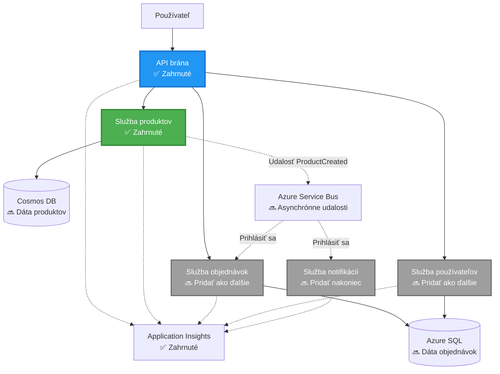
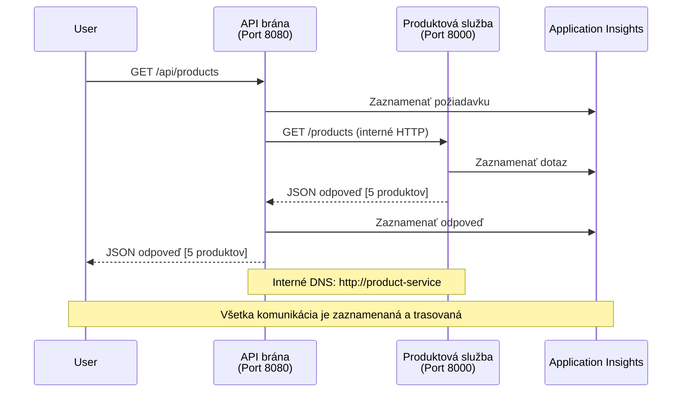

# Mikroslužbová architektúra - príklad Container App

⏱️ **Odhadovaný čas**: 25-35 minút | 💰 **Odhadované náklady**: ~$50-100/mesiac | ⭐ **Zložitosť**: Pokročilé

**📚 Vzdelávacia cesta:**
- ← Predchádzajúce: [Jednoduché Flask API](../../../../examples/container-app/simple-flask-api) - Základy jedného kontajnera
- 🎯 **Ste tu**: Mikroslužbová architektúra (základ so 2 službami)
- → Ďalej: [Integrácia AI](../../../../docs/ai-foundry) - Pridať inteligenciu do vašich služieb
- 🏠 [Domov kurzu](../../README.md)

---

A **zjednodušená, ale funkčná** mikroslužbová architektúra nasadená do Azure Container Apps pomocou AZD CLI. Tento príklad demonštruje komunikáciu medzi službami, orchestráciu kontajnerov a monitorovanie s praktickým nastavením 2 služieb.

> **📚 Prístup k učeniu**: Tento príklad začína minimálnou architektúrou zo 2 služieb (API Gateway + backend služba), ktorú si môžete skutočne nasadiť a učiť sa z nej. Po zvládnutí tohto základu poskytujeme pokyny na rozšírenie do plnej mikroslužbovej infraštruktúry.

## Čo sa naučíte

Po dokončení tohto príkladu budete:
- Nasadzovať viaceré kontajnery do Azure Container Apps
- Implementovať komunikáciu medzi službami pomocou interného sieťovania
- Konfigurovať škálovanie na základe prostredia a zdravotné kontroly
- Monitorovať distribuované aplikácie pomocou Application Insights
- Pochopiť vzory nasadzovania mikroslužieb a osvedčené postupy
- Naučiť sa postupné rozširovanie od jednoduchých po zložité architektúry

## Architektúra

### Fáza 1: Čo staviame (zahrnuté v tomto príklade)

```mermaid
graph TB
    Internet[Internet/Používateľ]
    Gateway[API brána<br/>Kontajner Node.js<br/>Port 8080]
    Product[Produktová služba<br/>Kontajner Python<br/>Port 8000]
    AppInsights[Application Insights<br/>Monitorovanie a protokoly]
    
    Internet -->|HTTPS| Gateway
    Gateway -->|HTTP (interné)| Product
    Gateway -.->|Telemetria| AppInsights
    Product -.->|Telemetria| AppInsights
    
    style Gateway fill:#2196F3,stroke:#1976D2,stroke-width:3px,color:#fff
    style Product fill:#4CAF50,stroke:#388E3C,stroke-width:3px,color:#fff
    style Internet fill:#FF9800,stroke:#F57C00,stroke-width:2px,color:#fff
    style AppInsights fill:#9C27B0,stroke:#7B1FA2,stroke-width:2px,color:#fff
```
**Detaily komponentov:**

| Komponent | Účel | Prístup | Prostriedky |
|-----------|---------|--------|-----------|
| **API Gateway** | Smeruje externé požiadavky na backendové služby | Verejný (HTTPS) | 1 vCPU, 2GB RAM, 2-20 replík |
| **Služba produktov** | Spravuje katalóg produktov s dátami v pamäti | Len interný | 0.5 vCPU, 1GB RAM, 1-10 replík |
| **Application Insights** | Centralizované logovanie a distribuované sledovanie | Azure Portal | 1-2 GB/mesiac ingest dát |

**Prečo začať jednoducho?**
- ✅ Rýchle nasadenie a pochopenie (25-35 minút)
- ✅ Naučíte sa základné vzory mikroslužieb bez zložitosti
- ✅ Funkčný kód, ktorý môžete upravovať a experimentovať
- ✅ Nižšie náklady na učenie (~$50-100/mesiac vs $300-1400/mesiac)
- ✅ Získate istotu pred pridaním databáz a frontov správ

**Analógia**: Predstavte si to ako učenie sa šoférovať. Začnete na prázdnom parkovisku (2 služby), osvojíte si základy, potom prejdete do mestského premávky (5+ služieb s databázami).

### Fáza 2: Budúce rozšírenie (Referenčná architektúra)

Keď zvládnete architektúru so 2 službami, môžete rozšíriť na:


```mermaid
graph TB
    User[Používateľ]
    Gateway[API brána<br/>✅ Zahrnuté]
    Product[Služba produktov<br/>✅ Zahrnuté]
    Order[Služba objednávok<br/>🔜 Pridať ako ďalšie]
    UserSvc[Služba používateľov<br/>🔜 Pridať ako ďalšie]
    Notify[Služba notifikácií<br/>🔜 Pridať nakoniec]
    
    CosmosDB[(Cosmos DB<br/>🔜 Dáta produktov)]
    AzureSQL[(Azure SQL<br/>🔜 Dáta objednávok)]
    ServiceBus[Azure Service Bus<br/>🔜 Asynchrónne udalosti]
    AppInsights[Application Insights<br/>✅ Zahrnuté]
    
    User --> Gateway
    Gateway --> Product
    Gateway --> Order
    Gateway --> UserSvc
    
    Product --> CosmosDB
    Order --> AzureSQL
    UserSvc --> AzureSQL
    
    Product -.->|Udalosť ProductCreated| ServiceBus
    ServiceBus -.->|Prihlásiť sa| Notify
    ServiceBus -.->|Prihlásiť sa| Order
    
    Gateway -.-> AppInsights
    Product -.-> AppInsights
    Order -.-> AppInsights
    UserSvc -.-> AppInsights
    Notify -.-> AppInsights
    
    style Product fill:#4CAF50,stroke:#388E3C,stroke-width:3px,color:#fff
    style Gateway fill:#2196F3,stroke:#1976D2,stroke-width:3px,color:#fff
    style Order fill:#9E9E9E,stroke:#616161,stroke-width:2px,color:#fff
    style UserSvc fill:#9E9E9E,stroke:#616161,stroke-width:2px,color:#fff
    style Notify fill:#9E9E9E,stroke:#616161,stroke-width:2px,color:#fff
```
Pozrite si sekciu "Príručka rozšírenia" na konci pre krok za krokom inštrukcie.

## Zahrnuté funkcie

✅ **Objavovanie služieb**: Automatické objavovanie založené na DNS medzi kontajnermi  
✅ **Vyvažovanie záťaže**: Vstavané vyvažovanie záťaže medzi replikami  
✅ **Automatické škálovanie**: Nezávislé škálovanie pre každú službu na základe HTTP požiadaviek  
✅ **Monitorovanie zdravia**: Liveness a readiness sondy pre obe služby  
✅ **Distribuované logovanie**: Centralizované logovanie s Application Insights  
✅ **Interné sieťovanie**: Bezpečná komunikácia medzi službami  
✅ **Orchestrace kontajnerov**: Automatické nasadzovanie a škálovanie  
✅ **Aktualizácie bez výpadku**: Rolling aktualizácie s riadením revízií  

## Predpoklady

### Potrebné nástroje

Pred začiatkom skontrolujte, či máte nainštalované tieto nástroje:

1. **[Azure Developer CLI (azd)](https://learn.microsoft.com/azure/developer/azure-developer-cli/install-azd)** (verzia 1.0.0 alebo vyššia)
   ```bash
   azd version
   # Očakávaný výstup: azd verzia 1.0.0 alebo vyššia
   ```

2. **[Azure CLI](https://learn.microsoft.com/cli/azure/install-azure-cli)** (verzia 2.50.0 alebo vyššia)
   ```bash
   az --version
   # Očakávaný výstup: azure-cli 2.50.0 alebo novšia verzia
   ```

3. **[Docker](https://www.docker.com/get-started)** (pre lokálny vývoj/testovanie - voliteľné)
   ```bash
   docker --version
   # Očakávaný výstup: Docker verzia 20.10 alebo novšia
   ```

### Overenie vášho nastavenia

Spustite tieto príkazy, aby ste potvrdili, že ste pripravení:

```bash
# Skontrolujte Azure Developer CLI
azd version
# ✅ Očakávané: azd verzia 1.0.0 alebo novšia

# Skontrolujte Azure CLI
az --version
# ✅ Očakávané: azure-cli 2.50.0 alebo novšia

# Skontrolujte Docker (voliteľné)
docker --version
# ✅ Očakávané: verzia Dockeru 20.10 alebo novšia
```

**Kritériá úspechu**: Všetky príkazy vrátia čísla verzií, ktoré zodpovedajú alebo prekračujú minimálne požiadavky.

### Požiadavky Azure

- Aktívne **Azure predplatné** ([vytvorte bezplatný účet](https://azure.microsoft.com/free/))
- Oprávnenia na vytváranie zdrojov vo vašom predplatnom
- **Prispievateľ (Contributor)** na predplatnom alebo skupine zdrojov

### Požiadavky na vedomosti

Toto je príklad pre pokročilú úroveň. Mali by ste mať:
- Dokončený [Jednoduché Flask API](../../../../examples/container-app/simple-flask-api) 
- Základné pochopenie mikroslužbovej architektúry
- Znalosť REST API a HTTP
- Pochopenie konceptov kontajnerov

**Nový v Container Apps?** Začnite najprv s [Jednoduché Flask API](../../../../examples/container-app/simple-flask-api), aby ste sa naučili základy.

## Rýchly štart (krok za krokom)

### Krok 1: Klonovanie a navigácia

```bash
git clone https://github.com/microsoft/AZD-for-beginners.git
cd AZD-for-beginners/examples/microservices
```

**✓ Overenie úspechu**: Skontrolujte, či vidíte `azure.yaml`:
```bash
ls
# Očakávané: README.md, azure.yaml, infra/, src/
```

### Krok 2: Autentifikácia v Azure

```bash
azd auth login
```

Toto otvorí váš prehliadač na autentifikáciu v Azure. Prihláste sa pomocou svojich Azure prihlasovacích údajov.

**✓ Overenie úspechu**: Mali by ste vidieť:
```
Logged in to Azure.
```

### Krok 3: Inicializujte prostredie

```bash
azd init
```

**Výzvy, ktoré uvidíte**:
- **Názov prostredia**: Zadajte krátky názov (napr. `microservices-dev`)
- **Azure predplatné**: Vyberte svoje predplatné
- **Azure umiestnenie**: Vyberte región (napr. `eastus`, `westeurope`)

**✓ Overenie úspechu**: Mali by ste vidieť:
```
SUCCESS: New project initialized!
```

### Krok 4: Nasadiť infraštruktúru a služby

```bash
azd up
```

**Čo sa stane** (trvá 8-12 minút):


```mermaid
graph LR
    A[azd spustiť] --> B[Vytvoriť skupinu prostriedkov]
    B --> C[Nasadiť register kontajnerov]
    C --> D[Nasadiť Log Analytics]
    D --> E[Nasadiť App Insights]
    E --> F[Vytvoriť kontajnerové prostredie]
    F --> G[Vytvoriť obraz API brány]
    F --> H[Vytvoriť obraz služby produktu]
    G --> I[Odoslať do registru]
    H --> I
    I --> J[Nasadiť API bránu]
    I --> K[Nasadiť službu produktu]
    J --> L[Konfigurovať Ingress a kontroly stavu]
    K --> L
    L --> M[Nasadenie dokončené ✓]
    
    style A fill:#2196F3,stroke:#1976D2,stroke-width:3px,color:#fff
    style M fill:#4CAF50,stroke:#388E3C,stroke-width:3px,color:#fff
```
**✓ Overenie úspechu**: Mali by ste vidieť:
```
SUCCESS: Your application was deployed to Azure in X minutes Y seconds.
Endpoint: https://api-gateway-<unique-id>.azurecontainerapps.io
```

**⏱️ Čas**: 8-12 minút

### Krok 5: Otestujte nasadenie

```bash
# Získať koncový bod brány
GATEWAY_URL=$(azd env get-values | grep API_GATEWAY_URL | cut -d '=' -f2 | tr -d '"')

# Otestovať stav API brány
curl $GATEWAY_URL/health
```

**✅ Očakávaný výstup:**
```json
{
  "status": "healthy",
  "service": "api-gateway",
  "timestamp": "2025-11-19T10:30:00Z"
}
```

**Otestujte službu produktov cez bránu**:
```bash
# Zoznam produktov
curl $GATEWAY_URL/api/products
```

**✅ Očakávaný výstup:**
```json
[
  {"id":1,"name":"Laptop","price":999.99,"stock":50},
  {"id":2,"name":"Mouse","price":29.99,"stock":200},
  {"id":3,"name":"Keyboard","price":79.99,"stock":150}
]
```

**✓ Overenie úspechu**: Obe koncové body vrátia JSON údaje bez chýb.

---

**🎉 Gratulujeme!** Nasadili ste mikroslužbovú architektúru do Azure!

## Štruktúra projektu

Všetky implementačné súbory sú zahrnuté—ide o kompletný funkčný príklad:

```
microservices/
│
├── README.md                         # This file
├── azure.yaml                        # AZD configuration
├── .gitignore                        # Git ignore patterns
│
├── infra/                           # Infrastructure as Code (Bicep)
│   ├── main.bicep                   # Main orchestration
│   ├── abbreviations.json           # Naming conventions
│   ├── core/                        # Shared infrastructure
│   │   ├── container-apps-environment.bicep  # Container environment + registry
│   │   └── monitor.bicep            # Application Insights + Log Analytics
│   └── app/                         # Service definitions
│       ├── api-gateway.bicep        # API Gateway container app
│       └── product-service.bicep    # Product Service container app
│
└── src/                             # Application source code
    ├── api-gateway/                 # Node.js API Gateway
    │   ├── app.js                   # Express server with routing
    │   ├── package.json             # Node dependencies
    │   └── Dockerfile               # Container definition
    └── product-service/             # Python Product Service
        ├── main.py                  # Flask API with product data
        ├── requirements.txt         # Python dependencies
        └── Dockerfile               # Container definition
```

**Čo robí každý komponent:**

**Infraštruktúra (infra/)**:
- `main.bicep`: Orchestruje všetky Azure zdroje a ich závislosti
- `core/container-apps-environment.bicep`: Vytvára Container Apps prostredie a Azure Container Registry
- `core/monitor.bicep`: Nastavuje Application Insights pre distribuované logovanie
- `app/*.bicep`: Individuálne definície container app s škálovaním a kontrolami zdravia

**API Gateway (src/api-gateway/)**:
- Verejne orientovaná služba, ktorá smeruje požiadavky na backendové služby
- Implementuje logovanie, spracovanie chýb a preposielanie požiadaviek
- Ukážka HTTP komunikácie medzi službami

**Služba produktov (src/product-service/)**:
- Interná služba s katalógom produktov (v pamäti pre jednoduchosť)
- REST API s kontrolami zdravia
- Príklad backendového mikroslužbového vzoru

## Prehľad služieb

### API Gateway (Node.js/Express)

**Port**: 8080  
**Prístup**: Verejný (externý ingress)  
**Účel**: Smeruje prichádzajúce požiadavky na príslušné backendové služby  

**Koncové body**:
- `GET /` - Informácie o službe
- `GET /health` - Endpoint kontroly zdravia
- `GET /api/products` - Preposiela na službu produktov (zoznam)
- `GET /api/products/:id` - Preposiela na službu produktov (získa podľa ID)

**Kľúčové vlastnosti**:
- Smerovanie požiadaviek pomocou axios
- Centralizované logovanie
- Spracovanie chýb a manažment timeoutov
- Objevovanie služieb cez premenné prostredia
- Integrácia s Application Insights

**Ukážka kódu** (`src/api-gateway/app.js`):
```javascript
// Interná komunikácia medzi službami
app.get('/api/products', async (req, res) => {
  const response = await axios.get(`${PRODUCT_SERVICE_URL}/products`, {
    timeout: 5000
  });
  res.json(response.data);
});
```

### Služba produktov (Python/Flask)

**Port**: 8000  
**Prístup**: Len interný (žiadny externý ingress)  
**Účel**: Spravuje katalóg produktov s dátami v pamäti  

**Koncové body**:
- `GET /` - Informácie o službe
- `GET /health` - Endpoint kontroly zdravia
- `GET /products` - Zoznam všetkých produktov
- `GET /products/<id>` - Získa produkt podľa ID

**Kľúčové vlastnosti**:
- RESTful API s Flask
- Úložisko produktov v pamäti (jednoduché, bez databázy)
- Monitorovanie zdravia pomocou sond
- Štruktúrované logovanie
- Integrácia s Application Insights

**Dátový model**:
```python
{
  "id": 1,
  "name": "Laptop",
  "description": "High-performance laptop",
  "price": 999.99,
  "stock": 50
}
```

**Prečo len interný?**
Služba produktov nie je verejne vystavená. Všetky požiadavky musia prejsť cez API Gateway, ktorá poskytuje:
- Bezpečnosť: Kontrolovaný prístupový bod
- Flexibilitu: Môže meniť backend bez vplývania na klientov
- Monitorovanie: Centralizované logovanie požiadaviek

## Pochopenie komunikácie medzi službami

### Ako si služby navzájom komunikujú


```mermaid
sequenceDiagram
    participant User
    participant Gateway as API brána<br/>(Port 8080)
    participant Product as Produktová služba<br/>(Port 8000)
    participant AI as Application Insights
    
    User->>Gateway: GET /api/products
    Gateway->>AI: Zaznamenať požiadavku
    Gateway->>Product: GET /products (interné HTTP)
    Product->>AI: Zaznamenať dotaz
    Product-->>Gateway: JSON odpoveď [5 produktov]
    Gateway->>AI: Zaznamenať odpoveď
    Gateway-->>User: JSON odpoveď [5 produktov]
    
    Note over Gateway,Product: Interné DNS: http://product-service
    Note over User,AI: Všetka komunikácia je zaznamenaná a trasovaná
```
V tomto príklade API Gateway komunikuje so Službou produktov pomocou **interných HTTP volaní**:

```javascript
// API brána (src/api-gateway/app.js)
const PRODUCT_SERVICE_URL = process.env.PRODUCT_SERVICE_URL;

// Vykonať vnútornú HTTP požiadavku
const response = await axios.get(`${PRODUCT_SERVICE_URL}/products`);
```

**Kľúčové body**:

1. **Objavovanie na základe DNS**: Container Apps automaticky poskytuje DNS pre interné služby
   - Product Service FQDN: `product-service.internal.<environment>.azurecontainerapps.io`
   - Zjednodušene ako: `http://product-service` (Container Apps to vyrieši)

2. **Žiadne verejné vystavenie**: Product Service má `external: false` v Bicep
   - Prístupné len v rámci Container Apps prostredia
   - Nie je dosiahnuteľné z internetu

3. **Premenné prostredia**: URL služieb sa vkladajú pri nasadení
   - Bicep odovzdáva interné FQDN do gateway
   - V aplikačnom kóde nie sú žiadne pevne zakódované URL

**Analógia**: Predstavte si to ako kancelárske miestnosti. API Gateway je recepcia (verejne orientovaná) a Služba produktov je kancelária (len interné). Návštevníci musia prejsť cez recepciu, aby sa dostali do kancelárie.

## Možnosti nasadenia

### Plné nasadenie (odporúčané)

```bash
# Nasadiť infraštruktúru a obe služby
azd up
```

Toto nasadí:
1. Container Apps prostredie
2. Application Insights
3. Container Registry
4. Kontajner API Gateway
5. Kontajner Služby produktov

**Čas**: 8-12 minút

### Nasadiť jednotlivú službu

```bash
# Nasadiť iba jednu službu (po počiatočnom azd up)
azd deploy api-gateway

# Alebo nasadiť produktovú službu
azd deploy product-service
```

**Prípad použitia**: Keď ste upravili kód v jednej službe a chcete znovu nasadiť len túto službu.

### Aktualizovať konfiguráciu

```bash
# Zmeniť parametre škálovania
azd env set GATEWAY_MAX_REPLICAS 30

# Znovu nasadiť s novou konfiguráciou
azd up
```

## Konfigurácia

### Konfigurácia škálovania

Obe služby sú v ich Bicep súboroch nakonfigurované s HTTP-based autoscalingom:

**API Gateway**:
- Min. replík: 2 (vždy aspoň 2 pre dostupnosť)
- Max. replík: 20
- Spúšťač škálovania: 50 súbežných požiadaviek na repliku

**Služba produktov**:
- Min. replík: 1 (môže sa podľa potreby škálovať na nulu)
- Max. replík: 10
- Spúšťač škálovania: 100 súbežných požiadaviek na repliku

**Prispôsobiť škálovanie** (v `infra/app/*.bicep`):
```bicep
scale: {
  minReplicas: 1
  maxReplicas: 10
  rules: [
    {
      name: 'http-scale-rule'
      http: {
        metadata: {
          concurrentRequests: '100'  // Adjust this
        }
      }
    }
  ]
}
```

### Pridelenie prostriedkov

**API Gateway**:
- CPU: 1.0 vCPU
- Pamäť: 2 GiB
- Dôvod: Spracováva celý externý traffic

**Služba produktov**:
- CPU: 0.5 vCPU
- Pamäť: 1 GiB
- Dôvod: Ľahké operácie v pamäti

### Kontroly zdravia

Obe služby zahŕňajú liveness a readiness sondy:

```bicep
probes: [
  {
    type: 'Liveness'
    httpGet: {
      path: '/health'
      port: 8080
    }
    initialDelaySeconds: 10
    periodSeconds: 30
  }
  {
    type: 'Readiness'
    httpGet: {
      path: '/health'
      port: 8080
    }
    initialDelaySeconds: 5
    periodSeconds: 10
  }
]
```

**Čo to znamená**:
- **Liveness**: Ak kontrola zdravia zlyhá, Container Apps reštartuje kontajner
- **Readiness**: Ak nie je pripravená, Container Apps prestane smerovať traffic na danú repliku

## Monitorovanie a pozorovateľnosť

### Zobraziť logy služieb

```bash
# Zobraziť logy pomocou azd monitora
azd monitor --logs

# Alebo použite Azure CLI pre konkrétne Container Apps:
# Streamujte logy z API Gateway
az containerapp logs show --name api-gateway --resource-group $RG_NAME --follow

# Zobraziť nedávne logy služby produktu
az containerapp logs show --name product-service --resource-group $RG_NAME --tail 100
```

**Očakávaný výstup**:
```
[api-gateway] API Gateway listening on port 8080
[api-gateway] Product Service URL: http://product-service
[api-gateway] GET /api/products 200 - 45ms
[product-service] Retrieved 5 products
```

### Dopyty pre Application Insights

Otvorte Application Insights v Azure Portal, potom spustite tieto dopyty:

**Nájsť pomalé požiadavky**:
```kusto
requests
| where timestamp > ago(1h)
| where duration > 1000  // Requests taking >1 second
| summarize count() by name, cloud_RoleName
| order by count_ desc
```

**Sledovať volania medzi službami**:
```kusto
dependencies
| where timestamp > ago(1h)
| where type == "Http"
| project timestamp, name, target, duration, success
| order by timestamp desc
```

**Miera chýb podľa služby**:
```kusto
exceptions
| where timestamp > ago(24h)
| summarize errorCount = count() by cloud_RoleName, type
| order by errorCount desc
```

**Objem požiadaviek v čase**:
```kusto
requests
| where timestamp > ago(1h)
| summarize requestCount = count() by bin(timestamp, 5m), cloud_RoleName
| render timechart
```

### Prístup k dashboardu monitorovania

```bash
# Získať podrobnosti o Application Insights
azd env get-values | grep APPLICATIONINSIGHTS

# Otvoriť monitorovanie v Azure portáli
az monitor app-insights component show \
  --app $(azd env get-values | grep APPLICATIONINSIGHTS_CONNECTION_STRING | cut -d '=' -f2) \
  --resource-group $(azd env get-values | grep AZURE_RESOURCE_GROUP | cut -d '=' -f2) \
  --query "appId" -o tsv
```

### Živé metriky

1. Prejdite do Application Insights v Azure Portal
2. Kliknite na "Live Metrics"
3. Uvidíte realtime požiadavky, zlyhania a výkon
4. Otestujte spustením: `curl $(azd env get-values | grep API_GATEWAY_URL | cut -d '=' -f2 | tr -d '"')/api/products`

## Praktické cvičenia

### Cvičenie 1: Pridať nové endpoint pre produkt ⭐ (ľahké)

**Cieľ**: Pridať POST endpoint na vytváranie nových produktov

**Východiskový bod**: `src/product-service/main.py`

**Kroky**:

1. Pridajte tento endpoint za funkciu `get_product` v `main.py`:

```python
@app.route('/products', methods=['POST'])
def create_product():
    """Create a new product"""
    data = request.get_json()
    
    # Overiť povinné polia
    if not data or 'name' not in data or 'price' not in data:
        return jsonify({'error': 'Missing required fields: name, price'}), 400
    
    new_id = max(p['id'] for p in products) + 1
    new_product = {
        'id': new_id,
        'name': data['name'],
        'description': data.get('description', ''),
        'price': float(data['price']),
        'stock': int(data.get('stock', 0))
    }
    products.append(new_product)
    logger.info(f"Created product {new_id}")
    return jsonify(new_product), 201
```

2. Pridajte POST routu do API Gateway (`src/api-gateway/app.js`):

```javascript
// Pridajte toto za trasu GET /api/products
app.post('/api/products', async (req, res) => {
  try {
    console.log(`Forwarding POST request to ${PRODUCT_SERVICE_URL}/products`);
    const response = await axios.post(`${PRODUCT_SERVICE_URL}/products`, req.body, {
      timeout: 5000
    });
    res.status(201).json(response.data);
  } catch (error) {
    console.error('Error calling product service:', error.message);
    res.status(503).json({
      error: 'Product service unavailable',
      message: error.message
    });
  }
});
```

3. Redeploy both services:

```bash
azd deploy product-service
azd deploy api-gateway
```

4. Test the new endpoint:

```bash
GATEWAY_URL=$(azd env get-values | grep API_GATEWAY_URL | cut -d '=' -f2 | tr -d '"')

# Vytvorte nový produkt
curl -X POST $GATEWAY_URL/api/products \
  -H "Content-Type: application/json" \
  -d '{"name":"USB Cable","price":9.99,"stock":500}'
```

**✅ Očakávaný výstup:**
```json
{"id":6,"name":"USB Cable","description":"","price":9.99,"stock":500}
```

5. Overte, že sa zobrazuje v zozname:

```bash
curl $GATEWAY_URL/api/products
# Teraz by sa malo zobraziť 6 produktov vrátane nového USB kábla
```

**Kritériá úspechu**:
- ✅ POST request vráti HTTP 201
- ✅ Nový produkt sa zobrazí v zozname GET /api/products
- ✅ Produkt má automaticky inkrementované ID

**Čas**: 10-15 minút

---

### Cvičenie 2: Zmeňte pravidlá autoscalovania ⭐⭐ (Stredne ťažké)

**Cieľ**: Zmeniť Product Service tak, aby sa škáloval agresívnejšie

**Východiskový bod**: `infra/app/product-service.bicep`

**Kroky**:

1. Otvorte `infra/app/product-service.bicep` a nájdite blok `scale` (okolo riadku 95)

2. Zmeňte z:
```bicep
scale: {
  minReplicas: 1
  maxReplicas: 10
  rules: [
    {
      name: 'http-scale-rule'
      http: {
        metadata: {
          concurrentRequests: '100'  // OLD
        }
      }
    }
  ]
}
```

Na:
```bicep
scale: {
  minReplicas: 2  // Always have 2 running
  maxReplicas: 20  // Allow more scaling
  rules: [
    {
      name: 'http-scale-rule'
      http: {
        metadata: {
          concurrentRequests: '20'  // Scale at lower threshold
        }
      }
    }
  ]
}
```

3. Redeploy infraštruktúru:

```bash
azd up
```

4. Overte novú konfiguráciu škálovania:

```bash
az containerapp show \
  --name $(azd env get-values | grep PRODUCT_SERVICE | head -1 | cut -d '/' -f5) \
  --resource-group $(azd env get-values | grep AZURE_RESOURCE_GROUP | cut -d '=' -f2 | tr -d '"') \
  --query "properties.template.scale" -o json
```

**✅ Očakávaný výstup:**
```json
{
  "minReplicas": 2,
  "maxReplicas": 20,
  "rules": [...]
}
```

5. Otestujte autoscaling zaťažením:

```bash
# Vygenerujte súbežné požiadavky
for i in {1..500}; do curl $GATEWAY_URL/api/products & done

# Sledujte škálovanie pomocou Azure CLI
az containerapp logs show --name product-service --resource-group $RG_NAME --follow
# Hľadajte: udalosti škálovania v Container Apps
```

**Kritériá úspechu**:
- ✅ Product Service vždy beží aspoň s 2 replikami
- ✅ Pri zaťažení sa škáluje na viac než 2 repliky
- ✅ Azure Portal zobrazuje nové pravidlá škálovania

**Čas**: 15-20 minút

---

### Cvičenie 3: Pridajte vlastný monitorovací dotaz ⭐⭐ (Stredne ťažké)

**Cieľ**: Vytvoriť vlastný Application Insights dotaz na sledovanie výkonu produktového API

**Kroky**:

1. Prejdite do Application Insights v Azure Portele:
   - Prejdite do Azure Portalu
   - Nájdite svoju resource group (rg-microservices-*)
   - Kliknite na Application Insights resource

2. V ľavom menu kliknite na "Logs"

3. Vytvorte tento dotaz:

```kusto
requests
| where timestamp > ago(1h)
| where name contains "products"
| summarize 
    RequestCount = count(),
    AvgDuration = avg(duration),
    P95Duration = percentile(duration, 95),
    SuccessRate = 100.0 * countif(success == true) / count()
  by bin(timestamp, 5m)
| render timechart
```

4. Kliknite "Run" na spustenie dotazu

5. Uložte dotaz:
   - Kliknite "Save"
   - Názov: "Product API Performance"
   - Kategória: "Performance"

6. Generujte testovací traffic:

```bash
for i in {1..100}; do curl $GATEWAY_URL/api/products; sleep 1; done
```

7. Obnovte dotaz, aby ste videli dáta

**✅ Očakávaný výstup:**
- Graf zobrazujúci počet požiadaviek v čase
- Priemerná doba < 500ms
- Miera úspešnosti = 100%
- Časové intervaly (bins) po 5 minút

**Kritériá úspechu**:
- ✅ Dotaz ukazuje 100+ požiadaviek
- ✅ Miera úspešnosti je 100%
- ✅ Priemerná doba < 500ms
- ✅ Graf zobrazuje 5-minútové časové intervaly

**Vzdelávací výsledok**: Pochopenie, ako monitorovať výkon služby pomocou vlastných dotazov

**Čas**: 10-15 minút

---

### Cvičenie 4: Implementujte retry logiku ⭐⭐⭐ (Pokročilé)

**Cieľ**: Pridať retry logiku do API Gateway, keď je Product Service dočasne nedostupný

**Východiskový bod**: `src/api-gateway/app.js`

**Kroky**:

1. Nainštalujte knižnicu pre retry:

```bash
cd src/api-gateway
npm install axios-retry --save
cd ../..
```

2. Aktualizujte `src/api-gateway/app.js` (pridajte za import axios):

```javascript
const axiosRetry = require('axios-retry');

// Nakonfigurujte logiku opakovaní
axiosRetry(axios, {
  retries: 3,
  retryDelay: (retryCount) => {
    return retryCount * 1000; // 1 s, 2 s, 3 s
  },
  retryCondition: (error) => {
    // Opakovať pri sieťových chybách alebo odpovediach s kódom 5xx
    return axiosRetry.isNetworkOrIdempotentRequestError(error) ||
           (error.response && error.response.status >= 500);
  }
});

console.log('Retry logic configured: 3 retries with exponential backoff');
```

3. Redeploy API Gateway:

```bash
azd deploy api-gateway
```

4. Otestujte správanie retry simulovaním výpadku služby:

```bash
# Nastaviť škálovanie služby product na 0 (simulovať zlyhanie)
az containerapp update \
  --name $(azd env get-values | grep PRODUCT_SERVICE | head -1 | cut -d '/' -f5) \
  --resource-group $(azd env get-values | grep AZURE_RESOURCE_GROUP | cut -d '=' -f2 | tr -d '"') \
  --min-replicas 0 \
  --max-replicas 0

# Skúsiť pristupovať k produktom (bude opakované 3-krát)
time curl -v $GATEWAY_URL/api/products
# Pozor: Odozva trvá približne 6 sekúnd (1 s + 2 s + 3 s pri opakovaniach)

# Obnoviť službu product
az containerapp update \
  --name $(azd env get-values | grep PRODUCT_SERVICE | head -1 | cut -d '/' -f5) \
  --resource-group $(azd env get-values | grep AZURE_RESOURCE_GROUP | cut -d '=' -f2 | tr -d '"') \
  --min-replicas 1 \
  --max-replicas 10
```

5. Pozrite si retry logy:

```bash
az containerapp logs show --name api-gateway --resource-group $RG_NAME --tail 50
# Hľadajte: Správy o opätovných pokusoch
```

**✅ Očakávané správanie:**
- Požiadavky sa pokúsia znova 3-krát pred zlyhaním
- Každý retry čaká dlhšie (1s, 2s, 3s)
- Úspešné požiadavky po reštarte služby
- Logy ukazujú pokusy o retry

**Kritériá úspechu**:
- ✅ Požiadavky sa pokúsia znova 3-krát pred zlyhaním
- ✅ Každý retry čaká dlhšie (exponenciálne backoff)
- ✅ Úspešné požiadavky po reštarte služby
- ✅ Logy ukazujú pokusy o retry

**Vzdelávací výsledok**: Pochopenie vzorov odolnosti v mikroservisách (circuit breakers, retries, timeouts)

**Čas**: 20-25 minút

---

## Kontrolný bod vedomostí

Po dokončení tohto príkladu overte svoje pochopenie:

### 1. Komunikácia medzi službami ✓

Otestujte svoje znalosti:
- [ ] Dokážete vysvetliť, ako API Gateway nájde Product Service? (Zisťovanie služieb cez DNS)
- [ ] Čo sa stane, ak je Product Service offline? (Gateway vráti chybu 503)
- [ ] Ako by ste pridali tretiu službu? (Vytvoriť nový Bicep súbor, pridať do main.bicep, vytvoriť src priečinok)

**Overenie prakticky:**
```bash
# Simulovať zlyhanie služby
az containerapp update --name <product-service-name> --min-replicas 0 --max-replicas 0
curl $GATEWAY_URL/api/products
# ✅ Očakávané: 503 Služba nedostupná

# Obnoviť službu
az containerapp update --name <product-service-name> --min-replicas 1 --max-replicas 10
```

### 2. Monitorovanie & pozorovateľnosť ✓

Otestujte svoje znalosti:
- [ ] Kde vidíte distribuované logy? (Application Insights v Azure Portele)
- [ ] Ako sledujete pomalé požiadavky? (Kusto dotaz: `requests | where duration > 1000`)
- [ ] Dokážete identifikovať, ktorá služba spôsobila chybu? (Skontrolujte pole `cloud_RoleName` v logoch)

**Overenie prakticky:**
```bash
# Vygenerujte simuláciu pomalej požiadavky
curl "$GATEWAY_URL/api/products?delay=2000"

# Vyhľadajte v Application Insights pomalé požiadavky
# Prejdite do Azure Portal → Application Insights → Logs
# Spustite: requests | where duration > 1000 | project timestamp, name, duration, cloud_RoleName
```

### 3. Škálovanie & výkon ✓

Otestujte svoje znalosti:
- [ ] Čo spúšťa autoscaling? (Pravidlá pre súbežné HTTP požiadavky: 50 pre gateway, 100 pre product)
- [ ] Koľko replík teraz beží? (Overte pomocou `az containerapp revision list`)
- [ ] Ako by ste nastavili Product Service na 5 replík? (Aktualizovať minReplicas v Bicep)

**Overenie prakticky:**
```bash
# Vygenerovať záťaž na otestovanie automatického škálovania
for i in {1..1000}; do curl $GATEWAY_URL/api/products & done

# Sledujte nárast počtu replík pomocou Azure CLI
az containerapp logs show --name api-gateway --resource-group $RG_NAME --follow
# ✅ Očakávané: V logoch uvidíte udalosti škálovania
```

**Kritériá úspechu**: Dokážete odpovedať na všetky otázky a overiť ich pomocou praktických príkazov.

---

## Analýza nákladov

### Odhadované mesačné náklady (pre tento príklad s 2 službami)

| Resource | Configuration | Estimated Cost |
|----------|--------------|----------------|
| API Gateway | 2-20 replicas, 1 vCPU, 2GB RAM | $30-150 |
| Product Service | 1-10 replicas, 0.5 vCPU, 1GB RAM | $15-75 |
| Container Registry | Basic tier | $5 |
| Application Insights | 1-2 GB/month | $5-10 |
| Log Analytics | 1 GB/month | $3 |
| **Spolu** | | **$58-243/month** |

### Rozpis nákladov podľa využitia

**Nízka záťaž** (testovanie/vzdelávanie): ~60$/mesiac
- API Gateway: 2 repliky × 24/7 = $30
- Product Service: 1 replika × 24/7 = $15
- Monitoring + Registry = $13

**Stredná záťaž** (malá produkcia): ~120$/mesiac
- API Gateway: priemerne 5 replík = $75
- Product Service: priemerne 3 repliky = $45
- Monitoring + Registry = $13

**Vysoká záťaž** (rušné obdobia): ~240$/mesiac
- API Gateway: priemerne 15 replík = $225
- Product Service: priemerne 8 replík = $120
- Monitoring + Registry = $13

### Tipy na optimalizáciu nákladov

1. **Scale to Zero pre vývoj**:
   ```bicep
   scale: {
     minReplicas: 0  // Save $30-40/month when not in use
     maxReplicas: 10
   }
   ```

2. **Použite Consumption plán pre Cosmos DB** (keď ju pridáte):
   - Platíte len za to, čo využijete
   - Žiadna minimálna platba

3. **Nastavte sampling v Application Insights**:
   ```javascript
   appInsights.defaultClient.config.samplingPercentage = 50; // Vzorkovať 50 % požiadaviek
   ```

4. **Vyčistite prostredie, keď ho nepotrebujete**:
   ```bash
   azd down --force --purge
   ```

### Možnosti bezplatnej vrstvy

Pre učenie/testovanie zvážte:
- ✅ Využiť Azure free kredity ($200 na prvých 30 dní pre nové účty)
- ✅ Držať minimálny počet replík (ušetri ~50% nákladov)
- ✅ Vymazať po testovaní (žiadne priebežné poplatky)
- ✅ Scale to zero medzi vzdelávacími reláciami

**Príklad**: Spustenie tohto príkladu 2 hodiny/deň × 30 dní = ~5$/mesiac namiesto $60/mesiac

---

## Rýchla referencia pre riešenie problémov

### Problém: `azd up` zlyhá s "Subscription not found"

**Riešenie**:
```bash
# Prihláste sa znova s explicitným predplatným
az account set --subscription <your-subscription-id>
azd env set AZURE_SUBSCRIPTION_ID <your-subscription-id>
azd up
```

### Problém: API Gateway vracia 503 "Product service unavailable"

**Diagnostika**:
```bash
# Skontrolujte protokoly služby produktu pomocou Azure CLI
az containerapp logs show --name product-service --resource-group $RG_NAME --tail 50

# Skontrolujte stav služby produktu
az containerapp show \
  --name $(azd env get-values | grep PRODUCT_SERVICE | head -1 | cut -d '/' -f5) \
  --resource-group $(azd env get-values | grep AZURE_RESOURCE_GROUP | cut -d '=' -f2 | tr -d '"') \
  --query "properties.runningStatus"
```

**Bežné príčiny**:
1. Product service sa nespustil (skontrolujte logy na Python chyby)
2. Health check zlyháva (overte, že endpoint `/health` funguje)
3. Build obrazového kontajnera zlyhal (skontrolujte registry pre image)

### Problém: Autoscaling nefunguje

**Diagnostika**:
```bash
# Skontrolujte aktuálny počet replík
az containerapp revision list \
  --name $(azd env get-values | grep API_GATEWAY | head -1 | cut -d '/' -f5) \
  --resource-group $(azd env get-values | grep AZURE_RESOURCE_GROUP | cut -d '=' -f2 | tr -d '"') \
  --query "[].properties.replicas"

# Vygenerujte záťaž na testovanie
for i in {1..1000}; do curl $GATEWAY_URL/api/products & done

# Sledujte udalosti škálovania pomocou Azure CLI
az containerapp logs show --name api-gateway --resource-group $RG_NAME --follow | grep -i scale
```

**Bežné príčiny**:
1. Zaťaženie nie je dostatočne vysoké na spustenie pravidla (potrebujete >50 súbežných požiadaviek)
2. Dosiahnutý je už max. počet replík (skontrolujte konfiguráciu v Bicep)
3. Pravidlo škálovania zle nakonfigurované v Bicep (overte hodnotu concurrentRequests)

### Problém: Application Insights neukazuje logy

**Diagnostika**:
```bash
# Overiť, či je reťazec pripojenia nastavený
azd env get-values | grep APPLICATIONINSIGHTS

# Skontrolovať, či služby odosielajú telemetriu
az monitor app-insights component show \
  --app $(azd env get-values | grep APPLICATIONINSIGHTS_NAME | cut -d '=' -f2 | tr -d '"') \
  --resource-group $(azd env get-values | grep AZURE_RESOURCE_GROUP | cut -d '=' -f2 | tr -d '"') \
  --query "properties.InstrumentationKey"
```

**Bežné príčiny**:
1. Connection string nebol odovzdaný do kontajnera (skontrolujte environment variables)
2. Application Insights SDK nie je nakonfigurovaný (overte importy v kóde)
3. Firewall blokuje telemetriu (zriedkavé, skontrolujte sieťové pravidlá)

### Problém: Docker build lokálne zlyháva

**Diagnostika**:
```bash
# Test zostavenia API brány
cd src/api-gateway
docker build -t test-gateway .

# Test zostavenia služby produktov
cd ../product-service
docker build -t test-product .
```

**Bežné príčiny**:
1. Chýbajúce závislosti v package.json/requirements.txt
2. Chyby v Dockerfile
3. Sieťové problémy pri sťahovaní závislostí

**Stále uviaznuté?** Pozrite si [Sprievodca bežnými problémami](../../docs/chapter-07-troubleshooting/common-issues.md) alebo [Azure Container Apps Troubleshooting](https://learn.microsoft.com/azure/container-apps/troubleshooting)

---

## Cleanup

Aby ste sa vyhli priebežným poplatkom, vymažte všetky zdroje:

```bash
azd down --force --purge
```

**Potvrdenie**:
```
? Total resources to delete: 6, are you sure you want to continue? (y/N)
```

Type `y` to confirm.

**Čo sa vymaže**:
- Container Apps Environment
- Obidve Container Apps (gateway & product service)
- Container Registry
- Application Insights
- Log Analytics Workspace
- Resource Group

**✓ Overenie úklidu**:
```bash
az group list --query "[?starts_with(name,'rg-microservices')]" --output table
```

Malo by vrátiť prázdne.

---

## Sprievodca rozšírením: Z 2 na 5+ služieb

Akonáhle ovládnete túto 2-službovú architektúru, tu je postup, ako rozšíriť:

### Fáza 1: Pridať perzistenciu databázy (ďalší krok)

**Pridať Cosmos DB pre Product Service**:

1. Vytvorte `infra/core/cosmos.bicep`:
   ```bicep
   resource cosmosAccount 'Microsoft.DocumentDB/databaseAccounts@2023-04-15' = {
     name: name
     location: location
     kind: 'GlobalDocumentDB'
     properties: {
       databaseAccountOfferType: 'Standard'
       consistencyPolicy: { defaultConsistencyLevel: 'Session' }
       locations: [{ locationName: location, failoverPriority: 0 }]
     }
   }
   ```

2. Aktualizujte product service, aby používal Azure Cosmos DB Python SDK namiesto in-memory dát

3. Odhadované dodatočné náklady: ~25$/mesiac (serverless)

### Fáza 2: Pridať tretiu službu (Order Management)

**Vytvorte Order Service**:

1. Nový priečinok: `src/order-service/` (Python/Node.js/C#)
2. Nový Bicep: `infra/app/order-service.bicep`
3. Aktualizujte API Gateway pre routovanie `/api/orders`
4. Pridajte Azure SQL Database pre perzistenciu objednávok

**Architektúra sa stane**:
```
API Gateway → Product Service (Cosmos DB)
           → Order Service (Azure SQL)
```

### Fáza 3: Pridať asynchrónnu komunikáciu (Service Bus)

**Implementujte event-driven architektúru**:

1. Pridajte Azure Service Bus: `infra/core/servicebus.bicep`
2. Product Service publikuje udalosti "ProductCreated"
3. Order Service sa prihlási na odber udalostí o produktoch
4. Pridajte Notification Service na spracovanie udalostí

**Vzor**: Request/Response (HTTP) + Event-Driven (Service Bus)

### Fáza 4: Pridať autentifikáciu používateľov

**Implementujte User Service**:

1. Vytvorte `src/user-service/` (Go/Node.js)
2. Pridajte Azure AD B2C alebo vlastnú JWT autentifikáciu
3. API Gateway overuje tokeny pred routovaním
4. Služby kontrolujú oprávnenia používateľa

### Fáza 5: Pripravenosť na produkciu

**Pridajte tieto komponenty**:
- ✅ Azure Front Door (globálne load balancing)
- ✅ Azure Key Vault (správa tajomstiev)
- ✅ Azure Monitor Workbooks (vlastné dashboardy)
- ✅ CI/CD pipeline (GitHub Actions)
- ✅ Blue-Green deploymnty
- ✅ Managed Identity pre všetky služby

**Celkové náklady produkčnej architektúry**: ~$300-1,400/mesiac

---

## Naučte sa viac

### Súvisiaca dokumentácia
- [Azure Container Apps Documentation](https://learn.microsoft.com/azure/container-apps/)
- [Microservices Architecture Guide](https://learn.microsoft.com/azure/architecture/guide/architecture-styles/microservices)
- [Application Insights for Distributed Tracing](https://learn.microsoft.com/azure/azure-monitor/app/distributed-tracing)
- [Azure Developer CLI Documentation](https://learn.microsoft.com/azure/developer/azure-developer-cli/)

### Ďalšie kroky v tomto kurze
- ← Predchádzajúce: [Jednoduché Flask API](../../../../examples/container-app/simple-flask-api) - Začiatočnícky príklad s jedným kontajnerom
- → Ďalej: [AI Integration Guide](../../../../docs/ai-foundry) - Pridanie AI schopností
- 🏠 [Domov kurzu](../../README.md)

### Porovnanie: Kedy čo použiť

| Feature | Single Container | Microservices (This) | Kubernetes (AKS) |
|---------|-----------------|---------------------|------------------|
| **Use Case** | Jednoduché aplikácie | Zložité aplikácie | Podnikové aplikácie |
| **Scalability** | Jedna služba | Škálovanie na úrovni služby | Maximálna flexibilita |
| **Complexity** | Nízka | Stredná | Vysoká |
| **Team Size** | 1-3 developers | 3-10 developers | 10+ developers |
| **Cost** | ~$15-50/month | ~$60-250/month | ~$150-500/month |
| **Deployment Time** | 5-10 minutes | 8-12 minutes | 15-30 minutes |
| **Najvhodnejšie pre** | MVP, prototypy | Produkčné aplikácie | Multi-cloud, pokročilé sieťovanie |

**Odporúčanie**: Začnite s Container Apps (tento príklad), prejdite na AKS len ak potrebujete funkcie špecifické pre Kubernetes.

---

## Často kladené otázky

**Q: Prečo iba 2 služby namiesto 5+?**  
A: Vzdelávací postup. Ovládnite základy (komunikácia medzi službami, monitorovanie, škálovanie) s jednoduchým príkladom pred pridaním zložitosti. Vzory, ktoré sa tu naučíte, sa dajú použiť v architektúrach s 100 službami.

**Q: Môžem pridať viac služieb sám?**  
A: Určite! Postupujte podľa rozšírovacieho návodu vyššie. Každá nová služba nasleduje rovnaký vzor: vytvorte priečinok src, vytvorte Bicep súbor, aktualizujte azure.yaml, nasadte.

**Q: Je to pripravené do produkcie?**  
A: Je to pevný základ. Do produkcie pridajte: spravovanú identitu, Key Vault, perzistentné databázy, CI/CD pipeline, monitorovacie upozornenia a stratégiu zálohovania.

**Q: Prečo nepoužiť Dapr alebo iný service mesh?**  
A: Držte to jednoduché pre učenie. Keď pochopíte natívne sieťovanie Container Apps, môžete pridať Dapr pre pokročilé scenáre (správa stavu, pub/sub, väzby).

**Q: Ako debugujem lokálne?**  
A: Spustite služby lokálne pomocou Dockeru:
```bash
cd src/api-gateway
docker build -t local-gateway .
docker run -p 8080:8080 -e PRODUCT_SERVICE_URL=http://localhost:8000 local-gateway
```

**Q: Môžem použiť rôzne programovacie jazyky?**  
A: Áno! Tento príklad ukazuje Node.js (gateway) + Python (produktová služba). Môžete miešať akékoľvek jazyky, ktoré bežia v kontajneroch: C#, Go, Java, Ruby, PHP, atď.

**Q: Čo ak nemám Azure kredity?**  
A: Využite Azure free tier (prvých 30 dní nové účty získajú $200 kredity) alebo nasadte na krátke testovacie obdobia a ihneď vymažte. Tento príklad stojí ~2 $/deň.

**Q: Ako sa to líši od Azure Kubernetes Service (AKS)?**  
A: Container Apps je jednoduchší (nie je potrebné vedieť Kubernetes), ale menej flexibilný. AKS vám dá plnú kontrolu nad Kubernetes, no vyžaduje viac odbornosti. Začnite s Container Apps, prejdite na AKS, ak to bude potrebné.

**Q: Môžem to používať s existujúcimi Azure službami?**  
A: Áno! Môžete sa pripojiť k existujúcim databázam, storage účtom, Service Bus atď. Aktualizujte Bicep súbory tak, aby odkazovali na existujúce zdroje namiesto vytvárania nových.

---

> **🎓 Zhrnutie učebnej cesty**: Naučili ste sa nasadiť viacslužbovú architektúru s automatickým škálovaním, interným sieťovaním, centralizovaným monitorovaním a vzormi pripravenými do produkcie. Tento základ vás pripraví na komplexné distribuované systémy a podnikové mikroservisné architektúry.

**📚 Navigácia kurzu:**
- ← Predchádzajúce: [Jednoduché Flask API](../../../../examples/container-app/simple-flask-api)
- → Nasledujúce: [Príklad integrácie databázy](../../../../database-app)
- 🏠 [Domov kurzu](../../README.md)
- 📖 [Najlepšie postupy pre Container Apps](../../docs/chapter-04-infrastructure/deployment-guide.md)

---

**✨ Gratulujeme!** Dokončili ste príklad mikroservisov. Teraz rozumiete, ako vytvárať, nasadzovať a monitorovať distribuované aplikácie na Azure Container Apps. Pripravení pridať AI funkcie? Pozrite si [Sprievodcu integráciou AI](../../../../docs/ai-foundry)!

---

<!-- CO-OP TRANSLATOR DISCLAIMER START -->
Vylúčenie zodpovednosti:
Tento dokument bol preložený pomocou AI prekladateľskej služby Co-op Translator (https://github.com/Azure/co-op-translator). Hoci sa snažíme o presnosť, majte prosím na pamäti, že automatické preklady môžu obsahovať chyby alebo nepresnosti. Pôvodný dokument v jeho originálnom jazyku by mal byť považovaný za autoritatívny zdroj. Pre kritické informácie odporúčame profesionálny ľudský preklad. Nie sme zodpovední za žiadne nedorozumenia alebo nesprávne výklady vyplývajúce z použitia tohto prekladu.
<!-- CO-OP TRANSLATOR DISCLAIMER END -->