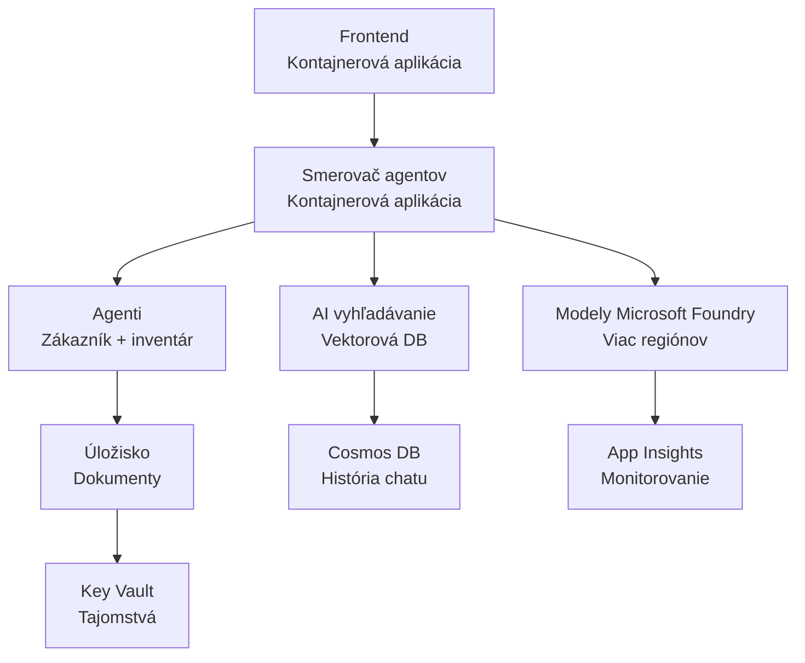

# Retail Multi-Agent Solution - Šablóna infraštruktúry

**Kapitola 5: Balík nasadenia do produkcie**
- **📚 Domov kurzu**: [AZD pre začiatočníkov](../../README.md)
- **📖 Súvisiaca kapitola**: [Kapitola 5: Multi-agentné AI riešenia](../../README.md#-chapter-5-multi-agent-ai-solutions-advanced)
- **📝 Sprievodca scenárom**: [Kompletná architektúra](../retail-scenario.md)
- **🎯 Rýchle nasadenie**: [Jednoklikové nasadenie](#-quick-deployment)

> **⚠️ LEN ŠABLÓNA INFRAŠTRUKTÚRY**  
> Táto ARM šablóna nasadí **prostriedky Azure** pre systém s viacerými agentmi.  
>  
> **Čo sa nasadí (15-25 minutes):**
> - ✅ Služby Microsoft Foundry Models (gpt-4.1, gpt-4.1-mini, embeddings v 3 regiónoch)
> - ✅ Služba AI Search (prázdna, pripravená na vytvorenie indexu)
> - ✅ Container Apps (zástupné obrazy, pripravené na váš kód)
> - ✅ Storage, Cosmos DB, Key Vault, Application Insights
>  
> **Čo NIE JE zahrnuté (vyžaduje vývoj):**
> - ❌ Kód implementácie agentov (Customer Agent, Inventory Agent)
> - ❌ Logika smerovania a API endpointy
> - ❌ Frontend chatové rozhranie
> - ❌ Schémy vyhľadávacích indexov a dátové pipeline
> - ❌ **Odhadovaný vývojový čas: 80-120 hodín**
>  
> **Použite túto šablónu ak:**
> - ✅ Chcete zriadiť Azure infraštruktúru pre projekt s viacerými agentmi
> - ✅ Plánujete vyvíjať implementáciu agentov samostatne
> - ✅ Potrebujete základnú infraštruktúru pripravenú na produkciu
>  
> **Nepoužívajte ak:**
> - ❌ Očakávate okamžitú funkčnú demo verziu s viacerými agentmi
> - ❌ Hľadáte kompletné príklady aplikačného kódu

## Prehľad

Táto zložka obsahuje komplexnú Azure Resource Manager (ARM) šablónu na nasadenie **základov infraštruktúry** multi-agentného systému zákazníckej podpory. Šablóna zriaďuje všetky potrebné Azure služby, správne nakonfigurované a prepojené, pripravené na vývoj vašej aplikácie.

**Po nasadení budete mať:** Azure infraštruktúru pripravenú na produkciu  
**Na dokončenie systému potrebujete:** Kód agentov, frontend UI a konfiguráciu dát (pozri [Príručka architektúry](../retail-scenario.md))

## 🎯 Čo sa nasadí

### Základná infraštruktúra (stav po nasadení)

✅ **Služby Microsoft Foundry Models** (Pripravené na API volania)
  - Primárny región: nasadenie gpt-4.1 (kapacita 20K TPM)
  - Sekundárny región: nasadenie gpt-4.1-mini (kapacita 10K TPM)
  - Terciárny región: model pre textové embeddings (kapacita 30K TPM)
  - Evaluačný región: model gpt-4.1 grader (kapacita 15K TPM)
  - **Stav:** Plne funkčné - API volania sú možné okamžite

✅ **Azure AI Search** (Prázdne - pripravené na konfiguráciu)
  - Zapnuté funkcie vektorového vyhľadávania
  - Štandardná úroveň s 1 partíciou, 1 replikou
  - **Stav:** Služba beží, ale vyžaduje vytvorenie indexu
  - **Potrebná akcia:** Vytvorte vyhľadávací index so svojou schémou

✅ **Azure Storage Account** (Prázdne - pripravené na nahrávanie)
  - Blob kontajnery: `documents`, `uploads`
  - Bezpečné nastavenie (len HTTPS, bez verejného prístupu)
  - **Stav:** Pripravené prijímať súbory
  - **Potrebná akcia:** Nahrajte svoje produktové údaje a dokumenty

⚠️ **Prostredie Container Apps** (nasadené zástupné obrazy)
  - Agent router app (predvolený nginx obraz)
  - Frontend app (predvolený nginx obraz)
  - Auto-scaling nakonfigurovaný (0-10 inštancií)
  - **Stav:** Bežia zástupné kontajnery
  - **Potrebná akcia:** Postavte a nasadte svoje aplikácie agentov

✅ **Azure Cosmos DB** (Prázdne - pripravené na dáta)
  - Databáza a kontajner predkonfigurované
  - Optimalizované pre nízku latenciu
  - TTL zapnuté pre automatické čistenie
  - **Stav:** Pripravené na ukladanie histórie chatov

✅ **Azure Key Vault** (Voliteľné - pripravené na tajomstvá)
  - Soft delete zapnuté
  - RBAC nakonfigurované pre spravované identity
  - **Stav:** Pripravené na ukladanie API kľúčov a pripojovacích reťazcov

✅ **Application Insights** (Voliteľné - monitorovanie aktívne)
  - Prepojené s Log Analytics pracovným priestorom
  - Vlastné metriky a upozornenia nakonfigurované
  - **Stav:** Pripravené prijímať telemetriu z vašich aplikácií

✅ **Document Intelligence** (Pripravené na API volania)
  - Úroveň S0 pre produkčné záťaže
  - **Stav:** Pripravené spracovávať nahraté dokumenty

✅ **Bing Search API** (Pripravené na API volania)
  - Úroveň S1 pre vyhľadávania v reálnom čase
  - **Stav:** Pripravené na webové vyhľadávacie dotazy

### Režimy nasadenia

| Režim | Kapacita OpenAI | Inštancie kontajnerov | Úroveň vyhľadávania | Redundancia úložiska | Najvhodnejšie pre |
|------|-----------------|---------------------|-------------|-------------------|----------|
| **Minimálny** | 10K-20K TPM | 0-2 repliky | Základné | LRS (lokálne) | Vývoj/test, učenie sa, dôkaz koncepcie |
| **Štandardný** | 30K-60K TPM | 2-5 replík | Štandardné | ZRS (zónové) | Produkčné prostredie, mierna prevádzka (<10K používateľov) |
| **Prémiový** | 80K-150K TPM | 5-10 replík, zónová redundancia | Prémiové | GRS (geografické) | Podnikové, vysoká záťaž (>10K používateľov), 99,99% SLA |

**Vplyv na náklady:**
- **Minimálny → Štandardný:** ~4x nárast nákladov ($100-370/mesiac → $420-1,450/mesiac)
- **Štandardný → Prémiový:** ~3x nárast nákladov ($420-1,450/mesiac → $1,150-3,500/mesiac)
- **Voľba závisí od:** Očakávané zaťaženie, požiadavky na SLA, rozpočet

**Plánovanie kapacity:**
- **TPM (Tokens Per Minute):** Suma naprieč všetkými nasadeniami modelov
- **Inštancie kontajnerov:** Rozsah auto-scaling (min-max replík)
- **Úroveň vyhľadávania:** Ovplyvňuje výkon dotazov a limity veľkosti indexu

## 📋 Požiadavky

### Požadované nástroje
1. **Azure CLI** (verzia 2.50.0 alebo vyššia)
   ```bash
   az --version  # Skontrolovať verziu
   az login      # Overiť
   ```

2. **Aktívne predplatné Azure** s prístupom Owner alebo Contributor
   ```bash
   az account show  # Overiť predplatné
   ```

### Požadované kvóty Azure

Pred nasadením overte dostatočné kvóty vo vašich cieľových regiónoch:

```bash
# Skontrolujte dostupnosť modelov Microsoft Foundry vo vašom regióne
az cognitiveservices account list-skus \
  --kind OpenAI \
  --location eastus2

# Overte kvótu OpenAI (príklad pre gpt-4.1)
az cognitiveservices usage list \
  --location eastus2 \
  --query "[?name.value=='OpenAI.Standard.gpt-4.1']"

# Skontrolujte kvótu pre Container Apps
az provider show \
  --namespace Microsoft.App \
  --query "resourceTypes[?resourceType=='managedEnvironments'].locations"
```

**Minimálne požadované kvóty:**
- **Microsoft Foundry Models:** 3-4 nasadenia modelov naprieč regiónmi
  - gpt-4.1: 20K TPM (Tokens Per Minute)
  - gpt-4.1-mini: 10K TPM
  - text-embedding-ada-002: 30K TPM
  - **Poznámka:** gpt-4.1 môže mať čakaciu listinu v niektorých regiónoch - skontrolujte [dostupnosť modelov](https://learn.microsoft.com/azure/ai-services/openai/concepts/models)
- **Container Apps:** Managed prostredie + 2-10 inštancií kontajnerov
- **AI Search:** Štandardná úroveň (Basic nestačí pre vektorové vyhľadávanie)
- **Cosmos DB:** Štandardný provisioned throughput

**Ak sú kvóty nedostatočné:**
1. Prejdite do Azure Portal → Quotas → Požiadať o zvýšenie
2. Alebo použite Azure CLI:
   ```bash
   az support tickets create \
     --ticket-name "OpenAI-Quota-Increase" \
     --severity "minimal" \
     --description "Request quota increase for Microsoft Foundry Models gpt-4.1 in eastus2"
   ```
3. Zvážte alternatívne regióny s dostupnosťou

## 🚀 Rýchle nasadenie

### Možnosť 1: Použitie Azure CLI

```bash
# Naklonujte alebo stiahnite šablónové súbory
git clone <repository-url>
cd examples/retail-multiagent-arm-template

# Urobte nasadzovací skript spustiteľným
chmod +x deploy.sh

# Nasaďte s predvolenými nastaveniami
./deploy.sh -g myResourceGroup

# Nasaďte do produkcie s prémiovými funkciami
./deploy.sh -g myProdRG -e prod -m premium -l eastus2
```

### Možnosť 2: Použitie Azure portálu

[](https://portal.azure.com/#create/Microsoft.Template/uri/https%3A%2F%2Fraw.githubusercontent.com%2Fmicrosoft%2Fazd-for-beginners%2Fmain%2Fexamples%2Fretail-multiagent-arm-template%2Fazuredeploy.json)

### Možnosť 3: Priame použitie Azure CLI

```bash
# Vytvoriť skupinu prostriedkov
az group create --name myResourceGroup --location eastus2

# Nasadiť šablónu
az deployment group create \
  --resource-group myResourceGroup \
  --template-file azuredeploy.json \
  --parameters azuredeploy.parameters.json
```

## ⏱️ Časový plán nasadenia

### Čo očakávať

| Fáza | Trvanie | Čo sa deje |
|-------|----------|--------------||
| **Validácia šablóny** | 30-60 sekúnd | Azure overuje syntaktickú korektnosť ARM šablóny a parametre |
| **Nastavenie skupiny prostriedkov** | 10-20 sekúnd | Vytvorí skupinu prostriedkov (ak je potrebné) |
| **Provisionovanie OpenAI** | 5-8 minút | Vytvorí 3-4 OpenAI účty a nasadí modely |
| **Container Apps** | 3-5 minút | Vytvorí prostredie a nasadí zástupné kontajnery |
| **Search & Storage** | 2-4 minút | Zriadi službu AI Search a storage účty |
| **Cosmos DB** | 2-3 minút | Vytvorí databázu a nakonfiguruje kontajnery |
| **Nastavenie monitorovania** | 2-3 minút | Nastaví Application Insights a Log Analytics |
| **Konfigurácia RBAC** | 1-2 minút | Nakonfiguruje spravované identity a oprávnenia |
| **Celkové nasadenie** | **15-25 minút** | Kompletná infraštruktúra pripravená |

**Po nasadení:**
- ✅ **Infraštruktúra pripravená:** Všetky služby Azure boli zriadené a bežia
- ⏱️ **Vývoj aplikácie:** 80-120 hodín (vaša zodpovednosť)
- ⏱️ **Konfigurácia indexu:** 15-30 minút (vyžaduje vašu schému)
- ⏱️ **Nahratie dát:** Závisí od veľkosti dátovej sady
- ⏱️ **Testovanie a overenie:** 2-4 hodiny

---

## ✅ Overenie úspešnosti nasadenia

### Krok 1: Skontrolujte zriadenie prostriedkov (2 minúty)

```bash
# Overte, že všetky prostriedky boli nasadené úspešne
az resource list \
  --resource-group myResourceGroup \
  --query "[?provisioningState!='Succeeded'].{Name:name, Status:provisioningState, Type:type}" \
  --output table
```

**Očakávané:** Prázdna tabuľka (všetky prostriedky majú stav "Succeeded")

### Krok 2: Overte nasadenia Microsoft Foundry Models (3 minúty)

```bash
# Zobraz všetky účty OpenAI
az cognitiveservices account list \
  --resource-group myResourceGroup \
  --query "[?kind=='OpenAI'].{Name:name, Location:location, Status:properties.provisioningState}" \
  --output table

# Skontroluj nasadenia modelov pre primárny región
OPENAI_NAME=$(az cognitiveservices account list \
  --resource-group myResourceGroup \
  --query "[?kind=='OpenAI'] | [0].name" -o tsv)

az cognitiveservices account deployment list \
  --name $OPENAI_NAME \
  --resource-group myResourceGroup \
  --output table
```

**Očakávané:** 
- 3-4 OpenAI účty (primárny, sekundárny, terciárny, evaluačný región)
- 1-2 nasadenia modelov na účet (gpt-4.1, gpt-4.1-mini, text-embedding-ada-002)

### Krok 3: Otestujte infraštruktúrne endpointy (5 minút)

```bash
# Získať URL adresy kontajnerovej aplikácie
az containerapp list \
  --resource-group myResourceGroup \
  --query "[].{Name:name, URL:properties.configuration.ingress.fqdn, Status:properties.runningStatus}" \
  --output table

# Otestovať koncový bod routera (odpovie zástupný obrázok)
ROUTER_URL=$(az containerapp show \
  --name retail-router \
  --resource-group myResourceGroup \
  --query "properties.configuration.ingress.fqdn" -o tsv)

echo "Testing: https://$ROUTER_URL"
curl -I https://$ROUTER_URL || echo "Container running (placeholder image - expected)"
```

**Očakávané:** 
- Kontajnery v Container Apps zobrazujú stav "Running"
- Zástupný nginx odpovedá s HTTP 200 alebo 404 (žiadny aplikačný kód zatiaľ)

### Krok 4: Overte prístup k API Microsoft Foundry Models (3 minúty)

```bash
# Získať OpenAI koncový bod a kľúč
OPENAI_ENDPOINT=$(az cognitiveservices account show \
  --name $OPENAI_NAME \
  --resource-group myResourceGroup \
  --query "properties.endpoint" -o tsv)

OPENAI_KEY=$(az cognitiveservices account keys list \
  --name $OPENAI_NAME \
  --resource-group myResourceGroup \
  --query "key1" -o tsv)

# Otestovať nasadenie gpt-4.1
curl "${OPENAI_ENDPOINT}openai/deployments/gpt-4.1/chat/completions?api-version=2024-08-01-preview" \
  -H "Content-Type: application/json" \
  -H "api-key: $OPENAI_KEY" \
  -d '{
    "messages": [{"role": "user", "content": "Say hello"}],
    "max_tokens": 10
  }'
```

**Očakávané:** JSON odpoveď s chatovým dokončením (potvrdzuje, že OpenAI funguje)

### Čo funguje vs. čo nefunguje

**✅ Funguje po nasadení:**
- Modely Microsoft Foundry Models nasadené a prijímajú API volania
- Služba AI Search beží (prázdna, ešte bez indexov)
- Container Apps bežia (zástupné nginx obrazy)
- Storage účty prístupné a pripravené na nahrávanie
- Cosmos DB pripravené na dátové operácie
- Application Insights zbiera telemetriu infraštruktúry
- Key Vault pripravený na ukladanie tajomstiev

**❌ Ešte nefunguje (vyžaduje vývoj):**
- Endpointy agentov (žiadny aplikačný kód nasadený)
- Funkčnosť chatu (vyžaduje frontend a backend implementáciu)
- Vyhľadávacie dopyty (ešte nie je vytvorený vyhľadávací index)
- Potrubie pre spracovanie dokumentov (žiadne dáta nahraté)
- Vlastná telemetria (vyžaduje instrumentáciu aplikácie)

**Ďalšie kroky:** Pozrite si [Konfigurácia po nasadení](#-post-deployment-next-steps) pre vývoj a nasadenie vašej aplikácie

---

## ⚙️ Možnosti konfigurácie

### Parametre šablóny

| Parameter | Type | Default | Description |
|-----------|------|---------|-------------|
| `projectName` | string | "retail" | Predpona pre všetky názvy prostriedkov |
| `location` | string | Resource group location | Primárny región nasadenia |
| `secondaryLocation` | string | "westus2" | Sekundárny región pre multi-regionálne nasadenie |
| `tertiaryLocation` | string | "francecentral" | Región pre model embeddings |
| `environmentName` | string | "dev" | Označenie prostredia (dev/staging/prod) |
| `deploymentMode` | string | "standard" | Konfigurácia nasadenia (minimal/standard/premium) |
| `enableMultiRegion` | bool | true | Povoliť multi-regionálne nasadenie |
| `enableMonitoring` | bool | true | Povoliť Application Insights a logovanie |
| `enableSecurity` | bool | true | Povoliť Key Vault a rozšírené bezpečnostné opatrenia |

### Prispôsobenie parametrov

Upravte `azuredeploy.parameters.json`:

```json
{
  "$schema": "https://schema.management.azure.com/schemas/2019-04-01/deploymentParameters.json#",
  "contentVersion": "1.0.0.0",
  "parameters": {
    "projectName": {
      "value": "mycompany"
    },
    "environmentName": {
      "value": "prod"
    },
    "deploymentMode": {
      "value": "premium"
    },
    "location": {
      "value": "eastus2"
    }
  }
}
```

## 🏗️ Prehľad architektúry


## 📖 Použitie skriptu nasadenia

Skript `deploy.sh` poskytuje interaktívny zážitok z nasadenia:

```bash
# Zobraziť nápovedu
./deploy.sh --help

# Základné nasadenie
./deploy.sh -g myResourceGroup

# Pokročilé nasadenie s vlastným nastavením
./deploy.sh \
  -g myProductionRG \
  -p companyname \
  -e prod \
  -m premium \
  -l eastus2

# Vývojové nasadenie bez podpory viacerých regiónov
./deploy.sh \
  -g myDevRG \
  -e dev \
  -m minimal \
  --no-multi-region \
  --no-security
```

### Funkcie skriptu

- ✅ **Overenie predpokladov** (Azure CLI, stav prihlásenia, súbory šablóny)
- ✅ **Správa skupiny prostriedkov** (vytvorí, ak neexistuje)
- ✅ **Validácia šablóny** pred nasadením
- ✅ **Monitorovanie priebehu** s farebným výstupom
- ✅ **Zobrazenie výstupov nasadenia**
- ✅ **Návod po nasadení**

## 📊 Monitorovanie nasadenia

### Skontrolujte stav nasadenia

```bash
# Zobraziť zoznam nasadení
az deployment group list --resource-group myResourceGroup --output table

# Zobraziť podrobnosti nasadenia
az deployment group show \
  --resource-group myResourceGroup \
  --name retail-deployment-YYYYMMDD-HHMMSS

# Sledovať priebeh nasadenia
az deployment group create \
  --resource-group myResourceGroup \
  --template-file azuredeploy.json \
  --parameters azuredeploy.parameters.json \
  --verbose
```

### Výstupy nasadenia

Po úspešnom nasadení sú dostupné tieto výstupy:

- **Frontend URL**: Verejné endpoint pre webové rozhranie
- **Router URL**: API endpoint pre agent router
- **OpenAI Endpointy**: Primárne a sekundárne OpenAI endpointy služby
- **Search Service**: Endpoint služby Azure AI Search
- **Storage Account**: Názov storage účtu pre dokumenty
- **Key Vault**: Názov Key Vault (ak povolené)
- **Application Insights**: Názov monitorovacej služby (ak povolené)

## 🔧 Po nasadení: Ďalšie kroky
> **📝 Dôležité:** Infraštruktúra je nasadená, ale musíte vyvinúť a nasadiť aplikačný kód.

### Fáza 1: Vyvinúť agentné aplikácie (Vaša zodpovednosť)

The ARM template creates **empty Container Apps** with placeholder nginx images. You must:

**Povinný vývoj:**
1. **Implementácia agenta** (30-40 hodín)
   - Agent zákazníckej podpory s integráciou gpt-4.1
   - Agent inventára s integráciou gpt-4.1-mini
   - Logika smerovania agentov

2. **Vývoj frontendu** (20-30 hodín)
   - Používateľské rozhranie chatu (React/Vue/Angular)
   - Funkcia nahrávania súborov
   - Zobrazovanie a formátovanie odpovedí

3. **Backendové služby** (12-16 hodín)
   - FastAPI alebo Express router
   - Middleware pre autentifikáciu
   - Integrácia telemetrie

**Pozri:** [Príručka architektúry](../retail-scenario.md) pre podrobné vzory implementácie a ukážky kódu

### Fáza 2: Nakonfigurujte AI vyhľadávací index (15-30 minút)

Vytvorte vyhľadávací index zodpovedajúci vášmu dátovému modelu:

```bash
# Získajte podrobnosti služby vyhľadávania
SEARCH_NAME=$(az search service list \
  --resource-group myResourceGroup \
  --query "[0].name" -o tsv)

SEARCH_KEY=$(az search admin-key show \
  --service-name $SEARCH_NAME \
  --resource-group myResourceGroup \
  --query "primaryKey" -o tsv)

# Vytvorte index s vašou schémou (príklad)
curl -X POST "https://${SEARCH_NAME}.search.windows.net/indexes?api-version=2023-11-01" \
  -H "Content-Type: application/json" \
  -H "api-key: ${SEARCH_KEY}" \
  -d '{
    "name": "products",
    "fields": [
      {"name": "id", "type": "Edm.String", "key": true},
      {"name": "title", "type": "Edm.String", "searchable": true},
      {"name": "content", "type": "Edm.String", "searchable": true},
      {"name": "category", "type": "Edm.String", "filterable": true},
      {"name": "content_vector", "type": "Collection(Edm.Single)", 
       "searchable": true, "dimensions": 1536, "vectorSearchProfile": "default"}
    ],
    "vectorSearch": {
      "algorithms": [{"name": "default", "kind": "hnsw"}],
      "profiles": [{"name": "default", "algorithm": "default"}]
    }
  }'
```

**Zdroje:**
- [Návrh schémy AI vyhľadávacieho indexu](https://learn.microsoft.com/azure/search/search-what-is-an-index)
- [Konfigurácia vektorového vyhľadávania](https://learn.microsoft.com/azure/search/vector-search-how-to-create-index)

### Fáza 3: Nahrajte svoje dáta (dĺžka závisí)

Keď budete mať produktové údaje a dokumenty:

```bash
# Získať podrobnosti o účte úložiska
STORAGE_NAME=$(az storage account list \
  --resource-group myResourceGroup \
  --query "[0].name" -o tsv)

STORAGE_KEY=$(az storage account keys list \
  --account-name $STORAGE_NAME \
  --resource-group myResourceGroup \
  --query "[0].value" -o tsv)

# Nahrajte svoje dokumenty
az storage blob upload-batch \
  --destination documents \
  --source /path/to/your/product/docs \
  --account-name $STORAGE_NAME \
  --account-key $STORAGE_KEY

# Príklad: Nahrať jeden súbor
az storage blob upload \
  --container-name documents \
  --name "product-manual.pdf" \
  --file /path/to/product-manual.pdf \
  --account-name $STORAGE_NAME \
  --account-key $STORAGE_KEY
```

### Fáza 4: Vytvorte a nasadte svoje aplikácie (8-12 hodín)

Keď vyviniete kód svojho agenta:

```bash
# 1. Vytvorte Azure Container Registry (ak je to potrebné)
az acr create \
  --name myregistry \
  --resource-group myResourceGroup \
  --sku Basic

# 2. Zostavte a nahrajte obraz agent routera
docker build -t myregistry.azurecr.io/agent-router:v1 /path/to/your/router/code
az acr login --name myregistry
docker push myregistry.azurecr.io/agent-router:v1

# 3. Zostavte a nahrajte obraz frontendu
docker build -t myregistry.azurecr.io/frontend:v1 /path/to/your/frontend/code
docker push myregistry.azurecr.io/frontend:v1

# 4. Aktualizujte Container Apps pomocou svojich obrazov
az containerapp update \
  --name retail-router \
  --resource-group myResourceGroup \
  --image myregistry.azurecr.io/agent-router:v1

az containerapp update \
  --name retail-frontend \
  --resource-group myResourceGroup \
  --image myregistry.azurecr.io/frontend:v1

# 5. Nakonfigurujte premenné prostredia
az containerapp update \
  --name retail-router \
  --resource-group myResourceGroup \
  --set-env-vars \
    OPENAI_ENDPOINT=secretref:openai-endpoint \
    OPENAI_KEY=secretref:openai-key \
    SEARCH_ENDPOINT=secretref:search-endpoint \
    SEARCH_KEY=secretref:search-key
```

### Fáza 5: Otestujte svoju aplikáciu (2-4 hodín)

```bash
# Získajte URL svojej aplikácie
ROUTER_URL=$(az containerapp show \
  --name retail-router \
  --resource-group myResourceGroup \
  --query "properties.configuration.ingress.fqdn" -o tsv)

# Otestujte endpoint agenta (akonáhle bude váš kód nasadený)
curl -X POST "https://${ROUTER_URL}/chat" \
  -H "Content-Type: application/json" \
  -d '{
    "message": "Hello, I need help with my order",
    "agent": "customer"
  }'

# Skontrolujte protokoly aplikácie
az containerapp logs show \
  --name retail-router \
  --resource-group myResourceGroup \
  --follow
```

### Implementačné zdroje

**Architektúra a dizajn:**
- 📖 [Kompletná príručka architektúry](../retail-scenario.md) - Podrobné vzory implementácie
- 📖 [Návrhové vzory viacagentových systémov](https://learn.microsoft.com/azure/architecture/ai-ml/guide/multi-agent-systems)

**Ukážky kódu:**
- 🔗 [Microsoft Foundry Models Chat Sample](https://github.com/Azure-Samples/azure-search-openai-demo) - vzor RAG
- 🔗 [Semantic Kernel](https://github.com/microsoft/semantic-kernel) - Rámec pre agentov (C#)
- 🔗 [LangChain Azure](https://github.com/langchain-ai/langchain) - Orchestrace agentov (Python)
- 🔗 [AutoGen](https://github.com/microsoft/autogen) - Viacagentné konverzácie

**Odhadovaný celkový čas:**
- Nasadenie infraštruktúry: 15-25 minút (✅ Dokončené)
- Vývoj aplikácie: 80-120 hodín (🔨 Vaša práca)
- Testovanie a optimalizácia: 15-25 hodín (🔨 Vaša práca)

## 🛠️ Riešenie problémov

### Bežné problémy

#### 1. Vyčerpaný kvót Microsoft Foundry Models

```bash
# Skontrolovať aktuálne využitie kvóty
az cognitiveservices usage list --location eastus2

# Požiadať o zvýšenie kvóty
az support tickets create \
  --ticket-name "OpenAI-Quota-Increase" \
  --severity "minimal" \
  --description "Request quota increase for Microsoft Foundry Models in region X"
```

#### 2. Nasadenie Container Apps zlyhalo

```bash
# Skontrolovať denníky kontajnerovej aplikácie
az containerapp logs show \
  --name retail-router \
  --resource-group myResourceGroup \
  --follow

# Reštartovať kontajnerovú aplikáciu
az containerapp revision restart \
  --name retail-router \
  --resource-group myResourceGroup
```

#### 3. Inicializácia vyhľadávacej služby

```bash
# Overiť stav vyhľadávacej služby
az search service show \
  --name <search-service-name> \
  --resource-group myResourceGroup

# Otestovať pripojenie k vyhľadávacej službe
curl -X GET "https://<search-service-name>.search.windows.net/indexes?api-version=2023-11-01" \
  -H "api-key: <search-admin-key>"
```

### Overenie nasadenia

```bash
# Overiť, či boli vytvorené všetky zdroje
az resource list \
  --resource-group myResourceGroup \
  --output table

# Skontrolovať stav zdrojov
az resource list \
  --resource-group myResourceGroup \
  --query "[?provisioningState!='Succeeded'].{Name:name, Status:provisioningState, Type:type}" \
  --output table
```

## 🔐 Bezpečnostné aspekty

### Správa kľúčov
- Všetky tajomstvá sú uložené v Azure Key Vault (ak je povolené)
- Container apps používajú spravovanú identitu na autentifikáciu
- Účty úložiska majú bezpečné predvolené nastavenia (len HTTPS, bez verejného prístupu k blobom)

### Sieťová bezpečnosť
- Container apps používajú interné sieťovanie tam, kde je to možné
- Vyhľadávacia služba nakonfigurovaná s možnosťou súkromných endpointov
- Cosmos DB nakonfigurovaný s minimálnymi potrebnými povoleniami

### Konfigurácia RBAC
```bash
# Priraďte spravovanej identite potrebné roly.
az role assignment create \
  --assignee <container-app-managed-identity> \
  --role "Cognitive Services OpenAI User" \
  --scope <openai-resource-id>
```

## 💰 Optimalizácia nákladov

### Odhady nákladov (mesačne, USD)

| Režim | OpenAI | Container Apps | Vyhľadávanie | Úložisko | Celk. odh. |
|------|--------|----------------|--------|---------|------------|
| Minimálny | $50-200 | $20-50 | $25-100 | $5-20 | $100-370 |
| Štandardný | $200-800 | $100-300 | $100-300 | $20-50 | $420-1450 |
| Prémiový | $500-2000 | $300-800 | $300-600 | $50-100 | $1150-3500 |

### Monitorovanie nákladov

```bash
# Nastaviť upozornenia na rozpočet
az consumption budget create \
  --account-name <subscription-id> \
  --budget-name "retail-budget" \
  --amount 500 \
  --time-grain Monthly \
  --start-date 2024-01-01 \
  --end-date 2024-12-31
```

## 🔄 Aktualizácie a údržba

### Aktualizácie šablóny
- Spravujte súbory ARM šablón v systéme kontroly verzií
- Najprv otestujte zmeny v prostredí vývoja
- Pre aktualizácie používajte režim inkrementálneho nasadenia

### Aktualizácie zdrojov
```bash
# Aktualizovať s novými parametrami
az deployment group create \
  --resource-group myResourceGroup \
  --template-file azuredeploy.json \
  --parameters azuredeploy.parameters.json \
  --mode Incremental
```

### Zálohovanie a obnova
- Automatické zálohovanie Cosmos DB povolené
- Soft delete v Key Vault povolený
- Revízie container aplikácií uchovávané pre rollback

## 📞 Podpora

- **Problémy so šablónou**: [GitHub Issues](https://github.com/microsoft/azd-for-beginners/issues)
- **Podpora Azure**: [Azure Support Portal](https://portal.azure.com/#blade/Microsoft_Azure_Support/HelpAndSupportBlade)
- **Komunita**: [Azure AI Discord](https://discord.gg/microsoft-azure)

---

**⚡ Pripravení nasadiť vaše viacagentné riešenie?**

Začnite s: `./deploy.sh -g myResourceGroup`

---

<!-- CO-OP TRANSLATOR DISCLAIMER START -->
**Vyhlásenie o zodpovednosti**:
Tento dokument bol preložený pomocou AI prekladateľskej služby [Co-op Translator](https://github.com/Azure/co-op-translator). Hoci sa snažíme o presnosť, berte prosím na vedomie, že automatické preklady môžu obsahovať chyby alebo nepresnosti. Pôvodný dokument v jeho originálnom jazyku by sa mal považovať za záväzný zdroj. Pre kritické informácie odporúčame profesionálny ľudský preklad. Nie sme zodpovední za žiadne nedorozumenia alebo nesprávne výklady vzniknuté v dôsledku použitia tohto prekladu.
<!-- CO-OP TRANSLATOR DISCLAIMER END -->