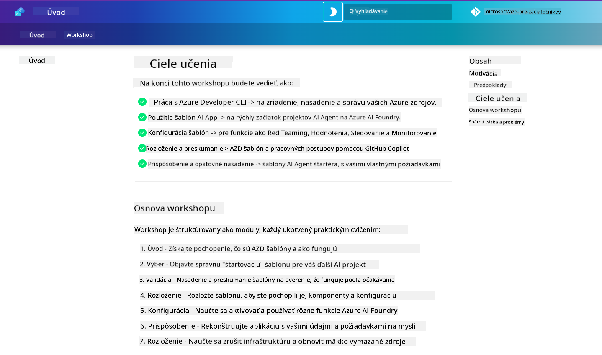

<!--
CO_OP_TRANSLATOR_METADATA:
{
  "original_hash": "9cc966416ab431c38b2ab863884b196c",
  "translation_date": "2025-09-25T01:02:37+00:00",
  "source_file": "workshop/README.md",
  "language_code": "sk"
}
-->
# AZD pre workshop AI vývojárov

Vitajte na praktickom workshope zameranom na učenie Azure Developer CLI (AZD) s dôrazom na nasadenie AI aplikácií. Tento workshop vám pomôže získať praktické znalosti o AZD šablónach v 3 krokoch:

1. **Objavovanie** - nájdite šablónu, ktorá vám vyhovuje.
1. **Nasadenie** - nasadte ju a overte, že funguje.
1. **Prispôsobenie** - upravte ju a prispôsobte podľa svojich potrieb!

Počas tohto workshopu budete tiež oboznámení s kľúčovými nástrojmi a pracovnými postupmi pre vývojárov, ktoré vám pomôžu zefektívniť váš vývojový proces od začiatku až do konca.

<br/>

## Návod v prehliadači

Lekcie workshopu sú napísané v Markdown. Môžete ich prechádzať priamo na GitHube - alebo spustiť náhľad v prehliadači, ako je znázornené na obrázku nižšie.



Ak chcete použiť túto možnosť - vytvorte si fork repozitára vo svojom profile a spustite GitHub Codespaces. Keď bude terminál VS Code aktívny, zadajte tento príkaz:

```bash title="" linenums="0"
mkdocs serve > /dev/null 2>&1 &
```

Po niekoľkých sekundách sa zobrazí dialógové okno. Vyberte možnosť `Open in browser`. Návod v prehliadači sa teraz otvorí v novej karte. Niektoré výhody tohto náhľadu:

1. **Vstavané vyhľadávanie** - rýchlo nájdite kľúčové slová alebo lekcie.
1. **Ikona kopírovania** - prejdite myšou nad bloky kódu a zobrazí sa táto možnosť.
1. **Prepínač témy** - prepínajte medzi tmavým a svetlým režimom.
1. **Získajte pomoc** - kliknite na ikonu Discord v päte a pripojte sa!

<br/>

## Prehľad workshopu

**Trvanie:** 3-4 hodiny  
**Úroveň:** Začiatočník až stredne pokročilý  
**Predpoklady:** Znalosť Azure, AI konceptov, VS Code a nástrojov príkazového riadku.

Toto je praktický workshop, kde sa učíte priamo pri práci. Po dokončení cvičení odporúčame prejsť si učebný plán AZD pre začiatočníkov, aby ste pokračovali vo svojom vzdelávaní v oblasti bezpečnosti a produktivity.

| Čas | Modul  | Cieľ |
|:---|:---|:---|
| 15 min | [Úvod](docs/instructions/0-Introduction.md) | Nastavenie cieľov a pochopenie zámerov |
| 30 min | [Výber AI šablóny](docs/instructions/1-Select-AI-Template.md) | Preskúmajte možnosti a vyberte štartovaciu šablónu | 
| 30 min | [Overenie AI šablóny](docs/instructions/2-Validate-AI-Template.md) | Nasadenie predvolenej šablóny na Azure |
| 30 min | [Rozbor AI šablóny](docs/instructions/3-Deconstruct-AI-Template.md) | Preskúmajte štruktúru a konfiguráciu |
| 30 min | [Konfigurácia AI šablóny](docs/instructions/4-Configure-AI-Template.md) | Aktivujte a vyskúšajte dostupné funkcie |
| 30 min | [Prispôsobenie AI šablóny](docs/instructions/5-Customize-AI-Template.md) | Prispôsobte šablónu podľa svojich potrieb |
| 30 min | [Odstránenie infraštruktúry](docs/instructions/6-Teardown-Infrastructure.md) | Vyčistenie a uvoľnenie zdrojov |
| 15 min | [Zhrnutie a ďalšie kroky](docs/instructions/7-Wrap-up.md) | Zdroje na učenie, výzva workshopu |

<br/>

## Čo sa naučíte

AZD šablónu si predstavte ako učebný sandbox na preskúmanie rôznych schopností a nástrojov pre komplexný vývoj na Azure AI Foundry. Na konci tohto workshopu by ste mali mať intuitívne pochopenie rôznych nástrojov a konceptov v tomto kontexte.

| Koncept  | Cieľ |
|:---|:---|
| **Azure Developer CLI** | Pochopenie príkazov a pracovných postupov nástroja |
| **AZD šablóny**| Pochopenie štruktúry projektu a konfigurácie |
| **Azure AI Agent**| Zriadenie a nasadenie projektu Azure AI Foundry |
| **Azure AI Search**| Aktivácia kontextového inžinierstva s agentmi |
| **Pozorovateľnosť**| Preskúmanie sledovania, monitorovania a hodnotení |
| **Red Teaming**| Preskúmanie testovania odolnosti a zmierňovania rizík |

<br/>

## Štruktúra workshopu

Workshop je štruktúrovaný tak, aby vás previedol cestou od objavenia šablóny, cez nasadenie, rozbor a prispôsobenie - pričom ako základ sa používa oficiálna štartovacia šablóna [Getting Started with AI Agents](https://github.com/Azure-Samples/get-started-with-ai-agents).

### [Modul 1: Výber AI šablóny](docs/instructions/1-Select-AI-Template.md) (30 min)

- Čo sú AI šablóny?
- Kde nájdem AI šablóny?
- Ako začať s budovaním AI agentov?
- **Lab**: Rýchly štart s GitHub Codespaces

### [Modul 2: Overenie AI šablóny](docs/instructions/2-Validate-AI-Template.md) (30 min)

- Aká je architektúra AI šablóny?
- Aký je vývojový pracovný postup AZD?
- Ako získať pomoc pri vývoji AZD?
- **Lab**: Nasadenie a overenie šablóny AI agentov

### [Modul 3: Rozbor AI šablóny](docs/instructions/3-Deconstruct-AI-Template.md) (30 min)

- Preskúmajte svoje prostredie v `.azure/` 
- Preskúmajte nastavenie zdrojov v `infra/` 
- Preskúmajte konfiguráciu AZD v `azure.yaml`
- **Lab**: Úprava premenných prostredia a opätovné nasadenie

### [Modul 4: Konfigurácia AI šablóny](docs/instructions/4-Configure-AI-Template.md) (30 min)
- Preskúmajte: Retrieval Augmented Generation
- Preskúmajte: Hodnotenie agentov a Red Teaming
- Preskúmajte: Sledovanie a monitorovanie
- **Lab**: Preskúmajte AI agenta + pozorovateľnosť 

### [Modul 5: Prispôsobenie AI šablóny](docs/instructions/5-Customize-AI-Template.md) (30 min)
- Definujte: PRD so scenárovými požiadavkami
- Konfigurujte: Premenné prostredia pre AZD
- Implementujte: Lifecycle Hooks pre ďalšie úlohy
- **Lab**: Prispôsobenie šablóny pre môj scenár

### [Modul 6: Odstránenie infraštruktúry](docs/instructions/6-Teardown-Infrastructure.md) (30 min)
- Rekapitulácia: Čo sú AZD šablóny?
- Rekapitulácia: Prečo používať Azure Developer CLI?
- Ďalšie kroky: Vyskúšajte inú šablónu!
- **Lab**: Odstránenie infraštruktúry a vyčistenie

<br/>

## Výzva workshopu

Chcete sa sami otestovať a urobiť viac? Tu sú niektoré návrhy projektov - alebo sa podeľte o svoje nápady s nami!!

| Projekt | Popis |
|:---|:---|
|1. **Rozbor komplexnej AI šablóny** | Použite pracovný postup a nástroje, ktoré sme načrtli, a zistite, či dokážete nasadiť, overiť a prispôsobiť inú šablónu AI riešenia. _Čo ste sa naučili?_|
|2. **Prispôsobenie podľa vášho scenára**  | Skúste napísať PRD (Product Requirements Document) pre iný scenár. Potom použite GitHub Copilot vo svojom repozitári šablóny v Agent Model - a požiadajte ho, aby vám vygeneroval pracovný postup prispôsobenia. _Čo ste sa naučili? Ako by ste mohli tieto návrhy zlepšiť?_|
| | |

## Máte spätnú väzbu?

1. Zverejnite problém v tomto repozitári - označte ho `Workshop` pre jednoduchšie vyhľadanie.
1. Pripojte sa na Discord Azure AI Foundry - spojte sa so svojimi kolegami!


| | | 
|:---|:---|
| **📚 Domov kurzu**| [AZD pre začiatočníkov](../README.md)|
| **📖 Dokumentácia** | [Začnite s AI šablónami](https://learn.microsoft.com/en-us/azure/ai-foundry/how-to/develop/ai-template-get-started)|
| **🛠️AI šablóny** | [Šablóny Azure AI Foundry](https://ai.azure.com/templates) |
|**🚀 Ďalšie kroky** | [Prijmite výzvu](../../../workshop) |
| | |

<br/>

---

**Predchádzajúce:** [AI Príručka na riešenie problémov](../docs/troubleshooting/ai-troubleshooting.md) | **Ďalšie:** Začnite s [Lab 1: Základy AZD](../../../workshop/lab-1-azd-basics)

**Pripravení začať budovať AI aplikácie s AZD?**

[Začnite Lab 1: Základy AZD →](./lab-1-azd-basics/README.md)

---

