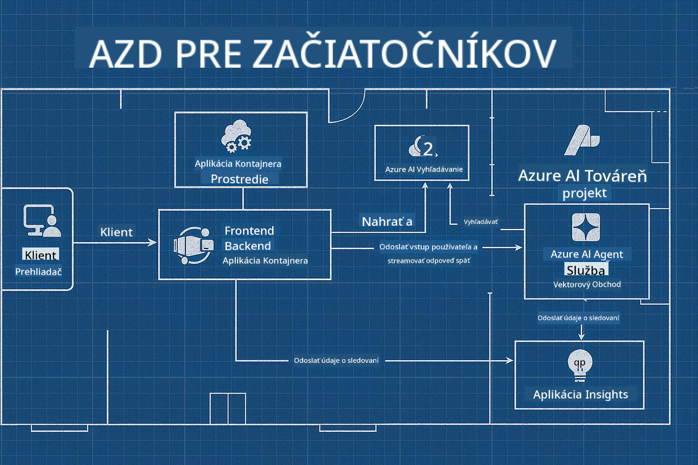

<!--
CO_OP_TRANSLATOR_METADATA:
{
  "original_hash": "245d24997bbcf2bae93bb2a503845d37",
  "translation_date": "2025-09-23T12:04:10+00:00",
  "source_file": "workshop/README.md",
  "language_code": "sk"
}
-->
# AZD pre workshop AI vývojárov

## AZD Šablóny

Vytvorenie riešenia AI aplikácie na podnikovej úrovni pre váš konkrétny scenár je veľmi podobné stavbe vlastného domu. Môžete si ho navrhnúť sami, postaviť tehlu po tehle a prevziať zodpovednosť za to, že bude spĺňať všetky pravidlá správy a vývoja.

**ALEBO ....**

Môžete spolupracovať s architektom, ktorý vám poskytne _plán_ pre štartovací dom, a potom s vami pracovať na jeho _prispôsobení_ tak, aby vyhovoval vašim potrebám. To vám umožní sústrediť sa na to, čo robí **váš domov** výnimočným, pričom odborníci sa postarajú o základné elektroinštalácie, vodovodné rozvody a ďalšie závislosti.

**Toto je prístup za [AI App Templates](https://ai.azure.com/templates)** - séria plánov na vytvorenie rôznych typov "domov" AI aplikácií v závislosti od vašich hlavných potrieb a závislostí.

## Prispôsobenie šablón

Šablóny sú navrhnuté tak, aby fungovali s [Azure AI Foundry](https://ai.azure.com). Predstavte si túto platformu ako vášho "staviteľa" s prístupom ku všetkým zdrojom, nástrojom a odborným znalostiam, ktoré potrebujete na dokončenie práce!

Stačí si vybrať [vaše štartovacie šablóny](https://learn.microsoft.com/en-us/azure/ai-foundry/how-to/develop/ai-template-get-started). Napríklad sa zameriame na šablónu _Get Started with AI Agents_, aby sme vám vytvorili "Agentický AI domov", ktorý je pripravený na funkcie ako AI Search, Red Teaming, Evaluations, Tracing, Monitoring a ďalšie!



Stačí si rezervovať čas s architektom, ktorý vás prevedie procesom prispôsobenia. [GitHub Copilot for Azure](https://learn.microsoft.com/en-us/azure/developer/github-copilot-azure/get-started) môže byť týmto sprievodcom. Stačí s ním "chatovať", aby ste:

- Zistili viac o funkciách Azure vo vašej šablóne
- Nasadili Azure zdroje
- Získali informácie o vašom nasadení
- Diagnostikovali a riešili problémy!

V tomto workshope sa naučíme, ako _dekonštruovať_ existujúcu šablónu (aby sme zistili, čo poskytuje), a potom ju _prispôsobiť_ (aby splnila naše požiadavky) - krok za krokom.

AI šablóny **zabezpečia funkčnosť** - dokončením workshopu sa naučíte, ako si ich **prispôsobiť pre seba**

----

**Navigácia workshopu**
- **📚 Domov kurzu**: [AZD Pre začiatočníkov](../README.md)
- **📖 Súvisiace kapitoly**: Zahŕňa [Kapitolu 1](../README.md#-chapter-1-foundation--quick-start), [Kapitolu 2](../README.md#-chapter-2-ai-first-development-recommended-for-ai-developers) a [Kapitolu 5](../README.md#-chapter-5-multi-agent-ai-solutions-advanced)
- **🛠️ Praktické cvičenie**: [AI Workshop Lab](../docs/ai-foundry/ai-workshop-lab.md)
- **🚀 Ďalšie kroky**: [Moduly workshopu](../../../workshop)

Vitajte na praktickom workshope zameranom na učenie Azure Developer CLI (AZD) s dôrazom na nasadenie AI aplikácií. Tento workshop je navrhnutý tak, aby vás previedol od základov AZD až po nasadenie AI riešení pripravených na produkciu.

## Prehľad workshopu

**Trvanie:** 2-3 hodiny  
**Úroveň:** Začiatočník až stredne pokročilý  
**Predpoklady:** Základné znalosti Azure, nástrojov príkazového riadku a AI konceptov

### Čo sa naučíte

- **Základy AZD**: Porozumenie infraštruktúre ako kódu s AZD
- 🤖 **Integrácia AI služieb**: Nasadenie Azure OpenAI, AI Search a ďalších AI služieb
- **Nasadenie kontajnerov**: Použitie Azure Container Apps pre AI aplikácie
- **Najlepšie bezpečnostné postupy**: Implementácia Managed Identity a bezpečných konfigurácií
- **Monitoring a pozorovateľnosť**: Nastavenie Application Insights pre AI pracovné zaťaženia
- **Produkčné vzory**: Stratégie nasadenia na podnikovej úrovni

## Štruktúra workshopu

### Modul 1: Základy AZD (30 minút)
- Inštalácia a konfigurácia AZD
- Porozumenie štruktúre projektu AZD
- Vaše prvé nasadenie AZD
- **Lab**: Nasadenie jednoduchej webovej aplikácie

### Modul 2: Integrácia Azure OpenAI (45 minút)
- Nastavenie Azure OpenAI zdrojov
- Stratégie nasadenia modelov
- Konfigurácia API prístupu a autentifikácie
- **Lab**: Nasadenie chatovacej aplikácie s GPT-4

### Modul 3: RAG aplikácie (45 minút)
- Integrácia Azure AI Search
- Spracovanie dokumentov s Azure Document Intelligence
- Vektorové embeddingy a sémantické vyhľadávanie
- **Lab**: Vytvorenie systému otázok a odpovedí na dokumenty

### Modul 4: Produkčné nasadenie (30 minút)
- Konfigurácia Container Apps
- Optimalizácia škálovania a výkonu
- Monitoring a logovanie
- **Lab**: Nasadenie do produkcie s pozorovateľnosťou

### Modul 5: Pokročilé vzory (15 minút)
- Nasadenia do viacerých prostredí
- Integrácia CI/CD
- Stratégie optimalizácie nákladov
- **Záver**: Kontrolný zoznam pripravenosti na produkciu

## Predpoklady

### Potrebné nástroje

Pred workshopom si prosím nainštalujte tieto nástroje:

```bash
# Azure Developer CLI
curl -fsSL https://aka.ms/install-azd.sh | bash

# Azure CLI
curl -sL https://aka.ms/InstallAzureCLIDeb | sudo bash

# Git
sudo apt-get install git

# Docker
curl -fsSL https://get.docker.com -o get-docker.sh
sudo sh get-docker.sh

# Python 3.10+
sudo apt-get install python3.10 python3.10-venv python3-pip
```

### Nastavenie Azure účtu

1. **Azure Subscription**: [Zaregistrujte sa zadarmo](https://azure.microsoft.com/free/)
2. **Prístup k Azure OpenAI**: [Požiadajte o prístup](https://aka.ms/oai/access)
3. **Požadované oprávnenia**:
   - Rola Contributor na predplatnom alebo skupine zdrojov
   - User Access Administrator (pre RBAC priradenia)

### Overenie predpokladov

Spustite tento skript na overenie vášho nastavenia:

```bash
#!/bin/bash
echo "Verifying workshop prerequisites..."

# Check AZD installation
if command -v azd &> /dev/null; then
    echo "✅ Azure Developer CLI: $(azd --version)"
else
    echo "❌ Azure Developer CLI not found"
fi

# Check Azure CLI
if command -v az &> /dev/null; then
    echo "✅ Azure CLI: $(az --version | head -n1)"
else
    echo "❌ Azure CLI not found"
fi

# Check Docker
if command -v docker &> /dev/null; then
    echo "✅ Docker: $(docker --version)"
else
    echo "❌ Docker not found"
fi

# Check Python
if command -v python3 &> /dev/null; then
    echo "✅ Python: $(python3 --version)"
else
    echo "❌ Python 3 not found"
fi

# Check Azure login
if az account show &> /dev/null; then
    echo "✅ Azure: Logged in as $(az account show --query user.name -o tsv)"
else
    echo "❌ Azure: Not logged in (run 'az login')"
fi

echo "Setup verification complete!"
```

## Materiály workshopu

### Praktické cvičenia

Každý modul obsahuje praktické cvičenia so štartovacím kódom a podrobnými pokynmi:

- **[lab-1-azd-basics/](../../../workshop/lab-1-azd-basics)** - Vaše prvé nasadenie AZD
- **[lab-2-openai-chat/](../../../workshop/lab-2-openai-chat)** - Chatovacia aplikácia s Azure OpenAI
- **[lab-3-rag-search/](../../../workshop/lab-3-rag-search)** - RAG aplikácia s AI Search
- **[lab-4-production/](../../../workshop/lab-4-production)** - Produkčné vzory nasadenia
- **[lab-5-advanced/](../../../workshop/lab-5-advanced)** - Pokročilé scenáre nasadenia

### Referenčné materiály

- **[AI Foundry Integration Guide](../docs/ai-foundry/azure-ai-foundry-integration.md)** - Komplexné integračné vzory
- **[AI Model Deployment Guide](../docs/ai-foundry/ai-model-deployment.md)** - Najlepšie postupy nasadenia modelov
- **[Production AI Practices](../docs/ai-foundry/production-ai-practices.md)** - Vzory nasadenia na podnikovej úrovni
- **[AI Troubleshooting Guide](../docs/troubleshooting/ai-troubleshooting.md)** - Bežné problémy a riešenia

### Vzorové šablóny

Štartovacie šablóny pre bežné AI scenáre:

```
workshop/templates/
├── minimal-chat/          # Basic OpenAI chat app
├── rag-application/       # RAG with AI Search
├── multi-model/          # Multiple AI services
└── production-ready/     # Enterprise template
```

## Začíname

### Možnosť 1: GitHub Codespaces (Odporúčané)

Najrýchlejší spôsob, ako začať workshop:

[](https://github.com/codespaces/new?hide_repo_select=true&ref=main&repo=YOUR_REPO_ID)

### Možnosť 2: Lokálny vývoj

1. **Klonujte workshopový repozitár:**
```bash
git clone https://github.com/YOUR_ORG/AZD-for-beginners.git
cd AZD-for-beginners/workshop
```

2. **Prihláste sa do Azure:**
```bash
az login
azd auth login
```

3. **Začnite s Labom 1:**
```bash
cd lab-1-azd-basics
cat README.md  # Follow the instructions
```

### Možnosť 3: Workshop vedený inštruktorom

Ak sa zúčastňujete na workshope vedenom inštruktorom:

- 🎥 **Nahrávka workshopu**: [Dostupná na vyžiadanie](https://aka.ms/azd-ai-workshop)
- 💬 **Discord komunita**: [Pripojte sa pre živú podporu](https://aka.ms/foundry/discord)
- **Spätná väzba na workshop**: [Podeľte sa o svoje skúsenosti](https://aka.ms/azd-workshop-feedback)

## Časový harmonogram workshopu

### Samostatné učenie (3 hodiny)

```
⏰ 00:00 - 00:30  Module 1: AZD Foundations
⏰ 00:30 - 01:15  Module 2: Azure OpenAI Integration
⏰ 01:15 - 02:00  Module 3: RAG Applications
⏰ 02:00 - 02:30  Module 4: Production Deployment
⏰ 02:30 - 02:45  Module 5: Advanced Patterns
⏰ 02:45 - 03:00  Q&A and Next Steps
```

### Workshop vedený inštruktorom (2,5 hodiny)

```
⏰ 00:00 - 00:15  Welcome & Prerequisites Check
⏰ 00:15 - 00:40  Module 1: Live Demo + Lab
⏰ 00:40 - 01:20  Module 2: OpenAI Integration
⏰ 01:20 - 01:30  Break
⏰ 01:30 - 02:10  Module 3: RAG Applications
⏰ 02:10 - 02:30  Module 4: Production Patterns
⏰ 02:30 - 02:45  Module 5: Advanced Topics
⏰ 02:45 - 03:00  Q&A and Resources
```

## Kritériá úspechu

Na konci tohto workshopu budete schopní:

✅ **Nasadiť AI aplikácie** pomocou AZD šablón  
✅ **Konfigurovať Azure OpenAI** služby s náležitou bezpečnosťou  
✅ **Vytvoriť RAG aplikácie** s integráciou Azure AI Search  
✅ **Implementovať produkčné vzory** pre podnikové AI pracovné zaťaženia  
✅ **Monitorovať a riešiť problémy** pri nasadení AI aplikácií  
✅ **Aplikovať stratégie optimalizácie nákladov** pre AI pracovné zaťaženia  

## Komunita a podpora

### Počas workshopu

- 🙋 **Otázky**: Použite chat workshopu alebo zdvihnite ruku
- 🐛 **Problémy**: Skontrolujte [príručku na riešenie problémov](../docs/troubleshooting/ai-troubleshooting.md)
- **Tipy**: Podeľte sa o objavy s ostatnými účastníkmi

### Po workshope

- 💬 **Discord**: [Azure AI Foundry Community](https://aka.ms/foundry/discord)
- **GitHub Issues**: [Nahláste problémy so šablónami](https://github.com/YOUR_ORG/AZD-for-beginners/issues)
- 📧 **Spätná väzba**: [Formulár hodnotenia workshopu](https://aka.ms/azd-workshop-feedback)

## Ďalšie kroky

### Pokračujte v učení

1. **Pokročilé scenáre**: Preskúmajte [nasadenia do viacerých regiónov](../docs/ai-foundry/production-ai-practices.md#multi-region-deployment)
2. **Integrácia CI/CD**: Nastavte [GitHub Actions workflows](../docs/deployment/github-actions.md)
3. **Vlastné šablóny**: Vytvorte si vlastné [AZD šablóny](../docs/getting-started/custom-templates.md)

### Aplikujte vo svojich projektoch

1. **Hodnotenie**: Použite náš [kontrolný zoznam pripravenosti](./production-readiness-checklist.md)
2. **Šablóny**: Začnite s našimi [AI špecifickými šablónami](../../../workshop/templates)
3. **Podpora**: Pripojte sa k [Azure AI Foundry Discord](https://aka.ms/foundry/discord)

### Podeľte sa o svoj úspech

- ⭐ **Ohodnoťte repozitár**, ak vám workshop pomohol
- 🐦 **Podeľte sa na sociálnych sieťach** s #AzureDeveloperCLI #AzureAI
- 📝 **Napíšte blogový príspevok** o vašej ceste nasadenia AI

---

## Spätná väzba na workshop

Vaša spätná väzba nám pomáha zlepšiť zážitok z workshopu:

| Aspekt | Hodnotenie (1-5) | Komentáre |
|--------|------------------|-----------|
| Kvalita obsahu | ⭐⭐⭐⭐⭐ | |
| Praktické cvičenia | ⭐⭐⭐⭐⭐ | |
| Dokumentácia | ⭐⭐⭐⭐⭐ | |
| Úroveň obtiažnosti | ⭐⭐⭐⭐⭐ | |
| Celkový zážitok | ⭐⭐⭐⭐⭐ | |

**Odošlite spätnú väzbu**: [Formulár hodnotenia workshopu](https://aka.ms/azd-workshop-feedback)

---

**Predchádzajúce:** [Príručka na riešenie problémov AI](../docs/troubleshooting/ai-troubleshooting.md) | **Ďalšie:** Začnite s [Lab 1: Základy AZD](../../../workshop/lab-1-azd-basics)

**Ste pripravení začať budovať AI aplikácie s AZD?**

[Začnite Lab 1: Základy AZD →](./lab-1-azd-basics/README.md)

---

