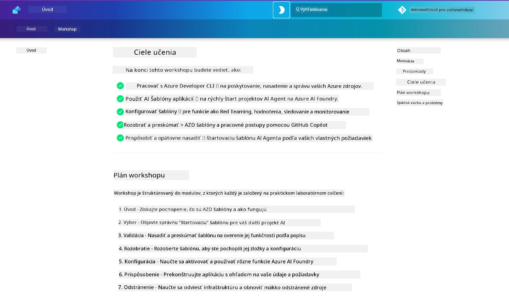

<div align="center">
  <div style="background: linear-gradient(135deg, #0078d4, #106ebe); border-radius: 10px; padding: 20px; margin: 20px 0; box-shadow: 0 4px 15px rgba(0, 120, 212, 0.3); border: 2px solid #005a9e;">
    <h2 style="color: white; margin: 0; font-size: 24px; text-shadow: 1px 1px 2px rgba(0,0,0,0.3);">
      🎯 Workshop AZD pre vývojárov AI
    </h2>
    <p style="color: white; margin: 10px 0 0 0; font-size: 16px; text-shadow: 1px 1px 2px rgba(0,0,0,0.3);">
      <strong>Praktický workshop na tvorbu AI aplikácií s Azure Developer CLI.</strong><br>
      Dokončite 7 modulov, aby ste ovládli AZD šablóny a pracovné postupy nasadenia AI.
    </p>
    <div style="margin-top: 15px;">
      <span style="background: rgba(255,255,255,0.2); padding: 5px 10px; border-radius: 15px; color: white; font-size: 14px;">
        📅 Posledná aktualizácia: marec 2026
      </span>
    </div>
  </div>
</div>

# Workshop AZD pre vývojárov AI

Vitajte na praktickom workshope na natiahnutie znalostí Azure Developer CLI (AZD) so zameraním na nasadenie AI aplikácií. Tento workshop vám pomôže získať praktické znalosti o AZD šablónach v 3 krokoch:

1. **Objavenie** – nájdite šablónu, ktorá je pre vás vhodná.
1. **Nasadenie** – nasadte a overte, že funguje.
1. **Prispôsobenie** – upravte a iterujte, aby bola šablóna vaša!

Počas workshope sa tiež zoznámite so základnými nástrojmi a pracovnými postupmi vývojárov, ktoré vám pomôžu zjednodušiť celý proces vývoja.

<br/>

## Sprievodca v prehliadači

Lekcie workshopu sú v Markdown formáte. Môžete ich prechádzať priamo na GitHube, alebo spustiť náhľad v prehliadači, ako ukazuje snímka obrazovky nižšie.



Ak chcete použiť túto možnosť - forknite repozitár do svojho profilu a spustite GitHub Codespaces. Keď bude terminál VS Code aktívny, zadajte tento príkaz:

Tento prehliadačový náhľad funguje v GitHub Codespaces, vývojových kontajneroch alebo v lokálnom klone s nainštalovaným Pythonom a MkDocs.

```bash title="" linenums="0"
mkdocs serve > /dev/null 2>&1 &
```
  
O pár sekúnd sa vám zobrazí dialógové okno. Vyberte možnosť `Open in browser` (Otvoriť v prehliadači). Webový sprievodca sa teraz otvorí v novej karte prehliadača. Niektoré výhody tohto náhľadu:

1. **Vstavané vyhľadávanie** – rýchlo nájdite kľúčové slová alebo lekcie.
1. **Kópia ikonky** – na kódoch prejdite myšou a zobrazí sa táto možnosť.
1. **Prepínanie tém** – prepínajte medzi tmavým a svetlým režimom.
1. **Pomoc** – kliknite na ikonu Discordu v päte a pripojte sa!

<br/>

## Prehľad workshopu

**Dĺžka trvania:** 3-4 hodiny  
**Úroveň:** Začiatočník až stredne pokročilý  
**Predpoklady:** Znalosť Azure, konceptov AI, VS Code a nástrojov príkazového riadku.

Je to praktický workshop, kde sa učíte priamo pri práci. Po dokončení cvičení odporúčame prejsť kurikulum AZD pre začiatočníkov, aby ste pokračovali vo svojej ceste učenia sa o zabezpečení a najlepších praktikách produktivity.

| Čas| Modul  | Cieľ |
|:---|:---|:---|
| 15 min | [Úvod](docs/instructions/0-Introduction.md) | Nastaviť základ, pochopiť ciele |
| 30 min | [Vybrať AI šablónu](docs/instructions/1-Select-AI-Template.md) | Preskúmať možnosti a vybrať začiatok | 
| 30 min | [Overiť AI šablónu](docs/instructions/2-Validate-AI-Template.md) | Nasadiť predvolenú riešenie do Azure |
| 30 min | [Rozobrať AI šablónu](docs/instructions/3-Deconstruct-AI-Template.md) | Preskúmať štruktúru a konfiguráciu |
| 30 min | [Konfigurovať AI šablónu](docs/instructions/4-Configure-AI-Template.md) | Aktivovať a vyskúšať dostupné funkcie |
| 30 min | [Prispôsobiť AI šablónu](docs/instructions/5-Customize-AI-Template.md) | Prispôsobiť šablónu vašim potrebám |
| 30 min | [Ukončiť infraštruktúru](docs/instructions/6-Teardown-Infrastructure.md) | Upratať a uvoľniť zdroje |
| 15 min | [Zhrnutie a ďalšie kroky](docs/instructions/7-Wrap-up.md) | Vzdelávacie zdroje, výzva workshopu |

<br/>

## Čo sa naučíte

Predstavte si AZD šablónu ako pieskovisko na učenie sa, kde môžete skúmať rôzne schopnosti a nástroje pre end-to-end vývoj na Microsoft Foundry. Po skončení workshopu by ste mali intuitívne chápať rôzne nástroje a koncepty v tomto kontexte.

| Koncept  | Cieľ |
|:---|:---|
| **Azure Developer CLI** | Pochopiť príkazy a pracovné postupy nástroja |
| **AZD šablóny**| Pochopiť štruktúru projektu a konfiguráciu |
| **Azure AI Agent**| Provisioning a nasadenie projektu Microsoft Foundry |
| **Azure AI Search**| Umožniť kontextové inžinierstvo s agentmi |
| **Observabilita**| Preskúmať trasovanie, monitorovanie a hodnotenia |
| **Red Teaming**| Preskúmať adversariálne testovanie a opatrenia |

<br/>

## Štruktúra workshopu

Workshop je koncipovaný tak, aby vás previedol cestou od objavenia šablóny, cez nasadenie, rozklad, až po prispôsobenie – pričom základom je oficiálna [Šablóna Getting Started with AI Agents](https://github.com/Azure-Samples/get-started-with-ai-agents).

### [Modul 1: Vybrať AI šablónu](docs/instructions/1-Select-AI-Template.md) (30 min)

- Čo sú AI šablóny?
- Kde nájdem AI šablóny?
- Ako začať budovať AI agentov?
- **Lab**: Rýchly štart v Codespaces alebo vývojovom kontajneri

### [Modul 2: Overiť AI šablónu](docs/instructions/2-Validate-AI-Template.md) (30 min)

- Aká je architektúra AI šablóny?
- Aký je vývojový pracovný tok s AZD?
- Ako si pomôcť s vývojom s AZD?
- **Lab**: Nasadenie a overenie AI Agents šablóny

### [Modul 3: Rozobrať AI šablónu](docs/instructions/3-Deconstruct-AI-Template.md) (30 min)

- Preskúmajte svoje prostredie v `.azure/`
- Preskúmajte nastavenie zdrojov v `infra/`
- Preskúmajte konfiguráciu AZD v `azure.yaml`
- **Lab**: Upraviť premenné prostredia a znovu nasadiť

### [Modul 4: Konfigurovať AI šablónu](docs/instructions/4-Configure-AI-Template.md) (30 min)
- Preskúmajte: Retrieval Augmented Generation
- Preskúmajte: Hodnotenie agentov a Red Teaming
- Preskúmajte: Trasovanie a monitorovanie
- **Lab**: Preskúmať AI Agenta + Observabilitu

### [Modul 5: Prispôsobiť AI šablónu](docs/instructions/5-Customize-AI-Template.md) (30 min)
- Definovať: PRD so scenárovými požiadavkami
- Konfigurovať: Premenné prostredia pre AZD
- Implementovať: Lifecycle Hooky na pridanie úloh
- **Lab**: Prispôsobiť šablónu na môj scenár

### [Modul 6: Ukončiť infraštruktúru](docs/instructions/6-Teardown-Infrastructure.md) (30 min)
- Rekapitulácia: Čo sú AZD šablóny?
- Rekapitulácia: Prečo používať Azure Developer CLI?
- Ďalšie kroky: Vyskúšať inú šablónu!
- **Lab**: Odstrániť infraštruktúru a upratať

<br/>

## Výzva workshopu

Chcete sa vyzvať a urobiť viac? Tu je niekoľko projektových návrhov - alebo nám podeľte svoje nápady!!

| Projekt | Popis |
|:---|:---|
|1. **Rozobrať komplexnú AI šablónu** | Použite pracovný tok a nástroje, ktoré sme ukázali, a skúste nasadiť, overiť a prispôsobiť inú AI šablónu. _Čo ste sa naučili?_|
|2. **Prispôsobiť podľa svojho scenára**  | Skúste napísať PRD (dokument požiadaviek na produkt) pre iný scenár. Potom použite GitHub Copilot vo vašom repozitári šablóny v režime Agent Model - a požiadajte ho o vytvorenie pracovného postupu prispôsobenia. _Čo ste sa naučili? Ako by ste mohli tieto návrhy zlepšiť?_|
| | |

## Máte spätnú väzbu?

1. Vytvorte issue v tomto repozitári - pre uľahčenie označte `Workshop`.
1. Pripojte sa na Microsoft Foundry Discord - spojte sa so svojimi kolegami!


| | | 
|:---|:---|
| **📚 Domov kurzu**| [AZD pre začiatočníkov](../README.md)|
| **📖 Dokumentácia** | [Začať s AI šablónami](https://learn.microsoft.com/en-us/azure/ai-foundry/how-to/develop/ai-template-get-started)|
| **🛠️ AI šablóny** | [Microsoft Foundry šablóny](https://ai.azure.com/templates) |
|**🚀 Ďalšie kroky** | [Začať workshop](#prehľad-workshopu) |
| | |

<br/>

---

**Navigácia:** [Hlavný kurz](../README.md) | [Úvod](docs/instructions/0-Introduction.md) | [Modul 1: Vybrať šablónu](docs/instructions/1-Select-AI-Template.md)

**Pripraveni začať tvoriť AI aplikácie s AZD?**

[Začať workshop: Úvod →](docs/instructions/0-Introduction.md)

---

<!-- CO-OP TRANSLATOR DISCLAIMER START -->
**Zrieknutie sa zodpovednosti**:  
Tento dokument bol preložený pomocou AI prekladateľskej služby [Co-op Translator](https://github.com/Azure/co-op-translator). Hoci sa snažíme o presnosť, berte prosím na vedomie, že automatizované preklady môžu obsahovať chyby alebo nepresnosti. Originálny dokument v jeho pôvodnom jazyku by mal byť považovaný za autoritatívny zdroj. Pre kritické informácie sa odporúča profesionálny ľudský preklad. Nie sme zodpovední za akékoľvek nedorozumenia alebo nesprávne výklady vyplývajúce z použitia tohto prekladu.
<!-- CO-OP TRANSLATOR DISCLAIMER END -->