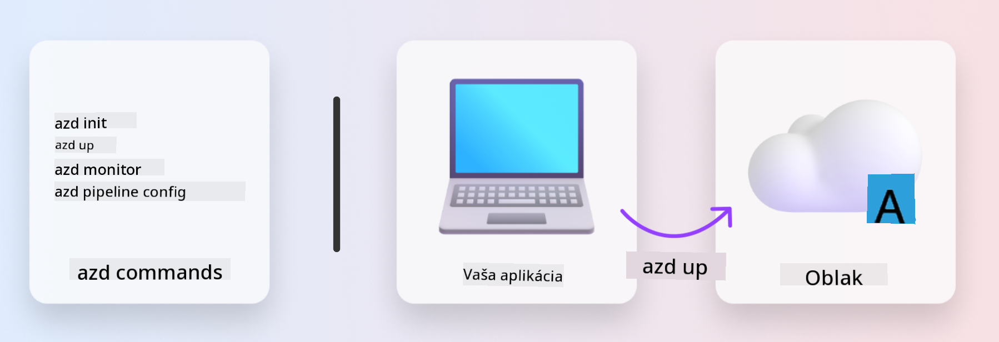

<!--
CO_OP_TRANSLATOR_METADATA:
{
  "original_hash": "06d6207eff634aefcaa41739490a5324",
  "translation_date": "2025-09-25T01:59:17+00:00",
  "source_file": "workshop/docs/instructions/1-Select-AI-Template.md",
  "language_code": "sk"
}
-->
# 1. Vyberte šablónu

!!! tip "NA KONCI TOHTO MODULU BUDETE SCHOPNÍ"

    - [ ] Opísať, čo sú šablóny AZD
    - [ ] Objaviť a používať šablóny AZD pre AI
    - [ ] Začať pracovať so šablónou AI Agents
    - [ ] **Laboratórium 1:** Rýchly štart AZD s GitHub Codespaces

---

## 1. Analógia staviteľa

Vytvorenie moderného AI aplikácie pripraveného pre podnikanie _od nuly_ môže byť náročné. Je to trochu ako stavať svoj nový dom úplne sám, tehlu po tehle. Áno, dá sa to! Ale nie je to najefektívnejší spôsob, ako dosiahnuť požadovaný výsledok!

Namiesto toho často začíname s existujúcim _návrhovým plánom_ a spolupracujeme s architektom na jeho prispôsobení našim osobným požiadavkám. A presne takýto prístup by sme mali zvoliť pri budovaní inteligentných aplikácií. Najskôr nájdite dobrú návrhovú architektúru, ktorá vyhovuje vašej oblasti problému. Potom spolupracujte s architektom riešení na prispôsobení a vývoji riešenia pre váš konkrétny scenár.

Ale kde nájsť tieto návrhové plány? A ako nájsť architekta, ktorý je ochotný naučiť nás, ako prispôsobiť a nasadiť tieto plány sami? V tomto workshope odpovieme na tieto otázky predstavením troch technológií:

1. [Azure Developer CLI](https://aka.ms/azd) - open-source nástroj, ktorý urýchľuje cestu vývojára od lokálneho vývoja (build) k nasadeniu do cloudu (ship).
1. [Azure AI Foundry Templates](https://ai.azure.com/templates) - štandardizované open-source repozitáre obsahujúce ukážkový kód, infraštruktúru a konfiguračné súbory na nasadenie AI riešenia.
1. [GitHub Copilot Agent Mode](https://code.visualstudio.com/docs/copilot/chat/chat-agent-mode) - kódovací agent založený na znalostiach Azure, ktorý nás môže navigovať v kóde a pomáhať pri úpravách - pomocou prirodzeného jazyka.

S týmito nástrojmi v rukách môžeme teraz _objaviť_ správnu šablónu, _nasadiť_ ju na overenie funkčnosti a _prispôsobiť_ ju našim konkrétnym scenárom. Poďme sa ponoriť a naučiť sa, ako tieto nástroje fungujú.

---

## 2. Azure Developer CLI

[Azure Developer CLI](https://learn.microsoft.com/en-us/azure/developer/azure-developer-cli/) (alebo `azd`) je open-source príkazový nástroj, ktorý môže urýchliť vašu cestu od kódu k cloudu pomocou sady príkazov priateľských pre vývojárov, ktoré fungujú konzistentne vo vašom IDE (vývoj) a CI/CD (devops) prostredí.

S `azd` môže byť vaša cesta nasadenia taká jednoduchá ako:

- `azd init` - Inicializuje nový AI projekt z existujúcej šablóny AZD.
- `azd up` - Zabezpečí infraštruktúru a nasadí vašu aplikáciu v jednom kroku.
- `azd monitor` - Poskytuje monitorovanie a diagnostiku v reálnom čase pre vašu nasadenú aplikáciu.
- `azd pipeline config` - Nastaví CI/CD pipeline na automatizáciu nasadenia do Azure.

**🎯 | CVIČENIE**: <br/> Preskúmajte príkazový nástroj `azd` vo vašom prostredí GitHub Codespaces. Začnite zadaním tohto príkazu, aby ste zistili, čo nástroj dokáže:

```bash title="" linenums="0"
azd help
```



---

## 3. Šablóna AZD

Aby `azd` dosiahol toto, potrebuje vedieť, akú infraštruktúru má zabezpečiť, aké konfiguračné nastavenia má uplatniť a akú aplikáciu má nasadiť. Tu prichádzajú na rad [šablóny AZD](https://learn.microsoft.com/en-us/azure/developer/azure-developer-cli/azd-templates?tabs=csharp).

Šablóny AZD sú open-source repozitáre, ktoré kombinujú ukážkový kód s infraštruktúrou a konfiguračnými súbormi potrebnými na nasadenie riešenia. 
Použitím prístupu _Infrastructure-as-Code_ (IaC) umožňujú, aby definície zdrojov šablóny a konfiguračné nastavenia boli verzované (rovnako ako zdrojový kód aplikácie) - čím vytvárajú opakovateľné a konzistentné pracovné postupy medzi používateľmi daného projektu.

Pri vytváraní alebo opätovnom použití šablóny AZD pre _váš_ scenár zvážte tieto otázky:

1. Čo vytvárate? → Existuje šablóna, ktorá obsahuje štartovací kód pre tento scenár?
1. Ako je vaše riešenie navrhnuté? → Existuje šablóna, ktorá obsahuje potrebné zdroje?
1. Ako je vaše riešenie nasadené? → Myslite na `azd deploy` s pred/po spracovaní!
1. Ako ho môžete ďalej optimalizovať? → Myslite na zabudované monitorovanie a automatizačné pipeline!

**🎯 | CVIČENIE**: <br/> 
Navštívte galériu [Awesome AZD](https://azure.github.io/awesome-azd/) a použite filtre na preskúmanie viac ako 250 šablón, ktoré sú momentálne dostupné. Zistite, či nájdete šablónu, ktorá vyhovuje _vašim_ požiadavkám.


---

## 4. Šablóny AI aplikácií

---

