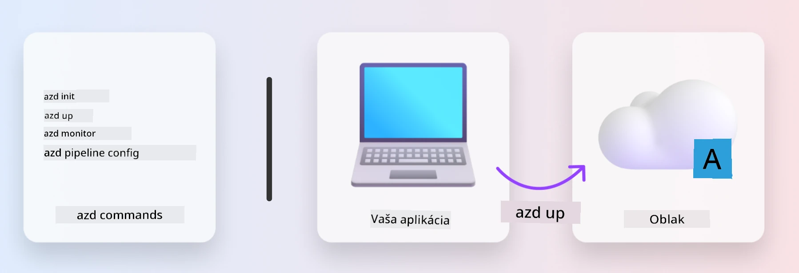
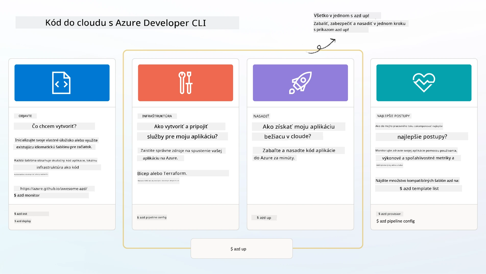

# 1. Vyberte si šablónu

!!! tip "NA KONCI TOHTO MODULU BUDETE VEDIEŤ"

    - [ ] Opísať, čo sú AZD šablóny
    - [ ] Objaviť a používať AZD šablóny pre AI
    - [ ] Začať s šablónou AI Agents
    - [ ] **Lab 1:** AZD Rýchly štart v Codespaces alebo dev kontejnery

---

## 1. Príklad staviteľa

Vytvorenie modernej AI aplikácie pripravené pre podnik _od základov_ môže byť náročné. Je to trochu ako stavať si svoj nový dom vlastnoručne, tehlu po tehle. Áno, dá sa to urobiť! Ale nie je to najefektívnejší spôsob, ako dosiahnuť požadovaný výsledok!

Namiesto toho často začíname s už existujúcim _projektovým plánom_ a pracujeme s architektom, aby sme ho prispôsobili našim osobným požiadavkám. A presne takýto prístup treba aplikovať pri budovaní inteligentných aplikácií. Najprv nájdite dobrý návrh architektúry, ktorá vyhovuje vašej problematike. Potom spolupracujte s riešiteľským architektom na prispôsobení a vývoji riešenia pre vašu špecifickú situáciu.

Kde však nájdeme tieto projektové plány? A ako nájsť architekta, ktorý je ochotný nás naučiť, ako tie plány prispôsobiť a nasadiť samostatne? V tomto workshope zodpovieme tieto otázky predstavením troch technológií:

1. [Azure Developer CLI](https://aka.ms/azd) - open-source nástroj, ktorý zrýchľuje cestu vývojára od lokálneho vývoja (build) až po nasadenie do cloudu (ship).
1. [Microsoft Foundry Templates](https://ai.azure.com/templates) - štandardizované open-source repozitáre obsahujúce ukážkový kód, infraštruktúru a konfiguračné súbory na nasadenie AI riešenia.
1. [GitHub Copilot Agent Mode](https://code.visualstudio.com/docs/copilot/chat/chat-agent-mode) - programovací agent založený na znalostiach Azure, ktorý nás môže viesť pri prehliadaní kódu a vykonávaní zmien pomocou prirodzeného jazyka.

S týmito nástrojmi môžeme teraz _objaviť_ správnu šablónu, _nasadiť_ ju a overiť, že funguje, a _prispôsobiť_ ju našim konkrétnym scenárom. Poďme sa ponoriť a naučiť sa, ako tieto fungujú.


---

## 2. Azure Developer CLI

[Azure Developer CLI](https://learn.microsoft.com/en-us/azure/developer/azure-developer-cli/) (alebo `azd`) je open-source príkazový nástroj, ktorý zrýchľuje prechod od kódu k cloudu pomocou sady príkazov priateľských k vývojárom, ktoré fungujú konzistentne vo vašom IDE (vývoj) aj CI/CD (devops) prostredí.

S `azd` môže byť vaša cesta nasadenia taká jednoduchá ako:

- `azd init` - Inicializuje nový AI projekt z existujúcej AZD šablóny.
- `azd up` - Zabezpečí infraštruktúru a nasadí vašu aplikáciu v jednom kroku.
- `azd monitor` - Získajte monitorovanie a diagnostiku v reálnom čase pre vašu nasadenú aplikáciu.
- `azd pipeline config` - Nastavte CI/CD pipeline na automatizáciu nasadenia do Azure.

**🎯 | CVIČENIE**: <br/> Preskúmajte príkazový nástroj `azd` vo vašom aktuálnom prostredí workshopu teraz. Môže to byť GitHub Codespaces, dev kontajner alebo lokálna kópia s nainštalovanými predpokladmi. Začnite zadaním tohto príkazu, aby ste videli, čo nástroj dokáže:

```bash title="" linenums="0"
azd help
```



---

## 3. AZD šablóna

Aby mohol `azd` toto dosiahnuť, potrebuje vedieť, akú infraštruktúru treba zabezpečiť, aké konfiguračné nastavenia uplatniť a akú aplikáciu nasadiť. Tu prichádzajú na rad [AZD šablóny](https://learn.microsoft.com/en-us/azure/developer/azure-developer-cli/azd-templates?tabs=csharp).

AZD šablóny sú open-source repozitáre, ktoré kombinujú ukážkový kód s infraštruktúrnymi a konfiguračnými súbormi potrebnými na nasadenie riešenia architektúry.
Použitím prístupu _Infrastructure-as-Code_ (IaC) umožňujú definície zdrojov a konfiguračné nastavenia byť riadené verziou (rovnako ako zdrojový kód aplikácie) - vytvárajúc opakovateľné a konzistentné pracovné postupy medzi používateľmi tohto projektu.

Pri vytváraní alebo znovupoužití AZD šablóny pre _váš_ scenár zvážte tieto otázky:

1. Čo vytvárate? → Existuje šablóna, ktorá má štartovací kód pre tento scenár?
1. Ako je vaše riešenie architektúrované? → Existuje šablóna obsahujúca potrebné zdroje?
1. Ako je vaše riešenie nasadené? → Myslite na `azd deploy` s pre/po spracovaním!
1. Ako to môžete ďalej optimalizovať? → Myslite na zabudované monitorovanie a automatizačné pipeline!

**🎯 | CVIČENIE**: <br/> 
Navštívte galériu [Awesome AZD](https://azure.github.io/awesome-azd/) a použite filtre na preskúmanie viac než 250 dostupných šablón. Skúste nájsť takú, ktorá zodpovedá _vašim_ požiadavkám scenára.



---

## 4. AI aplikačné šablóny

Pre AI aplikácie poskytuje Microsoft špecializované šablóny obsahujúce **Microsoft Foundry** a **Foundry Agents**. Tieto šablóny zrýchľujú vašu cestu k vývoju inteligentných, produkčne pripravených aplikácií.

### Microsoft Foundry & Foundry Agents šablóny

Vyberte si nižšie šablónu na nasadenie. Každá šablóna je dostupná na [Awesome AZD](https://azure.github.io/awesome-azd/) a môže byť inicializovaná jedným príkazom.

| Šablóna | Popis | Príkaz na nasadenie |
|----------|-------------|----------------|
| **[AI Chat with RAG](https://azure.github.io/awesome-azd/?tags=ai&tags=rag)** | Chat aplikácia s Retrieval Augmented Generation pomocou Microsoft Foundry | `azd init -t azure-samples/azure-search-openai-demo` |
| **[Foundry Agent Service Starter](https://azure.github.io/awesome-azd/?tags=ai&tags=agents)** | Vytvorte AI agentov s Foundry Agents pre autonómne vykonávanie úloh | `azd init -t azure-samples/foundry-agent-service-starter` |
| **[Multi-Agent Orchestration](https://azure.github.io/awesome-azd/?tags=ai&tags=agents)** | Koordinujte viacerých Foundry Agentov pre zložité pracovné toky | `azd init -t azure-samples/multi-agent-orchestration` |
| **[AI Document Intelligence](https://azure.github.io/awesome-azd/?tags=ai&tags=document)** | Extrahujte a analyzujte dokumenty pomocou Microsoft Foundry modelov | `azd init -t azure-samples/ai-document-processing` |
| **[Conversational AI Bot](https://azure.github.io/awesome-azd/?tags=ai&tags=bot)** | Vytvorte inteligentné chatboty s integráciou Microsoft Foundry | `azd init -t azure-samples/ai-chat-protocol` |
| **[AI Image Generation](https://azure.github.io/awesome-azd/?tags=ai&tags=dalle)** | Generujte obrázky pomocou DALL-E cez Microsoft Foundry | `azd init -t azure-samples/ai-image-generation` |
| **[Semantic Kernel Agent](https://azure.github.io/awesome-azd/?tags=ai&tags=semantic-kernel)** | AI agenti používajúci Semantic Kernel s Foundry Agents | `azd init -t azure-samples/semantic-kernel-agent` |
| **[AutoGen Multi-Agent](https://azure.github.io/awesome-azd/?tags=ai&tags=autogen)** | Systémy viacerých agentov pomocou rámca AutoGen | `azd init -t azure-samples/autogen-multi-agent` |

### Rýchly štart

1. **Prezrite si šablóny**: Navštívte [https://azure.github.io/awesome-azd/](https://azure.github.io/awesome-azd/) a filtrovať podľa `AI`, `Agents` alebo `Microsoft Foundry`
2. **Vyberte šablónu**: Zvoľte tú, ktorá zodpovedá vášmu použitiu
3. **Inicializujte**: Spustite príkaz `azd init` pre vybranú šablónu
4. **Nasadte**: Spustite `azd up` na zabezpečenie a nasadenie

**🎯 | CVIČENIE**: <br/>
Vyberte jednu z hore uvedených šablón podľa vášho scenára:

- **Staviate chatbota?** → Začnite s **AI Chat with RAG** alebo **Conversational AI Bot**
- **Potrebujete autonómnych agentov?** → Vyskúšajte **Foundry Agent Service Starter** alebo **Multi-Agent Orchestration**
- **Spracovávate dokumenty?** → Použite **AI Document Intelligence**
- **Chcete asistenciu pri kódovaní AI?** → Preskúmajte **Semantic Kernel Agent** alebo **AutoGen Multi-Agent**

```bash title="Example: Deploy the AI Chat with RAG template" linenums="0"
azd init -t azure-samples/azure-search-openai-demo
azd up
```

!!! info "Preskúmajte viac šablón"
    Galéria [Awesome AZD](https://azure.github.io/awesome-azd/) obsahuje viac než 250 šablón. Použite filtre, aby ste našli šablóny vyhovujúce vašim konkrétnym požiadavkám na jazyk, framework a Azure služby.

---

<!-- CO-OP TRANSLATOR DISCLAIMER START -->
**Zrieknutie sa zodpovednosti**:  
Tento dokument bol preložený pomocou AI prekladateľskej služby [Co-op Translator](https://github.com/Azure/co-op-translator). Hoci sa snažíme o presnosť, majte prosím na pamäti, že automatizované preklady môžu obsahovať chyby alebo nepresnosti. Pôvodný dokument v jeho rodnom jazyku by mal byť považovaný za autoritatívny zdroj. Pre kritické informácie sa odporúča profesionálny ľudský preklad. Nezodpovedáme za akékoľvek nedorozumenia alebo nesprávne interpretácie vyplývajúce z použitia tohto prekladu.
<!-- CO-OP TRANSLATOR DISCLAIMER END -->