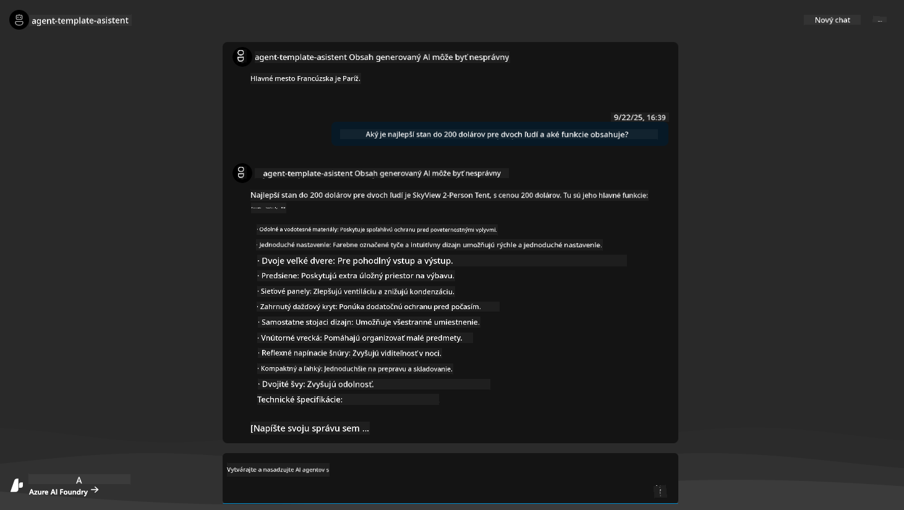
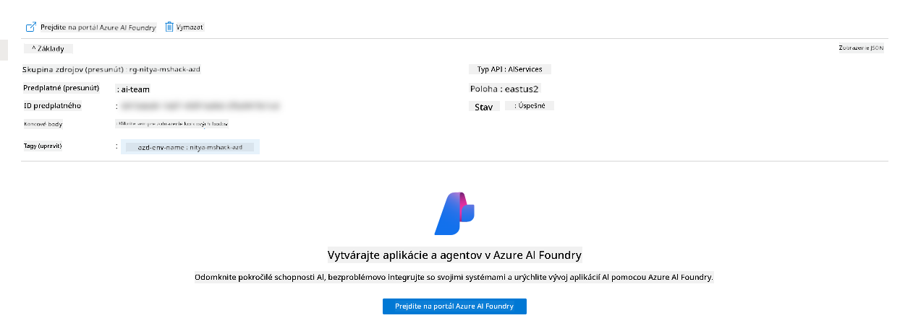
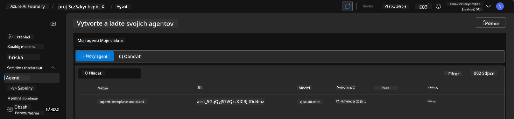
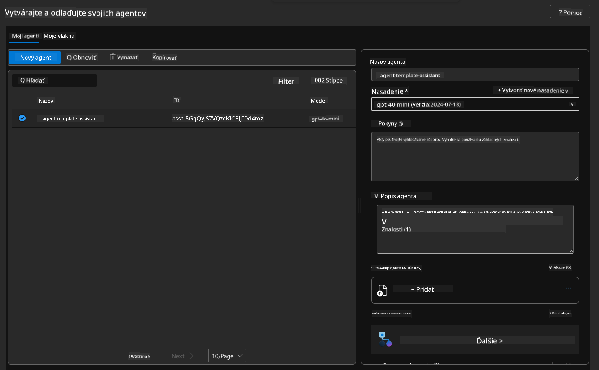
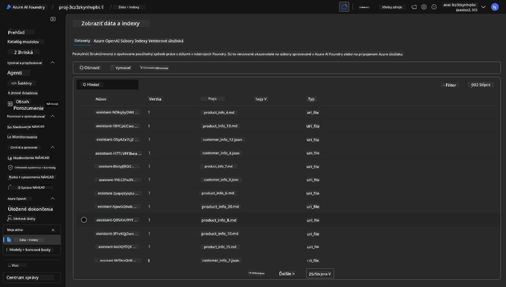
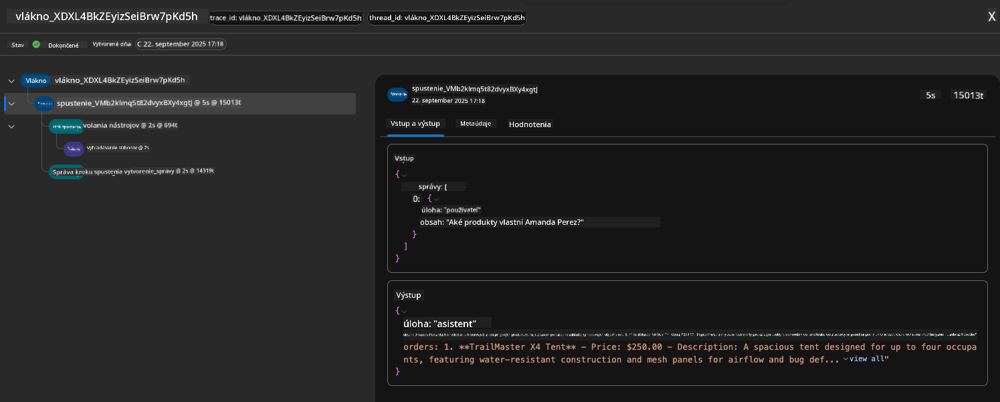

<!--
CO_OP_TRANSLATOR_METADATA:
{
  "original_hash": "7816c6ec50c694c331e7c6092371be4d",
  "translation_date": "2025-09-25T02:10:46+00:00",
  "source_file": "workshop/docs/instructions/2-Validate-AI-Template.md",
  "language_code": "sk"
}
-->
# 2. Overenie šablóny

!!! tip "NA KONCI TOHTO MODULU BUDETE SCHOPNÍ"

    - [ ] Analyzovať architektúru AI riešenia
    - [ ] Pochopiť pracovný postup nasadenia AZD
    - [ ] Použiť GitHub Copilot na pomoc pri používaní AZD
    - [ ] **Lab 2:** Nasadiť a overiť šablónu AI agentov

---

## 1. Úvod

[Azure Developer CLI](https://learn.microsoft.com/en-us/azure/developer/azure-developer-cli/) alebo `azd` je open-source nástroj príkazového riadku, ktorý zjednodušuje pracovný postup vývojára pri vytváraní a nasadzovaní aplikácií do Azure.

[AZD šablóny](https://learn.microsoft.com/azure/developer/azure-developer-cli/azd-templates) sú štandardizované repozitáre, ktoré obsahujú ukážkový aplikačný kód, aktíva _infrastructure as code_ a konfiguračné súbory `azd` pre ucelenú architektúru riešenia. Zriadenie infraštruktúry sa stáva tak jednoduchým ako príkaz `azd provision` - zatiaľ čo použitie `azd up` umožňuje zriadiť infraštruktúru **a** nasadiť vašu aplikáciu naraz!

Vďaka tomu môže byť začiatok vývoja vašej aplikácie taký jednoduchý, ako nájsť správnu _AZD Starter šablónu_, ktorá najviac vyhovuje vašim potrebám aplikácie a infraštruktúry - a potom prispôsobiť repozitár vašim požiadavkám na scenár.

Predtým, než začneme, uistite sa, že máte nainštalovaný Azure Developer CLI.

1. Otvorte terminál vo VS Code a zadajte tento príkaz:

      ```bash title="" linenums="0"
      azd version
      ```

1. Mali by ste vidieť niečo takéto!

      ```bash title="" linenums="0"
      azd version 1.19.0 (commit b3d68cea969b2bfbaa7b7fa289424428edb93e97)
      ```

**Teraz ste pripravení vybrať a nasadiť šablónu pomocou azd**

---

## 2. Výber šablóny

Platforma Azure AI Foundry obsahuje [sadu odporúčaných AZD šablón](https://learn.microsoft.com/en-us/azure/ai-foundry/how-to/develop/ai-template-get-started), ktoré pokrývajú populárne scenáre riešení, ako je _automatizácia pracovného toku viacerých agentov_ a _spracovanie multimodálneho obsahu_. Tieto šablóny môžete objaviť aj návštevou portálu Azure AI Foundry.

1. Navštívte [https://ai.azure.com/templates](https://ai.azure.com/templates)
1. Prihláste sa do portálu Azure AI Foundry, keď budete vyzvaní - uvidíte niečo takéto.


**Základné** možnosti sú vaše štartovacie šablóny:

1. [ ] [Začnite s AI Chat](https://github.com/Azure-Samples/get-started-with-ai-chat), ktorá nasadí základnú chatovaciu aplikáciu _s vašimi dátami_ do Azure Container Apps. Použite to na preskúmanie základného scenára AI chatbotu.
1. [X] [Začnite s AI agentmi](https://github.com/Azure-Samples/get-started-with-ai-agents), ktorá tiež nasadí štandardného AI agenta (s Azure AI Agent Service). Použite to na oboznámenie sa s agentickými AI riešeniami zahŕňajúcimi nástroje a modely.

Navštívte druhý odkaz v novom okne prehliadača (alebo kliknite na `Open in GitHub` pre súvisiacu kartu). Mali by ste vidieť repozitár pre túto AZD šablónu. Venujte chvíľu preskúmaniu README. Architektúra aplikácie vyzerá takto:


---

## 3. Aktivácia šablóny

Skúsme nasadiť túto šablónu a uistiť sa, že je platná. Budeme postupovať podľa pokynov v sekcii [Getting Started](https://github.com/Azure-Samples/get-started-with-ai-agents?tab=readme-ov-file#getting-started).

1. Kliknite na [tento odkaz](https://github.com/codespaces/new/Azure-Samples/get-started-with-ai-agents) - potvrďte predvolenú akciu `Create codespace`
1. Otvorí sa nové okno prehliadača - počkajte, kým sa relácia GitHub Codespaces načíta
1. Otvorte terminál vo VS Code v Codespaces - zadajte nasledujúci príkaz:

   ```bash title="" linenums="0"
   azd up
   ```

Dokončite kroky pracovného postupu, ktoré sa spustia:

1. Budete vyzvaní na prihlásenie do Azure - postupujte podľa pokynov na autentifikáciu
1. Zadajte jedinečný názov prostredia - napr. som použil `nitya-mshack-azd`
1. Tým sa vytvorí priečinok `.azure/` - uvidíte podpriečinok s názvom prostredia
1. Budete vyzvaní na výber názvu predplatného - vyberte predvolené
1. Budete vyzvaní na výber lokality - použite `East US 2`

Teraz počkajte, kým sa zriadenie dokončí. **Toto trvá 10-15 minút**

1. Po dokončení sa vo vašej konzole zobrazí správa o úspechu, ako je táto:
      ```bash title="" linenums="0"
      SUCCESS: Your up workflow to provision and deploy to Azure completed in 10 minutes 17 seconds.
      ```
1. Váš Azure Portal bude teraz obsahovať zriadenú skupinu zdrojov s týmto názvom prostredia:

      

1. **Teraz ste pripravení overiť nasadenú infraštruktúru a aplikáciu**.

---

## 4. Overenie šablóny

1. Navštívte stránku [Resource Groups](https://portal.azure.com/#browse/resourcegroups) v Azure Portali - prihláste sa, keď budete vyzvaní
1. Kliknite na RG pre názov vášho prostredia - uvidíte vyššie uvedenú stránku

      - kliknite na zdroj Azure Container Apps
      - kliknite na URL aplikácie v sekcii _Essentials_ (vpravo hore)

1. Mali by ste vidieť hostované aplikačné rozhranie ako toto:

   

1. Skúste položiť niekoľko [ukážkových otázok](https://github.com/Azure-Samples/get-started-with-ai-agents/blob/main/docs/sample_questions.md)

      1. Spýtajte sa: ```What is the capital of France?``` 
      1. Spýtajte sa: ```What's the best tent under $200 for two people, and what features does it include?```

1. Mali by ste dostať odpovede podobné tým, ktoré sú uvedené nižšie. _Ale ako to funguje?_ 

      

---

## 5. Overenie agenta

Azure Container App nasadzuje endpoint, ktorý sa pripája k AI agentovi zriadenému v projekte Azure AI Foundry pre túto šablónu. Pozrime sa, čo to znamená.

1. Vráťte sa na stránku _Overview_ vášho zdrojového skupiny v Azure Portali

1. Kliknite na zdroj `Azure AI Foundry` v zozname

1. Mali by ste vidieť toto. Kliknite na tlačidlo `Go to Azure AI Foundry Portal`. 
   

1. Mali by ste vidieť stránku projektu Foundry pre vašu AI aplikáciu
   

1. Kliknite na `Agents` - uvidíte predvoleného agenta zriadeného vo vašom projekte
   

1. Vyberte ho - a uvidíte podrobnosti o agentovi. Všimnite si nasledujúce:

      - Agent používa File Search predvolene (vždy)
      - `Knowledge` agenta naznačuje, že má nahraných 32 súborov (pre File Search)
      

1. Vyhľadajte možnosť `Data+indexes` v ľavom menu a kliknite na podrobnosti. 

      - Mali by ste vidieť 32 dátových súborov nahraných pre znalosti.
      - Tieto budú zodpovedať 12 zákazníckym súborom a 20 produktovým súborom v `src/files` 
      

**Overili ste operáciu agenta!** 

1. Odpovede agenta sú založené na znalostiach v týchto súboroch. 
1. Teraz môžete klásť otázky týkajúce sa týchto dát a dostávať relevantné odpovede.
1. Príklad: `customer_info_10.json` popisuje 3 nákupy, ktoré uskutočnila "Amanda Perez"

Vráťte sa na kartu prehliadača s endpointom Container App a spýtajte sa: `What products does Amanda Perez own?`. Mali by ste vidieť niečo takéto:


---

## 6. Ihrisko agenta

Poďme si vybudovať trochu viac intuície pre schopnosti Azure AI Foundry tým, že si agenta vyskúšame na ihrisku Agents Playground. 

1. Vráťte sa na stránku `Agents` v Azure AI Foundry - vyberte predvoleného agenta
1. Kliknite na možnosť `Try in Playground` - mali by ste dostať rozhranie Playground ako toto
1. Spýtajte sa tú istú otázku: `What products does Amanda Perez own?`

    

Dostanete tú istú (alebo podobnú) odpoveď - ale tiež dostanete ďalšie informácie, ktoré môžete použiť na pochopenie kvality, nákladov a výkonu vašej agentickej aplikácie. Napríklad:

1. Všimnite si, že odpoveď cituje dátové súbory použité na "základ" odpovede
1. Prejdite myšou nad ktorýmkoľvek z týchto označení súborov - zodpovedajú dáta vášmu dotazu a zobrazenej odpovedi?

Tiež vidíte _stats_ riadok pod odpoveďou. 

1. Prejdite myšou nad ktoroukoľvek metrikou - napr. Safety. Vidíte niečo takéto
1. Zodpovedá hodnotenie vašej intuícii pre úroveň bezpečnosti odpovede?

      

---x

## 7. Zabudovaná pozorovateľnosť

Pozorovateľnosť znamená inštrumentáciu vašej aplikácie na generovanie dát, ktoré môžu byť použité na pochopenie, ladenie a optimalizáciu jej operácií. Aby ste si to mohli predstaviť:

1. Kliknite na tlačidlo `View Run Info` - mali by ste vidieť tento pohľad. Toto je príklad [sledovania agenta](https://learn.microsoft.com/en-us/azure/ai-foundry/how-to/develop/trace-agents-sdk#view-trace-results-in-the-azure-ai-foundry-agents-playground) v akcii. _Tento pohľad môžete získať aj kliknutím na Thread Logs v hlavnom menu_.

   - Získajte prehľad o krokoch behu a nástrojoch zapojených agentom
   - Pochopte celkový počet tokenov (vs. použitie výstupných tokenov) pre odpoveď
   - Pochopte latenciu a kde sa trávi čas pri vykonávaní

      

1. Kliknite na kartu `Metadata`, aby ste videli ďalšie atribúty behu, ktoré môžu poskytnúť užitočný kontext pre ladenie problémov neskôr.   

      

1. Kliknite na kartu `Evaluations`, aby ste videli automatické hodnotenia vykonané na odpovedi agenta. Tieto zahŕňajú hodnotenia bezpečnosti (napr. Sebapoškodenie) a špecifické hodnotenia agenta (napr. Rozlíšenie zámeru, Dodržiavanie úlohy).

      

1. Nakoniec kliknite na kartu `Monitoring` v bočnom menu.

      - Vyberte kartu `Resource usage` na zobrazené stránke - a prezrite si metriky.
      - Sledujte používanie aplikácie z hľadiska nákladov (tokeny) a záťaže (požiadavky).
      - Sledujte latenciu aplikácie od prvého bajtu (spracovanie vstupu) po posledný bajt (výstup).

      

---

## 8. Premenné prostredia

Doteraz sme prešli nasadením v prehliadači - a overili, že naša infraštruktúra je zriadená a aplikácia je funkčná. Ale na prácu s aplikáciou _code-first_ potrebujeme nakonfigurovať naše lokálne vývojové prostredie s relevantnými premennými potrebnými na prácu s týmito zdrojmi. Použitie `azd` to uľahčuje.

1. Azure Developer CLI [používa premenné prostredia](https://learn.microsoft.com/en-us/azure/developer/azure-developer-cli/manage-environment-variables?tabs=bash) na ukladanie a správu konfiguračných nastavení pre nasadenia aplikácií.

1. Premenné prostredia sú uložené v `.azure/<env-name>/.env` - to ich obmedzuje na prostredie `env-name` použité počas nasadenia a pomáha vám izolovať prostredia medzi rôznymi cieľmi nasadenia v tom istom repozitári.

1. Premenné prostredia sú automaticky načítané príkazom `azd` vždy, keď vykonáva konkrétny príkaz (napr. `azd up`). Všimnite si, že `azd` automaticky nečíta _OS-level_ premenné prostredia (napr. nastavené v shelli) - namiesto toho použite `azd set env` a `azd get env` na prenos informácií v rámci skriptov.

Skúsme niekoľko príkazov:

1. Získajte všetky premenné prostredia nastavené pre `azd` v tomto prostredí:

      ```bash title="" linenums="0"
      azd env get-values
      ```
      
      Vidíte niečo takéto:

      ```bash title="" linenums="0"
      AZURE_AI_AGENT_DEPLOYMENT_NAME="gpt-4o-mini"
      AZURE_AI_AGENT_NAME="agent-template-assistant"
      AZURE_AI_EMBED_DEPLOYMENT_NAME="text-embedding-3-small"
      AZURE_AI_EMBED_DIMENSIONS=100
      ...
      ```

1. Získajte konkrétnu hodnotu - napr. chcem vedieť, či sme nastavili hodnotu `AZURE_AI_AGENT_MODEL_NAME`

      ```bash title="" linenums="0"
      azd env get-value AZURE_AI_AGENT_MODEL_NAME 
      ```
      
      Vidíte niečo takéto - nebolo nastavené predvolene!

      ```bash title="" linenums="0"
      ERROR: key 'AZURE_AI_AGENT_MODEL_NAME' not found in the environment values
      ```

1. Nastavte novú premennú prostredia pre `azd`. Tu aktualizujeme názov modelu agenta. _Poznámka: všetky vykonané zmeny sa okamžite prejavia v súbore `.azure/<env-name>/.env`.

      ```bash title="" linenums="0"
      azd env set AZURE_AI_AGENT_MODEL_NAME gpt-4.1
      azd env set AZURE_AI_AGENT_MODEL_VERSION 2025-04-14
      azd env set AZURE_AI_AGENT_DEPLOYMENT_CAPACITY 150
      ```

      Teraz by sme mali zistiť, že hodnota je nastavená:

      ```bash title="" linenums="0"
      azd env get-value AZURE_AI_AGENT_MODEL_NAME 
      ```

1. Všimnite si, že niektoré zdroje sú perzistentné (napr. nasadenia modelov) a budú vyžadovať viac než len `azd up`, aby sa vynútilo opätovné nasadenie. Skúsme zrušiť pôvodné nasadenie a znovu nasadiť so zmenenými premennými prostredia.

1. **Obnoviť** Ak ste predtým nasadili infraštruktúru pomocou šablóny azd - môžete _obnoviť_ stav vašich lokálnych premenných prostredia na základe aktuálneho stavu vášho nasadenia Azure pomocou tohto príkazu:
      ```bash title="" linenums="0"
      azd env refresh
      ```

      Toto je výkonný spôsob, ako _synchronizovať_ environmentálne premenné medzi dvoma alebo viacerými lokálnymi vývojovými prostrediami (napr. tím s viacerými vývojármi) - umožňuje nasadenej infraštruktúre slúžiť ako základná pravda pre stav environmentálnych premenných. Členovia tímu jednoducho _obnovia_ premenné, aby sa dostali späť do synchronizácie.

---

## 9. Gratulujeme 🏆

Práve ste dokončili kompletný pracovný postup, v ktorom ste:

- [X] Vybrali AZD šablónu, ktorú chcete použiť
- [X] Spustili šablónu pomocou GitHub Codespaces
- [X] Nasadili šablónu a overili, že funguje

---

