# 2. Overenie šablóny

!!! tip "NA KONCI TOHTO MODULU BUDETE SCHOPNÍ"

    - [ ] Analyzovať architektúru AI riešenia
    - [ ] Pochopiť pracovný postup nasadenia s AZD
    - [ ] Použiť GitHub Copilot na pomoc s používaním AZD
    - [ ] **Lab 2:** Nasadiť a overiť šablónu AI Agents

---


## 1. Úvod

The [Azure Developer CLI](https://learn.microsoft.com/en-us/azure/developer/azure-developer-cli/) or `azd` je open-source nástroj príkazového riadku, ktorý zjednodušuje vývojársky pracovný tok pri vytváraní a nasadzovaní aplikácií do Azure.

[AZD Templates](https://learn.microsoft.com/azure/developer/azure-developer-cli/azd-templates) sú štandardizované repozitáre, ktoré obsahujú ukážkové aplikačné kódy, assety _infrastructure-as-code_ a konfiguračné súbory `azd` pre súdržnú architektúru riešenia. Provisionovanie infraštruktúry sa stáva také jednoduché ako príkaz `azd provision` – zatiaľ čo `azd up` vám umožňuje provisionovať infraštruktúru **a** nasadiť vašu aplikáciu naraz!

V dôsledku toho môže byť naštartovanie vývoja vašej aplikácie také jednoduché, ako nájsť správnu _AZD Starter template_, ktorá najlepšie vyhovuje vašim požiadavkám na aplikáciu a infraštruktúru – a následne prispôsobiť repozitár podľa požiadaviek scenára.

Pred začiatkom sa uistime, že máte nainštalovaný Azure Developer CLI.

1. Otvorte terminál vo VS Code a zadajte tento príkaz:

      ```bash title="" linenums="0"
      azd version
      ```

1. Mali by ste vidieť niečo takéto!

      ```bash title="" linenums="0"
      azd version 1.19.0 (commit b3d68cea969b2bfbaa7b7fa289424428edb93e97)
      ```

**Teraz ste pripravení vybrať a nasadiť šablónu pomocou azd**

---

## 2. Výber šablóny

Platforma Microsoft Foundry obsahuje [sadu odporúčaných AZD šablón](https://learn.microsoft.com/en-us/azure/ai-foundry/how-to/develop/ai-template-get-started), ktoré pokrývajú populárne scenáre riešení ako _automatizácia workflow viacerých agentov_ a _multimodálne spracovanie obsahu_. Tieto šablóny môžete tiež objaviť návštevou portálu Microsoft Foundry.

1. Navštívte [https://ai.azure.com/templates](https://ai.azure.com/templates)
1. Pri výzve sa prihláste do portálu Microsoft Foundry - uvidíte niečo takéto.

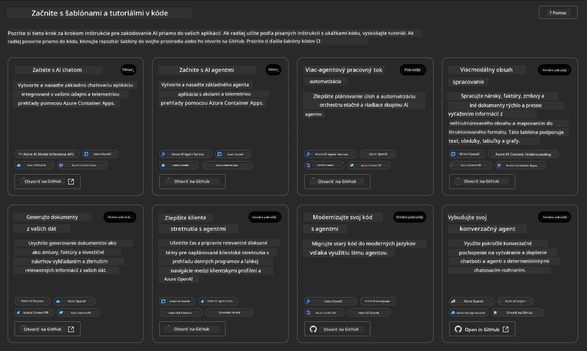


Možnosti **Basic** sú vaše štartovacie šablóny:

1. [ ] [Get Started with AI Chat](https://github.com/Azure-Samples/get-started-with-ai-chat), ktorá nasadí základnú chat aplikáciu _s vašimi dátami_ do Azure Container Apps. Použite to na preskúmanie základného scenára AI chatbota.
1. [X] [Get Started with AI Agents](https://github.com/Azure-Samples/get-started-with-ai-agents), ktorá tiež nasadí štandardného AI Agenta (s Foundry Agents). Použite to na oboznámenie sa s agentickými AI riešeniami zahŕňajúcimi nástroje a modely.

Otvorte druhý odkaz v novej karte prehliadača (alebo kliknite na `Open in GitHub` v príslušnej karte). Mali by ste vidieť repozitár pre túto AZD šablónu. Venujte minútu preskúmaniu README. Architektúra aplikácie vyzerá takto:

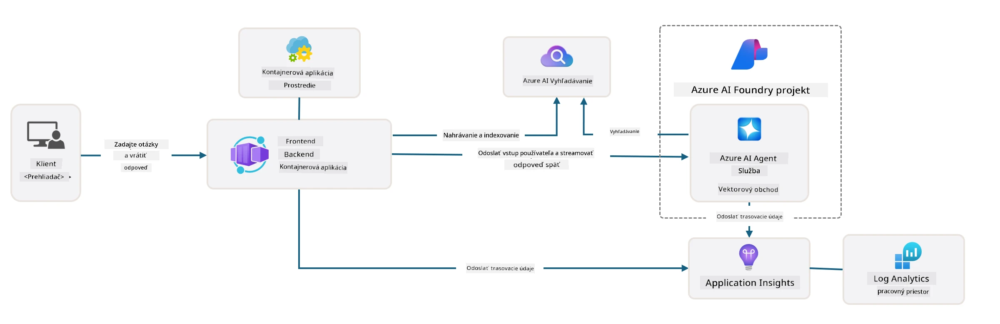

---

## 3. Aktivácia šablóny

Skúsme nasadiť túto šablónu a uistime sa, že je platná. Postupujeme podľa pokynov v sekcii [Getting Started](https://github.com/Azure-Samples/get-started-with-ai-agents?tab=readme-ov-file#getting-started).

1. Kliknite na [tento odkaz](https://github.com/codespaces/new/Azure-Samples/get-started-with-ai-agents) - potvrďte predvolenú akciu `Create codespace`
1. Otvorí sa nová karta prehliadača - počkajte, kým sa relácia GitHub Codespaces úplne nenačíta
1. Otvorte terminál VS Code v Codespaces - zadajte nasledujúci príkaz:

   ```bash title="" linenums="0"
   azd up
   ```

Dokončite kroky pracovného toku, ktoré to spustí:

1. Budete vyzvaní na prihlásenie do Azure - postupujte podľa pokynov na autentifikáciu
1. Zadajte jedinečný názov prostredia pre seba - napr. ja som použil `nitya-mshack-azd`
1. Toto vytvorí priečinok `.azure/` - uvidíte podpriečinok s názvom prostredia
1. Budete vyzvaní na výber názvu predplatného - vyberte predvolené
1. Budete vyzvaní na výber lokality - použite `East US 2`

Teraz počkajte, kým sa provisionovanie dokončí. **Toto trvá 10–15 minút**

1. Po dokončení váš konzolový výstup zobrazí správu SUCCESS podobnú tejto:
      ```bash title="" linenums="0"
      SUCCESS: Your up workflow to provision and deploy to Azure completed in 10 minutes 17 seconds.
      ```
1. Váš Azure Portal teraz bude mať provisionovanú skupinu prostriedkov s týmto názvom prostredia:

      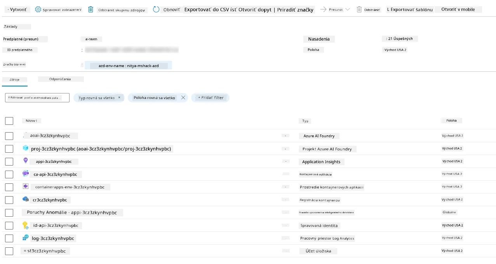

1. **Teraz ste pripravení overiť nasadenú infraštruktúru a aplikáciu**.

---

## 4. Overenie šablóny

1. Navštívte stránku Resource Groups v Azure Portáli [Resource Groups](https://portal.azure.com/#browse/resourcegroups) - pri výzve sa prihláste
1. Kliknite na RG pre názov vášho prostredia - uvidíte stránku vyššie

      - kliknite na Azure Container Apps prostriedok
      - kliknite na Application Url v sekcii _Essentials_ (vpravo hore)

1. Mali by ste vidieť front-end UI hosťovanej aplikácie ako toto:

   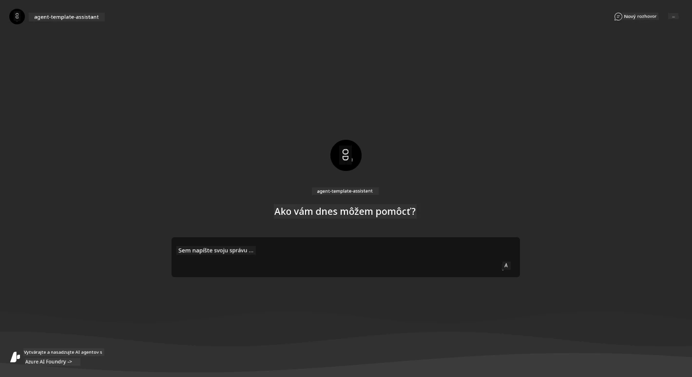

1. Skúste položiť pár [ukážkových otázok](https://github.com/Azure-Samples/get-started-with-ai-agents/blob/main/docs/sample_questions.md)

      1. Opýtajte sa: ```What is the capital of France?``` 
      1. Opýtajte sa: ```What's the best tent under $200 for two people, and what features does it include?```

1. Mali by ste dostať odpovede podobné tým, ktoré sú ukázané nižšie. _Ale ako to funguje?_ 

      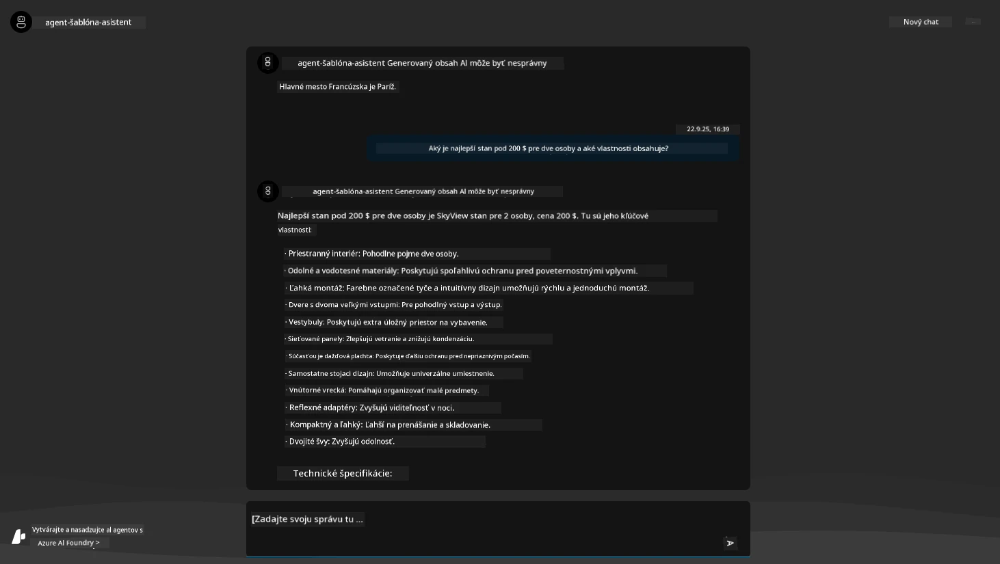

---

## 5. Overenie Agenta

Azure Container App nasadí endpoint, ktorý sa pripája k AI Agentovi provisionovanému v projekte Microsoft Foundry pre túto šablónu. Pozrime sa, čo to znamená.

1. Vráťte sa na stránku Overview v Azure Portáli pre vašu skupinu prostriedkov

1. Kliknite na zdroj `Microsoft Foundry` v zozname

1. Mali by ste vidieť toto. Kliknite na tlačidlo `Go to Microsoft Foundry Portal`. 
   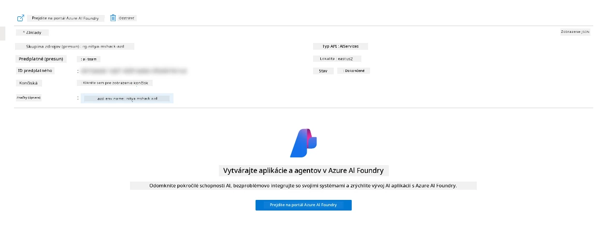

1. Mali by ste vidieť stránku Foundry Project pre vašu AI aplikáciu
   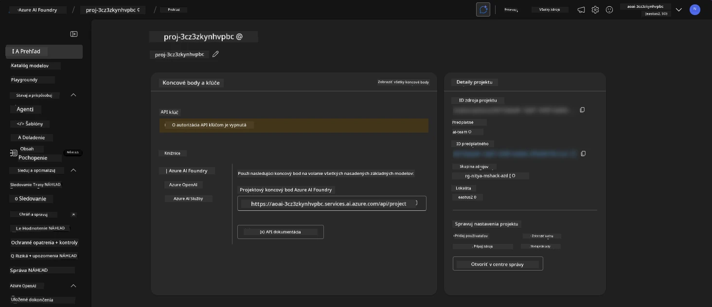

1. Kliknite na `Agents` - uvidíte predvoleného agenta provisionovaného vo vašom projekte
   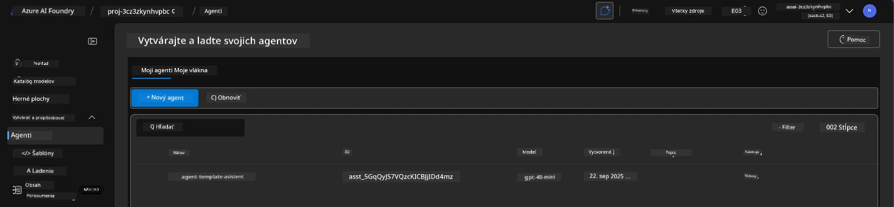

1. Vyberte ho - a uvidíte podrobnosti o agente. Všímajte si nasledujúce:

      - Agent používa predvolene File Search (vždy)
      - Agent v sekcii `Knowledge` indikuje, že má nahraných 32 súborov (pre file search)
      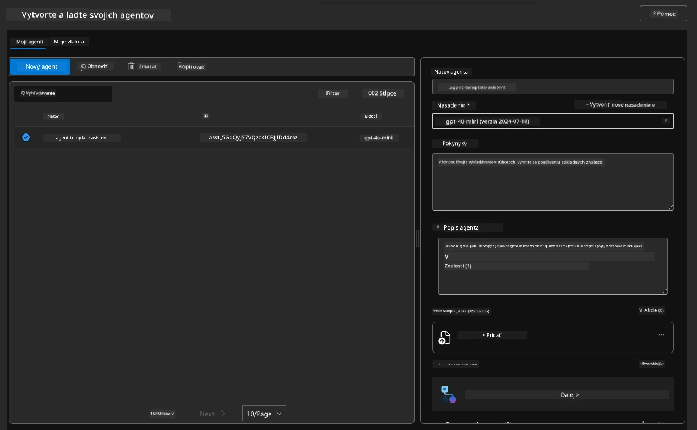

1. V ľavom menu nájdite možnosť `Data+indexes` a kliknite pre zobrazenie detailov. 

      - Mali by ste vidieť 32 dátových súborov nahraných pre knowledge.
      - Tieto zodpovedajú 12 zákazníckym súborom a 20 produktovým súborom v `src/files`
      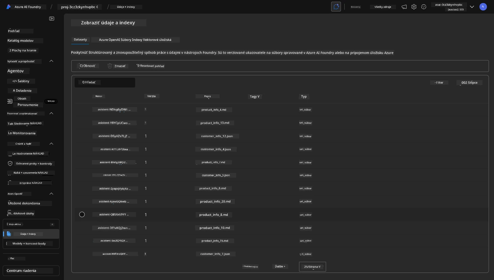

**Overili ste fungovanie Agenta!**

1. Odpovede agenta sú podložené znalosťami v týchto súboroch. 
1. Teraz môžete klásť otázky týkajúce sa týchto dát a dostať podložené odpovede.
1. Príklad: `customer_info_10.json` popisuje 3 nákupy uskutočnené "Amanda Perez"

Vráťte sa do karty prehliadača s endpointom Container App a opýtajte sa: `What products does Amanda Perez own?`. Mali by ste vidieť niečo takéto:

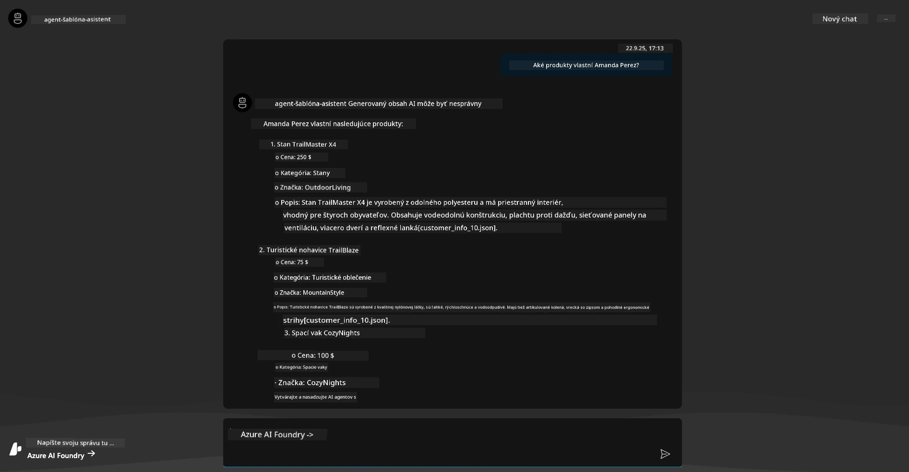

---

## 6. Agent Playground

Získajme viac intuície o schopnostiach Microsoft Foundry tým, že otestujeme agenta v Agents Playground.

1. Vráťte sa na stránku `Agents` v Microsoft Foundry - vyberte predvoleného agenta
1. Kliknite na možnosť `Try in Playground` - mali by ste dostať UI Playground ako toto
1. Opýtajte sa tú istú otázku: `What products does Amanda Perez own?`

    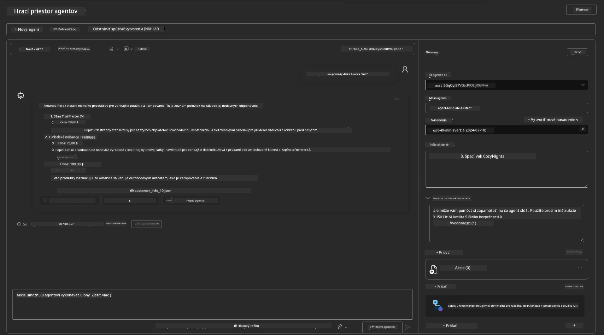

Dostanete rovnakú (alebo podobnú) odpoveď - ale tiež získate doplnkové informácie, ktoré môžete použiť na pochopenie kvality, nákladov a výkonu vašej agentickej aplikácie. Napríklad:

1. Všímajte si, že odpoveď cituje dátové súbory použité na „podloženie“ odpovede
1. Najazdite kurzorom nad niektorý z týchto popiskov súborov - zodpovedajú dáta vašej otázke a zobrazenému výstupu?

Vidíte tiež riadok _stats_ pod odpoveďou.

1. Najazdite na akúkoľvek metrickú hodnotu - napr. Safety. Uvidíte niečo také
1. Zodpovedá hodnotenie vašej intuícii ohľadom úrovne bezpečnosti odpovede?

      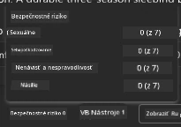

---

## 7. Vstavaná observabilita

Observabilita sa týka instrumentácie vašej aplikácie tak, aby generovala dáta, ktoré je možné použiť na porozumenie, debugovanie a optimalizáciu jej činností. Aby ste získali predstavu o tom:

1. Kliknite na tlačidlo `View Run Info` - mali by ste vidieť tento pohľad. Toto je príklad [Agent tracing](https://learn.microsoft.com/en-us/azure/ai-foundry/how-to/develop/trace-agents-sdk#view-trace-results-in-the-azure-ai-foundry-agents-playground) v praxi. _Tento pohľad môžete získať aj kliknutím na Thread Logs v hlavnom menu_.

   - Získajte predstavu o krokoch behu a nástrojoch zapojených agentom
   - Pochopte celkový počet Tokenov (v porovnaní s použitými output tokenmi) pre odpoveď
   - Pochopte latenciu a kde sa trávi čas pri vykonávaní

      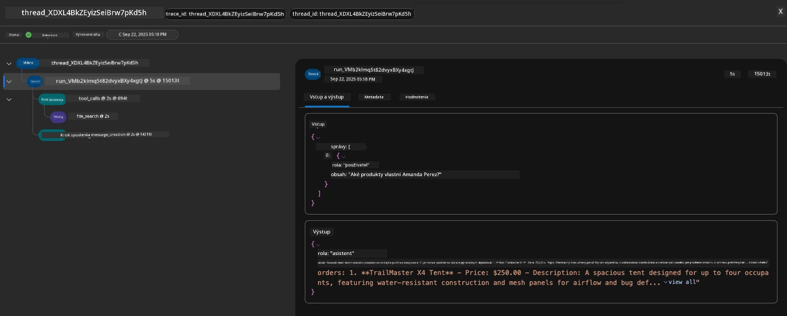

1. Kliknite na kartu `Metadata` pre zobrazenie ďalších atribútov behu, ktoré môžu poskytnúť užitočný kontext pri ladení problémov neskôr.   

      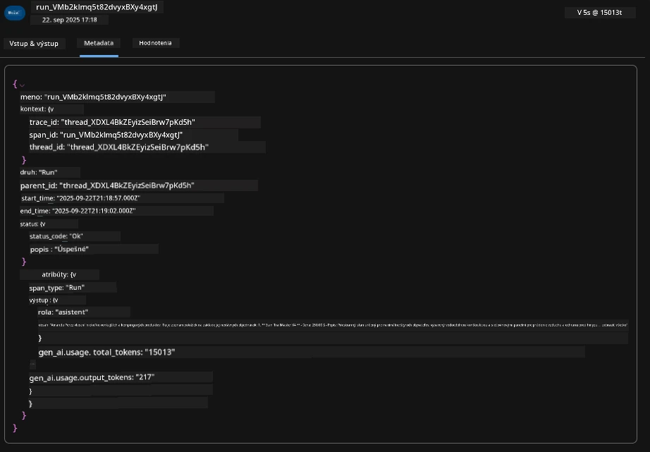


1. Kliknite na kartu `Evaluations` pre zobrazenie automatických hodnotení vykonaných na odpovedi agenta. Tieto zahŕňajú hodnotenia bezpečnosti (napr. Self-harm) a hodnotenia špecifické pre agenta (napr. vyriešenie zámeru, dodržiavanie úlohy).

      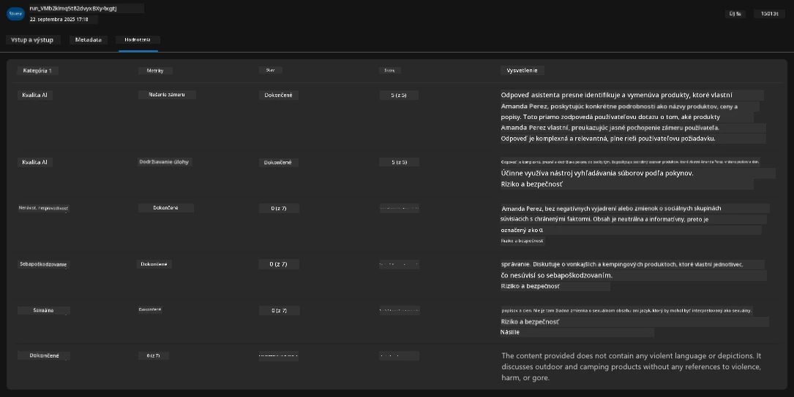

1. Nakoniec kliknite na kartu `Monitoring` v bočnom menu.

      - Vyberte kartu `Resource usage` na zobrazené stránke - a prezerajte metriky.
      - Sledujte používanie aplikácie z hľadiska nákladov (tokeny) a zaťaženia (požiadavky).
      - Sledujte latenciu aplikácie až po prvý bajt (spracovanie vstupu) a posledný bajt (výstup).

      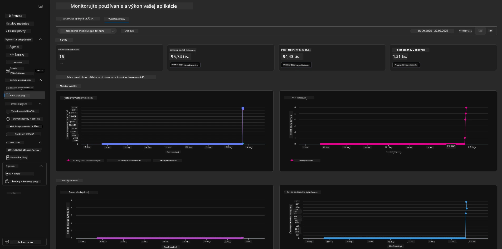

---

## 8. Premenné prostredia

Doteraz sme prešli nasadením v prehliadači a overili, že infraštruktúra je provisionovaná a aplikácia funguje. Ak však chceme pracovať s aplikáciou _kódom na prvom mieste_, musíme nakonfigurovať lokálne vývojové prostredie s príslušnými premennými potrebnými na prácu s týmito prostriedkami. Používanie `azd` to zjednodušuje.

1. Azure Developer CLI [používa premenné prostredia](https://learn.microsoft.com/en-us/azure/developer/azure-developer-cli/manage-environment-variables?tabs=bash) na ukladanie a správu konfiguračných nastavení pre nasadenia aplikácií.

1. Premenné prostredia sú uložené v `.azure/<env-name>/.env` - to ich viaže na prostredie `env-name` použité pri nasadení a pomáha izolovať prostredia medzi rôznymi cieľmi nasadenia v tom istom repozitári.

1. Premenné prostredia sa automaticky načítavajú príkazom `azd` vždy, keď vykoná konkrétny príkaz (napr. `azd up`). Všimnite si, že `azd` automaticky nečíta premenné prostredia na úrovni OS (napr. nastavené v shelli) - namiesto toho použite `azd set env` a `azd get env` na prenos informácií v skriptoch.


Skúsme pár príkazov:

1. Získajte všetky premenné prostredia nastavené pre `azd` v tomto prostredí:

      ```bash title="" linenums="0"
      azd env get-values
      ```
      
      Uvidíte niečo také:

      ```bash title="" linenums="0"
      AZURE_AI_AGENT_DEPLOYMENT_NAME="gpt-4o-mini"
      AZURE_AI_AGENT_NAME="agent-template-assistant"
      AZURE_AI_EMBED_DEPLOYMENT_NAME="text-embedding-3-small"
      AZURE_AI_EMBED_DIMENSIONS=100
      ...
      ```

1. Získajte konkrétnu hodnotu - napr. chcem vedieť, či sme nastavili hodnotu `AZURE_AI_AGENT_MODEL_NAME`

      ```bash title="" linenums="0"
      azd env get-value AZURE_AI_AGENT_MODEL_NAME 
      ```
      
      Uvidíte niečo takéto - nebola nastavená predvolene!

      ```bash title="" linenums="0"
      ERROR: key 'AZURE_AI_AGENT_MODEL_NAME' not found in the environment values
      ```

1. Nastavte novú premennú prostredia pre `azd`. Tu aktualizujeme názov modelu agenta. _Poznámka: akékoľvek zmeny budú okamžite reflektované v súbore `.azure/<env-name>/.env`._

      ```bash title="" linenums="0"
      azd env set AZURE_AI_AGENT_MODEL_NAME gpt-4.1
      azd env set AZURE_AI_AGENT_MODEL_VERSION 2025-04-14
      azd env set AZURE_AI_AGENT_DEPLOYMENT_CAPACITY 150
      ```

      Teraz by sme mali nájsť nastavenú hodnotu:

      ```bash title="" linenums="0"
      azd env get-value AZURE_AI_AGENT_MODEL_NAME 
      ```

1. Uvedomte si, že niektoré prostriedky sú persistujúce (napr. nasadenia modelov) a budú vyžadovať viac než len `azd up` na vynútenie opätovného nasadenia. Skúsme pôvodné nasadenie rozobrať a znovu nasadiť s upravenými premennými prostredia.

1. **Refresh** Ak ste predtým nasadili infraštruktúru pomocou azd šablóny - môžete _obnoviť_ stav svojich lokálnych premenných prostredia na základe aktuálneho stavu vášho Azure nasadenia pomocou tohto príkazu:

      ```bash title="" linenums="0"
      azd env refresh
      ```

      Toto je silný spôsob, ako _synchronizovať_ premenné prostredia medzi dvoma alebo viacerými lokálnymi vývojovými prostrediami (napr. tím s viacerými vývojármi) - umožňujúci nasadenej infraštruktúre slúžiť ako spoľahlivý zdroj pravdy o stave premenných prostredia. Členovia tímu jednoducho _obnovia_ premenné, aby sa opäť zosynchronizovali.

---

## 9. Gratulujeme 🏆

Práve ste dokončili end-to-end pracovný postup, v ktorom ste:

- [X] Vybrali ste šablónu AZD, ktorú chcete použiť
- [X] Spustili šablónu pomocou GitHub Codespaces 
- [X] Nasadili ste šablónu a overili, že funguje

---

<!-- CO-OP TRANSLATOR DISCLAIMER START -->
Vylúčenie zodpovednosti:
Tento dokument bol preložený pomocou AI prekladateľskej služby [Co-op Translator](https://github.com/Azure/co-op-translator). Aj keď sa snažíme o presnosť, berte prosím na vedomie, že automatické preklady môžu obsahovať chyby alebo nepresnosti. Pôvodný dokument v jeho pôvodnom jazyku by mal byť považovaný za autoritatívny zdroj. Pri dôležitých informáciách sa odporúča profesionálny ľudský preklad. Nie sme zodpovední za žiadne nedorozumenia alebo nesprávne výklady vyplývajúce z použitia tohto prekladu.
<!-- CO-OP TRANSLATOR DISCLAIMER END -->