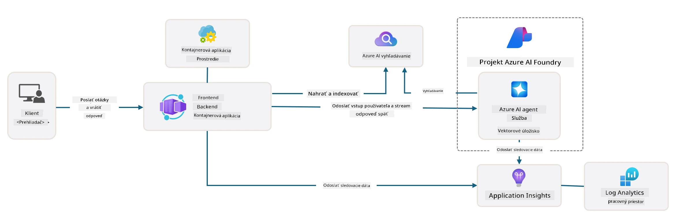

# 3. Rozobrať šablónu

!!! tip "NA KONCI TOHTO MODULU BUDETE SCHOPNÍ"

    - [ ] Aktivovať GitHub Copilot s MCP servermi pre pomoc v Azure
    - [ ] Pochopiť zloženie a komponenty adresára šablóny AZD
    - [ ] Preskúmať vzory organizácie infraštruktúry ako kódu (Bicep)
    - [ ] **Lab 3:** Použiť GitHub Copilot na preskúmanie a pochopenie architektúry repozitára 

---


S AZD šablónami a Azure Developer CLI (`azd`) môžeme rýchlo naštartovať našu AI vývojovú cestu so štandardizovanými repozitármi, ktoré poskytujú ukážkový kód, infraštruktúru a konfiguračné súbory - v podobe pripraveného na nasadenie _starter_ projektu.

**Teraz však potrebujeme pochopiť štruktúru projektu a kódovú základňu - a byť schopní upraviť AZD šablónu - bez predchádzajúcich skúseností alebo znalostí AZD!**

---

## 1. Aktivujte GitHub Copilot

### 1.1 Nainštalujte GitHub Copilot Chat

Je čas preskúmať [GitHub Copilot v režime agenta](https://code.visualstudio.com/docs/copilot/chat/chat-agent-mode). Teraz môžeme používať prirodzený jazyk na opis úlohy na vysokej úrovni a získať pomoc pri jej vykonaní. Pre tento lab použijeme [Copilot Free plan](https://github.com/github-copilot/signup), ktorý má mesačné obmedzenie pre dokončenia a chatovacie interakcie.

Rozšírenie je možné nainštalovať z marketplace, ale malo by byť už dostupné vo vašom Codespaces prostredí. _Kliknite na `Open Chat` v rozbaľovacom menu ikony Copilot - a napíšte prompt ako `What can you do?`_ - môže sa zobraziť výzva na prihlásenie. **GitHub Copilot Chat je pripravený**.

### 1.2. Inštalujte MCP servery

Aby bol režim agenta efektívny, potrebuje prístup k správnym nástrojom, ktoré mu pomôžu získať vedomosti alebo vykonať akcie. Tu môžu pomôcť MCP servery. Nakonfigurujeme nasledujúce servery:

1. [Azure MCP Server](../../../../../workshop/docs/instructions)
1. [Microsoft Docs MCP Server](../../../../../workshop/docs/instructions)

Na ich aktiváciu:

1. Vytvorte súbor s názvom `.vscode/mcp.json`, ak neexistuje
1. Skopírujte nasledujúce do tohto súboru - a spustite servery!
   ```json title=".vscode/mcp.json"
   {
      "servers": {
         "Azure MCP Server": {
            "command": "npx",
            "args": [
            "-y",
            "@azure/mcp@latest",
            "server",
            "start"
            ]
         },
         "microsoft.docs.mcp": {
            "type": "http",
            "url": "https://learn.microsoft.com/api/mcp"
         }
      }
   }
   ```

??? warning "Môžete dostať chybu, že `npx` nie je nainštalované (kliknite pre rozbalenie opravy)"

      Na opravu otvorte súbor `.devcontainer/devcontainer.json` a pridajte tento riadok do sekcie features. Potom znovu zostavte kontajner. Teraz by ste mali mať `npx` nainštalované.

      ```title="" linenums="0"
         "features": {
            "ghcr.io/devcontainers/features/node:1": {},
            ...
         },
      ```

---

### 1.3. Otestujte GitHub Copilot Chat

**Najprv použite `az login` na autentifikáciu v Azure z príkazového riadku VS Code.**

Teraz by ste mali byť schopní dotazovať sa na stav vášho Azure predplatného a pýtať sa otázky o nasadených zdrojoch alebo konfigurácii. Vyskúšajte tieto prompt-y:

1. `List my Azure resource groups`
1. `#foundry list my current deployments`

Môžete sa tiež pýtať na dokumentáciu Azure a získať odpovede zakorenené v Microsoft Docs MCP serveri. Vyskúšajte tieto prompt-y:

1. `#microsoft_docs_search What is Azure Developer CLI?`
1. `#microsoft_docs_search Show me a Python tutorial to chat with deployed model`

Alebo môžete požiadať o útržky kódu na dokončenie úlohy. Vyskúšajte tento prompt.

1. `Give me a Python code example that uses AAD for an interactive chat client`

V režime `Ask` to poskytne kód, ktorý môžete skopírovať a vyskúšať. V režime `Agent` to môže ísť o krok ďalej a vytvoriť príslušné zdroje pre vás - vrátane inštalačných skriptov a dokumentácie - aby vám pomohlo vykonať danú úlohu.

**Teraz ste vybavený na začatie preskúmania šablónového repozitára**

---

## 2. Rozobrať architektúru

??? prompt "POŽIADAVKA: Vysvetlite architektúru aplikácie v docs/images/architecture.png v 1 odstavci"

      Táto aplikácia je chatovacia aplikácia poháňaná umelou inteligenciou postavená na Azure, ktorá demonštruje modernú architektúru založenú na agentoch. Riešenie sa sústreďuje okolo Azure Container App, ktorá hosťuje hlavný aplikačný kód, ktorý spracováva vstup od používateľa a generuje inteligentné odpovede cez AI agenta. 
      
      Architektúra využíva Microsoft Foundry Project ako základ pre AI schopnosti, pripája sa k Azure AI Services, ktoré poskytujú základné jazykové modely (ako napr. gpt-4.1-mini) a funkcionalitu agentov. Interakcie používateľov prechádzajú cez frontend založený na Reacte do FastAPI backendu, ktorý komunikuje so službou AI agenta na generovanie kontextových odpovedí. 
      
      Systém obsahuje schopnosti vyhľadávania znalostí cez buď vyhľadávanie v súboroch alebo službu Azure AI Search, čo umožňuje agentovi pristupovať k nahratým dokumentom a citovať informácie. Pre prevádzkovú dokonalosť architektúra zahŕňa komplexné monitorovanie cez Application Insights a Log Analytics Workspace pre trasovanie, logovanie a optimalizáciu výkonu. 
      
      Azure Storage poskytuje blob úložisko pre aplikačné údaje a nahrávky súborov, zatiaľ čo Managed Identity zabezpečuje bezpečný prístup medzi Azure zdrojmi bez ukladania prihlasovacích údajov. Celé riešenie je navrhnuté pre škálovateľnosť a udržiavateľnosť, pričom kontajnerizovaná aplikácia sa automaticky škáluje podľa dopytu a poskytuje zabudované zabezpečenie, monitorovanie a CI/CD schopnosti cez spravované služby Azure.



---

## 3. Štruktúra repozitára

!!! prompt "POŽIADAVKA: Vysvetlite štruktúru priečinkov šablóny. Začnite vizuálnym hierarchickým diagramom."

??? info "ODPOVEĎ: Vizuálny hierarchický diagram"

      ```bash title="" 
      get-started-with-ai-agents/
      ├── 📋 Configuration & Setup
      │   ├── azure.yaml                    # Azure Developer CLI configuration
      │   ├── docker-compose.yaml           # Local development containers
      │   ├── pyproject.toml                # Python project configuration
      │   ├── requirements-dev.txt          # Development dependencies
      │   └── .devcontainer/                # VS Code dev container setup
      │
      ├── 🏗️ Infrastructure (infra/)
      │   ├── main.bicep                    # Main infrastructure template
      │   ├── api.bicep                     # API-specific resources
      │   ├── main.parameters.json          # Infrastructure parameters
      │   └── core/                         # Modular infrastructure components
      │       ├── ai/                       # AI service configurations
      │       ├── host/                     # Hosting infrastructure
      │       ├── monitor/                  # Monitoring and logging
      │       ├── search/                   # Azure AI Search setup
      │       ├── security/                 # Security and identity
      │       └── storage/                  # Storage account configs
      │
      ├── 💻 Application Source (src/)
      │   ├── api/                          # Backend API
      │   │   ├── main.py                   # FastAPI application entry
      │   │   ├── routes.py                 # API route definitions
      │   │   ├── search_index_manager.py   # Search functionality
      │   │   ├── data/                     # API data handling
      │   │   ├── static/                   # Static web assets
      │   │   └── templates/                # HTML templates
      │   ├── frontend/                     # React/TypeScript frontend
      │   │   ├── package.json              # Node.js dependencies
      │   │   ├── vite.config.ts            # Vite build configuration
      │   │   └── src/                      # Frontend source code
      │   ├── data/                         # Sample data files
      │   │   └── embeddings.csv            # Pre-computed embeddings
      │   ├── files/                        # Knowledge base files
      │   │   ├── customer_info_*.json      # Customer data samples
      │   │   └── product_info_*.md         # Product documentation
      │   ├── Dockerfile                    # Container configuration
      │   └── requirements.txt              # Python dependencies
      │
      ├── 🔧 Automation & Scripts (scripts/)
      │   ├── postdeploy.sh/.ps1           # Post-deployment setup
      │   ├── setup_credential.sh/.ps1     # Credential configuration
      │   ├── validate_env_vars.sh/.ps1    # Environment validation
      │   └── resolve_model_quota.sh/.ps1  # Model quota management
      │
      ├── 🧪 Testing & Evaluation
      │   ├── tests/                        # Unit and integration tests
      │   │   └── test_search_index_manager.py
      │   ├── evals/                        # Agent evaluation framework
      │   │   ├── evaluate.py               # Evaluation runner
      │   │   ├── eval-queries.json         # Test queries
      │   │   └── eval-action-data-path.json
      │   ├── sandbox/                      # Development playground
      │   │   ├── 1-quickstart.py           # Getting started examples
      │   │   └── aad-interactive-chat.py   # Authentication examples
      │   └── airedteaming/                 # AI safety evaluation
      │       └── ai_redteaming.py          # Red team testing
      │
      ├── 📚 Documentation (docs/)
      │   ├── deployment.md                 # Deployment guide
      │   ├── local_development.md          # Local setup instructions
      │   ├── troubleshooting.md            # Common issues & fixes
      │   ├── azure_account_setup.md        # Azure prerequisites
      │   └── images/                       # Documentation assets
      │
      └── 📄 Project Metadata
         ├── README.md                     # Project overview
         ├── CODE_OF_CONDUCT.md           # Community guidelines
         ├── CONTRIBUTING.md              # Contribution guide
         ├── LICENSE                      # License terms
         └── next-steps.md                # Post-deployment guidance
      ```

### 3.1. Hlavná architektúra aplikácie

Táto šablóna nasleduje vzor **full-stack webovej aplikácie** s:

- **Backend**: Python FastAPI s integráciou Azure AI
- **Frontend**: TypeScript/React s Vite build systémom
- **Infraštruktúra**: Azure Bicep šablóny pre cloudové zdroje
- **Kontajnerizácia**: Docker pre konzistentné nasadenie

### 3.2 Infra ako kód (bicep)

Vrstva infraštruktúry používa **Azure Bicep** šablóny organizované modulárne:

   - **`main.bicep`**: Orchestrace všetkých Azure zdrojov
   - **`core/` moduly**: Znovupoužiteľné komponenty pre rôzne služby
      - AI služby (Microsoft Foundry Models, AI Search)
      - Hostovanie kontajnerov (Azure Container Apps)
      - Monitorovanie (Application Insights, Log Analytics)
      - Bezpečnosť (Key Vault, Managed Identity)

### 3.3 Zdroj aplikácie (`src/`)

**Backend API (`src/api/`)**:

- REST API založené na FastAPI
- Integrácia s Foundry Agents
- Správa vyhľadávacieho indexu pre získavanie znalostí
- Nahrávanie a spracovanie súborov

**Frontend (`src/frontend/`)**:

- Moderné React/TypeScript SPA
- Vite pre rýchly vývoj a optimalizované buildy
- Chat rozhranie pre interakcie s agentom

**Znalostná báza (`src/files/`)**:

- Ukážkové údaje o zákazníkoch a produktoch
- Demonštruje získavanie znalostí zo súborov
- Príklady v JSON a Markdown formáte


### 3.4 DevOps & Automatizácia

**Skripty (`scripts/`)**:

- Naprieč platformové PowerShell a Bash skripty
- Overenie a nastavenie prostredia
- Konfigurácia po nasadení
- Správa kvót modelov

**Integrácia Azure Developer CLI**:

- Konfigurácia `azure.yaml` pre `azd` workflowy
- Automatizované provisionovanie a nasadenie
- Správa environmentálnych premenných

### 3.5 Testovanie & Kontrola kvality

**Evaluačný rámec (`evals/`)**:

- Hodnotenie výkonu agentov
- Testovanie kvality odpovedí na dotazy
- Automatizovaný hodnotiaci pipeline

**AI bezpečnosť (`airedteaming/`)**:

- Red team testovanie pre AI bezpečnosť
- Skanovanie zraniteľností zabezpečenia
- Praktiky zodpovedného AI

---

## 4. Gratulujeme 🏆

Úspešne ste použili GitHub Copilot Chat s MCP servermi na preskúmanie repozitára.

- [X] Aktivovaný GitHub Copilot pre Azure
- [X] Pochopená architektúra aplikácie
- [X] Preskúmaná štruktúra AZD šablóny

Toto vám dáva predstavu o aktívach _infrastructure as code_ tejto šablóny. Ďalej sa pozrieme na konfiguračný súbor pre AZD.

---

<!-- CO-OP TRANSLATOR DISCLAIMER START -->
**Vyhlásenie o vylúčení zodpovednosti**:
Tento dokument bol preložený pomocou AI prekladateľskej služby [Co-op Translator](https://github.com/Azure/co-op-translator). Hoci sa snažíme o presnosť, vezmite, prosím, na vedomie, že automatické preklady môžu obsahovať chyby alebo nepresnosti. Pôvodný dokument v jeho pôvodnom jazyku by sa mal považovať za autoritatívny zdroj. Pri kritických informáciách sa odporúča profesionálny ľudský preklad. Nie sme zodpovední za žiadne nedorozumenia alebo nesprávne interpretácie vyplývajúce z použitia tohto prekladu.
<!-- CO-OP TRANSLATOR DISCLAIMER END -->