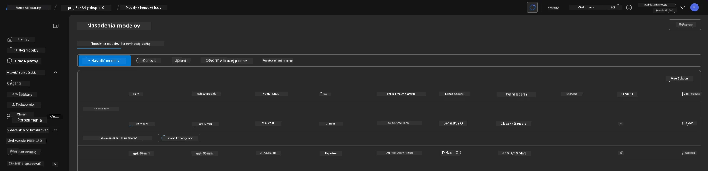
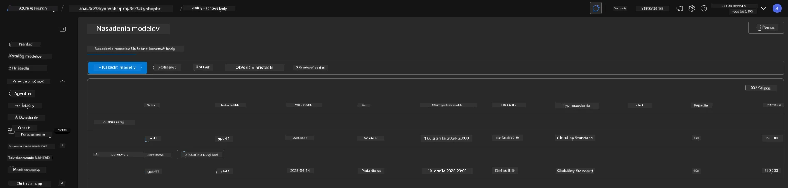

# 6. Ukončenie infraštruktúry

!!! tip "PO DOKONČENÍ TOHTO MODULU BUDETE SCHOPNÍ"

    - [ ] Pochopiť dôležitosť vyčistenia zdrojov a riadenia nákladov
    - [ ] Použiť `azd down` na bezpečné zrušenie infraštruktúry
    - [ ] Obnoviť dočasne zmazané kognitívne služby, ak je to potrebné
    - [ ] **Lab 6:** Vyčistiť Azure zdroje a overiť ich odstránenie

---

## Bonusové cvičenia

Predtým, než ukončíme projekt, venujte pár minút otvorenému prieskumu.

!!! info "Vyskúšajte tieto prieskumné podnety"

    **Experimentujte s GitHub Copilotom:**
    
    1. Ask: `Aké ďalšie AZD šablóny by som mohol vyskúšať pre scenáre s viacerými agentmi?`
    2. Ask: `Ako môžem prispôsobiť inštrukcie agenta pre použitie v zdravotnej starostlivosti?`
    3. Ask: `Ktoré premenné prostredia riadia optimalizáciu nákladov?`
    
    **Preskúmajte Azure portál:**
    
    1. Skontrolujte metriky Application Insights pre vaše nasadenie
    2. Skontrolujte analýzu nákladov na nasadené zdroje
    3. Preskúmajte portál Microsoft Foundry (agent playground) ešte raz

---

## Zrušenie infraštruktúry

1. Zrušenie infraštruktúry je také jednoduché ako:
      
      ```bash title="" linenums="0"
      azd down --purge
      ```
1. The `--purge` flag ensures that it also purges soft-deleted Cognitive Service resources, thereby releasing quota held by these resources. Once complete you will see something like this:
      
      ```bash title="" linenums="0"
      ? Total resources to delete: 11, are you sure you want to continue? Yes
      Deleting your resources can take some time.
      (✓) Done: Deleted resource group rg-nitya-mshack-azd
      (✓) Done: Purging Cognitive Account: aoai-3cz3zkynhvpbc

      SUCCESS: Your application was removed from Azure in 11 minutes 4 seconds.
      ```

1. (Voliteľné) Ak teraz znovu spustíte `azd up`, všimnete si, že model gpt-4.1 bude nasadený, pretože bola zmenená (a uložená) premenná prostredia v lokálnom priečinku `.azure`. 

      Tu sú nasadenia modelov **pred**:

      

      A tu sú **po**:
      

---

<!-- CO-OP TRANSLATOR DISCLAIMER START -->
Zrieknutie sa zodpovednosti:
Tento dokument bol preložený pomocou AI prekladateľskej služby [Co‑op Translator](https://github.com/Azure/co-op-translator). Hoci sa usilujeme o presnosť, berte prosím na vedomie, že automatické preklady môžu obsahovať chyby alebo nepresnosti. Pôvodný dokument v jeho pôvodnom jazyku by sa mal považovať za autoritatívny zdroj. Pre kritické informácie sa odporúča profesionálny ľudský preklad. Nie sme zodpovední za žiadne nedorozumenia alebo nesprávne výklady vzniknuté použitím tohto prekladu.
<!-- CO-OP TRANSLATOR DISCLAIMER END -->