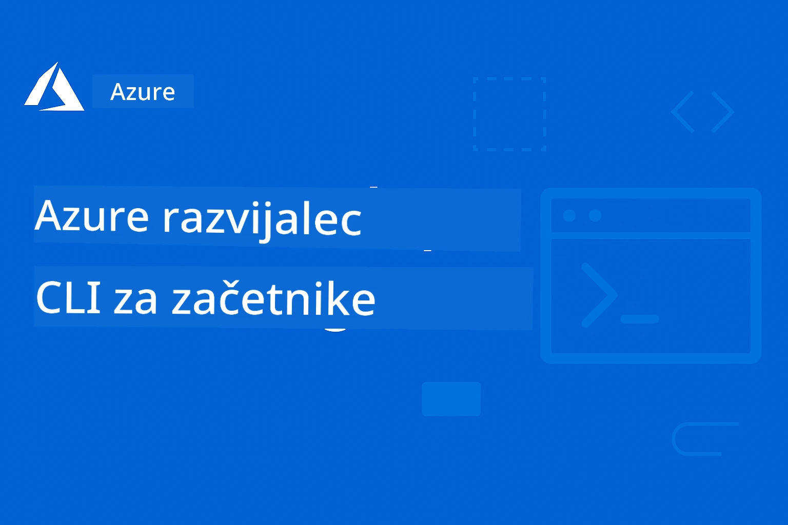

# AZD za začetnike: Strukturirana učna pot



[](https://GitHub.com/microsoft/azd-for-beginners/watchers/)
[](https://GitHub.com/microsoft/azd-for-beginners/network/)
[](https://GitHub.com/microsoft/azd-for-beginners/stargazers/)

[](https://discord.gg/microsoft-azure)
[](https://discord.gg/nTYy5BXMWG)

## Začetek s tem tečajem

Sledite tem korakom, da začnete svojo AZD učno pot:

1. **Razvodi repozitorij**: Kliknite [](https://GitHub.com/microsoft/azd-for-beginners/fork)
2. **Klonirajte repozitorij**: `git clone https://github.com/microsoft/azd-for-beginners.git`
3. **Pridružite se skupnosti**: [Azure Discord skupnosti](https://discord.com/invite/ByRwuEEgH4) za strokovno podporo
4. **Izberite svojo učno pot**: Izberite poglavje spodaj, ki ustreza vaši ravni izkušenj

### Podpora za več jezikov

#### Avtomatski prevodi (vedno posodobljeni)

<!-- CO-OP TRANSLATOR LANGUAGES TABLE START -->
[Arabski](../ar/README.md) | [Bengalski](../bn/README.md) | [Bolgarščina](../bg/README.md) | [Burmanski (Mjanmar)](../my/README.md) | [Kitajščina (poenostavljena)](../zh-CN/README.md) | [Kitajščina (tradicionalna, Hong Kong)](../zh-HK/README.md) | [Kitajščina (tradicionalna, Macao)](../zh-MO/README.md) | [Kitajščina (tradicionalna, Taiwan)](../zh-TW/README.md) | [Hrvaščina](../hr/README.md) | [Češčina](../cs/README.md) | [Danščina](../da/README.md) | [Nizozemščina](../nl/README.md) | [Estonščina](../et/README.md) | [Finščina](../fi/README.md) | [Francoščina](../fr/README.md) | [Nemščina](../de/README.md) | [Grščina](../el/README.md) | [Hebrejščina](../he/README.md) | [Hindi](../hi/README.md) | [Madžarščina](../hu/README.md) | [Indonezijščina](../id/README.md) | [Italijanščina](../it/README.md) | [Japonščina](../ja/README.md) | [Kannada](../kn/README.md) | [Korejščina](../ko/README.md) | [Litovščina](../lt/README.md) | [Malajščina](../ms/README.md) | [Malajalščina](../ml/README.md) | [Maratščina](../mr/README.md) | [Nepalščina](../ne/README.md) | [Nigerijski pidžin](../pcm/README.md) | [Norveščina](../no/README.md) | [Perzijska (Farsi)](../fa/README.md) | [Poljščina](../pl/README.md) | [Portugalščina (Brazilija)](../pt-BR/README.md) | [Portugalščina (Portugalska)](../pt-PT/README.md) | [Pandžabščina (Gurmukhi)](../pa/README.md) | [Romunščina](../ro/README.md) | [Ruščina](../ru/README.md) | [Srbski (cirilica)](../sr/README.md) | [Slovaščina](../sk/README.md) | [Slovenščina](./README.md) | [Španščina](../es/README.md) | [Svahili](../sw/README.md) | [Švedščina](../sv/README.md) | [Tagalog (Filipino)](../tl/README.md) | [Tamilščina](../ta/README.md) | [Telugu](../te/README.md) | [Tajščina](../th/README.md) | [Turščina](../tr/README.md) | [Ukrajinski](../uk/README.md) | [Urdu](../ur/README.md) | [Vietnamski](../vi/README.md)

> **Raje klonirate lokalno?**

> Ta repozitorij vključuje več kot 50 jezikovnih prevodov, kar znatno povečuje velikost prenosa. Če želite klonirati brez prevodov, uporabite sparse checkout:
> ```bash
> git clone --filter=blob:none --sparse https://github.com/microsoft/AZD-for-beginners.git
> cd AZD-for-beginners
> git sparse-checkout set --no-cone '/*' '!translations' '!translated_images'
> ```
> Tako dobite vse potrebno za dokončanje tečaja z veliko hitrejšim prenosom.
<!-- CO-OP TRANSLATOR LANGUAGES TABLE END -->

## Pregled tečaja

Obvladujte Azure Developer CLI (azd) skozi strukturirana poglavja, zasnovana za postopno učenje. **Poseben poudarek na uvajanju AI aplikacij z integracijo Microsoft Foundry.**

### Zakaj je ta tečaj bistven za sodobne razvijalce

Na podlagi vpogledov skupnosti Microsoft Foundry Discord, **45 % razvijalcev želi uporabljati AZD za AI delovne obremenitve**, vendar se soočajo z izzivi:
- Zapletene večstorivne AI arhitekture
- Najboljše prakse za uvajanje AI v produkcijo
- Integracija in konfiguracija Azure AI storitev
- Optimizacija stroškov za AI delovne obremenitve
- Odpravljanje težav, specifičnih za AI uvajanja

### Cilji učenja

Z dokončanjem tega strukturiranega tečaja boste:
- **Obvladali osnove AZD**: Osnovni koncepti, namestitev in konfiguracija
- **Uvajali AI aplikacije**: Uporaba AZD s storitvami Microsoft Foundry
- **Implementirali infrastrukturno kodo**: Upravljanje z viri Azure z Bicep predlogami
- **Odpravljali težave pri uvajanju**: Reševanje pogostih težav in odpravljanje napak
- **Optimizirali za produkcijo**: Varnost, skaliranje, nadzor in upravljanje stroškov
- **Gradili večagentne rešitve**: Uvajanje zapletenih AI arhitektur

## 📚 Učna poglavja

*Izberite svojo učno pot glede na raven izkušenj in cilje*

### 🚀 Poglavje 1: Osnove in hiter začetek
**Pogoj za vključitev**: naročnina na Azure, osnovno znanje ukazne vrstice  
**Trajanje**: 30-45 minut  
**Zapletenost**: ⭐

#### Kaj boste osvojili
- Razumevanje osnov Azure Developer CLI
- Namestitev AZD na vaši platformi
- Vaša prva uspešna namestitev

#### Učni viri
- **🎯 Začni tukaj**: [Kaj je Azure Developer CLI?](../..)
- **📖 Teorija**: [AZD osnove](docs/getting-started/azd-basics.md) - osnovni koncepti in terminologija
- **⚙️ Nastavitev**: [Namestitev in nastavitev](docs/getting-started/installation.md) - vodiči za posamezne platforme
- **🛠️ Praktično**: [Vaš prvi projekt](docs/getting-started/first-project.md) - navodila po korakih
- **📋 Hiter pripomoček**: [Ukazni priročnik](resources/cheat-sheet.md)

#### Praktične vaje
```bash
# Hiter pregled namestitve
azd version

# Namestite svojo prvo aplikacijo
azd init --template todo-nodejs-mongo
azd up
```

**💡 Rezultat poglavja**: Uspešno uvajanje preproste spletne aplikacije v Azure z uporabo AZD

**✅ Preverjanje uspeha:**
```bash
# Po zaključku poglavja 1 bi morali biti sposobni:
azd version              # Prikaže nameščeno različico
azd init --template todo-nodejs-mongo  # Inicializira projekt
azd up                  # Izvaja namestitev v Azure
azd show                # Prikaže URL delujoče aplikacije
# Aplikacija se odpre v brskalniku in deluje
azd down --force --purge  # Počisti vire
```

**📊 Časovni vložek:** 30-45 minut  
**📈 Raven spretnosti po:** Sposobnost samostojnega uvajanja osnovnih aplikacij

**✅ Preverjanje uspeha:**
```bash
# Po zaključku prvega poglavja bi morali biti sposobni:
azd version              # Prikazuje nameščeno različico
azd init --template todo-nodejs-mongo  # Inicializira projekt
azd up                  # Namesti na Azure
azd show                # Prikazuje URL delujoče aplikacije
# Aplikacija se odpre v brskalniku in deluje
azd down --force --purge  # Počisti vire
```

**📊 Časovni vložek:** 30-45 minut  
**📈 Raven spretnosti po:** Sposobnost samostojnega uvajanja osnovnih aplikacij

---

### 🤖 Poglavje 2: AI-prvi razvoj (priporočeno za AI razvijalce)
**Pogoj za vključitev**: dokončano poglavje 1  
**Trajanje**: 1-2 uri  
**Zapletenost**: ⭐⭐

#### Kaj boste osvojili
- Integracija Microsoft Foundry z AZD
- Uvajanje AI-podprtih aplikacij
- Razumevanje konfiguracij AI storitev

#### Učni viri
- **🎯 Začni tukaj**: [Integracija Microsoft Foundry](docs/microsoft-foundry/microsoft-foundry-integration.md)
- **📖 Vzorci**: [Uvajanje AI modelov](docs/microsoft-foundry/ai-model-deployment.md) - uvajanje in upravljanje AI modelov
- **🛠️ Delavnica**: [AI delavnica](docs/microsoft-foundry/ai-workshop-lab.md) - pripravite svoje AI rešitve za AZD
- **🎥 Interaktivni vodič**: [Materiali delavnice](workshop/README.md) - učenje prek brskalnika z MkDocs * DevContainer okolje
- **📋 Predloge**: [Predloge Microsoft Foundry](../..)
- **📝 Primeri**: [Primeri uvajanj AZD](examples/README.md)

#### Praktične vaje
```bash
# Namestite svojo prvo AI aplikacijo
azd init --template azure-search-openai-demo
azd up

# Preizkusite dodatne AI predloge
azd init --template openai-chat-app-quickstart
azd init --template agent-openai-python-prompty
```

**💡 Rezultat poglavja**: Uvajanje in konfiguracija AI-podprte klepetalne aplikacije z RAG zmogljivostmi

**✅ Preverjanje uspeha:**
```bash
# Po drugem poglavju bi morali biti sposobni:
azd init --template azure-search-openai-demo
azd up
# Preizkusiti vmesnik za klepet z AI
# Postavljati vprašanja in dobiti odgovore, ki jih poganja AI, z viri
# Preveriti, ali integracija iskanja deluje
azd monitor  # Preveriti, ali Application Insights prikazuje telemetrijo
azd down --force --purge
```

**📊 Časovni vložek:** 1-2 uri  
**📈 Raven spretnosti po:** Sposobnost uvajanja in konfiguracije AI aplikacij pripravljenih za produkcijo  
**💰 Zavedanje stroškov:** Razumevanje približnih stroškov razvoja 80–150 $/mesec, stroškov produkcije 300–3500 $/mesec

#### 💰 Stroški za AI uvajanja

**Razvojno okolje (ocenjeno 80–150 $/mesec):**
- Azure OpenAI (plačilo po porabi): 0–50 $/mesec (na podlagi uporabe tokenov)
- AI Search (osnovni nivo): 75 $/mesec
- Container Apps (poraba): 0–20 $/mesec
- Shramba (standardna): 1–5 $/mesec

**Produkcijsko okolje (ocenjeno 300–3.500+ $/mesec):**
- Azure OpenAI (PTU za konsistentno zmogljivost): 3.000+ $/mesec ALI plačilo po porabi z visoko rabo
- AI Search (standardni nivo): 250 $/mesec
- Container Apps (najem): 50–100 $/mesec
- Application Insights: 5–50 $/mesec
- Shramba (premium): 10–50 $/mesec

**💡 Nasveti za optimizacijo stroškov:**
- Uporabite **brezplačni nivo** Azure OpenAI za učenje (vključeno 50.000 tokenov na mesec)
- Začasno odstranite vire z `azd down`, ko ne razvijate aktivno
- Začnite s porabo glede na uporabo, PTU nadgradite le za produkcijo
- Za oceno stroškov pred uvajanjem uporabite `azd provision --preview`
- Omogočite samodejno skaliranje: plačajte le za dejansko uporabo

**Nadzor stroškov:**
```bash
# Preveri ocenjene mesečne stroške
azd provision --preview

# Spremljaj dejanske stroške v Azure portalu
az consumption budget list --resource-group <your-rg>
```

---

### ⚙️ Poglavje 3: Konfiguracija in overjanje
**Pogoj za vključitev**: dokončano poglavje 1  
**Trajanje**: 45-60 minut  
**Zapletenost**: ⭐⭐

#### Kaj boste osvojili
- Konfiguracija in upravljanje okolij
- Best practice overjanja in varnosti
- Imenovanje in organizacija virov

#### Učni viri
- **📖 Konfiguracija**: [Vodnik za konfiguracijo](docs/getting-started/configuration.md) - nastavitev okolja
- **🔐 Varnost**: [Vzorce overjanja in upravljane identitete](docs/getting-started/authsecurity.md)
- **📝 Primeri**: [Primer aplikacije z bazo podatkov](examples/database-app/README.md) - primeri AZD za bazo podatkov

#### Praktične vaje
- Konfiguracija več okolij (razvojno, testno, produkcijsko)
- Nastavitev overjanja z upravljano identiteto
- Implementacija konfiguracij, specifičnih za okolje

**💡 Rezultat poglavja**: Upravljanje z več okolji z ustreznim overjanjem in varnostjo

---

### 🏗️ Poglavje 4: Infrastruktura kot koda in uvajanje
**Pogoj za vključitev**: dokončana poglavja 1-3  
**Trajanje**: 1-1,5 ure  
**Zapletenost**: ⭐⭐⭐

#### Kaj boste osvojili
- Napredni vzorci uvajanja
- Infrastruktura kot koda z Bicep
- Strategije za zagotavljanje virov

#### Učni viri
- **📖 Uvajanje**: [Vodnik za uvajanje](docs/deployment/deployment-guide.md) - celotni poteki dela
- **🏗️ Zagotavljanje**: [Zagotavljanje virov](docs/deployment/provisioning.md) - upravljanje Azure virov
- **📝 Primeri**: [Primer Container App](../../examples/container-app) - uvajanja v kontejnerjih

#### Praktične vaje
- Ustvarite lastne Bicep predloge
- Uvajanje večstoritevnih aplikacij
- Implementacija strategije modro-zelene uvedbe

**💡 Rezultat poglavja**: Uvajanje zapletenih večstoritevnih aplikacij z uporabo lastnih infrastrukturnih predlog

---

### 🎯 Poglavje 5: Večagentne AI rešitve (napredno)
**Pogoj za vključitev**: dokončana poglavja 1-2  
**Trajanje**: 2-3 ure  
**Zapletenost**: ⭐⭐⭐⭐
#### Kaj se boste naučili
- Vzorce večagentne arhitekture
- Orkestracija in koordinacija agentov
- Razvoj proizvodno pripravljenih AI rešitev

#### Učni viri
- **🤖 Izpostavljen projekt**: [Retail Multi-Agent Solution](examples/retail-scenario.md) - Celovita implementacija
- **🛠️ ARM predloge**: [ARM Template Package](../../examples/retail-multiagent-arm-template) - Namestitev z enim klikom
- **📖 Arhitektura**: [Vzorce koordinacije več agentov](/docs/pre-deployment/coordination-patterns.md) - Vzorci

#### Praktične vaje
```bash
# Namestite popolno maloprodajno rešitev z več agenti
cd examples/retail-multiagent-arm-template
./deploy.sh

# Raziščite nastavitve agentov
az deployment group show --resource-group <rg-name> --name <deployment-name>
```

**💡 Cilj poglavja**: Namestiti in upravljati večagentno AI rešitev, pripravljeno za produkcijo, z agenti za stranke in zalogo

---

### 🔍 Poglavje 6: Preverjanje in načrtovanje pred namestitvijo
**Predpogoji**: Poglavje 4 opravljeno  
**Trajanje**: 1 ura  
**Zahtevnost**: ⭐⭐

#### Kaj se boste naučili
- Načrtovanje zmogljivosti in preverjanje virov
- Strategije izbire SKU
- Predhodni pregledi in avtomatizacija

#### Učni viri
- **📊 Načrtovanje**: [Načrtovanje zmogljivosti](docs/pre-deployment/capacity-planning.md) - Preverjanje virov
- **💰 Izbira**: [Izbira SKU](docs/pre-deployment/sku-selection.md) - Stroškovno učinkovite izbire
- **✅ Preverjanje**: [Predhodni pregledi](docs/pre-deployment/preflight-checks.md) - Avtomatizirani skripti

#### Praktične vaje
- Zaženite skripte za preverjanje zmogljivosti
- Optimizirajte izbiro SKU za stroške
- Uvedite avtomatizirane prednamestitvene preglede

**💡 Cilj poglavja**: Preveriti in optimizirati namestitve pred izvedbo

---

### 🚨 Poglavje 7: Odpravljanje težav in razhroščevanje
**Predpogoji**: Katero koli poglavje o namestitvi opravljeno  
**Trajanje**: 1–1,5 ure  
**Zahtevnost**: ⭐⭐

#### Kaj se boste naučili
- Sistematični pristopi k razhroščevanju
- Pogoste težave in rešitve
- Odpravljanje težav specifično za AI

#### Učni viri
- **🔧 Pogoste težave**: [Pogoste težave](docs/troubleshooting/common-issues.md) - Pogosta vprašanja in rešitve
- **🕵️ Razhroščevanje**: [Vodnik za razhroščevanje](docs/troubleshooting/debugging.md) - Strategije korak za korakom
- **🤖 AI težave**: [Odpravljanje težav za AI](docs/troubleshooting/ai-troubleshooting.md) - Težave pri AI storitvah

#### Praktične vaje
- Diagnosticirajte napake pri namestitvi
- Odpravite težave z avtentikacijo
- Razhroščujte povezljivost do AI storitev

**💡 Cilj poglavja**: Neodvisno diagnosticirati in odpraviti pogoste napake pri namestitvi

---

### 🏢 Poglavje 8: Produktivni in poslovni vzorci
**Predpogoji**: Poglavja 1–4 opravljena  
**Trajanje**: 2–3 ure  
**Zahtevnost**: ⭐⭐⭐⭐

#### Kaj se boste naučili
- Strategije za produkcijsko uvajanje
- Poslovni varnostni vzorci
- Nadzor in optimizacija stroškov

#### Učni viri
- **🏭 Produkcija**: [Najboljše prakse za AI produkcijo](docs/microsoft-foundry/production-ai-practices.md) - Poslovni vzorci
- **📝 Primeri**: [Primer mikroservisov](../../examples/microservices) - Kompleksne arhitekture
- **📊 Nadzor**: [Integracija Application Insights](docs/pre-deployment/application-insights.md) - Nadzor

#### Praktične vaje
- Uvedite poslovne varnostne vzorce
- Nastavite celovito spremljanje
- Uvedite v produkcijo z ustreznim upravljanjem

**💡 Cilj poglavja**: Uvesti aplikacije, pripravljen na produkcijo za podjetja, z vsemi funkcionalnostmi

---

## 🎓 Pregled delavnice: Praktična učna izkušnja

> **⚠️ STATUS DELAVNICE: Aktivni razvoj**  
> Gradivo delavnice se trenutno razvija in dopolnjuje. Glavni moduli so funkcionalni, nekateri napredni deli še niso dokončani. Aktivno delamo na dokončanju vsebine. [Spremljajte napredek →](workshop/README.md)

### Interaktivno gradivo delavnice
**Celovito praktično učenje z orodji v brskalniku in vodenimi vajami**

Naše gradivo za delavnico nudi strukturirano, interaktivno učno izkušnjo, ki dopolnjuje zgoraj predstavljeni kurikulum po poglavjih. Delavnica je namenjena tako samostojnemu učenju kot vodstvu inštruktorja.

#### 🛠️ Značilnosti delavnice
- **Vmesnik v brskalniku**: Popolna delavnica na MkDocs z iskanjem, kopiranjem in temami
- **Integracija GitHub Codespaces**: Namestitev razvojnega okolja z enim klikom
- **Strukturirana učna pot**: 7 korakov vodenih vaj (skupno 3,5 ure)
- **Odkritje → Namestitev → Prilagoditev**: Postopna metodologija
- **Interaktivno razvojno okolje DevContainer**: Vnaprej konfigurirana orodja in odvisnosti

#### 📚 Struktura delavnice
Delavnica sledi metodologiji **Odkritje → Namestitev → Prilagoditev**:

1. **Faza odkritja** (45 min)
   - Raziskovanje Microsoft Foundry predlog in storitev
   - Razumevanje vzorcev večagentne arhitekture
   - Pregled zahtev in predpogojev za namestitev

2. **Faza namestitve** (2 uri)
   - Praktična namestitev AI aplikacij z AZD
   - Konfiguracija Azure AI storitev in končnih točk
   - Uvedba varnostnih vzorcev in avtentikacije

3. **Faza prilagoditve** (45 min)
   - Prilagoditev aplikacij za specifične primere uporabe
   - Optimizacija za produkcijsko uvajanje
   - Uvedba nadzora in upravljanja stroškov

#### 🚀 Začetek z delavnico
```bash
# Možnost 1: GitHub Codespaces (Priporočeno)
# Kliknite "Code" → "Create codespace on main" v repozitoriju

# Možnost 2: Lokalni razvoj
git clone https://github.com/microsoft/azd-for-beginners.git
cd azd-for-beginners/workshop
# Sledite navodilom za namestitev v workshop/README.md
```

#### 🎯 Učni cilji delavnice
Z dokončanjem delavnice bodo udeleženci:
- **Uvedli produkcijske AI aplikacije**: Uporaba AZD z Microsoft Foundry storitvami
- **Obvladali večagentne arhitekture**: Uvedba koordiniranih AI agentov
- **Uvedli najboljše varnostne prakse**: Konfiguracija avtentikacije in nadzora dostopa
- **Optimizirali za skaliranje**: Načrtovanje stroškovno učinkovitih in učinkovitih namestitev
- **Odpravljali težave pri namensitvah**: Samostojno reševanje pogostih problemov

#### 📖 Viri delavnice
- **🎥 Interaktivni vodnik**: [Gradivo delavnice](workshop/README.md) - Učno okolje v brskalniku
- **📋 Navodila korak za korakom**: [Vodene vaje](../../workshop/docs/instructions) - Podrobni postopki
- **🛠️ AI delavnica Lab**: [AI Workshop Lab](docs/microsoft-foundry/ai-workshop-lab.md) - AI osredotočene vaje
- **💡 Hitri začetek**: [Vodnik za nastavitev delavnice](workshop/README.md#quick-start) - Konfiguracija okolja

**Kot nalašč za**: Korporativno usposabljanje, univerzitetne tečaje, samostojno učenje in bootcampe za razvijalce.

---

## 📖 Kaj je Azure Developer CLI?

Azure Developer CLI (azd) je ukazna vrstica, osredotočena na razvijalce, ki pospešuje proces gradnje in uvajanja aplikacij v Azure. Nudi:

- **Uvajanje na podlagi predlog** - Uporaba predhodno pripravljenih predlog za pogoste aplikacijske vzorce
- **Infrastruktura kot koda** - Upravljanje Azure virov z Bicep ali Terraformom  
- **Integrirane delovne tokove** - Gladko zagotavljanje, uvajanje in nadzor aplikacij
- **Prijazno za razvijalce** - Optimizirano za produktivnost in izkušnjo razvijalcev

### **AZD + Microsoft Foundry: Popolno za AI uvajanja**

**Zakaj AZD za AI rešitve?** AZD rešuje glavne izzive, s katerimi se soočajo AI razvijalci:

- **Predloge pripravljene na AI** - Vnaprej konfigurirane predloge za Azure OpenAI, kognitivne storitve in ML delovne obremenitve
- **Varnostno varna AI uvajanja** - Vgrajeni varnostni vzorci za AI storitve, API ključe in končne točke modelov  
- **Produkcijski AI vzorci** - Najboljše prakse za skalabilne in stroškovno učinkovite AI uvajanja
- **Celoviti AI delovni tokovi** - Od razvoja modelov do produkcijskega uvajanja z ustreznim nadzorom
- **Optimizacija stroškov** - Pametna razporeditev virov in strategije skaliranja za AI delovne obremenitve
- **Integracija z Microsoft Foundry** - Gladka povezava s katalogom modelov in končnimi točkami Microsoft Foundry

---

## 🎯 Predloge in knjižnica primerov

### Izpostavljeno: Microsoft Foundry predloge
**Začnite tukaj, če uvajate AI aplikacije!**

> **Opomba:** Te predloge prikazujejo različne AI vzorce. Nekatere so zunanje Azure vzorci, druge lokalne implementacije.

| Predloga | Poglavje | Zahtevnost | Storitve | Tip |
|----------|----------|-------------|----------|-----|
| [**Začetek s AI klepetom**](https://github.com/Azure-Samples/get-started-with-ai-chat) | Poglavje 2 | ⭐⭐ | AzureOpenAI + Azure AI Model Inference API + Azure AI Search + Azure Container Apps + Application Insights | Zunanja |
| [**Začetek z AI agenti**](https://github.com/Azure-Samples/get-started-with-ai-agents) | Poglavje 2 | ⭐⭐ | Azure AI Agent Service + AzureOpenAI + Azure AI Search + Azure Container Apps + Application Insights| Zunanja |
| [**Azure Search + OpenAI Demo**](https://github.com/Azure-Samples/azure-search-openai-demo) | Poglavje 2 | ⭐⭐ | AzureOpenAI + Azure AI Search + App Service + Storage | Zunanja |
| [**Hitri začetek OpenAI klepetne aplikacije**](https://github.com/Azure-Samples/openai-chat-app-quickstart) | Poglavje 2 | ⭐ | AzureOpenAI + Container Apps + Application Insights | Zunanja |
| [**Agent OpenAI Python Prompty**](https://github.com/Azure-Samples/agent-openai-python-prompty) | Poglavje 5 | ⭐⭐⭐ | AzureOpenAI + Azure Functions + Prompty | Zunanja |
| [**Contoso Chat RAG**](https://github.com/Azure-Samples/contoso-chat) | Poglavje 8 | ⭐⭐⭐⭐ | AzureOpenAI + AI Search + Cosmos DB + Container Apps | Zunanja |
| [**Retail Multi-Agent Solution**](examples/retail-scenario.md) | Poglavje 5 | ⭐⭐⭐⭐ | AzureOpenAI + AI Search + Storage + Container Apps + Cosmos DB | **Lokalna** |

### Izpostavljeno: Celotni učni scenariji
**Produkcijsko pripravljene predloge aplikacij, povezane z učnimi poglavji**

| Predloga | Učno poglavje | Zahtevnost | Glavna vsebina |
|----------|----------------|------------|----------------|
| [**openai-chat-app-quickstart**](https://github.com/Azure-Samples/openai-chat-app-quickstart) | Poglavje 2 | ⭐ | Osnovni AI vzorci uvajanja |
| [**azure-search-openai-demo**](https://github.com/Azure-Samples/azure-search-openai-demo) | Poglavje 2 | ⭐⭐ | RAG implementacija z Azure AI Search |
| [**ai-document-processing**](https://github.com/Azure-Samples/ai-document-processing) | Poglavje 4 | ⭐⭐ | Integracija inteligence za dokumente |
| [**agent-openai-python-prompty**](https://github.com/Azure-Samples/agent-openai-python-prompty) | Poglavje 5 | ⭐⭐⭐ | Ogrodje agentov in klic funkcij |
| [**contoso-chat**](https://github.com/Azure-Samples/contoso-chat) | Poglavje 8 | ⭐⭐⭐ | Poslovna AI orkestracija |
| [**retail-multi-agent-solution**](examples/retail-scenario.md) | Poglavje 5 | ⭐⭐⭐⭐ | Večagentna arhitektura s stranki in agenti zaloge |

### Učenje po vrsti primerov

> **📌 Lokalni proti zunanjim primerom:**  
> **Lokalni primeri** (v tem repozitoriju) = Takoj pripravljeni za uporabo  
> **Zunanji primeri** (Azure vzorci) = Klonirajte iz povezanih repozitorijev

#### Lokalni primeri (takoj za uporabo)
- [**Retail Multi-Agent Solution**](examples/retail-scenario.md) - Celovita rešitev pripravljena za produkcijo z ARM predlogami
  - Večagentna arhitektura (agenti za stranke in zaloge)
  - Celovito spremljanje in ocenjevanje
  - Uvedba z enim klikom prek ARM predloge

#### Lokalni primeri - Kontejnerske aplikacije (poglavja 2-5)
**Celoviti primeri uvajanja kontejnerjev v tem repozitoriju:**
- [**Primeri kontejnerskih aplikacij**](examples/container-app/README.md) - Celovit vodnik za uvajanje kontejnerjev
  - [Preprost Flask API](../../examples/container-app/simple-flask-api) - Osnovni REST API z avtomatičnim skaliranjem na nič
  - [Arhitektura mikroservisov](../../examples/container-app/microservices) - Produkcijsko pripravljeno uvajanje več storitev
  - Hitro začetek, produkcija in napredni vzorci uvajanja
  - Vodiči za spremljanje, varnost in optimizacijo stroškov

#### Zunanji primeri - Preproste aplikacije (poglavja 1-2)
**Klonirajte te repozitorije Azure vzorcev za začetek:**
- [Preprosta spletna aplikacija - Node.js + MongoDB](https://github.com/Azure-Samples/todo-nodejs-mongo) - Osnovni vzorci uvajanja
- [Statistična spletna stran - React SPA](https://github.com/Azure-Samples/todo-csharp-sql-swa-func) - Namestitev statične vsebine
- [Kontejnerska aplikacija - Python Flask](https://github.com/Azure-Samples/container-apps-store-api-microservice) - Namestitev REST API

#### Zunanji primeri - Integracija z bazo podatkov (poglavja 3-4)  
- [Aplikacija z bazo podatkov - C# + SQL](https://github.com/Azure-Samples/todo-csharp-sql) - Vzorci povezovanja z bazo podatkov
- [Funkcije + Cosmos DB](https://github.com/Azure-Samples/todo-python-mongo-swa-func) - Brezstrežni podatkovni delovni tok

#### Zunanji primeri - Napredni vzorci (poglavja 4-8)
- [Java mikroservisi](https://github.com/Azure-Samples/java-microservices-aca-lab) - Arhitekture z več storitvami
- [Poklici za kontejnerske aplikacije](https://github.com/Azure-Samples/container-apps-jobs) - Ozadinsko procesiranje  
- [Poslovna ML cevovod](https://github.com/Azure-Samples/mlops-v2) - Produkcijsko pripravljeni ML vzorci

### Zbirke zunanjih predlog
- [**Uradna galerija predlog AZD**](https://azure.github.io/awesome-azd/) - Izbrana zbirka uradnih in skupnostnih predlog
- [**Predloge za Azure Developer CLI**](https://learn.microsoft.com/en-us/azure/developer/azure-developer-cli/azd-templates) - Dokumentacija predlog Microsoft Learn
- [**Mapa primerov**](examples/README.md) - Lokalni učni primeri z podrobnimi razlagami

---

## 📚 Učne vsebine in reference

### Hitra referenca
- [**Prevzetek ukazov**](resources/cheat-sheet.md) - Bistveni ukazi azd, organizirani po poglavjih
- [**Pojasnjevalnik izrazov**](resources/glossary.md) - Terminologija Azure in azd  
- [**Pogosta vprašanja (FAQ)**](resources/faq.md) - Pogosta vprašanja, razvrščena po učnih poglavjih
- [**Vodnik za učenje**](resources/study-guide.md) - Celovite vaje za prakso

### Delavnice s praktičnimi vajami
- [**AI delavnica**](docs/microsoft-foundry/ai-workshop-lab.md) - Pripravite svoje AI rešitve za namestitev z AZD (2-3 ure)
- [**Interaktivni vodnik delavnice**](workshop/README.md) - Delavnica v brskalniku z MkDocs in DevContainer okoljem
- [**Strukturirana učna pot**](../../workshop/docs/instructions) - 7-stopenjske vodene vaje (Odkrivanje → Namestitev → Prilagoditev)
- [**AZD delavnica za začetnike**](workshop/README.md) - Celoten nabor delavnic s podporo GitHub Codespaces

### Zunanji viri za učenje
- [Dokumentacija Azure Developer CLI](https://learn.microsoft.com/en-us/azure/developer/azure-developer-cli/)
- [Center za arhitekturo Azure](https://learn.microsoft.com/en-us/azure/architecture/)
- [Kalkulator cen Azure](https://azure.microsoft.com/pricing/calculator/)
- [Status Azure](https://status.azure.com/)

---

## 🔧 Hiter vodnik za odpravljanje težav

**Pogoste težave začetnikov in hitre rešitve:**

### ❌ "azd: ukaz ni najden"

```bash
# Najprej namestite AZD
# Windows (PowerShell):
winget install microsoft.azd

# macOS:
brew tap azure/azd && brew install azd

# Linux:
curl -fsSL https://aka.ms/install-azd.sh | bash

# Preverite namestitev
azd version
```

### ❌ "Naročnina ni najdena" ali "Naročnina ni nastavljena"

```bash
# Na seznam razpoložljivih naročnin
az account list --output table

# Nastavi privzeto naročnino
az account set --subscription "<subscription-id-or-name>"

# Nastavi za AZD okolje
azd env set AZURE_SUBSCRIPTION_ID "<subscription-id>"

# Preveri
az account show
```

### ❌ "Ni dovolj kvote" ali "Kvota presežena"

```bash
# Poskusi drugo Azure regijo
azd env set AZURE_LOCATION "westus2"
azd up

# Ali uporabi manjše SKU-je v razvoju
# Uredi infra/main.parameters.json:
{
  "sku": "B1"  // Instead of "P1V2"
}
```

### ❌ "azd up" se ustavi na polovici

```bash
# Možnost 1: Počisti in poskusi znova
azd down --force --purge
azd up

# Možnost 2: Samo popravite infrastrukturo
azd provision

# Možnost 3: Preverite podrobne dnevnike
azd show
azd logs
```

### ❌ "Avtentikacija ni uspela" ali "Žeton je potekel"

```bash
# Ponovno overite
az logout
az login

azd auth logout
azd auth login

# Preverite overitev
az account show
```

### ❌ "Vir že obstaja" ali konflikti imen

```bash
# AZD generira edinstvena imena, vendar če pride do konflikta:
azd down --force --purge

# Nato poskusi znova z novim okoljem
azd env new dev-v2
azd up
```

### ❌ Namestitev predloge traja predolgo

**Običajni časi čakanja:**
- Preprosta spletna aplikacija: 5-10 minut
- Aplikacija z bazo: 10-15 minut
- AI aplikacije: 15-25 minut (provisioniranje OpenAI je počasno)

```bash
# Preveri napredek
azd show

# Če si zataknjen več kot 30 minut, preveri Azure Portal:
azd monitor
# Poišči neuspešne namestitve
```

### ❌ "Dostop zavrnjen" ali "Prepovedano"

```bash
# Preverite svojo vlogo Azure
az role assignment list --assignee $(az account show --query user.name -o tsv)

# Potrebujete vsaj vlogo "Contributor"
# Prosite svojega Azure skrbnika, da dodeli:
# - Contributor (za vire)
# - Administrator dostopa uporabnikov (za dodelitve vlog)
```

### ❌ Ne morem najti URL-ja nameščene aplikacije

```bash
# Prikaži vse končne točke storitev
azd show

# Ali odpri Azure Portal
azd monitor

# Preveri določeno storitev
azd env get-values
# Poišči spremenljivke *_URL
```

### 📚 Celotni viri za odpravljanje težav

- **Vodnik za pogoste težave:** [Podrobne rešitve](docs/troubleshooting/common-issues.md)
- **Težave povezane z AI:** [Odpravljanje težav AI](docs/troubleshooting/ai-troubleshooting.md)
- **Vodnik za odpravljanje napak:** [Korak za korakom odpravljanje](docs/troubleshooting/debugging.md)
- **Pomoč:** [Azure Discord](https://discord.gg/microsoft-azure) #azure-developer-cli

---

## 🔧 Hiter vodnik za odpravljanje težav

**Pogoste težave začetnikov in hitre rešitve:**

<details>
<summary><strong>❌ "azd: ukaz ni najden"</strong></summary>

```bash
# Najprej namestite AZD
# Windows (PowerShell):
winget install microsoft.azd

# macOS:
brew tap azure/azd && brew install azd

# Linux:
curl -fsSL https://aka.ms/install-azd.sh | bash

# Preverite namestitev
azd version
```
</details>

<details>
<summary><strong>❌ "Naročnina ni najdena" ali "Naročnina ni nastavljena"</strong></summary>

```bash
# Naštej razpoložljive naročnine
az account list --output table

# Nastavi privzeto naročnino
az account set --subscription "<subscription-id-or-name>"

# Nastavi za AZD okolje
azd env set AZURE_SUBSCRIPTION_ID "<subscription-id>"

# Preveri
az account show
```
</details>

<details>
<summary><strong>❌ "Ni dovolj kvote" ali "Kvota presežena"</strong></summary>

```bash
# Poskusite drugo regijo Azure
azd env set AZURE_LOCATION "westus2"
azd up

# Ali uporabite manjše SKU-je v razvoju
# Uredite infra/main.parameters.json:
{
  "sku": "B1"  // Instead of "P1V2"
}
```
</details>

<details>
<summary><strong>❌ "azd up" se ustavi na polovici</strong></summary>

```bash
# Možnost 1: Očisti in poskusi znova
azd down --force --purge
azd up

# Možnost 2: Samo popravi infrastrukturo
azd provision

# Možnost 3: Preveri podrobne dnevnike
azd show
azd logs
```
</details>

<details>
<summary><strong>❌ "Avtentikacija ni uspela" ali "Žeton je potekel"</strong></summary>

```bash
# Ponovno avtenticirajte
az logout
az login

azd auth logout
azd auth login

# Preverite avtentikacijo
az account show
```
</details>

<details>
<summary><strong>❌ "Vir že obstaja" ali konflikti imen</strong></summary>

```bash
# AZD ustvari edinstvena imena, vendar če pride do konflikta:
azd down --force --purge

# Potem poskusi znova z novim okoljem
azd env new dev-v2
azd up
```
</details>

<details>
<summary><strong>❌ Namestitev predloge traja predolgo</strong></summary>

**Običajni časi čakanja:**
- Preprosta spletna aplikacija: 5-10 minut
- Aplikacija z bazo: 10-15 minut
- AI aplikacije: 15-25 minut (provisioniranje OpenAI je počasno)

```bash
# Preveri napredek
azd show

# Če si ujet več kot 30 minut, preveri Azure portal:
azd monitor
# Poišči neuspele zagone
```
</details>

<details>
<summary><strong>❌ "Dostop zavrnjen" ali "Prepovedano"</strong></summary>

```bash
# Preverite svojo vlogo v Azure
az role assignment list --assignee $(az account show --query user.name -o tsv)

# Potrebujete vsaj vlogo "Contributor"
# Prosite svojega Azure skrbnika, da dodeli:
# - Contributor (za vire)
# - User Access Administrator (za dodeljevanje vlog)
```
</details>

<details>
<summary><strong>❌ Ne morem najti URL-ja nameščene aplikacije</strong></summary>

```bash
# Prikaži vse končne točke storitev
azd show

# Ali odpri Azure Portal
azd monitor

# Preveri določeno storitev
azd env get-values
# Poišči spremenljivke *_URL
```
</details>

### 📚 Celotni viri za odpravljanje težav

- **Vodnik za pogoste težave:** [Podrobne rešitve](docs/troubleshooting/common-issues.md)
- **Težave povezane z AI:** [Odpravljanje težav AI](docs/troubleshooting/ai-troubleshooting.md)
- **Vodnik za odpravljanje napak:** [Korak za korakom odpravljanje](docs/troubleshooting/debugging.md)
- **Pomoč:** [Azure Discord](https://discord.gg/microsoft-azure) #azure-developer-cli

---

## 🎓 Zaključek tečaja in potrdilo

### Spremljanje napredka
Spremljajte svoj učni napredek skozi vsako poglavje:

- [ ] **Poglavje 1**: Temelji in hitri začetek ✅
- [ ] **Poglavje 2**: Razvoj z AI na prvem mestu ✅  
- [ ] **Poglavje 3**: Konfiguracija in avtentikacija ✅
- [ ] **Poglavje 4**: Infrastruktura kot koda in namestitev ✅
- [ ] **Poglavje 5**: Večagentne AI rešitve ✅
- [ ] **Poglavje 6**: Preverjanje in načrtovanje pred namestitvijo ✅
- [ ] **Poglavje 7**: Odpravljanje težav in odpravljanje napak ✅
- [ ] **Poglavje 8**: Vzpostavitev produkcije in enterprise vzorci ✅

### Preverjanje znanja
Po zaključku vsakega poglavja preverite svoje znanje z:
1. **Praktičnimi vajami:** Izvedite praktično namestitev poglavja
2. **Preverjanjem znanja:** Preglejte razdelek FAQ za vaše poglavje
3. **Skupnostno razpravo:** Delite svoje izkušnje na Azure Discordu
4. **Naslednje poglavje:** Nadaljujte na višjo stopnjo zahtevnosti

### Koristi zaključka tečaja
Po zaključku vseh poglavij boste pridobili:
- **Izkušnje s produkcijo:** Dejanske AI aplikacije nameščene v Azure
- **Profesionalne veščine:** Podjetniško pripravljene možnosti nameščanja  
- **Priznanje v skupnosti:** Aktivni član Azure razvijalske skupnosti
- **Napredovanje v karieri:** Iskana znanja o AZD in nameščanju AI

---

## 🤝 Skupnost in podpora

### Pridobite pomoč in podporo
- **Tehnične težave:** [Prijava hroščev in zahteve za funkcije](https://github.com/microsoft/azd-for-beginners/issues)
- **Vprašanja o učenju:** [Microsoft Azure Discord skupnost](https://discord.gg/microsoft-azure) in [](https://discord.gg/nTYy5BXMWG)
- **Pomoč za AI:** Pridružite se [](https://discord.gg/nTYy5BXMWG)
- **Dokumentacija:** [Uradna dokumentacija Azure Developer CLI](https://learn.microsoft.com/en-us/azure/developer/azure-developer-cli/)

### Poglejmo v izkušnje iz skupnosti Microsoft Foundry Discord

**Nedavne ankete iz kanala #Azure:**
- **45%** razvijalcev želi uporabiti AZD za AI naloge
- **Glavne težave:** Večstoritevne namestitve, upravljanje poverilnic, pripravljenost produkcije  
- **Najbolj zahtevano:** AI-specifične predloge, vodniki za odpravljanje težav, dobre prakse

**Pridružite se naši skupnosti za:**
- Deliti svoje izkušnje z AZD + AI in dobiti pomoč
- Dostop do zgodnjih ogledov novih AI predlog
- Prispevati k najboljšim praksam za nameščanje AI
- Vplivati na prihodnji razvoj funkcij AI + AZD

### Prispevanje k tečaju
Veselimo se vaših prispevkov! Preberite naš [Vodnik za prispevke](CONTRIBUTING.md) za informacije o:
- **Izboljšave vsebine:** Izboljšajte obstoječa poglavja in primere
- **Novi primeri:** Dodajte primere iz resničnega sveta in predloge  
- **Prevodi:** Pomagajte ohranjati podporo za več jezikov
- **Prijava hroščev:** Izboljšajte natančnost in jasnost
- **Standardi skupnosti:** Spoštujte naša vključujoča pravila skupnosti

---

## 📄 Informacije o tečaju

### Licenca
Ta projekt je licenciran pod licenco MIT - podrobnosti glejte v datoteki [LICENSE](../../LICENSE).

### Sorodni Microsoftovi učni viri

Naša ekipa proizvaja tudi druge celovite učne tečaje:

<!-- CO-OP TRANSLATOR OTHER COURSES START -->
### LangChain
[](https://aka.ms/langchain4j-for-beginners)
[](https://aka.ms/langchainjs-for-beginners?WT.mc_id=m365-94501-dwahlin)
[](https://github.com/microsoft/langchain-for-beginners?WT.mc_id=m365-94501-dwahlin)
---

### Azure / Edge / MCP / Agenti
[](https://github.com/microsoft/AZD-for-beginners?WT.mc_id=academic-105485-koreyst)
[](https://github.com/microsoft/edgeai-for-beginners?WT.mc_id=academic-105485-koreyst)
[](https://github.com/microsoft/mcp-for-beginners?WT.mc_id=academic-105485-koreyst)
[](https://github.com/microsoft/ai-agents-for-beginners?WT.mc_id=academic-105485-koreyst)

---
 
### Serija Generativni AI
[](https://github.com/microsoft/generative-ai-for-beginners?WT.mc_id=academic-105485-koreyst)
[-9333EA?style=for-the-badge&labelColor=E5E7EB&color=9333EA)](https://github.com/microsoft/Generative-AI-for-beginners-dotnet?WT.mc_id=academic-105485-koreyst)
[-C084FC?style=for-the-badge&labelColor=E5E7EB&color=C084FC)](https://github.com/microsoft/generative-ai-for-beginners-java?WT.mc_id=academic-105485-koreyst)
[-E879F9?style=for-the-badge&labelColor=E5E7EB&color=E879F9)](https://github.com/microsoft/generative-ai-with-javascript?WT.mc_id=academic-105485-koreyst)

---
 
### Osnovno učenje
[](https://aka.ms/ml-beginners?WT.mc_id=academic-105485-koreyst)
[](https://aka.ms/datascience-beginners?WT.mc_id=academic-105485-koreyst)
[](https://aka.ms/ai-beginners?WT.mc_id=academic-105485-koreyst)
[](https://github.com/microsoft/Security-101?WT.mc_id=academic-96948-sayoung)
[](https://aka.ms/webdev-beginners?WT.mc_id=academic-105485-koreyst)
[](https://aka.ms/iot-beginners?WT.mc_id=academic-105485-koreyst)
[](https://github.com/microsoft/xr-development-for-beginners?WT.mc_id=academic-105485-koreyst)

---
 
### Serija Copilot
[](https://aka.ms/GitHubCopilotAI?WT.mc_id=academic-105485-koreyst)
[](https://github.com/microsoft/mastering-github-copilot-for-dotnet-csharp-developers?WT.mc_id=academic-105485-koreyst)
[](https://github.com/microsoft/CopilotAdventures?WT.mc_id=academic-105485-koreyst)
<!-- CO-OP TRANSLATOR OTHER COURSES END -->

---

## 🗺️ Navigacija po tečaju

**🚀 Pripravljeni za začetek učenja?**

**Začetniki**: Začnite z [1. poglavje: Osnove & Hiter začetek](../..)  
**Razvijalci UI**: Preskočite na [2. poglavje: Razvoj z osredotočenostjo na UI](../..)  
**Izkušeni razvijalci**: Začnite z [3. poglavje: Konfiguracija & Avtentikacija](../..)

**Naslednji koraki**: [Začni 1. poglavje - Osnove AZD](docs/getting-started/azd-basics.md) →

---

<!-- CO-OP TRANSLATOR DISCLAIMER START -->
**Izjava o omejitvi odgovornosti**:  
Ta dokument je bil preveden z uporabo AI prevajalske storitve [Co-op Translator](https://github.com/Azure/co-op-translator). Čeprav si prizadevamo za natančnost, vas opozarjamo, da lahko avtomatizirani prevodi vsebujejo napake ali netočnosti. Izvirni dokument v njegovem izvor­nem jeziku velja za avtoritativni vir. Za kritične informacije priporočamo strokovni človeški prevod. Nismo odgovorni za morebitne nesporazume ali napačne interpretacije, ki izhajajo iz uporabe tega prevoda.
<!-- CO-OP TRANSLATOR DISCLAIMER END -->