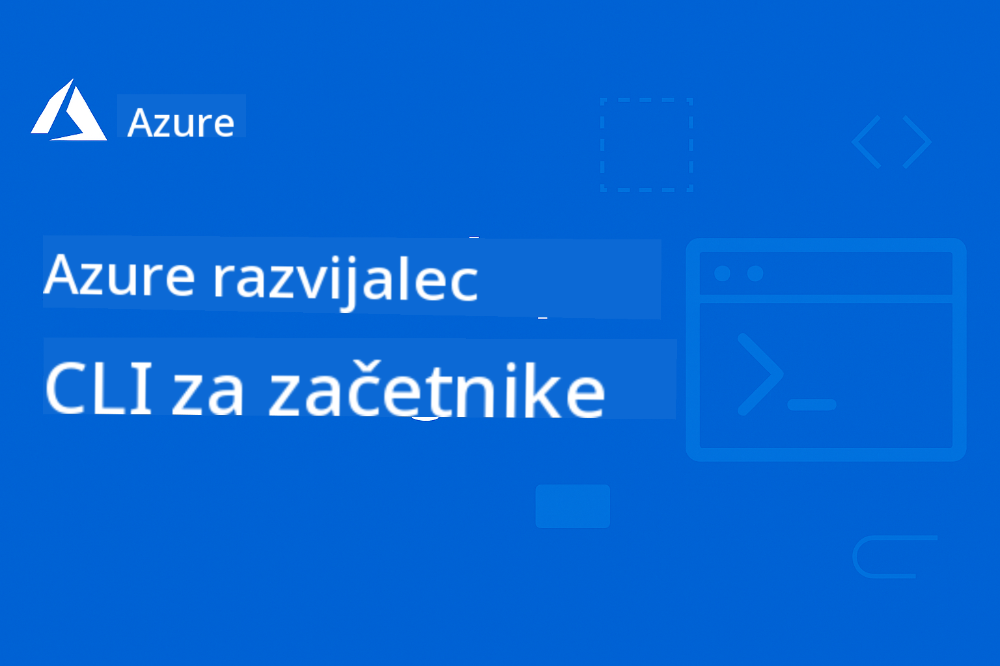

<!--
CO_OP_TRANSLATOR_METADATA:
{
  "original_hash": "ee9a026a572535444287d531dbd75d78",
  "translation_date": "2025-09-12T22:41:57+00:00",
  "source_file": "README.md",
  "language_code": "sl"
}
-->
# AZD Za Začetnike

 

[](https://GitHub.com/microsoft/azd-for-beginners/watchers/?WT.mc_id=academic-105485-koreyst)
[](https://GitHub.com/microsoft/azd-for-beginners/network/?WT.mc_id=academic-105485-koreyst)
[](https://GitHub.com/microsoft/azd-for-beginners/stargazers/?WT.mc_id=academic-105485-koreyst)


Sledite tem korakom, da začnete uporabljati te vire:
1. **Forkajte repozitorij**: Kliknite [](https://GitHub.com/microsoft/azd-for-beginners/fork)
2. **Klonirajte repozitorij**:   `git clone https://github.com/microsoft/azd-for-beginners.git`
3. [**Pridružite se Azure Discord skupnostim in spoznajte strokovnjake ter druge razvijalce**](https://discord.com/invite/ByRwuEEgH4)

### Podpora za več jezikov

#### Podprto prek GitHub Action (Avtomatizirano in vedno posodobljeno)

[French](../fr/README.md) | [Spanish](../es/README.md) | [German](../de/README.md) | [Russian](../ru/README.md) | [Arabic](../ar/README.md) | [Persian (Farsi)](../fa/README.md) | [Urdu](../ur/README.md) | [Chinese (Simplified)](../zh/README.md) | [Chinese (Traditional, Macau)](../mo/README.md) | [Chinese (Traditional, Hong Kong)](../hk/README.md) | [Chinese (Traditional, Taiwan)](../tw/README.md) | [Japanese](../ja/README.md) | [Korean](../ko/README.md) | [Hindi](../hi/README.md) | [Bengali](../bn/README.md) | [Marathi](../mr/README.md) | [Nepali](../ne/README.md) | [Punjabi (Gurmukhi)](../pa/README.md) | [Portuguese (Portugal)](../pt/README.md) | [Portuguese (Brazil)](../br/README.md) | [Italian](../it/README.md) | [Polish](../pl/README.md) | [Turkish](../tr/README.md) | [Greek](../el/README.md) | [Thai](../th/README.md) | [Swedish](../sv/README.md) | [Danish](../da/README.md) | [Norwegian](../no/README.md) | [Finnish](../fi/README.md) | [Dutch](../nl/README.md) | [Hebrew](../he/README.md) | [Vietnamese](../vi/README.md) | [Indonesian](../id/README.md) | [Malay](../ms/README.md) | [Tagalog (Filipino)](../tl/README.md) | [Swahili](../sw/README.md) | [Hungarian](../hu/README.md) | [Czech](../cs/README.md) | [Slovak](../sk/README.md) | [Romanian](../ro/README.md) | [Bulgarian](../bg/README.md) | [Serbian (Cyrillic)](../sr/README.md) | [Croatian](../hr/README.md) | [Slovenian](./README.md) | [Ukrainian](../uk/README.md) | [Burmese (Myanmar)](../my/README.md)

**Če želite dodati dodatne jezike, so podprti jeziki navedeni [tukaj](https://github.com/Azure/co-op-translator/blob/main/getting_started/supported-languages.md)**

## Uvod

Dobrodošli v celovitem vodniku za Azure Developer CLI (azd). Ta repozitorij je zasnovan za pomoč razvijalcem na vseh ravneh, od študentov do profesionalnih razvijalcev, pri učenju in obvladovanju Azure Developer CLI za učinkovite oblačne namestitve, **s posebnim poudarkom na uvajanju AI aplikacij z uporabo Azure AI Foundry**. Ta strukturiran učni vir ponuja praktične izkušnje z oblačnimi namestitvami na Azure, odpravljanjem pogostih težav in izvajanjem najboljših praks za uspešno uvajanje predlog AZD.

### **Zakaj je ta vodnik pomemben za AI razvijalce**
Na podlagi nedavne ankete v skupnosti Azure AI Foundry Discord je **45 % razvijalcev zainteresiranih za uporabo AZD za AI delovne obremenitve**, vendar se soočajo z izzivi, kot so:
- Kompleksne večstoritevne AI arhitekture
- Najboljše prakse za produkcijsko uvajanje AI
- Integracija in konfiguracija Azure AI storitev
- Optimizacija stroškov za AI delovne obremenitve
- Odpravljanje težav pri uvajanju AI

## Cilji učenja

Z delom skozi ta repozitorij boste:
- Obvladali osnove in ključne koncepte Azure Developer CLI
- Naučili se uvajati in zagotavljati Azure vire z uporabo Infrastructure as Code
- Razvili veščine odpravljanja težav pri pogostih težavah z uvajanjem AZD
- Razumeli preverjanje pred uvajanjem in načrtovanje zmogljivosti
- Izvajali najboljše prakse za varnost in optimizacijo stroškov
- Pridobili samozavest pri uvajanju aplikacij, pripravljenih za produkcijo, na Azure

## Rezultati učenja

Po zaključku tega tečaja boste sposobni:
- Uspešno namestiti, konfigurirati in uporabljati Azure Developer CLI
- Ustvariti in uvajati aplikacije z uporabo predlog AZD
- Odpravljati težave z avtentikacijo, infrastrukturo in uvajanjem
- Izvesti preverjanja pred uvajanjem, vključno z načrtovanjem zmogljivosti in izbiro SKU
- Izvajati najboljše prakse za spremljanje, varnost in upravljanje stroškov
- Integrirati delovne tokove AZD v CI/CD pipeline

## Kazalo vsebine

- [Kaj je Azure Developer CLI?](../..)
- [Hitri začetek](../..)
- [Učna pot](../..)
  - [Za AI razvijalce (Priporočeno začnite tukaj!)](../..)
  - [Za študente in začetnike](../..)
  - [Za razvijalce](../..)
  - [Za DevOps inženirje](../..)
- [Dokumentacija](../..)
  - [Začetek](../..)
  - [Uvajanje in zagotavljanje](../..)
  - [Preverjanja pred uvajanjem](../..)
  - [AI in Azure AI Foundry](../..)
  - [Odpravljanje težav](../..)
- [Primeri in predloge](../..)
  - [Izpostavljeno: Predloge Azure AI Foundry](../..)
  - [Izpostavljeno: Scenariji Azure AI Foundry E2E](../..)
  - [Dodatne predloge AZD](../..)
  - [Praktične delavnice in laboratoriji](../..)
- [Viri](../..)
- [Prispevanje](../..)
- [Podpora](../..)
- [Skupnost](../..)

## Kaj je Azure Developer CLI?

Azure Developer CLI (azd) je ukazna vrstica, osredotočena na razvijalce, ki pospeši proces gradnje in uvajanja aplikacij na Azure. Ponuja:

- **Uvajanje na podlagi predlog** - Uporaba vnaprej pripravljenih predlog za pogoste vzorce aplikacij
- **Infrastructure as Code** - Upravljanje Azure virov z uporabo Bicep ali Terraform
- **Integrirani delovni tokovi** - Brezhibno zagotavljanje, uvajanje in spremljanje aplikacij
- **Prijazno za razvijalce** - Optimizirano za produktivnost in izkušnjo razvijalcev

### **AZD + Azure AI Foundry: Popolno za AI uvajanja**

**Zakaj AZD za AI rešitve?** AZD rešuje glavne izzive, s katerimi se soočajo AI razvijalci:

- **Predloge, pripravljene za AI** - Vnaprej konfigurirane predloge za Azure OpenAI, Cognitive Services in ML delovne obremenitve
- **Varna AI uvajanja** - Vgrajeni varnostni vzorci za AI storitve, API ključe in modelne končne točke
- **Produkcijski AI vzorci** - Najboljše prakse za skalabilna in stroškovno učinkovita AI uvajanja
- **Celoviti AI delovni tokovi** - Od razvoja modela do produkcijskega uvajanja z ustreznim spremljanjem
- **Optimizacija stroškov** - Pametne strategije dodeljevanja virov in skaliranja za AI delovne obremenitve
- **Integracija Azure AI Foundry** - Brezhibna povezava z modelnim katalogom in končnimi točkami AI Foundry

## Hitri začetek

### Predpogoji
- Azure naročnina
- Nameščen Azure CLI
- Git (za kloniranje predlog)

### Namestitev
```bash
# Windows (PowerShell)
powershell -ex AllSigned -c "Invoke-RestMethod 'https://aka.ms/install-azd.ps1' | Invoke-Expression"

# macOS/Linux
curl -fsSL https://aka.ms/install-azd.sh | bash
```

### Vaše prvo uvajanje
```bash
# Initialize a new project
azd init --template todo-nodejs-mongo

# Provision Azure resources and deploy
azd up
```

### Vaše prvo AI uvajanje
```bash
# Initialize an AI-powered chat application with Azure OpenAI
azd init --template azure-search-openai-demo

# Configure AI services and deploy
azd up

# Or try other AI templates:
azd init --template openai-chat-app-quickstart
azd init --template ai-document-processing
azd init --template contoso-chat
```

## Učna pot

### Za AI razvijalce (Priporočeno začnite tukaj!)
1. **Hitri začetek**: Preizkusite [azure-search-openai-demo](https://github.com/Azure-Samples/azure-search-openai-demo) predlogo
2. **Naučite se osnov**: [Osnove AZD](docs/getting-started/azd-basics.md) + [Integracija Azure AI Foundry](docs/ai-foundry/azure-ai-foundry-integration.md)
3. **Praktična vaja**: Dokončajte [AI Workshop Lab](docs/ai-foundry/ai-workshop-lab.md)
4. **Pripravljeno za produkcijo**: Preglejte [Najboljše prakse za produkcijski AI](docs/ai-foundry/production-ai-practices.md)
5. **Napredno**: Uvedite [contoso-chat](https://github.com/Azure-Samples/contoso-chat) predlogo za podjetja

### Za študente in začetnike
1. Začnite z [Osnove AZD](docs/getting-started/azd-basics.md)
2. Sledite [Vodniku za namestitev](docs/getting-started/installation.md)
3. Dokončajte [Vaš prvi projekt](docs/getting-started/first-project.md)
4. Vadite z [Primer enostavne spletne aplikacije](../../examples/simple-web-app)

### Za razvijalce
1. Preglejte [Vodnik za konfiguracijo](docs/getting-started/configuration.md)
2. Preučite [Vodnik za uvajanje](docs/deployment/deployment-guide.md)
3. Delajte na [Primer aplikacije z bazo podatkov](../../examples/database-app)
4. Raziščite [Primer aplikacije v kontejnerju](../../examples/container-app)

### Za DevOps inženirje
1. Obvladujte [Zagotavljanje virov](docs/deployment/provisioning.md)
2. Izvedite [Preverjanja pred uvajanjem](docs/pre-deployment/preflight-checks.md)
3. Vadite [Načrtovanje zmogljivosti](docs/pre-deployment/capacity-planning.md)
4. Napredno [Primer mikroservisov](../../examples/microservices)

## Dokumentacija

### Začetek
- [**Osnove AZD**](docs/getting-started/azd-basics.md) - Ključni koncepti in terminologija
- [**Namestitev in nastavitev**](docs/getting-started/installation.md) - Vodniki za namestitev glede na platformo
- [**Konfiguracija**](docs/getting-started/configuration.md) - Nastavitev okolja in avtentikacija
- [**Vaš prvi projekt**](docs/getting-started/first-project.md) - Korak za korakom vadnica

### Uvajanje in zagotavljanje
- [**Vodnik za uvajanje**](docs/deployment/deployment-guide.md) - Celoviti delovni tokovi za uvajanje
- [**Zagotavljanje virov**](docs/deployment/provisioning.md) - Upravljanje Azure virov

### Preverjanja pred uvajanjem
- [**Načrtovanje zmogljivosti**](docs/pre-deployment/capacity-planning.md) - Validacija zmogljivosti Azure virov
- [**Izbira SKU**](docs/pre-deployment/sku-selection.md) - Izbira ustreznih SKU za Azure
- [**Preverjanja pred uvajanjem**](docs/pre-deployment/preflight-checks.md) - Avtomatizirani validacijski skripti

### AI in Azure AI Foundry
- [**Integracija Azure AI Foundry**](docs/ai-foundry/azure-ai-foundry-integration.md) - Povezava AZD z Azure AI Foundry storitvami
- [**Vzorci za uvajanje AI modelov**](docs/ai-foundry/ai-model-deployment.md) - Uvajanje in upravljanje AI modelov z AZD
- [**AI Workshop Lab**](docs/ai-foundry/ai-workshop-lab.md) - Praktični laboratorij: Priprava AI rešitev za AZD
- [**Najboljše prakse za produkcijski AI**](docs/ai-foundry/production-ai-practices.md) - Varnost, skaliranje in spremljanje AI delovnih obremenitev

### Odpravljanje težav
- [**Pogoste težave**](docs/troubleshooting/common-issues.md) - Pogosto srečane težave in rešitve
- [**Vodnik za odpravljanje napak**](docs/troubleshooting/debugging.md) - Koraki za odpravljanje napak
- [**Odpravljanje težav, povezanih z AI**](docs/troubleshooting/ai-troubleshooting.md) - Težave pri storitvah AI in uvajanju modelov

## Primeri in predloge

### [Izpostavljeno: Predloge Azure AI Foundry](https://ai.azure.com/resource/build/templates)
**Začnite tukaj, če uvajate AI aplikacije!**

| Predloga | Opis | Kompleksnost | Storitve |
|----------|-------------|------------|----------|
| [**Začnite z AI klepetom**](https://github.com/Azure-Samples/get-started-with-ai-chat) | Ustvarite in uvedite osnovno aplikacijo za klepet, integrirano z vašimi podatki in vpogledi v telemetrijo, z uporabo Azure Container Apps |⭐⭐ | AzureOpenAI + Azure AI Model Inference API + Azure AI Search + Azure Container Apps + Application Insights |
| [**Začnite z AI agenti**](https://github.com/Azure-Samples/get-started-with-ai-agents) | Ustvarite in uvedite osnovno aplikacijo za agente z akcijami in vpogledi v telemetrijo z uporabo Azure Container Apps. |⭐⭐ | Azure AI Agent Service + AzureOpenAI + Azure AI Search + Azure Container Apps + Application Insights|
| [**Avtomatizacija delovnih procesov z več agenti**](https://github.com/Azure-Samples/get-started-with-ai-chat) | Izboljšajte načrtovanje nalog in avtomatizacijo z orkestracijo in upravljanjem skupine AI agentov.|⭐⭐⭐ | AzureOpenAI + Azure AI Agent Service + Semantic Kernel + Azure CosmosDB + Azure Container Apps|
| [**Generiranje dokumentov iz vaših podatkov**](https://github.com/Azure-Samples/get-started-with-ai-chat) | Pospešite generiranje dokumentov, kot so pogodbe, računi in investicijski predlogi, z iskanjem in povzetkom relevantnih informacij iz vaših podatkov. |⭐⭐⭐  | AzureOpenAI + Azure AI Search + Azure AI Services + Azure CosmosDB|
| [**Izboljšajte sestanke s strankami z agenti**](https://github.com/Azure-Samples/get-started-with-ai-chat) | Migrirajte zastarelo kodo v sodobne jezike z uporabo ekipe agentov. |⭐⭐⭐| AzureOpenAI + Azure AI Search + Azure CosmosDB + Azure SQL Database |
| [**Modernizirajte svojo kodo z agenti**](https://github.com/Azure-Samples/get-started-with-ai-chat) | Ustvarite in uvedite osnovno aplikacijo za klepet, integrirano z vašimi podatki in vpogledi v telemetrijo, z uporabo Azure Container Apps |⭐⭐⭐ | AzureOpenAI + Azure Agent Service + Semantic Kernel + Azure CosmosDB + Azure Container Apps|
| [**Zgradite svoj pogovorni agent**](https://github.com/Azure-Samples/get-started-with-ai-chat) | Izkoristite napredno razumevanje pogovorov za ustvarjanje in izboljšanje chatbotov ter agentov z determinističnimi in človeško nadzorovanimi delovnimi procesi. |⭐⭐⭐ | AI Language + AzureOpenAI + AI Search + Azure Storage + Azure Container Registry|
| [**Odklenite vpoglede iz podatkov o pogovorih**](https://github.com/Azure-Samples/get-started-with-ai-chat) | Izboljšajte učinkovitost kontaktnih centrov z odkrivanjem vpogledov iz velikih zvočnih in besedilnih podatkovnih nizov z uporabo naprednih zmogljivosti razumevanja vsebine. |⭐⭐⭐ | AzureOpenAI + AI Search + Semantic Kernel + Azure Agent Service + AI AI Content Understanding|
| [**Večmodalna obdelava vsebine**](https://github.com/Azure-Samples/get-started-with-ai-chat) | Hitro in natančno obdelajte zahtevke, račune, pogodbe in druge dokumente z ekstrakcijo informacij iz nestrukturirane vsebine ter njihovo preslikavo v strukturiran format. Ta predloga podpira besedilo, slike, tabele in grafe. |⭐⭐⭐⭐ | AzureOpenAI + Azure Content Understanding + Azure CosmosDB + Azure Container Apps|

### Izpostavljeno: Celoviti scenariji Azure AI Foundry
**Začnite tukaj, če uvajate AI aplikacije!**

| Predloga | Opis | Kompleksnost | Storitve |
|----------|-------------|------------|----------|
| [**openai-chat-app-quickstart**](https://github.com/Azure-Samples/openai-chat-app-quickstart) | Preprost vmesnik za klepet z Azure OpenAI | ⭐ | AzureOpenAI + Container Apps |
| [**azure-search-openai-demo**](https://github.com/Azure-Samples/azure-search-openai-demo) | Klepetalna aplikacija z RAG podporo in Azure OpenAI | ⭐⭐ | AzureOpenAI + Search + App Service |
| [**ai-document-processing**](https://github.com/Azure-Samples/ai-document-processing) | Analiza dokumentov z AI storitvami | ⭐⭐ | Azure Document Intelligence + Functions |
| [**agent-openai-python-prompty**](https://github.com/Azure-Samples/agent-openai-python-prompty) | Okvir AI agentov z funkcijskim klicem | ⭐⭐⭐ | AzureOpenAI + Azure Container Apps + Functions |
| [**contoso-chat**](https://github.com/Azure-Samples/contoso-chat) | Klepet za podjetja z AI orkestracijo | ⭐⭐⭐ | AzureOpenAI + Azure AI Search + Container Apps |

### Dodatne AZD predloge
- [**Imenik primerov**](examples/README.md) - Praktični primeri, predloge in scenariji iz resničnega sveta
- [**Azure-Samples AZD predloge**](https://github.com/Azure-Samples/azd-templates) - Uradne Microsoftove vzorčne predloge  
- [**Galerija Awesome AZD**](https://azure.github.io/awesome-azd/) - Predloge, ki jih prispeva skupnost

### Praktične delavnice in laboratoriji
- [**AI Workshop Lab**](docs/ai-foundry/ai-workshop-lab.md) - **NOVO**: Naredite svoje AI rešitve pripravljene za AZD uvajanje
- [**Delavnica AZD za začetnike**](workshop/README.md) - Osredotočeno na uvajanje predlog AI agentov z AZD

## Viri

### Hitre reference
- [**Seznam ukazov**](resources/cheat-sheet.md) - Ključni azd ukazi
- [**Glosar**](resources/glossary.md) - Terminologija Azure in azd
- [**Pogosta vprašanja**](resources/faq.md) - Pogosta vprašanja
- [**Vodnik za študij**](resources/study-guide.md) - Celoviti učni cilji in praktične vaje

### Zunanji viri
- [Dokumentacija Azure Developer CLI](https://learn.microsoft.com/en-us/azure/developer/azure-developer-cli/)
- [Azure Architecture Center](https://learn.microsoft.com/en-us/azure/architecture/)
- [Azure kalkulator cen](https://azure.microsoft.com/pricing/calculator/)
- [Azure Status](https://status.azure.com/)

## Prispevanje

Veseli smo vaših prispevkov! Prosimo, preberite naš [Vodnik za prispevanje](CONTRIBUTING.md) za podrobnosti o:
- Kako prijaviti težave in predlagati funkcije
- Smernice za prispevanje kode
- Izboljšave dokumentacije
- Standardi skupnosti

## Podpora

- **Težave**: [Prijavite napake in predlagajte funkcije](https://github.com/microsoft/azd-for-beginners/issues)
- **Razprave**: [Microsoft Azure Discord skupnost Q&A in razprave](https://discord.gg/microsoft-azure)
- **Podpora, povezana z AI**: Pridružite se [kanalu #Azure](https://discord.gg/microsoft-azure) za razprave o AZD + AI Foundry
- **E-pošta**: Za zasebne poizvedbe
- **Microsoft Learn**: [Uradna dokumentacija Azure Developer CLI](https://learn.microsoft.com/en-us/azure/developer/azure-developer-cli/)

### Vpogledi skupnosti iz Discorda Azure AI Foundry

**Rezultati ankete iz kanala #Azure:**
- **45%** razvijalcev želi uporabljati AZD za AI delovne obremenitve
- **Največji izzivi**: Uvajanje več storitev, upravljanje poverilnic, pripravljenost za produkcijo
- **Najbolj zaželeno**: AI-specifične predloge, vodniki za odpravljanje težav, najboljše prakse

**Pridružite se naši skupnosti za:**
- Deljenje svojih izkušenj z AZD + AI in pridobivanje pomoči
- Dostop do zgodnjih predogledov novih AI predlog
- Prispevanje k najboljšim praksam za uvajanje AI
- Vpliv na prihodnji razvoj funkcij AI + AZD

## Licenca

Ta projekt je licenciran pod licenco MIT - glejte datoteko [LICENSE](../../LICENSE) za podrobnosti.

## Drugi tečaji

Naša ekipa pripravlja tudi druge tečaje! Oglejte si:

- [**NOVO** Protokol konteksta modela (MCP) za začetnike](https://github.com/microsoft/mcp-for-beginners?WT.mc_id=academic-105485-koreyst)
- [AI agenti za začetnike](https://github.com/microsoft/ai-agents-for-beginners?WT.mc_id=academic-105485-koreyst)
- [Generativni AI za začetnike z uporabo .NET](https://github.com/microsoft/Generative-AI-for-beginners-dotnet?WT.mc_id=academic-105485-koreyst)
- [Generativni AI za začetnike](https://github.com/microsoft/generative-ai-for-beginners?WT.mc_id=academic-105485-koreyst)
- [Generativni AI za začetnike z uporabo Jave](https://github.com/microsoft/generative-ai-for-beginners-java?WT.mc_id=academic-105485-koreyst)
- [ML za začetnike](https://aka.ms/ml-beginners?WT.mc_id=academic-105485-koreyst)
- [Podatkovna znanost za začetnike](https://aka.ms/datascience-beginners?WT.mc_id=academic-105485-koreyst)
- [AI za začetnike](https://aka.ms/ai-beginners?WT.mc_id=academic-105485-koreyst)
- [Kibernetska varnost za začetnike](https://github.com/microsoft/Security-101??WT.mc_id=academic-96948-sayoung)
- [Razvoj spletnih aplikacij za začetnike](https://aka.ms/webdev-beginners?WT.mc_id=academic-105485-koreyst)
- [IoT za začetnike](https://aka.ms/iot-beginners?WT.mc_id=academic-105485-koreyst)
- [Razvoj XR za začetnike](https://github.com/microsoft/xr-development-for-beginners?WT.mc_id=academic-105485-koreyst)
- [Obvladovanje GitHub Copilot za AI programiranje v paru](https://aka.ms/GitHubCopilotAI?WT.mc_id=academic-105485-koreyst)
- [Obvladovanje GitHub Copilot za C#/.NET razvijalce](https://github.com/microsoft/mastering-github-copilot-for-dotnet-csharp-developers?WT.mc_id=academic-105485-koreyst)
- [Izberite svojo lastno Copilot pustolovščino](https://github.com/microsoft/CopilotAdventures?WT.mc_id=academic-105485-koreyst)

---

**Navigacija**
- **Naslednja lekcija**: [Osnove AZD](docs/getting-started/azd-basics.md)

---

**Omejitev odgovornosti**:  
Ta dokument je bil preveden z uporabo storitve AI za prevajanje [Co-op Translator](https://github.com/Azure/co-op-translator). Čeprav si prizadevamo za natančnost, vas prosimo, da upoštevate, da lahko avtomatizirani prevodi vsebujejo napake ali netočnosti. Izvirni dokument v njegovem izvirnem jeziku je treba obravnavati kot avtoritativni vir. Za ključne informacije priporočamo profesionalni človeški prevod. Ne prevzemamo odgovornosti za morebitna nesporazumevanja ali napačne razlage, ki bi nastale zaradi uporabe tega prevoda.