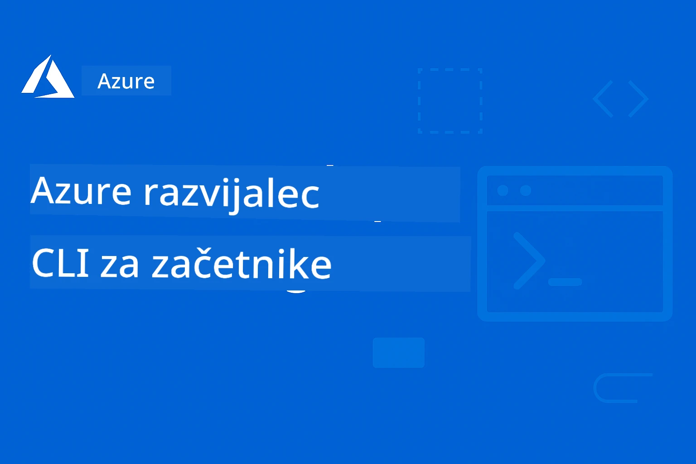

# AZD Za začetnike: Strukturirano učno pot

 

[](https://GitHub.com/microsoft/azd-for-beginners/watchers/)
[](https://GitHub.com/microsoft/azd-for-beginners/network/)
[](https://GitHub.com/microsoft/azd-for-beginners/stargazers/)

[](https://discord.gg/microsoft-azure)
[](https://discord.gg/nTYy5BXMWG)

---

### Samodejni prevodi (vedno posodobljeno)

<!-- CO-OP TRANSLATOR LANGUAGES TABLE START -->
[Arabščina](../ar/README.md) | [Bengalščina](../bn/README.md) | [Bolgarščina](../bg/README.md) | [Burmanščina (Myanmar)](../my/README.md) | [Kitajščina (poenostavljena)](../zh-CN/README.md) | [Kitajščina (tradicionalna, Hong Kong)](../zh-HK/README.md) | [Kitajščina (tradicionalna, Macau)](../zh-MO/README.md) | [Kitajščina (tradicionalna, Taiwan)](../zh-TW/README.md) | [Hrvaščina](../hr/README.md) | [Češčina](../cs/README.md) | [Danščina](../da/README.md) | [Nizozemščina](../nl/README.md) | [Estonščina](../et/README.md) | [Finščina](../fi/README.md) | [Francoščina](../fr/README.md) | [Nemščina](../de/README.md) | [Grščina](../el/README.md) | [Hebrejščina](../he/README.md) | [Hindijščina](../hi/README.md) | [Madžarščina](../hu/README.md) | [Indonezijščina](../id/README.md) | [Italijanščina](../it/README.md) | [Japonščina](../ja/README.md) | [Kannada](../kn/README.md) | [Korejščina](../ko/README.md) | [Litovščina](../lt/README.md) | [Malajščina](../ms/README.md) | [Malajalščina](../ml/README.md) | [Marathi](../mr/README.md) | [Nepalščina](../ne/README.md) | [Nigerijski pidgin](../pcm/README.md) | [Norveščina](../no/README.md) | [Perzijščina (Farsi)](../fa/README.md) | [Poljščina](../pl/README.md) | [Portugalščina (Brazilija)](../pt-BR/README.md) | [Portugalščina (Portugalska)](../pt-PT/README.md) | [Pendžabščina (Gurmukhi)](../pa/README.md) | [Romunščina](../ro/README.md) | [Ruščina](../ru/README.md) | [Srbščina (cirilica)](../sr/README.md) | [Slovaščina](../sk/README.md) | [Slovenščina](./README.md) | [Španščina](../es/README.md) | [Svahili](../sw/README.md) | [Švedščina](../sv/README.md) | [Tagalog (filipinski)](../tl/README.md) | [Tamilščina](../ta/README.md) | [Teluščina](../te/README.md) | [Tajsščina](../th/README.md) | [Turščina](../tr/README.md) | [Ukrajinščina](../uk/README.md) | [Urdu](../ur/README.md) | [Vietnamščina](../vi/README.md)

> **Raje klonirate lokalno?**
>
> To repozitorij vsebuje več kot 50 prevodov v različnih jezikih, kar znatno poveča velikost prenosa. Če želite klonirati brez prevodov, uporabite sparse checkout:
>
> **Bash / macOS / Linux:**
> ```bash
> git clone --filter=blob:none --sparse https://github.com/microsoft/AZD-for-beginners.git
> cd AZD-for-beginners
> git sparse-checkout set --no-cone '/*' '!translations' '!translated_images'
> ```
>
> **CMD (Windows):**
> ```cmd
> git clone --filter=blob:none --sparse https://github.com/microsoft/AZD-for-beginners.git
> cd AZD-for-beginners
> git sparse-checkout set --no-cone "/*" "!translations" "!translated_images"
> ```
>
> To vam daje vse, kar potrebujete za dokončanje tečaja z veliko hitrejšim prenosom.
<!-- CO-OP TRANSLATOR LANGUAGES TABLE END -->

## 🚀 Kaj je Azure Developer CLI (azd)?

**Azure Developer CLI (azd)** je prijazno ukazno orodje za razvijalce, ki poenostavi razmestitev aplikacij v Azure. Namesto ročnega ustvarjanja in povezovanja desetih Azure virov lahko z enim ukazom razmestite celotne aplikacije.

### Čar `azd up`

```bash
# Ta enojni ukaz naredi vse:
# ✅ Ustvari vse Azure vire
# ✅ Konfigurira omrežje in varnost
# ✅ Zgradi kodo vaše aplikacije
# ✅ Naloži na Azure
# ✅ Ponuja delujoč URL
azd up
```

**To je vse!** Brez klikanja po Azure Portalu, brez kompleksnih ARM predlog, brez ročne konfiguracije — samo delujoče aplikacije v Azure.

---

## ❓ Azure Developer CLI vs Azure CLI: Kakšna je razlika?

To je najpogostejše vprašanje začetnikov. Tukaj je preprost odgovor:

| Funkcija | **Azure CLI (`az`)** | **Azure Developer CLI (`azd`)** |
|---------|---------------------|--------------------------------|
| **Namen** | Upravljanje posameznih Azure virov | Razmestitev celovitih aplikacij |
| **Miselnost** | Osredotočeno na infrastrukturo | Osredotočeno na aplikacijo |
| **Primer** | `az webapp create --name myapp...` | `azd up` |
| **Krivulja učenja** | Treba poznati Azure storitve | Dovolj, da poznate svojo aplikacijo |
| **Najbolj za** | DevOps, infrastrukturo | Razvijalce, prototipiranje |

### Preprosta analogija

- **Azure CLI** je kot imeti vse orodje za gradnjo hiše - kladiva, žage, žeblje. Lahko zgradite karkoli, vendar morate poznati gradbeništvo.
- **Azure Developer CLI** je kot najem izvajalca - opišete, kaj želite, in oni poskrbijo za gradnjo.

### Kdaj uporabiti kateri

| Scenarij | Uporabite |
|----------|----------|
| "Želim hitro razmestiti mojo spletno aplikacijo" | `azd up` |
| "Potrebujem ustvariti le storage account" | `az storage account create` |
| "Gradim celotno AI aplikacijo" | `azd init --template azure-search-openai-demo` |
| "Moram razhroščevati določen Azure vir" | `az resource show` |
| "Želim proizvodno razmestitev v nekaj minutah" | `azd up --environment production` |

### Delujeta skupaj!

AZD uporablja Azure CLI v ozadju. Uporabljate lahko oba:
```bash
# Namestite svojo aplikacijo z AZD
azd up

# Nato prilagodite določene vire z Azure CLI
az webapp config set --name myapp --always-on true
```

---

## 🌟 Najdite predloge v Awesome AZD

Ne začnite iz nič! **Awesome AZD** je zbirka skupnosti z že pripravljenimi predlogami za hitre razmestitve:

| Vir | Opis |
|----------|-------------|
| 🔗 [**Awesome AZD Gallery**](https://azure.github.io/awesome-azd/) | Prebrskajte 200+ predlog z enkrtnim razmestitvijo |
| 🔗 [**Pošlji predlogo**](https://github.com/Azure/awesome-azd/issues) | Prispevajte svojo predlogo skupnosti |
| 🔗 [**GitHub repozitorij**](https://github.com/Azure/awesome-azd) | Označite z zvezdico in raziščite izvorno kodo |

### Priljubljene AI predloge iz Awesome AZD

```bash
# RAG klepet z Azure OpenAI + AI iskanje
azd init --template azure-search-openai-demo

# Hitra AI klepetalna aplikacija
azd init --template openai-chat-app-quickstart

# AI agenti s Foundry agenti
azd init --template get-started-with-ai-agents
```

---

## 🎯 Začnite v 3 korakih

### Korak 1: Namestite AZD (2 minuti)

**Windows:**
```powershell
winget install microsoft.azd
```

**macOS:**
```bash
brew tap azure/azd && brew install azd
```

**Linux:**
```bash
curl -fsSL https://aka.ms/install-azd.sh | bash
```

### Korak 2: Prijava v Azure

```bash
azd auth login
```

### Korak 3: Razmestite svojo prvo aplikacijo

```bash
# Inicializiraj iz predloge
azd init --template todo-nodejs-mongo

# Razporedi na Azure (ustvari vse!)
azd up
```

**🎉 To je vse!** Vaša aplikacija je zdaj živa v Azure.

### Počisti (ne pozabite!)

```bash
# Remove all resources when done experimenting
azd down --force --purge
```

---

## 📚 Kako uporabljati ta tečaj

Ta tečaj je zasnovan za **postopno učenje** - začnite tam, kjer ste udobni, in napredujte:

| Vaše izkušnje | Začnite tukaj |
|-----------------|------------|
| **Povsem nov v Azure** | [Poglavje 1: Temelji](../..) |
| **Poznate Azure, novi v AZD** | [Poglavje 1: Temelji](../..) |
| **Želite razmestiti AI aplikacije** | [Poglavje 2: Razvoj, usmerjen na AI](../..) |
| **Želite praktične vaje** | [🎓 Interaktivna delavnica](workshop/README.md) - 3-4 urni vodeni laboratorij |
| **Potrebujete produkcijske vzorce** | [Poglavje 8: Produkcija & Enterprise](../..) |

### Hitra nastavitev

1. **Forkajte ta repozitorij**: [](https://GitHub.com/microsoft/azd-for-beginners/fork)
2. **Klonirajte ga**: `git clone https://github.com/YOUR-USERNAME/azd-for-beginners.git`
3. **Poiščite pomoč**: [Azure Discord skupnost](https://discord.com/invite/ByRwuEEgH4)

> **Raje klonirate lokalno?**
>
> Ta repozitorij vsebuje več kot 50 prevodov v različnih jezikih, kar znatno poveča velikost prenosa. Če želite klonirati brez prevodov, uporabite sparse checkout:
> ```bash
> git clone --filter=blob:none --sparse https://github.com/microsoft/AZD-for-beginners.git
> cd AZD-for-beginners
> git sparse-checkout set --no-cone '/*' '!translations' '!translated_images'
> ```
> To vam daje vse, kar potrebujete za dokončanje tečaja z veliko hitrejšim prenosom.


## Pregled tečaja

Osvojite Azure Developer CLI (azd) skozi strukturirana poglavja, zasnovana za postopno učenje. **Poseben poudarek na razmestitvi AI aplikacij z integracijo Microsoft Foundry.**

### Zakaj je ta tečaj ključnega pomena za sodobne razvijalce

Glede na vpoglede iz Microsoft Foundry Discord skupnosti si **45 % razvijalcev želi uporabljati AZD za AI delovne obremenitve**, vendar se srečujejo s izzivi pri:
- Kompleksnih večstoritevnih AI arhitekturah
- Najboljših praksah za produkcijsko razmestitev AI  
- Integraciji in konfiguraciji Azure AI storitev
- Optimizaciji stroškov za AI delovne obremenitve
- Reševanju težav, specifičnih za razmestitve AI

### Cilji učenja

S zaključkom tega strukturiranega tečaja boste:
- **Obvladali osnove AZD**: osnovni koncepti, namestitev in konfiguracija
- **Razmestili AI aplikacije**: uporaba AZD z Microsoft Foundry storitvami
- **Implementirali Infrastructure as Code**: upravljanje Azure virov z Bicep predlogami
- **Razhroščevanje razmestitev**: reševanje pogostih težav in odpravljanje napak
- **Optimizirali za produkcijo**: varnost, skaliranje, spremljanje in upravljanje stroškov
- **Gradili rešitve z več agenti**: razmestitev kompleksnih AI arhitektur

## 🗺️ Zemljevid tečaja: Hitro krmarjenje po poglavjih

Vsako poglavje ima namenski README s cilji učenja, hitrimi začetki in vajami:

| Poglavje | Tema | Lekcije | Trajanje | Kompleksnost |
|---------|-------|---------|----------|------------|
| **[Pogl. 1: Temelji](docs/chapter-01-foundation/README.md)** | Začetek | [Osnove AZD](docs/chapter-01-foundation/azd-basics.md) &#124; [Namestitev](docs/chapter-01-foundation/installation.md) &#124; [Prvi projekt](docs/chapter-01-foundation/first-project.md) | 30-45 min | ⭐ |
| **[Pogl. 2: Razvoj AI](docs/chapter-02-ai-development/README.md)** | Aplikacije, osredotočene na AI | [Integracija Foundry](docs/chapter-02-ai-development/microsoft-foundry-integration.md) &#124; [AI agenti](docs/chapter-02-ai-development/agents.md) &#124; [Razmestitev modela](docs/chapter-02-ai-development/ai-model-deployment.md) &#124; [Delavnica](docs/chapter-02-ai-development/ai-workshop-lab.md) | 1-2 hrs | ⭐⭐ |
| **[Pogl. 3: Konfiguracija](docs/chapter-03-configuration/README.md)** | Avt. & varnost | [Konfiguracija](docs/chapter-03-configuration/configuration.md) &#124; [Avtentikacija & varnost](docs/chapter-03-configuration/authsecurity.md) | 45-60 min | ⭐⭐ |
| **[Poglavje 4: Infrastruktura](docs/chapter-04-infrastructure/README.md)** | IaC in Nameščanje | [Vodnik za nameščanje](docs/chapter-04-infrastructure/deployment-guide.md) &#124; [Priprava virov](docs/chapter-04-infrastructure/provisioning.md) | 1-1.5 hrs | ⭐⭐⭐ |
| **[Poglavje 5: Večagentno](docs/chapter-05-multi-agent/README.md)** | AI agentne rešitve | [Prodajni scenarij](examples/retail-scenario.md) &#124; [Vzorci koordinacije](docs/chapter-06-pre-deployment/coordination-patterns.md) | 2-3 hrs | ⭐⭐⭐⭐ |
| **[Poglavje 6: Pred nameščanjem](docs/chapter-06-pre-deployment/README.md)** | Načrtovanje in preverjanje | [Preverjanje pred zagonem](docs/chapter-06-pre-deployment/preflight-checks.md) &#124; [Načrtovanje zmogljivosti](docs/chapter-06-pre-deployment/capacity-planning.md) &#124; [Izbira SKU](docs/chapter-06-pre-deployment/sku-selection.md) &#124; [Application Insights](docs/chapter-06-pre-deployment/application-insights.md) | 1 hr | ⭐⭐ |
| **[Poglavje 7: Odpravljanje težav](docs/chapter-07-troubleshooting/README.md)** | Razhroščevanje in popravila | [Pogoste težave](docs/chapter-07-troubleshooting/common-issues.md) &#124; [Razhroščevanje](docs/chapter-07-troubleshooting/debugging.md) &#124; [AI težave](docs/chapter-07-troubleshooting/ai-troubleshooting.md) | 1-1.5 hrs | ⭐⭐ |
| **[Poglavje 8: Produkcija](docs/chapter-08-production/README.md)** | Enterprise vzorci | [Prakse v produkciji](docs/chapter-08-production/production-ai-practices.md) | 2-3 hrs | ⭐⭐⭐⭐ |
| **[🎓 Delavnica](workshop/README.md)** | Praktična delavnica | [Uvod](workshop/docs/instructions/0-Introduction.md) &#124; [Izbira](workshop/docs/instructions/1-Select-AI-Template.md) &#124; [Preverjanje](workshop/docs/instructions/2-Validate-AI-Template.md) &#124; [Razčlenitev](workshop/docs/instructions/3-Deconstruct-AI-Template.md) &#124; [Konfiguracija](workshop/docs/instructions/4-Configure-AI-Template.md) &#124; [Prilagoditev](workshop/docs/instructions/5-Customize-AI-Template.md) &#124; [Razgradnja infrastrukture](workshop/docs/instructions/6-Teardown-Infrastructure.md) &#124; [Zaključek](workshop/docs/instructions/7-Wrap-up.md) | 3-4 hrs | ⭐⭐ |

**Skupna dolžina tečaja:** ~10-14 ur | **Napredek veščin:** Začetnik → Pripravljen za produkcijo

---

## 📚 Učne enote

*Izberite svojo pot učenja glede na raven izkušenj in cilje*

### 🚀 Poglavje 1: Osnove in hiter začetek
**Predpogoji**: Azure naročnina, osnovno znanje ukazne vrstice  
**Trajanje**: 30-45 minut  
**Zapletenost**: ⭐

#### Kaj se boste naučili
- Razumevanje osnov Azure Developer CLI
- Namestitev AZD na vašo platformo
- Vaša prva uspešna namestitev

#### Viri za učenje
- **🎯 Začnite tukaj**: [Kaj je Azure Developer CLI?](../..)
- **📖 Teorija**: [Osnove AZD](docs/chapter-01-foundation/azd-basics.md) - Osnovni koncepti in terminologija
- **⚙️ Namestitev**: [Namestitev in nastavitev](docs/chapter-01-foundation/installation.md) - Vodniki za posamezne platforme
- **🛠️ Praktično**: [Vaš prvi projekt](docs/chapter-01-foundation/first-project.md) - Korak-po-korak vodič
- **📋 Hitra referenca**: [Cheat Sheet ukazov](resources/cheat-sheet.md)

#### Praktične vaje
```bash
# Hitro preverjanje namestitve
azd version

# Namestite svojo prvo aplikacijo
azd init --template todo-nodejs-mongo
azd up
```

**💡 Cilj poglavja**: Uspešno namestiti preprosto spletno aplikacijo na Azure z uporabo AZD

**✅ Potrditev uspeha:**
```bash
# Po zaključku prvega poglavja boste lahko:
azd version              # Prikaže nameščeno različico
azd init --template todo-nodejs-mongo  # Inicializira projekt
azd up                  # Objavi v Azure
azd show                # Prikaže URL zagnane aplikacije
# Aplikacija se odpre v brskalniku in deluje
azd down --force --purge  # Počisti vire
```

**📊 Časovna naložba:** 30-45 minut  
**📈 Raven znanja po:** Samostojno nameščanje osnovnih aplikacij

**✅ Potrditev uspeha:**
```bash
# Po zaključku 1. poglavja bi morali biti sposobni:
azd version              # Prikaže nameščeno različico
azd init --template todo-nodejs-mongo  # Inicializira projekt
azd up                  # Objavi v Azure
azd show                # Prikaže URL delujoče aplikacije
# Aplikacija se odpre v brskalniku in deluje
azd down --force --purge  # Počisti vire
```

**📊 Časovna naložba:** 30-45 minut  
**📈 Raven znanja po:** Samostojno nameščanje osnovnih aplikacij

---

### 🤖 Poglavje 2: AI-prvi razvoj (Priporočeno za AI razvijalce)
**Predpogoji**: Poglavje 1 zaključeno  
**Trajanje**: 1-2 uri  
**Zapletenost**: ⭐⭐

#### Kaj se boste naučili
- Integracija Microsoft Foundry z AZD
- Nameščanje aplikacij, podprtih z AI
- Razumevanje konfiguracij AI storitev

#### Viri za učenje
- **🎯 Začnite tukaj**: [Integracija Microsoft Foundry](docs/chapter-02-ai-development/microsoft-foundry-integration.md)
- **🤖 AI agenti**: [Vodnik za AI agente](docs/chapter-02-ai-development/agents.md) - Nameščanje inteligentnih agentov z AZD
- **📖 Vzorci**: [Nameščanje AI modelov](docs/chapter-02-ai-development/ai-model-deployment.md) - Nameščanje in upravljanje AI modelov
- **🛠️ Delavnica**: [AI delavnica](docs/chapter-02-ai-development/ai-workshop-lab.md) - Pripravite svoje AI rešitve za AZD
- **🎥 Interaktivni vodnik**: [Materiali delavnice](workshop/README.md) - Učenje v brskalniku z MkDocs * DevContainer okolje
- **📋 Predloge**: [Predloge Microsoft Foundry](../..)
- **📝 Primeri**: [Primeri AZD nameščanj](examples/README.md)

#### Praktične vaje
```bash
# Namestite svojo prvo AI aplikacijo
azd init --template azure-search-openai-demo
azd up

# Preizkusite dodatne AI predloge
azd init --template openai-chat-app-quickstart
azd init --template agent-openai-python-prompty
```

**💡 Cilj poglavja**: Namestiti in konfigurirati AI-pogovorilno aplikacijo z RAG zmogljivostmi

**✅ Potrditev uspeha:**
```bash
# Po 2. poglavju boste lahko:
azd init --template azure-search-openai-demo
azd up
# Preizkusiti vmesnik klepeta z umetno inteligenco
# Postavljati vprašanja in dobiti odgovore, ki jih poganja umetna inteligenca, vključno z viri
# Preveriti, ali integracija iskanja deluje
azd monitor  # Preveriti, ali Application Insights prikazuje telemetrijo
azd down --force --purge
```

**📊 Časovna naložba:** 1-2 uri  
**📈 Raven znanja po:** Lahko namestite in konfigurirate produkcijsko pripravljene AI aplikacije  
**💰 Zavedanje stroškov:** Razumevanje stroškov $80-150/mesec za razvoj, $300-3500/mesec za produkcijo

#### 💰 Premisleki o stroških za AI nameščanja

**Razvojno okolje (ocenjeno $80-150/mesec):**
- Azure OpenAI (plačilo po uporabi): $0-50/mesec (odvisno od porabe žetonov)
- AI Search (osnovni nivo): $75/mesec
- Container Apps (poraba): $0-20/mesec
- Shramba (standardna): $1-5/mesec

**Produkcijsko okolje (ocenjeno $300-3,500+/mesec):**
- Azure OpenAI (PTU za konsistentno zmogljivost): $3,000+/mesec ALI plačilo po uporabi pri visokem obsegu
- AI Search (standardni nivo): $250/mesec
- Container Apps (dedicirano): $50-100/mesec
- Application Insights: $5-50/mesec
- Shramba (premijska): $10-50/mesec

**💡 Nasveti za optimizacijo stroškov:**
- Uporabite **brezplačni nivo** Azure OpenAI za učenje (vključeno 50.000 žetonov/mesec)
- Za osvoboditev virov, ko ne razvijate aktivno, zaženite `azd down`
- Začnite z obračunavanjem po porabi, nadgradite na PTU le za produkcijo
- Uporabite `azd provision --preview` za oceno stroškov pred nameščanjem
- Omogočite samodejno skaliranje: plačajte le za dejansko uporabo

**Spremljanje stroškov:**
```bash
# Preverite ocenjene mesečne stroške
azd provision --preview

# Spremljajte dejanske stroške v portalu Azure
az consumption budget list --resource-group <your-rg>
```

---

### ⚙️ Poglavje 3: Konfiguracija in avtentikacija
**Predpogoji**: Poglavje 1 zaključeno  
**Trajanje**: 45-60 minut  
**Zapletenost**: ⭐⭐

#### Kaj se boste naučili
- Konfiguracija in upravljanje okolij
- Avtentikacija in najboljše prakse varnosti
- Imenovanje in organizacija virov

#### Viri za učenje
- **📖 Konfiguracija**: [Vodnik za konfiguracijo](docs/chapter-03-configuration/configuration.md) - Nastavitev okolja
- **🔐 Varnost**: [Vzorec avtentikacije in upravljane identitete](docs/chapter-03-configuration/authsecurity.md) - Vzorci avtentikacije
- **📝 Primeri**: [Primer podatkovne aplikacije](examples/database-app/README.md) - AZD primeri z bazami podatkov

#### Praktične vaje
- Konfigurirajte več okolij (dev, staging, prod)
- Nastavite avtentikacijo z upravljano identiteto
- Implementirajte konfiguracije, specifične za okolje

**💡 Cilj poglavja**: Upravljati več okolij z ustrezno avtentikacijo in varnostnimi praksami

---

### 🏗️ Poglavje 4: Infrastruktura kot koda in nameščanje
**Predpogoji**: Poglavja 1-3 zaključena  
**Trajanje**: 1-1.5 ure  
**Zapletenost**: ⭐⭐⭐

#### Kaj se boste naučili
- Napredni vzorci nameščanja
- Infrastruktura kot koda z Bicep
- Strategije zagotavljanja virov

#### Viri za učenje
- **📖 Nameščanje**: [Vodnik za nameščanje](docs/chapter-04-infrastructure/deployment-guide.md) - Celotni poteki dela
- **🏗️ Priprava virov**: [Priprava virov](docs/chapter-04-infrastructure/provisioning.md) - Upravljanje Azure virov
- **📝 Primeri**: [Primer Container App](../../examples/container-app) - Kontejnerizirane namestitve

#### Praktične vaje
- Ustvarite lastne Bicep predloge
- Namestite več storitvenih aplikacij
- Implementirajte modro-zelene (blue-green) strategije nameščanja

**💡 Cilj poglavja**: Namestiti kompleksne večstoritvene aplikacije z uporabo lastnih infrastrukturnih predlog

---

### 🎯 Poglavje 5: Večagentne AI rešitve (napredno)
**Predpogoji**: Poglavja 1-2 zaključena  
**Trajanje**: 2-3 ure  
**Zapletenost**: ⭐⭐⭐⭐

#### Kaj se boste naučili
- Vzorci arhitekture več agentov
- Orkestracija in koordinacija agentov
- Produkcijsko pripravljene AI namestitve

#### Viri za učenje
- **🤖 Predstavljen projekt**: [Retail Multi-Agent Solution](examples/retail-scenario.md) - Celotna implementacija
- **🛠️ ARM predloge**: [Paket ARM predlog](../../examples/retail-multiagent-arm-template) - Enostavna enoklik namestitev
- **📖 Arhitektura**: [Vzorci koordinacije več agentov](docs/chapter-06-pre-deployment/coordination-patterns.md) - Vzorci

#### Praktične vaje
```bash
# Razmestite celovito maloprodajno rešitev z več agenti
cd examples/retail-multiagent-arm-template
./deploy.sh

# Raziščite konfiguracije agentov
az deployment group show --resource-group <rg-name> --name <deployment-name>
```

**💡 Cilj poglavja**: Namestiti in upravljati produkcijsko pripravljeno večagentno AI rešitev z agenti za stranke in zaloge

---

### 🔍 Poglavje 6: Preverjanje in načrtovanje pred nameščanjem
**Predpogoji**: Poglavje 4 zaključeno  
**Trajanje**: 1 ura  
**Zapletenost**: ⭐⭐

#### Kaj se boste naučili
- Načrtovanje zmogljivosti in preverjanje virov
- Strategije izbire SKU
- Preverjanja pred zagonem in avtomatizacija

#### Viri za učenje
- **📊 Načrtovanje**: [Načrtovanje zmogljivosti](docs/chapter-06-pre-deployment/capacity-planning.md) - Preverjanje virov
- **💰 Izbira**: [Izbira SKU](docs/chapter-06-pre-deployment/sku-selection.md) - Stroškovno učinkovite izbire
- **✅ Preverjanje**: [Preverjanje pred zagonem](docs/chapter-06-pre-deployment/preflight-checks.md) - Avtomatizirani skripti

#### Praktične vaje
- Zaženite skripte za preverjanje zmogljivosti
- Optimizirajte izbiro SKU glede na stroške
- Implementirajte avtomatizirana preverjanja pred nameščanjem

**💡 Cilj poglavja**: Preveriti in optimizirati nameščanja pred izvedbo

---

### 🚨 Poglavje 7: Odpravljanje težav in razhroščevanje
**Predpogoji**: Katero koli poglavje o nameščanju zaključeno  
**Trajanje**: 1-1.5 ure  
**Zapletenost**: ⭐⭐

#### Kaj se boste naučili
- Sistematični pristopi k razhroščevanju
- Pogoste težave in rešitve
- AI-specifično odpravljanje težav

#### Viri za učenje
- **🔧 Pogoste težave**: [Pogoste težave](docs/chapter-07-troubleshooting/common-issues.md) - FAQ in rešitve
- **🕵️ Razhroščevanje**: [Vodnik za razhroščevanje](docs/chapter-07-troubleshooting/debugging.md) - Strategije korak za korakom
- **🤖 AI težave**: [AI-specifično odpravljanje težav](docs/chapter-07-troubleshooting/ai-troubleshooting.md) - Težave z AI storitvami

#### Praktične vaje
- Diagnozirajte napake pri nameščanju
- Rešite težave z avtentikacijo
- Razhroščite povezljivost AI storitev

**💡 Cilj poglavja**: Samostojno diagnosticirati in rešiti pogoste težave pri nameščanju

---

### 🏢 Poglavje 8: Produkcija in enterprise vzorci
**Predpogoji**: Poglavja 1-4 zaključena  
**Trajanje**: 2-3 ure  
**Zapletenost**: ⭐⭐⭐⭐

#### Kaj se boste naučili
- Strategije produkcijskih nameščanj
- Enterprise varnostni vzorci
- Nadzor in optimizacija stroškov

#### Viri za učenje
- **🏭 Produkcija**: [Prakse AI v produkciji](docs/chapter-08-production/production-ai-practices.md) - Enterprise vzorci
- **📝 Primeri**: [Primer mikrostoritev](../../examples/microservices) - Kompleksne arhitekture
- **📊 Nadzor**: [Integracija Application Insights](docs/chapter-06-pre-deployment/application-insights.md) - Nadzor

#### Praktične vaje
- Implementirajte enterprise varnostne vzorce
- Nastavite celovit nadzor
- Namestite v produkcijo z ustreznim upravljanjem

**💡 Cilj poglavja**: Namestiti enterprise-pripravljene aplikacije s polnimi produkcijskimi zmogljivostmi

---

## 🎓 Pregled delavnice: praktična izkušnja učenja

> **⚠️ STATUS DELAVNICE: V aktivnem razvoju**
> Gradiva delavnice so trenutno v razvoju in izboljševanju. Osnovni moduli delujejo, vendar so nekateri napredni odseki nepopolni. Aktivno delamo na dokončanju vse vsebine. [Spremljaj napredek →](workshop/README.md)

### Interaktivni materiali delavnice
**Celovito praktično učenje z orodji v brskalniku in vodljivimi vajami**

Naša gradiva delavnice zagotavljajo strukturirano, interaktivno učno izkušnjo, ki dopolnjuje kurikulum, razdeljen po poglavjih zgoraj. Delavnica je zasnovana tako za samostojno učenje kot za vodene seje.

#### 🛠️ Značilnosti delavnice
- **Vmesnik v brskalniku**: Celovita delavnica, poganjana z MkDocs, z iskanjem, kopiranjem in temami
- **Integracija z GitHub Codespaces**: Nastavitev razvojnega okolja z enim klikom
- **Strukturirana učna pot**: 8-modulne vodene vaje (3-4 ure skupaj)
- **Postopna metodologija**: Uvod → Izbira → Preverjanje → Razčlenitev → Konfiguracija → Prilagoditev → Odstranitev → Zaključek
- **Interaktivno DevContainer okolje**: Predkonfigurirana orodja in odvisnosti

#### 📚 Struktura modulov delavnice
Delavnica sledi an **8-modulni postopni metodologiji**, ki vas popelje od odkrivanja do obvladovanja razmestitve:

| Modul | Tema | Kaj boste počeli | Trajanje |
|--------|-------|----------------|----------|
| **0. Uvod** | Pregled delavnice | Razumeti cilje učenja, predpogoje in strukturo delavnice | 15 min |
| **1. Izbira** | Iskanje predloge | Raziščite AZD predloge in izberite pravo AI predlogo za vaš scenarij | 20 min |
| **2. Preverjanje** | Razmestitev in preverjanje | Razmestite predlogo z `azd up` in preverite, da infrastruktura deluje | 30 min |
| **3. Razčlenitev** | Razumevanje strukture | Uporabite GitHub Copilot za raziskovanje arhitekture predloge, Bicep datotek in organizacije kode | 30 min |
| **4. Konfiguracija** | Poglobljen pregled azure.yaml | Obvladujte konfiguracijo `azure.yaml`, sprožilce življenjskega cikla in spremenljivke okolja | 30 min |
| **5. Prilagoditev** | Prilagodite po svoje | Omogočite AI Search, sledenje, ocenjevanje in prilagodite za vaš scenarij | 45 min |
| **6. Odstranitev** | Čiščenje | Varno odstranite vire z `azd down --purge` | 15 min |
| **7. Zaključek** | Naslednji koraki | Preglejte dosežke, ključne koncepte in nadaljujte svojo učno pot | 15 min |

**Potek delavnice:**
```
Introduction → Selection → Validation → Deconstruction → Configuration → Customization → Teardown → Wrap-up
     ↓            ↓           ↓              ↓               ↓              ↓            ↓           ↓
  Overview    Find the     Deploy &      Explore        Master         Customize     Clean up    Review &
             right        verify        code &        azure.yaml      for your      resources   next steps
             template                   structure                     scenario
```

#### 🚀 Začetek delavnice
```bash
# Možnost 1: GitHub Codespaces (priporočeno)
# Kliknite "Code" → "Create codespace on main" v repozitoriju

# Možnost 2: Lokalni razvoj
git clone https://github.com/microsoft/azd-for-beginners.git
cd azd-for-beginners/workshop
# Sledite navodilom za nastavitev v workshop/README.md
```

#### 🎯 Učni izidi delavnice
S končanjem delavnice bodo udeleženci:
- **Razmestite proizvodne AI aplikacije**: Uporabite AZD s storitvami Microsoft Foundry
- **Obvladujte arhitekture z več agenti**: Implementirajte koordinirane rešitve AI agentov
- **Uvedite varnostne prakse**: Konfigurirajte avtentikacijo in nadzor dostopa
- **Optimirajte za razširljivost**: Načrtujte stroškovno učinkovite in zmogljive razmestitve
- **Odpravljanje napak pri razmestitvah**: Rešujte pogoste težave samostojno

#### 📖 Viri delavnice
- **🎥 Interaktivni vodnik**: [Gradiva delavnice](workshop/README.md) - Učno okolje v brskalniku
- **📋 Navodila po modulih**:
  - [0. Uvod](workshop/docs/instructions/0-Introduction.md) - Pregled delavnice in cilji
  - [1. Izbira](workshop/docs/instructions/1-Select-AI-Template.md) - Poiščite in izberite AI predloge
  - [2. Preverjanje](workshop/docs/instructions/2-Validate-AI-Template.md) - Razmestite in preverite predloge
  - [3. Razčlenitev](workshop/docs/instructions/3-Deconstruct-AI-Template.md) - Raziščite arhitekturo predloge
  - [4. Konfiguracija](workshop/docs/instructions/4-Configure-AI-Template.md) - Obvladajte azure.yaml
  - [5. Prilagoditev](workshop/docs/instructions/5-Customize-AI-Template.md) - Prilagodite za vaš scenarij
  - [6. Odstranitev](workshop/docs/instructions/6-Teardown-Infrastructure.md) - Počistite vire
  - [7. Zaključek](workshop/docs/instructions/7-Wrap-up.md) - Pregled in naslednji koraki
- **🛠️ AI Workshop Lab**: [AI Workshop Lab](docs/chapter-02-ai-development/ai-workshop-lab.md) - Vaje osredotočene na AI
- **💡 Hiter začetek**: [Vodnik za namestitev delavnice](workshop/README.md#quick-start) - Konfiguracija okolja

**Primerno za**: korporativno usposabljanje, univerzitetne tečaje, samostojno učenje in bootcampe za razvijalce.

---

## 📖 Poglobljeno: Zmožnosti AZD

Poleg osnov ponuja AZD zmogljive funkcije za proizvodne razmestitve:

- **Razmestitve na osnovi predlog** - Uporabite vnaprej ustvarjene predloge za pogoste vzorce aplikacij
- **Infrastruktura kot koda** - Upravljajte vire Azure z Bicep ali Terraform  
- **Integrirani poteki dela** - Brezhibno zagotovite, razmestite in spremljajte aplikacije
- **Prijazno do razvijalcev** - Optimizirano za produktivnost in izkušnjo razvijalcev

### **AZD + Microsoft Foundry: Popolno za AI razmestitve**

**Zakaj AZD za AI rešitve?** AZD naslavlja glavne izzive, s katerimi se soočajo razvijalci AI:

- **Predloge pripravljene za AI** - Predkonfigurirane predloge za Azure OpenAI, Cognitive Services in ML obremenitve
- **Varnostne AI razmestitve** - Vgrajeni varnostni vzorci za AI storitve, API ključe in končne točke modelov  
- **Proizvodni AI vzorci** - Najboljše prakse za razširljive, stroškovno učinkovite AI razmestitve aplikacij
- **Celoviti AI poteki dela** - Od razvoja modela do proizvodne razmestitve z ustreznim spremljanjem
- **Optimiranje stroškov** - Pametna dodelitev virov in strategije skaliranja za AI obremenitve
- **Integracija Microsoft Foundry** - Brezhibna povezava z Microsoft Foundry katalogom modelov in končnimi točkami

---

## 🎯 Knjižnica predlog in primerov

### Izpostavljeno: Microsoft Foundry predloge
**Začnite tukaj, če razmestite AI aplikacije!**

> **Opomba:** Te predloge prikazujejo različne AI vzorce. Nekatere so zunanji Azure vzorci, druge so lokalne implementacije.

| Predloga | Poglavje | Kompleksnost | Storitve | Vrsta |
|----------|---------|------------|----------|------|
| [**Začnite z AI klepetom**](https://github.com/Azure-Samples/get-started-with-ai-chat) | Poglavje 2 | ⭐⭐ | AzureOpenAI + Azure AI Model Inference API + Azure AI Search + Azure Container Apps + Application Insights | Zunanji |
| [**Začnite z AI agenti**](https://github.com/Azure-Samples/get-started-with-ai-agents) | Poglavje 2 | ⭐⭐ | Foundry Agents + AzureOpenAI + Azure AI Search + Azure Container Apps + Application Insights| Zunanji |
| [**Azure Search + OpenAI Demo**](https://github.com/Azure-Samples/azure-search-openai-demo) | Poglavje 2 | ⭐⭐ | AzureOpenAI + Azure AI Search + App Service + Storage | Zunanji |
| [**OpenAI Chat App Quickstart**](https://github.com/Azure-Samples/openai-chat-app-quickstart) | Poglavje 2 | ⭐ | AzureOpenAI + Container Apps + Application Insights | Zunanji |
| [**Agent OpenAI Python Prompty**](https://github.com/Azure-Samples/agent-openai-python-prompty) | Poglavje 5 | ⭐⭐⭐ | AzureOpenAI + Azure Functions + Prompty | Zunanji |
| [**Contoso Chat RAG**](https://github.com/Azure-Samples/contoso-chat) | Poglavje 8 | ⭐⭐⭐⭐ | AzureOpenAI + AI Search + Cosmos DB + Container Apps | Zunanji |
| [**Retail Multi-Agent Solution**](examples/retail-scenario.md) | Poglavje 5 | ⭐⭐⭐⭐ | AzureOpenAI + AI Search + Storage + Container Apps + Cosmos DB | **Lokalno** |

### Izpostavljeno: Celoviti učni scenariji
**Proizvodno pripravljene predloge aplikacij, mapirane na učna poglavja**

| Predloga | Učno poglavje | Kompleksnost | Ključna učenja |
|----------|------------------|------------|--------------|
| [**openai-chat-app-quickstart**](https://github.com/Azure-Samples/openai-chat-app-quickstart) | Poglavje 2 | ⭐ | Osnovni vzorci razmestitve AI |
| [**azure-search-openai-demo**](https://github.com/Azure-Samples/azure-search-openai-demo) | Poglavje 2 | ⭐⭐ | RAG implementacija z Azure AI Search |
| [**ai-document-processing**](https://github.com/Azure-Samples/ai-document-processing) | Poglavje 4 | ⭐⭐ | Integracija Document Intelligence |
| [**agent-openai-python-prompty**](https://github.com/Azure-Samples/agent-openai-python-prompty) | Poglavje 5 | ⭐⭐⭐ | Okvir agentov in klicanje funkcij |
| [**contoso-chat**](https://github.com/Azure-Samples/contoso-chat) | Poglavje 8 | ⭐⭐⭐ | Orkestracija podjetniških AI rešitev |
| [**retail-multi-agent-solution**](examples/retail-scenario.md) | Poglavje 5 | ⭐⭐⭐⭐ | Arhitektura z več agenti s Customer in Inventory agenti |

### Učenje po vrsti primera

> **📌 Lokalni proti zunanji primeri:**  
> **Lokalni primeri** (v tem repozitoriju) = Pripravljeni za takojšnjo uporabo  
> **Zunanji primeri** (Azure Samples) = Klonirajte iz povezanih repozitorijev

#### Lokalni primeri (Pripravljeni za uporabo)
- [**Retail Multi-Agent Solution**](examples/retail-scenario.md) - Celovita implementacija, pripravljena za produkcijo, z ARM predlogami
  - Arhitektura z več agenti (Customer + Inventory agenti)
  - Celovito spremljanje in ocenjevanje
  - Namestitev z enim klikom preko ARM predloge

#### Lokalni primeri - Container aplikacije (Poglavja 2-5)
**Celoviti primeri razmestitve vsebnika v tem repozitoriju:**
- [**Container App Examples**](examples/container-app/README.md) - Popoln vodič za razmestitve v vsebnikih
  - [Simple Flask API](../../examples/container-app/simple-flask-api) - Osnovni REST API s scale-to-zero
  - [Microservices Architecture](../../examples/container-app/microservices) - Produkcijsko pripravljen večstoritevni razpored
  - Quick Start, Production, and Advanced deployment patterns
  - Monitoring, security, and cost optimization guidance

#### Zunanji primeri - Preproste aplikacije (Poglavja 1-2)
**Klonirajte te Azure Samples repozitorije za začetek:**
- [Simple Web App - Node.js + MongoDB](https://github.com/Azure-Samples/todo-nodejs-mongo) - Osnovni vzorci razmestitve
- [Static Website - React SPA](https://github.com/Azure-Samples/todo-csharp-sql-swa-func) - Razmestitev statične vsebine
- [Container App - Python Flask](https://github.com/Azure-Samples/container-apps-store-api-microservice) - Razmestitev REST API

#### Zunanji primeri - Integracija podatkovnih baz (Poglavje 3-4)  
- [Database App - C# + SQL](https://github.com/Azure-Samples/todo-csharp-sql) - Vzorci povezovanja z bazo podatkov
- [Functions + Cosmos DB](https://github.com/Azure-Samples/todo-python-mongo-swa-func) - Brezstrežni podatkovni potek

#### Zunanji primeri - Napredni vzorci (Poglavja 4-8)
- [Java Microservices](https://github.com/Azure-Samples/java-microservices-aca-lab) - Večstoritevne arhitekture
- [Container Apps Jobs](https://github.com/Azure-Samples/container-apps-jobs) - Ozadinsko procesiranje  
- [Enterprise ML Pipeline](https://github.com/Azure-Samples/mlops-v2) - Produkcijsko pripravljeni ML vzorci

### Zbirke zunanjih predlog
- [**Official AZD Template Gallery**](https://azure.github.io/awesome-azd/) - Kurirana zbirka uradnih in skupnostnih predlog
- [**Azure Developer CLI Templates**](https://learn.microsoft.com/en-us/azure/developer/azure-developer-cli/azd-templates) - Dokumentacija predlog Microsoft Learn
- [**Examples Directory**](examples/README.md) - Lokalni učni primeri z podrobnimi razlagami

---

## 📚 Učni viri in reference

### Hitre reference
- [**Command Cheat Sheet**](resources/cheat-sheet.md) - Osnovni azd ukazi, organizirani po poglavjih
- [**Glossary**](resources/glossary.md) - Terminologija Azure in azd  
- [**FAQ**](resources/faq.md) - Pogosta vprašanja, organizirana po učnih poglavjih
- [**Study Guide**](resources/study-guide.md) - Celovite vaje za prakso

### Praktične delavnice
- [**AI Workshop Lab**](docs/chapter-02-ai-development/ai-workshop-lab.md) - Naredite svoje AI rešitve primerne za razmestitev z AZD (2-3 ure)
- [**Interactive Workshop**](workshop/README.md) - 8-modulne vodene vaje z MkDocs in GitHub Codespaces
  - Sledi: Uvod → Izbira → Preverjanje → Razčlenitev → Konfiguracija → Prilagoditev → Odstranitev → Zaključek

### Zunanji učni viri
- [Azure Developer CLI Documentation](https://learn.microsoft.com/en-us/azure/developer/azure-developer-cli/)
- [Azure Architecture Center](https://learn.microsoft.com/en-us/azure/architecture/)
- [Azure Pricing Calculator](https://azure.microsoft.com/pricing/calculator/)
- [Azure Status](https://status.azure.com/)

---

## 🔧 Hitri vodnik za odpravljanje težav

**Pogoste težave, s katerimi se srečajo začetniki, in takojšnje rešitve:**

<details>
<summary><strong>❌ "azd: ukaz ni najden"</strong></summary>

```bash
# Najprej namestite AZD
# Windows (PowerShell):
winget install microsoft.azd

# macOS:
brew tap azure/azd && brew install azd

# Linux:
curl -fsSL https://aka.ms/install-azd.sh | bash

# Preverite namestitev
azd version
```
</details>

<details>
<summary><strong>❌ "Nobena naročnina ni najdena" ali "Naročnina ni nastavljena"</strong></summary>

```bash
# Prikaži razpoložljive naročnine
az account list --output table

# Nastavi privzeto naročnino
az account set --subscription "<subscription-id-or-name>"

# Nastavi za AZD okolje
azd env set AZURE_SUBSCRIPTION_ID "<subscription-id>"

# Preveri
az account show
```
</details>
<details>
<summary><strong>❌ "InsufficientQuota" ali "Quota exceeded"</strong></summary>

```bash
# Poskusi drugo regijo Azure
azd env set AZURE_LOCATION "westus2"
azd up

# Ali uporabi manjše SKU-je med razvojem
# Uredi infra/main.parameters.json:
{
  "sku": "B1"  // Instead of "P1V2"
}
```
</details>

<details>
<summary><strong>❌ "azd up" ne uspe na pol poti</strong></summary>

```bash
# Možnost 1: Očisti in poskusi znova
azd down --force --purge
azd up

# Možnost 2: Samo popravi infrastrukturo
azd provision

# Možnost 3: Preveri podrobno stanje
azd show

# Možnost 4: Preveri dnevnike v Azure Monitorju
azd monitor --logs
```
</details>

<details>
<summary><strong>❌ "Authentication failed" ali "Token expired"</strong></summary>

```bash
# Ponovno preverite pristnost
az logout
az login

azd auth logout
azd auth login

# Preverite pristnost
az account show
```
</details>

<details>
<summary><strong>❌ "Resource already exists" ali konflikti z imeni</strong></summary>

```bash
# AZD ustvari edinstvena imena, vendar če pride do konflikta:
azd down --force --purge

# Nato poskusi znova z novim okoljem
azd env new dev-v2
azd up
```
</details>

<details>
<summary><strong>❌ Uvajanje predloge traja predolgo</strong></summary>

**Običajni časi čakanja:**
- Preprosta spletna aplikacija: 5-10 minut
- Aplikacija z bazo podatkov: 10-15 minut
- AI aplikacije: 15-25 minut (priprava OpenAI je počasna)

```bash
# Preveri napredek
azd show

# Če si zataknjen več kot 30 minut, preveri Azure Portal:
azd monitor
# Poišči neuspele namestitve
```
</details>

<details>
<summary><strong>❌ "Permission denied" ali "Forbidden"</strong></summary>

```bash
# Preverite svojo vlogo v Azure
az role assignment list --assignee $(az account show --query user.name -o tsv)

# Potrebujete vsaj vlogo "Contributor"
# Prosite svojega Azure skrbnika, naj dodeli:
# - Contributor (za vire)
# - User Access Administrator (za dodeljevanje vlog)
```
</details>

<details>
<summary><strong>❌ Ne najdem URL-ja nameščene aplikacije</strong></summary>

```bash
# Prikaži vse končne točke storitev
azd show

# Ali odpri Azure Portal
azd monitor

# Preveri določeno storitev
azd env get-values
# Poišči spremenljivke *_URL
```
</details>

### 📚 Celoviti viri za odpravljanje težav

- **Vodnik pogostih težav:** [Podrobne rešitve](docs/chapter-07-troubleshooting/common-issues.md)
- **Težave specifične za AI:** [Odpravljanje težav z AI](docs/chapter-07-troubleshooting/ai-troubleshooting.md)
- **Vodnik za odpravljanje napak:** [Korak-po-koraku odpravljanje napak](docs/chapter-07-troubleshooting/debugging.md)
- **Poišči pomoč:** [Azure Discord](https://discord.gg/microsoft-azure) #azure-developer-cli

---

## 🎓 Zaključek tečaja in potrdilo

### Sledenje napredku
Spremljajte svoj napredek skozi vsako poglavje:

- [ ] **Poglavje 1**: Osnove & Hiter začetek ✅
- [ ] **Poglavje 2**: AI-First Development ✅  
- [ ] **Poglavje 3**: Konfiguracija & Avtentikacija ✅
- [ ] **Poglavje 4**: Infrastruktura kot koda & Uvajanje ✅
- [ ] **Poglavje 5**: Večagentne AI rešitve ✅
- [ ] **Poglavje 6**: Validacija in načrtovanje pred uvajanjem ✅
- [ ] **Poglavje 7**: Odpravljanje težav & Odpravljanje napak ✅
- [ ] **Poglavje 8**: Produkcija & Enterprise vzorci ✅

### Preverjanje znanja
Po dokončanju vsakega poglavja preverite svoje znanje z:
1. **Praktična vaja**: Dokončajte praktično uvajanje iz poglavja
2. **Preverjanje znanja**: Preberite odsek FAQ za vaše poglavje
3. **Skupnostna razprava**: Delite svoje izkušnje na Azure Discord
4. **Naslednje poglavje**: Preidite na naslednjo stopnjo zahtevnosti

### Prednosti dokončanja tečaja
Po zaključku vseh poglavij boste imeli:
- **Izkušnje iz produkcije**: Nameščene resnične AI aplikacije v Azure
- **Profesionalne spretnosti**: Sposobnosti uvajanja, primerne za podjetja  
- **Priznanje v skupnosti**: Aktiven član Azure razvijalske skupnosti
- **Napredek v karieri**: Iskano strokovno znanje za uvajanje z AZD in AI

---

## 🤝 Skupnost & Podpora

### Pridobite pomoč in podporo
- **Tehnične težave**: [Prijavite hrošče in zahtevajte funkcije](https://github.com/microsoft/azd-for-beginners/issues)
- **Vprašanja pri učenju**: [Microsoft Azure Discord skupnost](https://discord.gg/microsoft-azure) in [](https://discord.gg/nTYy5BXMWG)
- **Pomoč za AI**: Pridružite se [](https://discord.gg/nTYy5BXMWG)
- **Dokumentacija**: [Uradna dokumentacija Azure Developer CLI](https://learn.microsoft.com/en-us/azure/developer/azure-developer-cli/)

### Vpogledi skupnosti iz Microsoft Foundry Discord

**Nedavni rezultati ankete iz kanala #Azure:**
- **45%** razvijalcev želi uporabljati AZD za AI delovne obremenitve
- **Glavni izzivi**: Večstoritevna uvajanja, upravljanje poverilnic, pripravljenost za produkcijo  
- **Najpogosteje zahtevano**: AI-specifične predloge, vodniki za odpravljanje težav, najboljše prakse

**Pridružite se naši skupnosti za:**
- Delite svoje izkušnje z AZD + AI in pridobite pomoč
- Dostop do zgodnjih predogledov novih AI predlog
- Prispevajte k najboljšim praksam za uvajanje AI
- Vplivajte na prihodnji razvoj funkcij AI + AZD

### Prispevanje k tečaju
Prispevke dobrodošli! Prosimo, preberite naš [Vodnik za prispevke](CONTRIBUTING.md) za podrobnosti o:
- **Izboljšave vsebine**: Izboljšajte obstoječa poglavja in primere
- **Novi primeri**: Dodajte realne scenarije in predloge  
- **Prevajanje**: Pomagajte vzdrževati večjezično podporo
- **Poročila o napakah**: Izboljšajte natančnost in jasnost
- **Standardi skupnosti**: Upoštevajte naše smernice vključujoče skupnosti

---

## 📄 Informacije o tečaju

### Licenca
Ta projekt je licenciran pod licenco MIT - glejte datoteko [LICENSE](../../LICENSE) za podrobnosti.

### Sorodni Microsoftovi učni viri

Naša ekipa pripravlja tudi druge obsežne učne tečaje:

<!-- CO-OP TRANSLATOR OTHER COURSES START -->
### LangChain
[](https://aka.ms/langchain4j-for-beginners)
[](https://aka.ms/langchainjs-for-beginners?WT.mc_id=m365-94501-dwahlin)
[](https://github.com/microsoft/langchain-for-beginners?WT.mc_id=m365-94501-dwahlin)
---

### Azure / Edge / MCP / Agents
[](https://github.com/microsoft/AZD-for-beginners?WT.mc_id=academic-105485-koreyst)
[](https://github.com/microsoft/edgeai-for-beginners?WT.mc_id=academic-105485-koreyst)
[](https://github.com/microsoft/mcp-for-beginners?WT.mc_id=academic-105485-koreyst)
[](https://github.com/microsoft/ai-agents-for-beginners?WT.mc_id=academic-105485-koreyst)

---
 
### Generativna AI serija
[](https://github.com/microsoft/generative-ai-for-beginners?WT.mc_id=academic-105485-koreyst)
[-9333EA?style=for-the-badge&labelColor=E5E7EB&color=9333EA)](https://github.com/microsoft/Generative-AI-for-beginners-dotnet?WT.mc_id=academic-105485-koreyst)
[-C084FC?style=for-the-badge&labelColor=E5E7EB&color=C084FC)](https://github.com/microsoft/generative-ai-for-beginners-java?WT.mc_id=academic-105485-koreyst)
[-E879F9?style=for-the-badge&labelColor=E5E7EB&color=E879F9)](https://github.com/microsoft/generative-ai-with-javascript?WT.mc_id=academic-105485-koreyst)

---
 
### Temeljno učenje
[](https://aka.ms/ml-beginners?WT.mc_id=academic-105485-koreyst)
[](https://aka.ms/datascience-beginners?WT.mc_id=academic-105485-koreyst)
[](https://aka.ms/ai-beginners?WT.mc_id=academic-105485-koreyst)
[](https://github.com/microsoft/Security-101?WT.mc_id=academic-96948-sayoung)
[](https://aka.ms/webdev-beginners?WT.mc_id=academic-105485-koreyst)
[](https://aka.ms/iot-beginners?WT.mc_id=academic-105485-koreyst)
[](https://github.com/microsoft/xr-development-for-beginners?WT.mc_id=academic-105485-koreyst)

---
 
### Serija Copilot
[](https://aka.ms/GitHubCopilotAI?WT.mc_id=academic-105485-koreyst)
[](https://github.com/microsoft/mastering-github-copilot-for-dotnet-csharp-developers?WT.mc_id=academic-105485-koreyst)
[](https://github.com/microsoft/CopilotAdventures?WT.mc_id=academic-105485-koreyst)
<!-- CO-OP TRANSLATOR OTHER COURSES END -->

---

## 🗺️ Navigacija po tečaju

**🚀 Ste pripravljeni začeti z učenjem?**

**Začetniki**: Začnite z [Poglavje 1: Osnove & Hiter začetek](../..)  
**Razvijalci AI**: Pojdite na [Poglavje 2: Razvoj, usmerjen na AI](../..)  
**Izkušeni razvijalci**: Začnite z [Poglavje 3: Konfiguracija & Avtentikacija](../..)

**Naslednji koraki**: [Začni Poglavje 1 - Osnove AZD](docs/chapter-01-foundation/azd-basics.md) →

---

<!-- CO-OP TRANSLATOR DISCLAIMER START -->
Izjava o omejitvi odgovornosti:
Ta dokument je bil preveden z uporabo storitve za avtomatski prevod [Co-op Translator](https://github.com/Azure/co-op-translator). Čeprav si prizadevamo za natančnost, upoštevajte, da avtomatski prevodi lahko vsebujejo napake ali netočnosti. Izvirni dokument v njegovem matičnem jeziku je treba šteti za avtoritativni vir. Za ključne informacije priporočamo profesionalen (človeški) prevod. Ne prevzemamo odgovornosti za morebitne nesporazume ali napačne interpretacije, ki izhajajo iz uporabe tega prevoda.
<!-- CO-OP TRANSLATOR DISCLAIMER END -->