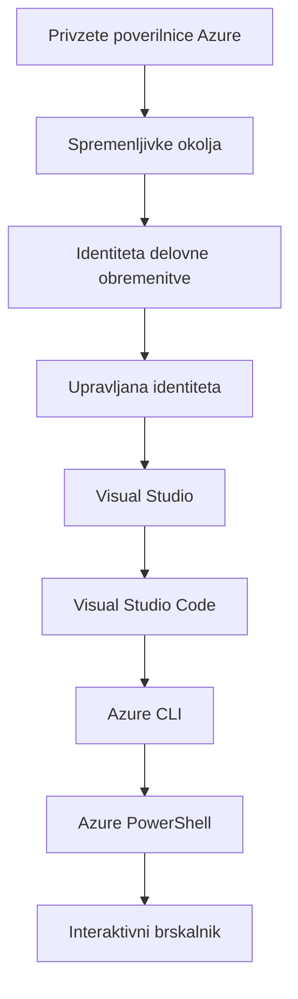

# AZD Osnove - Razumevanje Azure Developer CLI

# AZD Osnove - Osnovni pojmi in temelji

**Navigacija po poglavjih:**
- **📚 Domov tečaja**: [AZD Za začetnike](../../README.md)
- **📖 Trenutno poglavje**: Poglavje 1 - Temelji in hiter začetek
- **⬅️ Prejšnje**: [Pregled tečaja](../../README.md#-chapter-1-foundation--quick-start)
- **➡️ Naslednje**: [Namestitev in nastavitev](installation.md)
- **🚀 Naslednje poglavje**: [Poglavje 2: AI-prvi razvoj](../chapter-02-ai-development/microsoft-foundry-integration.md)

## Uvod

Ta lekcija vas seznani z Azure Developer CLI (azd), zmogljivim orodjem ukazne vrstice, ki pospeši vašo pot od lokalnega razvoja do nameščanja v Azure. Naučili se boste osnovnih konceptov, ključnih funkcij in razumeli, kako azd poenostavi nameščanje aplikacij, zasnovanih za oblak.

## Cilji učenja

Do konca te lekcije boste:
- Razumeli, kaj je Azure Developer CLI in njegov glavni namen
- Spoznali osnovne koncepte predlog, okolij in storitev
- Raziskali ključne funkcije, vključno z razvojem na osnovi predlog in Infrastrukturo kot kodo
- Razumeli strukturo in potek dela projekta azd
- Bili pripravljeni namestiti in konfigurirati azd za vaše razvojno okolje

## Izhodi učenja

Po zaključku te lekcije boste sposobni:
- Razložiti vlogo azd v sodobnih delovnih tokih razvoja v oblaku
- Prepoznati komponente strukture azd projekta
- Opisati, kako predloge, okolja in storitve delujejo skupaj
- Razumeti koristi Infrastrukture kot kode z azd
- Prepoznati različne azd ukaze in njihov namen

## Kaj je Azure Developer CLI (azd)?

Azure Developer CLI (azd) je orodje ukazne vrstice, zasnovano za pospešitev vaše poti od lokalnega razvoja do nameščanja v Azure. Poenostavi proces gradnje, nameščanja in upravljanja aplikacij, zasnovanih za oblak, na Azure.

### 🎯 Zakaj uporabljati AZD? Primer iz resničnega sveta

Primerjajmo nameščanje preproste spletne aplikacije z bazo podatkov:

#### ❌ BREZ AZD: Ročno nameščanje v Azure (30+ minut)

```bash
# Korak 1: Ustvarite skupino virov
az group create --name myapp-rg --location eastus

# Korak 2: Ustvarite načrt storitve App Service
az appservice plan create --name myapp-plan \
  --resource-group myapp-rg \
  --sku B1 --is-linux

# Korak 3: Ustvarite spletno aplikacijo
az webapp create --name myapp-web-unique123 \
  --resource-group myapp-rg \
  --plan myapp-plan \
  --runtime "NODE:18-lts"

# Korak 4: Ustvarite račun Cosmos DB (10-15 minut)
az cosmosdb create --name myapp-cosmos-unique123 \
  --resource-group myapp-rg \
  --kind MongoDB

# Korak 5: Ustvarite bazo podatkov
az cosmosdb mongodb database create \
  --account-name myapp-cosmos-unique123 \
  --resource-group myapp-rg \
  --name tododb

# Korak 6: Ustvarite zbirko
az cosmosdb mongodb collection create \
  --account-name myapp-cosmos-unique123 \
  --resource-group myapp-rg \
  --database-name tododb \
  --name todos

# Korak 7: Pridobite niz za povezavo
CONN_STR=$(az cosmosdb keys list \
  --name myapp-cosmos-unique123 \
  --resource-group myapp-rg \
  --type connection-strings \
  --query "connectionStrings[0].connectionString" -o tsv)

# Korak 8: Konfigurirajte nastavitve aplikacije
az webapp config appsettings set \
  --name myapp-web-unique123 \
  --resource-group myapp-rg \
  --settings MONGODB_URI="$CONN_STR"

# Korak 9: Omogočite beleženje
az webapp log config --name myapp-web-unique123 \
  --resource-group myapp-rg \
  --application-logging filesystem \
  --detailed-error-messages true

# Korak 10: Nastavite Application Insights
az monitor app-insights component create \
  --app myapp-insights \
  --location eastus \
  --resource-group myapp-rg

# Korak 11: Povežite App Insights s spletno aplikacijo
INSTRUMENTATION_KEY=$(az monitor app-insights component show \
  --app myapp-insights \
  --resource-group myapp-rg \
  --query "instrumentationKey" -o tsv)

az webapp config appsettings set \
  --name myapp-web-unique123 \
  --resource-group myapp-rg \
  --settings APPINSIGHTS_INSTRUMENTATIONKEY="$INSTRUMENTATION_KEY"

# Korak 12: Zgradite aplikacijo lokalno
npm install
npm run build

# Korak 13: Ustvarite paket za namestitev
zip -r app.zip . -x "*.git*" "node_modules/*"

# Korak 14: Razmestite aplikacijo
az webapp deployment source config-zip \
  --resource-group myapp-rg \
  --name myapp-web-unique123 \
  --src app.zip

# Korak 15: Počakajte in molite, da bo delovalo 🙏
# (Ni avtomatiziranega preverjanja, potrebni so ročni testi)
```

**Težave:**
- ❌ 15+ ukazov za zapomniti in izvesti v pravilnem vrstnem redu
- ❌ 30–45 minut ročnega dela
- ❌ Enostavno za narediti napake (tipkarske napake, napačni parametri)
- ❌ Nizi povezav izpostavljeni v zgodovini terminala
- ❌ Ni samodejnega povračila, če kaj ne uspe
- ❌ Težko reproducirati za člane ekipe
- ❌ Vsakič drugačno (ni reproducibilno)

#### ✅ Z AZD: Avtomatizirano nameščanje (5 ukazov, 10-15 minut)

```bash
# Korak 1: Inicializirajte iz predloge
azd init --template todo-nodejs-mongo

# Korak 2: Avtenticirajte se
azd auth login

# Korak 3: Ustvarite okolje
azd env new dev

# Korak 4: Predogled sprememb (neobvezno, vendar priporočljivo)
azd provision --preview

# Korak 5: Namestite vse
azd up

# ✨ Končano! Vse je nameščeno, konfigurirano in spremljano
```

**Koristi:**
- ✅ **5 ukazov** v primerjavi z 15+ ročnimi koraki
- ✅ **10–15 minut** celotnega časa (večinoma čakanje na Azure)
- ✅ **Brez napak** - avtomatizirano in testirano
- ✅ **Skrivnosti varno upravljane** prek Key Vault
- ✅ **Samodejno povračilo** ob napakah
- ✅ **Popolnoma reproducibilno** - vedno enak rezultat
- ✅ **Pripravljeno za ekipo** - kdorkoli lahko izvede nameščanje z enakimi ukazi
- ✅ **Infrastruktura kot koda** - Bicep predloge pod nadzorom različic
- ✅ **Vgrajeno spremljanje** - Application Insights samodejno konfiguriran

### 📊 Zmanjšanje časa in napak

| Merilo | Ročno nameščanje | Nameščanje z AZD | Izboljšava |
|:-------|:------------------|:---------------|:------------|
| **Ukazi** | 15+ | 5 | 67% manj |
| **Čas** | 30–45 min | 10–15 min | 60% hitreje |
| **Stopnja napak** | ~40% | <5% | 88% zmanjšanje |
| **Doslednost** | Nizka (ročno) | 100% (avtomatizirano) | Popolno |
| **Vključevanje ekipe** | 2–4 ure | 30 minut | 75% hitreje |
| **Čas povračila** | 30+ min (ročno) | 2 min (avtomatizirano) | 93% hitreje |

## Ključni pojmi

### Predloge
Predloge so temelj azd. Vsebujejo:
- **Koda aplikacije** - Vaša izvorna koda in odvisnosti
- **Definicije infrastrukture** - Azure viri definirani v Bicep ali Terraform
- **Konfiguracijske datoteke** - Nastavitve in spremenljivke okolja
- **Skripti za nameščanje** - Avtomatizirani postopki za nameščanje

### Oknja
Okolja predstavljajo različne cilje nameščanja:
- **Razvoj** - Za testiranje in razvoj
- **Staging** - Predprodukcijsko okolje
- **Produkcija** - Živo produkcijsko okolje

Vsako okolje vzdržuje svoje:
- Azure resource group
- Konfiguracijske nastavitve
- Stanje nameščanja

### Storitve
Storitve so gradniki vaše aplikacije:
- **Frontend** - Spletne aplikacije, SPAs
- **Backend** - API-ji, mikroservisi
- **Baza podatkov** - Rešitve za shranjevanje podatkov
- **Shranjevanje** - Shranjevanje datotek in blobov

## Ključne funkcije

### 1. Razvoj na osnovi predlog
```bash
# Prebrskaj razpoložljive predloge
azd template list

# Inicializiraj iz predloge
azd init --template <template-name>
```

### 2. Infrastruktura kot koda
- **Bicep** - Azurejev jezik za specifično domeno
- **Terraform** - Orodje za infrastrukturo v več oblakih
- **ARM Templates** - Azure Resource Manager predloge

### 3. Integrirani delovni tokovi
```bash
# Celoten potek uvajanja
azd up            # Priprava + uvajanje — brez potrebe po ročnem posredovanju pri prvi namestitvi

# 🧪 NOVO: Predogled sprememb infrastrukture pred uvedbo (VAREN)
azd provision --preview    # Simulirajte uvajanje infrastrukture, ne da bi naredili spremembe

azd provision     # Ustvari Azure vire — če posodobite infrastrukturo, uporabite to
azd deploy        # Uvedi kodo aplikacije ali jo ponovno uvedi po posodobitvi
azd down          # Počisti vire
```

#### 🛡️ Varen načrt infrastrukture s predogledom
Ukaz `azd provision --preview` je prelomnica za varna nameščanja:
- **Analiza brez izvedbe** - Pokaže, kaj bo ustvarjeno, spremenjeno ali izbrisano
- **Brez tveganja** - Dejanske spremembe v Azure okolju niso izvedene
- **Sodelovanje ekipe** - Delite rezultate predogleda pred nameščanjem
- **Ocenjevanje stroškov** - Razumite stroške virov pred zavezovanjem

```bash
# Primer poteka dela za predogled
azd provision --preview           # Oglejte si, kaj se bo spremenilo
# Preglejte izhod, pogovorite se z ekipo
azd provision                     # Uveljavite spremembe z zaupanjem
```

### 📊 Vizualno: AZD razvojni tok


**Razlaga poteka dela:**
1. **Init** - Začnite s predlogo ali novim projektom
2. **Auth** - Avtenticirajte se z Azure
3. **Environment** - Ustvarite izolirano okolje za nameščanje
4. **Preview** - 🆕 Vedno najprej predogled sprememb infrastrukture (varna praksa)
5. **Provision** - Ustvarite/posodobite Azure vire
6. **Deploy** - Potisnite kodo aplikacije
7. **Monitor** - Spremljajte delovanje aplikacije
8. **Iterate** - Naredite spremembe in ponovno namestite kodo
9. **Cleanup** - Odstranite vire, ko končate

### 4. Upravljanje okolij
```bash
# Ustvarjanje in upravljanje okolij
azd env new <environment-name>
azd env select <environment-name>
azd env list
```

## 📁 Struktura projekta

Tipična struktura azd projekta:
```
my-app/
├── .azd/                    # azd configuration
│   └── config.json
├── .azure/                  # Azure deployment artifacts
├── .devcontainer/          # Development container config
├── .github/workflows/      # GitHub Actions
├── .vscode/               # VS Code settings
├── infra/                 # Infrastructure code
│   ├── main.bicep        # Main infrastructure template
│   ├── main.parameters.json
│   └── modules/          # Reusable modules
├── src/                  # Application source code
│   ├── api/             # Backend services
│   └── web/             # Frontend application
├── azure.yaml           # azd project configuration
└── README.md
```

## 🔧 Konfiguracijske datoteke

### azure.yaml
Glavna konfiguracijska datoteka projekta:
```yaml
name: my-awesome-app
metadata:
  template: my-template@1.0.0

services:
  web:
    project: ./src/web
    language: js
    host: appservice
  api:
    project: ./src/api
    language: js
    host: appservice

hooks:
  preprovision:
    shell: pwsh
    run: echo "Preparing to provision..."
```

### .azure/config.json
Konfiguracija specifična za okolje:
```json
{
  "version": 1,
  "defaultEnvironment": "dev",
  "environments": {
    "dev": {
      "subscriptionId": "your-subscription-id",
      "location": "eastus"
    }
  }
}
```

## 🎪 Pogosti delovni tokovi z vajami

> **💡 Nasvet za učenje:** Sledite tem vajam po vrsti, da postopoma gradite svoje AZD veščine.

### 🎯 Vaja 1: Inicializirajte svoj prvi projekt

**Cilj:** Ustvarite AZD projekt in raziščite njegovo strukturo

**Koraki:**
```bash
# Uporabite preverjeno predlogo
azd init --template todo-nodejs-mongo

# Raziščite ustvarjene datoteke
ls -la  # Prikažite vse datoteke, vključno s skritimi

# Ustvarjene ključne datoteke:
# - azure.yaml (glavna konfiguracija)
# - infra/ (koda infrastrukture)
# - src/ (koda aplikacije)
```

**✅ Uspeh:** Imate datoteko azure.yaml ter imenika infra/ in src/

---

### 🎯 Vaja 2: Nameščanje v Azure

**Cilj:** Dokončajte celovito nameščanje

**Koraki:**
```bash
# 1. Prijavite se
az login && azd auth login

# 2. Ustvarite okolje
azd env new dev
azd env set AZURE_LOCATION eastus

# 3. Predogled sprememb (PRIPOROČENO)
azd provision --preview

# 4. Razmestite vse
azd up

# 5. Preverite namestitev
azd show    # Ogled URL-ja vaše aplikacije
```

**Pričakovani čas:** 10–15 minut  
**✅ Uspeh:** URL aplikacije se odpre v brskalniku

---

### 🎯 Vaja 3: Več okolij

**Cilj:** Namestite v dev in staging

**Koraki:**
```bash
# Že imate dev, ustvarite staging
azd env new staging
azd env set AZURE_LOCATION westus2
azd up

# Preklopite med njima
azd env list
azd env select dev
```

**✅ Uspeh:** Dve ločeni resource group v Azure portalu

---

### 🛡️ Čista plošča: `azd down --force --purge`

Ko potrebujete popolno ponastavitev:

```bash
azd down --force --purge
```

**Kaj naredi:**
- `--force`: Brez potrditvenih pozivov
- `--purge`: Izbriše vse lokalno stanje in Azure vire

**Uporabite, ko:**
- Nameščanje se je ustavilo sredi procesa
- Prehajate med projekti
- Potrebujete svež začetek

---

## 🎪 Referenca prvotnega poteka dela

### Začetek novega projekta
```bash
# Metoda 1: Uporabi obstoječo predlogo
azd init --template todo-nodejs-mongo

# Metoda 2: Začni od začetka
azd init

# Metoda 3: Uporabi trenutno mapo
azd init .
```

### Cikel razvoja
```bash
# Nastavite razvojno okolje
azd auth login
azd env new dev
azd env select dev

# Razmestite vse
azd up

# Naredite spremembe in ponovno razmestite
azd deploy

# Po končanem počistite
azd down --force --purge # Ukaz v Azure Developer CLI deluje kot **popolna ponastavitev** vašega okolja — še posebej uporaben, ko odpravljate težave pri neuspelih razmestitvah, odstranjujete zapuščene vire ali pripravljate novo razmestitev.
```

## Razumevanje `azd down --force --purge`
Ukaz `azd down --force --purge` je zmogljiv način za popolno razgradnjo vašega azd okolja in vseh povezanih virov. Tukaj je razčlenitev, kaj posamezna zastavica počne:
```
--force
```
- Preskoči pozive za potrditev.
- Uporabno za avtomatizacijo ali skriptiranje, kjer ročni vnos ni mogoč.
- Zagotavlja, da se razgradnja nadaljuje brez prekinitev, tudi če CLI zazna neskladja.

```
--purge
```
Izbriše **vse povezane metapodatke**, vključno z:
Stanje okolja
Lokalna mapa `.azure`
Predpomnjene informacije o nameščanju
Onemogoči, da si azd "zapomni" prejšnja nameščanja, kar lahko povzroči težave, kot so neujemajoče se resource group ali zastarele reference registra.


### Zakaj uporabiti obe?
Ko naletite na težave pri `azd up` zaradi zaostalega stanja ali delnih nameščanj, ta kombinacija zagotovi **čisto ploščo**.

Še posebej koristno po ročnem brisanju virov v Azure portalu ali pri menjavi predlog, okolij ali pravil poimenovanja resource group.

### Upravljanje več okolij
```bash
# Ustvari pripravljalno (staging) okolje
azd env new staging
azd env select staging
azd up

# Preklopi nazaj na razvojno (dev) okolje
azd env select dev

# Primerjaj okolja
azd env list
```

## 🔐 Avtentikacija in poverilnice

Razumevanje avtentikacije je ključno za uspešna azd nameščanja. Azure uporablja več metod avtentikacije, azd pa izkorišča isti verigo poverilnic kot druga Azure orodja.

### Avtentikacija Azure CLI (`az login`)

Pred uporabo azd se morate avtenticirati z Azure. Najpogostejša metoda je uporaba Azure CLI:

```bash
# Interaktivna prijava (odpre brskalnik)
az login

# Prijava z določenim najemnikom
az login --tenant <tenant-id>

# Prijava z računom storitve
az login --service-principal -u <app-id> -p <password> --tenant <tenant-id>

# Preveri trenutno stanje prijave
az account show

# Prikaži razpoložljive naročnine
az account list --output table

# Nastavi privzeto naročnino
az account set --subscription <subscription-id>
```

### Potek avtentikacije
1. **Interaktivna prijava**: Odpre vaš privzeti brskalnik za avtentikacijo
2. **Device Code Flow**: Za okolja brez dostopa do brskalnika
3. **Service Principal**: Za avtomatizacijo in CI/CD scenarije
4. **Managed Identity**: Za aplikacije, gostovane v Azure

### DefaultAzureCredential veriga

`DefaultAzureCredential` je tip poverilnice, ki zagotavlja poenostavljeno izkušnjo avtentikacije z avtomatskim poizkusom več virov poverilnic v določenem vrstnem redu:

#### Vrstni red verige poverilnic

#### 1. Okoljske spremenljivke
```bash
# Nastavi spremenljivke okolja za glavni račun storitve
export AZURE_CLIENT_ID="<app-id>"
export AZURE_CLIENT_SECRET="<password>"
export AZURE_TENANT_ID="<tenant-id>"
```

#### 2. Workload Identity (Kubernetes/GitHub Actions)
Samodejno uporabljen v:
- Azure Kubernetes Service (AKS) z Workload Identity
- GitHub Actions z OIDC federacijo
- Druge scenarije federirane identitete

#### 3. Managed Identity
Za Azure vire, kot so:
- Virtual Machines
- App Service
- Azure Functions
- Container Instances

```bash
# Preveri, ali teče na Azure viru z upravljano identiteto
az account show --query "user.type" --output tsv
# Vrne: "servicePrincipal", če uporablja upravljano identiteto
```

#### 4. Integracija z orodji za razvoj
- **Visual Studio**: Samodejno uporablja prijavljen račun
- **VS Code**: Uporablja poverilnice razširitve Azure Account
- **Azure CLI**: Uporablja poverilnice iz `az login` (najpogosteje za lokalni razvoj)

### Nastavitev avtentikacije za AZD

```bash
# Metoda 1: Uporabite Azure CLI (priporočeno za razvoj)
az login
azd auth login  # Uporablja obstoječe poverilnice Azure CLI

# Metoda 2: Neposredna avtentikacija z azd
azd auth login --use-device-code  # Za okolja brez grafičnega vmesnika

# Metoda 3: Preverite stanje prijave
azd auth login --check-status

# Metoda 4: Odjava in ponovna prijava
azd auth logout
azd auth login
```

### Najboljše prakse avtentikacije

#### Za lokalni razvoj
```bash
# 1. Prijavite se z Azure CLI
az login

# 2. Preverite pravilno naročnino
az account show
az account set --subscription "Your Subscription Name"

# 3. Uporabite azd z obstoječimi poverilnicami
azd auth login
```

#### Za CI/CD pipeline-e
```yaml
# GitHub Actions example
- name: Azure Login
  uses: azure/login@v1
  with:
    creds: ${{ secrets.AZURE_CREDENTIALS }}

- name: Deploy with azd
  run: |
    azd auth login --client-id ${{ secrets.AZURE_CLIENT_ID }} \
                    --client-secret ${{ secrets.AZURE_CLIENT_SECRET }} \
                    --tenant-id ${{ secrets.AZURE_TENANT_ID }}
    azd up --no-prompt
```

#### Za produkcijska okolja
- Uporabite **Managed Identity**, ko tečeta na Azure virih
- Uporabite **Service Principal** za avtomatizacijske scenarije
- Izogibajte se shranjevanju poverilnic v kodi ali konfiguracijskih datotekah
- Uporabite **Azure Key Vault** za občutljive konfiguracije

### Pogoste težave z avtentikacijo in rešitve

#### Težava: "No subscription found"
```bash
# Rešitev: Nastavite privzeto naročnino
az account list --output table
az account set --subscription "<subscription-id>"
azd env set AZURE_SUBSCRIPTION_ID "<subscription-id>"
```

#### Težava: "Insufficient permissions"
```bash
# Rešitev: Preverite in dodelite zahtevane vloge
az role assignment list --assignee $(az account show --query user.name --output tsv)

# Najpogosteje zahtevane vloge:
# - Contributor (za upravljanje virov)
# - User Access Administrator (za dodeljevanje vlog)
```

#### Težava: "Token expired"
```bash
# Rešitev: Ponovno se prijavite
az logout
az login
azd auth logout
azd auth login
```

### Avtentikacija v različnih scenarijih

#### Lokalni razvoj
```bash
# Račun za osebni razvoj
az login
azd auth login
```

#### Delo v ekipi
```bash
# Uporabite določenega najemnika za organizacijo
az login --tenant contoso.onmicrosoft.com
azd auth login
```

#### Več najemniški scenariji
```bash
# Preklapljanje med najemniki
az login --tenant tenant1.onmicrosoft.com
# Namesti v najemnika 1
azd up

az login --tenant tenant2.onmicrosoft.com  
# Namesti v najemnika 2
azd up
```

### Varnostne premisleke

1. **Shranjevanje poverilnic**: Nikoli ne shranjujte poverilnic v izvorni kodi
2. **Omejitev obsega**: Uporabljajte načelo najmanjših privilegijev za service principale
3. **Rotacija žetonov**: Redno menjajte skrivnosti service principalov
4. **Sledenje**: Spremljajte aktivnosti avtentikacije in nameščanja
5. **Mrežna varnost**: Kjer je mogoče, uporabljajte zasebne končne točke

### Odpravljanje težav z avtentikacijo

```bash
# Odpravljanje težav z overjanjem
azd auth login --check-status
az account show
az account get-access-token

# Pogosti diagnostični ukazi
whoami                          # Trenutni uporabniški kontekst
az ad signed-in-user show      # Podrobnosti uporabnika Azure AD
az group list                  # Preizkus dostopa do vira
```

## Razumevanje `azd down --force --purge`

### Odkritje
```bash
azd template list              # Brskaj po predlogah
azd template show <template>   # Podrobnosti predloge
azd init --help               # Možnosti inicializacije
```

### Upravljanje projektov
```bash
azd show                     # Pregled projekta
azd env show                 # Trenutno okolje
azd config list             # Nastavitve konfiguracije
```

### Spremljanje
```bash
azd monitor                  # Odpri Azure portal za spremljanje
azd monitor --logs           # Ogled dnevnikov aplikacije
azd monitor --live           # Ogled meritev v živo
azd pipeline config          # Nastavi CI/CD
```

## Najboljše prakse

### 1. Uporabljajte smiselna imena
```bash
# Dobro
azd env new production-east
azd init --template web-app-secure

# Izogibaj se
azd env new env1
azd init --template template1
```

### 2. Izkoristite predloge
- Začnite z obstoječimi predlogami
- Prilagodite za svoje potrebe
- Ustvarite ponovno uporabne predloge za vašo organizacijo

### 3. Izolacija okolij
- Uporabljajte ločena okolja za dev/staging/prod
- Nikoli ne nameščajte neposredno v produkcijo iz lokalnega stroja
- Za produkcijska nameščanja uporabljajte CI/CD pipeline-e

### 4. Upravljanje konfiguracije
- Uporabljajte okoljske spremenljivke za občutljive podatke
- Hranite konfiguracijo v sistemu za nadzor različic
- Dokumentirajte nastavitve specifične za okolje

## Napredek učenja

### Začetnik (1–2. teden)
1. Namestite azd in se avtenticirajte
2. Namestite preprosto predlogo
3. Razumite strukturo projekta
4. Naučite se osnovnih ukazov (up, down, deploy)

### Srednji (3–4. teden)
1. Prilagodite predloge
2. Upravljajte več okolij
3. Razumite infrastrukturo kot kodo
4. Nastavite CI/CD pipeline-e

### Napredno (5+ teden)
1. Ustvarite lastne predloge
2. Napredni infrastrukturni vzorci
3. Nameščanja v več regijah
4. Konfiguracije primerno za podjetja

## Naslednji koraki

**📖 Nadaljujte učenje poglavja 1:**
- [Namestitev in nastavitev](installation.md) - Namestite in konfigurirajte azd
- [Vaš prvi projekt](first-project.md) - Popoln praktičen vodič
- [Vodnik za konfiguracijo](configuration.md) - Napredne možnosti konfiguracije

**🎯 Pripravljeni na naslednje poglavje?**
- [Poglavje 2: AI-prvi razvoj](../chapter-02-ai-development/microsoft-foundry-integration.md) - Začnite razvijati AI aplikacije

## Dodatni viri

- [Pregled Azure Developer CLI](https://learn.microsoft.com/en-us/azure/developer/azure-developer-cli/)
- [Galerija predlogov](https://azure.github.io/awesome-azd/)
- [Vzorci skupnosti](https://github.com/Azure-Samples)

---

## 🙋 Pogosto zastavljena vprašanja

### Splošna vprašanja

**Q: Kakšna je razlika med AZD in Azure CLI?**

A: Azure CLI (`az`) je za upravljanje posameznih Azure virov. AZD (`azd`) je za upravljanje celotnih aplikacij:

```bash
# Azure CLI - Upravljanje virov na nizki ravni
az webapp create --name myapp --resource-group rg
az sql server create --name myserver --resource-group rg
# ...potrebnih je še veliko ukazov

# AZD - upravljanje na ravni aplikacije
azd up  # Razporedi celotno aplikacijo z vsemi viri
```

**Razmislite o tem tako:**
- `az` = Delovanje z posameznimi Lego kockami
- `azd` = Delo z celimi Lego kompleti

---

**Q: Ali moram poznati Bicep ali Terraform za uporabo AZD?**

A: Ne! Začnite s predlogami:
```bash
# Uporabite obstoječo predlogo - znanje IaC ni potrebno
azd init --template todo-nodejs-mongo
azd up
```

Lahko se Bicep naučite kasneje za prilagoditev infrastrukture. Predloge zagotavljajo delujoče primere za učenje.

---

**Q: Koliko stane izvajanje AZD predlog?**

A: Stroški se razlikujejo glede na predlogo. Večina razvojnih predlog stane 50–150 USD na mesec:

```bash
# Predogled stroškov pred nameščanjem
azd provision --preview

# Vedno počistite, kadar ne uporabljate
azd down --force --purge  # Odstrani vse vire
```

**Nasvet:** Uporabite brezplačne ravni, kjer so na voljo:
- App Service: F1 (brezplačna) raven
- Azure OpenAI: 50.000 tokenov/mesec brezplačno
- Cosmos DB: 1000 RU/s brezplačna raven

---

**Q: Lahko uporabim AZD z obstoječimi Azure viri?**

A: Da, vendar je lažje začeti znova. AZD najbolje deluje, ko upravlja celoten življenjski cikel. Za obstoječe vire:

```bash
# Možnost 1: Uvozi obstoječe vire (napredno)
azd init
# Nato prilagodite infra/, da se sklicuje na obstoječe vire

# Možnost 2: Začnite znova (priporočeno)
azd init --template matching-your-stack
azd up  # Ustvari novo okolje
```

---

**Q: Kako delim svoj projekt s sodelavci?**

A: Zavezite (commit) AZD projekt v Git (vendar NE mapo .azure):

```bash
# Že privzeto v .gitignore
.azure/        # Vsebuje skrivnosti in podatke o okolju
*.env          # Okoljske spremenljivke

# Člani ekipe takrat:
git clone <your-repo>
azd auth login
azd env new <their-name>-dev
azd up
```

Vsi dobijo enako infrastrukturo iz istih predlog.

---

### Vprašanja pri odpravljanju napak

**Q: "azd up" je med izvajanjem spodletel. Kaj naj storim?**

A: Preverite napako, jo odpravite in poskusite znova:

```bash
# Prikaži podrobne dnevnike
azd show

# Pogoste rešitve:

# 1. Če je kvota presežena:
azd env set AZURE_LOCATION "westus2"  # Poskusi drugo regijo

# 2. Če pride do konflikta imena vira:
azd down --force --purge  # Počisti okolje
azd up  # Poskusi znova

# 3. Če je overitev potekla:
az login
azd auth login
azd up
```

**Najpogostejša težava:** Napačno izbrana Azure naročnina
```bash
az account list --output table
az account set --subscription "<correct-subscription>"
```

---

**Q: Kako razmestim le spremembe kode brez ponovnega zagotavljanja infrastrukture?**

A: Uporabite `azd deploy` namesto `azd up`:

```bash
azd up          # Prvič: priprava infrastrukture + uvajanje (počasi)

# Naredite spremembe v kodi...

azd deploy      # Naslednjič: samo uvajanje (hitro)
```

Primerjava hitrosti:
- `azd up`: 10–15 minut (zagotavlja infrastrukturo)
- `azd deploy`: 2–5 minut (samo koda)

---

**Q: Ali lahko prilagodim predloge infrastrukture?**

A: Da! Uredite Bicep datoteke v `infra/`:

```bash
# Po azd init
cd infra/
code main.bicep  # Uredi v VS Code

# Predogled sprememb
azd provision --preview

# Uporabi spremembe
azd provision
```

**Nasvet:** Začnite z majhnimi spremembami - najprej spremenite SKU-je:
```bicep
// infra/main.bicep
sku: {
  name: 'B1'  // Change to 'P1V2' for production
}
```

---

**Q: Kako izbrišem vse, kar je AZD ustvaril?**

A: En ukaz odstrani vse vire:

```bash
azd down --force --purge

# To izbriše:
# - Vse Azure vire
# - Skupina virov
# - Stanje lokalnega okolja
# - Predpomnjeni podatki o razmestitvi
```

**Vedno zaženite to, ko:**
- Ko končate s testiranjem predloge
- Prehod na drug projekt
- Želite začeti znova

**Prihranek stroškov:** Brisanje neuporabljenih virov = 0 USD stroškov

---

**Q: Kaj, če sem po pomoti izbrisal vire v Azure Portal?**

A: Stanje AZD se lahko ne ujema. Pristop 'čistega začetka':

```bash
# 1. Odstranite lokalno stanje
azd down --force --purge

# 2. Začnite znova
azd up

# Alternativa: Naj AZD zazna in popravi
azd provision  # Ustvaril bo manjkajoče vire
```

---

### Napredna vprašanja

**Q: Ali lahko uporabim AZD v CI/CD cevovodih?**

A: Da! Primer GitHub Actions:

```yaml
# .github/workflows/deploy.yml
name: Deploy with AZD

on:
  push:
    branches: [main]

jobs:
  deploy:
    runs-on: ubuntu-latest
    steps:
      - uses: actions/checkout@v2
      
      - name: Install azd
        run: curl -fsSL https://aka.ms/install-azd.sh | bash
      
      - name: Azure Login
        run: |
          azd auth login \
            --client-id ${{ secrets.AZURE_CLIENT_ID }} \
            --client-secret ${{ secrets.AZURE_CLIENT_SECRET }} \
            --tenant-id ${{ secrets.AZURE_TENANT_ID }}
      
      - name: Deploy
        run: azd up --no-prompt
```

---

**Q: Kako ravnam s skrivnostmi in občutljivimi podatki?**

A: AZD se samodejno integrira z Azure Key Vault:

```bash
# Skrivnosti so shranjene v Key Vaultu, ne v kodi
azd env set DATABASE_PASSWORD "$(openssl rand -base64 32)"

# AZD samodejno:
# 1. Ustvari Key Vault
# 2. Shrani skrivnost
# 3. Dodeli aplikaciji dostop prek upravljane identitete
# 4. Vključi med izvajanjem
```

**Nikoli ne zavežite:**
- `.azure/` mapa (vsebuje podatke o okolju)
- `.env` datoteke (lokalne skrivnosti)
- Povezovalne nize

---

**Q: Ali lahko razmestim v več regij?**

A: Da, ustvarite okolje za vsako regijo:

```bash
# Okolje vzhodnih ZDA
azd env new prod-eastus
azd env set AZURE_LOCATION eastus
azd up

# Okolje zahodne Evrope
azd env new prod-westeurope
azd env set AZURE_LOCATION westeurope
azd up

# Vsako okolje je neodvisno.
azd env list
```

Za prave aplikacije v več regijah prilagodite Bicep predloge, da razmestite v več regij hkrati.

---

**Q: Kje lahko dobim pomoč, če se zataknem?**

1. **Dokumentacija AZD:** https://learn.microsoft.com/azure/developer/azure-developer-cli/
2. **GitHub Issues:** https://github.com/Azure/azure-dev/issues
3. **Discord:** [Azure Discord](https://discord.gg/microsoft-azure) - kanal #azure-developer-cli
4. **Stack Overflow:** Oznaka `azure-developer-cli`
5. **Ta tečaj:** [Vodnik za odpravljanje težav](../chapter-07-troubleshooting/common-issues.md)

**Nasvet:** Preden vprašate, zaženite:
```bash
azd show       # Prikaže trenutno stanje
azd version    # Prikaže vašo različico
```
Vključite te podatke v svoje vprašanje za hitrejšo pomoč.

---

## 🎓 Kaj sledi?

Zdaj razumete osnove AZD. Izberite svojo pot:

### 🎯 Za začetnike:
1. **Naprej:** [Namestitev in nastavitev](installation.md) - Namestite AZD na svoj računalnik
2. **Nato:** [Vaš prvi projekt](first-project.md) - Razmestite svojo prvo aplikacijo
3. **Vadba:** Dokončajte vseh 3 vaj v tej lekciji

### 🚀 Za AI razvijalce:
1. **Preskočite na:** [Poglavje 2: AI-prvi razvoj](../chapter-02-ai-development/microsoft-foundry-integration.md)
2. **Razmestite:** Začnite z `azd init --template get-started-with-ai-chat`
3. **Učite se:** Gradite med razmestitvijo

### 🏗️ Za izkušene razvijalce:
1. **Preglejte:** [Vodnik za konfiguracijo](configuration.md) - Napredne nastavitve
2. **Raziščite:** [Infrastruktura kot koda](../chapter-04-infrastructure/provisioning.md) - Poglobljen vpogled v Bicep
3. **Ustvarite:** Ustvarite prilagojene predloge za svoj sklad

---

**Navigacija poglavij:**
- **📚 Dom tečaja**: [AZD za začetnike](../../README.md)
- **📖 Trenutno poglavje**: Poglavje 1 - Osnove in hiter začetek  
- **⬅️ Prejšnje**: [Pregled tečaja](../../README.md#-chapter-1-foundation--quick-start)
- **➡️ Naslednje**: [Namestitev in nastavitev](installation.md)
- **🚀 Naslednje poglavje**: [Poglavje 2: AI-prvi razvoj](../chapter-02-ai-development/microsoft-foundry-integration.md)

---

<!-- CO-OP TRANSLATOR DISCLAIMER START -->
Izjava o omejitvi odgovornosti:

Ta dokument je bil preveden z uporabo storitve za prevajanje z umetno inteligenco Co-op Translator (https://github.com/Azure/co-op-translator). Čeprav si prizadevamo za natančnost, upoštevajte, da lahko avtomatizirani prevodi vsebujejo napake ali netočnosti. Izvirni dokument v izvirnem jeziku naj se šteje za avtoritativni vir. Za kritične informacije priporočamo strokovni prevod, opravljen s strani človeškega prevajalca. Ne odgovarjamo za morebitne nesporazume ali napačne razlage, ki izhajajo iz uporabe tega prevoda.
<!-- CO-OP TRANSLATOR DISCLAIMER END -->