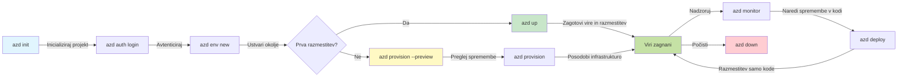
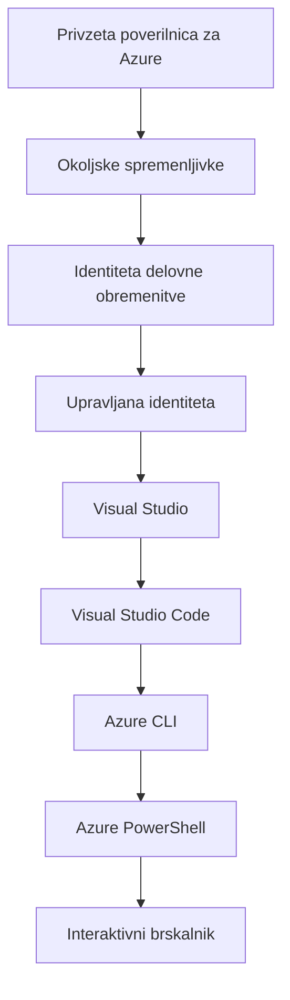

# AZD Basics - Understanding Azure Developer CLI

# AZD Basics - Core Concepts and Fundamentals

**Chapter Navigation:**
- **📚 Course Home**: [AZD For Beginners](../../README.md)
- **📖 Current Chapter**: Chapter 1 - Foundation & Quick Start
- **⬅️ Previous**: [Course Overview](../../README.md#-chapter-1-foundation--quick-start)
- **➡️ Next**: [Installation & Setup](installation.md)
- **🚀 Next Chapter**: [Chapter 2: AI-First Development](../chapter-02-ai-development/microsoft-foundry-integration.md)

## Introduction

This lesson introduces you to Azure Developer CLI (azd), a powerful command-line tool that accelerates your journey from local development to Azure deployment. You'll learn the fundamental concepts, core features, and understand how azd simplifies cloud-native application deployment.

## Learning Goals

By the end of this lesson, you will:
- Understand what Azure Developer CLI is and its primary purpose
- Learn the core concepts of templates, environments, and services
- Explore key features including template-driven development and Infrastructure as Code
- Understand the azd project structure and workflow
- Be prepared to install and configure azd for your development environment

## Learning Outcomes

After completing this lesson, you will be able to:
- Explain the role of azd in modern cloud development workflows
- Identify the components of an azd project structure
- Describe how templates, environments, and services work together
- Understand the benefits of Infrastructure as Code with azd
- Recognize different azd commands and their purposes

## What is Azure Developer CLI (azd)?

Azure Developer CLI (azd) is a command-line tool designed to accelerate your journey from local development to Azure deployment. It simplifies the process of building, deploying, and managing cloud-native applications on Azure.

### What Can You Deploy with azd?

azd supports a wide range of workloads—and the list keeps growing. Today, you can use azd to deploy:

| Workload Type | Examples | Same Workflow? |
|---------------|----------|----------------|
| **Traditional applications** | Web apps, REST APIs, static sites | ✅ `azd up` |
| **Services and microservices** | Container Apps, Function Apps, multi-service backends | ✅ `azd up` |
| **AI-powered applications** | Chat apps with Microsoft Foundry Models, RAG solutions with AI Search | ✅ `azd up` |
| **Intelligent agents** | Foundry-hosted agents, multi-agent orchestrations | ✅ `azd up` |

The key insight is that **the azd lifecycle stays the same regardless of what you're deploying**. You initialize a project, provision infrastructure, deploy your code, monitor your app, and clean up—whether it's a simple website or a sophisticated AI agent.

This continuity is by design. azd treats AI capabilities as another kind of service your application can use, not as something fundamentally different. A chat endpoint backed by Microsoft Foundry Models is, from azd's perspective, just another service to configure and deploy.

### 🎯 Why Use AZD? A Real-World Comparison

Let's compare deploying a simple web app with database:

#### ❌ WITHOUT AZD: Manual Azure Deployment (30+ minutes)

```bash
# Ustvarite skupino virov
az group create --name myapp-rg --location eastus

# Ustvarite načrt storitve App Service
az appservice plan create --name myapp-plan \
  --resource-group myapp-rg \
  --sku B1 --is-linux

# Ustvarite spletno aplikacijo
az webapp create --name myapp-web-unique123 \
  --resource-group myapp-rg \
  --plan myapp-plan \
  --runtime "NODE:18-lts"

# Ustvarite račun Cosmos DB (10-15 minut)
az cosmosdb create --name myapp-cosmos-unique123 \
  --resource-group myapp-rg \
  --kind MongoDB

# Ustvarite bazo podatkov
az cosmosdb mongodb database create \
  --account-name myapp-cosmos-unique123 \
  --resource-group myapp-rg \
  --name tododb

# Ustvarite zbirko
az cosmosdb mongodb collection create \
  --account-name myapp-cosmos-unique123 \
  --resource-group myapp-rg \
  --database-name tododb \
  --name todos

# Pridobite niz povezave
CONN_STR=$(az cosmosdb keys list \
  --name myapp-cosmos-unique123 \
  --resource-group myapp-rg \
  --type connection-strings \
  --query "connectionStrings[0].connectionString" -o tsv)

# Konfigurirajte nastavitve aplikacije
az webapp config appsettings set \
  --name myapp-web-unique123 \
  --resource-group myapp-rg \
  --settings MONGODB_URI="$CONN_STR"

# Omogočite beleženje
az webapp log config --name myapp-web-unique123 \
  --resource-group myapp-rg \
  --application-logging filesystem \
  --detailed-error-messages true

# Nastavite Application Insights
az monitor app-insights component create \
  --app myapp-insights \
  --location eastus \
  --resource-group myapp-rg

# Povežite App Insights s spletno aplikacijo
INSTRUMENTATION_KEY=$(az monitor app-insights component show \
  --app myapp-insights \
  --resource-group myapp-rg \
  --query "instrumentationKey" -o tsv)

az webapp config appsettings set \
  --name myapp-web-unique123 \
  --resource-group myapp-rg \
  --settings APPINSIGHTS_INSTRUMENTATIONKEY="$INSTRUMENTATION_KEY"

# Zgradite aplikacijo lokalno
npm install
npm run build

# Ustvarite paket za razmestitev
zip -r app.zip . -x "*.git*" "node_modules/*"

# Razmestite aplikacijo
az webapp deployment source config-zip \
  --resource-group myapp-rg \
  --name myapp-web-unique123 \
  --src app.zip

# Počakajte in upajte, da deluje 🙏
# (Brez avtomatske validacije, potrebno ročno testiranje)
```

**Problems:**
- ❌ 15+ commands to remember and execute in order
- ❌ 30-45 minutes of manual work
- ❌ Easy to make mistakes (typos, wrong parameters)
- ❌ Connection strings exposed in terminal history
- ❌ No automated rollback if something fails
- ❌ Hard to replicate for team members
- ❌ Different every time (not reproducible)

#### ✅ WITH AZD: Automated Deployment (5 commands, 10-15 minutes)

```bash
# Korak 1: Inicializiraj iz predloge
azd init --template todo-nodejs-mongo

# Korak 2: Overi identiteto
azd auth login

# Korak 3: Ustvari okolje
azd env new dev

# Korak 4: Predogled sprememb (neobvezno, vendar priporočljivo)
azd provision --preview

# Korak 5: Namesti vse
azd up

# ✨ Končano! Vse je nameščeno, konfigurirano in nadzorovano
```

**Benefits:**
- ✅ **5 commands** vs. 15+ manual steps
- ✅ **10-15 minutes** total time (mostly waiting for Azure)
- ✅ **Fewer manual mistakes** - consistent, template-driven workflow
- ✅ **Secure secret handling** - many templates use Azure-managed secret storage
- ✅ **Repeatable deployments** - same workflow every time
- ✅ **Fully reproducible** - same result every time
- ✅ **Team-ready** - anyone can deploy with same commands
- ✅ **Infrastructure as Code** - version controlled Bicep templates
- ✅ **Built-in monitoring** - Application Insights configured automatically

### 📊 Time & Error Reduction

| Metric | Manual Deployment | AZD Deployment | Improvement |
|:-------|:------------------|:---------------|:------------|
| **Commands** | 15+ | 5 | 67% fewer |
| **Time** | 30-45 min | 10-15 min | 60% faster |
| **Error Rate** | ~40% | <5% | 88% reduction |
| **Consistency** | Low (manual) | 100% (automated) | Perfect |
| **Team Onboarding** | 2-4 hours | 30 minutes | 75% faster |
| **Rollback Time** | 30+ min (manual) | 2 min (automated) | 93% faster |

## Core Concepts

### Templates
Templates are the foundation of azd. They contain:
- **Application code** - Your source code and dependencies
- **Infrastructure definitions** - Azure resources defined in Bicep or Terraform
- **Configuration files** - Settings and environment variables
- **Deployment scripts** - Automated deployment workflows

### Environments
Environments represent different deployment targets:
- **Development** - For testing and development
- **Staging** - Pre-production environment
- **Production** - Live production environment

Each environment maintains its own:
- Azure resource group
- Configuration settings
- Deployment state

### Services
Services are the building blocks of your application:
- **Frontend** - Web applications, SPAs
- **Backend** - APIs, microservices
- **Database** - Data storage solutions
- **Storage** - File and blob storage

## Key Features

### 1. Template-Driven Development
```bash
# Brskaj po razpoložljivih predlogah
azd template list

# Inicializiraj iz predloge
azd init --template <template-name>
```

### 2. Infrastructure as Code
- **Bicep** - Azure's domain-specific language
- **Terraform** - Multi-cloud infrastructure tool
- **ARM Templates** - Azure Resource Manager templates

### 3. Integrated Workflows
```bash
# Celoten potek uvajanja
azd up            # Zagotovitev in uvajanje, brez ročnega posega za prvo nastavitev

# 🧪 NOVO: Predogled sprememb infrastrukture pred uvajanjem (VARNO)
azd provision --preview    # Simulirajte uvajanje infrastrukture brez sprememb

azd provision     # Ustvarite Azure vire; če posodobite infrastrukturo, uporabite to
azd deploy        # Namestite kodo aplikacije ali jo ponovno namestite po posodobitvi
azd down          # Počistite vire
```

#### 🛡️ Safe Infrastructure Planning with Preview
The `azd provision --preview` command is a game-changer for safe deployments:
- **Dry-run analysis** - Shows what will be created, modified, or deleted
- **Zero risk** - No actual changes are made to your Azure environment
- **Team collaboration** - Share preview results before deployment
- **Cost estimation** - Understand resource costs before commitment

```bash
# Primer delovnega toka za predogled
azd provision --preview           # Oglejte si, kaj se bo spremenilo
# Preglejte rezultat, se posvetujte z ekipo
azd provision                     # Vpeljite spremembe z zaupanjem
```

### 📊 Visual: AZD Development Workflow


**Workflow Explanation:**
1. **Init** - Start with template or new project
2. **Auth** - Authenticate with Azure
3. **Environment** - Create isolated deployment environment
4. **Preview** - 🆕 Always preview infrastructure changes first (safe practice)
5. **Provision** - Create/update Azure resources
6. **Deploy** - Push your application code
7. **Monitor** - Observe application performance
8. **Iterate** - Make changes and redeploy code
9. **Cleanup** - Remove resources when done

### 4. Environment Management
```bash
# Ustvarjanje in upravljanje okolij
azd env new <environment-name>
azd env select <environment-name>
azd env list
```

### 5. Extensions and AI Commands

azd uses an extension system to add capabilities beyond the core CLI. This is especially useful for AI workloads:

```bash
# Prikaži razpoložljive razširitve
azd extension list

# Namesti razširitev Foundry Agents
azd extension install azure.ai.agents

# Inicializiraj projekt AI agenta iz manifesta
azd ai agent init -m agent-manifest.yaml

# Zaženi MCP strežnik za razvoj, podprt z AI (Alfa)
azd mcp start
```

> Extensions are covered in detail in [Chapter 2: AI-First Development](../chapter-02-ai-development/agents.md) and the [AZD AI CLI Commands](../chapter-08-production/production-ai-practices.md#azd-ai-cli-commands-and-extensions) reference.

## 📁 Project Structure

A typical azd project structure:
```
my-app/
├── .azd/                    # azd configuration
│   └── config.json
├── .azure/                  # Azure deployment artifacts
├── .devcontainer/          # Development container config
├── .github/workflows/      # GitHub Actions
├── .vscode/               # VS Code settings
├── infra/                 # Infrastructure code
│   ├── main.bicep        # Main infrastructure template
│   ├── main.parameters.json
│   └── modules/          # Reusable modules
├── src/                  # Application source code
│   ├── api/             # Backend services
│   └── web/             # Frontend application
├── azure.yaml           # azd project configuration
└── README.md
```

## 🔧 Configuration Files

### azure.yaml
The main project configuration file:
```yaml
name: my-awesome-app
metadata:
  template: my-template@1.0.0

services:
  web:
    project: ./src/web
    language: js
    host: appservice
  api:
    project: ./src/api
    language: js
    host: appservice

hooks:
  preprovision:
    shell: pwsh
    run: echo "Preparing to provision..."
```

### .azure/config.json
Environment-specific configuration:
```json
{
  "version": 1,
  "defaultEnvironment": "dev",
  "environments": {
    "dev": {
      "subscriptionId": "your-subscription-id",
      "location": "eastus"
    }
  }
}
```

## 🎪 Common Workflows with Hands-On Exercises

> **💡 Learning Tip:** Follow these exercises in order to build your AZD skills progressively.

### 🎯 Exercise 1: Initialize Your First Project

**Goal:** Create an AZD project and explore its structure

**Steps:**
```bash
# Uporabite preizkušen predlog
azd init --template todo-nodejs-mongo

# Raziščite ustvarjene datoteke
ls -la  # Prikažite vse datoteke, vključno s skritimi

# Ključne ustvarjene datoteke:
# - azure.yaml (glavna konfiguracija)
# - infra/ (koda infrastrukture)
# - src/ (koda aplikacije)
```

**✅ Success:** You have azure.yaml, infra/, and src/ directories

---

### 🎯 Exercise 2: Deploy to Azure

**Goal:** Complete end-to-end deployment

**Steps:**
```bash
# 1. Prijavite se
az login && azd auth login

# 2. Ustvarite okolje
azd env new dev
azd env set AZURE_LOCATION eastus

# 3. Predogled sprememb (PRIPOROČENO)
azd provision --preview

# 4. Razmestite vse
azd up

# 5. Preverite razmestitev
azd show    # Oglejte si URL vaše aplikacije
```

**Expected Time:** 10-15 minutes  
**✅ Success:** Application URL opens in browser

---

### 🎯 Exercise 3: Multiple Environments

**Goal:** Deploy to dev and staging

**Steps:**
```bash
# Že imamo dev, ustvarite staging
azd env new staging
azd env set AZURE_LOCATION westus2
azd up

# Preklopite med njima
azd env list
azd env select dev
```

**✅ Success:** Two separate resource groups in Azure Portal

---

### 🛡️ Clean Slate: `azd down --force --purge`

When you need to completely reset:

```bash
azd down --force --purge
```

**What it does:**
- `--force`: No confirmation prompts
- `--purge`: Deletes all local state and Azure resources

**Use when:**
- Deployment failed mid-way
- Switching projects
- Need fresh start

---

## 🎪 Original Workflow Reference

### Starting a New Project
```bash
# Metoda 1: Uporabi obstoječo predlogo
azd init --template todo-nodejs-mongo

# Metoda 2: Začni iz nič
azd init

# Metoda 3: Uporabi trenutno mapo
azd init .
```

### Development Cycle
```bash
# Nastavite razvojno okolje
azd auth login
azd env new dev
azd env select dev

# Razmestite vse
azd up

# Naredite spremembe in ponovno razmestite
azd deploy

# Pospravite, ko končate
azd down --force --purge # Ukaz v Azure Developer CLI je **popolna ponastavitev** za vaše okolje—še posebej uporaben, ko odpravljate neuspele razmestitve, čistite zapuščene vire ali se pripravljate na novo razmestitev
```

## Understanding `azd down --force --purge`
The `azd down --force --purge` command is a powerful way to completely tear down your azd environment and all associated resources. Here's a breakdown of what each flag does:
```
--force
```
- Skips confirmation prompts.
- Useful for automation or scripting where manual input isn’t feasible.
- Ensures the teardown proceeds without interruption, even if the CLI detects inconsistencies.

```
--purge
```
Deletes **all associated metadata**, including:
Environment state
Local `.azure` folder
Cached deployment info
Prevents azd from "remembering" previous deployments, which can cause issues like mismatched resource groups or stale registry references.


### Why use both?
When you've hit a wall with `azd up` due to lingering state or partial deployments, this combo ensures a **clean slate**.

It’s especially helpful after manual resource deletions in the Azure portal or when switching templates, environments, or resource group naming conventions.


### Managing Multiple Environments
```bash
# Ustvari predprodukcijsko okolje
azd env new staging
azd env select staging
azd up

# Preklopi nazaj na dev
azd env select dev

# Primerjaj okolja
azd env list
```

## 🔐 Authentication and Credentials

Understanding authentication is crucial for successful azd deployments. Azure uses multiple authentication methods, and azd leverages the same credential chain used by other Azure tools.

### Azure CLI Authentication (`az login`)

Before using azd, you need to authenticate with Azure. The most common method is using Azure CLI:

```bash
# Interaktivna prijava (odpre brskalnik)
az login

# Prijava z določenim najemnikom
az login --tenant <tenant-id>

# Prijava s servisnim principalom
az login --service-principal -u <app-id> -p <password> --tenant <tenant-id>

# Preveri trenutno stanje prijave
az account show

# Prikaži razpoložljive naročnine
az account list --output table

# Nastavi privzeto naročnino
az account set --subscription <subscription-id>
```

### Authentication Flow
1. **Interactive Login**: Opens your default browser for authentication
2. **Device Code Flow**: For environments without browser access
3. **Service Principal**: For automation and CI/CD scenarios
4. **Managed Identity**: For Azure-hosted applications

### DefaultAzureCredential Chain

`DefaultAzureCredential` is a credential type that provides a simplified authentication experience by automatically trying multiple credential sources in a specific order:

#### Credential Chain Order

#### 1. Environment Variables
```bash
# Nastavi spremenljivke okolja za servisni principal
export AZURE_CLIENT_ID="<app-id>"
export AZURE_CLIENT_SECRET="<password>"
export AZURE_TENANT_ID="<tenant-id>"
```

#### 2. Workload Identity (Kubernetes/GitHub Actions)
Used automatically in:
- Azure Kubernetes Service (AKS) with Workload Identity
- GitHub Actions with OIDC federation
- Other federated identity scenarios

#### 3. Managed Identity
For Azure resources like:
- Virtual Machines
- App Service
- Azure Functions
- Container Instances

```bash
# Preveri, ali teče na Azure viru z upravljano identiteto
az account show --query "user.type" --output tsv
# Vrne: "servicePrincipal", če se uporablja upravljana identiteta
```

#### 4. Developer Tools Integration
- **Visual Studio**: Automatically uses signed-in account
- **VS Code**: Uses Azure Account extension credentials
- **Azure CLI**: Uses `az login` credentials (most common for local development)

### AZD Authentication Setup

```bash
# Metoda 1: Uporabite Azure CLI (Priporočeno za razvoj)
az login
azd auth login  # Uporablja obstoječe poverilnice Azure CLI

# Metoda 2: Neposredno preverjanje pristnosti z azd
azd auth login --use-device-code  # Za brezglavna okolja

# Metoda 3: Preverite stanje preverjanja pristnosti
azd auth login --check-status

# Metoda 4: Odjavite se in se ponovno prijavite
azd auth logout
azd auth login
```

### Authentication Best Practices

#### For Local Development
```bash
# 1. Prijavite se z Azure CLI
az login

# 2. Preverite, ali je naročnina pravilna
az account show
az account set --subscription "Your Subscription Name"

# 3. Uporabite azd z obstoječimi poverilnicami
azd auth login
```

#### For CI/CD Pipelines
```yaml
# GitHub Actions example
- name: Azure Login
  uses: azure/login@v1
  with:
    creds: ${{ secrets.AZURE_CREDENTIALS }}

- name: Deploy with azd
  run: |
    azd auth login --client-id ${{ secrets.AZURE_CLIENT_ID }} \
                    --client-secret ${{ secrets.AZURE_CLIENT_SECRET }} \
                    --tenant-id ${{ secrets.AZURE_TENANT_ID }}
    azd up --no-prompt
```

#### For Production Environments
- Use **Managed Identity** when running on Azure resources
- Use **Service Principal** for automation scenarios
- Avoid storing credentials in code or configuration files
- Use **Azure Key Vault** for sensitive configuration

### Common Authentication Issues and Solutions

#### Issue: "No subscription found"
```bash
# Rešitev: Nastavite privzeto naročnino
az account list --output table
az account set --subscription "<subscription-id>"
azd env set AZURE_SUBSCRIPTION_ID "<subscription-id>"
```

#### Issue: "Insufficient permissions"
```bash
# Rešitev: Preverite in dodelite zahtevane vloge
az role assignment list --assignee $(az account show --query user.name --output tsv)

# Pogoste zahtevane vloge:
# - Contributor (za upravljanje virov)
# - User Access Administrator (za dodeljevanje vlog)
```

#### Issue: "Token expired"
```bash
# Rešitev: Prijavite se znova
az logout
az login
azd auth logout
azd auth login
```

### Authentication in Different Scenarios

#### Local Development
```bash
# Račun za osebni razvoj
az login
azd auth login
```

#### Team Development
```bash
# Uporabite določenega najemnika za organizacijo
az login --tenant contoso.onmicrosoft.com
azd auth login
```

#### Multi-tenant Scenarios
```bash
# Preklopi med najemniki
az login --tenant tenant1.onmicrosoft.com
# Namesti v najemnika 1
azd up

az login --tenant tenant2.onmicrosoft.com  
# Namesti v najemnika 2
azd up
```

### Security Considerations
1. **Shranjevanje poverilnic**: Nikoli ne shranjujte poverilnic v izvorni kodi
2. **Omejitev obsega**: Uporabljajte načelo najmanjših privilegijev za service principals
3. **Rotacija žetonov**: Redno rotirajte skrivnosti service principalov
4. **Revizijska sled**: Spremljajte aktivnosti overjanja in uvajanja
5. **Omrežna varnost**: Kadar je mogoče, uporabite zasebne končne točke

### Odpravljanje težav z overjanjem

```bash
# Odpravljanje težav z avtentikacijo
azd auth login --check-status
az account show
az account get-access-token

# Pogosti diagnostični ukazi
whoami                          # Trenutni uporabniški kontekst
az ad signed-in-user show      # Podrobnosti uporabnika Azure AD
az group list                  # Preizkus dostopa do vira
```

## Razumevanje `azd down --force --purge`

### Odkritje
```bash
azd template list              # Brskaj po predlogah
azd template show <template>   # Podrobnosti predloge
azd init --help               # Možnosti inicializacije
```

### Upravljanje projektov
```bash
azd show                     # Pregled projekta
azd env list                # Razpoložljiva okolja in izbrano privzeto okolje
azd config show            # Nastavitve konfiguracije
```

### Spremljanje
```bash
azd monitor                  # Odpri spremljanje v portalu Azure
azd monitor --logs           # Prikaži dnevnike aplikacije
azd monitor --live           # Prikaži meritve v realnem času
azd pipeline config          # Nastavi CI/CD
```

## Najboljše prakse

### 1. Uporabljajte smiselna imena
```bash
# Dobro
azd env new production-east
azd init --template web-app-secure

# Izogibajte se
azd env new env1
azd init --template template1
```

### 2. Izkoristite predloge
- Začnite z obstoječimi predlogami
- Prilagodite jih svojim potrebam
- Ustvarite ponovno uporabne predloge za vašo organizacijo

### 3. Izolacija okolij
- Uporabljajte ločena okolja za dev/staging/prod
- Nikoli ne uvajajte neposredno v produkcijo z lokalnega računalnika
- Za produkcijska uvajanja uporabljajte CI/CD pipeline

### 4. Upravljanje konfiguracije
- Za občutljive podatke uporabljajte spremenljivke okolja
- Hranite konfiguracijo v nadzoru različic
- Dokumentirajte nastavitve, specifične za okolje

## Napredovanje učenja

### Začetnik (1.–2. teden)
1. Namestite azd in se prijavite
2. Uvedite preprosto predlogo
3. Razumite strukturo projekta
4. Naučite se osnovnih ukazov (up, down, deploy)

### Srednje (3.–4. teden)
1. Prilagodite predloge
2. Upravljajte več okolij
3. Razumite infrastrukturno kodo
4. Nastavite CI/CD pipeline

### Napredno (5. teden naprej)
1. Ustvarite prilagojene predloge
2. Napredni vzorci infrastrukture
3. Uvajanja v več regijah
4. Konfiguracije na nivoju podjetja

## Naslednji koraki

**📖 Nadaljujte z učenjem 1. poglavja:**
- [Namestitev in nastavitev](installation.md) - Namestite in konfigurirajte azd
- [Vaš prvi projekt](first-project.md) - Dokončajte praktičen vodič
- [Vodnik za konfiguracijo](configuration.md) - Napredne možnosti konfiguracije

**🎯 Pripravljeni za naslednje poglavje?**
- [Poglavje 2: Razvoj, usmerjen v AI](../chapter-02-ai-development/microsoft-foundry-integration.md) - Začnite graditi AI aplikacije

## Dodatni viri

- [Pregled Azure Developer CLI](https://learn.microsoft.com/en-us/azure/developer/azure-developer-cli/)
- [Galerija predlog](https://azure.github.io/awesome-azd/)
- [Primeri iz skupnosti](https://github.com/Azure-Samples)

---

## 🙋 Pogosto zastavljena vprašanja

### Splošna vprašanja

**Q: Kakšna je razlika med AZD in Azure CLI?**

A: Azure CLI (`az`) služi za upravljanje posameznih Azure virov. AZD (`azd`) služi za upravljanje celotnih aplikacij:

```bash
# Azure CLI - Upravljanje virov na nizki ravni
az webapp create --name myapp --resource-group rg
az sql server create --name myserver --resource-group rg
# ...potrebnih je še veliko ukazov

# AZD - Upravljanje na ravni aplikacije
azd up  # Razmestí celotno aplikacijo z vsemi viri
```

**Pomislite na to tako:**
- `az` = Delovanje na posameznih Lego kockah
- `azd` = Delo s celimi Lego kompleti

---

**Q: Ali moram poznati Bicep ali Terraform, da uporabljam AZD?**

A: Ne! Začnite s predlogami:
```bash
# Uporabite obstoječo predlogo - znanje IaC ni potrebno.
azd init --template todo-nodejs-mongo
azd up
```

Bicep se lahko naučite kasneje za prilagajanje infrastrukture. Predloge zagotavljajo delujoče primere, iz katerih se lahko učite.

---

**Q: Koliko stane izvedba AZD predlog?**

A: Stroški se razlikujejo glede na predlogo. Večina razvojnih predlog stane 50–150 $/mesec:

```bash
# Predogled stroškov pred uvajanjem
azd provision --preview

# Vedno počistite, ko ne uporabljate
azd down --force --purge  # Odstrani vse vire
```

**Namig:** Uporabljajte brezplačne nivoje, kjer so na voljo:
- App Service: F1 (brezplačen nivo)
- Microsoft Foundry Models: Azure OpenAI 50,000 žetonov/mesec brezplačno
- Cosmos DB: 1000 RU/s brezplačni nivo

---

**Q: Ali lahko uporabljam AZD z obstoječimi Azure viri?**

A: Da, vendar je lažje začeti znova. AZD deluje najbolje, ko upravlja celoten življenjski cikel. Za obstoječe vire:

```bash
# Možnost 1: Uvoz obstoječih virov (napredno)
azd init
# Nato spremenite infra/, da se nanaša na obstoječe vire

# Možnost 2: Začnite znova (priporočeno)
azd init --template matching-your-stack
azd up  # Ustvari novo okolje
```

---

**Q: Kako delim svoj projekt s sodelavci?**

A: Posredujte AZD projekt v Git (vendar NE .azure mapo):

```bash
# Že privzeto v .gitignore
.azure/        # Vsebuje skrivnosti in podatke o okolju
*.env          # Spremenljivke okolja

# Člani ekipe nato:
git clone <your-repo>
azd auth login
azd env new <their-name>-dev
azd up
```

Vsi dobijo identično infrastrukturo iz istih predlog.

---

### Vprašanja o odpravljanju težav

**Q: "azd up" se je ustavil na polovici. Kaj naj naredim?**

A: Preverite napako, jo odpravite in poskusite znova:

```bash
# Prikaži podrobne zapise
azd show

# Pogoste rešitve:

# 1. Če je kvota prekoračena:
azd env set AZURE_LOCATION "westus2"  # Poskusite drugo regijo

# 2. Če pride do konflikta imena vira:
azd down --force --purge  # Počistite okolje
azd up  # Poskusite znova

# 3. Če je overitev potekla:
az login
azd auth login
azd up
```

**Najpogostejši problem:** Izbrana napačna Azure naročnina
```bash
az account list --output table
az account set --subscription "<correct-subscription>"
```

---

**Q: Kako uvedem samo spremembe kode brez ponovnega zagotavljanja infrastrukture?**

A: Uporabite `azd deploy` namesto `azd up`:

```bash
azd up          # Prvič: priprava virov in razmestitev (počasi)

# Naredite spremembe v kodi...

azd deploy      # Naslednjič: samo razmestitev (hitro)
```

Primerjava hitrosti:
- `azd up`: 10–15 minut (zagotavlja infrastrukturo)
- `azd deploy`: 2–5 minut (samo koda)

---

**Q: Ali lahko prilagodim predloge infrastrukture?**

A: Da! Uredite Bicep datoteke v `infra/`:

```bash
# Po azd init
cd infra/
code main.bicep  # Uredi v VS Code

# Predogled sprememb
azd provision --preview

# Uporabi spremembe
azd provision
```

**Namig:** Začnite z majhnim - najprej spremenite SKU-je:
```bicep
// infra/main.bicep
sku: {
  name: 'B1'  // Change to 'P1V2' for production
}
```

---

**Q: Kako izbrišem vse, kar je ustvaril AZD?**

A: En ukaz odstrani vse vire:

```bash
azd down --force --purge

# To izbriše:
# - Vsi Azure viri
# - Skupina virov
# - Stanje lokalnega okolja
# - Predpomnjeni podatki o razmestitvi
```

**Vedno zaženite to, ko:**
- Končali ste testiranje predloge
- Prehajate v drug projekt
- Želite začeti znova

**Prihranek stroškov:** Brisanje neuporabljenih virov = 0 $ stroškov

---

**Q: Kaj, če sem po pomoti izbrisal vire v Azure Portalu?**

A: Stanje AZD se lahko ne sinhronizira. Pristop za čist začetek:
```bash
# 1. Odstranite lokalno stanje
azd down --force --purge

# 2. Začnite znova
azd up

# Alternativa: Naj AZD zazna in popravi
azd provision  # Ustvarilo bo manjkajoče vire
```

---

### Napredna vprašanja

**Q: Ali lahko uporabljam AZD v CI/CD pipeline-ih?**

A: Da! Primer GitHub Actions:
```yaml
# .github/workflows/deploy.yml
name: Deploy with AZD

on:
  push:
    branches: [main]

jobs:
  deploy:
    runs-on: ubuntu-latest
    steps:
      - uses: actions/checkout@v2
      
      - name: Install azd
        run: curl -fsSL https://aka.ms/install-azd.sh | bash
      
      - name: Azure Login
        run: |
          azd auth login \
            --client-id ${{ secrets.AZURE_CLIENT_ID }} \
            --client-secret ${{ secrets.AZURE_CLIENT_SECRET }} \
            --tenant-id ${{ secrets.AZURE_TENANT_ID }}
      
      - name: Deploy
        run: azd up --no-prompt
```

---

**Q: Kako ravnam s skrivnostmi in občutljivimi podatki?**

A: AZD se samodejno integrira z Azure Key Vault:
```bash
# Skrivnosti so shranjene v Key Vault, ne v kodi
azd env set DATABASE_PASSWORD "$(openssl rand -base64 32)"

# AZD samodejno:
# 1. Ustvari Key Vault
# 2. Shrani skrivnost
# 3. Dodeli aplikaciji dostop z upravljano identiteto
# 4. Vstavi med izvajanjem
```

**Nikoli ne potrdite v repozitorij:**
- `.azure/` mapa (vsebuje podatke o okolju)
- `.env` datoteke (lokalne skrivnosti)
- Nizi povezav

---

**Q: Ali lahko uvajam v več regij?**

A: Da, ustvarite okolje za vsako regijo:
```bash
# Okolje vzhodnih ZDA
azd env new prod-eastus
azd env set AZURE_LOCATION eastus
azd up

# Okolje zahodne Evrope
azd env new prod-westeurope
azd env set AZURE_LOCATION westeurope
azd up

# Vsako okolje je neodvisno
azd env list
```

Za resnične večregijske aplikacije prilagodite Bicep predloge za sočasno uvajanje v več regij.

---

**Q: Kje lahko dobim pomoč, če se zataknem?**

1. **Dokumentacija AZD:** https://learn.microsoft.com/azure/developer/azure-developer-cli/
2. **GitHub Issues:** https://github.com/Azure/azure-dev/issues
3. **Discord:** [Azure Discord](https://discord.gg/microsoft-azure) - kanal #azure-developer-cli
4. **Stack Overflow:** Oznaka `azure-developer-cli`
5. **Ta tečaj:** [Vodnik za odpravljanje težav](../chapter-07-troubleshooting/common-issues.md)

**Namig:** Preden vprašate, zaženite:
```bash
azd show       # Prikazuje trenutno stanje
azd version    # Prikazuje vašo različico
```
Vključite te informacije v svoje vprašanje za hitrejšo pomoč.

---

## 🎓 Kaj sledi?

Zdaj razumete osnove AZD. Izberite svojo pot:

### 🎯 Za začetnike:
1. **Naslednje:** [Namestitev in nastavitev](installation.md) - Namestite AZD na svoj računalnik
2. **Nato:** [Vaš prvi projekt](first-project.md) - Uvedite svojo prvo aplikacijo
3. **Vaja:** Dokončajte vseh 3 vaje v tej lekciji

### 🚀 Za razvijalce AI:
1. **Pojdite na:** [Poglavje 2: Razvoj, usmerjen v AI](../chapter-02-ai-development/microsoft-foundry-integration.md)
2. **Uvedite:** Začnite z `azd init --template get-started-with-ai-chat`
3. **Učite se:** Gradite med uvajanjem

### 🏗️ Za izkušene razvijalce:
1. **Preglejte:** [Vodnik za konfiguracijo](configuration.md) - Napredne nastavitve
2. **Raziščite:** [Infrastruktura kot koda](../chapter-04-infrastructure/provisioning.md) - Poglobitev v Bicep
3. **Zgradite:** Ustvarite prilagojene predloge za svoj sklad

---

**Navigacija po poglavjih:**
- **📚 Domača stran tečaja**: [AZD za začetnike](../../README.md)
- **📖 Trenutno poglavje**: Poglavje 1 - Osnove in hiter začetek  
- **⬅️ Prejšnje**: [Pregled tečaja](../../README.md#-chapter-1-foundation--quick-start)
- **➡️ Naslednje**: [Namestitev in nastavitev](installation.md)
- **🚀 Naslednje poglavje**: [Poglavje 2: Razvoj, usmerjen v AI](../chapter-02-ai-development/microsoft-foundry-integration.md)

---

<!-- CO-OP TRANSLATOR DISCLAIMER START -->
**Izjava o omejitvi odgovornosti**:
Ta dokument je bil preveden z uporabo AI prevajalske storitve [Co-op Translator](https://github.com/Azure/co-op-translator). Čeprav si prizadevamo za natančnost, vas prosimo, da upoštevate, da samodejni prevodi lahko vsebujejo napake ali netočnosti. Izvirni dokument v izvirnem jeziku velja za avtoritativni vir. Za kritične informacije priporočamo strokovni človeški prevod. Ne odgovarjamo za kakršnekoli nesporazume ali napačne razlage, ki bi izhajale iz uporabe tega prevoda.
<!-- CO-OP TRANSLATOR DISCLAIMER END -->