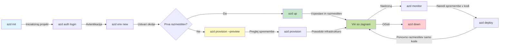
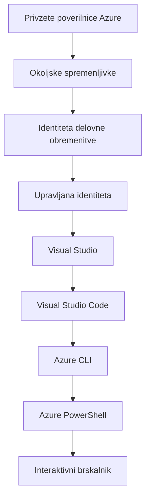

# Osnove AZD - Razumevanje Azure Developer CLI

# Osnove AZD - Osnovni koncepti in temelji

**Navigacija po poglavjih:**
- **📚 Domača stran tečaja**: [AZD za začetnike](../../README.md)
- **📖 Trenutno poglavje**: Poglavje 1 - Osnove in hiter začetek
- **⬅️ Prejšnje**: [Pregled tečaja](../../README.md#-chapter-1-foundation--quick-start)
- **➡️ Naslednje**: [Namestitev in nastavitev](installation.md)
- **🚀 Naslednje poglavje**: [Poglavje 2: Razvoj, osredotočen na AI](../chapter-02-ai-development/microsoft-foundry-integration.md)

## Uvod

Ta lekcija vas uvaja v Azure Developer CLI (azd), zmogljivo orodje ukazne vrstice, ki pospeši vašo pot od lokalnega razvoja do razmestitve v Azure. Spoznali boste temeljne koncepte, glavne funkcije in razumeli, kako azd poenostavi uvajanje oblakom-prijaznih aplikacij.

## Cilji učenja

Do konca te lekcije boste:
- Razumeli, kaj je Azure Developer CLI in njegov glavni namen
- Spoznali osnovne koncepte predlog, okolij in storitev
- Raziščili ključne funkcije, vključno z razvojem, temelječim na predlogah, in infrastrukturo kot kodo
- Razumeli strukturo projekta azd in delovni tok
- Bili pripravljeni namestiti in konfigurirati azd za vaše razvojno okolje

## Rezultati učenja

Po zaključku te lekcije boste znali:
- Razložiti vlogo azd v sodobnih delovnih poteh razvoja v oblaku
- Prepoznati komponente strukture projekta azd
- Opisati, kako predloge, okolja in storitve delujejo skupaj
- Razumeti prednosti Infrastrukture kot kode z azd
- Prepoznati različne azd ukaze in njihov namen

## Kaj je Azure Developer CLI (azd)?

Azure Developer CLI (azd) je orodje ukazne vrstice, zasnovano za pospešitev vaše poti od lokalnega razvoja do razmestitve v Azure. Poenostavi postopek gradnje, razmestitve in upravljanja oblakom-prijaznih aplikacij v Azure.

### Kaj lahko z azd razporedite?

azd podpira širok spekter delovnih obremenitev — in seznam se še povečuje. Danes lahko z azd razporedite:

| Vrsta delovne obremenitve | Primeri | Enak delovni tok? |
|--------------------------|---------|--------------------|
| **Klasične aplikacije** | Spletne aplikacije, REST API-ji, statične strani | ✅ `azd up` |
| **Storitve in mikrostoritve** | Container Apps, Function Apps, backendi z več storitvami | ✅ `azd up` |
| **Aplikacije, poganjane z AI** | Klepetalne aplikacije z Microsoft Foundry modeli, RAG rešitve z AI Search | ✅ `azd up` |
| **Inteligentni agenti** | Agentje gostovani v Foundry, orkestracije z več agenti | ✅ `azd up` |

Ključni vpogled je, da **životni cikel azd ostane enak ne glede na to, kaj razmestite**. Inicializirate projekt, zagotovite infrastrukturo, razporedite svojo kodo, spremljate aplikacijo in počistite — naj bo to preprosta spletna stran ali sofisticiran AI agent.

Ta kontinuiteta je premišljena. azd obravnava AI zmogljivosti kot drugo vrsto storitve, ki jo lahko vaša aplikacija uporablja, ne kot nekaj temeljno drugačnega. Klepetalni endpoint, podprt z Microsoft Foundry modeli, je z vidika azd le še ena storitev za konfiguracijo in razmestitev.

### 🎯 Zakaj uporabljati AZD? Primer iz resničnega sveta

Primerjajmo razmestitev preproste spletne aplikacije z bazo podatkov:

#### ❌ BREZ AZD: Ročna razmestitev v Azure (30+ minut)

```bash
# Korak 1: Ustvari skupino virov
az group create --name myapp-rg --location eastus

# Korak 2: Ustvari načrt storitve App Service
az appservice plan create --name myapp-plan \
  --resource-group myapp-rg \
  --sku B1 --is-linux

# Korak 3: Ustvari spletno aplikacijo
az webapp create --name myapp-web-unique123 \
  --resource-group myapp-rg \
  --plan myapp-plan \
  --runtime "NODE:18-lts"

# Korak 4: Ustvari račun Cosmos DB (10-15 minut)
az cosmosdb create --name myapp-cosmos-unique123 \
  --resource-group myapp-rg \
  --kind MongoDB

# Korak 5: Ustvari bazo podatkov
az cosmosdb mongodb database create \
  --account-name myapp-cosmos-unique123 \
  --resource-group myapp-rg \
  --name tododb

# Korak 6: Ustvari zbirko
az cosmosdb mongodb collection create \
  --account-name myapp-cosmos-unique123 \
  --resource-group myapp-rg \
  --database-name tododb \
  --name todos

# Korak 7: Pridobi niz za povezavo
CONN_STR=$(az cosmosdb keys list \
  --name myapp-cosmos-unique123 \
  --resource-group myapp-rg \
  --type connection-strings \
  --query "connectionStrings[0].connectionString" -o tsv)

# Korak 8: Konfiguriraj nastavitve aplikacije
az webapp config appsettings set \
  --name myapp-web-unique123 \
  --resource-group myapp-rg \
  --settings MONGODB_URI="$CONN_STR"

# Korak 9: Omogoči beleženje
az webapp log config --name myapp-web-unique123 \
  --resource-group myapp-rg \
  --application-logging filesystem \
  --detailed-error-messages true

# Korak 10: Nastavi Application Insights
az monitor app-insights component create \
  --app myapp-insights \
  --location eastus \
  --resource-group myapp-rg

# Korak 11: Poveži Application Insights s spletno aplikacijo
INSTRUMENTATION_KEY=$(az monitor app-insights component show \
  --app myapp-insights \
  --resource-group myapp-rg \
  --query "instrumentationKey" -o tsv)

az webapp config appsettings set \
  --name myapp-web-unique123 \
  --resource-group myapp-rg \
  --settings APPINSIGHTS_INSTRUMENTATIONKEY="$INSTRUMENTATION_KEY"

# Korak 12: Zgradi aplikacijo lokalno
npm install
npm run build

# Korak 13: Ustvari paket za razmestitev
zip -r app.zip . -x "*.git*" "node_modules/*"

# Korak 14: Razmesti aplikacijo
az webapp deployment source config-zip \
  --resource-group myapp-rg \
  --name myapp-web-unique123 \
  --src app.zip

# Korak 15: Počakaj in upaj, da bo delovalo 🙏
# (Brez avtomatizirane validacije, zahtevano je ročno testiranje)
```

**Težave:**
- ❌ 15+ ukazov za zapomniti in izvesti v pravilnem vrstnem redu
- ❌ 30-45 minut ročnega dela
- ❌ Enostavno je narediti napake (tipkarske napake, napačni parametri)
- ❌ Nizi povezave razkriti v zgodovini terminala
- ❌ Ni samodejne povrnitve stanja, če kaj spodleti
- ❌ Težko reproducirati za člane ekipe
- ❌ Vsakič drugačno (ni reproducibilno)

#### ✅ Z AZD: Avtomatizirana razmestitev (5 ukazov, 10-15 minut)

```bash
# Korak 1: Inicializiraj iz predloge
azd init --template todo-nodejs-mongo

# Korak 2: Prijavi se
azd auth login

# Korak 3: Ustvari okolje
azd env new dev

# Korak 4: Predogled sprememb (neobvezno, vendar priporočljivo)
azd provision --preview

# Korak 5: Namesti vse
azd up

# ✨ Končano! Vse je nameščeno, konfigurirano in spremljano
```

**Prednosti:**
- ✅ **5 ukazov** v primerjavi s 15+ ročnimi koraki
- ✅ **10-15 minut** skupnega časa (večinoma čakanje na Azure)
- ✅ **Brez napak** - avtomatizirano in testirano
- ✅ **Skrivnosti varno upravljane** preko Key Vault
- ✅ **Samodejna povrnitev** ob napakah
- ✅ **Popolnoma reproducibilno** - vedno enak rezultat
- ✅ **Pripravljeno za ekipo** - kdorkoli lahko razporedi z istimi ukazi
- ✅ **Infrastruktura kot koda** - Bicep predloge pod nadzorom različic
- ✅ **Vgrajen nadzor** - Application Insights samodejno konfiguriran

### 📊 Čas in zmanjšanje napak

| Metrika | Ročna namestitev | AZD namestitev | Izboljšanje |
|:-------|:------------------|:---------------|:------------|
| **Ukazi** | 15+ | 5 | 67% manj |
| **Čas** | 30-45 min | 10-15 min | 60% hitreje |
| **Stopnja napak** | ~40% | <5% | 88% zmanjšanje |
| **Doslednost** | Nizka (ročna) | 100% (avtomatizirano) | Popolno |
| **Uvajanje ekipe** | 2-4 ure | 30 minut | 75% hitreje |
| **Čas povrnitve** | 30+ min (ročna) | 2 min (avtomatizirano) | 93% hitreje |

## Osnovni koncepti

### Predloge
Predloge so temelj azd. Vsebujejo:
- **Koda aplikacije** - vaša izvorna koda in odvisnosti
- **Definicije infrastrukture** - Azure viri definirani v Bicep ali Terraform
- **Konfiguracijske datoteke** - nastavitve in spremenljivke okolja
- **Skripte za razmestitev** - avtomatizirani delovni tokovi za razmestitev

### Okolja
Okolja predstavljajo različne cilje uvajanja:
- **Razvoj** - za testiranje in razvoj
- **Staging** - predprodukcijsko okolje
- **Produkcija** - živo produkcijsko okolje

Vsako okolje vzdržuje svoje:
- Azure skupino virov
- Konfiguracijske nastavitve
- Stanje uvajanja

### Storitve
Storitve so gradniki vaše aplikacije:
- **Frontend** - Spletne aplikacije, SPA
- **Backend** - API-ji, mikrostoritve
- **Database** - Rešitve za shranjevanje podatkov
- **Storage** - Shranjevanje datotek in blobov

## Ključne funkcije

### 1. Razvoj, voden s predlogami
```bash
# Brskajte po razpoložljivih predlogah
azd template list

# Inicializirajte iz predloge
azd init --template <template-name>
```

### 2. Infrastruktura kot koda
- **Bicep** - jezik, specifičen za domeno Azure
- **Terraform** - orodje za infrastrukturo za več oblakov
- **ARM Templates** - predloge Azure Resource Manager

### 3. Integrirani delovni tokovi
```bash
# Celoten potek uvajanja
azd up            # Priprava in uvajanje — brez ročnega posega za prvo nastavitev

# 🧪 NOVO: Predogled sprememb infrastrukture pred uvajanjem (VAREN)
azd provision --preview    # Simulirajte uvajanje infrastrukture brez izvajanja sprememb

azd provision     # Ustvari Azure vire — uporabite to, če posodobite infrastrukturo
azd deploy        # Razmestite kodo aplikacije ali jo ponovno razmestite po posodobitvi
azd down          # Počisti vire
```

#### 🛡️ Varnostno načrtovanje infrastrukture s predogledom
Ukaz `azd provision --preview` je prelomnica za varne uvajanja:
- **Analiza suhega zagona** - pokaže, kaj bo ustvarjeno, spremenjeno ali izbrisano
- **Brez tveganja** - dejanske spremembe v vašem Azure okolju niso izvedene
- **Sodelovanje ekipe** - delite rezultate predogleda pred uvajanjem
- **Ocena stroškov** - razumite stroške virov pred zavezo

```bash
# Primer delovnega toka za predogled
azd provision --preview           # Oglejte si, kaj se bo spremenilo
# Preglejte izhod, pogovorite se z ekipo
azd provision                     # Uveljavite spremembe z zaupanjem
```

### 📊 Vizualno: AZD razvojni delovni tok


**Razlaga delovnega toka:**
1. **Init** - Začnite s predlogo ali novim projektom
2. **Auth** - Avtenticirajte se z Azure
3. **Environment** - Ustvarite izolirano okolje za uvajanje
4. **Preview** - 🆕 Vedno najprej preglejte spremembe infrastrukture (varna praksa)
5. **Provision** - Ustvarite/posodobite Azure vire
6. **Deploy** - Potisnite kodo svoje aplikacije
7. **Monitor** - Opazujte delovanje aplikacije
8. **Iterate** - Naredite spremembe in ponovno razmestite kodo
9. **Cleanup** - Odstranite vire, ko končate

### 4. Upravljanje okolij
```bash
# Ustvarjanje in upravljanje okolij
azd env new <environment-name>
azd env select <environment-name>
azd env list
```

### 5. Razširitve in AI ukazi

azd uporablja sistem razširitev za dodajanje zmogljivosti onkraj jedrne CLI. To je še posebej uporabno za AI delovne obremenitve:

```bash
# Prikaži razpoložljive razširitve
azd extension list

# Namesti razširitev Foundry agents
azd extension install azure.ai.agents

# Inicializiraj projekt AI-agenta iz manifesta
azd ai agent init -m agent-manifest.yaml

# Zaženi MCP strežnik za razvoj, podprt z AI (alfa)
azd mcp start
```

> Razširitve so podrobno obravnavane v [Poglavje 2: Razvoj, osredotočen na AI](../chapter-02-ai-development/agents.md) in referenci [Ukazi AZD AI CLI](../chapter-08-production/production-ai-practices.md#azd-ai-cli-commands-and-extensions).

## 📁 Struktura projekta

Tipična struktura projekta azd:
```
my-app/
├── .azd/                    # azd configuration
│   └── config.json
├── .azure/                  # Azure deployment artifacts
├── .devcontainer/          # Development container config
├── .github/workflows/      # GitHub Actions
├── .vscode/               # VS Code settings
├── infra/                 # Infrastructure code
│   ├── main.bicep        # Main infrastructure template
│   ├── main.parameters.json
│   └── modules/          # Reusable modules
├── src/                  # Application source code
│   ├── api/             # Backend services
│   └── web/             # Frontend application
├── azure.yaml           # azd project configuration
└── README.md
```

## 🔧 Konfiguracijske datoteke

### azure.yaml
Glavna konfiguracijska datoteka projekta:
```yaml
name: my-awesome-app
metadata:
  template: my-template@1.0.0

services:
  web:
    project: ./src/web
    language: js
    host: appservice
  api:
    project: ./src/api
    language: js
    host: appservice

hooks:
  preprovision:
    shell: pwsh
    run: echo "Preparing to provision..."
```

### .azure/config.json
Konfiguracija, specifična za okolje:
```json
{
  "version": 1,
  "defaultEnvironment": "dev",
  "environments": {
    "dev": {
      "subscriptionId": "your-subscription-id",
      "location": "eastus"
    }
  }
}
```

## 🎪 Pogosti delovni tokovi s praktičnimi vajami

> **💡 Nasvet za učenje:** Sledite tem vajam v zaporedju, da postopoma razvijete svoje spretnosti z AZD.

### 🎯 Vaja 1: Inicializirajte svoj prvi projekt

**Cilj:** Ustvariti projekt AZD in raziskati njegovo strukturo

**Koraki:**
```bash
# Uporabite preizkušen predlog
azd init --template todo-nodejs-mongo

# Raziskujte ustvarjene datoteke
ls -la  # Prikažite vse datoteke, vključno s skritimi

# Ustvarjene ključne datoteke:
# - azure.yaml (glavna konfiguracija)
# - infra/ (koda infrastrukture)
# - src/ (koda aplikacije)
```

**✅ Uspeh:** Imate datoteko azure.yaml ter imenika infra/ in src/

---

### 🎯 Vaja 2: Razmestitev v Azure

**Cilj:** Dokončati celovito uvajanje

**Koraki:**
```bash
# 1. Prijavite se
az login && azd auth login

# 2. Ustvarite okolje
azd env new dev
azd env set AZURE_LOCATION eastus

# 3. Predogled sprememb (PRIPOROČENO)
azd provision --preview

# 4. Razmestite vse
azd up

# 5. Preverite razmestitev
azd show    # Ogled URL-ja vaše aplikacije
```

**Pričakovan čas:** 10-15 minut  
**✅ Uspeh:** URL aplikacije se odpre v brskalniku

---

### 🎯 Vaja 3: Več okolij

**Cilj:** Razmestiti v dev in staging

**Koraki:**
```bash
# dev že obstaja, ustvari staging
azd env new staging
azd env set AZURE_LOCATION westus2
azd up

# Preklopi med njima
azd env list
azd env select dev
```

**✅ Uspeh:** Dve ločeni skupini virov v Azure Portalu

---

### 🛡️ Čist začetek: `azd down --force --purge`

Ko potrebujete popolno ponastavitev:

```bash
azd down --force --purge
```

**Kaj naredi:**
- `--force`: Brez potrditvenih pozivov
- `--purge`: Izbriše vse lokalno stanje in Azure vire

**Uporabite, kadar:**
- Uvajanje je spodletelo na pol poti
- Preklapljate projekte
- Potrebujete nov začetek

---

## 🎪 Izvirna referenca delovnega toka

### Začetek novega projekta
```bash
# Metoda 1: Uporabi obstoječo predlogo
azd init --template todo-nodejs-mongo

# Metoda 2: Začni iz nič
azd init

# Metoda 3: Uporabi trenutni imenik
azd init .
```

### Cikel razvoja
```bash
# Nastavite razvojno okolje
azd auth login
azd env new dev
azd env select dev

# Razmestite vse
azd up

# Naredite spremembe in ponovno razmestite
azd deploy

# Očistite, ko končate
azd down --force --purge # Ukaz v Azure Developer CLI je **popolna ponastavitev** za vaše okolje — še posebej uporaben, ko odpravljate težave z neuspešnimi razmestitvami, čistite opuščene vire ali pripravljate okolje za novo razmestitev.
```

## Razumevanje `azd down --force --purge`
Ukaz `azd down --force --purge` je zmogljiv način, da popolnoma razstavite svoje azd okolje in vse povezane vire. Tukaj je razčlenitev, kaj vsak preklop naredi:
```
--force
```
- Preskoči potrditvene pozive.
- Uporabno za avtomatizacijo ali skriptiranje, kjer ročni vnos ni izvedljiv.
- Zagotavlja, da se rušenje nadaljuje brez prekinitve, tudi če CLI zazna neskladja.

```
--purge
```
Izbriše **vse povezane metapodatke**, vključno z:
Stanje okolja
Lokalna mapa `.azure`
Predpomnjene informacije o uvajanju
Prepreči, da bi azd "zapomnil" prejšnja uvajanja, kar lahko povzroči težave, kot so neskladne skupine virov ali zastarele reference registra.


### Zakaj uporabljati obe?
Ko naletite na oviro z `azd up` zaradi preostalega stanja ali delnih uvajanj, ta kombinacija zagotavlja **čisto začetek**.

Še posebej je uporabna po ročnih izbrisih virov v Azure portalu ali pri menjavi predlog, okolij ali konvencij poimenovanja skupin virov.

### Upravljanje več okolij
```bash
# Ustvari predprodukcijsko okolje
azd env new staging
azd env select staging
azd up

# Preklopi nazaj na razvojno okolje
azd env select dev

# Primerjaj okolja
azd env list
```

## 🔐 Avtentikacija in poverilnice

Razumevanje avtentikacije je ključno za uspešne razmestitve z azd. Azure uporablja več metod avtentikacije, azd pa izkorišča isto verigo poverilnic kot druga Azure orodja.

### Avtentikacija Azure CLI (`az login`)

Pred uporabo azd se morate avtenticirati z Azure. Najpogostejša metoda je uporaba Azure CLI:

```bash
# Interaktivna prijava (odpre brskalnik)
az login

# Prijava z določenim najemnikom
az login --tenant <tenant-id>

# Prijava s servisnim principalom
az login --service-principal -u <app-id> -p <password> --tenant <tenant-id>

# Preveri trenutno stanje prijave
az account show

# Prikaži razpoložljive naročnine
az account list --output table

# Nastavi privzeto naročnino
az account set --subscription <subscription-id>
```

### Potek avtentikacije
1. **Interaktivna prijava**: Odpre vaš privzeti brskalnik za avtentikacijo
2. **Device Code Flow**: Za okolja brez dostopa do brskalnika
3. **Service Principal**: Za avtomatizacijo in CI/CD scenarije
4. **Managed Identity**: Za aplikacije gostovane v Azure

### Veriga DefaultAzureCredential

`DefaultAzureCredential` je tip poverilnic, ki poenostavi izkušnjo avtentikacije z avtomatskim poskusom več virov poverilnic v določenem vrstnem redu:

#### Redosled verige poverilnic

#### 1. Spremenljivke okolja
```bash
# Nastavi spremenljivke okolja za service principal
export AZURE_CLIENT_ID="<app-id>"
export AZURE_CLIENT_SECRET="<password>"
export AZURE_TENANT_ID="<tenant-id>"
```

#### 2. Workload Identity (Kubernetes/GitHub Actions)
Samodejno se uporablja v:
- Azure Kubernetes Service (AKS) z Workload Identity
- GitHub Actions z OIDC federacijo
- Drugi scenariji federirane identitete

#### 3. Managed Identity
Za Azure vire, kot so:
- Virtualni stroji
- App Service
- Azure Functions
- Container Instances

```bash
# Preveri, ali teče na Azure viru z upravljano identiteto
az account show --query "user.type" --output tsv
# Vrne: "servicePrincipal", če uporablja upravljano identiteto
```

#### 4. Integracija z orodji za razvijalce
- **Visual Studio**: samodejno uporablja prijavljen račun
- **VS Code**: uporablja poverilnice razširitve Azure Account
- **Azure CLI**: uporablja poverilnice `az login` (najpogostejše za lokalni razvoj)

### Nastavitev avtentikacije AZD

```bash
# Metoda 1: Uporabite Azure CLI (priporočeno za razvoj)
az login
azd auth login  # Uporablja obstoječe poverilnice Azure CLI

# Metoda 2: Neposredna avtentikacija azd
azd auth login --use-device-code  # Za okolja brez grafičnega vmesnika

# Metoda 3: Preverite stanje avtentikacije
azd auth login --check-status

# Metoda 4: Odjava in ponovna avtentikacija
azd auth logout
azd auth login
```

### Najboljše prakse avtentikacije

#### Za lokalni razvoj
```bash
# 1. Prijavite se z Azure CLI
az login

# 2. Preverite, ali je izbrana pravilna naročnina
az account show
az account set --subscription "Your Subscription Name"

# 3. Uporabite azd z obstoječimi poverilnicami
azd auth login
```

#### Za CI/CD poteke
```yaml
# GitHub Actions example
- name: Azure Login
  uses: azure/login@v1
  with:
    creds: ${{ secrets.AZURE_CREDENTIALS }}

- name: Deploy with azd
  run: |
    azd auth login --client-id ${{ secrets.AZURE_CLIENT_ID }} \
                    --client-secret ${{ secrets.AZURE_CLIENT_SECRET }} \
                    --tenant-id ${{ secrets.AZURE_TENANT_ID }}
    azd up --no-prompt
```

#### Za produkcijska okolja
- Uporabljajte **Managed Identity**, ko se izvaja na Azure virih
- Uporabljajte **Service Principal** za avtomatizacijske scenarije
- Izogibajte se shranjevanju poverilnic v kodi ali konfiguracijskih datotekah
- Uporabljajte **Azure Key Vault** za občutljive nastavitve

### Pogoste težave z avtentikacijo in rešitve

#### Težava: "No subscription found"
```bash
# Rešitev: Nastavite privzeto naročnino
az account list --output table
az account set --subscription "<subscription-id>"
azd env set AZURE_SUBSCRIPTION_ID "<subscription-id>"
```

#### Težava: "Insufficient permissions"
```bash
# Rešitev: Preverite in dodelite zahtevane vloge
az role assignment list --assignee $(az account show --query user.name --output tsv)

# Pogoste zahtevane vloge:
# - Contributor (za upravljanje virov)
# - User Access Administrator (za dodeljevanje vlog)
```

#### Težava: "Token expired"
```bash
# Rešitev: Ponovno preverite pristnost
az logout
az login
azd auth logout
azd auth login
```

### Avtentikacija v različnih scenarijih

#### Lokalni razvoj
```bash
# Račun za osebni razvoj
az login
azd auth login
```

#### Razvoj v ekipi
```bash
# Uporabite določenega najemnika za organizacijo.
az login --tenant contoso.onmicrosoft.com
azd auth login
```

#### Scenariji z več najemniki
```bash
# Preklopi med najemniki
az login --tenant tenant1.onmicrosoft.com
# Namesti v najemnika 1
azd up

az login --tenant tenant2.onmicrosoft.com  
# Namesti v najemnika 2
azd up
```

### Varnostni vidiki
1. **Shranjevanje poverilnic**: Nikoli ne shranjujte poverilnic v izvorno kodo
2. **Omejitev obsega**: Uporabljajte načelo najmanjših pooblastil za servisne identitete
3. **Rotacija žetonov**: Redno obnavljajte skrivnosti servisnih identitet
4. **Revizijska sled**: Spremljajte dejavnosti preverjanja pristnosti in uvajanja
5. **Omrežna varnost**: Kjer je mogoče, uporabljajte zasebne končne točke

### Odpravljanje težav s preverjanjem pristnosti

```bash
# Odpravljanje težav z avtentikacijo
azd auth login --check-status
az account show
az account get-access-token

# Pogosti diagnostični ukazi
whoami                          # Trenutni uporabniški kontekst
az ad signed-in-user show      # Podrobnosti uporabnika Azure AD
az group list                  # Preizkus dostopa do vira
```

## Razumevanje `azd down --force --purge`

### Odkritje
```bash
azd template list              # Brskaj po predlogah
azd template show <template>   # Podrobnosti predloge
azd init --help               # Možnosti inicializacije
```

### Upravljanje projektov
```bash
azd show                     # Pregled projekta
azd env show                 # Trenutno okolje
azd config list             # Nastavitve konfiguracije
```

### Nadzor
```bash
azd monitor                  # Odpri spremljanje v portalu Azure
azd monitor --logs           # Prikaži dnevnike aplikacije
azd monitor --live           # Prikaži meritve v živo
azd pipeline config          # Nastavi CI/CD
```

## Najboljše prakse

### 1. Uporabljajte smiselna imena
```bash
# Dobro
azd env new production-east
azd init --template web-app-secure

# Izogibajte se
azd env new env1
azd init --template template1
```

### 2. Izkoristite predloge
- Začnite z obstoječimi predlogami
- Prilagodite za svoje potrebe
- Ustvarite ponovno uporabne predloge za vašo organizacijo

### 3. Izolacija okolij
- Uporabljajte ločena okolja za razvoj/pripravo/produkcijo
- Nikoli ne nameščajte neposredno v produkcijo iz lokalnega računalnika
- Uporabljajte CI/CD potoke za produkcijska uvajanja

### 4. Upravljanje konfiguracije
- Uporabljajte spremenljivke okolja za občutljive podatke
- Shranjujte konfiguracijo v sistemu za upravljanje različic
- Dokumentirajte nastavitve, specifične za okolje

## Napredovanje učenja

### Začetnik (1.–2. teden)
1. Namestite azd in se prijavite
2. Uvedite preprosto predlogo
3. Razumite strukturo projekta
4. Naučite se osnovnih ukazov (up, down, deploy)

### Vmesni (3.–4. teden)
1. Prilagodite predloge
2. Upravljajte več okolij
3. Razumite infrastrukturo kot kodo
4. Nastavite CI/CD potoke

### Napredno (5. teden naprej)
1. Ustvarite prilagojene predloge
2. Napredni vzorci infrastrukture
3. Uvajanja v več regijah
4. Konfiguracije za raven podjetja

## Naslednji koraki

**📖 Nadaljujte z učenjem poglavja 1:**
- [Namestitev in nastavitev](installation.md) - Namestite in konfigurirajte azd
- [Vaš prvi projekt](first-project.md) - Dokončajte praktičen vodič
- [Vodnik po konfiguraciji](configuration.md) - Napredne možnosti konfiguracije

**🎯 Pripravljeni na naslednje poglavje?**
- [Poglavje 2: Razvoj z AI v ospredju](../chapter-02-ai-development/microsoft-foundry-integration.md) - Začnite graditi AI aplikacije

## Dodatni viri

- [Pregled Azure Developer CLI](https://learn.microsoft.com/en-us/azure/developer/azure-developer-cli/)
- [Galerija predlog](https://azure.github.io/awesome-azd/)
- [Primeri skupnosti](https://github.com/Azure-Samples)

---

## 🙋 Pogosto zastavljena vprašanja

### Splošna vprašanja

**V: Kakšna je razlika med AZD in Azure CLI?**

O: Azure CLI (`az`) je za upravljanje posameznih Azure virov. AZD (`azd`) je za upravljanje celotnih aplikacij:

```bash
# Azure CLI - Upravljanje virov na nizki ravni
az webapp create --name myapp --resource-group rg
az sql server create --name myserver --resource-group rg
# ...potrebnih je še veliko več ukazov

# AZD - Upravljanje na ravni aplikacije
azd up  # Razmestuje celotno aplikacijo z vsemi viri
```

**Mislite o tem takole:**
- `az` = Delovanje na posameznih Lego kockah
- `azd` = Delo s celimi kompleti Lego kock

---

**V: Ali moram poznati Bicep ali Terraform, da uporabljam AZD?**

O: Ne! Začnite s predlogami:
```bash
# Uporabite obstoječo predlogo - znanje IaC ni potrebno
azd init --template todo-nodejs-mongo
azd up
```

Bicep se lahko naučite kasneje za prilagoditev infrastrukture. Predloge nudijo delujoče primere, iz katerih se lahko učite.

---

**V: Koliko stane zagon AZD predlog?**

O: Stroški se razlikujejo glede na predlogo. Večina razvojnih predlog stane $50-150/month:
```bash
# Predogled stroškov pred nameščanjem
azd provision --preview

# Vedno počistite, ko ne uporabljate
azd down --force --purge  # Odstrani vse vire
```

**Namig:** Uporabljajte brezplačne ravni, kjer so na voljo:
- App Service: F1 (brezplačna) raven
- Microsoft Foundry Models: Azure OpenAI 50,000 tokenov/mesec brezplačno
- Cosmos DB: 1000 RU/s brezplačna raven

---

**V: Ali lahko uporabim AZD z obstoječimi Azure viri?**

O: Da, vendar je lažje začeti na novo. AZD najbolje deluje, ko upravlja celoten življenjski cikel. Za obstoječe vire:
```bash
# Možnost 1: Uvozi obstoječe vire (napredno)
azd init
# Nato spremenite infra/, da se sklicuje na obstoječe vire

# Možnost 2: Začnite na novo (priporočeno)
azd init --template matching-your-stack
azd up  # Ustvari novo okolje
```

---

**V: Kako delim projekt s člani ekipe?**

O: Potisnite AZD projekt v Git (a NE mapo .azure):
```bash
# Že privzeto v .gitignore
.azure/        # Vsebuje skrivnosti in podatke o okolju
*.env          # Spremenljivke okolja

# Člani ekipe nato:
git clone <your-repo>
azd auth login
azd env new <their-name>-dev
azd up
```

Vsakdo dobi enako infrastrukturo iz istih predlog.

---

### Vprašanja pri odpravljanju težav

**V: "azd up" je odpovedal na polovici. Kaj naj naredim?**

O: Preverite napako, jo odpravite in poskusite znova:
```bash
# Prikaži podrobne dnevnike
azd show

# Pogoste rešitve:

# 1. Če je kvota prekoračena:
azd env set AZURE_LOCATION "westus2"  # Poskusi drugo regijo

# 2. Če je konflikt imena vira:
azd down --force --purge  # Ponastavi na začetno stanje
azd up  # Poskusi znova

# 3. Če je overitev potekla:
az login
azd auth login
azd up
```

**Najpogostejši problem:** Izbrana napačna Azure naročnina
```bash
az account list --output table
az account set --subscription "<correct-subscription>"
```

---

**V: Kako uvedem samo spremembe kode brez ponovne priprave virov?**

O: Uporabite `azd deploy` namesto `azd up`:
```bash
azd up          # Prvič: priprava virov in razmestitev (počasi)

# Naredite spremembe v kodi...

azd deploy      # Naslednjič: samo razmestitev (hitro)
```

Primerjava hitrosti:
- `azd up`: 10-15 minut (pripravi infrastrukturo)
- `azd deploy`: 2-5 minut (samo koda)

---

**V: Ali lahko prilagodim predloge za infrastrukturo?**

O: Da! Uredite Bicep datoteke v `infra/`:
```bash
# Po azd init
cd infra/
code main.bicep  # Uredi v VS Code

# Predogled sprememb
azd provision --preview

# Uporabi spremembe
azd provision
```

**Nasvet:** Začnite z majhnimi spremembami - najprej spremenite SKU-je:
```bicep
// infra/main.bicep
sku: {
  name: 'B1'  // Change to 'P1V2' for production
}
```

---

**V: Kako izbrišem vse, kar je ustvaril AZD?**

O: En ukaz odstrani vse vire:
```bash
azd down --force --purge

# To izbriše:
# - Vse Azure vire
# - Skupina virov
# - Stanje lokalnega okolja
# - Predpomnjeni podatki o razmestitvi
```

**Vedno zaženite to, kadar:**
- Končali ste testiranje predloge
- Prehajate na drug projekt
- Želite začeti znova

**Prihranek stroškov:** Brisanje neuporabljenih virov = $0 stroškov

---

**V: Kaj če sem po nesreči izbrisal vire v Azure Portal?**

O: Stanje AZD se lahko ne ujema. Pristop 'čista plošča':
```bash
# 1. Odstranite lokalno stanje
azd down --force --purge

# 2. Začnite znova
azd up

# Alternativa: Naj AZD zazna in popravi
azd provision  # Ustvaril bo manjkajoče vire
```

---

### Napredna vprašanja

**V: Ali lahko uporabim AZD v CI/CD pipeline-ih?**

O: Da! Primer GitHub Actions:
```yaml
# .github/workflows/deploy.yml
name: Deploy with AZD

on:
  push:
    branches: [main]

jobs:
  deploy:
    runs-on: ubuntu-latest
    steps:
      - uses: actions/checkout@v2
      
      - name: Install azd
        run: curl -fsSL https://aka.ms/install-azd.sh | bash
      
      - name: Azure Login
        run: |
          azd auth login \
            --client-id ${{ secrets.AZURE_CLIENT_ID }} \
            --client-secret ${{ secrets.AZURE_CLIENT_SECRET }} \
            --tenant-id ${{ secrets.AZURE_TENANT_ID }}
      
      - name: Deploy
        run: azd up --no-prompt
```

---

**V: Kako ravnam s skrivnostmi in občutljivimi podatki?**

O: AZD se samodejno integrira z Azure Key Vault:
```bash
# Skrivnosti so shranjene v Key Vaultu, ne v kodi
azd env set DATABASE_PASSWORD "$(openssl rand -base64 32)"

# AZD samodejno:
# 1. Ustvari Key Vault
# 2. Shrani skrivnost
# 3. Dodeli aplikaciji dostop prek upravljane identitete
# 4. Vstavi med izvajanjem
```

**Nikoli ne vključite v Git:**
- `.azure/` mapa (vsebuje podatke o okolju)
- `.env` datoteke (lokalne skrivnosti)
- Povezovalne nize

---

**V: Ali lahko uvajam v več regij?**

O: Da, ustvarite okolje za vsako regijo:
```bash
# Okolje Vzhodnih ZDA
azd env new prod-eastus
azd env set AZURE_LOCATION eastus
azd up

# Okolje Zahodne Evrope
azd env new prod-westeurope
azd env set AZURE_LOCATION westeurope
azd up

# Vsako okolje je neodvisno
azd env list
```

Za prave večregijske aplikacije prilagodite Bicep predloge, da se uvedejo v več regijah hkrati.

---

**V: Kje lahko dobim pomoč, če se zataknem?**

1. **Dokumentacija AZD:** https://learn.microsoft.com/azure/developer/azure-developer-cli/
2. **GitHub Issues:** https://github.com/Azure/azure-dev/issues
3. **Discord:** [Azure Discord](https://discord.gg/microsoft-azure) - kanal #azure-developer-cli
4. **Stack Overflow:** Oznaka `azure-developer-cli`
5. **Ta tečaj:** [Vodnik za odpravljanje težav](../chapter-07-troubleshooting/common-issues.md)

**Namig:** Preden vprašate, zaženite:
```bash
azd show       # Prikaže trenutno stanje
azd version    # Prikaže vašo različico
```
Vključite te podatke v svoje vprašanje za hitrejšo pomoč.

---

## 🎓 Kaj sledi?

Zdaj razumete osnove AZD. Izberite svojo pot:

### 🎯 Za začetnike:
1. **Naslednje:** [Namestitev in nastavitev](installation.md) - Namestite AZD na svoj računalnik
2. **Nato:** [Vaš prvi projekt](first-project.md) - Uvedite svojo prvo aplikacijo
3. **Vaja:** Dokončajte vseh 3 vaje v tej lekciji

### 🚀 Za razvijalce AI:
1. **Preskočite na:** [Poglavje 2: Razvoj z AI v ospredju](../chapter-02-ai-development/microsoft-foundry-integration.md)
2. **Uvedite:** Začnite z `azd init --template get-started-with-ai-chat`
3. **Učite se:** Gradite med uvajanjem

### 🏗️ Za izkušene razvijalce:
1. **Preglejte:** [Vodnik po konfiguraciji](configuration.md) - Napredne nastavitve
2. **Raziskujte:** [Infrastruktura kot koda](../chapter-04-infrastructure/provisioning.md) - Poglobljen vpogled v Bicep
3. **Zgradite:** Ustvarite prilagojene predloge za vaš sklad

---

**Navigacija po poglavjih:**
- **📚 Domov tečaja**: [AZD For Beginners](../../README.md)
- **📖 Trenutno poglavje**: Poglavje 1 - Osnove in hiter začetek  
- **⬅️ Prejšnje**: [Pregled tečaja](../../README.md#-chapter-1-foundation--quick-start)
- **➡️ Naslednje**: [Namestitev in nastavitev](installation.md)
- **🚀 Naslednje poglavje**: [Poglavje 2: Razvoj z AI v ospredju](../chapter-02-ai-development/microsoft-foundry-integration.md)

---

<!-- CO-OP TRANSLATOR DISCLAIMER START -->
**Izjava o omejitvi odgovornosti**:
Ta dokument je bil preveden z uporabo storitve za prevajanje z umetno inteligenco [Co-op Translator](https://github.com/Azure/co-op-translator). Čeprav si prizadevamo za natančnost, upoštevajte, da lahko avtomatizirani prevodi vsebujejo napake ali netočnosti. Izvirni dokument v svojem izvirnem jeziku velja za uraden vir. Za ključne informacije priporočamo strokovni človeški prevod. Nismo odgovorni za morebitne nesporazume ali napačne razlage, ki izhajajo iz uporabe tega prevoda.
<!-- CO-OP TRANSLATOR DISCLAIMER END -->