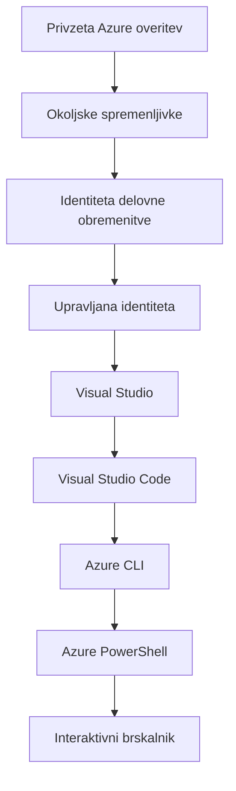

# AZD Osnove - Razumevanje Azure Developer CLI

# AZD Osnove - Temeljni pojmi in osnove

**Navigacija poglavij:**
- **📚 Domača stran tečaja**: [AZD za začetnike](../../README.md)
- **📖 Trenutno poglavje**: Poglavje 1 - Temelj in hitri začetek
- **⬅️ Prejšnje**: [Pregled tečaja](../../README.md#-chapter-1-foundation--quick-start)
- **➡️ Naprej**: [Namestitev in nastavitev](installation.md)
- **🚀 Naslednje poglavje**: [Poglavje 2: AI-prvi razvoj](../chapter-02-ai-development/microsoft-foundry-integration.md)

## Uvod

Ta lekcija vas uvaja v Azure Developer CLI (azd), zmogljivo orodje ukazne vrstice, ki pospeši vašo pot od lokalnega razvoja do uvajanja v Azure. Naučili se boste osnovnih pojmov, ključnih funkcij in razumeli, kako azd poenostavi uvajanje cloud-native aplikacij.

## Cilji učenja

Do konca te lekcije boste:
- Razumeli, kaj je Azure Developer CLI in njegov primarni namen
- Spoznali ključne pojme predlog, okolij in storitev
- Raziskali ključne funkcije, vključno z razvojem na osnovi predlog in Infrastrukturo kot kodo
- Razumeli strukturo in delovni tok azd projekta
- Bili pripravljeni namestiti in konfigurirati azd za vaše razvojno okolje

## Rezultati učenja

Po zaključku te lekcije boste lahko:
- Pojasnili vlogo azd v sodobnih delovnih tokih za razvoj v oblaku
- Prepoznali komponente strukture azd projekta
- Opisali, kako predloge, okolja in storitve delujejo skupaj
- Razumeli prednosti Infrastrukture kot kode z azd
- Prepoznali različne azd ukaze in njihove namene

## Kaj je Azure Developer CLI (azd)?

Azure Developer CLI (azd) je orodje ukazne vrstice, zasnovano za pospešitev vaše poti od lokalnega razvoja do uvajanja v Azure. Poenostavi postopek gradnje, uvajanja in upravljanja cloud-native aplikacij v Azure.

### Kaj lahko z azd uvajate?

azd podpira širok nabor obremenitev — in seznam se nenehno povečuje. Danes lahko z azd uvajate:

| Vrsta obremenitve | Primeri | Isti potek dela? |
|---------------|----------|----------------|
| **Tradicionalne aplikacije** | Spletne aplikacije, REST API-ji, statične strani | ✅ `azd up` |
| **Storitve in mikrostoritve** | Container Apps, Function Apps, večstorivni backendi | ✅ `azd up` |
| **Aplikacije z AI** | Pogovorne aplikacije z modeli Microsoft Foundry, RAG rešitve z AI Search | ✅ `azd up` |
| **Inteligentni agenti** | Agentje gostovani v Foundry, večagentne orkestracije | ✅ `azd up` |

Ključni vpogled je, da **živeljski cikel azd ostane enak ne glede na to, kaj uvajate**. Inicializirate projekt, pripravite infrastrukturo, uveljavite kodo, spremljate aplikacijo in počistite — ne glede na to, ali gre za preprosto spletno stran ali sofisticiran AI agent.

Ta kontinuiteta je zasnovana namenoma. azd obravnava AI zmogljivosti kot še eno vrsto storitve, ki jo vaša aplikacija lahko uporablja, ne kot nekaj temeljno drugačnega. Pogovorna točka, podprta z Microsoft Foundry modeli, je z vidika azd le še ena storitev za konfiguracijo in uvajanje.

### 🎯 Zakaj uporabiti AZD? Primer iz resničnega sveta

Primerjajmo uvajanje preproste spletne aplikacije z bazo podatkov:

#### ❌ BREZ AZD: Ročno uvajanje v Azure (30+ minut)

```bash
# Korak 1: Ustvarite skupino virov
az group create --name myapp-rg --location eastus

# Korak 2: Ustvarite načrt storitve App Service
az appservice plan create --name myapp-plan \
  --resource-group myapp-rg \
  --sku B1 --is-linux

# Korak 3: Ustvarite spletno aplikacijo
az webapp create --name myapp-web-unique123 \
  --resource-group myapp-rg \
  --plan myapp-plan \
  --runtime "NODE:18-lts"

# Korak 4: Ustvarite račun Cosmos DB (10-15 minut)
az cosmosdb create --name myapp-cosmos-unique123 \
  --resource-group myapp-rg \
  --kind MongoDB

# Korak 5: Ustvarite bazo podatkov
az cosmosdb mongodb database create \
  --account-name myapp-cosmos-unique123 \
  --resource-group myapp-rg \
  --name tododb

# Korak 6: Ustvarite zbirko
az cosmosdb mongodb collection create \
  --account-name myapp-cosmos-unique123 \
  --resource-group myapp-rg \
  --database-name tododb \
  --name todos

# Korak 7: Pridobite niz za povezavo
CONN_STR=$(az cosmosdb keys list \
  --name myapp-cosmos-unique123 \
  --resource-group myapp-rg \
  --type connection-strings \
  --query "connectionStrings[0].connectionString" -o tsv)

# Korak 8: Konfigurirajte nastavitve aplikacije
az webapp config appsettings set \
  --name myapp-web-unique123 \
  --resource-group myapp-rg \
  --settings MONGODB_URI="$CONN_STR"

# Korak 9: Omogočite beleženje
az webapp log config --name myapp-web-unique123 \
  --resource-group myapp-rg \
  --application-logging filesystem \
  --detailed-error-messages true

# Korak 10: Nastavite Application Insights
az monitor app-insights component create \
  --app myapp-insights \
  --location eastus \
  --resource-group myapp-rg

# Korak 11: Povežite Application Insights s spletno aplikacijo
INSTRUMENTATION_KEY=$(az monitor app-insights component show \
  --app myapp-insights \
  --resource-group myapp-rg \
  --query "instrumentationKey" -o tsv)

az webapp config appsettings set \
  --name myapp-web-unique123 \
  --resource-group myapp-rg \
  --settings APPINSIGHTS_INSTRUMENTATIONKEY="$INSTRUMENTATION_KEY"

# Korak 12: Zgradite aplikacijo lokalno
npm install
npm run build

# Korak 13: Ustvarite paket za uvajanje
zip -r app.zip . -x "*.git*" "node_modules/*"

# Korak 14: Razmestite aplikacijo
az webapp deployment source config-zip \
  --resource-group myapp-rg \
  --name myapp-web-unique123 \
  --src app.zip

# Korak 15: Počakajte in molite, da bo delovalo 🙏
# (Ni avtomatizirane potrditve, potrebno je ročno testiranje)
```

**Težave:**
- ❌ Več kot 15 ukazov za zapomniti in izvesti v pravilnem vrstnem redu
- ❌ 30-45 minut ročnega dela
- ❌ Enostavno je narediti napake (tipkarske napake, napačni parametri)
- ❌ Povezovalne nize razkrite v zgodovini terminala
- ❌ Ni avtomatskega povratka, če kaj ne uspe
- ❌ Težko ponoviti za člane ekipe
- ❌ Vsakič drugačno (ne reproducibilno)

#### ✅ Z AZD: Avtomatizirano uvajanje (5 ukazov, 10-15 minut)

```bash
# Korak 1: Inicializiraj iz predloge
azd init --template todo-nodejs-mongo

# Korak 2: Avtenticiraj se
azd auth login

# Korak 3: Ustvari okolje
azd env new dev

# Korak 4: Predogled sprememb (neobvezno, vendar priporočeno)
azd provision --preview

# Korak 5: Razporedi vse
azd up

# ✨ Končano! Vse je razporejeno, konfigurirano in spremljano
```

**Prednosti:**
- ✅ **5 ukazov** proti 15+ ročnim korakom
- ✅ **10-15 minut** skupnega časa (večinoma čakanje na Azure)
- ✅ **Manj ročnih napak** - dosleden postopek, na osnovi predlog
- ✅ **Varen način upravljanja skrivnosti** - mnoge predloge uporabljajo Azure-upravljano shranjevanje skrivnosti
- ✅ **Ponovljiva uvajanja** - isti postopek vsakič
- ✅ **Popolnoma reproducibilno** - isti rezultat vsakič
- ✅ **Pripravljeno za ekipo** - kdorkoli lahko uvaja z enakimi ukazi
- ✅ **Infrastruktura kot koda** - predloge Bicep v nadzoru različic
- ✅ **Vgrajeno spremljanje** - Application Insights samodejno konfiguriran

### 📊 Zmanjšanje časa in napak

| Merilo | Ročno uvajanje | Uvajanje z AZD | Izboljšava |
|:-------|:------------------|:---------------|:------------|
| **Ukazi** | 15+ | 5 | 67% manj |
| **Čas** | 30-45 min | 10-15 min | 60% hitreje |
| **Stopnja napak** | ~40% | <5% | 88% zmanjšanje |
| **Doslednost** | Nizka (ročna) | 100% (avtomatizirano) | Popolno |
| **Uvajanje ekipe** | 2-4 ure | 30 minut | 75% hitreje |
| **Čas povrnitve** | 30+ min (ročno) | 2 min (avtomatizirano) | 93% hitreje |

## Osnovni pojmi

### Predloge
Predloge so temelj azd. Vsebujejo:
- **Koda aplikacije** - Vaša izvorna koda in odvisnosti
- **Opisi infrastrukture** - Azure viri definirani v Bicep ali Terraformu
- **Konfiguracijske datoteke** - Nastavitve in okoljske spremenljivke
- **Namestitveni skripti** - Avtomatizirani postopki uvajanja

### Okolja
Okolja predstavljajo različne cilje uvajanja:
- **Razvoj** - Za testiranje in razvoj
- **Predprodukcija** - Okolje pred produkcijo
- **Produkcija** - Živo produkcijsko okolje

Vsako okolje vzdržuje svoje:
- skupino virov Azure
- Konfiguracijske nastavitve
- Stanje uvajanja

### Storitve
Storitve so gradniki vaše aplikacije:
- **Frontend** - Spletne aplikacije, enostranske aplikacije (SPA)
- **Backend** - API-ji, mikrostoritve
- **Baza podatkov** - Rešitve za shranjevanje podatkov
- **Shramba** - Datotečna in blob shramba

## Ključne funkcije

### 1. Razvoj na osnovi predlog
```bash
# Prebrskaj razpoložljive predloge
azd template list

# Inicializiraj iz predloge
azd init --template <template-name>
```

### 2. Infrastruktura kot koda
- **Bicep** - Azurejev jezik, specifičen za domeno
- **Terraform** - Orodje za infrastrukturo v več oblakih
- **ARM Templates** - Predloge Azure Resource Manager

### 3. Integrirani poteki dela
```bash
# Celoten potek razmestitve
azd up            # Priprava in razmestitev — samodejno za prvo nastavitev

# 🧪 NOVO: Predogled sprememb infrastrukture pred razmestitvijo (VAREN)
azd provision --preview    # Simulirajte razmestitev infrastrukture brez spreminjanja

azd provision     # Ustvari vire v Azure — uporabite to, če posodobite infrastrukturo
azd deploy        # Razmestite kodo aplikacije ali jo ponovno razmestite po posodobitvi
azd down          # Počisti vire
```

#### 🛡️ Varno načrtovanje infrastrukture s predogledom
Ukaz `azd provision --preview` je prelomnica za varna uvajanja:
- **Simulacija (dry-run)** - Prikaže, kaj bo ustvarjeno, spremenjeno ali izbrisano
- **Brez tveganja** - V vašem Azure okolju se ne izvede nobena dejanska sprememba
- **Sodelovanje ekipe** - Delite rezultate predogleda pred uvajanjem
- **Ocena stroškov** - Razumite stroške virov pred zavezo

```bash
# Primer predogleda poteka dela
azd provision --preview           # Oglejte si, kaj se bo spremenilo
# Preglejte izhod in se pogovorite z ekipo
azd provision                     # Uporabite spremembe z zaupanjem
```

### 📊 Vizualno: AZD razvojni potek dela


**Razlaga poteka dela:**
1. **Init** - Začnite s predlogo ali novim projektom
2. **Auth** - Prijavite se v Azure
3. **Environment** - Ustvarite izolirano okolje za uvajanje
4. **Preview** - 🆕 Vedno najprej preglejte spremembe infrastrukture (varna praksa)
5. **Provision** - Ustvarite/posodobite Azure vire
6. **Deploy** - Potisnite kodo vaše aplikacije
7. **Monitor** - Opazujte delovanje aplikacije
8. **Iterate** - Naredite spremembe in ponovno uvajajte kodo
9. **Cleanup** - Odstranite vire, ko končate

### 4. Upravljanje okolij
```bash
# Ustvarjanje in upravljanje okolij
azd env new <environment-name>
azd env select <environment-name>
azd env list
```

### 5. Razširitve in AI ukazi

azd uporablja sistem razširitev za dodajanje zmogljivosti onkraj osnovnega CLI. To je še posebej uporabno za AI delovne obremenitve:

```bash
# Prikaži razpoložljive razširitve
azd extension list

# Namesti razširitev Foundry Agents
azd extension install azure.ai.agents

# Inicializiraj projekt AI agenta iz manifesta
azd ai agent init -m agent-manifest.yaml

# Testiraj nameščenega agenta (prikaže zakasnitev in čas do prvega bajta)
azd ai agent invoke

# Zaženi MCP strežnik za AI-podprti razvoj (Alfa)
azd mcp start
```

**The agent lifecycle, end to end.** Once you've installed `azure.ai.agents`, a single workflow takes you from idea to a running, monitored agent. You don't need all of these on day one—just know they exist:

| Stage | Command | What it does |
|-------|---------|--------------|
| **Scaffold** | `azd ai agent init -m <manifest>` | Ustvari projekt agenta iz manifesta |
| **Test** | `azd ai agent invoke` | Pokliče agenta in prikaže čas odziva |
| **Measure** | `azd ai agent eval generate` | Ustvari ocenjevalni nabor podatkov za agenta |
| **Improve** | `azd ai agent optimize` | Optimizira navodila agenta glede na vaše podatke |
| **Inspect** | `azd ai agent endpoint show` | Prikaže konfiguracijo živega endpointa |
| **Clean up** | `azd ai agent delete` | Izbriše gostovanega agenta in vse njegove različice |

> Razširitve so podrobno obravnavane v [Poglavje 2: AI-prvi razvoj](../chapter-02-ai-development/agents.md) in v referenci [AZD AI CLI ukazi](../chapter-08-production/production-ai-practices.md#azd-ai-cli-commands-and-extensions).

## 📁 Struktura projekta

Tipična struktura projekta azd:
```
my-app/
├── .azd/                    # azd configuration
│   └── config.json
├── .azure/                  # Azure deployment artifacts
├── .devcontainer/          # Development container config
├── .github/workflows/      # GitHub Actions
├── .vscode/               # VS Code settings
├── infra/                 # Infrastructure code
│   ├── main.bicep        # Main infrastructure template
│   ├── main.parameters.json
│   └── modules/          # Reusable modules
├── src/                  # Application source code
│   ├── api/             # Backend services
│   └── web/             # Frontend application
├── azure.yaml           # azd project configuration
└── README.md
```

## 🔧 Konfiguracijske datoteke

### azure.yaml
Glavna konfiguracijska datoteka projekta:
```yaml
name: my-awesome-app
metadata:
  template: my-template@1.0.0

services:
  web:
    project: ./src/web
    language: js
    host: appservice
  api:
    project: ./src/api
    language: js
    host: appservice

hooks:
  preprovision:
    shell: pwsh
    run: echo "Preparing to provision..."
```

### .azure/config.json
Konfiguracija, specifična za okolje:
```json
{
  "version": 1,
  "defaultEnvironment": "dev",
  "environments": {
    "dev": {
      "subscriptionId": "your-subscription-id",
      "location": "eastus"
    }
  }
}
```

## 🎪 Pogosti poteki dela z praktičnimi vajami

> **💡 Nasvet za učenje:** Sledite tem vajam v zaporedju, da postopoma zgradite svoje AZD spretnosti.

### 🎯 Vaja 1: Inicializirajte svoj prvi projekt

**Cilj:** Ustvariti AZD projekt in raziskati njegovo strukturo

**Koraki:**
```bash
# Uporabite preverjeno predlogo
azd init --template todo-nodejs-mongo

# Raziščite ustvarjene datoteke
ls -la  # Poglejte vse datoteke, vključno s skritimi

# Ključne ustvarjene datoteke:
# - azure.yaml (glavna konfiguracija)
# - infra/ (koda infrastrukture)
# - src/ (koda aplikacije)
```

**✅ Uspeh:** Imate azure.yaml, infra/ in src/ mape

---

### 🎯 Vaja 2: Uvajanje v Azure

**Cilj:** Izvesti celovito uvajanje

**Koraki:**
```bash
# 1. Prijavite se
az login && azd auth login

# 2. Ustvarite okolje
azd env new dev
azd env set AZURE_LOCATION eastus

# 3. Predogled sprememb (PRIPOROČENO)
azd provision --preview

# 4. Razmestite vse
azd up

# 5. Preverite razmestitev
azd show    # 6. Oglejte si URL vaše aplikacije
```

**Pričakovani čas:** 10-15 minut  
**✅ Uspeh:** URL aplikacije se odpre v brskalniku

---

### 🎯 Vaja 3: Več okolij

**Cilj:** Uvajanje v dev in staging

**Koraki:**
```bash
# Dev že obstaja, ustvari staging
azd env new staging
azd env set AZURE_LOCATION westus2
azd up

# Preklopi med njima
azd env list
azd env select dev
```

**✅ Uspeh:** Dve ločeni skupini virov v Azure Portalu

---

### 🛡️ Čist začetek: `azd down --force --purge`

Ko potrebujete popolno ponastavitev:

```bash
azd down --force --purge
```

**Kaj naredi:**
- `--force`: Brez potrditvenih pozivov
- `--purge`: Izbriše vse lokalno stanje in Azure vire

**Uporabite, ko:**
- Uvajanje je spodletelo sredi procesa
- Preklapljate med projekti
- Potrebujete svež začetek

---

## 🎪 Izvirna referenca poteka dela

### Začetek novega projekta
```bash
# Metoda 1: Uporabi obstoječo predlogo
azd init --template todo-nodejs-mongo

# Metoda 2: Začni od začetka
azd init

# Metoda 3: Uporabi trenutno mapo
azd init .
```

### Cikel razvoja
```bash
# Nastavite razvojno okolje
azd auth login
azd env new dev
azd env select dev

# Uvedite vse
azd up

# Naredite spremembe in ponovno uvedite
azd deploy

# Po koncu očistite
azd down --force --purge # ukaz v Azure Developer CLI je **popolna ponastavitev** za vaše okolje—še posebej uporaben, ko odpravljate neuspešne uvedbe, čistite zapuščene vire ali pripravljate okolje za novo uvedbo.
```

## Razumevanje `azd down --force --purge`
Ukaz `azd down --force --purge` je zmogljiv način za popolno razgradnjo vašega azd okolja in vseh pripadajočih virov. Tukaj je razčlenitev, kaj počne vsak preklop:
```
--force
```
- Preskoči potrditvene pozive.
- Uporabno za avtomatizacijo ali skriptiranje, kjer ročni vnos ni mogoč.
- Zagotavlja, da se razgradnja nadaljuje brez prekinitve, tudi če CLI zazna nepravilnosti.

```
--purge
```
Izbriše **vse pripadajoče metapodatke**, vključno z:
Stanje okolja
Lokalna mapa `.azure`
Predpomnjene informacije o uvajanju
Prepreči, da bi azd "zapomnil" prejšnja uvajanja, kar lahko povzroči težave, kot so neusklajene skupine virov ali zastarele reference registra.


### Zakaj uporabljati oba?
Ko naletite na oviro z `azd up` zaradi ostankov stanja ali delnih uvajanj, ta kombinacija zagotavlja **čist začetek**.

Še posebej je koristno po ročnem izbrisu virov v Azure portalu ali pri preklopu predlog, okolij ali konvencij poimenovanja skupin virov.


### Upravljanje več okolij
```bash
# Ustvari preizkusno okolje
azd env new staging
azd env select staging
azd up

# Preklopi nazaj na razvojno okolje
azd env select dev

# Primerjaj okolja
azd env list
```

## 🔐 Avtentikacija in poverilnice

Razumevanje avtentikacije je ključno za uspešna azd uvajanja. Azure uporablja več metod avtentikacije, azd pa izkorišča enako verigo poverilnic, kot jo uporabljajo druga Azure orodja.

### Avtentikacija Azure CLI (`az login`)

Pred uporabo azd se morate avtenticirati v Azure. Najpogostejša metoda je uporaba Azure CLI:

```bash
# Interaktivna prijava (odpre brskalnik)
az login

# Prijava z določenim najemnikom
az login --tenant <tenant-id>

# Prijava s storitvenim principalom
az login --service-principal -u <app-id> -p <password> --tenant <tenant-id>

# Preveri trenutno stanje prijave
az account show

# Prikaži razpoložljive naročnine
az account list --output table

# Nastavi privzeto naročnino
az account set --subscription <subscription-id>
```

### Potek avtentikacije
1. **Interaktivna prijava**: Odpre vaš privzeti brskalnik za avtentikacijo
2. **Device Code Flow**: Za okolja brez dostopa do brskalnika
3. **Service Principal**: Za avtomatizacijo in scenarije CI/CD
4. **Managed Identity**: Za aplikacije, gostovane v Azure

### Veriga DefaultAzureCredential

`DefaultAzureCredential` je tip poverilnic, ki zagotavlja poenostavljeno izkušnjo avtentikacije tako, da samodejno preizkuša več virov poverilnic v določenem vrstnem redu:

#### Vrstni red verige poverilnic


#### 1. Okoljske spremenljivke
```bash
# Nastavi spremenljivke okolja za service principal
export AZURE_CLIENT_ID="<app-id>"
export AZURE_CLIENT_SECRET="<password>"
export AZURE_TENANT_ID="<tenant-id>"
```

#### 2. Workload Identity (Kubernetes/GitHub Actions)
Uporablja se samodejno v:
- Azure Kubernetes Service (AKS) z Workload Identity
- GitHub Actions z OIDC federacijo
- Drugi scenariji federirane identitete

#### 3. Managed Identity
Za Azure vire, kot so:
- Virtualni stroji
- App Service
- Azure Functions
- Container Instances

```bash
# Preveri, ali teče na Azure viru z upravljano identiteto
az account show --query "user.type" --output tsv
# Vrne: "servicePrincipal", če uporablja upravljano identiteto
```

#### 4. Integracija razvojnih orodij
- **Visual Studio**: Samodejno uporablja prijavljen račun
- **VS Code**: Uporablja poverilnice razširitve Azure Account
- **Azure CLI**: Uporablja poverilnice `az login` (najpogostejše za lokalni razvoj)

### Nastavitev avtentikacije za AZD

```bash
# Metoda 1: Uporabite Azure CLI (Priporočeno za razvoj)
az login
azd auth login  # Uporablja obstoječe poverilnice Azure CLI

# Metoda 2: Neposredna avtentikacija z azd
azd auth login --use-device-code  # Za brezglavna okolja

# Metoda 3: Preverite stanje avtentikacije
azd auth login --check-status

# Metoda 4: Odjavite se in se ponovno prijavite
azd auth logout
azd auth login
```

### Najboljše prakse avtentikacije

#### Za lokalni razvoj
```bash
# 1. Prijavite se z Azure CLI
az login

# 2. Preverite pravilno naročnino
az account show
az account set --subscription "Your Subscription Name"

# 3. Uporabite azd z obstoječimi poverilnicami
azd auth login
```

#### Za CI/CD poteke
```yaml
# GitHub Actions example
- name: Azure Login
  uses: azure/login@v1
  with:
    creds: ${{ secrets.AZURE_CREDENTIALS }}

- name: Deploy with azd
  run: |
    azd auth login --client-id ${{ secrets.AZURE_CLIENT_ID }} \
                    --client-secret ${{ secrets.AZURE_CLIENT_SECRET }} \
                    --tenant-id ${{ secrets.AZURE_TENANT_ID }}
    azd up --no-prompt
```

#### Za produkcijska okolja
- Uporabljajte **Managed Identity**, ko izvajate na Azure virih
- Uporabljajte **Service Principal** za avtomatizirane scenarije
- Izogibajte se shranjevanju poverilnic v kodi ali konfiguracijskih datotekah
- Uporabljajte **Azure Key Vault** za občutljivo konfiguracijo

### Pogoste težave z avtentikacijo in rešitve

#### Težava: "No subscription found"
```bash
# Rešitev: Nastavite privzeto naročnino
az account list --output table
az account set --subscription "<subscription-id>"
azd env set AZURE_SUBSCRIPTION_ID "<subscription-id>"
```

#### Težava: "Insufficient permissions"
```bash
# Rešitev: Preverite in dodelite zahtevane vloge
az role assignment list --assignee $(az account show --query user.name --output tsv)

# Pogoste zahtevane vloge:
# - Contributor (za upravljanje virov)
# - User Access Administrator (za dodeljevanje vlog)
```

#### Težava: "Token expired"
```bash
# Rešitev: Ponovno se prijavite
az logout
az login
azd auth logout
azd auth login
```

### Avtentikacija v različnih scenarijih

#### Lokalni razvoj
```bash
# Račun za osebni razvoj
az login
azd auth login
```

#### Razvoj v ekipi
```bash
# Uporabite določenega najemnika za organizacijo
az login --tenant contoso.onmicrosoft.com
azd auth login
```

#### Scenariji z več najemniki
```bash
# Preklopi med najemniki
az login --tenant tenant1.onmicrosoft.com
# Namesti v najemnika 1
azd up

az login --tenant tenant2.onmicrosoft.com  
# Namesti v najemnika 2
azd up
```

### Varnostni premisleki

1. **Credential Storage**: Nikoli ne shranjujte poverilnic v izvorni kodi
2. **Scope Limitation**: Uporabite načelo najmanjših privilegijev za **Service Principal**
3. **Token Rotation**: Redno menjajte skrivnosti **Service Principal**
4. **Audit Trail**: Spremljajte dejavnosti avtentikacije in razmestitve
5. **Network Security**: Uporabljajte zasebne končne točke, kadar je mogoče

### Odpravljanje težav z avtentikacijo

```bash
# Odpravljanje težav z overjanjem
azd auth login --check-status
az account show
az account get-access-token

# Pogosti diagnostični ukazi
whoami                          # Trenutni uporabniški kontekst
az ad signed-in-user show      # Podrobnosti uporabnika Microsoft Entra ID
az group list                  # Preizkusi dostop do vira
```

## Razumevanje `azd down --force --purge`

### Odkritje
```bash
azd template list              # Brskaj po predlogah
azd template show <template>   # Podrobnosti predloge
azd init --help               # Možnosti inicializacije
```

### Upravljanje projektov
```bash
azd show                     # Pregled projekta
azd env list                # Razpoložljiva okolja in izbrano privzeto okolje
azd config show            # Nastavitve konfiguracije
```

### Spremljanje
```bash
azd monitor                  # Odpri spremljanje v portalu Azure
azd monitor --logs           # Ogled dnevnikov aplikacije
azd monitor --live           # Ogled metrik v živo
azd pipeline config          # Nastavi CI/CD
```

## Najboljše prakse

### 1. Uporabljajte smiselna imena
```bash
# Dobro
azd env new production-east
azd init --template web-app-secure

# Izogibajte se
azd env new env1
azd init --template template1
```

### 2. Izkoristite predloge
- Začnite z obstoječimi predlogami
- Prilagodite svojim potrebam
- Ustvarite ponovno uporabne predloge za vašo organizacijo

### 3. Izolacija okolij
- Uporabljajte ločena okolja za dev/staging/prod
- Nikoli ne nameščajte neposredno v produkcijo iz lokalnega računalnika
- Za razmestitve v produkcijo uporabljajte CI/CD poteke

### 4. Upravljanje konfiguracije
- Uporabljajte spremenljivke okolja za občutljive podatke
- Shranujte konfiguracijo v sistemu za nadzor različic
- Dokumentirajte nastavitve, specifične za okolje

## Napredovanje učenja

### Začetnik (1–2. teden)
1. Namestite azd in se prijavite
2. Razmestite enostavno predlogo
3. Razumite strukturo projekta
4. Naučite se osnovnih ukazov (up, down, deploy)

### Vmesni (3–4. teden)
1. Prilagodite predloge
2. Upravljajte več okolij
3. Razumite kodo infrastrukture
4. Vzpostavite CI/CD poteke

### Napredno (5. teden naprej)
1. Ustvarite prilagojene predloge
2. Napredni vzorci infrastrukture
3. Razmestitve v več regijah
4. Konfiguracije na ravni podjetja

## Naslednji koraki

**📖 Nadaljujte učenje Poglavja 1:**
- [Installation & Setup](installation.md) - Namestite in konfigurirajte azd
- [Your First Project](first-project.md) - Dokončajte praktičen vodič
- [Configuration Guide](configuration.md) - Napredne možnosti konfiguracije

**🎯 Pripravljeni za naslednje poglavje?**
- [Chapter 2: AI-First Development](../chapter-02-ai-development/microsoft-foundry-integration.md) - Začnite graditi AI aplikacije

## Dodatni viri

- [Pregled Azure Developer CLI](https://learn.microsoft.com/en-us/azure/developer/azure-developer-cli/)
- [Galerija predlog](https://azure.github.io/awesome-azd/)
- [Primeri skupnosti](https://github.com/Azure-Samples)

---

## 🙋 Pogosto zastavljena vprašanja

### Splošna vprašanja

**Q: Kakšna je razlika med AZD in Azure CLI?**

A: Azure CLI (`az`) je za upravljanje posameznih Azure virov. AZD (`azd`) je za upravljanje celotnih aplikacij:

```bash
# Azure CLI - upravljanje virov na nizki ravni
az webapp create --name myapp --resource-group rg
az sql server create --name myserver --resource-group rg
# ...potrebnih je še veliko ukazov

# AZD - upravljanje na ravni aplikacije
azd up  # Razmestí celotno aplikacijo z vsemi viri
```

**Razmislite o tem takole:**
- `az` = Delo z posameznimi Lego kockami
- `azd` = Delo s celimi Lego seti

---

**Q: Ali moram poznati Bicep ali Terraform za uporabo AZD?**

A: Ne! Začnite s predlogami:
```bash
# Uporabite obstoječo predlogo - znanje IaC ni potrebno
azd init --template todo-nodejs-mongo
azd up
```

Bicep se lahko naučite kasneje za prilagoditev infrastrukture. Predloge nudijo delujoče primere, iz katerih se lahko učite.

---

**Q: Koliko stane izvajanje AZD predlog?**

A: Stroški se razlikujejo glede na predlogo. Večina razvojnih predlog stane $50-150/mesec:

```bash
# Predogled stroškov pred uvajanjem
azd provision --preview

# Vedno počistite, ko ne uporabljate
azd down --force --purge  # Odstrani vse vire
```

**Namig:** Uporabite brezplačne ravni, kjer so na voljo:
- App Service: F1 (brezplačna raven)
- Microsoft Foundry Models: Azure OpenAI 50.000 tokenov/mesec brezplačno
- Cosmos DB: 1000 RU/s brezplačna raven

---

**Q: Ali lahko uporabljam AZD z obstoječimi Azure viri?**

A: Da, vendar je lažje začeti na novo. AZD najbolje deluje, ko upravlja celoten življenjski cikel. Za obstoječe vire:
```bash
# Možnost 1: Uvozi obstoječe vire (napredno)
azd init
# Nato spremenite infra/, da se sklicuje na obstoječe vire

# Možnost 2: Začnite znova (priporočeno)
azd init --template matching-your-stack
azd up  # Ustvari novo okolje
```

---

**Q: Kako delim projekt s sodelavci?**

A: Commitajte AZD projekt v Git (vendar NE mapo .azure):
```bash
# Že privzeto v .gitignore
.azure/        # Vsebuje skrivnosti in podatke o okolju
*.env          # Spremenljivke okolja

# Člani ekipe nato:
git clone <your-repo>
azd auth login
azd env new <their-name>-dev
azd up
```

Vsi dobijo enako infrastrukturo iz istih predlog.

---

### Vprašanja za odpravljanje težav

**Q: Ukaz "azd up" se je prekinil na pol poti. Kaj naj naredim?**

A: Preverite napako, odpravite jo in poskusite znova:
```bash
# Ogled podrobnih dnevnikov
azd show

# Pogoste rešitve:

# 1. Če je kvota prekoračena:
azd env set AZURE_LOCATION "westus2"  # Poskusi drugo regijo

# 2. Če pride do konflikta imena vira:
azd down --force --purge  # Počisti stanje
azd up  # Poskusi znova

# 3. Če je avtentikacija potekla:
az login
azd auth login
azd up
```

**Najpogostejši problem:** Izbrana napačna Azure naročnina
```bash
az account list --output table
az account set --subscription "<correct-subscription>"
```

---

**Q: Kako razmestiti samo spremembe kode brez ponovnega zagotavljanja virov?**

A: Uporabite `azd deploy` namesto `azd up`:
```bash
azd up          # Prvič: priprava + uvajanje (počasi)

# Naredite spremembe v kodi...

azd deploy      # Naslednjič: samo uvajanje (hitro)
```

Primerjava hitrosti:
- `azd up`: 10–15 minut (zagotavlja infrastrukturo)
- `azd deploy`: 2–5 minut (samo koda)

---

**Q: Ali lahko prilagodim predloge infrastrukture?**

A: Da! Uredite Bicep datoteke v `infra/`:
```bash
# Po ukazu azd init
cd infra/
code main.bicep  # Uredi v VS Code

# Predogled sprememb
azd provision --preview

# Uporabi spremembe
azd provision
```

**Namig:** Začnite z majhnimi spremembami - najprej spremenite SKU-je:
```bicep
// infra/main.bicep
sku: {
  name: 'B1'  // Change to 'P1V2' for production
}
```

---

**Q: Kako izbrišem vse, kar je ustvaril AZD?**

A: En ukaz odstrani vse vire:
```bash
azd down --force --purge

# To izbriše:
# - Vse Azure vire
# - Skupina virov
# - Stanje lokalnega okolja
# - Predpomnjeni podatki o razmestitvi
```

**Vedno zaženite to, ko:**
- Končali ste testiranje predloge
- Prehajate na drug projekt
- Želite začeti znova

**Prihranek stroškov:** Brisanje neuporabljenih virov = $0 stroškov

---

**Q: Kaj, če sem po pomoti izbrisal vire v Azure Portal?**

A: Stanje AZD se lahko ne sinhronizira. Pristop 'čist začetek':
```bash
# 1. Odstranite lokalno stanje
azd down --force --purge

# 2. Začnite znova
azd up

# Alternativa: Naj AZD zazna in odpravi
azd provision  # Manjkajoči viri bodo ustvarjeni
```

---

### Napredna vprašanja

**Q: Ali lahko uporabljam AZD v CI/CD potekih?**

A: Da! Primer GitHub Actions:
```yaml
# .github/workflows/deploy.yml
name: Deploy with AZD

on:
  push:
    branches: [main]

jobs:
  deploy:
    runs-on: ubuntu-latest
    steps:
      - uses: actions/checkout@v2
      
      - name: Install azd
        run: curl -fsSL https://aka.ms/install-azd.sh | bash
      
      - name: Azure Login
        run: |
          azd auth login \
            --client-id ${{ secrets.AZURE_CLIENT_ID }} \
            --client-secret ${{ secrets.AZURE_CLIENT_SECRET }} \
            --tenant-id ${{ secrets.AZURE_TENANT_ID }}
      
      - name: Deploy
        run: azd up --no-prompt
```

---

**Q: Kako ravnam s skrivnostmi in občutljivimi podatki?**

A: AZD se samodejno integrira z Azure Key Vault:
```bash
# Skrivnosti so shranjene v Key Vaultu, ne v kodi
azd env set DATABASE_PASSWORD "$(openssl rand -base64 32)"

# AZD samodejno:
# 1. Ustvari Key Vault
# 2. Shrani skrivnost
# 3. Dodeli aplikaciji dostop prek upravljane identitete
# 4. Vbrizga med izvajanjem
```

**Nikoli ne zavežite:**
- mapo `.azure/` (vsebuje podatke o okolju)
- `.env` datoteke (lokalne skrivnosti)
- Povezovalne nize

---

**Q: Ali lahko razmestim v več regij?**

A: Da, ustvarite okolje za vsako regijo:
```bash
# Okolje vzhodnih ZDA
azd env new prod-eastus
azd env set AZURE_LOCATION eastus
azd up

# Okolje zahodne Evrope
azd env new prod-westeurope
azd env set AZURE_LOCATION westeurope
azd up

# Vsako okolje je neodvisno
azd env list
```

Za resnične aplikacije v več regijah prilagodite Bicep predloge za hkratno razmestitev v več regijah.

---

**Q: Kje lahko dobim pomoč, če se zataknem?**

1. **Dokumentacija AZD:** https://learn.microsoft.com/azure/developer/azure-developer-cli/
2. **GitHub Issues:** https://github.com/Azure/azure-dev/issues
3. **Discord:** [Azure Discord](https://discord.gg/microsoft-azure) - kanal #azure-developer-cli
4. **Stack Overflow:** Oznaka `azure-developer-cli`
5. **Ta tečaj:** [Vodnik za odpravljanje težav](../chapter-07-troubleshooting/common-issues.md)

**Namig:** Preden vprašate, zaženite:
```bash
azd show       # Prikaže trenutno stanje
azd version    # Prikaže vašo različico
```
Vključite te informacije v svoje vprašanje za hitrejšo pomoč.

---

## 🎓 Kaj sledi?

Zdaj razumete osnove AZD. Izberite svojo pot:

### 🎯 Za začetnike:
1. **Naslednje:** [Installation & Setup](installation.md) - Namestite AZD na vaš računalnik
2. **Nato:** [Your First Project](first-project.md) - Razmestite svojo prvo aplikacijo
3. **Vadba:** Dokončajte vseh 3 vaj v tej lekciji

### 🚀 Za razvijalce AI:
1. **Preskočite na:** [Chapter 2: AI-First Development](../chapter-02-ai-development/microsoft-foundry-integration.md)
2. **Razmestite:** Začnite z `azd init --template get-started-with-ai-chat`
3. **Učite se:** Gradite med razmestitvijo

### 🏗️ Za izkušene razvijalce:
1. **Preglejte:** [Configuration Guide](configuration.md) - Napredne nastavitve
2. **Raziščite:** [Infrastructure as Code](../chapter-04-infrastructure/provisioning.md) - Poglobljeno o Bicepu
3. **Gradite:** Ustvarite prilagojene predloge za vaš stack

---

**Navigacija po poglavjih:**
- **📚 Domača stran tečaja**: [AZD For Beginners](../../README.md)
- **📖 Trenutno poglavje**: Poglavje 1 - Osnove & Hiter začetek  
- **⬅️ Prejšnje**: [Course Overview](../../README.md#-chapter-1-foundation--quick-start)
- **➡️ Naslednje**: [Installation & Setup](installation.md)
- **🚀 Naslednje poglavje**: [Chapter 2: AI-First Development](../chapter-02-ai-development/microsoft-foundry-integration.md)

---

<!-- CO-OP TRANSLATOR DISCLAIMER START -->
**Omejitev odgovornosti**:
Ta dokument je bil preveden z uporabo AI prevajalske storitve [Co-op Translator](https://github.com/Azure/co-op-translator). Čeprav si prizadevamo za natančnost, vas prosimo, da upoštevate, da avtomatizirani prevodi lahko vsebujejo napake ali netočnosti. Izvirni dokument v njegovem izvirnem jeziku je treba obravnavati kot avtoritativni vir. Za kritične informacije je priporočljiv strokovni človeški prevod. Ne odgovarjamo za morebitna nesporazume ali napačne interpretacije, ki izhajajo iz uporabe tega prevoda.
<!-- CO-OP TRANSLATOR DISCLAIMER END -->