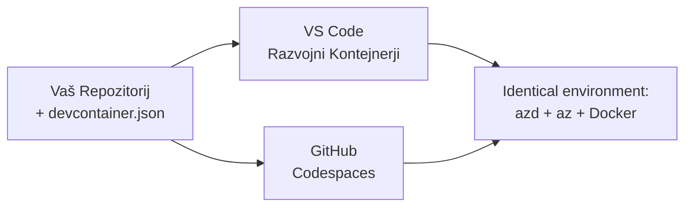

# Razvojni zabojniki in GitHub Codespaces za azd

**Naveščanje poglavij:**
- **📚 Domača stran tečaja**: [AZD za začetnike](../../README.md)
- **📖 Trenutno poglavje**: Poglavje 1 - Osnove in hiter začetek
- **⬅️ Prejšnje**: [Prinesi svojo aplikacijo](bring-your-own-app.md)
- **🚀 Naslednje poglavje**: [Poglavje 2: AI-prvi razvoj](../chapter-02-ai-development/README.md)

> Preverjeno z `azd 1.27.1` julija 2026.

## Uvod

Namestitev azd, ustreznega jezikovnega izvajalnika, Dockerja in Azure CLI-je na vsako napravo je nadležno opravilo — in to je glavni razlog, da vodič, ki "deluje na mojem računalniku", ne uspe za drugega. **Razvojni zabojnik** to reši tako, da opiše celoten vaš niz orodij v datoteki. Kdor koli odpre projekt v VS Code ali GitHub Codespaces dobi natanko enako okolje z že nameščenim azd. Ta lekcija vam pokaže, kako dodati enega.

## Cilji učenja

Do konca te lekcije boste:
- Razumeli, kaj je razvojni zabojnik in zakaj pomaga pri azd
- Dodali minimalno `.devcontainer/devcontainer.json` v projekt
- Vključili azd, Azure CLI in Docker preko lastnosti razvojnega zabojnika
- Odprli projekt v GitHub Codespaces ali VS Code

## Izidi učenja

Po zaključku lekcije boste sposobni:
- Ustvariti `devcontainer.json` za azd projekt
- Dodati azd in Azure orodja brez ročnih nameščanj
- Zagnati `azd up` znotraj zabojnika ali Codespace-a

---

## Kaj je razvojni zabojnik?

Razvojni zabojnik je Docker-ju osnovano razvojno okolje, določeno z datoteko `.devcontainer/devcontainer.json` v vašem repozitoriju. Ko odprete projekt:

- **VS Code** (z razširitvijo Dev Containers) ustvari zabojnik in se nanj poveže.
- **GitHub Codespaces** ustvari isti zabojnik v oblaku in vam ponudi urejevalnik v brskalniku.

Tako ali tako vsak sodelujoči dobi enaka orodja — ni več poizvedb "ali si namestil azd?".



---

## 1. korak: Ustvarite datoteko devcontainer

Ustvarite `.devcontainer/devcontainer.json` v korenu vašega projekta:

```json
{
  "name": "azd-project",
  "image": "mcr.microsoft.com/devcontainers/base:bookworm",
  "features": {
    "ghcr.io/devcontainers/features/azure-cli:1": {},
    "ghcr.io/azure/azure-dev/azd:latest": {},
    "ghcr.io/devcontainers/features/docker-in-docker:2": {},
    "ghcr.io/devcontainers/features/node:1": {}
  },
  "customizations": {
    "vscode": {
      "extensions": [
        "ms-azuretools.azure-dev",
        "ms-azuretools.vscode-bicep"
      ]
    }
  },
  "forwardPorts": [3000],
  "postCreateCommand": "azd version"
}
```

Kaj posamezen del počne:

| Ključ | Namen |
|-------|-------|
| `image` | Osnovni operacijski sistem za zabojnik |
| `features` | Vnaprej pripravljeni namestitveni moduli — tukaj: Azure CLI, **azd**, Docker in Node.js |
| `customizations.vscode.extensions` | Samodejno namesti razširitve azd in Bicep za VS Code |
| `forwardPorts` | Izpostavi vrata vaše aplikacije v brskalniku |
| `postCreateCommand` | Izvede se enkrat po izdelavi zabojnika (tukaj, osnovni preizkus) |

> Funkcija `ghcr.io/azure/azure-dev/azd:latest` je uradni način za pridobitev azd v zabojniku. Za ponovljivost lahko določite točno različico (npr. `azd:1.27.1`).

---

## 2. korak: Ujemanje funkcije z jezikom vaše aplikacije

Zamenjajte funkcijo `node` s tisto, ki jo vaša aplikacija uporablja:

```jsonc
// Python project
"ghcr.io/devcontainers/features/python:1": {},

// .NET project
"ghcr.io/devcontainers/features/dotnet:2": {},

// Java project
"ghcr.io/devcontainers/features/java:1": {},

// Go project
"ghcr.io/devcontainers/features/go:1": {}
```

Funkcijo `docker-in-docker` obdržite, če je vaš `host` `containerapp`, `aks` ali karkoli, kar gradi zabojniško sliko — azd potrebuje Docker za gradnjo in potiskanje slik.

---

## 3. korak: Odprite zabojnik

**V VS Code:**
1. Namestite razširitev **Dev Containers**.
2. Odprite mapo projekta.
3. Ko se pojavi poziv, kliknite **Ponovno odpri v zabojniku** (ali zaženite *Dev Containers: Reopen in Container*).

**V GitHub Codespaces:**
1. Potisnite repozitorij na GitHub.
2. Kliknite **Code → Codespaces → Ustvari codespace na main**.
3. Počakajte, da se zabojnik sestavi — azd je pripravljen v terminalu.

---

## 4. korak: Namestitev iz znotraj zabojnika

Zabojnik vsebuje predhodno nameščen azd, zato običajni postopek deluje takoj:

```bash
azd auth login --use-device-code   # koda naprave je priročna v Codespaces
azd up
```

> **Zakaj `--use-device-code`?** V oddaljenem zabojniku ali Codespace-u ni lokalnega brskalnika za preusmeritev, zato je prijava z napravno kodo zanesljiva pot. Kodo boste prilepili v brskalnik, da dokončate prijavo.

---

## Pogoste pasti

| Past | Popravek |
|------|----------|
| `azd up` ne more sestaviti slike | Dodajte funkcijo `docker-in-docker` |
| Prijava v brskalniku se ustavi v Codespaces | Uporabite `azd auth login --use-device-code` |
| Orodja se razlikujejo med člani ekipe | Pritrdite različice funkcij (npr. `azd:1.27.1`) |
| Aplikacija ni dostopna v brskalniku | Dodajte vrata v `forwardPorts` |

---

## Povzetek

- Razvojni zabojnik naredi vaš azd nabor orodij reproducibilen za vse.
- Dodajte azd, Azure CLI in Docker preko lastnosti razvojnega zabojnika.
- Ujemite funkcijo jezika z vašo aplikacijo in obdržite `docker-in-docker` za gostitelje zabojnikov.
- Uporabljajte prijavo z napravo, ko delate znotraj Codespaces.

---

## 🔗 Navigacija

| Smer | Vir |
|------|-----|
| **Prejšnje** | [Prinesi svojo aplikacijo](bring-your-own-app.md) |
| **Domača stran poglavja** | [Poglavje 1: Osnove in hiter začetek](README.md) |
| **Naslednje poglavje** | [Poglavje 2: AI-prvi razvoj](../chapter-02-ai-development/README.md) |

## 📖 Povezani viri

- [Namestitev in nastavitev](installation.md)
- [Kramp lista ukazov](../../resources/cheat-sheet.md)
- [Uradna specifikacija razvojnih zabojnikov](https://containers.dev/)
- [Funkcija azd razvojnega zabojnika](https://github.com/Azure/azure-dev/tree/main/ext/devcontainer)

---

<!-- CO-OP TRANSLATOR DISCLAIMER START -->
**Omejitev odgovornosti**:
Ta dokument je bil preveden z uporabo AI prevajalske storitve [Co-op Translator](https://github.com/Azure/co-op-translator). Čeprav si prizadevamo za natančnost, vas prosimo, da upoštevate, da avtomatizirani prevodi lahko vsebujejo napake ali netočnosti. Izvirni dokument v njegovem izvirnem jeziku je treba obravnavati kot avtoritativni vir. Za kritične informacije je priporočljiv strokovni človeški prevod. Ne odgovarjamo za morebitna nesporazume ali napačne interpretacije, ki izhajajo iz uporabe tega prevoda.
<!-- CO-OP TRANSLATOR DISCLAIMER END -->