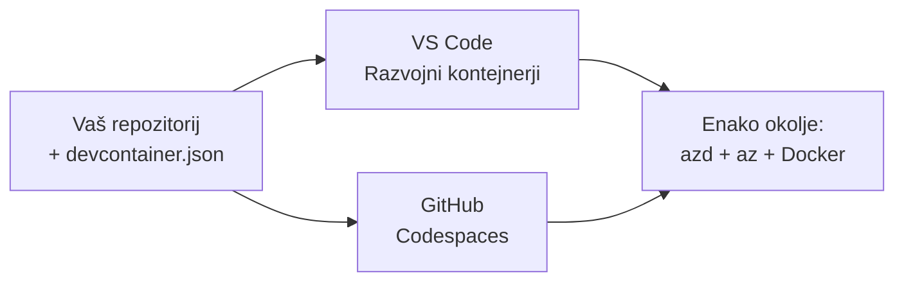

# Dev Containers & GitHub Codespaces za azd

**Navigacija poglavij:**
- **📚 Domača stran tečaja**: [AZD za začetnike](../../README.md)
- **📖 Trenutno poglavje**: Poglavje 1 - Osnove in hiter začetek
- **⬅️ Prejšnje**: [Prinesi svojo aplikacijo](bring-your-own-app.md)
- **🚀 Naslednje poglavje**: [Poglavje 2: Razvoj, osredotočen na AI](../chapter-02-ai-development/README.md)

> Preverjeno z `azd 1.25.6` junija 2026.

## Uvod

Namestitev azd, ustreznega runtime-a za jezik, Dockera in Azure CLI na vsakem računalniku je mukotrpno—in je glavni razlog, zakaj vodič, ki "deluje na mojem računalniku", ne deluje pri drugih. A **dev container** to reši tako, da v datoteki opiše celoten nabor orodij. Kdor koli odpre projekt v VS Code ali GitHub Codespaces, dobi enako okolje, z že nameščenim azd. Ta lekcija vam pokaže, kako ga dodati.

## Cilji učenja

Do konca te lekcije boste:
- Razumeli, kaj je dev container in zakaj pomaga pri azd
- Dodali minimalno `.devcontainer/devcontainer.json` v projekt
- Vključili azd, Azure CLI in Docker prek Dev Container *funkcij*
- Odprli projekt v GitHub Codespaces ali VS Code

## Rezultati učenja

Po zaključku te lekcije boste znali:
- Napisati `devcontainer.json` za projekt azd
- Dodati azd in Azure orodja brez ročnih namestitev
- Zagnati `azd up` znotraj kontejnerja ali Codespace-a

---

## Kaj je dev container?

Dev container je razvojno okolje, osnovano na Dockerju, definirano z datoteko `.devcontainer/devcontainer.json` v vašem repozitoriju. Ko odprete projekt:

- **VS Code** (z razširitvijo Dev Containers) zgradi kontejner in se nanj poveže.
- **GitHub Codespaces** zgradi isti kontejner v oblaku in vam zagotovi urejevalnik v brskalniku.

V vsakem primeru vsak prispevalec dobi enaka orodja—nič več iskanja napak v slogu "si namestil azd?".



---

## Korak 1: Ustvarite datoteko devcontainer

Ustvarite `.devcontainer/devcontainer.json` v korenu vašega projekta:

```json
{
  "name": "azd-project",
  "image": "mcr.microsoft.com/devcontainers/base:bookworm",
  "features": {
    "ghcr.io/devcontainers/features/azure-cli:1": {},
    "ghcr.io/azure/azure-dev/azd:latest": {},
    "ghcr.io/devcontainers/features/docker-in-docker:2": {},
    "ghcr.io/devcontainers/features/node:1": {}
  },
  "customizations": {
    "vscode": {
      "extensions": [
        "ms-azuretools.azure-dev",
        "ms-azuretools.vscode-bicep"
      ]
    }
  },
  "forwardPorts": [3000],
  "postCreateCommand": "azd version"
}
```

Kaj naredi vsak del:

| Ključ | Namen |
|-----|---------|
| `image` | Osnovni OS za kontejner |
| `features` | Vnaprej pripravljeni namestitveni paketi—tukaj: Azure CLI, **azd**, Docker in Node.js |
| `customizations.vscode.extensions` | Samodejno namesti razširitve za VS Code: azd in Bicep |
| `forwardPorts` | Odpre vrata vaše aplikacije v brskalnik |
| `postCreateCommand` | Zažene se enkrat po izgradnji kontejnerja (tukaj, kontrola delovanja) |

> Funkcija `ghcr.io/azure/azure-dev/azd:latest` je uradni način za pridobitev azd v kontejner. Za ponovljivost pripnite določeno različico (na primer `azd:1.25.6`).

---

## Korak 2: Uskladite funkcijo z jezikom vaše aplikacije

Zamenjajte funkcijo `node` z vsem, kar vaša aplikacija uporablja:

```jsonc
// Python project
"ghcr.io/devcontainers/features/python:1": {},

// .NET project
"ghcr.io/devcontainers/features/dotnet:2": {},

// Java project
"ghcr.io/devcontainers/features/java:1": {},

// Go project
"ghcr.io/devcontainers/features/go:1": {}
```

Ohranite `docker-in-docker`, če je vaš `host` `containerapp`, `aks` ali karkoli, kar gradi sliko kontejnerja—azd potrebuje Docker za gradnjo in potiskanje slik.

---

## Korak 3: Odprite ga

**V VS Code:**
1. Namestite razširitev **Dev Containers**.
2. Odprite mapo projekta.
3. Kliknite **Reopen in Container** ko se pojavi poziv (ali zaženite *Dev Containers: Reopen in Container*).

**V GitHub Codespaces:**
1. Potisnite repozitorij na GitHub.
2. Kliknite **Code → Codespaces → Create codespace on main**.
3. Počakajte, da se kontejner zgradi—azd je pripravljen v terminalu.

---

## Korak 4: Razmestitev iz znotraj kontejnerja

Kontejner ima azd že predhodno nameščen, zato običajen potek dela deluje brez težav:

```bash
azd auth login --use-device-code   # Koda naprave je uporabna v Codespacesu
azd up
```

> **Zakaj `--use-device-code`?** V oddaljenem kontejnerju ali Codespace-u ni lokalnega brskalnika za preusmeritev, zato je prijava z device-code zanesljiva pot. Kodo boste prilepili v zavihek brskalnika, da dokončate prijavo.

---

## Pogoste težave

| Težava | Rešitev |
|---------|-----|
| `azd up` ne more zgraditi slike | Dodajte funkcijo `docker-in-docker` |
| Prijava v brskalniku se zatakne v Codespaces | Uporabite `azd auth login --use-device-code` |
| Orodja se razlikujejo med člani ekipe | Pripnite različice funkcij (npr. `azd:1.25.6`) |
| Aplikacija ni dosegljiva v brskalniku | Dodajte vrata v `forwardPorts` |

---

## Povzetek

- Dev container naredi vaš azd nabor orodij ponovljiv za vse.
- Dodajte azd, Azure CLI in Docker preko Dev Container *funkcij*.
- Ujemite funkcijo za jezik z vašo aplikacijo in ohranite `docker-in-docker` za gostitelje kontejnerjev.
- Uporabite prijavo z device-code, ko tečete znotraj Codespaces.

---

## 🔗 Navigacija

| Smer | Viri |
|-----------|----------|
| **Prejšnje** | [Prinesi svojo aplikacijo](bring-your-own-app.md) |
| **Domača stran poglavja** | [Poglavje 1: Osnove in hiter začetek](README.md) |
| **Naslednje poglavje** | [Poglavje 2: Razvoj, osredotočen na AI](../chapter-02-ai-development/README.md) |

## 📖 Povezani viri

- [Namestitev in nastavitev](installation.md)
- [Povzetek ukazov](../../resources/cheat-sheet.md)
- [Uradna specifikacija Dev Containers](https://containers.dev/)
- [azd Dev Container funkcija](https://github.com/Azure/azure-dev/tree/main/ext/devcontainer)

---

<!-- CO-OP TRANSLATOR DISCLAIMER START -->
**Omejitev odgovornosti**:
Ta dokument je bil preveden z uporabo AI prevajalske storitve [Co-op Translator](https://github.com/Azure/co-op-translator). Čeprav si prizadevamo za natančnost, vas prosimo, da upoštevate, da avtomatizirani prevodi lahko vsebujejo napake ali netočnosti. Izvirni dokument v njegovem izvirnem jeziku je treba obravnavati kot avtoritativni vir. Za kritične informacije je priporočljiv strokovni človeški prevod. Ne odgovarjamo za morebitna nesporazume ali napačne interpretacije, ki izhajajo iz uporabe tega prevoda.
<!-- CO-OP TRANSLATOR DISCLAIMER END -->