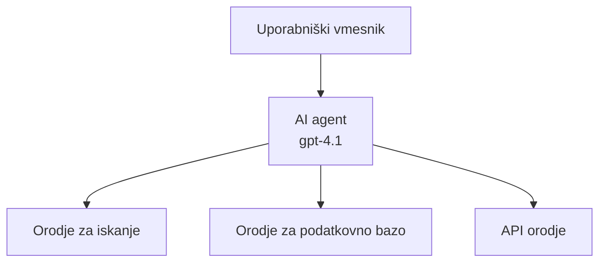
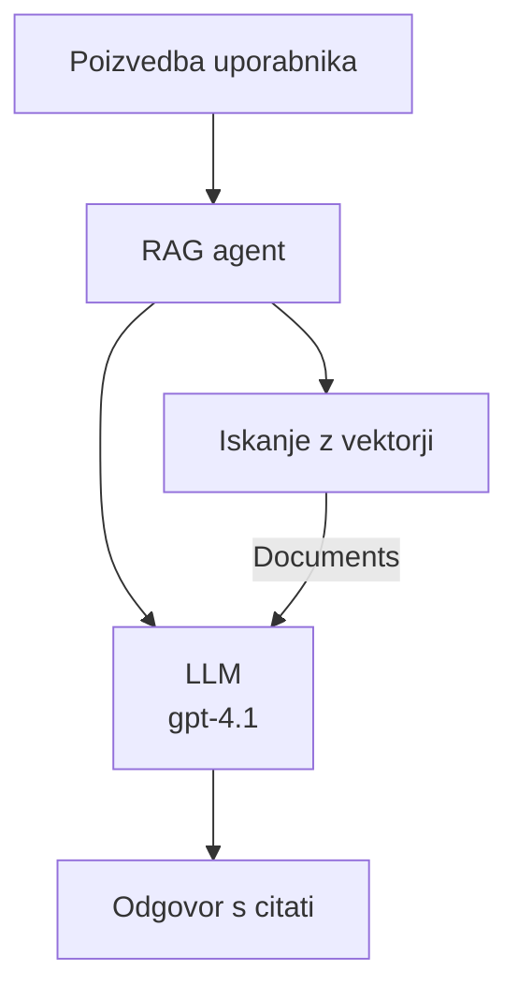
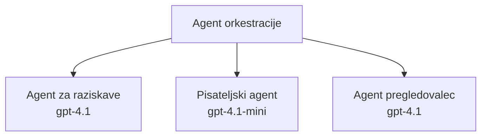

# AI agenti z Azure Developer CLI

**Navigacija po poglavju:**
- **📚 Domača stran tečaja**: [AZD za začetnike](../../README.md)
- **📖 Trenutno poglavje**: Poglavje 2 - AI-prvi razvoj
- **⬅️ Prejšnje**: [Microsoft Foundry integracija](microsoft-foundry-integration.md)
- **➡️ Naslednje**: [Implementacija AI modela](ai-model-deployment.md)
- **🚀 Napredno**: [Rešitve z več agenti](../../examples/retail-scenario.md)

---

## Uvod

AI agenti so samostojni programi, ki zaznavajo svoje okolje, sprejemajo odločitve in izvajajo dejanja za dosego določenih ciljev. V nasprotju z enostavnimi klepetalnimi boti, ki odgovarjajo na pozive, agenti lahko:

- **Uporabljajo orodja** - kličejo API-je, iščejo v podatkovnih bazah, izvršujejo kodo
- **Načrtujejo in razmišljajo** - razdelijo kompleksne naloge na korake
- **Se učijo iz konteksta** - ohranjajo spomin in prilagajajo vedenje
- **Sodelujejo** - delajo z drugimi agenti (sistemi z več agenti)

Ta vodič vam pokaže, kako implementirati AI agente v Azure z uporabo Azure Developer CLI (azd).

> **Opomba o potrditvi (2026-07-13):** Ta vodič je bil preverjen z `azd` `1.27.1` in `azure.ai.agents` `1.0.0-beta.5`. Izkušnja `azd ai` je še vedno v predogledu, zato preverite pomoč razširitve, če so vaši nameščeni zastavice drugačne.

## Cilji učenja

Z dokončanjem tega vodiča boste:
- Razumeli, kaj so AI agenti in kako se razlikujejo od klepetalnih botov
- Implementirali predpripravljene predloge AI agentov z AZD
- Konfigurirali Foundry agente za prilagojene agente
- Uporabili osnovne vzorce agentov (uporaba orodij, RAG, več agentov)
- Spremljali in odpravljali napake implementiranih agentov

## Rezultati učenja

Po zaključku boste zmožni:
- Implementirati aplikacije AI agentov v Azure z eno samo ukazno vrstico
- Konfigurirati agentna orodja in zmogljivosti
- Uporabiti generiranje z iskanjem dokumentov (RAG) z agenti
- Oblikovati arhitekture z več agenti za kompleksne delovne procese
- Odpraviti pogoste težave pri implementaciji agentov

---

## 🤖 Kaj naredi agenta drugačnega od klepetalnega bota?

| Lastnost | Klepetalni bot | AI agent |
|---------|---------------|----------|
| **Vedenje** | Odgovarja na pozive | Prevzema samostojna dejanja |
| **Orodja** | Brez | Lahko kliče API-je, išče, izvaja kodo |
| **Spomin** | Samo na sejo | Trajen spomin preko sej |
| **Načrtovanje** | Enkraten odgovor | Razmišljanje v več korakih |
| **Sodelovanje** | Ena entiteta | Lahko sodeluje z ostalimi agenti |

### Enostavna primerjava

- **Klepetalni bot** = Koristna oseba, ki odgovarja na vprašanja na informacijskem pultu
- **AI agent** = Osebni pomočnik, ki lahko kliče, rezervira sestanke in opravlja naloge za vas

---

## 🚀 Hiter začetek: Implementirajte prvega agenta

### Možnost 1: Predloga Foundry agentov (priporočeno)

```bash
# Inicializirajte predlogo AI agentov
azd init --template get-started-with-ai-agents

# Razmestite na Azure
azd up
```

**Kaj se implementira:**
- ✅ Foundry agenti
- ✅ Microsoft Foundry modeli (gpt-4.1)
- ✅ Azure AI Search (za RAG)
- ✅ Azure Container Apps (spletni vmesnik)
- ✅ Application Insights (nadzor)

**Čas:** ~15-20 minut
**Strošek:** ~$100-150/mesec (razvoj)

### Možnost 2: OpenAI agent s Prompty

```bash
# Inicializirajte predlogo agenta na osnovi Prompty
azd init --template agent-openai-python-prompty

# Namestite na Azure
azd up
```

**Kaj se implementira:**
- ✅ Azure Functions (izvajanje agentov brez strežnika)
- ✅ Microsoft Foundry modeli
- ✅ Konfiguracijske datoteke Prompty
- ✅ Vzorec implementacije agenta

**Čas:** ~10-15 minut
**Strošek:** ~$50-100/mesec (razvoj)

### Možnost 3: RAG klepetalni agent

```bash
# Inicializirajte RAG predlogo za klepet
azd init --template azure-search-openai-demo

# Namestite na Azure
azd up
```

**Kaj se implementira:**
- ✅ Microsoft Foundry modeli
- ✅ Azure AI Search z vzorčnimi podatki
- ✅ Procesni potek za dokumente
- ✅ Klepetalni vmesnik s citati

**Čas:** ~15-25 minut
**Strošek:** ~$80-150/mesec (razvoj)

### Možnost 4: AZD AI agent inicializacija (predogled na osnovi manifesta ali predloge)

Če imate datoteko manifesta agenta, lahko uporabite ukaz `azd ai` za neposredno ustvarjanje projekta Foundry Agent Service. Nove različice v predogledu so dodale tudi podporo za inicializacijo na osnovi predlog, tako da se natančen potek pozivov lahko nekoliko razlikuje glede na vašo nameščeno verzijo razširitve.

```bash
# Namestite razširitev AI agentov
azd extension install azure.ai.agents

# Neobvezno: preverite nameščeno predogledno različico
azd extension show azure.ai.agents

# Inicializirajte iz manifesta agenta
azd ai agent init -m agent-manifest.yaml

# Namestite v Azure
azd up

# Preizkusite nameščenega agenta (prikaže zakasnitev + čas do prvega bajta)
azd ai agent invoke
```

**Kdaj uporabiti `azd ai agent init` v primerjavi z `azd init --template`:**

| Pristop | Najbolj primerno za | Kako deluje |
|--------|-------------------|-------------|
| `azd init --template` | Začetek z delujočo vzorčno aplikacijo | Klonira celoten repozitorij predloge s kodo in infrastrukturo |
| `azd ai agent init -m` | Gradnja na lastnem manifestu agenta | Ustvari strukturo projekta iz vaše definicije agenta |

> **Namig:** Uporabite `azd init --template` pri učenju (možnosti 1-3 zgoraj). Uporabite `azd ai agent init` pri gradnji produkcijskih agentov z lastnimi manifesti.

Po ukazu `azd up` vas ista razširitev vodi skozi preostanek življenjskega cikla agenta: `azd ai agent invoke` za testiranje, `azd ai agent eval generate` in `azd ai agent optimize` za merjenje in izboljšanje kakovosti, ter `azd ai agent delete` za čiščenje okolja. Za celoten seznam ukazov glejte [AZD AI CLI ukaze](../chapter-08-production/production-ai-practices.md#azd-ai-cli-commands-and-extensions).

---

## 🏗️ Vzorec arhitekture agentov

### Vzorec 1: En agent z orodji

Najpreprostejši vzorec agenta - en agent, ki lahko uporablja več orodij.



**Najbolj primerno za:**
- Podporo strankam z botom
- Raziskovalne pomočnike
- Agente za analizo podatkov

**AZD predloga:** `azure-search-openai-demo`

### Vzorec 2: RAG agent (generiranje z iskanjem)

Agent, ki išče relevantne dokumente pred generiranjem odgovorov.



**Najbolj primerno za:**
- Podjetniške baze znanja
- Sisteme vprašanj in odgovorov na dokumente
- Računskopravno in pravno raziskovanje

**AZD predloga:** `azure-search-openai-demo`

### Vzorec 3: Sistem z več agenti

Več specializiranih agentov, ki sodelujejo pri kompleksnih nalogah.



**Najbolj primerno za:**
- Kompleksno generiranje vsebin
- Delovne procese v več korakih
- Naloge, ki zahtevajo različne strokovnjake

**Več informacij:** [Vzorec koordinacije več agentov](../chapter-06-pre-deployment/coordination-patterns.md)

---

## ⚙️ Konfiguracija orodij agentov

Agent postane močan, ko lahko uporablja orodja. Tukaj je, kako konfigurirati pogosta orodja:

### Konfiguracija orodij v Foundry agentih

```python
# agent_config.py
from azure.ai.projects import AIProjectClient
from azure.ai.projects.models import FunctionTool, CodeInterpreterTool

# Določi prilagojena orodja
search_tool = FunctionTool(
    name="search_knowledge_base",
    description="Search the company knowledge base for relevant documents",
    parameters={
        "type": "object",
        "properties": {
            "query": {
                "type": "string",
                "description": "The search query"
            }
        },
        "required": ["query"]
    }
)

# Ustvari agenta z orodji
agent = project_client.agents.create_agent(
    model="gpt-4.1",
    name="Support Agent",
    instructions="You are a helpful support agent. Use the search tool to find relevant information.",
    tools=[search_tool, CodeInterpreterTool()]
)
```

### Konfiguracija okolja

```bash
# Nastavite okoljske spremenljivke, specifične za agenta
azd env set AZURE_OPENAI_MODEL "gpt-4.1"
azd env set AGENT_INSTRUCTIONS "You are a helpful assistant..."
azd env set ENABLE_CODE_INTERPRETER "true"
azd env set ENABLE_FILE_SEARCH "true"

# Namestite z posodobljeno konfiguracijo
azd deploy
```

---

## 📊 Spremljanje agentov

### Integracija Application Insights

Vse AZD predloge agentov vključujejo Application Insights za spremljanje:

```bash
# Odpri nadzorno ploščo za spremljanje
azd monitor --overview

# Ogled v živo zapisnikov
azd monitor --logs

# Ogled v živo meritev
azd monitor --live
```

### Ključni kazalniki za spremljanje

| Kazalnik | Opis | Cilj |
|---------|------|------|
| Zakasnitev odgovora | Čas za generiranje odgovora | < 5 sekund |
| Poraba žetonov | Žetoni na zahtevo | Spremljajte zaradi stroškov |
| Uspešnost klicev orodij | % uspešnih izvedb orodij | > 95% |
| Stopnja napak | Neuspešni agentni zahtevki | < 1% |
| Zadovoljstvo uporabnikov | Ocene povratnih informacij | > 4.0/5.0 |

### Prilagojeno beleženje za agente

```python
import os
from azure.monitor.opentelemetry import configure_azure_monitor
from opentelemetry import trace

# Konfigurirajte Azure Monitor z OpenTelemetry
configure_azure_monitor(
    connection_string=os.environ["APPLICATIONINSIGHTS_CONNECTION_STRING"]
)

tracer = trace.get_tracer(__name__)

def log_agent_interaction(user_query, agent_response, tools_used, latency_ms):
    with tracer.start_as_current_span("agent_interaction") as span:
        span.set_attributes({
            "user_query": user_query,
            "response_length": len(agent_response),
            "tools_used": tools_used,
            "latency_ms": latency_ms
        })
```

> **Opomba:** Namestite potrebne pakete: `pip install azure-monitor-opentelemetry opentelemetry`

---

## 💰 Stroški upoštevanja

### Ocenjeni mesečni stroški po vzorcih

| Vzorec | Dev okolje | Produkcija |
|--------|------------|------------|
| En agent | $50-100 | $200-500 |
| RAG agent | $80-150 | $300-800 |
| Več agentov (2-3 agenti) | $150-300 | $500-1,500 |
| Podjetniški več agentov | $300-500 | $1,500-5,000+ |

### Nasveti za optimizacijo stroškov

1. **Uporabite gpt-4.1-mini za enostavne naloge**
   ```bash
   azd env set AZURE_OPENAI_MODEL "gpt-4.1-mini"
   ```

2. **Uvedite predpomnjenje za ponovljene poizvedbe**
   ```python
   from functools import lru_cache
   
   @lru_cache(maxsize=1000)
   def get_cached_response(query_hash):
       return agent.run(query_hash)
   ```

3. **Nastavite omejitve žetonov na izvajanje**
   ```python
   # Nastavite max_completion_tokens pri zagonu agenta, ne med ustvarjanjem
   run = project_client.agents.create_run(
       thread_id=thread.id,
       agent_id=agent.id,
       max_completion_tokens=1000  # Omejite dolžino odgovora
   )
   ```

4. **Prilagodite na nič, ko ni uporabe**
   ```bash
   # Aplikacije v vsebnikih se samodejno skalirajo na nič
   azd env set MIN_REPLICAS "0"
   ```

---

## 🔧 Odpravljanje težav z agenti

### Pogoste težave in rešitve

<details>
<summary><strong>❌ Agent ne odgovarja na klice orodij</strong></summary>

```bash
# Preverite, ali so orodja pravilno registrirana
azd show

# Preverite namestitev OpenAI
az cognitiveservices account deployment list \
  --name $AZURE_OPENAI_NAME \
  --resource-group $RG_NAME

# Preverite dnevnike agenta
azd monitor --logs
```

**Pogosti vzroki:**
- Neskladnost funkcijske podpisa orodja
- Manjkajo dovoljenja
- API končni točki nista dostopni
</details>

<details>
<summary><strong>❌ Visoka zakasnitev pri odgovorih agenta</strong></summary>

```bash
# Preverite Application Insights za ozka grla
azd monitor --live

# Razmislite o uporabi hitrejšega modela
azd env set AZURE_OPENAI_MODEL "gpt-4.1-mini"
azd deploy
```

**Nasveti za optimizacijo:**
- Uporabite pretočne (streaming) odgovore
- Uvedite predpomnjenje odgovorov
- Zmanjšajte velikost kontekstnega okna
</details>

<details>
<summary><strong>❌ Agent vrača napačne ali izmišljene informacije</strong></summary>

```python
# Izboljšajte z boljšimi sistemskimi pozivi
instructions = """
You are a helpful assistant. IMPORTANT:
- Only answer based on provided context
- If you don't know, say "I don't know"
- Always cite your sources
- Never make up information
"""

# Dodajte iskanje za utemeljitev
agent = project_client.agents.create_agent(
    model="gpt-4.1",
    instructions=instructions,
    tools=[FileSearchTool()]  # Utemeljite odzive v dokumentih
)
```
</details>

<details>
<summary><strong>❌ Napake zaradi preseganja omejitve žetonov</strong></summary>

```python
# Implementiraj upravljanje kontekstnega okna
def truncate_context(messages, max_tokens=8000, model="gpt-4.1"):
    """Keep only recent messages within token limit."""
    import tiktoken
    encoding = tiktoken.encoding_for_model(model)
    total_tokens = 0
    truncated = []
    
    for msg in reversed(messages):
        msg_tokens = len(encoding.encode(msg.content))
        if total_tokens + msg_tokens > max_tokens:
            break
        truncated.insert(0, msg)
        total_tokens += msg_tokens
    
    return truncated
```
</details>

---

## 🎓 Praktične vaje

### Vaja 1: Implementirajte osnovnega agenta (20 minut)

**Cilj:** Implementirajte svojega prvega AI agenta z AZD

```bash
# Korak 1: Inicializirajte predlogo
azd init --template get-started-with-ai-agents

# Korak 2: Prijava v Azure
azd auth login
# Če delate prek več najemnikov, dodajte --tenant-id <tenant-id>

# Korak 3: Namestitev
azd up

# Korak 4: Preizkusite agent
# Pričakovani rezultat po namestitvi:
#   Namestitev zaključena!
#   Končna točka: https://<ime-aplikacije>.<regija>.azurecontainerapps.io
# Odprite URL, prikazan v izhodu, in poskusite zastaviti vprašanje

# Korak 5: Pregled monitoringa
azd monitor --overview

# Korak 6: Čiščenje
azd down --force --purge
```

**Kriteriji uspeha:**
- [ ] Agent odgovarja na vprašanja
- [ ] Dostop do nadzorne plošče z `azd monitor`
- [ ] Viri so uspešno počisti

### Vaja 2: Dodajte prilagojeno orodje (30 minut)

**Cilj:** Razširite agenta s prilagojenim orodjem

1. Implementirajte predlogo agenta:
   ```bash
   azd init --template get-started-with-ai-agents
   azd up
   ```
2. Ustvarite novo funkcijo orodja v kodi agenta:
   ```python
   def get_weather(location: str) -> str:
       """Get current weather for a location."""
       # Klic API za vremensko storitev
       return f"Weather in {location}: Sunny, 72°F"
   ```
3. Registrirajte orodje pri agentu:
   ```python
   from azure.ai.projects.models import FunctionTool

   weather_tool = FunctionTool(
       name="get_weather",
       description="Get current weather for a location",
       parameters={
           "type": "object",
           "properties": {
               "location": {"type": "string", "description": "City name"}
           },
           "required": ["location"]
       }
   )

   agent = project_client.agents.create_agent(
       model="gpt-4.1",
       name="Weather Agent",
       tools=[weather_tool]
   )
   ```
4. Ponovno implementirajte in testirajte:
   ```bash
   azd deploy
   # Vprašaj: "Kakšno je vreme v Seattlu?"
   # Pričakovano: Agent pokliče get_weather("Seattle") in vrne vremenske podatke
   ```

**Kriteriji uspeha:**
- [ ] Agent prepozna poizvedbe, vezane na vreme
- [ ] Orodje se pravilno kliče
- [ ] Odgovor vključuje vremenske informacije

### Vaja 3: Ustvarite RAG agenta (45 minut)

**Cilj:** Ustvarite agenta, ki odgovarja na vprašanja iz vaših dokumentov

```bash
# Korak 1: Namestite predlogo RAG
azd init --template azure-search-openai-demo
azd up

# Korak 2: Naložite svoje dokumente
# Postavite PDF/TXT datoteke v imenik data/, nato zaženite:
python scripts/prepdocs.py

# Korak 3: Preizkusite z vprašanji, specifičnimi za domeno
# Odprite URL spletne aplikacije iz izhoda azd up
# Postavite vprašanja o vaših naloženih dokumentih
# Odgovori naj vključujejo reference na citate, kot so [doc.pdf]
```

**Kriteriji uspeha:**
- [ ] Agent odgovarja iz naloženih dokumentov
- [ ] Odgovori vključujejo citate
- [ ] Brez halucinacij pri vprašanjih izven obsega

---

## 📚 Naslednji koraki

Sedaj, ko razumete AI agente, raziščite ta napredna področja:

| Tema | Opis | Povezava |
|-------|-------|---------|
| **Sistemi z več agenti** | Gradnja sistemov z več sodelujočimi agenti | [Primer večagentne maloprodaje](../../examples/retail-scenario.md) |
| **Vzorec koordinacije** | Spoznajte vzorce orkestracije in komunikacije | [Vzorec koordinacije](../chapter-06-pre-deployment/coordination-patterns.md) |
| **Produkcijska implementacija** | Implementacija agentov primerna za podjetja | [Produkcijske prakse AI](../chapter-08-production/production-ai-practices.md) |
| **Evalvacija agentov** | Testiranje in vrednotenje zmogljivosti agentov | [Odpravljanje težav z AI](../chapter-07-troubleshooting/ai-troubleshooting.md) |
| **AI delavnica** | Praktično: Pripravite svojo AI rešitev z AZD | [AI delavnica](ai-workshop-lab.md) |

---

## 📖 Dodatni viri

### Uradna dokumentacija
- [Microsoft Foundry Agent Service](https://learn.microsoft.com/azure/ai-services/agents/)
- [Microsoft Foundry Agent Service hitro začetek](https://learn.microsoft.com/azure/ai-services/agents/quickstart)
- [Semantic Kernel agentni okvir](https://learn.microsoft.com/semantic-kernel/)

### AZD predloge za agente
- [Začni z AI agenti](https://github.com/Azure-Samples/get-started-with-ai-agents)
- [Agent OpenAI Python Prompty](https://github.com/Azure-Samples/agent-openai-python-prompty)
- [Azure Search OpenAI demo](https://github.com/Azure-Samples/azure-search-openai-demo)

### Skupnostni viri
- [Awesome AZD - agentne predloge](https://azure.github.io/awesome-azd/?tags=ai-agents)
- [Azure AI Discord](https://discord.gg/microsoft-azure)
- [Microsoft Foundry Discord](https://discord.gg/nTYy5BXMWG)

### Agentne veščine za vaš urejevalnik
- [**Microsoft Azure agentne veščine**](https://skills.sh/microsoft/github-copilot-for-azure) - Namestite ponovno uporabne AI agentne veščine za Azure razvoj v GitHub Copilot, Cursor ali katerikoli podprt agent. Vključuje veščine za [Azure AI](https://skills.sh/microsoft/github-copilot-for-azure/azure-ai), [Microsoft Foundry](https://skills.sh/microsoft/github-copilot-for-azure/microsoft-foundry), [implementacijo](https://skills.sh/microsoft/github-copilot-for-azure/azure-deploy) in [diagnostiko](https://skills.sh/microsoft/github-copilot-for-azure/azure-diagnostics):
  ```bash
  npx skills add microsoft/github-copilot-for-azure
  ```

---

**Navigacija**
- **Prejšnja lekcija**: [Microsoft Foundry integracija](microsoft-foundry-integration.md)
- **Naslednja lekcija**: [Implementacija AI modela](ai-model-deployment.md)

---

<!-- CO-OP TRANSLATOR DISCLAIMER START -->
**Omejitev odgovornosti**:
Ta dokument je bil preveden z uporabo AI prevajalske storitve [Co-op Translator](https://github.com/Azure/co-op-translator). Čeprav si prizadevamo za natančnost, vas prosimo, da upoštevate, da avtomatizirani prevodi lahko vsebujejo napake ali netočnosti. Izvirni dokument v njegovem izvirnem jeziku je treba obravnavati kot avtoritativni vir. Za kritične informacije je priporočljiv strokovni človeški prevod. Ne odgovarjamo za morebitna nesporazume ali napačne interpretacije, ki izhajajo iz uporabe tega prevoda.
<!-- CO-OP TRANSLATOR DISCLAIMER END -->