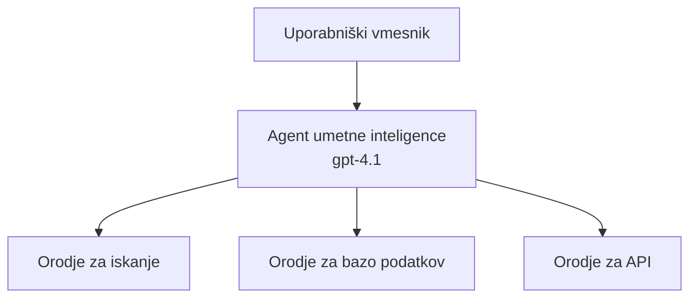
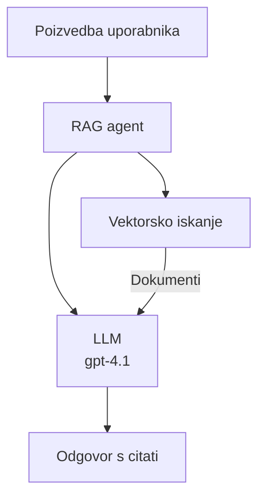
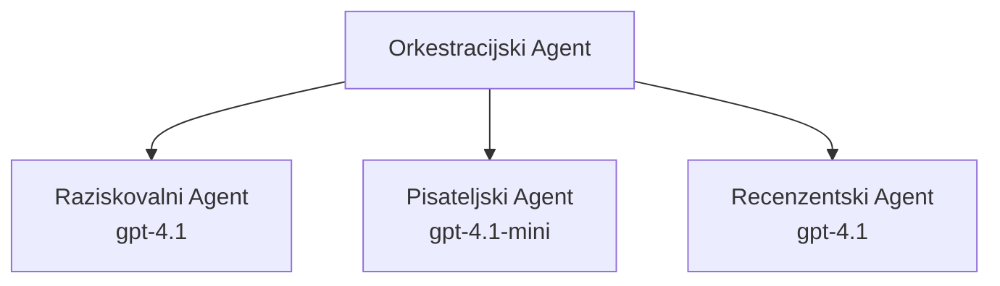

# AI agenti z Azure Developer CLI

**Navigacija poglavij:**
- **📚 Domača stran tečaja**: [AZD za začetnike](../../README.md)
- **📖 Trenutno poglavje**: Poglavje 2 - Razvoj, usmerjen na AI
- **⬅️ Prejšnje**: [Integracija Microsoft Foundry](microsoft-foundry-integration.md)
- **➡️ Naslednje**: [Uvajanje AI modela](ai-model-deployment.md)
- **🚀 Napredno**: [Rešitve z več agenti](../../examples/retail-scenario.md)

---

## Uvod

AI agenti so avtonomni programi, ki lahko zaznavajo svoje okolje, sprejemajo odločitve in izvajajo dejanja za dosego določenih ciljev. V nasprotju z enostavnimi klepetalniki, ki odgovarjajo na pozive, lahko agenti:

- **Uporabljajo orodja** - kličejo API-je, iščejo v zbirkah podatkov, izvajajo kodo
- **Načrtujejo in razmišljajo** - razbijejo kompleksne naloge na korake
- **Se učijo iz konteksta** - ohranjajo spomin in prilagajajo vedenje
- **Sodelujejo** - delajo z drugimi agenti (sistemi z več agenti)

Ta vodič prikazuje, kako razmestiti AI agente v Azure z uporabo Azure Developer CLI (azd).

> **Opomba o preverjanju (2026-03-25):** Ta vodnik je bil pregledan z `azd` `1.23.12` in `azure.ai.agents` `0.1.18-preview`. Izkušnja `azd ai` je še v predogledu, zato preverite pomoč razširitve, če se vaše nameščene zastavice razlikujejo.

## Cilji učenja

Z dokončanjem tega vodnika boste:
- Razumeli, kaj so AI agenti in kako se razlikujejo od klepetalnikov
- Razmestili vnaprej pripravljene predloge AI agentov z uporabo AZD
- Konfigurirali Foundry agente za po meri narejene agente
- Implementirali osnovne vzorce agentov (uporaba orodij, RAG, večagentni sistemi)
- Spremljali in odpravljali napake pri razmestitvi agentov

## Izidi učenja

Po zaključenem vodniku boste sposobni:
- Razmestiti aplikacije AI agentov v Azure z eno samo ukazno vrstico
- Konfigurirati orodja in zmogljivosti agentov
- Implementirati retrieval-augmented generation (RAG) z agenti
- Oblikovati večagentne arhitekture za kompleksne delovne tokove
- Odpravljati pogoste težave pri razmestitvi agentov

---

## 🤖 Kaj loči agenta od klepetalnika?

| Lastnost | Klepetalnik | AI agent |
|---------|---------|----------|
| **Vedenje** | Odgovarja na pozive | Izvaja avtonomna dejanja |
| **Orodja** | Nobena | Lahko kliče API-je, išče, izvaja kodo |
| **Spomin** | Samo sejninski | Trajen spomin čez seje |
| **Načrtovanje** | Enkraten odgovor | Večstopenjsko razmišljanje |
| **Sodelovanje** | Ena entiteta | Lahko dela z drugimi agenti |

### Preprosta primerjava

- **Klepetalnik** = Uporaben osebek, ki odgovarja na vprašanja na informacijskem pultu
- **AI Agent** = Osebni asistent, ki lahko kliče, rezervira termine in opravlja naloge za vas

---

## 🚀 Hitri začetek: Uvedite svojega prvega agenta

### Možnost 1: Predloga Foundry Agents (priporočeno)

```bash
# Inicializiraj predlogo za AI agente
azd init --template get-started-with-ai-agents

# Razporedi v Azure
azd up
```

**Kaj se namesti:**
- ✅ Foundry Agents
- ✅ Microsoft Foundry Models (gpt-4.1)
- ✅ Azure AI Search (za RAG)
- ✅ Azure Container Apps (spletni vmesnik)
- ✅ Application Insights (spremljanje)

**Čas:** ~15-20 minut
**Stroški:** ~$100-150/mesec (razvoj)

### Možnost 2: OpenAI agent s Prompty

```bash
# Inicializirajte predlogo agenta, ki temelji na Prompty
azd init --template agent-openai-python-prompty

# Namestite v Azure
azd up
```

**Kaj se namesti:**
- ✅ Azure Functions (serverless izvajanje agenta)
- ✅ Microsoft Foundry Models
- ✅ Konfiguracijske datoteke Prompty
- ✅ Primer implementacije agenta

**Čas:** ~10-15 minut
**Stroški:** ~$50-100/mesec (razvoj)

### Možnost 3: RAG klepetalni agent

```bash
# Inicializiraj predlogo za RAG klepet
azd init --template azure-search-openai-demo

# Razporedi na Azure
azd up
```

**Kaj se namesti:**
- ✅ Microsoft Foundry Models
- ✅ Azure AI Search s primeri podatkov
- ✅ Pipeline za obdelavo dokumentov
- ✅ Klepetalni vmesnik s citati

**Čas:** ~15-25 minut
**Stroški:** ~$80-150/mesec (razvoj)

### Možnost 4: AZD AI Agent Init (predogled na podlagi manifesta ali predloge)

Če imate datoteko manifesta agenta, lahko s ukazom `azd ai` ustvarite projekt Foundry Agent Service neposredno. Nedavne predogledne izdaje so dodale tudi podporo za inicializacijo na podlagi predlog, zato se lahko točen potek pozivov nekoliko razlikuje glede na nameščeno različico razširitve.

```bash
# Namestite razširitev za AI agente
azd extension install azure.ai.agents

# Izbirno: preverite nameščeno predogledno različico
azd extension show azure.ai.agents

# Inicializirajte iz manifesta agenta
azd ai agent init -m agent-manifest.yaml

# Razmestite v Azure
azd up
```

**Kdaj uporabiti `azd ai agent init` vs `azd init --template`:**

| Pristop | Najbolj primerno za | Kako deluje |
|----------|----------|------|
| `azd init --template` | Začetek iz delujoče vzorčne aplikacije | Klonira celoten repozitorij s predlogo z kodo + infrastrukturo |
| `azd ai agent init -m` | Gradnja iz lastnega manifesta agenta | Ustvari ogrodje strukture projekta iz vaše definicije agenta |

> **Namig:** Uporabite `azd init --template`, ko se učite (Možnosti 1-3 zgoraj). Uporabite `azd ai agent init`, ko gradite produkcijske agente z lastnimi manifesti. Oglejte si [AZD AI CLI Commands](../chapter-08-production/production-ai-practices.md#azd-ai-cli-commands-and-extensions) za celoten referenčni vodnik.

---

## 🏗️ Vzorce arhitekture agentov

### Vzorec 1: Samostojen agent z orodji

Najpreprostejši vzorec agenta - en agent, ki lahko uporablja več orodij.


**Najbolj primeren za:**
- Pomočnike za podporo strankam
- Raziskovalne asistente
- Agente za analizo podatkov

**AZD predloga:** `azure-search-openai-demo`

### Vzorec 2: RAG agent (retrieval-augmented generation)

Agent, ki pridobi relevantne dokumente pred generiranjem odgovorov.


**Najbolj primeren za:**
- Podjetne baze znanja
- Sisteme Q&A nad dokumenti
- Skladnost in pravne raziskave

**AZD predloga:** `azure-search-openai-demo`

### Vzorec 3: Večagentni sistem

Več specializiranih agentov, ki skupaj delujejo pri kompleksnih nalogah.


**Najbolj primeren za:**
- Kompleksno generiranje vsebin
- Večstopenjske delovne tokove
- Naloge, ki zahtevajo različne strokovnjake

**Več informacij:** [Vzorec koordinacije več agentov](../chapter-06-pre-deployment/coordination-patterns.md)

---

## ⚙️ Konfiguriranje orodij agentov

Agenti postanejo zmogljivi, ko lahko uporabljajo orodja. Tukaj je, kako konfigurirati pogosta orodja:

### Konfiguracija orodij v Foundry agentih

```python
# agent_config.py
from azure.ai.projects import AIProjectClient
from azure.ai.projects.models import FunctionTool, CodeInterpreterTool

# Definiraj prilagojena orodja
search_tool = FunctionTool(
    name="search_knowledge_base",
    description="Search the company knowledge base for relevant documents",
    parameters={
        "type": "object",
        "properties": {
            "query": {
                "type": "string",
                "description": "The search query"
            }
        },
        "required": ["query"]
    }
)

# Ustvari agenta z orodji
agent = project_client.agents.create_agent(
    model="gpt-4.1",
    name="Support Agent",
    instructions="You are a helpful support agent. Use the search tool to find relevant information.",
    tools=[search_tool, CodeInterpreterTool()]
)
```

### Konfiguracija okolja

```bash
# Nastavite spremenljivke okolja, specifične za agenta
azd env set AZURE_OPENAI_MODEL "gpt-4.1"
azd env set AGENT_INSTRUCTIONS "You are a helpful assistant..."
azd env set ENABLE_CODE_INTERPRETER "true"
azd env set ENABLE_FILE_SEARCH "true"

# Namesti z posodobljeno konfiguracijo
azd deploy
```

---

## 📊 Spremljanje agentov

### Integracija z Application Insights

Vse AZD predloge agentov vključujejo Application Insights za spremljanje:

```bash
# Odpri nadzorno ploščo za spremljanje
azd monitor --overview

# Prikaži dnevniške zapise v živo
azd monitor --logs

# Prikaži metrike v živo
azd monitor --live
```

### Ključne metrike za spremljanje

| Metrika | Opis | Cilj |
|--------|-------------|--------|
| Zakasnitev odgovora | Čas za ustvarjanje odgovora | < 5 sekund |
| Poraba žetonov | Žetoni na zahtevo | Spremljajte zaradi stroškov |
| Stopnja uspešnih klicev orodij | % uspešnih izvedb orodij | > 95% |
| Stopnja napak | Neuspešne zahteve agenta | < 1% |
| Zadovoljstvo uporabnikov | Ocene povratnih informacij | > 4.0/5.0 |

### Prilagojeno beleženje za agente

```python
import os
from azure.monitor.opentelemetry import configure_azure_monitor
from opentelemetry import trace

# Konfigurirajte Azure Monitor z OpenTelemetry
configure_azure_monitor(
    connection_string=os.environ["APPLICATIONINSIGHTS_CONNECTION_STRING"]
)

tracer = trace.get_tracer(__name__)

def log_agent_interaction(user_query, agent_response, tools_used, latency_ms):
    with tracer.start_as_current_span("agent_interaction") as span:
        span.set_attributes({
            "user_query": user_query,
            "response_length": len(agent_response),
            "tools_used": tools_used,
            "latency_ms": latency_ms
        })
```

> **Opomba:** Namestite zahtevane pakete: `pip install azure-monitor-opentelemetry opentelemetry`

---

## 💰 Razmisleki o stroških

### Ocenjeni mesečni stroški po vzorcu

| Vzorec | Razvojno okolje | Produkcija |
|---------|-----------------|------------|
| Samostojen agent | $50-100 | $200-500 |
| RAG agent | $80-150 | $300-800 |
| Večagentni (2-3 agenti) | $150-300 | $500-1,500 |
| Podjetniški večagentni | $300-500 | $1,500-5,000+ |

### Nasveti za optimizacijo stroškov

1. **Uporabite gpt-4.1-mini za preproste naloge**
   ```bash
   azd env set AZURE_OPENAI_MODEL "gpt-4.1-mini"
   ```

2. **Implementirajte predpomnjenje za ponovljena vprašanja**
   ```python
   from functools import lru_cache
   
   @lru_cache(maxsize=1000)
   def get_cached_response(query_hash):
       return agent.run(query_hash)
   ```

3. **Nastavite omejitve žetonov na zagon**
   ```python
   # Nastavite max_completion_tokens pri zagonu agenta, ne med ustvarjanjem
   run = project_client.agents.create_run(
       thread_id=thread.id,
       agent_id=agent.id,
       max_completion_tokens=1000  # Omejite dolžino odgovora
   )
   ```

4. **Skalirajte na nič, ko ni uporabe**
   ```bash
   # Container Apps se samodejno skalirajo na nič
   azd env set MIN_REPLICAS "0"
   ```

---

## 🔧 Odpravljanje težav z agenti

### Pogoste težave in rešitve

<details>
<summary><strong>❌ Agent ne odgovarja na klice orodij</strong></summary>

```bash
# Preverite, ali so orodja pravilno registrirana
azd show

# Preverite namestitev OpenAI
az cognitiveservices account deployment list \
  --name $AZURE_OPENAI_NAME \
  --resource-group $RG_NAME

# Preverite dnevnike agenta
azd monitor --logs
```

**Pogosti vzroki:**
- Neskladje v podpisu funkcije orodja
- Manjkajo potrebna dovoljenja
- API končna točka ni dostopna
</details>

<details>
<summary><strong>❌ Visoka zakasnitev pri odzivih agenta</strong></summary>

```bash
# Preverite Application Insights zaradi ozkih grl
azd monitor --live

# Premislite o uporabi hitrejšega modela
azd env set AZURE_OPENAI_MODEL "gpt-4.1-mini"
azd deploy
```

**Nasveti za optimizacijo:**
- Uporabite pretakanje odgovorov
- Implementirajte predpomnjenje odgovorov
- Zmanjšajte velikost kontekstnega okna
</details>

<details>
<summary><strong>❌ Agent vrača netočne ali izmišljene informacije</strong></summary>

```python
# Izboljšati z boljšimi sistemskimi pozivi
instructions = """
You are a helpful assistant. IMPORTANT:
- Only answer based on provided context
- If you don't know, say "I don't know"
- Always cite your sources
- Never make up information
"""

# Dodajte iskanje za utemeljitev
agent = project_client.agents.create_agent(
    model="gpt-4.1",
    instructions=instructions,
    tools=[FileSearchTool()]  # Utemeljite odgovore v dokumentih
)
```
</details>

<details>
<summary><strong>❌ Napake zaradi prekoračitve omejitve tokenov</strong></summary>

```python
# Implementiraj upravljanje kontekstnega okna
def truncate_context(messages, max_tokens=8000, model="gpt-4.1"):
    """Keep only recent messages within token limit."""
    import tiktoken
    encoding = tiktoken.encoding_for_model(model)
    total_tokens = 0
    truncated = []
    
    for msg in reversed(messages):
        msg_tokens = len(encoding.encode(msg.content))
        if total_tokens + msg_tokens > max_tokens:
            break
        truncated.insert(0, msg)
        total_tokens += msg_tokens
    
    return truncated
```
</details>

---

## 🎓 Praktične vaje

### Vaja 1: Uvedite osnovnega agenta (20 minut)

**Cilj:** Uvedite svoj prvi AI agent z AZD

```bash
# Korak 1: Inicializirajte predlogo
azd init --template get-started-with-ai-agents

# Korak 2: Prijavite se v Azure
azd auth login
# Če delate prek več najemnikov, dodajte --tenant-id <tenant-id>

# Korak 3: Razmestite
azd up

# Korak 4: Preizkusite agenta
# Pričakovani izhod po razmestitvi:
#   Razmestitev končana!
#   Končna točka: https://<app-name>.<region>.azurecontainerapps.io
# Odprite URL, prikazan v izhodu, in poskusite postaviti vprašanje

# Korak 5: Ogled nadzora
azd monitor --overview

# Korak 6: Počistite
azd down --force --purge
```

**Merila uspeha:**
- [ ] Agent odgovarja na vprašanja
- [ ] Dostop do nadzorne plošče za spremljanje preko `azd monitor`
- [ ] Viri uspešno odstranjeni

### Vaja 2: Dodajte lastno orodje (30 minut)

**Cilj:** Razširite agenta z lastnim orodjem

1. Uvedite predlogo agenta:
   ```bash
   azd init --template get-started-with-ai-agents
   azd up
   ```
2. Ustvarite novo funkcijo orodja v kodi agenta:
   ```python
   def get_weather(location: str) -> str:
       """Get current weather for a location."""
       # Klic API-ja na vremensko storitev
       return f"Weather in {location}: Sunny, 72°F"
   ```
3. Registrirajte orodje v agentu:
   ```python
   from azure.ai.projects.models import FunctionTool

   weather_tool = FunctionTool(
       name="get_weather",
       description="Get current weather for a location",
       parameters={
           "type": "object",
           "properties": {
               "location": {"type": "string", "description": "City name"}
           },
           "required": ["location"]
       }
   )

   agent = project_client.agents.create_agent(
       model="gpt-4.1",
       name="Weather Agent",
       tools=[weather_tool]
   )
   ```
4. Ponovno uvedite in preizkusite:
   ```bash
   azd deploy
   # Vprašaj: "Kakšno je vreme v Seattlu?"
   # Pričakovano: Agent pokliče get_weather("Seattle") in vrne informacije o vremenu
   ```

**Merila uspeha:**
- [ ] Agent prepozna poizvedbe o vremenu
- [ ] Orodje se pravilno kliče
- [ ] Odgovor vključuje informacije o vremenu

### Vaja 3: Zgradite RAG agenta (45 minut)

**Cilj:** Ustvarite agenta, ki odgovarja na vprašanja iz vaših dokumentov

```bash
# Korak 1: Razmestite RAG predlogo
azd init --template azure-search-openai-demo
azd up

# Korak 2: Naložite svoje dokumente
# Postavite PDF/TXT datoteke v mapo data/, nato zaženite:
python scripts/prepdocs.py

# Korak 3: Testirajte z vprašanji, specifičnimi za domeno
# Odprite URL spletne aplikacije iz izhoda ukaza azd up
# Postavljajte vprašanja o vaših naloženih dokumentih
# Odgovori naj vključujejo sklice, kot [doc.pdf]
```

**Merila uspeha:**
- [ ] Agent odgovarja iz naloženih dokumentov
- [ ] Odgovori vključujejo citate
- [ ] Brez izmišljevanja pri vprašanjih zunaj obsega

---

## 📚 Naslednji koraki

Zdaj, ko razumete AI agente, raziščite te napredne teme:

| Tema | Opis | Povezava |
|-------|-------------|------|
| **Sistemi z več agenti** | Gradite sisteme z več sodelujočimi agenti | [Retail Multi-Agent Example](../../examples/retail-scenario.md) |
| **Vzorce koordinacije** | Naučite se orkestracije in komunikacijskih vzorcev | [Vzorec koordinacije](../chapter-06-pre-deployment/coordination-patterns.md) |
| **Uvajanje v produkcijo** | Agenti pripravljeni za podjetniško uvajanje | [Production AI Practices](../chapter-08-production/production-ai-practices.md) |
| **Evalvacija agentov** | Testirajte in ocenite delovanje agentov | [Odpravljanje težav z AI](../chapter-07-troubleshooting/ai-troubleshooting.md) |
| **AI delavnica** | Praktično: Pripravite svojo AI rešitev za AZD | [AI Workshop Lab](ai-workshop-lab.md) |

---

## 📖 Dodatni viri

### Uradna dokumentacija
- [Azure AI Agent Service](https://learn.microsoft.com/azure/ai-services/agents/)
- [Azure AI Foundry Agent Service Quickstart](https://learn.microsoft.com/azure/ai-services/agents/quickstart)
- [Semantic Kernel Agent Framework](https://learn.microsoft.com/semantic-kernel/)

### AZD predloge za agente
- [Get Started with AI Agents](https://github.com/Azure-Samples/get-started-with-ai-agents)
- [Agent OpenAI Python Prompty](https://github.com/Azure-Samples/agent-openai-python-prompty)
- [Azure Search OpenAI Demo](https://github.com/Azure-Samples/azure-search-openai-demo)

### Skupnostni viri
- [Awesome AZD - Agent Templates](https://azure.github.io/awesome-azd/?tags=ai-agents)
- [Azure AI Discord](https://discord.gg/microsoft-azure)
- [Microsoft Foundry Discord](https://discord.gg/nTYy5BXMWG)

### Spretnosti agentov za vaš urejevalnik
- [**Microsoft Azure spretnosti agentov**](https://skills.sh/microsoft/github-copilot-for-azure) - Namestite ponovno uporabne spretnosti AI agentov za razvoj v Azure v GitHub Copilot, Cursor ali katerem koli podprtem agentu. Vključuje spretnosti za [Azure AI](https://skills.sh/microsoft/github-copilot-for-azure/azure-ai), [Microsoft Foundry](https://skills.sh/microsoft/github-copilot-for-azure/microsoft-foundry), [uvajanje](https://skills.sh/microsoft/github-copilot-for-azure/azure-deploy), in [diagnostika](https://skills.sh/microsoft/github-copilot-for-azure/azure-diagnostics):
  ```bash
  npx skills add microsoft/github-copilot-for-azure
  ```

---

**Navigacija**
- **Prejšnja lekcija**: [Integracija Microsoft Foundry](microsoft-foundry-integration.md)
- **Naslednja lekcija**: [Uvajanje AI modela](ai-model-deployment.md)

---

<!-- CO-OP TRANSLATOR DISCLAIMER START -->
**Disclaimer**:
Ta dokument je bil preveden z uporabo storitve za prevajanje z umetno inteligenco [Co-op Translator](https://github.com/Azure/co-op-translator). Čeprav si prizadevamo za natančnost, prosimo, upoštevajte, da lahko avtomatizirani prevodi vsebujejo napake ali netočnosti. Izvirni dokument v izvirnem jeziku velja za avtoritativni vir. Za ključne informacije priporočamo strokovni človeški prevod. Ne odgovarjamo za morebitne nesporazume ali napačne interpretacije, ki izhajajo iz uporabe tega prevoda.
<!-- CO-OP TRANSLATOR DISCLAIMER END -->