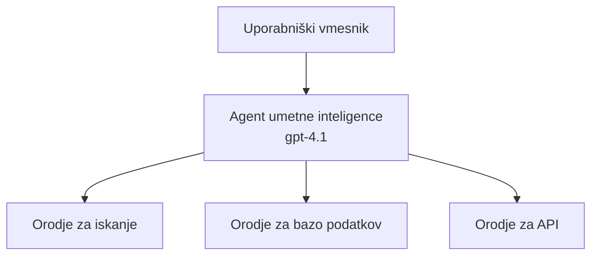
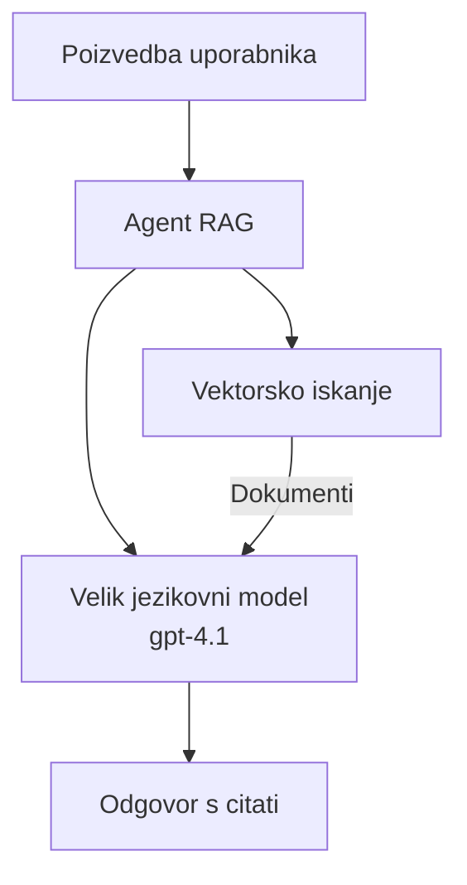
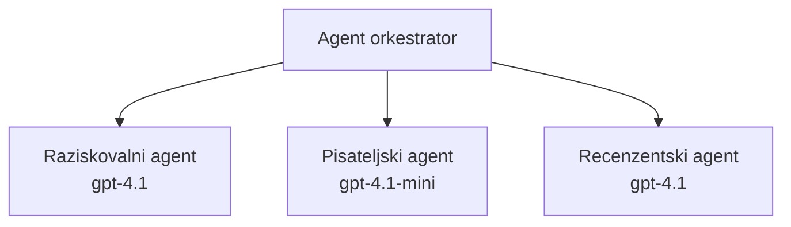

# AI agenti z Azure Developer CLI

**Navigacija po poglavjih:**
- **📚 Domača stran tečaja**: [AZD za začetnike](../../README.md)
- **📖 Trenutno poglavje**: Poglavje 2 - AI-prvi razvoj
- **⬅️ Prejšnje**: [Microsoft Foundry Integration](microsoft-foundry-integration.md)
- **➡️ Naslednje**: [AI Model Deployment](ai-model-deployment.md)
- **🚀 Napredno**: [Multi-Agent Solutions](../../examples/retail-scenario.md)

---

## Uvod

AI agenti so avtonomni programi, ki lahko zaznavajo svoje okolje, sprejemajo odločitve in izvajajo dejanja za dosego določenih ciljev. V nasprotju z enostavnimi klepetalniki, ki odgovarjajo na pozive, lahko agenti:

- **Uporabljajo orodja** - Kličejo API-je, iščejo v bazah podatkov, izvajajo kodo
- **Načrtujejo in sklepajo** - Razdelijo kompleksna opravila na korake
- **Se učijo iz konteksta** - Ohranjajo pomnilnik in prilagajajo vedenje
- **Sodelujejo** - Delajo z drugimi agenti (sistemi z več agenti)

Ta vodič prikazuje, kako razmestiti AI agente v Azure z uporabo Azure Developer CLI (azd).

> **Opomba o preverjanju (2026-03-25):** Ta vodič je bil pregledan z `azd` `1.23.12` in `azure.ai.agents` `0.1.18-preview`. Izkušnja `azd ai` je še vedno v predogledu, zato preverite pomoč razširitve, če se vaši nameščeni zastavici razlikujeta.

## Cilji učenja

Z dokončanjem tega vodiča boste:
- Razumeli, kaj so AI agenti in kako se razlikujejo od klepetalnikov
- Razmestili vnaprej pripravljene predloge AI agentov z uporabo AZD
- Konfigurirali Foundry agente za lastne agente
- Implementirali osnovne vzorce agentov (uporaba orodij, RAG, večagentni sistemi)
- Nadzorovali in odpravljali napake nameščenih agentov

## Izidi učenja

Po dokončanju boste lahko:
- Z enim ukazom razmestili aplikacije AI agentov v Azure
- Konfigurirali orodja in zmogljivosti agentov
- Implementirali retrieval-augmented generation (RAG) z agenti
- Načrtovali večagentne arhitekture za kompleksne delovne tokove
- Odpravljali pogoste težave pri razmestitvi agentov

---

## 🤖 Kaj naredi agenta drugačnega od klepetalnika?

| Značilnost | Klepetalnik | AI agent |
|---------|---------|----------|
| **Vedenje** | Odgovarja na pozive | Prevzame avtonomna dejanja |
| **Orodja** | Nič | Lahko kliče API-je, išče, izvaja kodo |
| **Pomnilnik** | Samo na sejo | Trajen pomnilnik med sejami |
| **Načrtovanje** | En sam odgovor | Večstopenjsko sklepanje |
| **Sodelovanje** | Ena entiteta | Lahko sodeluje z drugimi agenti |

### Preprosta primerjava

- **Klepetalnik** = Pomembna oseba, ki odgovarja na vprašanja na informacijski mizi
- **AI agent** = Osebni asistent, ki lahko opravlja klice, rezervira sestanke in dokončuje opravila namesto vas

---

## 🚀 Hiter začetek: Namestite svojega prvega agenta

### Možnost 1: Predloga Foundry Agents (Priporočeno)

```bash
# Inicializiraj predlogo AI agentov
azd init --template get-started-with-ai-agents

# Razporedi v Azure
azd up
```

**Kaj se namesti:**
- ✅ Foundry Agents
- ✅ Microsoft Foundry Models (gpt-4.1)
- ✅ Azure AI Search (za RAG)
- ✅ Azure Container Apps (spletni vmesnik)
- ✅ Application Insights (nadzor)

**Čas:** ~15-20 minut
**Stroški:** ~$100-150/mesec (razvoj)

### Možnost 2: OpenAI Agent z Prompty

```bash
# Inicializiraj predlogo agenta, ki temelji na Prompty
azd init --template agent-openai-python-prompty

# Razporedi v Azure
azd up
```

**Kaj se namesti:**
- ✅ Azure Functions (serverless za izvajanje agentov)
- ✅ Microsoft Foundry Models
- ✅ Datoteke konfiguracije Prompty
- ✅ Primer implementacije agenta

**Čas:** ~10-15 minut
**Stroški:** ~$50-100/mesec (razvoj)

### Možnost 3: RAG klepetalnik agenta

```bash
# Inicializiraj predlogo klepeta RAG
azd init --template azure-search-openai-demo

# Razporedi v Azure
azd up
```

**Kaj se namesti:**
- ✅ Microsoft Foundry Models
- ✅ Azure AI Search s primeri podatkov
- ✅ Pipeline za obdelavo dokumentov
- ✅ Klepetalni vmesnik z navedbami

**Čas:** ~15-25 minut
**Stroški:** ~$80-150/mesec (razvoj)

### Možnost 4: AZD AI Agent Init (Predogled temeljen na manifestu ali predlogi)

Če imate datoteko agenta manifest, lahko uporabite ukaz `azd ai`, da neposredno ustvarite projekt Foundry Agent Service. Zadnje različice v predogledu so dodale tudi podporo za inicializacijo na podlagi predlog, tako da se lahko natančen potek pozivov nekoliko razlikuje glede na nameščeno različico razširitve.

```bash
# Namestite razširitev za AI agente
azd extension install azure.ai.agents

# Neobvezno: preverite nameščeno predogledno različico
azd extension show azure.ai.agents

# Inicializirajte iz manifesta agenta
azd ai agent init -m agent-manifest.yaml

# Razmestite v Azure
azd up

# Preizkusite razmestjenega agenta (prikaže zakasnitev + čas do prvega bajta)
azd ai agent invoke
```

**Kdaj uporabiti `azd ai agent init` vs `azd init --template`:**

| Pristop | Najbolje za | Kako deluje |
|----------|----------|------|
| `azd init --template` | Začetek iz delujoče vzorčne aplikacije | Klonira celoten repozitorij predloge s kodo + infrastrukturo |
| `azd ai agent init -m` | Gradnja iz vašega lastnega agenta manifesta | Ustvari strukturo projekta iz vaše definicije agenta |

> **Namig:** Uporabite `azd init --template`, ko se učite (Možnosti 1-3 zgoraj). Uporabite `azd ai agent init`, ko gradite produkcijske agente z lastnimi manifesti.

Po `azd up` vas ista razširitev vodi skozi preostali cikel življenja agenta: `azd ai agent invoke` za testiranje, `azd ai agent eval generate` in `azd ai agent optimize` za merjenje in izboljšanje kakovosti ter `azd ai agent delete` za čiščenje. Oglejte si [AZD AI CLI ukaze](../chapter-08-production/production-ai-practices.md#azd-ai-cli-commands-and-extensions) za celovit referenčni seznam.

---

## 🏗️ Arhitekturni vzorci agentov

### Vzorec 1: En agent z orodji

Najpreprostejši vzorec agenta - en agent, ki lahko uporablja več orodij.



**Najbolje za:**
- Bots za podporo strankam
- Raziskovalni asistenti
- Agenti za analizo podatkov

**AZD predloga:** `azure-search-openai-demo`

### Vzorec 2: RAG agent (Retrieval-Augmented Generation)

Agent, ki pridobi ustrezne dokumente pred generiranjem odgovorov.



**Najbolje za:**
- Podjetniške baze znanja
- Sistemi Q&A za dokumente
- Skladnost in pravne raziskave

**AZD predloga:** `azure-search-openai-demo`

### Vzorec 3: Sistem z več agenti

Več specializiranih agentov, ki skupaj delajo na kompleksnih nalogah.



**Najbolje za:**
- Kompleksno ustvarjanje vsebin
- Večstopenjske delovne tokove
- Naloge, ki zahtevajo različno strokovnost

**Več informacij:** [Multi-Agent Coordination Patterns](../chapter-06-pre-deployment/coordination-patterns.md)

---

## ⚙️ Konfiguracija orodij agentov

Agenti postanejo močni, ko lahko uporabljajo orodja. Tukaj je opis, kako konfigurirati pogosta orodja:

### Konfiguracija orodij v Foundry Agents

```python
# agent_config.py
from azure.ai.projects import AIProjectClient
from azure.ai.projects.models import FunctionTool, CodeInterpreterTool

# Definirajte prilagojena orodja
search_tool = FunctionTool(
    name="search_knowledge_base",
    description="Search the company knowledge base for relevant documents",
    parameters={
        "type": "object",
        "properties": {
            "query": {
                "type": "string",
                "description": "The search query"
            }
        },
        "required": ["query"]
    }
)

# Ustvarite agenta z orodji
agent = project_client.agents.create_agent(
    model="gpt-4.1",
    name="Support Agent",
    instructions="You are a helpful support agent. Use the search tool to find relevant information.",
    tools=[search_tool, CodeInterpreterTool()]
)
```

### Konfiguracija okolja

```bash
# Nastavite za agenta specifične okoljske spremenljivke
azd env set AZURE_OPENAI_MODEL "gpt-4.1"
azd env set AGENT_INSTRUCTIONS "You are a helpful assistant..."
azd env set ENABLE_CODE_INTERPRETER "true"
azd env set ENABLE_FILE_SEARCH "true"

# Razmestite z posodobljeno konfiguracijo
azd deploy
```

---

## 📊 Nadzor agentov

### Integracija z Application Insights

Vse AZD predloge agentov vključujejo Application Insights za nadzor:

```bash
# Odpri nadzorno ploščo za spremljanje
azd monitor --overview

# Prikaži dnevniške zapise v živo
azd monitor --logs

# Prikaži meritve v živo
azd monitor --live
```

### Ključne meritve za spremljanje

| Meritev | Opis | Cilj |
|--------|-------------|--------|
| Zakasnitev odziva | Čas za generiranje odgovora | < 5 sekund |
| Poraba tokenov | Tokeni na zahtevo | Spremljajte zaradi stroškov |
| Uspešnost klicev orodij | % uspešnih izvedb orodij | > 95% |
| Stopnja napak | Neuspešne zahteve agenta | < 1% |
| Zadovoljstvo uporabnikov | Ocene povratnih informacij | > 4.0/5.0 |

### Prilagojeno beleženje za agente

```python
import os
from azure.monitor.opentelemetry import configure_azure_monitor
from opentelemetry import trace

# Konfigurirajte Azure Monitor z OpenTelemetry
configure_azure_monitor(
    connection_string=os.environ["APPLICATIONINSIGHTS_CONNECTION_STRING"]
)

tracer = trace.get_tracer(__name__)

def log_agent_interaction(user_query, agent_response, tools_used, latency_ms):
    with tracer.start_as_current_span("agent_interaction") as span:
        span.set_attributes({
            "user_query": user_query,
            "response_length": len(agent_response),
            "tools_used": tools_used,
            "latency_ms": latency_ms
        })
```

> **Opomba:** Namestite zahtevane pakete: `pip install azure-monitor-opentelemetry opentelemetry`

---

## 💰 Premisleki o stroških

### Ocenjeni mesečni stroški po vzorcih

| Vzorec | Razvojno okolje | Proizvodnja |
|---------|-----------------|------------|
| En agent | $50-100 | $200-500 |
| RAG agent | $80-150 | $300-800 |
| Večagentni sistem (2-3 agenti) | $150-300 | $500-1,500 |
| Podjetniški večagentni sistem | $300-500 | $1,500-5,000+ |

### Nasveti za optimizacijo stroškov

1. **Uporabite gpt-4.1-mini za preprosta opravila**
   ```bash
   azd env set AZURE_OPENAI_MODEL "gpt-4.1-mini"
   ```

2. **Implementirajte predpomnjenje za ponavljajoče se poizvedbe**
   ```python
   from functools import lru_cache
   
   @lru_cache(maxsize=1000)
   def get_cached_response(query_hash):
       return agent.run(query_hash)
   ```

3. **Nastavite omejitve tokenov na izvajanje**
   ```python
   # Nastavite max_completion_tokens pri zagonu agenta, ne med ustvarjanjem
   run = project_client.agents.create_run(
       thread_id=thread.id,
       agent_id=agent.id,
       max_completion_tokens=1000  # Omejite dolžino odgovora
   )
   ```

4. **Skalirajte na nič, ko ni v uporabi**
   ```bash
   # Container Apps se samodejno prilagodijo na nič.
   azd env set MIN_REPLICAS "0"
   ```

---

## 🔧 Odpravljanje težav z agenti

### Pogoste težave in rešitve

<details>
<summary><strong>❌ Agent ne odgovarja na klice orodij</strong></summary>

```bash
# Preverite, ali so orodja pravilno registrirana
azd show

# Preverite namestitev OpenAI
az cognitiveservices account deployment list \
  --name $AZURE_OPENAI_NAME \
  --resource-group $RG_NAME

# Preverite dnevnike agenta
azd monitor --logs
```

**Pogosti vzroki:**
- Neujemanje podpisa funkcije orodja
- Manjkajo potrebna dovoljenja
- API endpoint ni dostopen
</details>

<details>
<summary><strong>❌ Visoka zakasnitev pri odzivih agenta</strong></summary>

```bash
# Preverite Application Insights zaradi ozkih grl
azd monitor --live

# Razmislite o uporabi hitrejšega modela
azd env set AZURE_OPENAI_MODEL "gpt-4.1-mini"
azd deploy
```

**Nasveti za optimizacijo:**
- Uporabite pretakanje odgovorov
- Implementirajte predpomnjenje odgovorov
- Zmanjšajte velikost kontekstnega okna
</details>

<details>
<summary><strong>❌ Agent vrača nepravilne ali izmišljene informacije</strong></summary>

```python
# Izboljšajte z boljšimi sistemskimi pozivi
instructions = """
You are a helpful assistant. IMPORTANT:
- Only answer based on provided context
- If you don't know, say "I don't know"
- Always cite your sources
- Never make up information
"""

# Dodajte pridobivanje virov za utemeljitev
agent = project_client.agents.create_agent(
    model="gpt-4.1",
    instructions=instructions,
    tools=[FileSearchTool()]  # Utemeljite odgovore v dokumentih
)
```
</details>

<details>
<summary><strong>❌ Napake zaradi prekoračitve omejitve tokenov</strong></summary>

```python
# Implementiraj upravljanje kontekstnega okna
def truncate_context(messages, max_tokens=8000, model="gpt-4.1"):
    """Keep only recent messages within token limit."""
    import tiktoken
    encoding = tiktoken.encoding_for_model(model)
    total_tokens = 0
    truncated = []
    
    for msg in reversed(messages):
        msg_tokens = len(encoding.encode(msg.content))
        if total_tokens + msg_tokens > max_tokens:
            break
        truncated.insert(0, msg)
        total_tokens += msg_tokens
    
    return truncated
```
</details>

---

## 🎓 Praktične vaje

### Vaja 1: Namestite osnovnega agenta (20 minut)

**Cilj:** Namestite svojega prvega AI agenta z uporabo AZD

```bash
# Korak 1: Inicializirajte predlogo
azd init --template get-started-with-ai-agents

# Korak 2: Prijavite se v Azure
azd auth login
# Če delate v več najemnikih, dodajte --tenant-id <tenant-id>

# Korak 3: Izvedite razmestitev
azd up

# Korak 4: Preizkusite agenta
# Pričakovani izhod po razmestitvi:
#   Razmestitev končana!
#   Končna točka: https://<app-name>.<region>.azurecontainerapps.io
# Odprite URL, prikazan v izhodu, in poskusite postaviti vprašanje

# Korak 5: Oglejte si spremljanje
azd monitor --overview

# Korak 6: Počistite
azd down --force --purge
```

**Merila uspeha:**
- [ ] Agent odgovarja na vprašanja
- [ ] Dostop do nadzorne plošče za spremljanje prek `azd monitor`
- [ ] Viri so bili uspešno očiščeni

### Vaja 2: Dodajte lastno orodje (30 minut)

**Cilj:** Razširite agenta z lastnim orodjem

1. Deploy the agent template:
   ```bash
   azd init --template get-started-with-ai-agents
   azd up
   ```
2. Ustvarite novo funkcijo orodja v kodi vašega agenta:
   ```python
   def get_weather(location: str) -> str:
       """Get current weather for a location."""
       # Klic API-ja na vremensko storitev
       return f"Weather in {location}: Sunny, 72°F"
   ```
3. Registrirajte orodje pri agentu:
   ```python
   from azure.ai.projects.models import FunctionTool

   weather_tool = FunctionTool(
       name="get_weather",
       description="Get current weather for a location",
       parameters={
           "type": "object",
           "properties": {
               "location": {"type": "string", "description": "City name"}
           },
           "required": ["location"]
       }
   )

   agent = project_client.agents.create_agent(
       model="gpt-4.1",
       name="Weather Agent",
       tools=[weather_tool]
   )
   ```
4. Ponovno razmestite in testirajte:
   ```bash
   azd deploy
   # Vprašaj: "Kakšno je vreme v Seattlu?"
   # Pričakovano: Agent kliče get_weather("Seattle") in vrne informacije o vremenu
   ```

**Merila uspeha:**
- [ ] Agent prepozna vprašanja povezana z vremenom
- [ ] Orodje je pravilno poklicano
- [ ] Odgovor vključuje podatke o vremenu

### Vaja 3: Zgradite RAG agenta (45 minut)

**Cilj:** Ustvarite agenta, ki odgovarja na vprašanja iz vaših dokumentov

```bash
# Korak 1: Namestite RAG predlogo
azd init --template azure-search-openai-demo
azd up

# Korak 2: Naložite svoje dokumente
# Postavite datoteke PDF/TXT v mapo data/, nato zaženite:
python scripts/prepdocs.py

# Korak 3: Testirajte z vprašanji, specifičnimi za domeno
# Odprite URL spletne aplikacije iz izhoda ukaza azd up
# Zastavite vprašanja o naloženih dokumentih
# Odgovori naj vključujejo sklice, kot [doc.pdf]
```

**Merila uspeha:**
- [ ] Agent odgovarja iz naloženih dokumentov
- [ ] Odgovori vključujejo navedbe virov
- [ ] Brez izmišljenih informacij pri vprašanjih izven področja

---

## 📚 Naslednji koraki

Zdaj, ko razumete AI agente, raziščite te napredne teme:

| Tema | Opis | Povezava |
|-------|-------------|------|
| **Sistemi z več agenti** | Zgradite sisteme z več sodelujočimi agenti | [Retail Multi-Agent Example](../../examples/retail-scenario.md) |
| **Vzorce usklajevanja** | Naučite se vzorce orkestracije in komunikacije | [Coordination Patterns](../chapter-06-pre-deployment/coordination-patterns.md) |
| **Proizvodna namestitev** | Namestitev agentov pripravljena za podjetja | [Production AI Practices](../chapter-08-production/production-ai-practices.md) |
| **Ocena agentov** | Testirajte in ocenite delovanje agentov | [AI Troubleshooting](../chapter-07-troubleshooting/ai-troubleshooting.md) |
| **AI delavnica** | Praktično: Pripravite svojo AI rešitev za AZD | [AI Workshop Lab](ai-workshop-lab.md) |

---

## 📖 Dodatni viri

### Uradna dokumentacija
- [Microsoft Foundry Agent Service](https://learn.microsoft.com/azure/ai-services/agents/)
- [Microsoft Foundry Agent Service Quickstart](https://learn.microsoft.com/azure/ai-services/agents/quickstart)
- [Semantic Kernel Agent Framework](https://learn.microsoft.com/semantic-kernel/)

### AZD predloge za agente
- [Get Started with AI Agents](https://github.com/Azure-Samples/get-started-with-ai-agents)
- [Agent OpenAI Python Prompty](https://github.com/Azure-Samples/agent-openai-python-prompty)
- [Azure Search OpenAI Demo](https://github.com/Azure-Samples/azure-search-openai-demo)

### Skupnostni viri
- [Awesome AZD - Agent Templates](https://azure.github.io/awesome-azd/?tags=ai-agents)
- [Azure AI Discord](https://discord.gg/microsoft-azure)
- [Microsoft Foundry Discord](https://discord.gg/nTYy5BXMWG)

### Veščine agentov za vaš urejevalnik
- [**Microsoft Azure Agent Skills**](https://skills.sh/microsoft/github-copilot-for-azure) - Namestite znova uporabne veščine AI agentov za razvoj v Azure v GitHub Copilot, Cursor ali katerem koli podprtem agentu. Vključuje veščine za [Azure AI](https://skills.sh/microsoft/github-copilot-for-azure/azure-ai), [Microsoft Foundry](https://skills.sh/microsoft/github-copilot-for-azure/microsoft-foundry), [deployment](https://skills.sh/microsoft/github-copilot-for-azure/azure-deploy) in [diagnostics](https://skills.sh/microsoft/github-copilot-for-azure/azure-diagnostics):
  ```bash
  npx skills add microsoft/github-copilot-for-azure
  ```

---

**Navigacija**
- **Prejšnja lekcija**: [Microsoft Foundry Integration](microsoft-foundry-integration.md)
- **Naslednja lekcija**: [AI Model Deployment](ai-model-deployment.md)

---

<!-- CO-OP TRANSLATOR DISCLAIMER START -->
**Omejitev odgovornosti**:
Ta dokument je bil preveden z uporabo AI prevajalske storitve [Co-op Translator](https://github.com/Azure/co-op-translator). Čeprav si prizadevamo za natančnost, vas prosimo, da upoštevate, da avtomatizirani prevodi lahko vsebujejo napake ali netočnosti. Izvirni dokument v njegovem izvirnem jeziku je treba obravnavati kot avtoritativni vir. Za kritične informacije je priporočljiv strokovni človeški prevod. Ne odgovarjamo za morebitna nesporazume ali napačne interpretacije, ki izhajajo iz uporabe tega prevoda.
<!-- CO-OP TRANSLATOR DISCLAIMER END -->