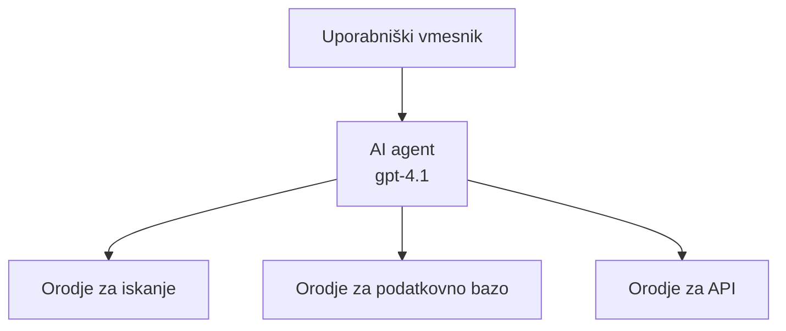
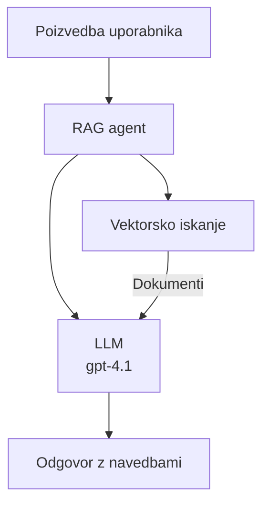
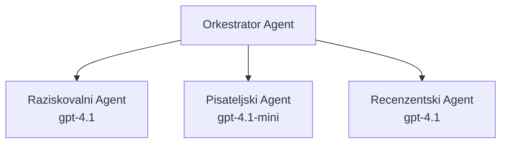

# AI agenti z Azure Developer CLI

**Navigacija poglavja:**
- **📚 Domov tečaja**: [AZD za začetnike](../../README.md)
- **📖 Trenutno poglavje**: Poglavje 2 - Razvoj, usmerjen na AI
- **⬅️ Predhodno**: [Integracija Microsoft Foundry](microsoft-foundry-integration.md)
- **➡️ Naslednje**: [Razmestitev AI modela](ai-model-deployment.md)
- **🚀 Napredno**: [Rešitve z več agenti](../../examples/retail-scenario.md)

---

## Uvod

AI agenti so avtonomni programi, ki zaznavajo svoje okolje, sprejemajo odločitve in izvajajo dejanja za dosego določenih ciljev. V nasprotju s preprostimi klepetalnimi roboti, ki odgovarjajo na pozive, lahko agenti:

- **Uporabljajo orodja** - kličejo API-je, iščejo v podatkovnih bazah, izvajajo kodo
- **Načrtujejo in razmišljajo** - razbijejo kompleksne naloge na korake
- **Učijo se iz konteksta** - ohranjajo spomin in prilagajajo vedenje
- **Sodelujejo** - delajo z drugimi agenti (sistemi z več agenti)

Ta vodnik vam pokaže, kako razmestiti AI agente v Azure z uporabo Azure Developer CLI (azd).

## Cilji učenja

Z dokončanjem tega vodnika boste:
- Razumeli, kaj so AI agenti in kako se razlikujejo od klepetalnih robotov
- Razmestili vnaprej izdelane predloge AI agentov z AZD
- Konfigurirali Foundry agente za prilagojene agente
- Implementirali osnovne vzorce agentov (uporaba orodij, RAG, večagentno)
- Spremljali in odpravljali napake razmestenih agentov

## Rezultati učenja

Po zaključku boste sposobni:
- Razmestiti aplikacije AI agentov v Azure z eno samo ukazno vrstico
- Konfigurirati orodja in zmogljivosti agentov
- Implementirati retrieval-augmented generation (RAG) z agenti
- Oblikovati večagentne arhitekture za kompleksne poteke dela
- Odpravljati težave pri razmestitvi agentov

---

## 🤖 Kaj naredi agenta drugačnega od klepetalnega robota?

| Značilnost | Klepetalni robot | AI agent |
|---------|---------|----------|
| **Obnašanje** | Odgovarja na pozive | Izvaja avtonomne ukrepe |
| **Orodja** | Nobenih | Lahko kliče API-je, išče, izvaja kodo |
| **Spomin** | Le na sejo | Trajen spomin med sejami |
| **Načrtovanje** | En sam odgovor | Večstopenjsko razmišljanje |
| **Sodelovanje** | Ena entiteta | Lahko dela z drugimi agenti |

### Preprosta analogija

- **Klepetalni robot** = Uporaben osebek, ki odgovarja na vprašanja pri informacijski mizi
- **AI agent** = Osebni pomočnik, ki lahko opravi klice, rezervira termine in izvede naloge za vas

---

## 🚀 Hitri začetek: Razmestite svojega prvega agenta

### Možnost 1: Predloga Foundry Agents (priporočeno)

```bash
# Inicializiraj predlogo AI-agentov
azd init --template get-started-with-ai-agents

# Razporedi v Azure
azd up
```

**Kaj se razmestí:**
- ✅ Foundry Agents
- ✅ Microsoft Foundry Models (gpt-4.1)
- ✅ Azure AI Search (za RAG)
- ✅ Azure Container Apps (spletni vmesnik)
- ✅ Application Insights (nadzor)

**Čas:** ~15-20 minut
**Strošek:** ~$100-150/mesec (razvoj)

### Možnost 2: OpenAI Agent z Prompty

```bash
# Inicializiraj predlogo agenta, ki temelji na Promptyju
azd init --template agent-openai-python-prompty

# Razporedi v Azure
azd up
```

**Kaj se razmestí:**
- ✅ Azure Functions (serverless izvajanje agenta)
- ✅ Microsoft Foundry Models
- ✅ Konfiguracijske datoteke Prompty
- ✅ Vzorec implementacije agenta

**Čas:** ~10-15 minut
**Strošek:** ~$50-100/mesec (razvoj)

### Možnost 3: RAG klepetalni agent

```bash
# Inicializiraj predlogo klepeta RAG
azd init --template azure-search-openai-demo

# Razporedi v Azure
azd up
```

**Kaj se razmestí:**
- ✅ Microsoft Foundry Models
- ✅ Azure AI Search s primeri podatkov
- ✅ Pipeline za obdelavo dokumentov
- ✅ Klepetalni vmesnik z navedbami virov

**Čas:** ~15-25 minut
**Strošek:** ~$80-150/mesec (razvoj)

### Možnost 4: AZD AI Agent Init (na podlagi manifesta)

Če imate manifest agenta, lahko uporabite ukaz `azd ai`, da neposredno ustvarite projekt Foundry Agent Service:

```bash
# Namestite razširitev za AI agente
azd extension install azure.ai.agents

# Inicializirajte iz manifesta agenta
azd ai agent init -m agent-manifest.yaml

# Namestite v Azure
azd up
```

**Kdaj uporabiti `azd ai agent init` v primerjavi z `azd init --template`:**

| Pristop | Najbolj primerno za | Kako deluje |
|----------|----------|------|
| `azd init --template` | Začetek iz delujoče vzorčne aplikacije | Klonira celoten repozitorij predloge s kodo + infrastrukturo |
| `azd ai agent init -m` | Gradnja iz lastnega manifesta agenta | Ustvari strukturo projekta iz vaše definicije agenta |

> **Namig:** Uporabite `azd init --template`, ko se učite (Možnosti 1–3 zgoraj). Uporabite `azd ai agent init`, ko gradite produkcijske agente z lastnimi manifesti. Glejte [AZD AI CLI Commands](../chapter-08-production/production-ai-practices.md#azd-ai-cli-commands-and-extensions) za celoten referenčni pregled.

---

## 🏗️ Vzenci arhitekture agentov

### Vzorec 1: En sam agent z orodji

Najpreprostejši vzorec agenta - en agent, ki lahko uporablja več orodij.


**Najbolj primerno za:**
- Chatbote za podporo strankam
- Pomočnike za raziskave
- Agente za analizo podatkov

**AZD predloga:** `azure-search-openai-demo`

### Vzorec 2: RAG agent (Retrieval-Augmented Generation)

Agent, ki pred generiranjem odziva pridobi ustrezne dokumente.


**Najbolj primerno za:**
- Podjetniške baze znanja
- Sisteme vprašanja in odgovora za dokumente
- Pravno in skladnostno raziskovanje

**AZD predloga:** `azure-search-openai-demo`

### Vzorec 3: Sistem z več agenti

Več specializiranih agentov, ki sodelujejo pri kompleksnih nalogah.


**Najbolj primerno za:**
- Kompleksno generiranje vsebin
- Večstopenjske delovne tokove
- Naloge, ki zahtevajo različna strokovna znanja

**Več informacij:** [Vzorec koordinacije več agentov](../chapter-06-pre-deployment/coordination-patterns.md)

---

## ⚙️ Konfiguriranje orodij agentov

Agenti postanejo zmogljivi, ko lahko uporabljajo orodja. Tukaj je, kako konfigurirati pogosta orodja:

### Konfiguracija orodij v Foundry agentih

```python
# agent_config.py
from azure.ai.projects import AIProjectClient
from azure.ai.projects.models import FunctionTool, CodeInterpreterTool

# Definiraj prilagojena orodja
search_tool = FunctionTool(
    name="search_knowledge_base",
    description="Search the company knowledge base for relevant documents",
    parameters={
        "type": "object",
        "properties": {
            "query": {
                "type": "string",
                "description": "The search query"
            }
        },
        "required": ["query"]
    }
)

# Ustvari agenta s orodji
agent = project_client.agents.create_agent(
    model="gpt-4.1",
    name="Support Agent",
    instructions="You are a helpful support agent. Use the search tool to find relevant information.",
    tools=[search_tool, CodeInterpreterTool()]
)
```

### Konfiguracija okolja

```bash
# Nastavite spremenljivke okolja, specifične za agenta
azd env set AZURE_OPENAI_MODEL "gpt-4.1"
azd env set AGENT_INSTRUCTIONS "You are a helpful assistant..."
azd env set ENABLE_CODE_INTERPRETER "true"
azd env set ENABLE_FILE_SEARCH "true"

# Razmestite z posodobljeno konfiguracijo
azd deploy
```

---

## 📊 Spremljanje agentov

### Integracija Application Insights

Vse AZD predloge agentov vključujejo Application Insights za spremljanje:

```bash
# Odpri nadzorno ploščo za spremljanje
azd monitor --overview

# Prikaži dnevniške zapise v živo
azd monitor --logs

# Prikaži meritve v živo
azd monitor --live
```

### Ključne meritve za spremljanje

| Meritev | Opis | Cilj |
|--------|-------------|--------|
| Zakasnitev odziva | Čas do generiranja odgovora | < 5 sekund |
| Uporaba žetonov | Žetoni na zahtevo | Spremljajte zaradi stroškov |
| Uspešnost klicev orodij | % uspešnih izvedb orodij | > 95% |
| Stopnja napak | Neuspešne zahteve agenta | < 1% |
| Zadovoljstvo uporabnikov | Ocene povratnih informacij | > 4.0/5.0 |

### Po meri prilagojeno beleženje za agente

```python
import os
from azure.monitor.opentelemetry import configure_azure_monitor
from opentelemetry import trace

# Konfigurirajte Azure Monitor z OpenTelemetry
configure_azure_monitor(
    connection_string=os.environ["APPLICATIONINSIGHTS_CONNECTION_STRING"]
)

tracer = trace.get_tracer(__name__)

def log_agent_interaction(user_query, agent_response, tools_used, latency_ms):
    with tracer.start_as_current_span("agent_interaction") as span:
        span.set_attributes({
            "user_query": user_query,
            "response_length": len(agent_response),
            "tools_used": tools_used,
            "latency_ms": latency_ms
        })
```

> **Opomba:** Namestite zahtevane pakete: `pip install azure-monitor-opentelemetry opentelemetry`

---

## 💰 Stroški

### Oceni mesečni stroški po vzorcu

| Vzorec | Razvojno okolje | Proizvodnja |
|---------|-----------------|------------|
| En sam agent | $50-100 | $200-500 |
| RAG agent | $80-150 | $300-800 |
| Večagentni (2-3 agenti) | $150-300 | $500-1,500 |
| Podjetniški večagentni | $300-500 | $1,500-5,000+ |

### Nasveti za optimizacijo stroškov

1. **Uporabite gpt-4.1-mini za preproste naloge**
   ```bash
   azd env set AZURE_OPENAI_MODEL "gpt-4.1-mini"
   ```

2. **Uvedite predpomnjenje za ponavljajoče se poizvedbe**
   ```python
   from functools import lru_cache
   
   @lru_cache(maxsize=1000)
   def get_cached_response(query_hash):
       return agent.run(query_hash)
   ```

3. **Nastavite omejitve žetonov na zagon**
   ```python
   # Nastavite max_completion_tokens pri zagonu agenta, ne med ustvarjanjem
   run = project_client.agents.create_run(
       thread_id=thread.id,
       agent_id=agent.id,
       max_completion_tokens=1000  # Omejite dolžino odgovora
   )
   ```

4. **Prilagodite skaliranje na nič, ko ni v uporabi**
   ```bash
   # Container Apps se samodejno skalirajo na nič
   azd env set MIN_REPLICAS "0"
   ```

---

## 🔧 Odpravljanje napak agentov

### Pogoste težave in rešitve

<details>
<summary><strong>❌ Agent se ne odziva na klice orodij</strong></summary>

```bash
# Preverite, ali so orodja pravilno registrirana
azd show

# Preverite namestitev OpenAI
az cognitiveservices account deployment list \
  --name $AZURE_OPENAI_NAME \
  --resource-group $RG_NAME

# Preverite dnevnike agenta
azd monitor --logs
```

**Pogosti vzroki:**
- Neujemanje podpisa funkcije orodja
- Manjkajoča zahtevana dovoljenja
- Končna točka API ni dostopna
</details>

<details>
<summary><strong>❌ Visoka zakasnitev pri odzivih agenta</strong></summary>

```bash
# Preverite Application Insights za ozka grla
azd monitor --live

# Razmislite o uporabi hitrejšega modela
azd env set AZURE_OPENAI_MODEL "gpt-4.1-mini"
azd deploy
```

**Nasveti za optimizacijo:**
- Uporabite pretakanje odgovorov
- Uvedite predpomnjenje odgovorov
- Zmanjšajte velikost kontekstnega okna
</details>

<details>
<summary><strong>❌ Agent vrača nepravilne ali izmišljene informacije</strong></summary>

```python
# Izboljšajte z boljšimi sistemskimi pozivi
instructions = """
You are a helpful assistant. IMPORTANT:
- Only answer based on provided context
- If you don't know, say "I don't know"
- Always cite your sources
- Never make up information
"""

# Dodajte pridobivanje za utemeljitev
agent = project_client.agents.create_agent(
    model="gpt-4.1",
    instructions=instructions,
    tools=[FileSearchTool()]  # Utemeljite odgovore v dokumentih
)
```
</details>

<details>
<summary><strong>❌ Napake zaradi presežene omejitve žetonov</strong></summary>

```python
# Implementiraj upravljanje kontekstnega okna
def truncate_context(messages, max_tokens=8000, model="gpt-4.1"):
    """Keep only recent messages within token limit."""
    import tiktoken
    encoding = tiktoken.encoding_for_model(model)
    total_tokens = 0
    truncated = []
    
    for msg in reversed(messages):
        msg_tokens = len(encoding.encode(msg.content))
        if total_tokens + msg_tokens > max_tokens:
            break
        truncated.insert(0, msg)
        total_tokens += msg_tokens
    
    return truncated
```
</details>

---

## 🎓 Praktične vaje

### Vaja 1: Razmestite osnovnega agenta (20 minut)

**Cilj:** Razmestiti svojega prvega AI agenta z uporabo AZD

```bash
# Korak 1: Inicializacija predloge
azd init --template get-started-with-ai-agents

# Korak 2: Prijava v Azure
azd auth login

# Korak 3: Namestitev
azd up

# Korak 4: Preizkus agenta
# Pričakovan izhod po namestitvi:
#   Namestitev dokončana!
#   Končna točka: https://<app-name>.<region>.azurecontainerapps.io
# Odprite prikazani URL v izhodu in poskusite zastaviti vprašanje

# Korak 5: Ogled spremljanja
azd monitor --overview

# Korak 6: Čiščenje
azd down --force --purge
```

**Kriteriji uspeha:**
- [ ] Agent odgovarja na vprašanja
- [ ] Dostop do nadzorne plošče za spremljanje preko `azd monitor`
- [ ] Viri so uspešno očiščeni

### Vaja 2: Dodajte lastno orodje (30 minut)

**Cilj:** Razširiti agenta z lastnim orodjem

1. Razmestite predlogo agenta:
   ```bash
   azd init --template get-started-with-ai-agents
   azd up
   ```
2. Ustvarite novo funkcijo orodja v kodi vašega agenta:
   ```python
   def get_weather(location: str) -> str:
       """Get current weather for a location."""
       # Klic API-ja vremenske storitve
       return f"Weather in {location}: Sunny, 72°F"
   ```
3. Registrirajte orodje z agentom:
   ```python
   from azure.ai.projects.models import FunctionTool

   weather_tool = FunctionTool(
       name="get_weather",
       description="Get current weather for a location",
       parameters={
           "type": "object",
           "properties": {
               "location": {"type": "string", "description": "City name"}
           },
           "required": ["location"]
       }
   )

   agent = project_client.agents.create_agent(
       model="gpt-4.1",
       name="Weather Agent",
       tools=[weather_tool]
   )
   ```
4. Ponovno razmestite in preizkusite:
   ```bash
   azd deploy
   # Vprašaj: "Kakšno je vreme v Seattlu?"
   # Pričakovano: Agent pokliče get_weather("Seattle") in vrne informacije o vremenu
   ```

**Kriteriji uspeha:**
- [ ] Agent prepozna poizvedbe v zvezi z vremenskimi razmerami
- [ ] Orodje se pravilno kliče
- [ ] Odgovor vsebuje informacije o vremenu

### Vaja 3: Zgradite RAG agenta (45 minut)

**Cilj:** Ustvariti agenta, ki odgovarja na vprašanja iz vaših dokumentov

```bash
# Korak 1: Namestite RAG predlogo
azd init --template azure-search-openai-demo
azd up

# Korak 2: Naložite svoje dokumente
# Postavite PDF/TXT datoteke v mapo data/, nato zaženite:
python scripts/prepdocs.py

# Korak 3: Preizkusite z vprašanji, specifičnimi za domeno
# Odprite URL spletne aplikacije iz izhoda azd up
# Postavite vprašanja o naloženih dokumentih
# Odgovori naj vključujejo sklice, kot je [doc.pdf]
```

**Kriteriji uspeha:**
- [ ] Agent odgovarja iz naloženih dokumentov
- [ ] Odgovori vključujejo navedbe virov
- [ ] Brez halucinacij pri vprašanjih izven obsega

---

## 📚 Naslednji koraki

Zdaj, ko razumete AI agente, raziščite te napredne teme:

| Tema | Opis | Povezava |
|-------|-------------|------|
| **Sistemi z več agenti** | Gradnja sistemov z več sodelujočimi agenti | [Primer večagentnega sistema za maloprodajo](../../examples/retail-scenario.md) |
| **Vzorec koordinacije** | Naučite se orkestracije in komunikacijskih vzorcev | [Vzorec koordinacije](../chapter-06-pre-deployment/coordination-patterns.md) |
| **Produktska razmestitev** | Produkcijsko pripravna razmestitev agentov | [Produktske AI prakse](../chapter-08-production/production-ai-practices.md) |
| **Vrednotenje agentov** | Testiranje in ocenjevanje uspešnosti agentov | [Odpravljanje težav z AI](../chapter-07-troubleshooting/ai-troubleshooting.md) |
| **AI delavnica** | Praktično: Pripravite svojo AI rešitev za AZD | [AI delavnica](ai-workshop-lab.md) |

---

## 📖 Dodatni viri

### Uradna dokumentacija
- [Azure AI Agent Service](https://learn.microsoft.com/azure/ai-services/agents/)
- [Azure AI Foundry Agent Service Quickstart](https://learn.microsoft.com/azure/ai-services/agents/quickstart)
- [Semantic Kernel Agent Framework](https://learn.microsoft.com/semantic-kernel/)

### AZD predloge za agente
- [Začnite z AI agenti](https://github.com/Azure-Samples/get-started-with-ai-agents)
- [Agent OpenAI Python Prompty](https://github.com/Azure-Samples/agent-openai-python-prompty)
- [Azure Search OpenAI Demo](https://github.com/Azure-Samples/azure-search-openai-demo)

### Skupnostni viri
- [Awesome AZD - Predloge agentov](https://azure.github.io/awesome-azd/?tags=ai-agents)
- [Azure AI Discord](https://discord.gg/microsoft-azure)
- [Microsoft Foundry Discord](https://discord.gg/nTYy5BXMWG)

### Veščine agentov za vaš urejevalnik
- [**Microsoft Azure Agent Skills**](https://skills.sh/microsoft/github-copilot-for-azure) - Namestite ponovno uporabne veščine AI agentov za razvoj v Azure v GitHub Copilot, Cursor ali katerem koli podprtem agentu. Vključuje veščine za [Azure AI](https://skills.sh/microsoft/github-copilot-for-azure/azure-ai), [Microsoft Foundry](https://skills.sh/microsoft/github-copilot-for-azure/microsoft-foundry), [razmestitev](https://skills.sh/microsoft/github-copilot-for-azure/azure-deploy) in [diagnostiko](https://skills.sh/microsoft/github-copilot-for-azure/azure-diagnostics):
  ```bash
  npx skills add microsoft/github-copilot-for-azure
  ```

---

**Navigacija**
- **Predhodna lekcija**: [Integracija Microsoft Foundry](microsoft-foundry-integration.md)
- **Naslednja lekcija**: [Razmestitev AI modela](ai-model-deployment.md)

---

<!-- CO-OP TRANSLATOR DISCLAIMER START -->
**Disclaimer**:
Ta dokument je bil preveden z uporabo storitve za AI prevajanje [Co-op Translator](https://github.com/Azure/co-op-translator). Čeprav si prizadevamo za natančnost, upoštevajte, da lahko avtomatizirani prevodi vsebujejo napake ali netočnosti. Izvirni dokument v izvirnem jeziku velja za avtoritativni vir. Za kritične informacije priporočamo strokovni človeški prevod. Ne odgovarjamo za morebitne nesporazume ali napačne razlage, ki izhajajo iz uporabe tega prevoda.
<!-- CO-OP TRANSLATOR DISCLAIMER END -->