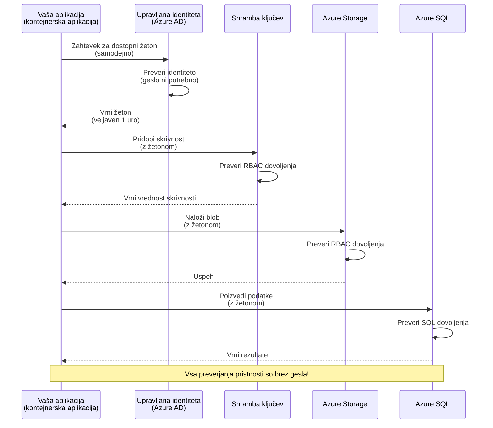
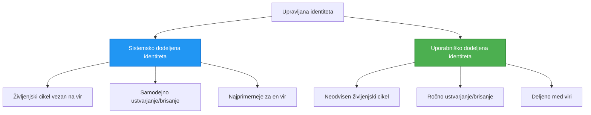

# Avtentikacijski vzorci in upravljana identiteta

⏱️ **Ocenjen čas**: 45–60 minut | 💰 **Vpliv na stroške**: Brezplačno (brez dodatnih stroškov) | ⭐ **Kompleksnost**: Srednje zahtevno

**📚 Učna pot:**
- ← Prejšnje: [Upravljanje konfiguracije](configuration.md) - Upravljanje spremenljivk okolja in skrivnosti
- 🎯 **Tukaj ste**: Avtentikacija in varnost (Upravljana identiteta, Key Vault, varni vzorci)
- → Naslednje: [Prvi projekt](first-project.md) - Zgradite svojo prvo AZD aplikacijo
- 🏠 [Domača stran tečaja](../../README.md)

---

## Kaj se boste naučili

Z dokončanjem te lekcije boste:
- Razumeli Azure avtentikacijske vzorce (ključne vrednosti, connection stringi, upravljana identiteta)
- Implementirali **upravljano identiteto** za avtentikacijo brez gesel
- Zavarovali skrivnosti z integracijo **Azure Key Vault**
- Konfigurirali **dodeljevanje vlog (RBAC)** za AZD namestitve
- Uporabili varnostne najboljše prakse v Container Apps in Azure storitvah
- Migrirali iz avtentikacije na osnovi ključev na avtentikacijo na osnovi identitete

## Zakaj je upravljana identiteta pomembna

### Problem: Tradicionalna avtentikacija

**Pred upravljano identiteto:**
```javascript
// ❌ VARNOSNO TVEGANJE: Trdo kodirane skrivnosti v kodi
const connectionString = "Server=mydb.database.windows.net;User=admin;Password=P@ssw0rd123";
const storageKey = "xK7mN9pQ2wR5tY8uI0oP3aS6dF1gH4jK...";
const cosmosKey = "C2x7B9n4M1p8Q5w3E6r0T2y5U8i1O4p7...";
```

**Težave:**
- 🔴 **Razkritje skrivnosti** v kodi, konfiguracijskih datotekah, spremenljivkah okolja
- 🔴 **Rotacija poverilnic** zahteva spremembe kode in ponovno nameščanje
- 🔴 **Revizijske nočne more** - kdo je dostopal do česa in kdaj?
- 🔴 **Razpršenost** - skrivnosti raztresene po več sistemih
- 🔴 **Tveganja skladnosti** - neuspeh pri varnostnih revizijah

### Rešitev: Upravljana identiteta

**Po uvedbi upravljane identitete:**
```javascript
// ✅ VAREN: Brez skrivnosti v kodi
const credential = new DefaultAzureCredential();
const client = new BlobServiceClient(
  "https://mystorageaccount.blob.core.windows.net",
  credential  // Azure samodejno upravlja overjanje
);
```

**Prednosti:**
- ✅ **Brez skrivnosti** v kodi ali konfiguraciji
- ✅ **Samodejna rotacija** - to ureja Azure
- ✅ **Popolna revizijska sled** v Azure AD dnevnikih
- ✅ **Centralizirana varnost** - upravljanje v Azure Portal
- ✅ **Pripravljeno za skladnost** - izpolnjuje varnostne standarde

**Analogneza**: Tradicionalna avtentikacija je kot nošenje več fizičnih ključev za različna vrata. Upravljana identiteta je kot varnostna izkaznica, ki samodejno podeli dostop glede na vašo identiteto—brez ključev, ki jih je mogoče izgubiti, kopirati ali rotirati.

---

## Pregled arhitekture

### Potek avtentikacije z upravljano identiteto


### Vrste upravljanih identitet


| Feature | System-Assigned | User-Assigned |
|---------|----------------|---------------|
| **Lifecycle** | Povezano z virom | Neodvisno |
| **Creation** | Samodejno z virom | Ročna kreacija |
| **Deletion** | Izbriše se z virom | Ostane po izbrisu vira |
| **Sharing** | Samo en vir | Več virov |
| **Use Case** | Enostavni scenariji | Kompleksni scenariji z več viri |
| **AZD Default** | ✅ Priporočeno | Izbirno |

---

## Predpogoj

### Potrebna orodja

Morali bi imeti že nameščeno iz prejšnjih lekcij:

```bash
# Preverite Azure Developer CLI
azd version
# ✅ Pričakovano: azd različica 1.0.0 ali novejša

# Preverite Azure CLI
az --version
# ✅ Pričakovano: azure-cli 2.50.0 ali novejša
```

### Zahteve za Azure

- Aktivna Azure naročnina
- Dovoljenja za:
  - Ustvarjanje upravljanih identitet
  - Dodeljevanje RBAC vlog
  - Ustvarjanje Key Vault virov
  - Nameščanje Container Apps

### Predznanje

Morali bi imeti zaključeno:
- [Navodila za namestitev](installation.md) - Nastavitev AZD
- [Osnove AZD](azd-basics.md) - Osnovni koncepti
- [Upravljanje konfiguracije](configuration.md) - Spremenljivke okolja

---

## Lekcija 1: Razumevanje avtentikacijskih vzorcev

### Vzorec 1: Connection strings (zastarjeno - izogibajte se)

**Kako deluje:**
```bash
# Niz povezave vsebuje poverilnice
STORAGE_CONNECTION_STRING="DefaultEndpointsProtocol=https;AccountName=myaccount;AccountKey=xK7mN9pQ2wR5..."
COSMOS_CONNECTION_STRING="AccountEndpoint=https://myaccount.documents.azure.com:443/;AccountKey=C2x7..."
SQL_CONNECTION_STRING="Server=myserver.database.windows.net;User=admin;Password=P@ssw0rd..."
```

**Težave:**
- ❌ Skrivnosti vidne v spremenljivkah okolja
- ❌ Beleženo v sistemih za nameščanje
- ❌ Težko za rotacijo
- ❌ Brez revizijske sledi dostopa

**Kdaj uporabiti:** Samo za lokalni razvoj, nikoli v produkciji.

---

### Vzorec 2: Key Vault reference (bolje)

**Kako deluje:**
```bicep
// Store secret in Key Vault
resource keyVault 'Microsoft.KeyVault/vaults@2023-02-01' = {
  name: 'mykv'
  properties: {
    enableRbacAuthorization: true
  }
}

// Reference in Container App
env: [
  {
    name: 'STORAGE_KEY'
    secretRef: 'storage-key'  // References Key Vault
  }
]
```

**Prednosti:**
- ✅ Skrivnosti shranjene varno v Key Vault
- ✅ Centralizirano upravljanje skrivnosti
- ✅ Rotacija brez sprememb kode

**Omejitve:**
- ⚠️ Še vedno uporablja ključe/gesla
- ⚠️ Potrebno upravljati dostop do Key Vault

**Kdaj uporabiti:** Prehodni korak od connection stringov k upravljani identiteti.

---

### Vzorec 3: Upravljana identiteta (najboljša praksa)

**Kako deluje:**
```bicep
// Enable managed identity
resource containerApp 'Microsoft.App/containerApps@2023-05-01' = {
  name: 'myapp'
  identity: {
    type: 'SystemAssigned'  // Automatically creates identity
  }
}

// Grant permissions
resource roleAssignment 'Microsoft.Authorization/roleAssignments@2022-04-01' = {
  scope: storageAccount
  properties: {
    roleDefinitionId: storageBlobDataContributorRole
    principalId: containerApp.identity.principalId
  }
}
```

**Koda aplikacije:**
```javascript
// Skrivnosti niso potrebne!
const { DefaultAzureCredential } = require('@azure/identity');
const { BlobServiceClient } = require('@azure/storage-blob');

const credential = new DefaultAzureCredential();
const blobServiceClient = new BlobServiceClient(
  'https://mystorageaccount.blob.core.windows.net',
  credential
);
```

**Prednosti:**
- ✅ Nobenih skrivnosti v kodi/konfiguraciji
- ✅ Samodejna rotacija poverilnic
- ✅ Popolna revizijska sled
- ✅ Dovoljenja na osnovi RBAC
- ✅ Pripravljeno za skladnost

**Kdaj uporabiti:** Vedno, za produkcijske aplikacije.

---

## Lekcija 2: Implementacija upravljane identitete z AZD

### Korak po koraku

Zgradimo varno Container App, ki uporablja upravljano identiteto za dostop do Azure Storage in Key Vault.

### Struktura projekta

```
secure-app/
├── azure.yaml                 # AZD configuration
├── infra/
│   ├── main.bicep            # Main infrastructure
│   ├── core/
│   │   ├── identity.bicep    # Managed identity setup
│   │   ├── keyvault.bicep    # Key Vault configuration
│   │   └── storage.bicep     # Storage with RBAC
│   └── app/
│       └── container-app.bicep
└── src/
    ├── app.js                # Application code
    ├── package.json
    └── Dockerfile
```

### 1. Konfiguracija AZD (azure.yaml)

```yaml
name: secure-app
metadata:
  template: secure-app@1.0.0

services:
  api:
    project: ./src
    language: js
    host: containerapp

# Enable managed identity (AZD handles this automatically)
```

### 2. Infrastruktura: Omogočanje upravljane identitete

**File: `infra/main.bicep`**

```bicep
targetScope = 'subscription'

param environmentName string
param location string = 'eastus'

var tags = { 'azd-env-name': environmentName }

// Resource group
resource rg 'Microsoft.Resources/resourceGroups@2021-04-01' = {
  name: 'rg-${environmentName}'
  location: location
  tags: tags
}

// Storage Account
module storage './core/storage.bicep' = {
  name: 'storage'
  scope: rg
  params: {
    name: 'st${uniqueString(rg.id)}'
    location: location
    tags: tags
  }
}

// Key Vault
module keyVault './core/keyvault.bicep' = {
  name: 'keyvault'
  scope: rg
  params: {
    name: 'kv-${uniqueString(rg.id)}'
    location: location
    tags: tags
  }
}

// Container App with Managed Identity
module containerApp './app/container-app.bicep' = {
  name: 'container-app'
  scope: rg
  params: {
    name: 'ca-${environmentName}'
    location: location
    tags: tags
    storageAccountName: storage.outputs.name
    keyVaultName: keyVault.outputs.name
  }
}

// Grant Container App access to Storage
module storageRoleAssignment './core/role-assignment.bicep' = {
  name: 'storage-role'
  scope: rg
  params: {
    principalId: containerApp.outputs.identityPrincipalId
    roleDefinitionId: 'ba92f5b4-2d11-453d-a403-e96b0029c9fe'  // Storage Blob Data Contributor
    targetResourceId: storage.outputs.id
  }
}

// Grant Container App access to Key Vault
module kvRoleAssignment './core/role-assignment.bicep' = {
  name: 'kv-role'
  scope: rg
  params: {
    principalId: containerApp.outputs.identityPrincipalId
    roleDefinitionId: '4633458b-17de-408a-b874-0445c86b69e6'  // Key Vault Secrets User
    targetResourceId: keyVault.outputs.id
  }
}

// Outputs
output AZURE_STORAGE_ACCOUNT_NAME string = storage.outputs.name
output AZURE_KEY_VAULT_NAME string = keyVault.outputs.name
output APP_URL string = containerApp.outputs.url
```

### 3. Container App s sistemsko dodeljeno identiteto

**File: `infra/app/container-app.bicep`**

```bicep
param name string
param location string
param tags object = {}
param storageAccountName string
param keyVaultName string

resource containerApp 'Microsoft.App/containerApps@2023-05-01' = {
  name: name
  location: location
  tags: tags
  identity: {
    type: 'SystemAssigned'  // 🔑 Enable managed identity
  }
  properties: {
    configuration: {
      ingress: {
        external: true
        targetPort: 3000
      }
    }
    template: {
      containers: [
        {
          name: 'api'
          image: 'myregistry.azurecr.io/api:latest'
          resources: {
            cpu: json('0.5')
            memory: '1Gi'
          }
          env: [
            {
              name: 'AZURE_STORAGE_ACCOUNT_NAME'
              value: storageAccountName
            }
            {
              name: 'AZURE_KEY_VAULT_NAME'
              value: keyVaultName
            }
            // 🔑 No secrets - managed identity handles authentication!
          ]
        }
      ]
    }
  }
}

// Output the identity for RBAC assignments
output identityPrincipalId string = containerApp.identity.principalId
output id string = containerApp.id
output url string = 'https://${containerApp.properties.configuration.ingress.fqdn}'
```

### 4. Modul za dodeljevanje RBAC vlog

**File: `infra/core/role-assignment.bicep`**

```bicep
param principalId string
param roleDefinitionId string  // Azure built-in role ID
param targetResourceId string

resource roleAssignment 'Microsoft.Authorization/roleAssignments@2022-04-01' = {
  name: guid(principalId, roleDefinitionId, targetResourceId)
  scope: resourceId('Microsoft.Resources/resourceGroups', resourceGroup().name)
  properties: {
    roleDefinitionId: subscriptionResourceId('Microsoft.Authorization/roleDefinitions', roleDefinitionId)
    principalId: principalId
    principalType: 'ServicePrincipal'
  }
}

output id string = roleAssignment.id
```

### 5. Koda aplikacije z upravljano identiteto

**File: `src/app.js`**

```javascript
const express = require('express');
const { DefaultAzureCredential } = require('@azure/identity');
const { BlobServiceClient } = require('@azure/storage-blob');
const { SecretClient } = require('@azure/keyvault-secrets');

const app = express();
const PORT = process.env.PORT || 3000;

// 🔑 Inicializiraj poverilnice (deluje samodejno z upravljano identiteto)
const credential = new DefaultAzureCredential();

// Nastavitev Azure Storagea
const storageAccountName = process.env.AZURE_STORAGE_ACCOUNT_NAME;
const blobServiceClient = new BlobServiceClient(
  `https://${storageAccountName}.blob.core.windows.net`,
  credential  // Ni potrebnih ključev!
);

// Nastavitev Key Vaulta
const keyVaultName = process.env.AZURE_KEY_VAULT_NAME;
const secretClient = new SecretClient(
  `https://${keyVaultName}.vault.azure.net`,
  credential  // Ni potrebnih ključev!
);

// Preverjanje stanja
app.get('/health', (req, res) => {
  res.json({ status: 'healthy', authentication: 'managed-identity' });
});

// Naloži datoteko v blob storage
app.post('/upload', async (req, res) => {
  try {
    const containerClient = blobServiceClient.getContainerClient('uploads');
    await containerClient.createIfNotExists();
    
    const blobName = `file-${Date.now()}.txt`;
    const blockBlobClient = containerClient.getBlockBlobClient(blobName);
    
    await blockBlobClient.upload('Hello from managed identity!', 30);
    
    res.json({
      success: true,
      blobName: blobName,
      message: 'File uploaded using managed identity!'
    });
  } catch (error) {
    console.error('Upload error:', error);
    res.status(500).json({ error: error.message });
  }
});

// Pridobi skrivnost iz Key Vaulta
app.get('/secret/:name', async (req, res) => {
  try {
    const secretName = req.params.name;
    const secret = await secretClient.getSecret(secretName);
    
    res.json({
      name: secretName,
      value: secret.value,
      message: 'Secret retrieved using managed identity!'
    });
  } catch (error) {
    console.error('Secret error:', error);
    res.status(500).json({ error: error.message });
  }
});

// Seznam blob kontejnerjev (prikazuje dostop za branje)
app.get('/containers', async (req, res) => {
  try {
    const containers = [];
    for await (const container of blobServiceClient.listContainers()) {
      containers.push(container.name);
    }
    
    res.json({
      containers: containers,
      count: containers.length,
      message: 'Containers listed using managed identity!'
    });
  } catch (error) {
    console.error('List error:', error);
    res.status(500).json({ error: error.message });
  }
});

app.listen(PORT, () => {
  console.log(`Secure API listening on port ${PORT}`);
  console.log('Authentication: Managed Identity (passwordless)');
});
```

**File: `src/package.json`**

```json
{
  "name": "secure-app",
  "version": "1.0.0",
  "dependencies": {
    "express": "^4.18.2",
    "@azure/identity": "^4.0.0",
    "@azure/storage-blob": "^12.17.0",
    "@azure/keyvault-secrets": "^4.7.0"
  },
  "scripts": {
    "start": "node app.js"
  }
}
```

### 6. Namestitev in testiranje

```bash
# Inicializiraj AZD okolje
azd init

# Namesti infrastrukturo in aplikacijo
azd up

# Pridobi URL aplikacije
APP_URL=$(azd env get-values | grep APP_URL | cut -d '=' -f2 | tr -d '"')

# Preizkusi preverjanje stanja
curl $APP_URL/health
```

**✅ Pričakovan izpis:**
```json
{
  "status": "healthy",
  "authentication": "managed-identity"
}
```

**Preizkus nalaganja blob-a:**
```bash
curl -X POST $APP_URL/upload
```

**✅ Pričakovan izpis:**
```json
{
  "success": true,
  "blobName": "file-1700404800000.txt",
  "message": "File uploaded using managed identity!"
}
```

**Preizkus seznama kontejnerjev:**
```bash
curl $APP_URL/containers
```

**✅ Pričakovan izpis:**
```json
{
  "containers": ["uploads"],
  "count": 1,
  "message": "Containers listed using managed identity!"
}
```

---

## Pogoste Azure RBAC vloge

### Vgrajene ID vloge za upravljano identiteto

| Service | Role Name | Role ID | Permissions |
|---------|-----------|---------|-------------|
| **Storage** | Storage Blob Data Reader | `2a2b9908-6b94-4a3d-8e5a-a7d8f8cc8a12` | Branje blobov in kontejnerjev |
| **Storage** | Storage Blob Data Contributor | `ba92f5b4-2d11-453d-a403-e96b0029c9fe` | Branje, pisanje, brisanje blobov |
| **Storage** | Storage Queue Data Contributor | `974c5e8b-45b9-4653-ba55-5f855dd0fb88` | Branje, pisanje, brisanje sporočil v čakalni vrsti |
| **Key Vault** | Key Vault Secrets User | `4633458b-17de-408a-b874-0445c86b69e6` | Branje skrivnosti |
| **Key Vault** | Key Vault Secrets Officer | `b86a8fe4-44ce-4948-aee5-eccb2c155cd7` | Branje, pisanje, brisanje skrivnosti |
| **Cosmos DB** | Cosmos DB Built-in Data Reader | `00000000-0000-0000-0000-000000000001` | Branje podatkov iz Cosmos DB |
| **Cosmos DB** | Cosmos DB Built-in Data Contributor | `00000000-0000-0000-0000-000000000002` | Branje, pisanje podatkov v Cosmos DB |
| **SQL Database** | SQL DB Contributor | `9b7fa17d-e63e-47b0-bb0a-15c516ac86ec` | Upravljanje SQL baz podatkov |
| **Service Bus** | Azure Service Bus Data Owner | `090c5cfd-751d-490a-894a-3ce6f1109419` | Pošiljanje, prejemanje, upravljanje sporočil |

### Kako poiskati ID vlog

```bash
# Prikaži vse vgrajene vloge
az role definition list --query "[].{Name:roleName, ID:name}" --output table

# Poišči določeno vlogo
az role definition list --query "[?contains(roleName, 'Storage Blob')].{Name:roleName, ID:name}" --output table

# Pridobi podrobnosti o vlogi
az role definition list --name "Storage Blob Data Contributor"
```

---

## Praktične vaje

### Vaja 1: Omogočanje upravljane identitete za obstoječo aplikacijo ⭐⭐ (Srednje)

**Cilj**: Dodajte upravljano identiteto obstoječi namestitvi Container App

**Scenarij**: Imate Container App, ki uporablja connection stringe. Pretvorite ga na upravljano identiteto.

**Začetna točka**: Container App s to konfiguracijo:

```bicep
// ❌ Current: Using connection string
env: [
  {
    name: 'STORAGE_CONNECTION_STRING'
    secretRef: 'storage-connection'
  }
]
```

**Koraki**:

1. **Omogočite upravljano identiteto v Bicep:**

```bicep
resource containerApp 'Microsoft.App/containerApps@2023-05-01' = {
  name: 'myapp'
  identity: {
    type: 'SystemAssigned'  // Add this
  }
  // ... rest of configuration
}
```

2. **Dodelite dostop do Storage:**

```bicep
// Get storage account reference
resource storageAccount 'Microsoft.Storage/storageAccounts@2023-01-01' existing = {
  name: storageAccountName
}

// Assign role
resource roleAssignment 'Microsoft.Authorization/roleAssignments@2022-04-01' = {
  name: guid(containerApp.id, 'ba92f5b4-2d11-453d-a403-e96b0029c9fe', storageAccount.id)
  scope: storageAccount
  properties: {
    roleDefinitionId: subscriptionResourceId('Microsoft.Authorization/roleDefinitions', 'ba92f5b4-2d11-453d-a403-e96b0029c9fe')
    principalId: containerApp.identity.principalId
    principalType: 'ServicePrincipal'
  }
}
```

3. **Posodobite kodo aplikacije:**

**Pred (connection string):**
```javascript
const { BlobServiceClient } = require('@azure/storage-blob');

const blobServiceClient = BlobServiceClient.fromConnectionString(
  process.env.STORAGE_CONNECTION_STRING
);
```

**Po (upravljana identiteta):**
```javascript
const { DefaultAzureCredential } = require('@azure/identity');
const { BlobServiceClient } = require('@azure/storage-blob');

const credential = new DefaultAzureCredential();
const blobServiceClient = new BlobServiceClient(
  `https://${process.env.STORAGE_ACCOUNT_NAME}.blob.core.windows.net`,
  credential
);
```

4. **Posodobite spremenljivke okolja:**

```bicep
env: [
  {
    name: 'STORAGE_ACCOUNT_NAME'
    value: storageAccountName  // Just the name, no secrets!
  }
  // Remove STORAGE_CONNECTION_STRING
]
```

5. **Namestite in testirajte:**

```bash
# Ponovno razmestiti
azd up

# Preizkusiti, ali še deluje
curl https://myapp.azurecontainerapps.io/upload
```

**✅ Kriteriji uspeha:**
- ✅ Aplikacija se namesti brez napak
- ✅ Operacije nad Storage delujejo (nalaganje, seznam, prenos)
- ✅ V spremenljivkah okolja ni connection stringov
- ✅ Identiteta je vidna v Azure Portalu pod zavihkom "Identity"

**Preverjanje:**

```bash
# Preverite, ali je omogočena upravljana identiteta
az containerapp show \
  --name myapp \
  --resource-group rg-myapp \
  --query "identity.type"
# ✅ Pričakovano: "SystemAssigned"

# Preverite dodelitev vloge
az role assignment list \
  --assignee $(az containerapp show --name myapp --resource-group rg-myapp --query "identity.principalId" -o tsv) \
  --scope /subscriptions/{sub-id}/resourceGroups/rg-myapp/providers/Microsoft.Storage/storageAccounts/mystorageaccount
# ✅ Pričakovano: Prikaže vlogo "Storage Blob Data Contributor"
```

**Čas**: 20–30 minut

---

### Vaja 2: Dostop več storitev z user-assigned identiteto ⭐⭐⭐ (Napredno)

**Cilj**: Ustvarite user-assigned identiteto, ki jo delijo več Container App-ov

**Scenarij**: Imate 3 mikroservise, ki morajo vsi dostopati do istega Storage računa in Key Vault.

**Koraki**:

1. **Ustvarite user-assigned identiteto:**

**File: `infra/core/identity.bicep`**

```bicep
param name string
param location string
param tags object = {}

resource userAssignedIdentity 'Microsoft.ManagedIdentity/userAssignedIdentities@2023-01-31' = {
  name: name
  location: location
  tags: tags
}

output id string = userAssignedIdentity.id
output principalId string = userAssignedIdentity.properties.principalId
output clientId string = userAssignedIdentity.properties.clientId
```

2. **Dodelite vloge user-assigned identiteti:**

```bicep
// In main.bicep
module userIdentity './core/identity.bicep' = {
  name: 'user-identity'
  scope: rg
  params: {
    name: 'id-${environmentName}'
    location: location
    tags: tags
  }
}

// Grant Storage access
resource storageRoleAssignment 'Microsoft.Authorization/roleAssignments@2022-04-01' = {
  name: guid(userIdentity.outputs.principalId, 'storage-contributor')
  scope: storageAccount
  properties: {
    roleDefinitionId: subscriptionResourceId('Microsoft.Authorization/roleDefinitions', 'ba92f5b4-2d11-453d-a403-e96b0029c9fe')
    principalId: userIdentity.outputs.principalId
    principalType: 'ServicePrincipal'
  }
}

// Grant Key Vault access
resource kvRoleAssignment 'Microsoft.Authorization/roleAssignments@2022-04-01' = {
  name: guid(userIdentity.outputs.principalId, 'kv-secrets-user')
  scope: keyVault
  properties: {
    roleDefinitionId: subscriptionResourceId('Microsoft.Authorization/roleDefinitions', '4633458b-17de-408a-b874-0445c86b69e6')
    principalId: userIdentity.outputs.principalId
    principalType: 'ServicePrincipal'
  }
}
```

3. **Dodelite identiteto več Container App-om:**

```bicep
resource apiGateway 'Microsoft.App/containerApps@2023-05-01' = {
  name: 'api-gateway'
  identity: {
    type: 'UserAssigned'
    userAssignedIdentities: {
      '${userIdentity.outputs.id}': {}
    }
  }
  // ... rest of config
}

resource productService 'Microsoft.App/containerApps@2023-05-01' = {
  name: 'product-service'
  identity: {
    type: 'UserAssigned'
    userAssignedIdentities: {
      '${userIdentity.outputs.id}': {}
    }
  }
  // ... rest of config
}

resource orderService 'Microsoft.App/containerApps@2023-05-01' = {
  name: 'order-service'
  identity: {
    type: 'UserAssigned'
    userAssignedIdentities: {
      '${userIdentity.outputs.id}': {}
    }
  }
  // ... rest of config
}
```

4. **Koda aplikacije (vse storitve uporabljajo isti vzorec):**

```javascript
const { DefaultAzureCredential, ManagedIdentityCredential } = require('@azure/identity');

// Za uporabniško dodeljeno identiteto določite ID odjemalca
const credential = new ManagedIdentityCredential(
  process.env.AZURE_CLIENT_ID  // ID odjemalca uporabniško dodeljene identitete
);

// Ali uporabite DefaultAzureCredential (samodejno zazna)
const credential = new DefaultAzureCredential();

const blobServiceClient = new BlobServiceClient(
  `https://${process.env.STORAGE_ACCOUNT_NAME}.blob.core.windows.net`,
  credential
);
```

5. **Namestite in preverite:**

```bash
azd up

# Preveri, ali imajo vse storitve dostop do shrambe
curl https://api-gateway.azurecontainerapps.io/upload
curl https://product-service.azurecontainerapps.io/upload
curl https://order-service.azurecontainerapps.io/upload
```

**✅ Kriteriji uspeha:**
- ✅ Ena identiteta, ki jo delijo 3 storitve
- ✅ Vse storitve lahko dostopajo do Storage in Key Vault
- ✅ Identiteta ostane, če izbrišete eno storitev
- ✅ Centralizirano upravljanje dovoljenj

**Prednosti user-assigned identitete:**
- Ena identiteta za upravljanje
- Dosledna dovoljenja med storitvami
- Preživi brisanje storitve
- Bolje za kompleksne arhitekture

**Čas**: 30–40 minut

---

### Vaja 3: Implementacija rotacije skrivnosti v Key Vault ⭐⭐⭐ (Napredno)

**Cilj**: Shrani API ključe tretjih oseb v Key Vault in jih dostopaj z upravljano identiteto

**Scenarij**: Vaša aplikacija kliče zunanji API (OpenAI, Stripe, SendGrid), ki zahteva API ključe.

**Koraki**:

1. **Ustvarite Key Vault z RBAC:**

**File: `infra/core/keyvault.bicep`**

```bicep
param name string
param location string
param tags object = {}

resource keyVault 'Microsoft.KeyVault/vaults@2023-02-01' = {
  name: name
  location: location
  tags: tags
  properties: {
    enableRbacAuthorization: true  // Use RBAC instead of access policies
    sku: {
      family: 'A'
      name: 'standard'
    }
    tenantId: subscription().tenantId
    enableSoftDelete: true
    softDeleteRetentionInDays: 90
  }
}

// Allow Container App to read secrets
output id string = keyVault.id
output name string = keyVault.name
output uri string = keyVault.properties.vaultUri
```

2. **Shranjevanje skrivnosti v Key Vault:**

```bash
# Pridobi ime Key Vaulta
KV_NAME=$(azd env get-values | grep AZURE_KEY_VAULT_NAME | cut -d '=' -f2 | tr -d '"')

# Shrani API ključe tretjih ponudnikov
az keyvault secret set \
  --vault-name $KV_NAME \
  --name "OpenAI-ApiKey" \
  --value "sk-proj-xxxxxxxxxxxxx"

az keyvault secret set \
  --vault-name $KV_NAME \
  --name "Stripe-ApiKey" \
  --value "sk_live_xxxxxxxxxxxxx"

az keyvault secret set \
  --vault-name $KV_NAME \
  --name "SendGrid-ApiKey" \
  --value "SG.xxxxxxxxxxxxx"
```

3. **Koda aplikacije za pridobivanje skrivnosti:**

**File: `src/config.js`**

```javascript
const { DefaultAzureCredential } = require('@azure/identity');
const { SecretClient } = require('@azure/keyvault-secrets');

class Config {
  constructor() {
    this.credential = new DefaultAzureCredential();
    this.secretClient = new SecretClient(
      `https://${process.env.AZURE_KEY_VAULT_NAME}.vault.azure.net`,
      this.credential
    );
    this.cache = {};
  }

  async getSecret(secretName) {
    // Najprej preveri predpomnilnik
    if (this.cache[secretName]) {
      return this.cache[secretName];
    }

    try {
      const secret = await this.secretClient.getSecret(secretName);
      this.cache[secretName] = secret.value;
      console.log(`✅ Retrieved secret: ${secretName}`);
      return secret.value;
    } catch (error) {
      console.error(`❌ Failed to get secret ${secretName}:`, error.message);
      throw error;
    }
  }

  async getOpenAIKey() {
    return this.getSecret('OpenAI-ApiKey');
  }

  async getStripeKey() {
    return this.getSecret('Stripe-ApiKey');
  }

  async getSendGridKey() {
    return this.getSecret('SendGrid-ApiKey');
  }
}

module.exports = new Config();
```

4. **Uporaba skrivnosti v aplikaciji:**

**File: `src/app.js`**

```javascript
const express = require('express');
const config = require('./config');
const { OpenAI } = require('openai');

const app = express();

// Inicializiraj OpenAI s ključem iz Key Vaulta
let openaiClient;

async function initializeServices() {
  const openaiKey = await config.getOpenAIKey();
  openaiClient = new OpenAI({ apiKey: openaiKey });
  console.log('✅ Services initialized with secrets from Key Vault');
}

// Pokliči ob zagonu
initializeServices().catch(console.error);

app.post('/chat', async (req, res) => {
  try {
    const completion = await openaiClient.chat.completions.create({
      model: 'gpt-4.1',
      messages: [{ role: 'user', content: 'Hello!' }]
    });
    
    res.json({
      response: completion.choices[0].message.content,
      authentication: 'Key from Key Vault via Managed Identity'
    });
  } catch (error) {
    res.status(500).json({ error: error.message });
  }
});

app.listen(3000, () => {
  console.log('Secure API with Key Vault integration running');
});
```

5. **Namestitev in testiranje:**

```bash
azd up

# Preverite, ali API ključi delujejo
curl -X POST https://myapp.azurecontainerapps.io/chat \
  -H "Content-Type: application/json" \
  -d '{"message":"Hello AI"}'
```

**✅ Kriteriji uspeha:**
- ✅ Ni API ključev v kodi ali spremenljivkah okolja
- ✅ Aplikacija pridobiva ključe iz Key Vault
- ✅ Klici tretjih oseb delujejo pravilno
- ✅ Ključe lahko rotirate brez sprememb kode

**Rotacija skrivnosti:**

```bash
# Posodobi skrivnost v Key Vaultu
az keyvault secret set \
  --vault-name $KV_NAME \
  --name "OpenAI-ApiKey" \
  --value "sk-proj-NEW_KEY_HERE"

# Ponovno zaženi aplikacijo, da uporabi nov ključ
az containerapp revision restart \
  --name myapp \
  --resource-group rg-myapp
```

**Čas**: 25–35 minut

---

## Kontrolna točka znanja

### 1. Avtentikacijski vzorci ✓

Preizkusite svoje razumevanje:

- [ ] **V1**: Katere so tri glavne avtentikacijske vzorce?
  - **O**: Connection strings (zastarjeno), Key Vault reference (prehod), Upravljana identiteta (najboljša praksa)

- [ ] **V2**: Zakaj je upravljana identiteta boljša od connection stringov?
  - **O**: Ni skrivnosti v kodi, samodejna rotacija, popolna revizijska sled, dovoljenja na osnovi RBAC

- [ ] **V3**: Kdaj uporabiti user-assigned identiteto namesto system-assigned?
  - **O**: Ko identiteto delite med več viri ali ko je življenjska doba identitete neodvisna od življenjske dobe vira

**Praktično preverjanje:**
```bash
# Preverite, katero vrsto identitete vaša aplikacija uporablja
az containerapp show \
  --name myapp \
  --resource-group rg-myapp \
  --query "identity.type"

# Naštejte vse dodelitve vlog za identiteto
az role assignment list \
  --assignee $(az containerapp show --name myapp --resource-group rg-myapp --query "identity.principalId" -o tsv)
```

---

### 2. RBAC in dovoljenja ✓

Preizkusite svoje razumevanje:

- [ ] **V1**: Kakšen je role ID za "Storage Blob Data Contributor"?
  - **O**: `ba92f5b4-2d11-453d-a403-e96b0029c9fe`

- [ ] **V2**: Katere pravice daje "Key Vault Secrets User"?
  - **O**: Samo bralni dostop do skrivnosti (ne more ustvarjati, posodabljati ali brisati)

- [ ] **V3**: Kako omogočite Container App dostop do Azure SQL?
  - **O**: Dodelite vlogo "SQL DB Contributor" ali konfigurirajte Azure AD avtentikacijo za SQL

**Praktično preverjanje:**
```bash
# Poišči določeno vlogo
az role definition list --name "Storage Blob Data Contributor"

# Preveri, katere vloge so dodeljene tvoji identiteti
PRINCIPAL_ID=$(az containerapp show --name myapp --resource-group rg-myapp --query "identity.principalId" -o tsv)
az role assignment list --assignee $PRINCIPAL_ID --output table
```

---

### 3. Integracija z Key Vault ✓
- [ ] **Q1**: Kako omogočite RBAC za Key Vault namesto dostopnih politik?
  - **A**: Nastavite `enableRbacAuthorization: true` v Bicep

- [ ] **Q2**: Katera knjižnica Azure SDK upravlja avtentikacijo upravljene identitete?
  - **A**: `@azure/identity` z razredom `DefaultAzureCredential`

- [ ] **Q3**: Koliko časa skrivnosti Key Vault ostanejo v predpomnilniku?
  - **A**: Odvisno od aplikacije; implementirajte svojo strategijo predpomnjenja

**Hands-On Verification:**
```bash
# Preizkusi dostop do Key Vault
az keyvault secret show \
  --vault-name $KV_NAME \
  --name "OpenAI-ApiKey" \
  --query "value"

# Preveri, ali je RBAC omogočen
az keyvault show \
  --name $KV_NAME \
  --query "properties.enableRbacAuthorization"
# ✅ Pričakovano: true
```

---

## Najboljše varnostne prakse

### ✅ NAREDI:

1. **Vedno uporabljajte upravljano identiteto v produkciji**
   ```bicep
   identity: {
     type: 'SystemAssigned'
   }
   ```

2. **Uporabljajte RBAC vloge z najmanjšimi pooblastili**
   - Uporabljajte "Reader" vloge, kadar je mogoče
   - Izogibajte se vlogam "Owner" ali "Contributor", razen če je potrebno

3. **Shranjujte ključe tretjih oseb v Key Vault**
   ```javascript
   const apiKey = await secretClient.getSecret('ThirdPartyApiKey');
   ```

4. **Omogočite revizijsko beleženje**
   ```bicep
   diagnosticSettings: {
     logs: [{ category: 'AuditEvent', enabled: true }]
   }
   ```

5. **Uporabljajte različne identitete za dev/staging/prod**
   ```bash
   azd env new dev
   azd env new staging
   azd env new prod
   ```

6. **Redno rotirajte skrivnosti**
   - Na skrivnostih v Key Vault nastavite datume poteka
   - Avtomatizirajte rotacijo z Azure Functions

### ❌ NE:

1. **Nikoli ne vgrajujte skrivnosti neposredno v kodo**
   ```javascript
   // ❌ SLABO
   const apiKey = "sk-proj-xxxxxxxxxxxxx";
   ```

2. **Ne uporabljajte connection stringov v produkciji**
   ```javascript
   // ❌ SLABO
   BlobServiceClient.fromConnectionString(process.env.STORAGE_CONNECTION_STRING)
   ```

3. **Ne dodeljujte prekomernih pooblastil**
   ```bicep
   // ❌ BAD - too much access
   roleDefinitionId: 'Owner'
   
   // ✅ GOOD - least privilege
   roleDefinitionId: 'Storage Blob Data Reader'
   ```

4. **Ne zapisujte skrivnosti v dnevnike**
   ```javascript
   // ❌ SLABO
   console.log('API Key:', apiKey);
   
   // ✅ DOBRO
   console.log('API Key retrieved successfully');
   ```

5. **Ne delite produkcijskih identitet med okolji**
   ```bicep
   // ❌ BAD - same identity for dev and prod
   // ✅ GOOD - separate identities per environment
   ```

---

## Vodnik za odpravljanje težav

### Težava: "Unauthorized" pri dostopu do Azure Storage

**Simptomi:**
```
Error: Unauthorized (403)
AuthorizationPermissionMismatch: This request is not authorized to perform this operation
```

**Diagnoza:**

```bash
# Preverite, ali je upravljana identiteta omogočena
az containerapp show \
  --name myapp \
  --resource-group rg-myapp \
  --query "identity.type"
# ✅ Pričakovano: "SystemAssigned" ali "UserAssigned"

# Preverite dodelitve vlog
PRINCIPAL_ID=$(az containerapp show --name myapp --resource-group rg-myapp --query "identity.principalId" -o tsv)
az role assignment list --assignee $PRINCIPAL_ID

# Pričakovano: videti bi morali "Storage Blob Data Contributor" ali podobno vlogo
```

**Rešitve:**

1. **Dodelite pravilno RBAC vlogo:**
```bash
STORAGE_ID=$(az storage account show --name mystorageaccount --resource-group rg-myapp --query "id" -o tsv)
az role assignment create \
  --assignee $PRINCIPAL_ID \
  --role "Storage Blob Data Contributor" \
  --scope $STORAGE_ID
```

2. **Počakajte na propagacijo (lahko traja 5–10 minut):**
```bash
# Preveri stanje dodelitve vloge
az role assignment list --assignee $PRINCIPAL_ID --scope $STORAGE_ID
```

3. **Preverite, ali aplikacijska koda uporablja ustrezno overitveno poverilnico:**
```javascript
// Prepričajte se, da uporabljate DefaultAzureCredential
const credential = new DefaultAzureCredential();
```

---

### Težava: Dostop do Key Vault zavrnjen

**Simptomi:**
```
Error: Forbidden (403)
The user, group or application does not have secrets get permission
```

**Diagnoza:**

```bash
# Preveri, ali je za Key Vault omogočen RBAC
az keyvault show \
  --name $KV_NAME \
  --query "properties.enableRbacAuthorization"
# ✅ Pričakovano: true

# Preveri dodelitve vlog
az role assignment list \
  --assignee $PRINCIPAL_ID \
  --scope /subscriptions/{sub-id}/resourceGroups/rg-myapp/providers/Microsoft.KeyVault/vaults/$KV_NAME
```

**Rešitve:**

1. **Omogočite RBAC na Key Vault:**
```bash
az keyvault update \
  --name $KV_NAME \
  --enable-rbac-authorization true
```

2. **Dodelite vlogo Key Vault Secrets User:**
```bash
KV_ID=$(az keyvault show --name $KV_NAME --query "id" -o tsv)
az role assignment create \
  --assignee $PRINCIPAL_ID \
  --role "Key Vault Secrets User" \
  --scope $KV_ID
```

---

### Težava: DefaultAzureCredential ne deluje lokalno

**Simptomi:**
```
Error: DefaultAzureCredential failed to retrieve a token
CredentialUnavailableError: No credential available
```

**Diagnoza:**

```bash
# Preverite, ali ste prijavljeni
az account show

# Preverite avtentikacijo Azure CLI
az ad signed-in-user show
```

**Rešitve:**

1. **Prijavite se v Azure CLI:**
```bash
az login
```

2. **Nastavite Azure naročnino:**
```bash
az account set --subscription "Your Subscription Name"
```

3. **Za lokalni razvoj uporabite okoljske spremenljivke:**
```bash
export AZURE_TENANT_ID="your-tenant-id"
export AZURE_CLIENT_ID="your-client-id"
export AZURE_CLIENT_SECRET="your-client-secret"
```

4. **Ali pa lokalno uporabite drugačen način overjanja:**
```javascript
const { DefaultAzureCredential, AzureCliCredential } = require('@azure/identity');

// Uporabite AzureCliCredential za lokalni razvoj
const credential = process.env.NODE_ENV === 'production' 
  ? new DefaultAzureCredential()
  : new AzureCliCredential();
```

---

### Težava: Dodeljevanje vlog traja predolgo, da se propagira

**Simptomi:**
- Vloga je bila uspešno dodeljena
- Še vedno prihaja do napak 403
- Prekinjen dostop (včasih deluje, včasih ne)

**Pojasnilo:**
Spremembe v Azure RBAC lahko potrebujejo 5–10 minut za globalno propagacijo.

**Rešitev:**

```bash
# Počakajte in poskusite znova
echo "Waiting for RBAC propagation..."
sleep 300  # Počakajte 5 minut

# Preizkusite dostop
curl https://myapp.azurecontainerapps.io/upload

# Če še vedno ne deluje, znova zaženite aplikacijo
az containerapp revision restart \
  --name myapp \
  --resource-group rg-myapp
```

---

## Razmisleki o stroških

### Stroški upravljane identitete

| Postavka | Strošek |
|----------|------|
| **Upravljana identiteta** | 🆓 **BREZPLAČNO** - Ni stroškov |
| **Dodelitve RBAC vlog** | 🆓 **BREZPLAČNO** - Ni stroškov |
| **Zahteve žetonov Azure AD** | 🆓 **BREZPLAČNO** - Vključeno |
| **Operacije Key Vault** | $0.03 per 10,000 operations |
| **Shranjevanje v Key Vault** | $0.024 per secret per month |

**Upravljana identiteta prihrani stroške z:**
- ✅ Odprava operacij Key Vault za avtentikacijo med storitvami
- ✅ Zmanjšanje varnostnih incidentov (brez razkritih poverilnic)
- ✅ Zmanjšanje operativnih obremenitev (brez ročnega vrtenja)

**Primerjava stroškov (mesečno):**

| Scenarij | Connection Strings | Upravljana identiteta | Prihranek |
|----------|-------------------|-----------------|---------|
| Majhna aplikacija (1M requests) | ~$50 (Key Vault + ops) | ~$0 | $50/mesec |
| Srednja aplikacija (10M requests) | ~$200 | ~$0 | $200/mesec |
| Velika aplikacija (100M requests) | ~$1,500 | ~$0 | $1,500/mesec |

---

## Več informacij

### Uradna dokumentacija
- [Upravljana identiteta Azure](https://learn.microsoft.com/entra/identity/managed-identities-azure-resources/overview)
- [Azure RBAC](https://learn.microsoft.com/azure/role-based-access-control/overview)
- [Azure Key Vault](https://learn.microsoft.com/azure/key-vault/general/overview)
- [DefaultAzureCredential](https://learn.microsoft.com/dotnet/api/azure.identity.defaultazurecredential)

### Dokumentacija SDK
- [@azure/identity (Node.js)](https://www.npmjs.com/package/@azure/identity)
- [Azure.Identity (C#)](https://www.nuget.org/packages/Azure.Identity/)
- [azure-identity (Python)](https://pypi.org/project/azure-identity/)

### Naslednji koraki v tem tečaju
- ← Prejšnji: [Upravljanje konfiguracije](configuration.md)
- → Naslednje: [Prvi projekt](first-project.md)
- 🏠 [Domača stran tečaja](../../README.md)

### Povezani primeri
- [Primer klepeta z Microsoft Foundry Models](../../../../examples/azure-openai-chat) - Uporablja upravljano identiteto za Microsoft Foundry Models
- [Primer mikrostoritev](../../../../examples/microservices) - Vzorce avtentikacije za več storitev

---

## Povzetek

**Naučili ste se:**
- ✅ Trije vzorci avtentikacije (connection strings, Key Vault, upravljana identiteta)
- ✅ Kako omogočiti in konfigurirati upravljano identiteto v AZD
- ✅ Dodelitve RBAC vlog za Azure storitve
- ✅ Integracija Key Vault za skrivnosti tretjih oseb
- ✅ Uporabniško dodeljene in sistemsko dodeljene identitete
- ✅ Najboljše varnostne prakse in odpravljanje težav

**Ključne ugotovitve:**
1. **Vedno uporabljajte upravljano identiteto v produkciji** - Brez skrivnosti, samodejna rotacija
2. **Uporabljajte RBAC vloge z najmanjšimi pooblastili** - Dodelite le potrebna pooblastila
3. **Shranjujte ključe tretjih oseb v Key Vault** - Centralizirano upravljanje skrivnosti
4. **Ločite identitete po okolju** - Izolacija dev, staging, prod
5. **Omogočite revizijsko beleženje** - Sledenje, kdo je dostopal do česa

**Naslednji koraki:**
1. Dokončajte zgornje praktične vaje
2. Migrirajte obstoječo aplikacijo iz connection strings na upravljano identiteto
3. Zgradite vaš prvi AZD projekt z varnostjo že od prvega dne: [Prvi projekt](first-project.md)

---

<!-- CO-OP TRANSLATOR DISCLAIMER START -->
**Izjava o omejitvi odgovornosti**:
Ta dokument je bil preveden z uporabo AI prevajalske storitve [Co-op Translator](https://github.com/Azure/co-op-translator). Čeprav si prizadevamo za natančnost, vas prosimo, upoštevajte, da avtomatizirani prevodi lahko vsebujejo napake ali netočnosti. Izvirni dokument v izvirnem jeziku velja za avtoritativni vir. Za kritične informacije priporočamo profesionalen človeški prevod. Ne odgovarjamo za morebitna nesporazume ali napačne razlage, ki izhajajo iz uporabe tega prevoda.
<!-- CO-OP TRANSLATOR DISCLAIMER END -->