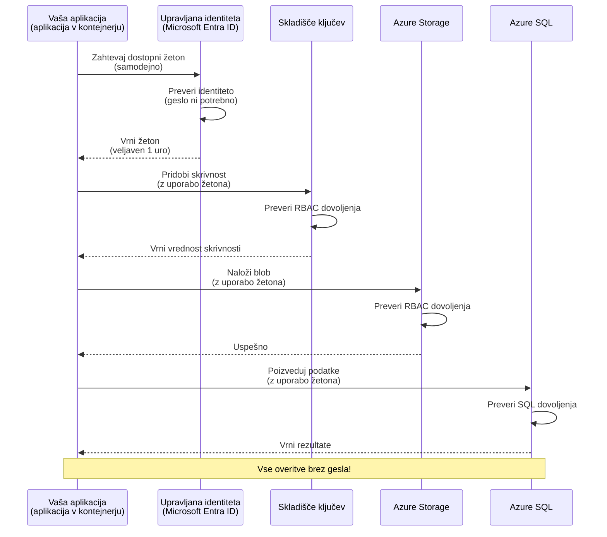
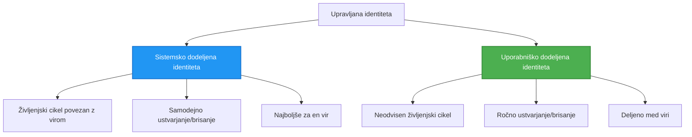

# Avtentični vzorci in upravljana identiteta

⏱️ **Ocenjen čas**: 45–60 minut | 💰 **Vpliv stroškov**: Brezplačno (brez dodatnih stroškov) | ⭐ **Kompleksnost**: Srednje zahtevno

**📚 Pot učenja:**
- ← Prejšnje: [Configuration Management](configuration.md) - Upravljanje okoljskih spremenljivk in skrivnosti
- 🎯 **Tu ste**: Avtentikacija in varnost (Managed Identity, Key Vault, varni vzorci)
- → Naslednje: [First Project](first-project.md) - Zgradite svojo prvo AZD aplikacijo
- 🏠 [Course Home](../../README.md)

---

## Česa se boste naučili

Z dokončanjem te lekcije boste:
- Razumeli Azure avtentikacijske vzorce (ključev, connection stringov, managed identity)
- Implementirali **Managed Identity** za avtentikacijo brez gesel
- Zavarovali skrivnosti z integracijo **Azure Key Vault**
- Konfigurirali **vloge glede na vloge (RBAC)** za AZD namestitve
- Uporabili varnostne najboljše prakse v Container Apps in Azure storitvah
- Migrirali iz avtentikacije na osnovi ključev na avtentikacijo na osnovi identitete

## Zakaj je Managed Identity pomembna

### Težava: Tradicionalna avtentikacija

**Pred Managed Identity:**
```javascript
// ❌ VARNOSTNO TVEGANJE: Trdo zakodirane skrivnosti v kodi
const connectionString = "Server=mydb.database.windows.net;User=admin;Password=P@ssw0rd123";
const storageKey = "xK7mN9pQ2wR5tY8uI0oP3aS6dF1gH4jK...";
const cosmosKey = "C2x7B9n4M1p8Q5w3E6r0T2y5U8i1O4p7...";
```

**Težave:**
- 🔴 **Razkrite skrivnosti** v kodi, konfiguracijskih datotekah, okoljskih spremenljivkah
- 🔴 **Rotacija poverilnic** zahteva spremembe kode in ponovni razmestitev
- 🔴 **Nočne more pri revizijah** - kdo je dostopal do česa in kdaj?
- 🔴 **Razpršenost** - skrivnosti raztresene po več sistemih
- 🔴 **Tveganja skladnosti** - spodleti varnostnim revizijam

### Rešitev: Managed Identity

**Po Managed Identity:**
```javascript
// ✅ VAREN: V kodi ni skrivnosti
const credential = new DefaultAzureCredential();
const client = new BlobServiceClient(
  "https://mystorageaccount.blob.core.windows.net",
  credential  // Azure samodejno upravlja preverjanjem pristnosti
);
```

**Prednosti:**
- ✅ **Brez skrivnosti** v kodi ali konfiguraciji
- ✅ **Avtomatska rotacija** - Azure to upravlja
- ✅ **Popolna revizijska sled** v Microsoft Entra ID dnevnikih
- ✅ **Centralizirana varnost** - upravljanje v Azure Portalu
- ✅ **Pripravljeno za skladnost** - izpolnjuje varnostne standarde

**Analogija**: Tradicionalna avtentikacija je kot nošenje več fizičnih ključev za različna vrata. Managed Identity je kot varnostna značkica, ki samodejno dovoli dostop glede na to, kdo ste—ni ključev, ki bi jih izgubili, kopirali ali jih bilo treba rotirati.

---

## Pregled arhitekture

### Avtentikacijski potek z Managed Identity



### Vrste upravljanih identitet



| Feature | System-Assigned | User-Assigned |
|---------|----------------|---------------|
| **Lifecycle** | Tied to resource | Independent |
| **Creation** | Automatic with resource | Manual creation |
| **Deletion** | Deleted with resource | Persists after resource deletion |
| **Sharing** | One resource only | Multiple resources |
| **Use Case** | Simple scenarios | Complex multi-resource scenarios |
| **AZD Default** | ✅ Recommended | Optional |

---

## Predpogoji

### Potrebna orodja

Morali bi že imeti nameščeno naslednje iz prejšnjih lekcij:

```bash
# Preverite Azure Developer CLI
azd version
# ✅ Pričakovano: azd različica 1.0.0 ali novejša

# Preverite Azure CLI
az --version
# ✅ Pričakovano: azure-cli različica 2.50.0 ali novejša
```

### Zahteve za Azure

- Aktivna naročnina Azure
- Pooblastila za:
  - Ustvarjanje upravljanih identitet
  - Dodeljevanje RBAC vlog
  - Ustvarjanje Key Vault virov
  - Razmestitev Container Apps

### Znanje kot predpogoj

Morali ste dokončati:
- [Installation Guide](installation.md) - Nastavitev AZD
- [AZD Basics](azd-basics.md) - Osnovni koncepti
- [Configuration Management](configuration.md) - Okoljske spremenljivke

---

## Lekcija 1: Razumevanje avtentikacijskih vzorcev

### Vzorec 1: Connection Strings (zastarjelo - izogibajte se)

**Kako deluje:**
```bash
# Niz povezave vsebuje poverilnice
STORAGE_CONNECTION_STRING="DefaultEndpointsProtocol=https;AccountName=myaccount;AccountKey=xK7mN9pQ2wR5..."
COSMOS_CONNECTION_STRING="AccountEndpoint=https://myaccount.documents.azure.com:443/;AccountKey=C2x7..."
SQL_CONNECTION_STRING="Server=myserver.database.windows.net;User=admin;Password=P@ssw0rd..."
```

**Težave:**
- ❌ Skrivnosti vidne v okoljskih spremenljivkah
- ❌ Beleženo v sistemih za razmestitev
- ❌ Težko rotirati
- ❌ Brez revizijske sledi dostopa

**Kdaj uporabiti:** Samo za lokalni razvoj, nikoli v produkciji.

---

### Vzorec 2: Key Vault reference (bolje)

**Kako deluje:**
```bicep
// Store secret in Key Vault
resource keyVault 'Microsoft.KeyVault/vaults@2023-02-01' = {
  name: 'mykv'
  properties: {
    enableRbacAuthorization: true
  }
}

// Reference in Container App
env: [
  {
    name: 'STORAGE_KEY'
    secretRef: 'storage-key'  // References Key Vault
  }
]
```

**Prednosti:**
- ✅ Skrivnosti varno shranjene v Key Vault
- ✅ Centralizirano upravljanje skrivnosti
- ✅ Rotacija brez sprememb kode

**Omejitve:**
- ⚠️ Še vedno uporaba ključev/gesel
- ⚠️ Treba upravljati dostop do Key Vault

**Kdaj uporabiti:** Prehodni korak od connection stringov k managed identity.

---

### Vzorec 3: Managed Identity (najboljša praksa)

**Kako deluje:**
```bicep
// Enable managed identity
resource containerApp 'Microsoft.App/containerApps@2023-05-01' = {
  name: 'myapp'
  identity: {
    type: 'SystemAssigned'  // Automatically creates identity
  }
}

// Grant permissions
resource roleAssignment 'Microsoft.Authorization/roleAssignments@2022-04-01' = {
  scope: storageAccount
  properties: {
    roleDefinitionId: storageBlobDataContributorRole
    principalId: containerApp.identity.principalId
  }
}
```

**Koda aplikacije:**
```javascript
// Skrivnosti niso potrebne!
const { DefaultAzureCredential } = require('@azure/identity');
const { BlobServiceClient } = require('@azure/storage-blob');

const credential = new DefaultAzureCredential();
const blobServiceClient = new BlobServiceClient(
  'https://mystorageaccount.blob.core.windows.net',
  credential
);
```

**Prednosti:**
- ✅ Brez skrivnosti v kodi/konfiguraciji
- ✅ Avtomatska rotacija poverilnic
- ✅ Popolna revizijska sled
- ✅ Pooblastila na osnovi RBAC
- ✅ Pripravljeno za skladnost

**Kdaj uporabiti:** Vedno, za produkcijske aplikacije.

---

### Vzorec 4: Service Principals (CI/CD in avtomatizacija)

Managed identity je zlati standard za vire, ki tečejo znotraj Azure. Vendar kaj pa stvari, ki tečejo **izven** Azure—na primer CI/CD cevovod na build agentu ali skripta na vašem prenosniku, ki ne more uporabiti interaktivne prijave? Tu pride v poštev **service principal**: nečloveška identiteta s svojimi poverilnicami, s katero se lahko avtomatiziran proces prijavi.

**Kako deluje:**

Ustvarite service principal z obsegom na resource group (najmanj privilegije):

```bash
az ad sp create-for-rbac \
  --name "myapp-cicd" \
  --role contributor \
  --scopes /subscriptions/<sub-id>/resourceGroups/<rg-name>
```

To izpiše client ID, client secret in tenant ID. azd se lahko prijavi z njimi neinteraktivno:

```bash
azd auth login \
  --client-id "<appId>" \
  --client-secret "<password>" \
  --tenant-id "<tenant>"
```

**Prednost imajo federirane poverilnice (OIDC) pred skrivnostmi.** Namesto dolgoživega client secreta, konfigurirajte federirano poverilnico, da cevovod zamenja kratkotrajni žeton—ni skrivnosti, ki bi uhajala ali jo bilo treba rotirati:

```bash
azd auth login \
  --client-id "<appId>" \
  --federated-credential-provider "github" \
  --tenant-id "<tenant>"
```

> `azd pipeline config` to avtomatsko nastavi za vas. Oglejte si CI/CD vodnike v [Chapter 8](../chapter-08-production/production-ai-practices.md).

**Prednosti:**
- ✅ Deluje izven Azure (build agenti, on-prem, druge oblake)
- ✅ Lahko je omejen na eno resource group z eno vlogo
- ✅ Federirana (OIDC) različica ne uporablja shranjene skrivnosti

**Kompenzacije:**
- ⚠️ Varianta s skrivnostjo zahteva skrbno shranjevanje in rotacijo
- ⚠️ Uhanjena skrivnost omogoča vse, kar lahko SP naredi—držite obsege majhne

**Kdaj uporabiti:** CI/CD cevovodi in avtomatizacija, ki ne moreta uporabiti managed identity. Vedno dajte prednost **federirani/OIDC** različici pred client secret, in vedno preferirajte managed identity, kadar delovna obremenitev teče znotraj Azure.

**Varno shranjevanje poverilnic:**
- Nikoli ne committajte skrivnosti—uporabite skrivnostni shrambi vašega cevovoda (GitHub Actions secrets, Azure DevOps variable groups / Key Vault).
- Omejite SP na najmanjšo potrebno vlogo in resource group.
- Nastavite potek veljavnosti in rotirajte, ali pa odpravite skrivnost povsem z OIDC.

---

## Lekcija 2: Implementacija Managed Identity z AZD

### Korak-po-korak implementacija

Zgradimo varno Container App, ki uporablja managed identity za dostop do Azure Storage in Key Vault.

### Struktura projekta

```
secure-app/
├── azure.yaml                 # AZD configuration
├── infra/
│   ├── main.bicep            # Main infrastructure
│   ├── core/
│   │   ├── identity.bicep    # Managed identity setup
│   │   ├── keyvault.bicep    # Key Vault configuration
│   │   └── storage.bicep     # Storage with RBAC
│   └── app/
│       └── container-app.bicep
└── src/
    ├── app.js                # Application code
    ├── package.json
    └── Dockerfile
```

### 1. Konfigurirajte AZD (azure.yaml)

```yaml
name: secure-app
metadata:
  template: secure-app@1.0.0

services:
  api:
    project: ./src
    language: js
    host: containerapp

# Enable managed identity (AZD handles this automatically)
```

### 2. Infrastruktura: omogočite Managed Identity

**File: `infra/main.bicep`**

```bicep
targetScope = 'subscription'

param environmentName string
param location string = 'eastus'

var tags = { 'azd-env-name': environmentName }

// Resource group
resource rg 'Microsoft.Resources/resourceGroups@2021-04-01' = {
  name: 'rg-${environmentName}'
  location: location
  tags: tags
}

// Storage Account
module storage './core/storage.bicep' = {
  name: 'storage'
  scope: rg
  params: {
    name: 'st${uniqueString(rg.id)}'
    location: location
    tags: tags
  }
}

// Key Vault
module keyVault './core/keyvault.bicep' = {
  name: 'keyvault'
  scope: rg
  params: {
    name: 'kv-${uniqueString(rg.id)}'
    location: location
    tags: tags
  }
}

// Container App with Managed Identity
module containerApp './app/container-app.bicep' = {
  name: 'container-app'
  scope: rg
  params: {
    name: 'ca-${environmentName}'
    location: location
    tags: tags
    storageAccountName: storage.outputs.name
    keyVaultName: keyVault.outputs.name
  }
}

// Grant Container App access to Storage
module storageRoleAssignment './core/role-assignment.bicep' = {
  name: 'storage-role'
  scope: rg
  params: {
    principalId: containerApp.outputs.identityPrincipalId
    roleDefinitionId: 'ba92f5b4-2d11-453d-a403-e96b0029c9fe'  // Storage Blob Data Contributor
    targetResourceId: storage.outputs.id
  }
}

// Grant Container App access to Key Vault
module kvRoleAssignment './core/role-assignment.bicep' = {
  name: 'kv-role'
  scope: rg
  params: {
    principalId: containerApp.outputs.identityPrincipalId
    roleDefinitionId: '4633458b-17de-408a-b874-0445c86b69e6'  // Key Vault Secrets User
    targetResourceId: keyVault.outputs.id
  }
}

// Outputs
output AZURE_STORAGE_ACCOUNT_NAME string = storage.outputs.name
output AZURE_KEY_VAULT_NAME string = keyVault.outputs.name
output APP_URL string = containerApp.outputs.url
```

### 3. Container App s sistemsko dodeljeno identiteto

**File: `infra/app/container-app.bicep`**

```bicep
param name string
param location string
param tags object = {}
param storageAccountName string
param keyVaultName string

resource containerApp 'Microsoft.App/containerApps@2023-05-01' = {
  name: name
  location: location
  tags: tags
  identity: {
    type: 'SystemAssigned'  // 🔑 Enable managed identity
  }
  properties: {
    configuration: {
      ingress: {
        external: true
        targetPort: 3000
      }
    }
    template: {
      containers: [
        {
          name: 'api'
          image: 'myregistry.azurecr.io/api:latest'
          resources: {
            cpu: json('0.5')
            memory: '1Gi'
          }
          env: [
            {
              name: 'AZURE_STORAGE_ACCOUNT_NAME'
              value: storageAccountName
            }
            {
              name: 'AZURE_KEY_VAULT_NAME'
              value: keyVaultName
            }
            // 🔑 No secrets - managed identity handles authentication!
          ]
        }
      ]
    }
  }
}

// Output the identity for RBAC assignments
output identityPrincipalId string = containerApp.identity.principalId
output id string = containerApp.id
output url string = 'https://${containerApp.properties.configuration.ingress.fqdn}'
```

### 4. Modul za dodeljevanje RBAC vlog

**File: `infra/core/role-assignment.bicep`**

```bicep
param principalId string
param roleDefinitionId string  // Azure built-in role ID
param targetResourceId string

resource roleAssignment 'Microsoft.Authorization/roleAssignments@2022-04-01' = {
  name: guid(principalId, roleDefinitionId, targetResourceId)
  scope: resourceId('Microsoft.Resources/resourceGroups', resourceGroup().name)
  properties: {
    roleDefinitionId: subscriptionResourceId('Microsoft.Authorization/roleDefinitions', roleDefinitionId)
    principalId: principalId
    principalType: 'ServicePrincipal'
  }
}

output id string = roleAssignment.id
```

### 5. Koda aplikacije z Managed Identity

**File: `src/app.js`**

```javascript
const express = require('express');
const { DefaultAzureCredential } = require('@azure/identity');
const { BlobServiceClient } = require('@azure/storage-blob');
const { SecretClient } = require('@azure/keyvault-secrets');

const app = express();
const PORT = process.env.PORT || 3000;

// 🔑 Inicializiraj poverilnice (samodejno deluje z upravljano identiteto)
const credential = new DefaultAzureCredential();

// Nastavitev Azure Storage
const storageAccountName = process.env.AZURE_STORAGE_ACCOUNT_NAME;
const blobServiceClient = new BlobServiceClient(
  `https://${storageAccountName}.blob.core.windows.net`,
  credential  // Ključi niso potrebni!
);

// Nastavitev Key Vaulta
const keyVaultName = process.env.AZURE_KEY_VAULT_NAME;
const secretClient = new SecretClient(
  `https://${keyVaultName}.vault.azure.net`,
  credential  // Ključi niso potrebni!
);

// Preverjanje stanja
app.get('/health', (req, res) => {
  res.json({ status: 'healthy', authentication: 'managed-identity' });
});

// Naloži datoteko v Blob Storage
app.post('/upload', async (req, res) => {
  try {
    const containerClient = blobServiceClient.getContainerClient('uploads');
    await containerClient.createIfNotExists();
    
    const blobName = `file-${Date.now()}.txt`;
    const blockBlobClient = containerClient.getBlockBlobClient(blobName);
    
    await blockBlobClient.upload('Hello from managed identity!', 30);
    
    res.json({
      success: true,
      blobName: blobName,
      message: 'File uploaded using managed identity!'
    });
  } catch (error) {
    console.error('Upload error:', error);
    res.status(500).json({ error: error.message });
  }
});

// Pridobi skrivnost iz Key Vaulta
app.get('/secret/:name', async (req, res) => {
  try {
    const secretName = req.params.name;
    const secret = await secretClient.getSecret(secretName);
    
    res.json({
      name: secretName,
      value: secret.value,
      message: 'Secret retrieved using managed identity!'
    });
  } catch (error) {
    console.error('Secret error:', error);
    res.status(500).json({ error: error.message });
  }
});

// Naštej kontejnerje blobov (prikazuje dostop za branje)
app.get('/containers', async (req, res) => {
  try {
    const containers = [];
    for await (const container of blobServiceClient.listContainers()) {
      containers.push(container.name);
    }
    
    res.json({
      containers: containers,
      count: containers.length,
      message: 'Containers listed using managed identity!'
    });
  } catch (error) {
    console.error('List error:', error);
    res.status(500).json({ error: error.message });
  }
});

app.listen(PORT, () => {
  console.log(`Secure API listening on port ${PORT}`);
  console.log('Authentication: Managed Identity (passwordless)');
});
```

**File: `src/package.json`**

```json
{
  "name": "secure-app",
  "version": "1.0.0",
  "dependencies": {
    "express": "^4.18.2",
    "@azure/identity": "^4.0.0",
    "@azure/storage-blob": "^12.17.0",
    "@azure/keyvault-secrets": "^4.7.0"
  },
  "scripts": {
    "start": "node app.js"
  }
}
```

### 6. Razmestitev in testiranje

```bash
# Inicializirajte AZD okolje
azd init

# Razmestite infrastrukturo in aplikacijo
azd up

# Pridobite URL aplikacije
APP_URL=$(azd env get-values | grep APP_URL | cut -d '=' -f2 | tr -d '"')

# Preizkusite preverjanje delovanja
curl $APP_URL/health
```

**✅ Pričakovan izhod:**
```json
{
  "status": "healthy",
  "authentication": "managed-identity"
}
```

**Preizkus nalaganja bloba:**
```bash
curl -X POST $APP_URL/upload
```

**✅ Pričakovan izhod:**
```json
{
  "success": true,
  "blobName": "file-1700404800000.txt",
  "message": "File uploaded using managed identity!"
}
```

**Preizkus seznama vsebnikov:**
```bash
curl $APP_URL/containers
```

**✅ Pričakovan izhod:**
```json
{
  "containers": ["uploads"],
  "count": 1,
  "message": "Containers listed using managed identity!"
}
```

---

## Pogoste Azure RBAC vloge

### Vgrajeni ID-ji vlog za Managed Identity

| Service | Role Name | Role ID | Permissions |
|---------|-----------|---------|-------------|
| **Storage** | Storage Blob Data Reader | `2a2b9908-6b94-4a3d-8e5a-a7d8f8cc8a12` | Read blobs and containers |
| **Storage** | Storage Blob Data Contributor | `ba92f5b4-2d11-453d-a403-e96b0029c9fe` | Read, write, delete blobs |
| **Storage** | Storage Queue Data Contributor | `974c5e8b-45b9-4653-ba55-5f855dd0fb88` | Read, write, delete queue messages |
| **Key Vault** | Key Vault Secrets User | `4633458b-17de-408a-b874-0445c86b69e6` | Read secrets |
| **Key Vault** | Key Vault Secrets Officer | `b86a8fe4-44ce-4948-aee5-eccb2c155cd7` | Read, write, delete secrets |
| **Cosmos DB** | Cosmos DB Built-in Data Reader | `00000000-0000-0000-0000-000000000001` | Read Cosmos DB data |
| **Cosmos DB** | Cosmos DB Built-in Data Contributor | `00000000-0000-0000-0000-000000000002` | Read, write Cosmos DB data |
| **SQL Database** | SQL DB Contributor | `9b7fa17d-e63e-47b0-bb0a-15c516ac86ec` | Manage SQL databases |
| **Service Bus** | Azure Service Bus Data Owner | `090c5cfd-751d-490a-894a-3ce6f1109419` | Send, receive, manage messages |

### Kako poiskati ID-je vlog

```bash
# Naštej vse vgrajene vloge
az role definition list --query "[].{Name:roleName, ID:name}" --output table

# Poišči določeno vlogo
az role definition list --query "[?contains(roleName, 'Storage Blob')].{Name:roleName, ID:name}" --output table

# Pridobi podrobnosti o vlogi
az role definition list --name "Storage Blob Data Contributor"
```

---

## Praktične vaje

### Vaja 1: Omogočite Managed Identity za obstoječo aplikacijo ⭐⭐ (Srednje)

**Cilj**: Dodajte managed identity obstoječi Container App namestitvi

**Scenarij**: Imate Container App, ki uporablja connection stringe. Pretvorite ga v managed identity.

**Izhodišče**: Container App s to konfiguracijo:

```bicep
// ❌ Current: Using connection string
env: [
  {
    name: 'STORAGE_CONNECTION_STRING'
    secretRef: 'storage-connection'
  }
]
```

**Koraki**:

1. **Omogočite managed identity v Bicep:**

```bicep
resource containerApp 'Microsoft.App/containerApps@2023-05-01' = {
  name: 'myapp'
  identity: {
    type: 'SystemAssigned'  // Add this
  }
  // ... rest of configuration
}
```

2. **Dodelite dostop do Storage:**

```bicep
// Get storage account reference
resource storageAccount 'Microsoft.Storage/storageAccounts@2023-01-01' existing = {
  name: storageAccountName
}

// Assign role
resource roleAssignment 'Microsoft.Authorization/roleAssignments@2022-04-01' = {
  name: guid(containerApp.id, 'ba92f5b4-2d11-453d-a403-e96b0029c9fe', storageAccount.id)
  scope: storageAccount
  properties: {
    roleDefinitionId: subscriptionResourceId('Microsoft.Authorization/roleDefinitions', 'ba92f5b4-2d11-453d-a403-e96b0029c9fe')
    principalId: containerApp.identity.principalId
    principalType: 'ServicePrincipal'
  }
}
```

3. **Posodobite kodo aplikacije:**

**Pred (connection string):**
```javascript
const { BlobServiceClient } = require('@azure/storage-blob');

const blobServiceClient = BlobServiceClient.fromConnectionString(
  process.env.STORAGE_CONNECTION_STRING
);
```

**Po (managed identity):**
```javascript
const { DefaultAzureCredential } = require('@azure/identity');
const { BlobServiceClient } = require('@azure/storage-blob');

const credential = new DefaultAzureCredential();
const blobServiceClient = new BlobServiceClient(
  `https://${process.env.STORAGE_ACCOUNT_NAME}.blob.core.windows.net`,
  credential
);
```

4. **Posodobite okoljske spremenljivke:**

```bicep
env: [
  {
    name: 'STORAGE_ACCOUNT_NAME'
    value: storageAccountName  // Just the name, no secrets!
  }
  // Remove STORAGE_CONNECTION_STRING
]
```

5. **Razmestite in testirajte:**

```bash
# Ponovna razmestitev
azd up

# Preverite, ali še deluje
curl https://myapp.azurecontainerapps.io/upload
```

**✅ Merila uspeha:**
- ✅ Aplikacija se razmesti brez napak
- ✅ Operacije s Storage delujejo (nalaganje, seznam, prenos)
- ✅ V okoljskih spremenljivkah ni connection stringov
- ✅ Identiteta vidna v Azure Portal pod zavihek "Identity"

**Preverjanje:**

```bash
# Preverite, ali je omogočena upravljana identiteta
az containerapp show \
  --name myapp \
  --resource-group rg-myapp \
  --query "identity.type"
# ✅ Pričakovano: "SystemAssigned"

# Preverite dodelitev vloge
az role assignment list \
  --assignee $(az containerapp show --name myapp --resource-group rg-myapp --query "identity.principalId" -o tsv) \
  --scope /subscriptions/{sub-id}/resourceGroups/rg-myapp/providers/Microsoft.Storage/storageAccounts/mystorageaccount
# ✅ Pričakovano: Prikaže vlogo "Storage Blob Data Contributor"
```

**Čas**: 20–30 minut

---

### Vaja 2: Dostop več storitev z user-assigned identity ⭐⭐⭐ (Napredno)

**Cilj**: Ustvarite user-assigned identiteto, ki jo delijo več Container Appov

**Scenarij**: Imate 3 mikrostoritve, ki vse potrebujejo dostop do istega Storage računa in Key Vault.

**Koraki**:

1. **Ustvarite user-assigned identiteto:**

**File: `infra/core/identity.bicep`**

```bicep
param name string
param location string
param tags object = {}

resource userAssignedIdentity 'Microsoft.ManagedIdentity/userAssignedIdentities@2023-01-31' = {
  name: name
  location: location
  tags: tags
}

output id string = userAssignedIdentity.id
output principalId string = userAssignedIdentity.properties.principalId
output clientId string = userAssignedIdentity.properties.clientId
```

2. **Dodelite vloge user-assigned identiteti:**

```bicep
// In main.bicep
module userIdentity './core/identity.bicep' = {
  name: 'user-identity'
  scope: rg
  params: {
    name: 'id-${environmentName}'
    location: location
    tags: tags
  }
}

// Grant Storage access
resource storageRoleAssignment 'Microsoft.Authorization/roleAssignments@2022-04-01' = {
  name: guid(userIdentity.outputs.principalId, 'storage-contributor')
  scope: storageAccount
  properties: {
    roleDefinitionId: subscriptionResourceId('Microsoft.Authorization/roleDefinitions', 'ba92f5b4-2d11-453d-a403-e96b0029c9fe')
    principalId: userIdentity.outputs.principalId
    principalType: 'ServicePrincipal'
  }
}

// Grant Key Vault access
resource kvRoleAssignment 'Microsoft.Authorization/roleAssignments@2022-04-01' = {
  name: guid(userIdentity.outputs.principalId, 'kv-secrets-user')
  scope: keyVault
  properties: {
    roleDefinitionId: subscriptionResourceId('Microsoft.Authorization/roleDefinitions', '4633458b-17de-408a-b874-0445c86b69e6')
    principalId: userIdentity.outputs.principalId
    principalType: 'ServicePrincipal'
  }
}
```

3. **Dodelite identiteto več Container Appom:**

```bicep
resource apiGateway 'Microsoft.App/containerApps@2023-05-01' = {
  name: 'api-gateway'
  identity: {
    type: 'UserAssigned'
    userAssignedIdentities: {
      '${userIdentity.outputs.id}': {}
    }
  }
  // ... rest of config
}

resource productService 'Microsoft.App/containerApps@2023-05-01' = {
  name: 'product-service'
  identity: {
    type: 'UserAssigned'
    userAssignedIdentities: {
      '${userIdentity.outputs.id}': {}
    }
  }
  // ... rest of config
}

resource orderService 'Microsoft.App/containerApps@2023-05-01' = {
  name: 'order-service'
  identity: {
    type: 'UserAssigned'
    userAssignedIdentities: {
      '${userIdentity.outputs.id}': {}
    }
  }
  // ... rest of config
}
```

4. **Koda aplikacije (vse storitve uporabljajo isti vzorec):**

```javascript
const { DefaultAzureCredential, ManagedIdentityCredential } = require('@azure/identity');

// Za uporabniško dodeljeno identiteto določite ID odjemalca
const credential = new ManagedIdentityCredential(
  process.env.AZURE_CLIENT_ID  // ID odjemalca uporabniško dodeljene identitete
);

// Ali uporabite DefaultAzureCredential (samodejno zazna)
const credential = new DefaultAzureCredential();

const blobServiceClient = new BlobServiceClient(
  `https://${process.env.STORAGE_ACCOUNT_NAME}.blob.core.windows.net`,
  credential
);
```

5. **Razmestite in preverite:**

```bash
azd up

# Preverite, ali lahko vse storitve dostopajo do shrambe.
curl https://api-gateway.azurecontainerapps.io/upload
curl https://product-service.azurecontainerapps.io/upload
curl https://order-service.azurecontainerapps.io/upload
```

**✅ Merila uspeha:**
- ✅ Ena identiteta, deljena med 3 storitvami
- ✅ Vse storitve lahko dostopajo do Storage in Key Vault
- ✅ Identiteta preživi, če izbrišete eno storitev
- ✅ Centralizirano upravljanje dovoljenj

**Prednosti user-assigned identity:**
- Ena identiteta za upravljanje
- Konsistentna dovoljenja med storitvami
- Preživi izbris storitve
- Bolje za kompleksne arhitekture

**Čas**: 30–40 minut

---

### Vaja 3: Implementirajte rotacijo skrivnosti v Key Vault ⭐⭐⭐ (Napredno)

**Cilj**: Shranite API ključe tretjih oseb v Key Vault in do njih dostopajte z managed identity

**Scenarij**: Vaša aplikacija kliče zunanji API (OpenAI, Stripe, SendGrid), ki zahteva API ključe.

**Koraki**:

1. **Ustvarite Key Vault z RBAC:**

**File: `infra/core/keyvault.bicep`**

```bicep
param name string
param location string
param tags object = {}

resource keyVault 'Microsoft.KeyVault/vaults@2023-02-01' = {
  name: name
  location: location
  tags: tags
  properties: {
    enableRbacAuthorization: true  // Use RBAC instead of access policies
    sku: {
      family: 'A'
      name: 'standard'
    }
    tenantId: subscription().tenantId
    enableSoftDelete: true
    softDeleteRetentionInDays: 90
  }
}

// Allow Container App to read secrets
output id string = keyVault.id
output name string = keyVault.name
output uri string = keyVault.properties.vaultUri
```

2. **Shranjanje skrivnosti v Key Vault:**

```bash
# Pridobi ime hranilnika ključev
KV_NAME=$(azd env get-values | grep AZURE_KEY_VAULT_NAME | cut -d '=' -f2 | tr -d '"')

# Shrani API ključe tretjih ponudnikov
az keyvault secret set \
  --vault-name $KV_NAME \
  --name "OpenAI-ApiKey" \
  --value "sk-proj-xxxxxxxxxxxxx"

az keyvault secret set \
  --vault-name $KV_NAME \
  --name "Stripe-ApiKey" \
  --value "sk_live_xxxxxxxxxxxxx"

az keyvault secret set \
  --vault-name $KV_NAME \
  --name "SendGrid-ApiKey" \
  --value "SG.xxxxxxxxxxxxx"
```

3. **Koda aplikacije za pridobitev skrivnosti:**

**File: `src/config.js`**

```javascript
const { DefaultAzureCredential } = require('@azure/identity');
const { SecretClient } = require('@azure/keyvault-secrets');

class Config {
  constructor() {
    this.credential = new DefaultAzureCredential();
    this.secretClient = new SecretClient(
      `https://${process.env.AZURE_KEY_VAULT_NAME}.vault.azure.net`,
      this.credential
    );
    this.cache = {};
  }

  async getSecret(secretName) {
    // Najprej preveri predpomnilnik
    if (this.cache[secretName]) {
      return this.cache[secretName];
    }

    try {
      const secret = await this.secretClient.getSecret(secretName);
      this.cache[secretName] = secret.value;
      console.log(`✅ Retrieved secret: ${secretName}`);
      return secret.value;
    } catch (error) {
      console.error(`❌ Failed to get secret ${secretName}:`, error.message);
      throw error;
    }
  }

  async getOpenAIKey() {
    return this.getSecret('OpenAI-ApiKey');
  }

  async getStripeKey() {
    return this.getSecret('Stripe-ApiKey');
  }

  async getSendGridKey() {
    return this.getSecret('SendGrid-ApiKey');
  }
}

module.exports = new Config();
```

4. **Uporaba skrivnosti v aplikaciji:**

**File: `src/app.js`**

```javascript
const express = require('express');
const config = require('./config');
const { OpenAI } = require('openai');

const app = express();

// Inicializiraj OpenAI s ključem iz Key Vault
let openaiClient;

async function initializeServices() {
  const openaiKey = await config.getOpenAIKey();
  openaiClient = new OpenAI({ apiKey: openaiKey });
  console.log('✅ Services initialized with secrets from Key Vault');
}

// Pokliči ob zagonu
initializeServices().catch(console.error);

app.post('/chat', async (req, res) => {
  try {
    const completion = await openaiClient.chat.completions.create({
      model: 'gpt-4.1',
      messages: [{ role: 'user', content: 'Hello!' }]
    });
    
    res.json({
      response: completion.choices[0].message.content,
      authentication: 'Key from Key Vault via Managed Identity'
    });
  } catch (error) {
    res.status(500).json({ error: error.message });
  }
});

app.listen(3000, () => {
  console.log('Secure API with Key Vault integration running');
});
```

5. **Razmestite in testirajte:**

```bash
azd up

# Preverite, ali API ključi delujejo
curl -X POST https://myapp.azurecontainerapps.io/chat \
  -H "Content-Type: application/json" \
  -d '{"message":"Hello AI"}'
```

**✅ Merila uspeha:**
- ✅ Brez API ključev v kodi ali spremenljivkah okolja
- ✅ Aplikacija pridobiva ključe iz Key Vault
- ✅ Tretjeosebni API-ji delujejo pravilno
- ✅ Ključe je mogoče rotirati brez sprememb kode

**Rotirajte skrivnost:**

```bash
# Posodobi skrivnost v Key Vaultu
az keyvault secret set \
  --vault-name $KV_NAME \
  --name "OpenAI-ApiKey" \
  --value "sk-proj-NEW_KEY_HERE"

# Znova zaženi aplikacijo, da uporabi nov ključ
az containerapp revision restart \
  --name myapp \
  --resource-group rg-myapp
```

**Čas**: 25–35 minut

---

## Preverjanje znanja

### 1. Vzorci overjanja ✓

Preizkusite svoje razumevanje:

- [ ] **Q1**: Kateri so trije glavni vzorci overjanja? 
  - **A**: Povezovalni nizi (zastarelo), sklici na Key Vault (prehod), upravljana identiteta (najboljše)

- [ ] **Q2**: Zakaj je upravljana identiteta boljša od povezovalnih nizov?
  - **A**: Brez skrivnosti v kodi, samodejno rotiranje, popolna revizijska sled, RBAC dovoljenja

- [ ] **Q3**: Kdaj bi uporabili uporabniško dodeljeno identiteto namesto sistemsko dodeljene?
  - **A**: Ko delite identiteto med več viri ali ko je življenjski cikel identitete neodvisen od življenjskega cikla vira

**Praktična preverba:**
```bash
# Preverite, katero vrsto identitete uporablja vaša aplikacija
az containerapp show \
  --name myapp \
  --resource-group rg-myapp \
  --query "identity.type"

# Navedite vse dodelitve vlog za identiteto
az role assignment list \
  --assignee $(az containerapp show --name myapp --resource-group rg-myapp --query "identity.principalId" -o tsv)
```

---

### 2. RBAC in dovoljenja ✓

Preizkusite svoje razumevanje:

- [ ] **Q1**: Kakšen je ID vloge za "Storage Blob Data Contributor"?
  - **A**: `ba92f5b4-2d11-453d-a403-e96b0029c9fe`

- [ ] **Q2**: Katere pravice zagotavlja "Key Vault Secrets User"?
  - **A**: Samo za branje dostop do skrivnosti (ne more ustvarjati, posodabljati ali brisati)

- [ ] **Q3**: Kako dodelite aplikaciji Container App dostop do Azure SQL?
  - **A**: Dodelite vlogo "SQL DB Contributor" ali konfigurirajte avtentikacijo Microsoft Entra ID za SQL

**Praktična preverba:**
```bash
# Poišči določeno vlogo
az role definition list --name "Storage Blob Data Contributor"

# Preveri, katere vloge so dodeljene tvoji identiteti
PRINCIPAL_ID=$(az containerapp show --name myapp --resource-group rg-myapp --query "identity.principalId" -o tsv)
az role assignment list --assignee $PRINCIPAL_ID --output table
```

---

### 3. Integracija Key Vault ✓

Preizkusite svoje razumevanje:

- [ ] **Q1**: Kako omogočite RBAC za Key Vault namesto pravil dostopa?
  - **A**: Nastavite `enableRbacAuthorization: true` v Bicep

- [ ] **Q2**: Katera knjižnica Azure SDK obvladuje avtentikacijo upravljane identitete?
  - **A**: `@azure/identity` z razredom `DefaultAzureCredential`

- [ ] **Q3**: Kako dolgo skrivnosti v Key Vault ostanejo v predpomnilniku?
  - **A**: Odvisno od aplikacije; implementirajte svojo strategijo predpomnjenja

**Praktična preverba:**
```bash
# Preizkus dostopa do Key Vault
az keyvault secret show \
  --vault-name $KV_NAME \
  --name "OpenAI-ApiKey" \
  --query "value"

# Preverite, ali je RBAC omogočen
az keyvault show \
  --name $KV_NAME \
  --query "properties.enableRbacAuthorization"
# ✅ Pričakovano: true
```

---

## Najboljše varnostne prakse

### ✅ NAREDITE:

1. **Vedno uporabljajte upravljano identiteto v produkciji**
   ```bicep
   identity: {
     type: 'SystemAssigned'
   }
   ```

2. **Uporabljajte RBAC vloge z najmanjšimi privilegiji**
   - Uporabljajte vloge "Reader", kadar je mogoče
   - Izogibajte se vlogam "Owner" ali "Contributor", razen če je potrebno

3. **Shranite ključe tretjih oseb v Key Vault**
   ```javascript
   const apiKey = await secretClient.getSecret('ThirdPartyApiKey');
   ```

4. **Omogočite revizijsko beleženje**
   ```bicep
   diagnosticSettings: {
     logs: [{ category: 'AuditEvent', enabled: true }]
   }
   ```

5. **Uporabljajte različne identitete za dev/staging/prod**
   ```bash
   azd env new dev
   azd env new staging
   azd env new prod
   ```

6. **Redno rotirajte skrivnosti**
   - Določite datume poteka za skrivnosti v Key Vault
   - Avtomatizirajte rotacijo z Azure Functions

### ❌ NE DELAJTE:

1. **Nikoli ne trdo vnašajte skrivnosti v kodo**
   ```javascript
   // ❌ SLABO
   const apiKey = "sk-proj-xxxxxxxxxxxxx";
   ```

2. **Ne uporabljajte povezovalnih nizov v produkciji**
   ```javascript
   // ❌ SLABO
   BlobServiceClient.fromConnectionString(process.env.STORAGE_CONNECTION_STRING)
   ```

3. **Ne dodeljujte prekomernih dovoljenj**
   ```bicep
   // ❌ BAD - too much access
   roleDefinitionId: 'Owner'
   
   // ✅ GOOD - least privilege
   roleDefinitionId: 'Storage Blob Data Reader'
   ```

4. **Ne beležite skrivnosti**
   ```javascript
   // ❌ SLABO
   console.log('API Key:', apiKey);
   
   // ✅ DOBRO
   console.log('API Key retrieved successfully');
   ```

5. **Ne delite identitet produkcije med okolji**
   ```bicep
   // ❌ BAD - same identity for dev and prod
   // ✅ GOOD - separate identities per environment
   ```

---

## Vodnik za odpravljanje težav

### Težava: "Unauthorized" pri dostopu do Azure Storage

**Simptomi:**
```
Error: Unauthorized (403)
AuthorizationPermissionMismatch: This request is not authorized to perform this operation
```

**Diagnoza:**

```bash
# Preverite, ali je upravljana identiteta omogočena
az containerapp show \
  --name myapp \
  --resource-group rg-myapp \
  --query "identity.type"
# ✅ Pričakovano: "SystemAssigned" ali "UserAssigned"

# Preverite dodelitve vlog
PRINCIPAL_ID=$(az containerapp show --name myapp --resource-group rg-myapp --query "identity.principalId" -o tsv)
az role assignment list --assignee $PRINCIPAL_ID

# Pričakovano: Vidna naj bo vloga "Storage Blob Data Contributor" ali podobna vloga
```

**Rešitve:**

1. **Dodelite pravilno RBAC vlogo:**
```bash
STORAGE_ID=$(az storage account show --name mystorageaccount --resource-group rg-myapp --query "id" -o tsv)
az role assignment create \
  --assignee $PRINCIPAL_ID \
  --role "Storage Blob Data Contributor" \
  --scope $STORAGE_ID
```

2. **Počakajte na propagacijo (lahko traja 5–10 minut):**
```bash
# Preveri stanje dodelitve vloge
az role assignment list --assignee $PRINCIPAL_ID --scope $STORAGE_ID
```

3. **Preverite, ali aplikacijska koda uporablja pravilne poverilnice:**
```javascript
// Prepričajte se, da uporabljate DefaultAzureCredential
const credential = new DefaultAzureCredential();
```

---

### Težava: Dostop do Key Vault zavrnjen

**Simptomi:**
```
Error: Forbidden (403)
The user, group or application does not have secrets get permission
```

**Diagnoza:**

```bash
# Preveri, ali je za Key Vault omogočen RBAC
az keyvault show \
  --name $KV_NAME \
  --query "properties.enableRbacAuthorization"
# ✅ Pričakovano: true

# Preveri dodelitve vlog
az role assignment list \
  --assignee $PRINCIPAL_ID \
  --scope /subscriptions/{sub-id}/resourceGroups/rg-myapp/providers/Microsoft.KeyVault/vaults/$KV_NAME
```

**Rešitve:**

1. **Omogočite RBAC na Key Vault:**
```bash
az keyvault update \
  --name $KV_NAME \
  --enable-rbac-authorization true
```

2. **Dodelite vlogo Key Vault Secrets User:**
```bash
KV_ID=$(az keyvault show --name $KV_NAME --query "id" -o tsv)
az role assignment create \
  --assignee $PRINCIPAL_ID \
  --role "Key Vault Secrets User" \
  --scope $KV_ID
```

---

### Težava: DefaultAzureCredential ne uspeva lokalno

**Simptomi:**
```
Error: DefaultAzureCredential failed to retrieve a token
CredentialUnavailableError: No credential available
```

**Diagnoza:**

```bash
# Preveri, ali si prijavljen
az account show

# Preveri avtentikacijo Azure CLI
az ad signed-in-user show
```

**Rešitve:**

1. **Prijavite se v Azure CLI:**
```bash
az login
```

2. **Nastavite Azure naročnino:**
```bash
az account set --subscription "Your Subscription Name"
```

3. **Za lokalni razvoj uporabite spremenljivke okolja:**
```bash
export AZURE_TENANT_ID="your-tenant-id"
export AZURE_CLIENT_ID="your-client-id"
export AZURE_CLIENT_SECRET="your-client-secret"
```

4. **Ali uporabite druge prijavne podatke lokalno:**
```javascript
const { DefaultAzureCredential, AzureCliCredential } = require('@azure/identity');

// Uporabite AzureCliCredential za lokalni razvoj
const credential = process.env.NODE_ENV === 'production' 
  ? new DefaultAzureCredential()
  : new AzureCliCredential();
```

---

### Težava: Dodelitev vloge traja predolgo, da se propagira

**Simptomi:**
- Vloga uspešno dodeljena
- Še vedno prihaja do napak 403
- Prekinjen dostop (včasih deluje, včasih ne)

**Pojasnilo:**
Spremembe Azure RBAC lahko potrebujejo 5–10 minut, da se propagirajo globalno.

**Rešitev:**

```bash
# Počakajte in poskusite znova
echo "Waiting for RBAC propagation..."
sleep 300  # Počakajte 5 minut

# Preizkusite dostop
curl https://myapp.azurecontainerapps.io/upload

# Če še vedno ne deluje, znova zaženite aplikacijo
az containerapp revision restart \
  --name myapp \
  --resource-group rg-myapp
```

---

## Razmislek o stroških

### Stroški upravljane identitete

| Vir | Strošek |
|----------|------|
| **Upravljana identiteta** | 🆓 **BREZPLAČNO** - Brez stroška |
| **Dodelitve RBAC vlog** | 🆓 **BREZPLAČNO** - Brez stroška |
| **Zahteve po Microsoft Entra ID žetonu** | 🆓 **BREZPLAČNO** - Vključeno |
| **Operacije Key Vault** | $0.03 na 10.000 operacij |
| **Shranjevanje v Key Vault** | $0.024 na skrivnost na mesec |

**Upravljana identiteta prihrani denar z:**
- ✅ Odprava potrebe po operacijah Key Vault za avtentikacijo med storitvami
- ✅ Zmanjšanje varnostnih incidentov (brez razkritih poverilnic)
- ✅ Zmanjšanje operativne obremenitve (brez ročnega rotiranja)

**Primerjava stroškov (mesečno):**

| Scenarij | Povezovalni nizi | Upravljana identiteta | Prihranek |
|----------|-------------------|-----------------|---------|
| Majhna aplikacija (1M zahtev) | ~$50 (Key Vault + operacije) | ~$0 | $50/mesec |
| Srednja aplikacija (10M zahtev) | ~$200 | ~$0 | $200/mesec |
| Velika aplikacija (100M zahtev) | ~$1,500 | ~$0 | $1,500/mesec |

---

## Več informacij

### Uradna dokumentacija
- [Azure upravljane identitete](https://learn.microsoft.com/entra/identity/managed-identities-azure-resources/overview)
- [Azure RBAC](https://learn.microsoft.com/azure/role-based-access-control/overview)
- [Azure Key Vault](https://learn.microsoft.com/azure/key-vault/general/overview)
- [DefaultAzureCredential](https://learn.microsoft.com/dotnet/api/azure.identity.defaultazurecredential)

### Dokumentacija SDK
- [@azure/identity (Node.js)](https://www.npmjs.com/package/@azure/identity)
- [Azure.Identity (C#)](https://www.nuget.org/packages/Azure.Identity/)
- [azure-identity (Python)](https://pypi.org/project/azure-identity/)

### Naslednji koraki v tem tečaju
- ← Prejšnje: [Upravljanje konfiguracije](configuration.md)
- → Naprej: [Prvi projekt](first-project.md)
- 🏠 [Domača stran tečaja](../../README.md)

### Sorodni primeri
- [Primer klepeta Microsoft Foundry Models](../../../../examples/azure-openai-chat) - Uporablja upravljano identiteto za Microsoft Foundry Models
- [Primer mikrostoritev](../../../../examples/microservices) - Vzorce avtentikacije za več storitev

---

## Povzetek

**Naučili ste se:**
- ✅ Trije vzorci overjanja (povezovalni nizi, Key Vault, upravljana identiteta)
- ✅ Kako omogočiti in konfigurirati upravljano identiteto v AZD
- ✅ Dodelitve RBAC vlog za Azure storitve
- ✅ Integracija Key Vault za skrivnosti tretjih oseb
- ✅ Uporabniško dodeljene in sistemsko dodeljene identitete
- ✅ Najboljše varnostne prakse in odpravljanje težav

**Ključne ugotovitve:**
1. **Vedno uporabljajte upravljano identiteto v produkciji** - Nobenih skrivnosti, samodejno rotiranje
2. **Uporabljajte RBAC vloge z najmanjšimi privilegiji** - Dodelite le potrebna dovoljenja
3. **Shranite ključe tretjih oseb v Key Vault** - Centralizirano upravljanje skrivnosti
4. **Ločite identitete po okoljih** - Izolacija razvojnega, testnega in produkcijskega okolja
5. **Omogočite revizijsko beleženje** - Sledite, kdo je dostopal do česa

**Naslednji koraki:**
1. Dokončajte zgornje praktične vaje
2. Migrirajte obstoječo aplikacijo s povezovalnih nizov na upravljano identiteto
3. Zgradite svoj prvi AZD projekt z varnostjo od prvega dne: [Prvi projekt](first-project.md)

---

<!-- CO-OP TRANSLATOR DISCLAIMER START -->
**Omejitev odgovornosti**:
Ta dokument je bil preveden z uporabo AI prevajalske storitve [Co-op Translator](https://github.com/Azure/co-op-translator). Čeprav si prizadevamo za natančnost, vas prosimo, da upoštevate, da avtomatizirani prevodi lahko vsebujejo napake ali netočnosti. Izvirni dokument v njegovem izvirnem jeziku je treba obravnavati kot avtoritativni vir. Za kritične informacije je priporočljiv strokovni človeški prevod. Ne odgovarjamo za morebitna nesporazume ali napačne interpretacije, ki izhajajo iz uporabe tega prevoda.
<!-- CO-OP TRANSLATOR DISCLAIMER END -->