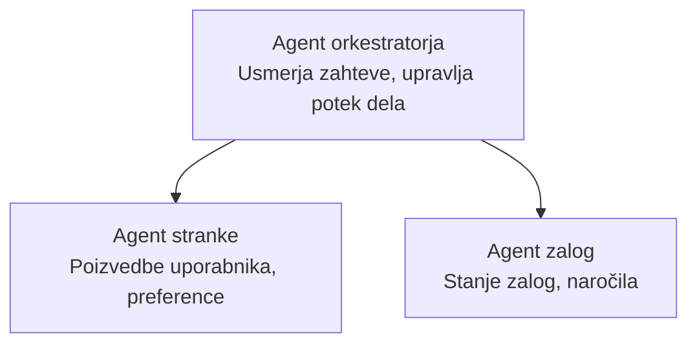

# Chapter 5: Multi-Agent AI Solutions

**📚 Course**: [AZD For Beginners](../../README.md) | **⏱️ Duration**: 2-3 hours | **⭐ Complexity**: Advanced

---

## Overview

To poglavje obravnava napredne vzorce arhitekture več agentov, orkestracijo agentov in pripravljenost za produkcijsko uvajanje AI za kompleksne scenarije.

> Preverjeno z `azd 1.23.12` marca 2026.

## Learning Objectives

Z dokončanjem tega poglavja boste:
- Razumeli vzorce arhitekture več agentov
- Uvedli koordinirane sisteme AI agentov
- Implementirali komunikacijo agent-agent
- Zgradili produkcijsko pripravljene rešitve več agentov

---

## 📚 Lessons

| # | Lesson | Description | Time |
|---|--------|-------------|------|
| 1 | [Maloprodajna večagentna rešitev](../../examples/retail-scenario.md) | Celoten pregled implementacije | 90 min |
| 2 | [Coordination Patterns](../chapter-06-pre-deployment/coordination-patterns.md) | Strategije orkestracije agentov | 30 min |
| 3 | [ARM Template Deployment](../../examples/retail-multiagent-arm-template/README.md) | Namestitev z enim klikom | 30 min |

---

## 🚀 Quick Start

```bash
# Možnost 1: Namesti iz predloge
azd init --template agent-openai-python-prompty
azd up

# Možnost 2: Namesti iz manifesta agenta (zahteva razširitev azure.ai.agents)
azd extension install azure.ai.agents
azd ai agent init -m agent-manifest.yaml
azd up
```

> **Kateri pristop?** Uporabite `azd init --template` za začetek z delujočim primerom. Uporabite `azd ai agent init`, ko imate svoj agentni manifest. Oglejte si [AZD AI CLI reference](../chapter-08-production/production-ai-practices.md#azd-ai-cli-commands-and-extensions) za popolne podrobnosti.

---

## 🤖 Multi-Agent Architecture


---

## 🎯 Izpostavljena rešitev: Maloprodajna večagentna rešitev

Rešitev [Maloprodajna večagentna rešitev](../../examples/retail-scenario.md) prikazuje:

- **Agent za stranke**: Obvladuje interakcije z uporabniki in preference
- **Agent za zaloge**: Upravlja zalogo in obdelavo naročil
- **Orkestrator**: Koordinira med agenti
- **Deljeni pomnilnik**: Upravljanje konteksta med agenti

### Uporabljene storitve

| Service | Purpose |
|---------|---------|
| Microsoft Foundry Models | Language understanding |
| Azure AI Search | Product catalog |
| Cosmos DB | Agent state and memory |
| Container Apps | Agent hosting |
| Application Insights | Monitoring |

---

## 🔗 Navigation

| Direction | Chapter |
|-----------|---------|
| **Prejšnje** | [Poglavje 4: Infrastruktura](../chapter-04-infrastructure/README.md) |
| **Naslednje** | [Poglavje 6: Pre-Deployment](../chapter-06-pre-deployment/README.md) |

---

## 📖 Related Resources

- [Vodnik za AI agente](../chapter-02-ai-development/agents.md)
- [Prakse za produkcijsko AI](../chapter-08-production/production-ai-practices.md)
- [Odpravljanje težav z AI](../chapter-07-troubleshooting/ai-troubleshooting.md)

---

<!-- CO-OP TRANSLATOR DISCLAIMER START -->
**Izjava o omejitvi odgovornosti**:
Ta dokument je bil preveden z uporabo storitve za prevajanje z umetno inteligenco [Co-op Translator](https://github.com/Azure/co-op-translator). Čeprav si prizadevamo za natančnost, upoštevajte, da lahko avtomatizirani prevodi vsebujejo napake ali netočnosti. Izvirni dokument v njegovem izvirnem jeziku velja za avtoritativni vir. Za ključne informacije priporočamo strokovni človeški prevod. Za morebitne nesporazume ali napačne razlage, ki izhajajo iz uporabe tega prevoda, ne odgovarjamo.
<!-- CO-OP TRANSLATOR DISCLAIMER END -->