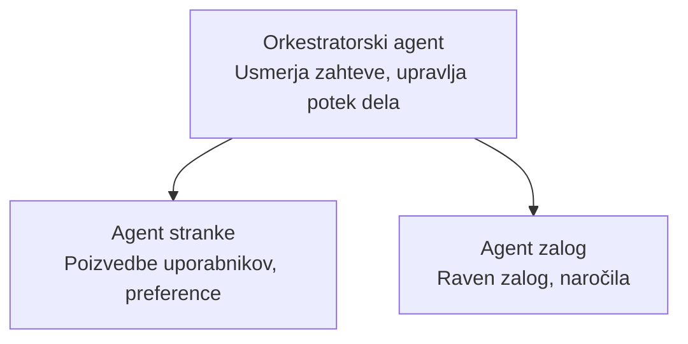

# Poglavje 5: Rešitve AI z več agenti

**📚 Tečaj**: [AZD For Beginners](../../README.md) | **⏱️ Trajanje**: 2–3 ure | **⭐ Kompleksnost**: Napredno

---

## Pregled

V tem poglavju so obravnavani napredni vzorci večagentne arhitekture, orkestracija agentov in produkcijsko pripravljene namestitve AI za kompleksne scenarije.

> Preverjeno z `azd 1.25.6` junija 2026.

## Učni cilji

Z dokončanjem tega poglavja boste:
- Razumeli vzorce večagentne arhitekture
- Razmestili usklajene sisteme AI agentov
- Implementirali komunikacijo med agenti
- Zgradili produkcijsko pripravljene rešitve z več agenti

---

## 📚 Lekcije

| # | Lekcija | Opis | Čas |
|---|--------|-------------|------|
| 1 | [Multi-Agent Basics](multi-agent-basics.md) | Praktično: razmestite delujočo večagentno aplikacijo z `azd up` | 45 min |
| 2 | [Coordination Patterns](../chapter-06-pre-deployment/coordination-patterns.md) | Strategije orkestracije agentov (nadaljuje se v poglavju 6) | 30 min |
| 3 | [ARM Template Deployment](../../examples/retail-multiagent-arm-template/README.md) | Primer namestitve z enim klikom | 30 min |

> **Začnite z lekcijo 1.** To je edina v celoti praktična, razmestljiva lekcija v tem poglavju. Lekcija 2 se nahaja v poglavju 6 (deljena je s načrtovanjem pred uvajanjem), in [Rešitev za maloprodajo z več agenti](../../examples/retail-scenario.md) je arhitekturni načrt — referenca zasnove, ne predloga za zagon z enim ukazom.

---

## 🚀 Hiter začetek

```bash
# Možnost 1: Razporedi iz predloge
azd init --template agent-openai-python-prompty
azd up

# Možnost 2: Razporedi iz manifesta agenta (zahteva razširitev azure.ai.agents)
azd extension install azure.ai.agents
azd ai agent init -m agent-manifest.yaml
azd up
```

> **Kateri pristop?** Uporabite `azd init --template` za začetek iz delujočega vzorca. Uporabite `azd ai agent init`, ko imate lasten manifest agenta. Oglejte si [Referenca AZD AI CLI](../chapter-08-production/production-ai-practices.md#azd-ai-cli-commands-and-extensions) za vse podrobnosti.

---

## 🤖 Arhitektura več agentov



---

## 🎯 Predstavljena rešitev: Rešitev za maloprodajo z več agenti

[Rešitev za maloprodajo z več agenti](../../examples/retail-scenario.md) prikazuje:

- **Agent za kupce**: Upravlja uporabniške interakcije in preference
- **Agent za zalogo**: Upravlja zalogo in obdelavo naročil
- **Orkestrator**: Koordinira med agenti
- **Deljeni pomnilnik**: Upravljanje konteksta med agenti

### Uporabljene storitve

| Storitev | Namen |
|---------|---------|
| Microsoft Foundry Models | Razumevanje jezika |
| Azure AI Search | Katalog izdelkov |
| Cosmos DB | Stanje in pomnilnik agentov |
| Container Apps | Gostovanje agentov |
| Application Insights | Spremljanje |

---

## 🔗 Navigacija

| Smer | Poglavje |
|-----------|---------|
| **Prejšnje** | [Poglavje 4: Infrastruktura](../chapter-04-infrastructure/README.md) |
| **Naslednje** | [Poglavje 6: Pred uvajanjem](../chapter-06-pre-deployment/README.md) |

---

## 📖 Povezani viri

- [Vodnik za AI agente](../chapter-02-ai-development/agents.md)
- [Prakse produkcijske AI](../chapter-08-production/production-ai-practices.md)
- [Odpravljanje težav pri AI](../chapter-07-troubleshooting/ai-troubleshooting.md)

---

<!-- CO-OP TRANSLATOR DISCLAIMER START -->
**Omejitev odgovornosti**:
Ta dokument je bil preveden z uporabo AI prevajalske storitve [Co-op Translator](https://github.com/Azure/co-op-translator). Čeprav si prizadevamo za natančnost, vas prosimo, da upoštevate, da avtomatizirani prevodi lahko vsebujejo napake ali netočnosti. Izvirni dokument v njegovem izvirnem jeziku je treba obravnavati kot avtoritativni vir. Za kritične informacije je priporočljiv strokovni človeški prevod. Ne odgovarjamo za morebitna nesporazume ali napačne interpretacije, ki izhajajo iz uporabe tega prevoda.
<!-- CO-OP TRANSLATOR DISCLAIMER END -->