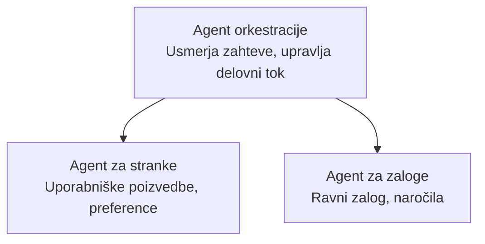

# Poglavje 5: Rešitve AI z več agenti

**📚 Tečaj**: [AZD Za začetnike](../../README.md) | **⏱️ Trajanje**: 2-3 ure | **⭐ Kompleksnost**: Napredno

---

## Pregled

To poglavje pokriva napredne vzorce arhitekture z več agenti, orkestracijo agentov in uvajanje AI, pripravljenih za proizvodnjo, za kompleksne scenarije.

> Preverjeno z `azd 1.27.1` julija 2026.

## Cilji učenja

S končanjem tega poglavja boste:
- Razumeli vzorce arhitekture z več agenti
- Uvedli usklajene sisteme AI agentov
- Implementirali komunikacijo med agenti
- Zgradili rešitve z več agenti, pripravljene za proizvodnjo

---

## 📚 Lekcije

| # | Lekcija | Opis | Čas |
|---|--------|-------------|------|
| 1 | [Osnove več agentov](multi-agent-basics.md) | Praktično: uvedite delujočo aplikacijo z več agenti z `azd up` | 45 min |
| 2 | [Vzorce usklajevanja](../chapter-06-pre-deployment/coordination-patterns.md) | Strategije orkestracije agentov (nadaljuje se v Poglavju 6) | 30 min |
| 3 | [Uvedba z ARM predlogo](../../examples/retail-multiagent-arm-template/README.md) | Primer uvedbe z enim klikom | 30 min |

> **Začnite z Lekcijo 1.** Je edina popolnoma praktična, uvedljiva lekcija v tem poglavju. Lekcija 2 je v Poglavju 6 (je del načrtovanja pred uvedbo), [Rešitev več agentov za maloprodajo](../../examples/retail-scenario.md) pa je arhitekturni načrt – referenca za oblikovanje, ne predloga za ukaz v eni vrstici.

---

## 🚀 Hitri začetek

```bash
# Možnost 1: Namestitev iz predloge
azd init --template agent-openai-python-prompty
azd up

# Možnost 2: Namestitev iz agentovega manifesta (zahteva razširitev azure.ai.agents)
azd extension install azure.ai.agents
azd ai agent init -m agent-manifest.yaml
azd up
```

> **Kateri pristop?** Uporabite `azd init --template` za začetek z delujočim primerom. Uporabite `azd ai agent init`, ko imate svoj manifest agenta. Za podrobnosti glejte [referenco AZD AI CLI](../chapter-08-production/production-ai-practices.md#azd-ai-cli-commands-and-extensions).

---

## 🤖 Arhitektura z več agenti



---

## 🎯 Predstavljena rešitev: Več-agentna maloprodaja

[Rešitev več agentov za maloprodajo](../../examples/retail-scenario.md) prikazuje:

- **Agent za stranke**: Upravljanje interakcij in preferenc uporabnikov
- **Agent za zaloge**: Upravljanje zalog in obdelava naročil
- **Orkestrator**: Koordinacija med agenti
- **Skupni pomnilnik**: Upravljanje konteksta med agenti

### Uporabljene storitve

| Storitev | Namen |
|---------|---------|
| Microsoft Foundry Models | Razumevanje jezika |
| Azure AI Search | Katalog izdelkov |
| Cosmos DB | Stanje in pomnilnik agentov |
| Container Apps | Gostovanje agentov |
| Application Insights | Nadzor |

---

## 🔗 Navigacija

| Smer | Poglavje |
|-----------|---------|
| **Prejšnje** | [Poglavje 4: Infrastruktura](../chapter-04-infrastructure/README.md) |
| **Naslednje** | [Poglavje 6: Pred uvedbo](../chapter-06-pre-deployment/README.md) |

---

## 📖 Sorodni viri

- [Vodnik za AI agente](../chapter-02-ai-development/agents.md)
- [Prakse za proizvodno AI](../chapter-08-production/production-ai-practices.md)
- [Odpravljanje težav z AI](../chapter-07-troubleshooting/ai-troubleshooting.md)

---

<!-- CO-OP TRANSLATOR DISCLAIMER START -->
**Omejitev odgovornosti**:
Ta dokument je bil preveden z uporabo AI prevajalske storitve [Co-op Translator](https://github.com/Azure/co-op-translator). Čeprav si prizadevamo za natančnost, vas prosimo, da upoštevate, da avtomatizirani prevodi lahko vsebujejo napake ali netočnosti. Izvirni dokument v njegovem izvirnem jeziku je treba obravnavati kot avtoritativni vir. Za kritične informacije je priporočljiv strokovni človeški prevod. Ne odgovarjamo za morebitna nesporazume ali napačne interpretacije, ki izhajajo iz uporabe tega prevoda.
<!-- CO-OP TRANSLATOR DISCLAIMER END -->