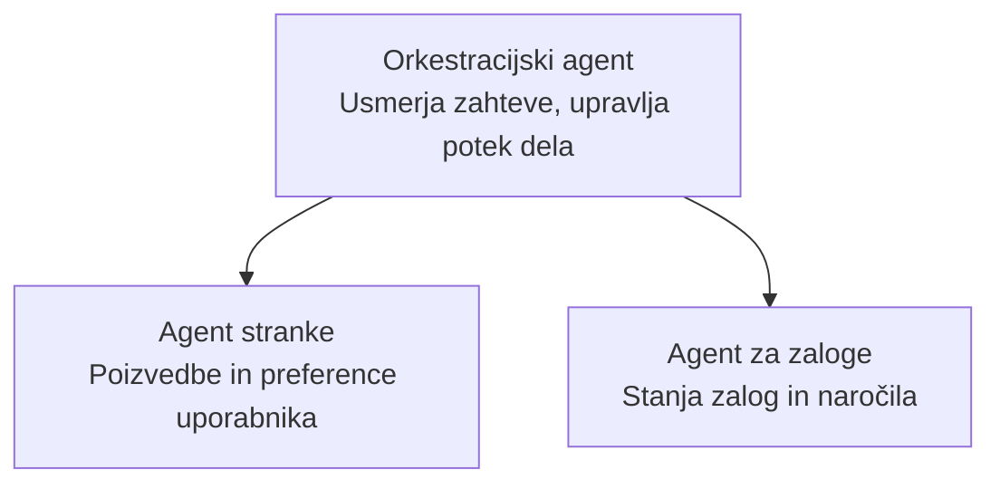

# Poglavje 5: Večagentne AI rešitve

**📚 Tečaj**: [AZD za začetnike](../../README.md) | **⏱️ Trajanje**: 2-3 ure | **⭐ Kompleksnost**: Napredno

---

## Pregled

To poglavje pokriva napredne vzorce večagentne arhitekture, orkestracijo agentov in proizvodno pripravljene AI namestitve za kompleksne scenarije.

## Cilji učenja

Z dokončanjem tega poglavja boste:
- Razumeli vzorce večagentne arhitekture
- Namestili usklajene sisteme AI agentov
- Implementirali komunikacijo agent-agent
- Zgradili proizvodno pripravljene večagentne rešitve

---

## 📚 Lekcije

| # | Lekcija | Opis | Čas |
|---|--------|-------------|------|
| 1 | [Večagentna maloprodajna rešitev](../../examples/retail-scenario.md) | Celoten potek implementacije | 90 min |
| 2 | [Vzorci koordinacije](../chapter-06-pre-deployment/coordination-patterns.md) | Strategije orkestracije agentov | 30 min |
| 3 | [Namestitev z ARM predlogo](../../examples/retail-multiagent-arm-template/README.md) | Namestitev z enim klikom | 30 min |

---

## 🚀 Hiter začetek

```bash
# Možnost 1: Razporedi iz predloge
azd init --template agent-openai-python-prompty
azd up

# Možnost 2: Razporedi iz manifesta agenta (zahteva razširitev azure.ai.agents)
azd extension install azure.ai.agents
azd ai agent init -m agent-manifest.yaml
azd up
```

> **Kateri pristop?** Uporabite `azd init --template` za začetek iz delujočega primera. Uporabite `azd ai agent init`, ko imate lasten manifest agenta. Oglejte si [referenco AZD AI CLI](../chapter-08-production/production-ai-practices.md#azd-ai-cli-commands-and-extensions) za podrobnosti.

---

## 🤖 Večagentna arhitektura


---

## 🎯 Izpostavljena rešitev: Večagentna maloprodaja

The [Večagentna maloprodajna rešitev](../../examples/retail-scenario.md) prikazuje:

- **Agent za kupce**: Upravlja interakcije z uporabniki in preference
- **Agent zalog**: Upravlja zaloge in obdelavo naročil
- **Orkestrator**: Koordinira med agenti
- **Deljeni pomnilnik**: Upravljanje konteksta med agenti

### Uporabljene storitve

| Storitev | Namen |
|---------|---------|
| Microsoft Foundry Models | Razumevanje jezika |
| Azure AI Search | Katalog izdelkov |
| Cosmos DB | Stanje in pomnilnik agentov |
| Container Apps | Gostovanje agentov |
| Application Insights | Spremljanje |

---

## 🔗 Navigacija

| Smer | Poglavje |
|-----------|---------|
| **Prejšnje** | [Poglavje 4: Infrastructure](../chapter-04-infrastructure/README.md) |
| **Naslednje** | [Poglavje 6: Pred-uvajanje](../chapter-06-pre-deployment/README.md) |

---

## 📖 Povezani viri

- [Vodnik po AI agentih](../chapter-02-ai-development/agents.md)
- [Prakse produkcijske AI](../chapter-08-production/production-ai-practices.md)
- [Odpravljanje težav z AI](../chapter-07-troubleshooting/ai-troubleshooting.md)

---

<!-- CO-OP TRANSLATOR DISCLAIMER START -->
**Izjava o omejitvi odgovornosti**:
Ta dokument je bil preveden z uporabo AI prevajalske storitve [Co-op Translator](https://github.com/Azure/co-op-translator). Čeprav si prizadevamo za natančnost, upoštevajte, da lahko avtomatizirani prevodi vsebujejo napake ali netočnosti. Izvirni dokument v izvirnem jeziku naj se šteje za avtoritativni vir. Za kritične informacije priporočamo strokovni človeški prevod. Ne odgovarjamo za kakršne koli nesporazume ali napačne interpretacije, ki izhajajo iz uporabe tega prevoda.
<!-- CO-OP TRANSLATOR DISCLAIMER END -->