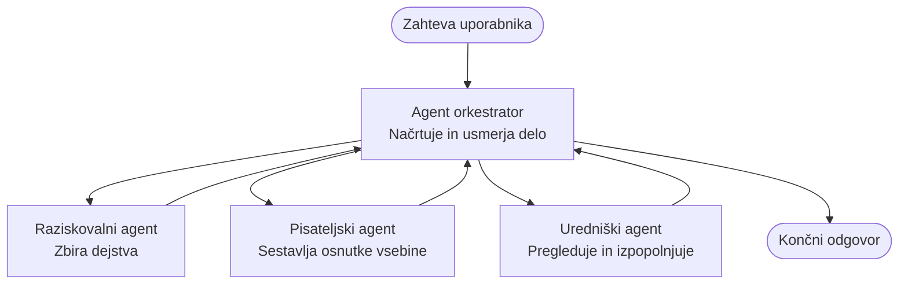

# Multi-Agent Basics - Deploy Your First Coordinated AI System

**Chapter Navigation:**
- **📚 Course Home**: [AZD For Beginners](../../README.md)
- **📖 Current Chapter**: Chapter 5 - Multi-Agent AI Solutions
- **⬅️ Previous**: [Chapter 4: Infrastructure](../chapter-04-infrastructure/README.md)
- **➡️ Next**: [Coordination Patterns](../chapter-06-pre-deployment/coordination-patterns.md)

> Validated against `azd 1.25.6` in June 2026.

## Uvod

V prejšnjih poglavjih ste namestili eno aplikacijo — in v Poglavju 2 ste namestili enega AI agenta. Ta lekcija naredi naslednji korak: namestitev **večagentnega sistema**, kjer več specializiranih agentov sodeluje, da reši problem, ki ga en agent sam ne bi rešil dobro.

Dobra novica za začetnike: **ne potrebujete novih ukazov.** Večagentna rešitev je še vedno azd projekt. Uporabili boste `azd init`, `azd up`, testiranje in `azd down` — natanko delovni tok, ki ga že poznate. Spremeni se le *oblika* aplikacije v notranjosti.

## Cilji učenja

Do konca te lekcije boste:
- Razumeli, kaj pomeni "večagentno" in kdaj je vredno dodatne kompleksnosti
- Prepoznali pogoste vloge v večagentnem sistemu (orkestrator + specialisti)
- Namestili dejansko, delujočo predlogo večagentne rešitve z `azd up`
- Razumeli Azure vire, ki podpirajo večagentno aplikacijo
- Vedeli, kako preveriti, prilagoditi in varno odstraniti rešitev

## Rezultati učenja

Po zaključku te lekcije boste sposobni:
- Pojasniti razliko med enim agentom in večagentnim sistemom
- Izbrati med enim agentom z orodji in pravo večagentno zasnovo
- Namestiti in preizkusiti večagentno predlogo od začetka do konca z azd
- Določiti, kje vsak agent teče in kako komunicirajo
- Očistiti vse vire, da se izognete nadaljnjim stroškom

---

## Kaj je večagentni sistem?

En sam AI agent je en model z nizom navodil in (po potrebi) nekaterimi orodji. To dobro deluje za fokusirane naloge. A ko naloga raste — raziskovanje, potem pisanje, nato urejanje, nato preverjanje dejstev — stlačiti vse v en poziv naredi agenta počasnejšega, manj zanesljivega in težje za razhroščevanje.

**Večagentni sistem** razdeli delo na specialiste, ki vsak opravijo eno nalogo dobro, ki jih usklajuje orkestrator:



### Dve vlogi, ki ju boste vedno videli

| Vloga | Naloga | Primer |
|------|-----|---------|
| **Orkestrator** | Odloča *kaj se zgodi naslednje* in usmerja delo med agenti | "Najprej raziskava, potem pisanje, nato urejanje" |
| **Specialist** | Opravlja eno osredotočeno nalogo in vrne rezultat | "raziskovalec", ki zbira le dejstva |

### Ali res potrebujete več agentov?

Začnite preprosto. Posezite po večagentnem pristopu **samo**, ko velja eno od tega:

- ✅ Naloga ima **različne faze**, ki imajo koristi od različnih navodil (raziskava proti pisanju proti pregledovanju)
- ✅ Želite, da specialisti tečejo **paralelno**, da prihranite čas
- ✅ Različni koraki potrebujejo **različna orodja ali podatkovne vire**
- ✅ Potrebujete, da je vsak korak **neodvisno testabilen in razhroščljiv**

Če je vaša naloga en sam vprašaj-odgovori ali preprost klic orodja, je **en agent z orodji** (Poglavje 2) enostavnejši, cenejši in lažji za upravljanje.

> **Nasvet za začetnike:** "Več agentov" ni nujno "bolje." Vsak agent doda latenco, strošek in novo stvar za spremljanje. Dodajajte agente samo, ko se problem jasno razdeli na dele.

---

## Dva načina za gradnjo večagentnega sistema na Azure

| Pristop | Kaj je | Najbolj za |
|----------|-----------|----------|
| **En agent + orodja** | En Foundry agent, ki kliče funkcije/orodja | Preprosti delovni tokovi, začetek |
| **Več usklajenih agentov** | Več agentov z orkestratorjem | Različne faze, paralelno delo, specializacija |

Ta lekcija se osredotoča na drugi pristop z uporabo **vnaprej pripravljene predloge**, da lahko vidite resničen večagentni sistem v teku, preden zgradite svojega.

---

## Praktično: Namestite delujočo večagentno aplikacijo

Namestili bomo **Contoso Creative Writer**, uradni primer Azure, ki uporablja več agentov (raziskovalec, pisec, urednik), usklajenih za ustvarjanje članka. To je odličen prvi večagentni primer, ker so vloge lahko razumljive.

### Korak 1: Inicializirajte predlogo

```bash
# Ustvarite delovno mapo
mkdir creative-writer && cd creative-writer

# Inicializirajte iz uradne predloge za več agentov
azd init --template contoso-creative-writer
```

> Brskajte po večpredlogah za več agentov kadarkoli v [Awesome AZD AI gallery](https://azure.github.io/awesome-azd/?tags=ai). Druge možnosti prijazne do začetnikov vključujejo `get-started-with-ai-agents` in `azure-ai-travel-agents`.

### Korak 2: Avtentikacija

```bash
# Potrebno za azd delovne tokove
azd auth login
```

### Korak 3: Ustvarite okolje

```bash
azd env new dev
```

### Korak 4: Predogled, nato namestitev

```bash
# Preverite, kaj bo ustvarjeno, preden karkoli porabite (priporočeno)
azd provision --preview

# Zagotovite infrastrukturo in razmestite vse agente v enem koraku
azd up
```

`azd up` bo zahteval izbiro naročnine in regije, nato pa ustvaril Azure vire in namestil aplikacijo. Namestitve AI lahko trajajo dlje kot preprosta spletna aplikacija — če nameščate večje modele, lahko podaljšate čas namestitve:

```bash
azd deploy --timeout 1800
```

> **Pozor glede stroškov in zmogljivosti:** Večagentne aplikacije nameščajo AI modele, ki porabljajo kvoto in povzročajo stroške. Če `azd up` ne uspe zaradi kvote za modele, glejte [AI Troubleshooting](../chapter-07-troubleshooting/ai-troubleshooting.md) za popravke regije in kvot ter Poglavje 6 [Capacity Planning](../chapter-06-pre-deployment/capacity-planning.md).

---

## Razumevanje, kaj ste namestili

Tipična večagentna aplikacija, kot je ta, zagotovi nabor Azure virov, ki se neposredno ujemajo z odgovornostmi na zgornjem diagramu:

| Vir | Zakaj je tam |
|----------|----------------|
| **Microsoft Foundry / Models** | Gosti jezikovne modele, ki jih uporablja vsak agent |
| **Azure AI Search** | Raziskovalnemu agentu omogoča iskanje utemeljenih podatkov |
| **Container Apps** (ali App Service) | Gosti orkestrator in kodo agentov |
| **Cosmos DB** (v nekaterih primerih) | Shranjuje deljeno stanje/pomnilnik, ki se prenaša med agenti |
| **Application Insights** | Sledi zahtevkom *čez* agente, da lahko razhroščite tok |

### Kako agenti med seboj komunicirajo

V večini azd večagentnih primerov **orkestrator teče v vaši aplikacijski kodi** (na primer z uporabo okvira, kot sta Semantic Kernel ali Microsoft Agent Framework). Orkestrator kliče vsakega specialista zaporedoma, posreduje rezultate in sestavi končni odgovor. Agenti si delijo kontekst prek:

- **Klicev funkcij/orodij** — orkestrator pokliče specialista in prejme rezultat nazaj
- **Deljenega pomnilnika** — baza podatkov (pogosto Cosmos DB) hrani stanje, ki ga lahko berejo oba agenta
- **Sporočil/dogodkov** — za bolj ohlapno povezavo agenti komunicirajo preko vrste ali Service Bus

> **Zakaj je to pomembno za razhroščevanje:** ker je vsak korak ločen, vam Application Insights pokaže *kateri* agent je bil počasen ali je spodletel. To je glavni razlog za razdelitev dela med agente.

---

## Preverite namestitev

Potrdite, da sistem dejansko deluje, preden nadaljujete:

```bash
# Prikaži nameščene končne točke
azd show

# Odpri nadzorno ploščo za spremljanje aplikacije
azd monitor

# Sledi dnevnikom, če kaj ne izgleda v redu
azd monitor --logs
```

Nato odprite URL aplikacije iz `azd show` in poizkusite zahtevo, ki aktivira vse agente (za Creative Writer na primer prosite, naj napiše kratek članek o določeni temi). V **iskanju transakcij** v Application Insights bi morali videti, kako se zahteva razveji skozi korake raziskovalca, pisca in urednika.

**Kriteriji uspeha:**
- ✅ `azd show` navaja dosegljivo končno točko
- ✅ Zahteva ustvari rezultat, ki očitno poteka skozi več faz
- ✅ Application Insights prikazuje sledi za več kot en korak agenta

---

## Prilagodite: Dodajte ali prilagodite agenta

Ker je vsak agent le navodila plus orodja, je prilagajanje izvedljivo:

1. **Poiščite definicije agentov** v predlogi (pogosto mapa `prompts/`, `agents/` ali nabor datotek `*.prompty`).
2. **Prilagodite navodila agenta** — na primer, povejte uredniškemu agentu, naj uveljavlja določen ton ali omejitev besed.
3. **Ponovno namestite samo kodo** (infrastruktura ostane enaka):

   ```bash
   azd deploy
   ```

Če želite napredovati in graditi agente iz *svoje* zasnove, uporabite razširitev za agente in njen celoten življenjski cikel:

```bash
azd extension install azure.ai.agents
azd ai agent init -m agent-manifest.yaml
azd up
azd ai agent invoke      # test, z merjenjem časa odziva
```

Poglejte [Chapter 2: Agents](../chapter-02-ai-development/agents.md) in referenco [AZD AI CLI](../chapter-08-production/production-ai-practices.md#azd-ai-cli-commands-and-extensions) za popoln življenjski cikel agentov (`invoke`, `eval generate`, `optimize`, `delete`).

---

## Počisti

Večagentne aplikacije poganjajo več plačljivih storitev. Odstranite vse, ko končate:

```bash
azd down --force --purge
```

Zastavica `--purge` prav tako odstrani soft-deleted AI vire (kot so Foundry/Azure AI Services računi), da ne preprečujejo prihodnje ponovne namestitve ali nadaljnje porabe.

---

## Opomba o produkcijskih večagentnih sistemih

The [Retail Multi-Agent Solution](../../examples/retail-scenario.md) v tem repozitoriju je **arhitekturna izhodiščna zasnova**, ne predloga za en ukaz — dokumentira, kako bi bil produkcijski trgovinski sistem *zgrajen* (in jasno pove, da je polna gradnja obsežen podvig). Uporabite jo kot referenco za oblikovanje *potem*, ko ste namestili delujoč primer tukaj. Za produkcijske skrbi (odpornost, stroški, spremljanje, upravljanje) nadaljujte v [Chapter 8: Production AI Practices](../chapter-08-production/production-ai-practices.md).

---

## Povzetek

- Večagentni sistem razdeli delo med specialiste, ki jih usklajuje orkestrator.
- Uporabljajte ga le, ko ima naloga različne faze, paralelizem ali različna orodja po korakih — sicer raje izberite enega agenta.
- Delovni tok azd se ne spreminja: `azd init` → `azd up` → test → `azd down`.
- Resnična predloga, kot je `contoso-creative-writer`, vam omogoča, da danes vidite in prilagodite delujočo večagentno aplikacijo.
- Tracing v Application Insights čez agente je ena največjih praktičnih prednosti večagentne zasnove.

---

## 🔗 Navigacija

| Direction | Lesson |
|-----------|--------|
| **Previous** | [Chapter 4: Infrastructure](../chapter-04-infrastructure/README.md) |
| **Next** | [Coordination Patterns](../chapter-06-pre-deployment/coordination-patterns.md) |

## 📖 Sorodni viri

- [AI Agents Guide](../chapter-02-ai-development/agents.md)
- [Coordination Patterns](../chapter-06-pre-deployment/coordination-patterns.md)
- [Production AI Practices](../chapter-08-production/production-ai-practices.md)
- [AI Troubleshooting](../chapter-07-troubleshooting/ai-troubleshooting.md)

---

<!-- CO-OP TRANSLATOR DISCLAIMER START -->
**Omejitev odgovornosti**:
Ta dokument je bil preveden z uporabo AI prevajalske storitve [Co-op Translator](https://github.com/Azure/co-op-translator). Čeprav si prizadevamo za natančnost, vas prosimo, da upoštevate, da avtomatizirani prevodi lahko vsebujejo napake ali netočnosti. Izvirni dokument v njegovem izvirnem jeziku je treba obravnavati kot avtoritativni vir. Za kritične informacije je priporočljiv strokovni človeški prevod. Ne odgovarjamo za morebitna nesporazume ali napačne interpretacije, ki izhajajo iz uporabe tega prevoda.
<!-- CO-OP TRANSLATOR DISCLAIMER END -->