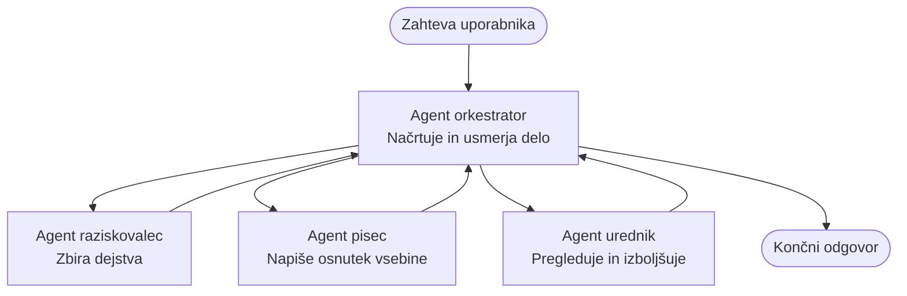

# Osnove večagentnih sistemov - Namestite svoj prvi koordinirani AI sistem

**Navigacija po poglavjih:**
- **📚 Domov na tečaju**: [AZD Za začetnike](../../README.md)
- **📖 Trenutno poglavje**: Poglavje 5 - Večagentne AI rešitve
- **⬅️ Prejšnje**: [Poglavje 4: Infrastruktura](../chapter-04-infrastructure/README.md)
- **➡️ Naslednje**: [Vzorce koordinacije](../chapter-06-pre-deployment/coordination-patterns.md)

> Preverjeno z `azd 1.27.1` v juliju 2026.

## Uvod

V prejšnjih poglavjih ste namestili eno samo aplikacijo — in v Poglavju 2 ste namestili enega AI agenta. Ta lekcija naredi naslednji korak: namestitev **večagentnega sistema**, kjer več specializiranih agentov sodeluje, da reši problem, ki ga sam en agent ne bi mogel dobro obvladati.

Dobra novica za začetnike: **ne potrebujete novih ukazov.** Večagentna rešitev je še vedno azd projekt. Naredili boste `azd init`, `azd up`, testirali in `azd down` — točno tisti delovni tok, ki ga že poznate. Kar se spremeni, je *oblika* aplikacije znotraj.

## Cilji učenja

Do konca te lekcije boste:
- Razumeli, kaj pomeni "večagentno" in kdaj se dodatna kompleksnost izplača
- Spoznali skupne vloge v večagentnem sistemu (orkestrator + specialisti)
- Namestili pravi, delujoči večagentni predlog z `azd up`
- Razumeli Azure vire, ki podpirajo večagentno aplikacijo
- Znali varno preveriti, prilagoditi in odstraniti rešitev

## Rezultati učenja

Po zaključku te lekcije boste znali:
- Pojasniti razliko med enim agentom in večagentnim sistemom
- Izbrati med enim agentom z orodji in pravo večagentno zasnovo
- Namestiti in preizkusiti večagentni predlog od začetka do konca z azd
- Identificirati, kje teče vsak agent in kako komunicirajo
- Očistiti vse vire, da se izognete stalnim stroškom

---

## Kaj je večagentni sistem?

En AI agent je en model z nizom navodil in (opcijsko) nekaterih orodji. To deluje dobro za osredotočene naloge. A ko naloga raste — raziskovanje, nato pisanje, nato urejanje, nato preverjanje dejstev — stlačevanje vsega v en poziv naredi agenta počasnejšega, manj zanesljivega in težjega za odpravljanje napak.

**Večagentni sistem** razdeli delo na specialiste, ki vsak dobro opravljajo eno nalogo, koordinira pa jih orkestrator:



### Dve vlogi, ki ju boste vedno videli

| Vloga | Naloga | Primer |
|------|--------|--------|
| **Orkestrator** | Odloča *kaj se zgodi naprej* in usmerja delo med agenti | "Najprej raziskuj, nato piši, nato uredi" |
| **Specialist** | Opravi eno osredotočeno nalogo in vrne rezultat | "raziskovalec", ki zbira samo dejstva |

### Ali res potrebujete več agentov?

Začnite preprosto. Za večagentno **posezite samo** kadar je eden izmed teh pogojev resničen:

- ✅ Naloga ima **različne faze**, ki imajo koristi od različnih navodil (raziskava, pisanje, pregled)
- ✅ Želite, da specialisti tečejo **vzporedno** in tako prihranijo čas
- ✅ Različni koraki potrebujejo **različna orodja ali podatkovne vire**
- ✅ Vsak korak mora biti **neodvisno preizkušljiv in odpravljiv**

Če je vaša naloga enostavno vprašanje in odgovor ali preprost klic orodja, je **en agent z orodji** (Poglavje 2) preprostejši, cenejši in lažji za uporabo.

> **Nasvet za začetnike:** "Več agentov" ni vedno "bolje". Vsak agent doda zakasnitev, stroške in nekaj novega za nadzorovati. Dodajte agente samo, če je problem očitno razdeljen na dele.

---

## Dva načina za gradnjo večagentnega sistema na Azure

| Pristop | Kaj je | Najboljše za |
|----------|--------|-----------|
| **En sam agent + orodja** | En Foundry agent, ki kliče funkcije/orodja | Preprosti delovni tokovi, začetek |
| **Več usklajenih agentov** | Več agentov z orkestratorjem | Različne faze, vzporedno delo, specializacija |

Ta lekcija se osredotoča na drugi pristop z uporabo **vnaprej pripravljenega predloga**, da lahko vidite pravi večagentni sistem v delovanju, preden zgradite svojega.

---

## Praktično: Namestite delujočo večagentno aplikacijo

Namestili bomo **Contoso Creative Writer**, uradni vzorec Azure, ki uporablja več agentov (raziskovalec, pisec, urednik), koordiniranih za izdelavo članka. To je odlična prva večagentna aplikacija, ker so vloge enostavne za razumevanje.

### 1. korak: Inicializirajte predlogo

```bash
# Ustvari delovno mapo
mkdir creative-writer && cd creative-writer

# Inicializiraj iz uradne predloge za več agentov
azd init --template contoso-creative-writer
```

> Kadar koli si oglejte več predlog večagentnih aplikacij v [Galeriji Awesome AZD AI](https://azure.github.io/awesome-azd/?tags=ai). Druge možnosti za začetnike so `get-started-with-ai-agents` in `azure-ai-travel-agents`.

### 2. korak: Avtentikacija

```bash
# Potrebno za azd poteke dela
azd auth login
```

### 3. korak: Ustvarite okolje

```bash
azd env new dev
```

### 4. korak: Predogled, nato namestitev

```bash
# Oglejte si, kaj bo ustvarjeno, preden karkoli zapravite (priporočeno)
azd provision --preview

# Pripravite infrastrukturo in namestite vse agente v enem koraku
azd up
```

`azd up` bo zahteval naročnino in regijo, nato bo pripravil Azure vire in namestil aplikacijo. Namestitve AI lahko trajajo dlje kot preprosta spletna aplikacija — če nameščate večje modele, lahko podaljšate čas za namestitev:

```bash
azd deploy --timeout 1800
```

> **Opozorilo glede stroškov in zmogljivosti:** Večagentne aplikacije nameščajo AI modele, ki porabljajo kvoto in povzročajo stroške. Če `azd up` ne uspe zaradi kvote modela, glejte [AI odpravljanje težav](../chapter-07-troubleshooting/ai-troubleshooting.md) za popravke regije in kvote ter Poglavje 6 [Načrtovanje zmogljivosti](../chapter-06-pre-deployment/capacity-planning.md).

---

## Razumevanje, kaj ste namestili

Tipična večagentna aplikacija kot ta pripravi niz Azure virov, ki neposredno ustrezajo odgovornostim na zgornjem diagramu:

| Vir | Zakaj je tam |
|----------|----------------|
| **Microsoft Foundry / modeli** | Gosti jezikovne modele, ki jih uporablja vsak agent |
| **Azure AI Search** | Daje raziskovalcu podatke za iskanje |
| **Container Apps** (ali App Service) | Gosti orkestrator in kodo agentov |
| **Cosmos DB** (v nekaterih vzorcih) | Shrani deljeno stanje/spomin, ki ga prenašajo agenti |
| **Application Insights** | Sledi zahtevam *prek* agentov, da lahko odpravljate težave poteka |

### Kako agenti komunicirajo med seboj

V večini azd večagentnih vzorcev **orkestrator teče v kodi vaše aplikacije** (na primer z uporabo ogrodja kot Semantic Kernel ali Microsoft Agent Framework). Orkestrator klice vsakega specialista zaporedno, predaja rezultate in sestavlja končni odgovor. Agenti si delijo kontekst preko:

- **Klicev funkcij/orodij** — orkestrator kliče specialista in prejme rezultat nazaj
- **Deljenega spomina** — baza podatkov (pogosto Cosmos DB) hrani stanje, ki ga oba agenta lahko bereta
- **Sporočil/dogodkov** — za ohlapnejšo povezavo agenti komunicirajo preko čakalne vrste ali Service Bus

> **Zakaj je to pomembno za odpravljanje napak:** ker je vsak korak ločen, Application Insights pokaže, *kateri* agent je bil počasen ali je odpovedal. To je glavni razlog za razdelitev dela med agente.

---

## Preverite namestitev

Potrdite, da sistem dejansko deluje, preden nadaljujete:

```bash
# Pokaži razporejene končne točke
azd show

# Odpri nadzorno ploščo za spremljanje aplikacije
azd monitor

# Sledi dnevnikom, če nekaj ni v redu
azd monitor --logs
```

Nato odprite URL aplikacije iz `azd show` in poskusite zahtevo, ki aktivira vse agente (pri Creative Writer, naj napiše kratek članek na določeno temo). V **iskanju transakcij** v Application Insights bi morali videti, kako zahteva poteka skozi raziskovalec, pisec in urednik.

**Merila uspeha:**
- ✅ `azd show` izpiše dosegljivo končno točko
- ✅ Zahteva proizvede rezultat, ki jasno poteka skozi več faz
- ✅ Application Insights prikazuje sledove za več kot en korak agenta

---

## Prilagodite: dodajte ali prilagodite agenta

Ker je vsak agent le navodila plus orodja, je prilagajanje dostopno:

1. **Poiščite definicije agentov** v predlogi (pogosto mapa `prompts/`, `agents/` ali niz datotek `*.prompty`).
2. **Prilagodite navodila agenta** — na primer, naročite uredniku, naj uveljavi določen ton ali število besed.
3. **Ponovno namestite samo kodo** (infrastruktura je nespremenjena):

   ```bash
   azd deploy
   ```

Za nadaljnje delo in izdelavo agentov iz vašega *novega* manifesta uporabite razširitev za agente in njen celoten življenjski cikel:

```bash
azd extension install azure.ai.agents
azd ai agent init -m agent-manifest.yaml
azd up
azd ai agent invoke      # test, s časovanjem odziva
```

Oglejte si [Poglavje 2: Agenti](../chapter-02-ai-development/agents.md) in [referenco AZD AI CLI](../chapter-08-production/production-ai-practices.md#azd-ai-cli-commands-and-extensions) za popoln življenjski cikel agentov (`invoke`, `eval generate`, `optimize`, `delete`).

---

## Čiščenje

Večagentne aplikacije izvajajo več plačljivih storitev. Odstranite vse, ko končate:

```bash
azd down --force --purge
```

Zastavica `--purge` prav tako odstrani mehko izbrisane AI vire (kot so računi Foundry/Azure AI Services), da ne preprečujejo prihodnjih namestitev ali povzročajo stroškov.

---

## Opomba o produkcijskih večagentnih sistemih

[Retail Multi-Agent Solution](../../examples/retail-scenario.md) v tem repozitoriju je **arhitekturna zasnova**, ne predloga za en ukaz — dokumentira, kako bi se produkcijski sistem za maloprodajo zgradil (in jasno pove, da je polna gradnja obsežen podvig). Uporabite ga kot referenco za načrtovanje *po* tem, ko boste namestili delujoč vzorec tukaj. Za produkcijske zadeve (odpornost, stroški, nadzor, upravljanje) nadaljujte s [Poglavjem 8: Produkcijske AI prakse](../chapter-08-production/production-ai-practices.md).

---

## Povzetek

- Večagentni sistem razdeli delo med specialiste, ki jih koordinira orkestrator.
- Uporabite ga samo, ko naloga ima različne faze, vzporedno izvajanje ali različna orodja za vsak korak — drugače raje uporabite enega agenta.
- Delovni tok azd je nespremenjen: `azd init` → `azd up` → test → `azd down`.
- Resnična predloga, kot je `contoso-creative-writer`, vam danes omogoča ogled in prilagoditev delujoče večagentne aplikacije.
- Sledenje v Application Insights prek agentov je ena največjih praktičnih prednosti večagentne zasnove.

---

## 🔗 Navigacija

| Smer | Lekcija |
|--------|---------|
| **Prejšnje** | [Poglavje 4: Infrastruktura](../chapter-04-infrastructure/README.md) |
| **Naslednje** | [Vzorce koordinacije](../chapter-06-pre-deployment/coordination-patterns.md) |

## 📖 Sorodni viri

- [Vodnik po AI agentih](../chapter-02-ai-development/agents.md)
- [Vzorce koordinacije](../chapter-06-pre-deployment/coordination-patterns.md)
- [Produkcijske AI prakse](../chapter-08-production/production-ai-practices.md)
- [Odpravljanje težav z AI](../chapter-07-troubleshooting/ai-troubleshooting.md)

---

<!-- CO-OP TRANSLATOR DISCLAIMER START -->
**Omejitev odgovornosti**:
Ta dokument je bil preveden z uporabo AI prevajalske storitve [Co-op Translator](https://github.com/Azure/co-op-translator). Čeprav si prizadevamo za natančnost, vas prosimo, da upoštevate, da avtomatizirani prevodi lahko vsebujejo napake ali netočnosti. Izvirni dokument v njegovem izvirnem jeziku je treba obravnavati kot avtoritativni vir. Za kritične informacije je priporočljiv strokovni človeški prevod. Ne odgovarjamo za morebitna nesporazume ali napačne interpretacije, ki izhajajo iz uporabe tega prevoda.
<!-- CO-OP TRANSLATOR DISCLAIMER END -->