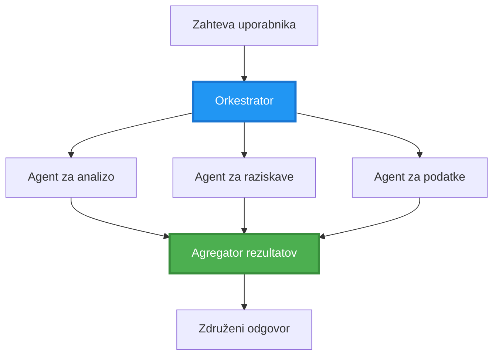
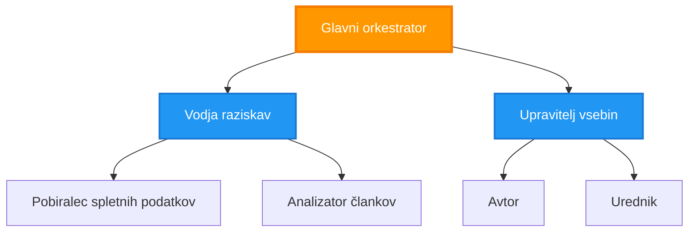
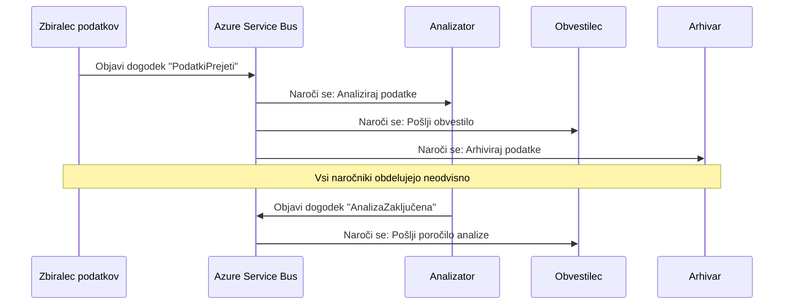
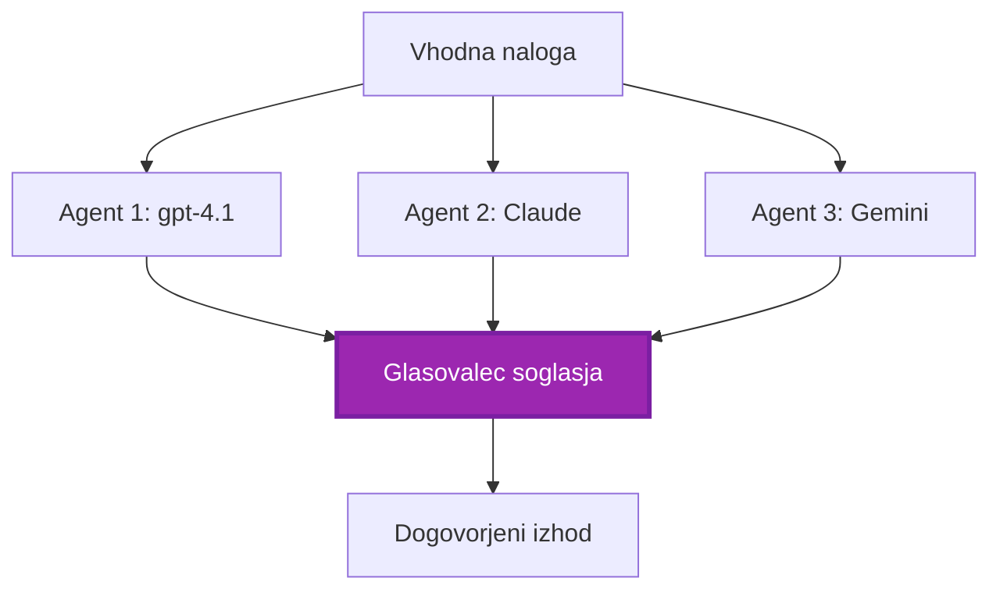
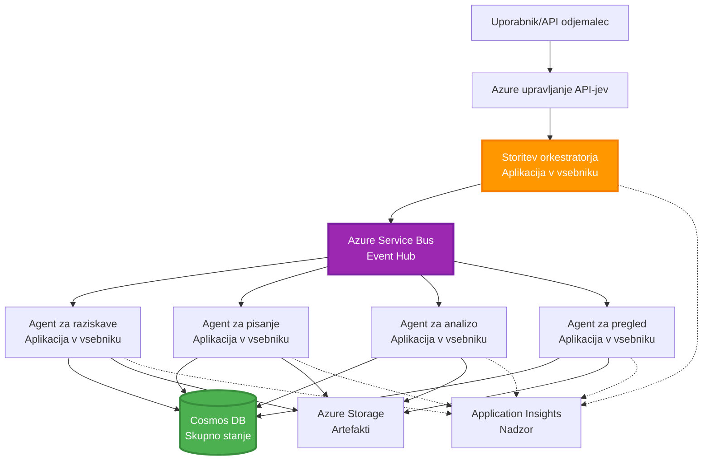

# Vzorci koordinacije več agentov

⏱️ **Ocenjen čas**: 60-75 minut | 💰 **Ocenjeni strošek**: ~$100-300/mesec | ⭐ **Kompleksnost**: Napredno

**📚 Pot učenja:**
- ← Prejšnji: [Načrtovanje zmogljivosti](capacity-planning.md) - Velikost virov in strategije skaliranja
- 🎯 **Tukaj ste**: Vzorci koordinacije več agentov (orkestracija, komunikacija, upravljanje stanja)
- → Naslednji: [Izbira SKU](sku-selection.md) - Izbira pravih Azure storitev
- 🏠 [Domača stran tečaja](../../README.md)

---

## Česa se boste naučili

Z dokončanjem te lekcije boste:
- Razumeli vzorce **arhitekture več agentov** in kdaj jih uporabiti
- Implementirali **orkestracijske vzorce** (centralizirano, decentralizirano, hierarhično)
- Načrtovali **strategije komunikacije agentov** (sinhrono, asinhrono, dogodkovno)
- Upravili **deljeno stanje** med distribuiranimi agenti
- Deplojali **sisteme z več agenti** na Azure z AZD
- Uporabili **vzorce koordinacije** za scenarije AI v resničnem svetu
- Nadzorovali in razhroščevali distribuirane sisteme agentov

## Zakaj je koordinacija več agentov pomembna

### Evolucija: od enega agenta do več agentov

**En agent (preprosto):**
```
User → Agent → Response
```
- ✅ Enostavno za razumevanje in implementacijo
- ✅ Hitro za preproste naloge
- ❌ Omejeno s sposobnostmi enega modela
- ❌ Ne more paralelizirati kompleksnih nalog
- ❌ Brez specializacije

**Sistem več agentov (napredno):**
```mermaid
graph TD
    Orchestrator[Orkestrator] --> Agent1[Agent1<br/>Načrt]
    Orchestrator --> Agent2[Agent2<br/>Koda]
    Orchestrator --> Agent3[Agent3<br/>Pregled]
```- ✅ Specializirani agenti za specifična opravila
- ✅ Paralelno izvajanje za hitrost
- ✅ Modularno in vzdrževalno
- ✅ Boljši pri kompleksnih potekih dela
- ⚠️ Zahteva logiko koordinacije

**Analogia**: En agent je kot ena oseba, ki opravlja vsa opravila. Sistem več agentov je kot ekipa, kjer ima vsak član specializirane veščine (raziskovalec, programer, pregledovalec, pisec), ki delajo skupaj.

---

## Osnovni vzorci koordinacije

### Vzorec 1: Sekvenčna koordinacija (Veriga odgovornosti)

**Kdaj uporabiti**: Naloge morajo biti dokončane v določenem zaporedju, vsak agent gradi na izhodu prejšnjega.

```mermaid
sequenceDiagram
    participant User
    participant Orchestrator
    participant Agent1 as Agent za raziskave
    participant Agent2 as Agent za pisanje
    participant Agent3 as Agent za urejanje
    
    User->>Orchestrator: "Napiši članek o umetni inteligenci"
    Orchestrator->>Agent1: Raziskuj temo
    Agent1-->>Orchestrator: Rezultati raziskave
    Orchestrator->>Agent2: Napiši osnutek (z uporabo raziskav)
    Agent2-->>Orchestrator: Osnutek članka
    Orchestrator->>Agent3: Uredi in izboljšaj
    Agent3-->>Orchestrator: Končni članek
    Orchestrator-->>User: Dodelan članek
    
    Note over User,Agent3: Zaporedno: Vsak korak počaka na prejšnjega
```
**Prednosti:**
- ✅ Jasna pretok podatkov
- ✅ Enostavno za razhroščevanje
- ✅ Predvidljivo zaporedje izvajanja

**Omejitve:**
- ❌ Počasneje (ni paralelizma)
- ❌ Ena napaka blokira celotno verigo
- ❌ Ne more obvladovati medsebojno odvisnih nalog

**Primeri uporabe:**
- Pipeline za ustvarjanje vsebine (raziskava → pisanje → urejanje → objava)
- Generiranje kode (načrt → implementacija → testiranje → deploy)
- Generiranje poročil (zbiranje podatkov → analiza → vizualizacija → povzetek)

---

### Vzorec 2: Paralelna koordinacija (Fan-Out/Fan-In)

**Kdaj uporabiti**: Neodvisne naloge se lahko izvajajo hkrati, rezultati se združijo na koncu.


**Prednosti:**
- ✅ Hitro (paralelno izvajanje)
- ✅ Odporno na napake (delni rezultati so sprejemljivi)
- ✅ Skalira horizontalno

**Omejitve:**
- ⚠️ Rezultati lahko prispejo izven vrstnega reda
- ⚠️ Potrebna je logika agregacije
- ⚠️ Kompleksno upravljanje stanja

**Primeri uporabe:**
- Zbiranje podatkov iz več virov (API-ji + baze podatkov + spletno strganje)
- Konkurenčna analiza (več modelov generira rešitve, izbere se najboljša)
- Storitve prevajanja (prevajanje v več jezikov hkrati)

---

### Vzorec 3: Hierarhična koordinacija (Vodja-delavec)

**Kdaj uporabiti**: Kompleksni poteki dela s podnalogami, potrebna delegacija.


**Prednosti:**
- ✅ Obvladuje kompleksne poteke dela
- ✅ Modularno in vzdrževalno
- ✅ Jasne meje odgovornosti

**Omejitve:**
- ⚠️ Bolj kompleksna arhitektura
- ⚠️ Višja latenca (več plasti koordinacije)
- ⚠️ Zahteva sofisticirano orkestracijo

**Primeri uporabe:**
- Obdelava dokumentov v podjetju (klasificiraj → usmeri → obdela → arhiviraj)
- Večstopenjski podatkovni pipeline-i (ingestija → čiščenje → transformacija → analiza → poročilo)
- Kompleksni avtomatizacijski poteki (načrtovanje → dodelitev virov → izvedba → nadzor)

---

### Vzorec 4: Dogodkovno pogojena koordinacija (Publish-Subscribe)

**Kdaj uporabiti**: Agenti morajo reagirati na dogodke, želena ohlapna povezanost.


**Prednosti:**
- ✅ Ohlapna povezanost med agenti
- ✅ Enostavno dodajanje novih agentov (samo se naročijo)
- ✅ Asinhrono procesiranje
- ✅ Odporno (persistenca sporočil)

**Omejitve:**
- ⚠️ Končna konsistentnost
- ⚠️ Kompleksno razhroščevanje
- ⚠️ Izzivi z urejanjem sporočil

**Primeri uporabe:**
- Sistemi za spremljanje v realnem času (alarmi, kontrolne plošče, zapisi)
- Večkanalna obveščanja (e-pošta, SMS, push, Slack)
- Podatkovni pipeline-i (več potrošnikov istega podatka)

---

### Vzorec 5: Koordinacija na osnovi konsenza (Glasovanje/Quorum)

**Kdaj uporabiti**: Potrebno soglasje več agentov pred nadaljevanjem.


**Prednosti:**
- ✅ Večja natančnost (več mnenj)
- ✅ Odporno na napake (manjše število napak je sprejemljivo)
- ✅ Vgrajena zagotavljanja kakovosti

**Omejitve:**
- ❌ Drago (več klicev modela)
- ❌ Počasneje (čakanje na vse agente)
- ⚠️ Potrebno reševanje konfliktov

**Primeri uporabe:**
- Moderacija vsebin (več modelov pregleda vsebino)
- Pregled kode (več linterjev/analizatorjev)
- Medicinska diagnostika (več AI modelov, ekspertna validacija)

---

## Pregled arhitekture

### Popoln sistem več agentov na Azure


**Ključne komponente:**

| Component | Purpose | Azure Service |
|-----------|---------|---------------|
| **API Gateway** | Vhodna točka, omejevanje hitrosti, avtorizacija | API Management |
| **Orchestrator** | Koordinira poteke dela agentov | Container Apps |
| **Message Queue** | Asinhrona komunikacija | Service Bus / Event Hubs |
| **Agents** | Specializirani AI delavci | Container Apps / Functions |
| **State Store** | Deljeno stanje, sledenje nalog | Cosmos DB |
| **Artifact Storage** | Dokumenti, rezultati, dnevniki | Blob Storage |
| **Monitoring** | Distribuirano sledenje, dnevniki | Application Insights |

---

## Predpogoji

### Potrebna orodja

```bash
# Preverite Azure Developer CLI
azd version
# ✅ Pričakovano: azd različica 1.0.0 ali višja

# Preverite Azure CLI
az --version
# ✅ Pričakovano: azure-cli 2.50.0 ali višja

# Preverite Docker (za lokalno testiranje)
docker --version
# ✅ Pričakovano: Docker različica 20.10 ali višja
```

### Zahteve za Azure

- Aktivna naročnina Azure
- Dovoljenja za ustvarjanje:
  - Container Apps
  - Service Bus namespaces
  - Cosmos DB accounts
  - Storage accounts
  - Application Insights

### Predznanje

Morali bi biti zaključili:
- [Upravljanje konfiguracij](../chapter-03-configuration/configuration.md)
- [Avtentikacija in varnost](../chapter-03-configuration/authsecurity.md)
- [Primer mikroservisov](../../../../examples/microservices)

---

## Vodnik za implementacijo

### Struktura projekta

```
multi-agent-system/
├── azure.yaml                    # AZD configuration
├── infra/
│   ├── main.bicep               # Main infrastructure
│   ├── core/
│   │   ├── servicebus.bicep     # Message queue
│   │   ├── cosmos.bicep         # State store
│   │   ├── storage.bicep        # Artifact storage
│   │   └── monitoring.bicep     # Application Insights
│   └── app/
│       ├── orchestrator.bicep   # Orchestrator service
│       └── agent.bicep          # Agent template
└── src/
    ├── orchestrator/            # Orchestration logic
    │   ├── app.py
    │   ├── workflows.py
    │   └── Dockerfile
    ├── agents/
    │   ├── research/            # Research agent
    │   ├── writer/              # Writer agent
    │   ├── analyst/             # Analyst agent
    │   └── reviewer/            # Reviewer agent
    └── shared/
        ├── state_manager.py     # Shared state logic
        └── message_handler.py   # Message handling
```

---

## Lekcija 1: Sekvenčni vzorec koordinacije

### Implementacija: Pipeline za ustvarjanje vsebine

Zgradimo sekvenčno cevovod: Raziskava → Pisanje → Urejanje → Objavi

### 1. AZD konfiguracija

**Datoteka: `azure.yaml`**

```yaml
name: content-pipeline
metadata:
  template: multi-agent-sequential@1.0.0

services:
  orchestrator:
    project: ./src/orchestrator
    language: python
    host: containerapp
  
  research-agent:
    project: ./src/agents/research
    language: python
    host: containerapp
  
  writer-agent:
    project: ./src/agents/writer
    language: python
    host: containerapp
  
  editor-agent:
    project: ./src/agents/editor
    language: python
    host: containerapp
```

### 2. Infrastruktura: Service Bus za koordinacijo

**Datoteka: `infra/core/servicebus.bicep`**

```bicep
param name string
param location string
param tags object = {}

resource serviceBusNamespace 'Microsoft.ServiceBus/namespaces@2022-10-01-preview' = {
  name: name
  location: location
  tags: tags
  sku: {
    name: 'Standard'
    tier: 'Standard'
  }
  properties: {
    minimumTlsVersion: '1.2'
  }
}

// Queue for orchestrator → research agent
resource researchQueue 'Microsoft.ServiceBus/namespaces/queues@2022-10-01-preview' = {
  parent: serviceBusNamespace
  name: 'research-tasks'
  properties: {
    maxDeliveryCount: 3
    lockDuration: 'PT5M'
    deadLetteringOnMessageExpiration: true
  }
}

// Queue for research agent → writer agent
resource writerQueue 'Microsoft.ServiceBus/namespaces/queues@2022-10-01-preview' = {
  parent: serviceBusNamespace
  name: 'writer-tasks'
  properties: {
    maxDeliveryCount: 3
    lockDuration: 'PT5M'
  }
}

// Queue for writer agent → editor agent
resource editorQueue 'Microsoft.ServiceBus/namespaces/queues@2022-10-01-preview' = {
  parent: serviceBusNamespace
  name: 'editor-tasks'
  properties: {
    maxDeliveryCount: 3
    lockDuration: 'PT5M'
  }
}

output namespace string = serviceBusNamespace.name
output connectionString string = listKeys('${serviceBusNamespace.id}/AuthorizationRules/RootManageSharedAccessKey', serviceBusNamespace.apiVersion).primaryConnectionString
```

### 3. Upravljalec deljenega stanja

**Datoteka: `src/shared/state_manager.py`**

```python
from azure.cosmos import CosmosClient, PartitionKey
from datetime import datetime
import os

class StateManager:
    """Manages shared state across agents using Cosmos DB"""
    
    def __init__(self):
        endpoint = os.environ['COSMOS_ENDPOINT']
        key = os.environ['COSMOS_KEY']
        
        self.client = CosmosClient(endpoint, key)
        self.database = self.client.get_database_client('agent-state')
        self.container = self.database.get_container_client('tasks')
    
    def create_task(self, task_id: str, task_type: str, input_data: dict):
        """Create a new task"""
        task = {
            'id': task_id,
            'type': task_type,
            'status': 'pending',
            'input': input_data,
            'created_at': datetime.utcnow().isoformat(),
            'steps': []
        }
        self.container.create_item(task)
        return task
    
    def update_task_step(self, task_id: str, step_name: str, result: dict):
        """Update task with completed step"""
        task = self.container.read_item(task_id, partition_key=task_id)
        
        task['steps'].append({
            'name': step_name,
            'completed_at': datetime.utcnow().isoformat(),
            'result': result
        })
        
        self.container.replace_item(task_id, task)
        return task
    
    def complete_task(self, task_id: str, final_result: dict):
        """Mark task as complete"""
        task = self.container.read_item(task_id, partition_key=task_id)
        task['status'] = 'completed'
        task['result'] = final_result
        task['completed_at'] = datetime.utcnow().isoformat()
        self.container.replace_item(task_id, task)
        return task
    
    def get_task(self, task_id: str):
        """Retrieve task state"""
        return self.container.read_item(task_id, partition_key=task_id)
```

### 4. Orkestrator storitev

**Datoteka: `src/orchestrator/app.py`**

```python
from flask import Flask, request, jsonify
from azure.servicebus import ServiceBusClient, ServiceBusMessage
import json
import uuid
import os
from shared.state_manager import StateManager

app = Flask(__name__)
state_manager = StateManager()

# Povezava do Service Busa
servicebus_connection_str = os.environ['SERVICEBUS_CONNECTION_STRING']
servicebus_client = ServiceBusClient.from_connection_string(servicebus_connection_str)

@app.route('/health', methods=['GET'])
def health():
    return jsonify({'status': 'healthy', 'service': 'orchestrator'})

@app.route('/create-content', methods=['POST'])
def create_content():
    """
    Sequential workflow: Research → Write → Edit → Publish
    """
    data = request.json
    topic = data.get('topic')
    
    if not topic:
        return jsonify({'error': 'Topic required'}), 400
    
    # Ustvari opravilo v shrambi stanja
    task_id = str(uuid.uuid4())
    task = state_manager.create_task(
        task_id=task_id,
        task_type='content_creation',
        input_data={'topic': topic}
    )
    
    # Pošlji sporočilo raziskovalnemu agentu (prvi korak)
    sender = servicebus_client.get_queue_sender('research-tasks')
    message = ServiceBusMessage(
        body=json.dumps({
            'task_id': task_id,
            'topic': topic,
            'next_queue': 'writer-tasks'  # Kam poslati rezultate
        }),
        content_type='application/json'
    )
    
    with sender:
        sender.send_messages(message)
    
    return jsonify({
        'task_id': task_id,
        'status': 'started',
        'workflow': 'sequential',
        'steps': ['research', 'write', 'edit', 'publish'],
        'message': 'Content creation pipeline initiated'
    }), 202

@app.route('/task/<task_id>', methods=['GET'])
def get_task_status(task_id):
    """Check task status"""
    try:
        task = state_manager.get_task(task_id)
        return jsonify(task)
    except Exception as e:
        return jsonify({'error': str(e)}), 404

if __name__ == '__main__':
    app.run(host='0.0.0.0', port=8080)
```

### 5. Agent za raziskave

**Datoteka: `src/agents/research/app.py`**

```python
from azure.servicebus import ServiceBusClient, ServiceBusMessage
from openai import AzureOpenAI
import json
import os
import time
from shared.state_manager import StateManager

# Inicializiraj odjemalce
state_manager = StateManager()
servicebus_client = ServiceBusClient.from_connection_string(
    os.environ['SERVICEBUS_CONNECTION_STRING']
)

openai_client = AzureOpenAI(
    api_key=os.environ['AZURE_OPENAI_API_KEY'],
    api_version="2024-02-01",
    azure_endpoint=os.environ['AZURE_OPENAI_ENDPOINT']
)

def process_research_task(message_data):
    """Process research request and pass to writer"""
    task_id = message_data['task_id']
    topic = message_data['topic']
    next_queue = message_data['next_queue']
    
    print(f"🔬 Researching: {topic}")
    
    # Pokliči Microsoft Foundry modele za raziskave
    response = openai_client.chat.completions.create(
        model="gpt-4.1",
        messages=[
            {"role": "system", "content": "You are a research assistant. Provide comprehensive research on the given topic."},
            {"role": "user", "content": f"Research this topic thoroughly: {topic}"}
        ],
        max_tokens=1500
    )
    
    research_results = response.choices[0].message.content
    
    # Posodobi stanje
    state_manager.update_task_step(
        task_id=task_id,
        step_name='research',
        result={'research': research_results}
    )
    
    # Pošlji naslednjemu agentu (piscu)
    sender = servicebus_client.get_queue_sender(next_queue)
    message = ServiceBusMessage(
        body=json.dumps({
            'task_id': task_id,
            'topic': topic,
            'research': research_results,
            'next_queue': 'editor-tasks'
        }),
        content_type='application/json'
    )
    
    with sender:
        sender.send_messages(message)
    
    print(f"✅ Research complete for task {task_id}")

def main():
    """Listen to research queue"""
    receiver = servicebus_client.get_queue_receiver('research-tasks')
    
    print("🔬 Research Agent started, listening for tasks...")
    
    with receiver:
        while True:
            messages = receiver.receive_messages(max_wait_time=5)
            for message in messages:
                try:
                    message_data = json.loads(str(message))
                    process_research_task(message_data)
                    receiver.complete_message(message)
                except Exception as e:
                    print(f"❌ Error processing message: {e}")
                    receiver.abandon_message(message)

if __name__ == '__main__':
    main()
```

### 6. Agent za pisanje

**Datoteka: `src/agents/writer/app.py`**

```python
from azure.servicebus import ServiceBusClient, ServiceBusMessage
from openai import AzureOpenAI
import json
import os
from shared.state_manager import StateManager

state_manager = StateManager()
servicebus_client = ServiceBusClient.from_connection_string(
    os.environ['SERVICEBUS_CONNECTION_STRING']
)

openai_client = AzureOpenAI(
    api_key=os.environ['AZURE_OPENAI_API_KEY'],
    api_version="2024-02-01",
    azure_endpoint=os.environ['AZURE_OPENAI_ENDPOINT']
)

def process_writing_task(message_data):
    """Write article based on research"""
    task_id = message_data['task_id']
    topic = message_data['topic']
    research = message_data['research']
    next_queue = message_data['next_queue']
    
    print(f"✍️ Writing article: {topic}")
    
    # Pokliči Microsoft Foundry modele, naj napišejo članek
    response = openai_client.chat.completions.create(
        model="gpt-4.1",
        messages=[
            {"role": "system", "content": "You are a professional writer. Write engaging, well-structured articles."},
            {"role": "user", "content": f"Based on this research:\n\n{research}\n\nWrite a comprehensive article about: {topic}"}
        ],
        max_tokens=2000
    )
    
    article_draft = response.choices[0].message.content
    
    # Posodobi stanje
    state_manager.update_task_step(
        task_id=task_id,
        step_name='writing',
        result={'draft': article_draft}
    )
    
    # Pošlji uredniku
    sender = servicebus_client.get_queue_sender(next_queue)
    message = ServiceBusMessage(
        body=json.dumps({
            'task_id': task_id,
            'topic': topic,
            'draft': article_draft
        }),
        content_type='application/json'
    )
    
    with sender:
        sender.send_messages(message)
    
    print(f"✅ Article draft complete for task {task_id}")

def main():
    """Listen to writer queue"""
    receiver = servicebus_client.get_queue_receiver('writer-tasks')
    
    print("✍️ Writer Agent started, listening for tasks...")
    
    with receiver:
        while True:
            messages = receiver.receive_messages(max_wait_time=5)
            for message in messages:
                try:
                    message_data = json.loads(str(message))
                    process_writing_task(message_data)
                    receiver.complete_message(message)
                except Exception as e:
                    print(f"❌ Error: {e}")
                    receiver.abandon_message(message)

if __name__ == '__main__':
    main()
```

### 7. Agent za urejanje

**Datoteka: `src/agents/editor/app.py`**

```python
from azure.servicebus import ServiceBusClient
from openai import AzureOpenAI
import json
import os
from shared.state_manager import StateManager

state_manager = StateManager()
servicebus_client = ServiceBusClient.from_connection_string(
    os.environ['SERVICEBUS_CONNECTION_STRING']
)

openai_client = AzureOpenAI(
    api_key=os.environ['AZURE_OPENAI_API_KEY'],
    api_version="2024-02-01",
    azure_endpoint=os.environ['AZURE_OPENAI_ENDPOINT']
)

def process_editing_task(message_data):
    """Edit and finalize article"""
    task_id = message_data['task_id']
    topic = message_data['topic']
    draft = message_data['draft']
    
    print(f"📝 Editing article: {topic}")
    
    # Pokliči modele Microsoft Foundry za urejanje
    response = openai_client.chat.completions.create(
        model="gpt-4.1",
        messages=[
            {"role": "system", "content": "You are an expert editor. Improve grammar, clarity, and structure."},
            {"role": "user", "content": f"Edit and improve this article:\n\n{draft}"}
        ],
        max_tokens=2000
    )
    
    final_article = response.choices[0].message.content
    
    # Označi opravilo kot dokončano
    state_manager.complete_task(
        task_id=task_id,
        final_result={
            'topic': topic,
            'final_article': final_article,
            'word_count': len(final_article.split())
        }
    )
    
    print(f"✅ Article finalized for task {task_id}")

def main():
    """Listen to editor queue"""
    receiver = servicebus_client.get_queue_receiver('editor-tasks')
    
    print("📝 Editor Agent started, listening for tasks...")
    
    with receiver:
        while True:
            messages = receiver.receive_messages(max_wait_time=5)
            for message in messages:
                try:
                    message_data = json.loads(str(message))
                    process_editing_task(message_data)
                    receiver.complete_message(message)
                except Exception as e:
                    print(f"❌ Error: {e}")
                    receiver.abandon_message(message)

if __name__ == '__main__':
    main()
```

### 8. Namestitev in testiranje

```bash
# Možnost A: Razmestitev na osnovi predloge
azd init
azd up

# Možnost B: Razmestitev manifesta agenta (zahteva razširitev)
azd extension install azure.ai.agents
azd ai agent init -m agent-manifest.yaml
azd up
```

> Oglejte si [AZD AI CLI Commands](../chapter-08-production/production-ai-practices.md#azd-ai-cli-commands-and-extensions) za vse `azd ai` zastavice in možnosti.

```bash
# Pridobi URL orkestratorja
ORCHESTRATOR_URL=$(azd env get-values | grep ORCHESTRATOR_URL | cut -d '=' -f2 | tr -d '"')

# Ustvari vsebino
curl -X POST $ORCHESTRATOR_URL/create-content \
  -H "Content-Type: application/json" \
  -d '{"topic": "The Future of AI in Healthcare"}'
```

**✅ Pričakovani izhod:**
```json
{
  "task_id": "a1b2c3d4-e5f6-7890-abcd-ef1234567890",
  "status": "started",
  "workflow": "sequential",
  "steps": ["research", "write", "edit", "publish"],
  "message": "Content creation pipeline initiated"
}
```

**Preverite napredek naloge:**
```bash
TASK_ID="a1b2c3d4-e5f6-7890-abcd-ef1234567890"
curl $ORCHESTRATOR_URL/task/$TASK_ID
```

**✅ Pričakovani izhod (dokončano):**
```json
{
  "id": "a1b2c3d4-e5f6-7890-abcd-ef1234567890",
  "type": "content_creation",
  "status": "completed",
  "steps": [
    {
      "name": "research",
      "completed_at": "2025-11-19T10:30:00Z",
      "result": {"research": "..."}
    },
    {
      "name": "writing",
      "completed_at": "2025-11-19T10:32:00Z",
      "result": {"draft": "..."}
    }
  ],
  "result": {
    "topic": "The Future of AI in Healthcare",
    "final_article": "...",
    "word_count": 1500
  }
}
```

---

## Lekcija 2: Paralelni vzorec koordinacije

### Implementacija: Agregator več virov raziskav

Zgradimo paralelni sistem, ki hkrati zbira informacije iz več virov.

### Paralelni orkestrator

**Datoteka: `src/orchestrator/parallel_workflow.py`**

```python
from flask import Flask, request, jsonify
from azure.servicebus import ServiceBusClient, ServiceBusMessage
import json
import uuid
import os
from shared.state_manager import StateManager

app = Flask(__name__)
state_manager = StateManager()

servicebus_client = ServiceBusClient.from_connection_string(
    os.environ['SERVICEBUS_CONNECTION_STRING']
)

@app.route('/research-parallel', methods=['POST'])
def research_parallel():
    """
    Parallel workflow: Multiple agents work simultaneously
    """
    data = request.json
    query = data.get('query')
    
    task_id = str(uuid.uuid4())
    task = state_manager.create_task(
        task_id=task_id,
        task_type='parallel_research',
        input_data={
            'query': query,
            'agents': ['web', 'academic', 'news', 'social']
        }
    )
    
    # Razvejanost (fan-out): Pošlji vsem agentom hkrati
    agents = [
        ('web-research-queue', 'web'),
        ('academic-research-queue', 'academic'),
        ('news-research-queue', 'news'),
        ('social-research-queue', 'social')
    ]
    
    for queue_name, agent_type in agents:
        sender = servicebus_client.get_queue_sender(queue_name)
        message = ServiceBusMessage(
            body=json.dumps({
                'task_id': task_id,
                'query': query,
                'agent_type': agent_type,
                'result_queue': 'aggregation-queue'
            }),
            content_type='application/json'
        )
        
        with sender:
            sender.send_messages(message)
    
    return jsonify({
        'task_id': task_id,
        'status': 'started',
        'workflow': 'parallel',
        'agents_dispatched': 4,
        'message': 'Parallel research initiated'
    }), 202

if __name__ == '__main__':
    app.run(host='0.0.0.0', port=8080)
```

### Logika agregacije

**Datoteka: `src/agents/aggregator/app.py`**

```python
from azure.servicebus import ServiceBusClient
import json
import os
from collections import defaultdict
from shared.state_manager import StateManager

state_manager = StateManager()
servicebus_client = ServiceBusClient.from_connection_string(
    os.environ['SERVICEBUS_CONNECTION_STRING']
)

# Spremljaj rezultate za vsako nalogo
task_results = defaultdict(list)
expected_agents = 4  # splet, znanstveno, novice, družbena omrežja

def process_result(message_data):
    """Aggregate results from parallel agents"""
    task_id = message_data['task_id']
    agent_type = message_data['agent_type']
    result = message_data['result']
    
    # Shrani rezultat
    task_results[task_id].append({
        'agent': agent_type,
        'data': result
    })
    
    print(f"📊 Received result from {agent_type} agent ({len(task_results[task_id])}/{expected_agents})")
    
    # Preveri, ali so vsi agenti zaključili (fan-in)
    if len(task_results[task_id]) == expected_agents:
        print(f"✅ All agents completed for task {task_id}. Aggregating...")
        
        # Združi rezultate
        aggregated = {
            'query': message_data['query'],
            'sources': task_results[task_id],
            'summary': generate_summary(task_results[task_id])
        }
        
        # Označi kot zaključeno
        state_manager.complete_task(task_id, aggregated)
        
        # Počisti
        del task_results[task_id]
        
        print(f"✅ Aggregation complete for task {task_id}")

def generate_summary(results):
    """Generate summary from all sources"""
    summaries = [r['data'].get('summary', '') for r in results]
    return '\n\n'.join(summaries)

def main():
    """Listen to aggregation queue"""
    receiver = servicebus_client.get_queue_receiver('aggregation-queue')
    
    print("📊 Aggregator started, listening for results...")
    
    with receiver:
        while True:
            messages = receiver.receive_messages(max_wait_time=5)
            for message in messages:
                try:
                    message_data = json.loads(str(message))
                    process_result(message_data)
                    receiver.complete_message(message)
                except Exception as e:
                    print(f"❌ Error: {e}")
                    receiver.abandon_message(message)

if __name__ == '__main__':
    main()
```

**Prednosti paralelnega vzorca:**
- ⚡ **4x hitreje** (agenti se izvajajo hkrati)
- 🔄 **Odporno na napake** (delni rezultati so sprejemljivi)
- 📈 **Skalabilno** (enostavno dodajanje več agentov)

---

## Praktične vaje

### Vaja 1: Dodajte upravljanje časovnega omejevanja ⭐⭐ (Srednje)

**Cilj**: Implementirati logiko časovne omejitve, da agregator ne čaka večno na počasne agente.

**Koraki**:

1. **Dodajte sledenje časovnim omejitvam v agregator:**

```python
from datetime import datetime, timedelta

task_timeouts = {}  # ID naloge -> čas poteka

def process_result(message_data):
    task_id = message_data['task_id']
    
    # Nastavi časovno omejitev za prvi rezultat
    if task_id not in task_timeouts:
        task_timeouts[task_id] = datetime.utcnow() + timedelta(seconds=30)
    
    task_results[task_id].append({
        'agent': message_data['agent_type'],
        'data': message_data['result']
    })
    
    # Preveri, ali je dokončano ALI je potekel čas
    if len(task_results[task_id]) == expected_agents or \
       datetime.utcnow() > task_timeouts[task_id]:
        
        print(f"📊 Aggregating with {len(task_results[task_id])}/{expected_agents} results")
        
        aggregated = {
            'query': message_data['query'],
            'sources': task_results[task_id],
            'completed_agents': len(task_results[task_id]),
            'timed_out': len(task_results[task_id]) < expected_agents
        }
        
        state_manager.complete_task(task_id, aggregated)
        
        # Čiščenje
        del task_results[task_id]
        del task_timeouts[task_id]
```

2. **Testirajte z umetnimi zakasnitvami:**

```python
# V enem agentu dodajte zamik, da simulirate počasno obdelavo
import time
time.sleep(35)  # Presega 30-sekundno časovno omejitev
```

3. **Deploy in preverite:**

```bash
azd deploy aggregator

# Oddaj nalogo
curl -X POST $ORCHESTRATOR_URL/research-parallel \
  -H "Content-Type: application/json" \
  -d '{"query": "AI safety research"}'

# Preveri rezultate po 30 sekundah
curl $ORCHESTRATOR_URL/task/$TASK_ID
```

**✅ Merila uspeha:**
- ✅ Naloga se konča po 30 sekundah tudi, če agenti niso dokončani
- ✅ Odgovor kaže delne rezultate (`"timed_out": true`)
- ✅ Na voljo so vrnjeni rezultati (3 od 4 agentov)

**Čas**: 20-25 minut

---

### Vaja 2: Implementirajte logiko ponovnega poskusa ⭐⭐⭐ (Napredno)

**Cilj**: Samodejno ponoviti neuspešne naloge agentov, preden obupamo.

**Koraki**:

1. **Dodajte sledenje ponovnim poskusom v orkestrator:**

```python
from dataclasses import dataclass
from typing import Dict

@dataclass
class RetryConfig:
    max_retries: int = 3
    backoff_seconds: int = 5

retry_counts: Dict[str, int] = {}  # id_sporočila -> število_poskusov

def send_with_retry(queue_name: str, message_data: dict, retry_config: RetryConfig):
    """Send message with retry metadata"""
    message_id = message_data.get('message_id', str(uuid.uuid4()))
    message_data['message_id'] = message_id
    message_data['retry_count'] = retry_counts.get(message_id, 0)
    message_data['max_retries'] = retry_config.max_retries
    
    sender = servicebus_client.get_queue_sender(queue_name)
    message = ServiceBusMessage(
        body=json.dumps(message_data),
        content_type='application/json',
        message_id=message_id
    )
    
    with sender:
        sender.send_messages(message)
```

2. **Dodajte upravljalec ponovnih poskusov v agente:**

```python
def process_with_retry(message, receiver, process_func):
    """Process message with automatic retry on failure"""
    try:
        message_data = json.loads(str(message))
        
        # Obdelaj sporočilo
        process_func(message_data)
        
        # Uspeh - dokončano
        receiver.complete_message(message)
        
    except Exception as e:
        message_id = message.message_id
        retry_count = message_data.get('retry_count', 0)
        max_retries = message_data.get('max_retries', 3)
        
        if retry_count < max_retries:
            # Ponovni poskus: opusti in ponovno postavi v vrsto s povečanjem števila poskusov
            print(f"⚠️ Retry {retry_count + 1}/{max_retries} for message {message_id}")
            
            message_data['retry_count'] = retry_count + 1
            
            # Pošlji nazaj v isto vrsto z zamikom
            time.sleep(5 * (retry_count + 1))  # Eksponentno odlašanje
            send_with_retry(queue_name, message_data, RetryConfig())
            
            receiver.complete_message(message)  # Odstrani izvirnik
        else:
            # Največje število ponovitev preseženo - premakni v vrsto mrtvih sporočil
            print(f"❌ Max retries exceeded for message {message_id}")
            receiver.dead_letter_message(
                message,
                reason="MaxRetriesExceeded",
                error_description=str(e)
            )
```

3. **Nadzirajte dead letter queue:**

```python
def monitor_dead_letters():
    """Check dead letter queue for failed messages"""
    receiver = servicebus_client.get_queue_receiver(
        'research-queue',
        sub_queue='deadletter'
    )
    
    with receiver:
        messages = receiver.receive_messages(max_wait_time=5)
        for message in messages:
            print(f"☠️ Dead letter: {message.message_id}")
            print(f"Reason: {message.dead_letter_reason}")
            print(f"Description: {message.dead_letter_error_description}")
```

**✅ Merila uspeha:**
- ✅ Neuspešne naloge se samodejno ponovno poizkušajo (do 3-krat)
- ✅ Eksponentno upočasnjevanje med ponovitvami (5s, 10s, 15s)
- ✅ Po dosegu max ponovitev sporočila gredo v dead letter queue
- ✅ Dead letter queue je mogoče nadzorovati in ponovno predvajati

**Čas**: 30-40 minut

---

### Vaja 3: Implementirajte "circuit breaker" ⭐⭐⭐ (Napredno)

**Cilj**: Preprečiti kaskadne napake z ustavitvijo zahtevkov do neuspešnih agentov.

**Koraki**:

1. **Ustvarite razred circuit breaker:**

```python
from enum import Enum
from datetime import datetime, timedelta

class CircuitState(Enum):
    CLOSED = "closed"      # Normalno delovanje
    OPEN = "open"          # V okvari, zavračaj zahteve
    HALF_OPEN = "half_open"  # Testiranje, ali je okreval

class CircuitBreaker:
    def __init__(self, failure_threshold=5, timeout_seconds=60):
        self.failure_threshold = failure_threshold
        self.timeout_seconds = timeout_seconds
        self.failure_count = 0
        self.last_failure_time = None
        self.state = CircuitState.CLOSED
    
    def call(self, func):
        """Execute function with circuit breaker protection"""
        if self.state == CircuitState.OPEN:
            # Preveri, ali je časovna omejitev potekla
            if datetime.utcnow() - self.last_failure_time > timedelta(seconds=self.timeout_seconds):
                self.state = CircuitState.HALF_OPEN
                print("🔄 Circuit breaker: HALF_OPEN (testing)")
            else:
                raise Exception(f"Circuit breaker OPEN for agent. Try again in {self.timeout_seconds}s")
        
        try:
            result = func()
            
            # Uspeh
            if self.state == CircuitState.HALF_OPEN:
                self.state = CircuitState.CLOSED
                self.failure_count = 0
                print("✅ Circuit breaker: CLOSED (recovered)")
            
            return result
            
        except Exception as e:
            self.failure_count += 1
            self.last_failure_time = datetime.utcnow()
            
            if self.failure_count >= self.failure_threshold:
                self.state = CircuitState.OPEN
                print(f"🔴 Circuit breaker: OPEN (too many failures)")
            
            raise e
```

2. **Uporabite ga pri klicih agentov:**

```python
# V orkestratorju
agent_circuits = {
    'web': CircuitBreaker(failure_threshold=5, timeout_seconds=60),
    'academic': CircuitBreaker(failure_threshold=5, timeout_seconds=60),
    'news': CircuitBreaker(failure_threshold=5, timeout_seconds=60),
    'social': CircuitBreaker(failure_threshold=5, timeout_seconds=60)
}

def send_to_agent(agent_type, message_data):
    """Send with circuit breaker protection"""
    circuit = agent_circuits[agent_type]
    
    try:
        circuit.call(lambda: send_message(agent_type, message_data))
    except Exception as e:
        print(f"⚠️ Skipping {agent_type} agent: {e}")
        # Nadaljujte z drugimi agenti
```

3. **Preizkusite circuit breaker:**

```bash
# Simuliraj ponavljajoče se napake (ustavi enega agenta)
az containerapp stop --name web-research-agent --resource-group rg-agents

# Pošlji več zahtev
for i in {1..10}; do
  curl -X POST $ORCHESTRATOR_URL/research-parallel \
    -H "Content-Type: application/json" \
    -d '{"query": "test query '$i'"}'
  sleep 2
done

# Preveri dnevnike - po 5 napakah bi moral videti, da se vezje odpre
# Uporabi Azure CLI za dnevnike Container App:
az containerapp logs show --name orchestrator --resource-group $RG_NAME --tail 50
```

**✅ Merila uspeha:**
- ✅ Po 5 napakah se vezje odpre (zavrne zahtevke)
- ✅ Po 60 sekundah gre vezje v pol-odprto stanje (testira obnovitev)
- ✅ Drugi agenti nadaljujejo z delom
- ✅ Vezje se samodejno zapre, ko agent okreva

**Čas**: 40-50 minut

---

## Nadzor in razhroščevanje

### Distribuirano sledenje z Application Insights

**Datoteka: `src/shared/tracing.py`**

```python
from opencensus.ext.azure.log_exporter import AzureLogHandler
from opencensus.ext.azure.trace_exporter import AzureExporter
from opencensus.trace import config_integration
from opencensus.trace.tracer import Tracer
from opencensus.trace.samplers import AlwaysOnSampler
import logging
import os

# Konfiguriraj sledenje
config_integration.trace_integrations(['requests', 'logging'])

connection_string = os.environ.get('APPLICATIONINSIGHTS_CONNECTION_STRING')

# Ustvari sledilnik
tracer = Tracer(
    exporter=AzureExporter(connection_string=connection_string),
    sampler=AlwaysOnSampler()
)

# Konfiguriraj beleženje
logger = logging.getLogger(__name__)
logger.addHandler(AzureLogHandler(connection_string=connection_string))
logger.setLevel(logging.INFO)

def trace_agent_call(agent_name, task_id, operation):
    """Trace agent operations"""
    with tracer.span(name=f'{agent_name}.{operation}') as span:
        span.add_attribute('agent', agent_name)
        span.add_attribute('task_id', task_id)
        span.add_attribute('operation', operation)
        
        try:
            result = operation()
            span.add_attribute('status', 'success')
            return result
        except Exception as e:
            span.add_attribute('status', 'error')
            span.add_attribute('error', str(e))
            raise
```

### Poizvedbe Application Insights

### Spremljanje potekov dela več agentov:

```kusto
// Trace complete workflow for a task
traces
| where customDimensions.task_id == "a1b2c3d4-..."
| project timestamp, message, customDimensions.agent, customDimensions.operation
| order by timestamp asc
```

**Primerjava zmogljivosti agentov:**

```kusto
// Compare agent execution times
dependencies
| where name contains "agent"
| summarize 
    avg_duration = avg(duration),
    p95_duration = percentile(duration, 95),
    count = count()
  by agent = tostring(customDimensions.agent)
| order by avg_duration desc
```

**Analiza napak:**

```kusto
// Find which agents fail most
exceptions
| where customDimensions.agent != ""
| summarize 
    failure_count = count(),
    unique_errors = dcount(outerMessage)
  by agent = tostring(customDimensions.agent)
| order by failure_count desc
```

---

## Analiza stroškov

### Stroški sistema več agentov (mesečne ocene)

| Component | Configuration | Cost |
|-----------|--------------|------|
| **Orchestrator** | 1 Container App (1 vCPU, 2GB) | $30-50 |
| **4 Agents** | 4 Container Apps (0.5 vCPU, 1GB each) | $60-120 |
| **Service Bus** | Standard tier, 10M messages | $10-20 |
| **Cosmos DB** | Serverless, 5GB storage, 1M RUs | $25-50 |
| **Blob Storage** | 10GB storage, 100K operations | $5-10 |
| **Application Insights** | 5GB ingestion | $10-15 |
| **Microsoft Foundry Models** | gpt-4.1, 10M tokens | $100-300 |
| **Total** | | **$240-565/month** |

### Strategije za optimizacijo stroškov

1. **Uporabljajte serverless kjer je mogoče:**
   ```bicep
   // Cosmos DB serverless (no minimum cost)
   properties: {
     databaseAccountOfferType: 'Standard'
     capabilities: [{ name: 'EnableServerless' }]
   }
   ```

2. **Škalirajte agente na nič, ko so neaktivni:**
   ```bicep
   scale: {
     minReplicas: 0  // Scale to zero when no messages
     maxReplicas: 10
   }
   ```

3. **Uporabljajte združevanje (batching) za Service Bus:**
   ```python
   # Pošljite sporočila v paketih (ceneje)
   sender.send_messages([message1, message2, message3])
   ```

4. **Predpomnite pogosto uporabljene rezultate:**
   ```python
   # Uporabite Azure Cache for Redis
   if cache.exists(query_hash):
       return cache.get(query_hash)
   ```

---

## Najboljše prakse

### ✅ NAREDITE:

1. **Uporabljajte idempotentne operacije**
   ```python
   # Agent lahko varno obdeluje isto sporočilo večkrat
   def process_task(task_id):
       if state_manager.task_exists(task_id):
           print(f"Task {task_id} already processed, skipping")
           return
       # Obdelaj nalogo...
   ```

2. **Implementirajte obsežno beleženje**
   ```python
   logger.info(f"Agent: {agent_name}, Task: {task_id}, Action: {action}")
   ```

3. **Uporabljajte korelacijske ID-je**
   ```python
   # Prenesite task_id skozi celoten delovni tok
   message_data = {
       'task_id': task_id,  # ID korelacije
       'timestamp': datetime.utcnow().isoformat()
   }
   ```

4. **Nastavite TTL sporočil (time-to-live)**
   ```bicep
   properties: {
     defaultMessageTimeToLive: 'PT1H'  // 1 hour max
   }
   ```

5. **Nadzirajte dead letter queues**
   ```python
   # Redno spremljanje neuspelih sporočil
   monitor_dead_letters()
   ```

### ❌ NE DELAJTE:

1. **Ne ustvarjajte krožnih odvisnosti**
   ```python
   # ❌ SLABO: Agent A → Agent B → Agent A (neskončna zanka)
   # ✅ DOBRO: Določite jasen usmerjen aciklični graf (DAG)
   ```

2. **Ne blokirajte niti agentov**
   ```python
   # ❌ SLABO: sinhrono čakanje
   while not task_complete:
       time.sleep(1)
   
   # ✅ DOBRO: Uporabite povratne klice čakalne vrste sporočil
   ```

3. **Ne ignorirajte delnih napak**
   ```python
   # ❌ SLABO: Prekini celoten delovni tok, če eden od agentov ne uspe
   # ✅ DOBRO: Vrni delne rezultate z indikatorji napak
   ```

4. **Ne uporabljajte neskončnih ponovitev**
   ```python
   # ❌ SLABO: ponavljaj v neskončnost
   # ✅ DOBRO: max_retries = 3, nato mrtvo sporočilo
   ```

---

## Vodnik za odpravljanje težav

### Težava: Sporočila ujeta v čakalni vrsti

**Simptomi:**
- Sporočila se kopičijo v čakalni vrsti
- Agenti ne obdelujejo
- Status naloge se zatakne na "pending"

**Diagnoza:**
```bash
# Preverite globino čakalne vrste
az servicebus queue show \
  --namespace-name mybus \
  --name research-tasks \
  --query "countDetails"

# Preverite dnevnike agenta z uporabo Azure CLI
az containerapp logs show --name research-agent --resource-group $RG_NAME --tail 50
```

**Rešitve:**

1. **Povečajte število replik agentov:**
   ```bash
   az containerapp update \
     --name research-agent \
     --min-replicas 3 \
     --max-replicas 10
   ```

2. **Preverite čakalno vrsto mrtvih sporočil (dead-letter queue):**
   ```bash
   az servicebus queue show \
     --namespace-name mybus \
     --name research-tasks \
     --query "countDetails.deadLetterMessageCount"
   ```

---

### Težava: Naloga poteče / se nikoli ne zaključi

**Simptomi:**
- Status naloge ostane "in_progress"
- Nekateri agenti dokončajo, drugi ne
- Brez sporočil o napaki

**Diagnoza:**
```bash
# Preveri stanje naloge
curl $ORCHESTRATOR_URL/task/$TASK_ID

# Preveri Application Insights
# Zaženi poizvedbo: traces | where customDimensions.task_id == "..."
```

**Rešitve:**

1. **Izvedite časovno omejitev v agregatorju (Vaja 1)**

2. **Preverite napake agentov s pomočjo Azure Monitor:**
   ```bash
   # Ogled dnevnikov prek azd monitorja
   azd monitor --logs
   
   # Ali pa uporabite Azure CLI za preverjanje dnevnikov določene kontejnerske aplikacije
   az containerapp logs show --name <agent-name> --resource-group $RG_NAME --follow | grep "ERROR\|FAIL"
   ```

3. **Preverite, da vsi agenti tečejo:**
   ```bash
   az containerapp list \
     --resource-group rg-agents \
     --query "[].{name:name, status:properties.runningStatus}"
   ```

---

## Več informacij

### Uradna dokumentacija
- [Azure Service Bus](https://learn.microsoft.com/azure/service-bus-messaging/service-bus-messaging-overview)
- [Cosmos DB](https://learn.microsoft.com/azure/cosmos-db/introduction)
- [Container Apps DAPR](https://learn.microsoft.com/azure/container-apps/dapr-overview)
- [Multi-Agent Design Patterns](https://learn.microsoft.com/azure/architecture/guide/ai/multi-agent-systems)

### Naslednji koraki v tem tečaju
- ← Prejšnje: [Capacity Planning](capacity-planning.md)
- → Naslednje: [SKU Selection](sku-selection.md)
- 🏠 [Domov tečaja](../../README.md)

### Sorodni primeri
- [Microservices Example](../../../../examples/microservices) - Vzorci komunikacije med storitvami
- [Microsoft Foundry Models Example](../../../../examples/azure-openai-chat) - Integracija AI

---

## Povzetek

**Naučili ste se:**
- ✅ Pet vzorcev koordinacije (sekvenčni, vzporedni, hierarhični, dogodkovno voden, konsenzusni)
- ✅ Večagentna arhitektura na Azure (Service Bus, Cosmos DB, Container Apps)
- ✅ Upravljanje stanja v porazdeljenih agentih
- ✅ Ravnanje s časovnimi omejitvami, ponovitvami in prekinjevalci tokov
- ✅ Nadzor in odpravljanje napak v porazdeljenih sistemih
- ✅ Strategije optimizacije stroškov

**Ključne ugotovitve:**
1. **Izberite pravi vzorec** - sekvenčni za urejene delovne tokove, vzporedni za hitrost, dogodkovno voden za prilagodljivost
2. **Skrbno upravljajte stanje** - uporabite Cosmos DB ali podobno za deljeno stanje
3. **Upravljajte napake elegantno** - časovne omejitve, ponovitve, prekinjevalci tokov, čakalne vrste mrtvih sporočil
4. **Nadzorujte vse** - porazdeljeno sledenje je bistveno za odpravljanje napak
5. **Optimirajte stroške** - skalirajte na nič, uporabljajte serverless, implementirajte predpomnjenje

**Naslednji koraki:**
1. Dokončajte praktične vaje
2. Ustvarite večagentni sistem za vaš primer uporabe
3. Preučite [SKU Selection](sku-selection.md) za optimizacijo zmogljivosti in stroškov

---

<!-- CO-OP TRANSLATOR DISCLAIMER START -->
**Izključitev odgovornosti**:
Ta dokument je bil preveden z uporabo storitve za prevajanje z umetno inteligenco [Co-op Translator](https://github.com/Azure/co-op-translator). Čeprav si prizadevamo za natančnost, upoštevajte, da lahko avtomatizirani prevodi vsebujejo napake ali netočnosti. Izvirni dokument v izvorni različici velja za avtoritativni vir. Za kritične informacije priporočamo strokoven človeški prevod. Nismo odgovorni za morebitna nesporazuma ali napačne razlage, ki izhajajo iz uporabe tega prevoda.
<!-- CO-OP TRANSLATOR DISCLAIMER END -->