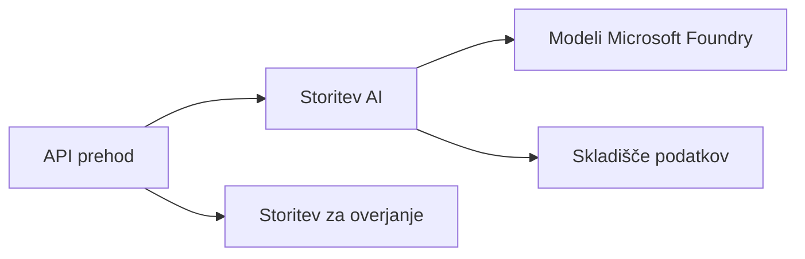

# Poglavje 8: Produkcijski in podjetniški vzorci

**📚 Course**: [AZD za začetnike](../../README.md) | **⏱️ Duration**: 2-3 ure | **⭐ Complexity**: Napredno

---

## Pregled

To poglavje obravnava vzorce nameščanja, primerne za podjetja, krepitev varnosti, spremljanje in optimizacijo stroškov za produkcijske AI delovne obremenitve.

> Preverjeno z `azd 1.25.6` junija 2026.

## Cilji učenja

Z dokončanjem tega poglavja boste:
- Postavili večregijske odporne aplikacije
- Uvedli podjetniške varnostne vzorce
- Konfigurirali celovito spremljanje
- Optimizirali stroške v obsegu
- Nastavili CI/CD cevovode z AZD

---

## 📚 Lessons

| # | Lesson | Description | Time |
|---|--------|-------------|------|
| 1 | [Prakse za produkcijski AI](production-ai-practices.md) | Podjetniški vzorci nameščanja | 90 min |

---

## 🚀 Production Checklist

- [ ] Večregijska nameščanja za odpornost
- [ ] Upravljana identiteta za overjanje (brez ključev)
- [ ] Application Insights za spremljanje
- [ ] Nastavljene proračunske omejitve in opozorila
- [ ] Omogočeno varnostno skeniranje
- [ ] Integracija CI/CD cevovodov
- [ ] Načrt za obnovitev po katastrofi

---

## 🏗️ Arhitekturni vzorci

### Vzorec 1: Mikroservisni AI



### Vzorec 2: Dogodkovno voden AI


---

## 🔐 Najboljše varnostne prakse

```bicep
// Use managed identity
identity: {
  type: 'SystemAssigned'
}

// Private endpoints for AI services
properties: {
  publicNetworkAccess: 'Disabled'
  networkAcls: {
    defaultAction: 'Deny'
  }
}
```

---

## 💰 Optimizacija stroškov

| Strategy | Savings |
|----------|---------|
| Skaliranje na nič (Container Apps) | 60-80% |
| Uporabi porabniške ravni za razvoj | 50-70% |
| Načrtovano skaliranje | 30-50% |
| Rezervirana kapaciteta | 20-40% |

```bash
# Nastavite opozorila za proračun
az consumption budget create \
  --budget-name "AI-Budget" \
  --amount 500 \
  --category Cost \
  --time-grain Monthly
```

---

## 📊 Nastavitev spremljanja

```bash
# Pretakaj dnevnike
azd monitor --logs

# Preveri Application Insights
azd monitor --overview

# Poglej metrike
az monitor metrics list --resource <resource-id>
```

---

## 🔗 Navigacija

| Direction | Chapter |
|-----------|---------|
| **Prejšnje** | [Poglavje 7: Odpravljanje težav](../chapter-07-troubleshooting/README.md) |
| **Course Complete** | [Domov tečaja](../../README.md) |

---

## 📖 Sorodni viri

- [Vodnik za AI agente](../chapter-02-ai-development/agents.md)
- [Application Insights](../chapter-06-pre-deployment/application-insights.md)
- [Rešitve z več agenti](../chapter-05-multi-agent/README.md)
- [Primer mikroservisov](../../examples/microservices/README.md)

---

<!-- CO-OP TRANSLATOR DISCLAIMER START -->
**Omejitev odgovornosti**:
Ta dokument je bil preveden z uporabo AI prevajalske storitve [Co-op Translator](https://github.com/Azure/co-op-translator). Čeprav si prizadevamo za natančnost, vas prosimo, da upoštevate, da avtomatizirani prevodi lahko vsebujejo napake ali netočnosti. Izvirni dokument v njegovem izvirnem jeziku je treba obravnavati kot avtoritativni vir. Za kritične informacije je priporočljiv strokovni človeški prevod. Ne odgovarjamo za morebitna nesporazume ali napačne interpretacije, ki izhajajo iz uporabe tega prevoda.
<!-- CO-OP TRANSLATOR DISCLAIMER END -->