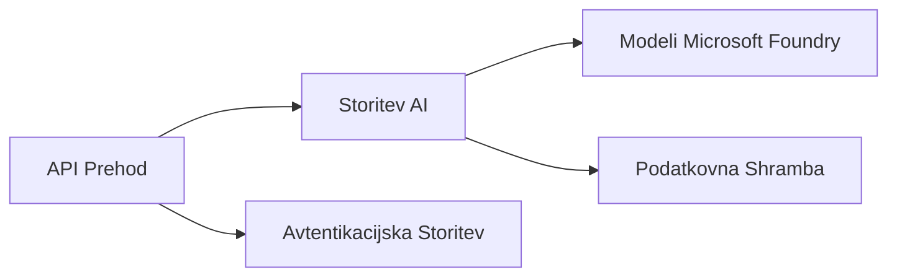

# Chapter 8: Production & Enterprise Patterns

**📚 Tečaj**: [AZD For Beginners](../../README.md) | **⏱️ Trajanje**: 2-3 hours | **⭐ Zahtevnost**: Advanced

---

## Overview

To poglavje obravnava podjetju primerno uvajanje vzorcev, trdno varnost, spremljanje in optimizacijo stroškov za produkcijske AI obremenitve.

> Validated against `azd 1.23.12` in March 2026.

## Learning Objectives

Z dokončanjem tega poglavja boste:
- Uvajali aplikacije odpornosti v več regijah
- Implementirali podjetniške varnostne vzorce
- Konfigurirali obsežno spremljanje
- Optimizirali stroške na obsegu
- Nastavili CI/CD cevovode z AZD

---

## 📚 Lessons

| # | Lekcija | Opis | Čas |
|---|--------|-------------|------|
| 1 | [Prakse AI v produkciji](production-ai-practices.md) | Podjetniški vzorci uvajanja | 90 min |

---

## 🚀 Kontrolni seznam za produkcijo

- [ ] Uvajanje v več regij za odpornost
- [ ] Upravljana identiteta za overjanje (brez ključev)
- [ ] Application Insights za spremljanje
- [ ] Nastavljeni proračuni stroškov in opozorila
- [ ] Omogočeno skeniranje varnosti
- [ ] Integracija CI/CD cevovoda
- [ ] Načrt za obnovo po nesrečah

---

## 🏗️ Arhitekturni vzorci

### Vzorec 1: AI z mikrostoritvami


### Vzorec 2: AI, ki temelji na dogodkih


---

## 🔐 Najboljše varnostne prakse

```bicep
// Use managed identity
identity: {
  type: 'SystemAssigned'
}

// Private endpoints for AI services
properties: {
  publicNetworkAccess: 'Disabled'
  networkAcls: {
    defaultAction: 'Deny'
  }
}
```

---

## 💰 Optimizacija stroškov

| Strategija | Prihranki |
|----------|---------|
| Samodejno skaliranje na nič (Container Apps) | 60-80% |
| Uporabljajte porabniške nivoje za razvoj | 50-70% |
| Načrtovano skaliranje | 30-50% |
| Rezervirana zmogljivost | 20-40% |

```bash
# Nastavi opozorila za proračun
az consumption budget create \
  --budget-name "AI-Budget" \
  --amount 500 \
  --category Cost \
  --time-grain Monthly
```

---

## 📊 Nastavitev spremljanja

```bash
# Pretakanje dnevnikov
azd monitor --logs

# Preveri Application Insights
azd monitor --overview

# Prikaži metrike
az monitor metrics list --resource <resource-id>
```

---

## 🔗 Navigation

| Smer | Poglavje |
|-----------|---------|
| **Previous** | [Poglavje 7: Odpravljanje težav](../chapter-07-troubleshooting/README.md) |
| **Course Complete** | [Domov tečaja](../../README.md) |

---

## 📖 Povezani viri

- [Vodnik po AI agentih](../chapter-02-ai-development/agents.md)
- [Application Insights](../chapter-06-pre-deployment/application-insights.md)
- [Rešitve z več agenti](../chapter-05-multi-agent/README.md)
- [Primer mikrostoritev](../../examples/microservices/README.md)

---

<!-- CO-OP TRANSLATOR DISCLAIMER START -->
**Disclaimer**:
Ta dokument je bil preveden z uporabo storitve za prevajanje z umetno inteligenco [Co-op Translator](https://github.com/Azure/co-op-translator). Čeprav si prizadevamo za natančnost, prosimo upoštevajte, da avtomatski prevodi lahko vsebujejo napake ali netočnosti. Izvirni dokument v njegovem izvirnem jeziku velja za avtoritativni vir. Za ključne informacije priporočamo strokovni človeški prevod. Ne odgovarjamo za morebitne nesporazume ali napačne interpretacije, ki izhajajo iz uporabe tega prevoda.
<!-- CO-OP TRANSLATOR DISCLAIMER END -->