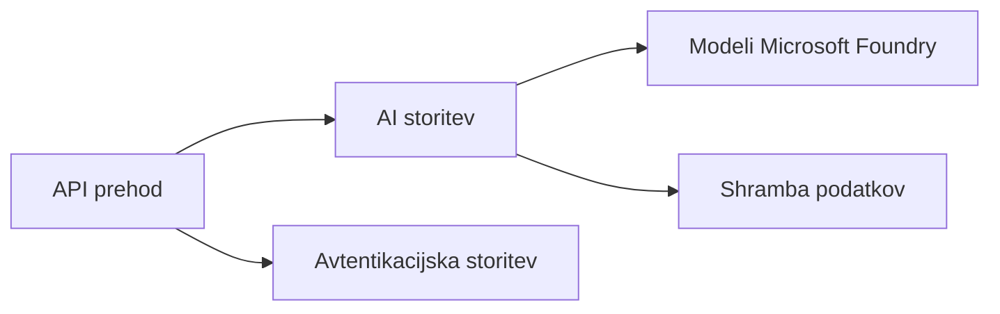

# Poglavje 8: Produkcija in podjetniški vzorci

**📚 Tečaj**: [AZD For Beginners](../../README.md) | **⏱️ Trajanje**: 2-3 ure | **⭐ Stopnja zahtevnosti**: Napredno

---

## Pregled

To poglavje obravnava vzorce razmestitve primerne za podjetja, utrjevanje varnosti, spremljanje in optimizacijo stroškov za produkcijske AI obremenitve.

## Cilji učenja

By completing this chapter, you will:
- Razmestiti odporne aplikacije v več regijah
- Uvesti podjetniške varnostne vzorce
- Konfigurirati celovito spremljanje
- Optimizirati stroške v obsegu
- Vzpostaviti CI/CD cevovode z AZD

---

## 📚 Lekcije

| # | Lekcija | Opis | Čas |
|---|--------|-------------|------|
| 1 | [Prakse produkcijskega AI](production-ai-practices.md) | Podjetniški vzorci razmestitve | 90 min |

---

## 🚀 Kontrolni seznam za produkcijo

- [ ] Večregijska razmestitev za odpornost
- [ ] Upravljana identiteta za overjanje (brez ključev)
- [ ] Application Insights za spremljanje
- [ ] Konfigurirani proračuni stroškov in opozorila
- [ ] Omogočeno varnostno skeniranje
- [ ] Integracija CI/CD cevovoda
- [ ] Načrt za obnovitev po nesreči

---

## 🏗️ Arhitekturni vzorci

### Vzorec 1: AI z mikrostoritvami


### Vzorec 2: Dogodkovno vodena AI


---

## 🔐 Najboljše varnostne prakse

```bicep
// Use managed identity
identity: {
  type: 'SystemAssigned'
}

// Private endpoints for AI services
properties: {
  publicNetworkAccess: 'Disabled'
  networkAcls: {
    defaultAction: 'Deny'
  }
}
```

---

## 💰 Optimizacija stroškov

| Strategija | Prihranek |
|----------|---------|
| Prilagajanje na nič (Container Apps) | 60-80% |
| Uporaba porabniških stopenj za razvoj | 50-70% |
| Načrtovano skaliranje | 30-50% |
| Rezervirana kapaciteta | 20-40% |

```bash
# Nastavite opozorila za proračun
az consumption budget create \
  --budget-name "AI-Budget" \
  --amount 500 \
  --category Cost \
  --time-grain Monthly
```

---

## 📊 Nastavitev spremljanja

```bash
# Pretakanje dnevnikov
azd monitor --logs

# Preverjanje storitve Application Insights
azd monitor

# Ogled metrik
az monitor metrics list --resource <resource-id>
```

---

## 🔗 Navigacija

| Smer | Poglavje |
|-----------|---------|
| **Prejšnje** | [Poglavje 7: Odpravljanje težav](../chapter-07-troubleshooting/README.md) |
| **Zaključek tečaja** | [Domača stran tečaja](../../README.md) |

---

## 📖 Povezani viri

- [Vodnik za AI agente](../chapter-02-ai-development/agents.md)
- [Application Insights](../chapter-06-pre-deployment/application-insights.md)
- [Rešitve z več agenti](../chapter-05-multi-agent/README.md)
- [Primer mikrostoritev](../../examples/microservices/README.md)

---

<!-- CO-OP TRANSLATOR DISCLAIMER START -->
**Disclaimer**:
Ta dokument je bil preveden z uporabo storitve za prevajanje z umetno inteligenco [Co-op Translator](https://github.com/Azure/co-op-translator). Čeprav si prizadevamo za natančnost, upoštevajte, da lahko avtomatizirani prevodi vsebujejo napake ali netočnosti. Izvirni dokument v izvorni različici naj velja za avtoritativni vir. Za ključne informacije priporočamo strokovni prevod, opravljen s strani človeka. Ne odgovarjamo za kakršnekoli nesporazume ali napačne razlage, ki izhajajo iz uporabe tega prevoda.
<!-- CO-OP TRANSLATOR DISCLAIMER END -->