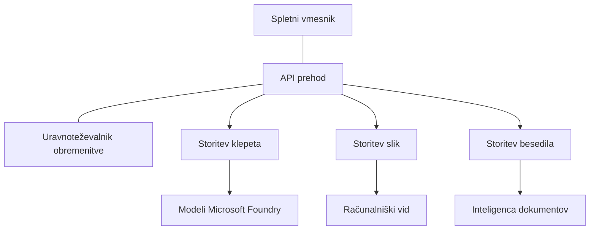

# Najboljše prakse za produkcijske AI delovne obremenitve z AZD

**Chapter Navigation:**
- **📚 Domov tečaja**: [AZD For Beginners](../../README.md)
- **📖 Trenutno poglavje**: Chapter 8 - Production & Enterprise Patterns
- **⬅️ Prejšnje poglavje**: [Chapter 7: Troubleshooting](../chapter-07-troubleshooting/debugging.md)
- **⬅️ Tudi povezano**: [AI Workshop Lab](ai-workshop-lab.md)
- **🎯 Tečaj končan**: [AZD For Beginners](../../README.md)

## Pregled

Ta vodnik vsebuje celovite najboljše prakse za nameščanje produkcijsko pripravljenih AI delovnih obremenitev z uporabo Azure Developer CLI (AZD). Na podlagi povratnih informacij skupnosti Microsoft Foundry Discord in realnih nameščenih rešitev pri strankah te prakse naslavljajo najpogostejše izzive v produkcijskih AI sistemih.

## Ključni izzivi, ki jih naslovimo

Na podlagi rezultatov našega skupnostnega glasovanja so to največji izzivi, s katerimi se razvijalci soočajo:

- **45%** ima težave z večstoritvenimi AI nameščanji
- **38%** ima težave z upravljanjem poverilnic in skrivnosti  
- **35%** težave s produkcijsko pripravljenostjo in skaliranjem
- **32%** potrebuje boljše strategije optimizacije stroškov
- **29%** zahteva izboljšano spremljanje in odpravljanje napak

## Arhitekturni vzorci za produkcijski AI

### Vzorec 1: Mikroservisna AI arhitektura

**Kdaj uporabiti**: Kompleksne AI aplikacije z več zmogljivostmi



**AZD Implementation**:

```yaml
# azure.yaml
name: enterprise-ai-platform
services:
  web:
    project: ./web
    host: staticwebapp
  api-gateway:
    project: ./api-gateway
    host: containerapp
  chat-service:
    project: ./services/chat
    host: containerapp
  vision-service:
    project: ./services/vision
    host: containerapp
  text-service:
    project: ./services/text
    host: containerapp
```

### Vzorec 2: Dogodkovno vodeno procesiranje AI

**Kdaj uporabiti**: Serijsko procesiranje, analiza dokumentov, asinhroni poteki dela

```bicep
// Event Hub for AI processing pipeline
resource eventHub 'Microsoft.EventHub/namespaces@2023-01-01-preview' = {
  name: eventHubNamespaceName
  location: location
  sku: {
    name: 'Standard'
    tier: 'Standard'
    capacity: 1
  }
}

// Service Bus for reliable message processing
resource serviceBus 'Microsoft.ServiceBus/namespaces@2022-10-01-preview' = {
  name: serviceBusNamespaceName
  location: location
  sku: {
    name: 'Premium'
    tier: 'Premium'
    capacity: 1
  }
}

// Function App for processing
resource functionApp 'Microsoft.Web/sites@2023-01-01' = {
  name: functionAppName
  location: location
  kind: 'functionapp,linux'
  properties: {
    siteConfig: {
      appSettings: [
        {
          name: 'FUNCTIONS_EXTENSION_VERSION'
          value: '~4'
        }
        {
          name: 'AZURE_OPENAI_ENDPOINT'
          value: '@Microsoft.KeyVault(VaultName=${keyVault.name};SecretName=openai-endpoint)'
        }
      ]
    }
  }
}
```

## Premislek o zdravju AI agentov

Ko se tradicionalna spletna aplikacija zlomi, so simptomi znani: stran se ne naloži, API vrne napako ali nameščanje ne uspe. AI-podprte aplikacije se lahko zlomijo na vse te enake načine — vendar se lahko tudi obnašajo manj očitno, brez jasnih sporočil o napakah.

Ta razdelek vam pomaga zgraditi mentalni model za spremljanje AI delovnih obremenitev, da boste vedeli, kje iskati, ko stvari ne delujejo, kot bi morale.

### Kako se zdravje agenta razlikuje od zdravja tradicionalne aplikacije

Tradicionalna aplikacija ali deluje ali ne. AI agent se lahko zdi, da deluje, vendar ustvarja slabe rezultate. Razmislite o zdravju agenta v dveh plasteh:

| Layer | What to Watch | Where to Look |
|-------|--------------|---------------|
| **Zdravje infrastrukture** | Ali storitev deluje? So viri zagotovljeni? So končne točke dosegljive? | `azd monitor`, Azure Portal - stanje virov, dnevniki zabojnikov/aplikacij |
| **Zdravje vedenja** | Ali agent odgovarja natančno? So odgovori pravočasni? Ali je model pravilno klican? | sledi v Application Insights, meritve zakasnitve klicev modela, dnevniki kakovosti odzivov |

Zdravje infrastrukture je znano — enako je za katero koli azd aplikacijo. Zdravje vedenja je nova plast, ki jo uvajajo AI delovne obremenitve.

### Kje iskati, ko AI aplikacije ne delujejo kot pričakovano

Če vaša AI aplikacija ne daje pričakovanih rezultatov, je tukaj konceptualni kontrolni seznam:

1. **Začnite z osnovami.** Ali aplikacija deluje? Ali lahko doseže svoje odvisnosti? Preverite `azd monitor` in stanje virov tako kot pri vsaki aplikaciji.
2. **Preverite povezavo z modelom.** Ali vaša aplikacija uspešno kliče AI model? Neuspeli ali pretekli klici modela so najpogostejši vzrok težav z AI aplikacijami in bodo vidni v dnevnikih aplikacije.
3. **Poglejte, kaj je model prejel.** AI odgovori so odvisni od vhodnih podatkov (prompta in morebitnega pridobljenega konteksta). Če je izhod napačen, je običajno vhod napačen. Preverite, ali vaša aplikacija pošilja modelu prave podatke.
4. **Preučite zakasnitev odziva.** Klici modela so počasnejši od tipičnih API klicev. Če se aplikacija zdi počasna, preverite, ali so se časi odziva modela povečali — to lahko nakazuje omejevanje, kapacitativne omejitve ali zasičenost na ravni regije.
5. **Bodite pozorni na signale stroškov.** Nepričakovani skoki v porabi tokenov ali klicih API lahko nakazujejo zanko, nepravilno konfiguriran prompt ali pretirane ponovitve.

Ni treba, da takoj obvladate vsa orodja za opazovanje. Ključna ugotovitev je, da imajo AI aplikacije dodatno plast vedenja, ki jo je treba spremljati, in vgrajeno spremljanje azd (`azd monitor`) vam daje izhodišče za raziskovanje obeh plasti.

---

## Varnostne najboljše prakse

### 1. Model ničelnega zaupanja (Zero-Trust)

**Strategija implementacije**:
- Brez komunikacije med storitvami brez overjanja
- Vsi klici API uporabljajo upravljane identitete
- Omrežna izolacija s zasebnimi končnimi točkami
- Nadzor dostopa z načelom najmanjših privilegijev

```bicep
// Managed Identity for each service
resource chatServiceIdentity 'Microsoft.ManagedIdentity/userAssignedIdentities@2023-01-31' = {
  name: 'chat-service-identity'
  location: location
}

// Role assignments with minimal permissions
resource openAIUserRole 'Microsoft.Authorization/roleAssignments@2022-04-01' = {
  scope: openAIAccount
  name: guid(openAIAccount.id, chatServiceIdentity.id, openAIUserRoleDefinitionId)
  properties: {
    roleDefinitionId: subscriptionResourceId('Microsoft.Authorization/roleDefinitions', '5e0bd9bd-7b93-4f28-af87-19fc36ad61bd')
    principalId: chatServiceIdentity.properties.principalId
    principalType: 'ServicePrincipal'
  }
}
```

### 2. Varen upravljanje skrivnosti

**Vzorс integracije s Key Vault**:

```bicep
// Key Vault with proper access policies
resource keyVault 'Microsoft.KeyVault/vaults@2023-02-01' = {
  name: keyVaultName
  location: location
  properties: {
    tenantId: tenant().tenantId
    sku: {
      family: 'A'
      name: 'premium'  // Use premium for production
    }
    enableRbacAuthorization: true  // Use RBAC instead of access policies
    enablePurgeProtection: true    // Prevent accidental deletion
    enableSoftDelete: true
    softDeleteRetentionInDays: 90
  }
}

// Store all AI service credentials
resource openAIKeySecret 'Microsoft.KeyVault/vaults/secrets@2023-02-01' = {
  parent: keyVault
  name: 'openai-api-key'
  properties: {
    value: openAIAccount.listKeys().key1
    attributes: {
      enabled: true
    }
  }
}
```

### 3. Omrežna varnost

**Konfiguracija zasebnih končnih točk**:

```bicep
// Virtual Network for AI services
resource virtualNetwork 'Microsoft.Network/virtualNetworks@2023-04-01' = {
  name: vnetName
  location: location
  properties: {
    addressSpace: {
      addressPrefixes: ['10.0.0.0/16']
    }
    subnets: [
      {
        name: 'ai-services-subnet'
        properties: {
          addressPrefix: '10.0.1.0/24'
          privateEndpointNetworkPolicies: 'Disabled'
        }
      }
      {
        name: 'app-services-subnet'
        properties: {
          addressPrefix: '10.0.2.0/24'
          delegations: [
            {
              name: 'Microsoft.Web/serverFarms'
              properties: {
                serviceName: 'Microsoft.Web/serverFarms'
              }
            }
          ]
        }
      }
    ]
  }
}

// Private endpoints for all AI services
resource openAIPrivateEndpoint 'Microsoft.Network/privateEndpoints@2023-04-01' = {
  name: '${openAIAccountName}-pe'
  location: location
  properties: {
    subnet: {
      id: virtualNetwork.properties.subnets[0].id
    }
    privateLinkServiceConnections: [
      {
        name: 'openai-connection'
        properties: {
          privateLinkServiceId: openAIAccount.id
          groupIds: ['account']
        }
      }
    ]
  }
}
```

## Uspešnost in skaliranje

### 1. Strategije samodejnega skaliranja

**Samodejno skaliranje Container Apps**:

```bicep
resource containerApp 'Microsoft.App/containerApps@2023-05-01' = {
  name: containerAppName
  location: location
  properties: {
    configuration: {
      ingress: {
        external: true
        targetPort: 8000
        transport: 'http'
      }
    }
    template: {
      scale: {
        minReplicas: 2  // Always have 2 instances minimum
        maxReplicas: 50 // Scale up to 50 for high load
        rules: [
          {
            name: 'http-scaling'
            http: {
              metadata: {
                concurrentRequests: '20'  // Scale when >20 concurrent requests
              }
            }
          }
          {
            name: 'cpu-scaling'
            custom: {
              type: 'cpu'
              metadata: {
                type: 'Utilization'
                value: '70'  // Scale when CPU >70%
              }
            }
          }
        ]
      }
    }
  }
}
```

### 2. Strategije predpomnjenja

**Redis predpomnilnik za AI odzive**:

```bicep
// Redis Premium for production workloads
resource redisCache 'Microsoft.Cache/redis@2023-04-01' = {
  name: redisCacheName
  location: location
  properties: {
    sku: {
      name: 'Premium'
      family: 'P'
      capacity: 1
    }
    enableNonSslPort: false
    minimumTlsVersion: '1.2'
    redisConfiguration: {
      'maxmemory-policy': 'allkeys-lru'
    }
    // Enable clustering for high availability
    redisVersion: '6.0'
    shardCount: 2
  }
}

// Cache configuration in application
var cacheConnectionString = '${redisCache.properties.hostName}:6380,password=${redisCache.listKeys().primaryKey},ssl=True,abortConnect=False'
```

### 3. Uravnoteženje obremenitve in upravljanje prometa

**Application Gateway z WAF**:

```bicep
// Application Gateway with Web Application Firewall
resource applicationGateway 'Microsoft.Network/applicationGateways@2023-04-01' = {
  name: appGatewayName
  location: location
  properties: {
    sku: {
      name: 'WAF_v2'
      tier: 'WAF_v2'
      capacity: 2
    }
    webApplicationFirewallConfiguration: {
      enabled: true
      firewallMode: 'Prevention'
      ruleSetType: 'OWASP'
      ruleSetVersion: '3.2'
    }
    // Backend pools for AI services
    backendAddressPools: [
      {
        name: 'ai-services-pool'
        properties: {
          backendAddresses: [
            {
              fqdn: '${containerApp.properties.configuration.ingress.fqdn}'
            }
          ]
        }
      }
    ]
  }
}
```

## 💰 Optimizacija stroškov

### 1. Pravilna velikost virov

**Konfiguracije, specifične za okolje**:

```bash
# Razvojno okolje
azd env new development
azd env set AZURE_OPENAI_SKU "S0"
azd env set AZURE_OPENAI_CAPACITY 10
azd env set AZURE_SEARCH_SKU "basic"
azd env set CONTAINER_CPU 0.5
azd env set CONTAINER_MEMORY 1.0

# Produkcijsko okolje
azd env new production
azd env set AZURE_OPENAI_SKU "S0"
azd env set AZURE_OPENAI_CAPACITY 100
azd env set AZURE_SEARCH_SKU "standard"
azd env set CONTAINER_CPU 2.0
azd env set CONTAINER_MEMORY 4.0
```

### 2. Spremljanje stroškov in proračuni

```bicep
// Cost management and budgets
resource budget 'Microsoft.Consumption/budgets@2023-05-01' = {
  name: 'ai-workload-budget'
  properties: {
    timePeriod: {
      startDate: '2024-01-01'
      endDate: '2024-12-31'
    }
    timeGrain: 'Monthly'
    amount: 2000  // $2000 monthly budget
    category: 'Cost'
    notifications: {
      warning: {
        enabled: true
        operator: 'GreaterThan'
        threshold: 80
        contactEmails: [
          'finance@company.com'
          'engineering@company.com'
        ]
        contactRoles: [
          'Owner'
          'Contributor'
        ]
      }
      critical: {
        enabled: true
        operator: 'GreaterThan'
        threshold: 95
        contactEmails: [
          'cto@company.com'
        ]
      }
    }
  }
}
```

### 3. Optimizacija porabe tokenov

**Upravljanje stroškov OpenAI**:

```typescript
// Optimizacija tokenov na ravni aplikacije
class TokenOptimizer {
  private readonly maxTokens = 4000;
  private readonly reserveTokens = 500;
  
  optimizePrompt(userInput: string, context: string): string {
    const availableTokens = this.maxTokens - this.reserveTokens;
    const estimatedTokens = this.estimateTokens(userInput + context);
    
    if (estimatedTokens > availableTokens) {
      // Skrajšajte kontekst, ne uporabniškega vnosa
      context = this.truncateContext(context, availableTokens - this.estimateTokens(userInput));
    }
    
    return `${context}\n\nUser: ${userInput}`;
  }
  
  private estimateTokens(text: string): number {
    // Približna ocena: 1 token ≈ 4 znaki
    return Math.ceil(text.length / 4);
  }
}
```

## Spremljanje in opazovanje

### 1. Obsežni Application Insights

```bicep
// Application Insights with advanced features
resource applicationInsights 'Microsoft.Insights/components@2020-02-02' = {
  name: applicationInsightsName
  location: location
  kind: 'web'
  properties: {
    Application_Type: 'web'
    WorkspaceResourceId: logAnalyticsWorkspace.id
    SamplingPercentage: 100  // Full sampling for AI apps
    DisableIpMasking: false  // Enable for security
  }
}

// Custom metrics for AI operations
resource aiMetricAlerts 'Microsoft.Insights/metricAlerts@2018-03-01' = {
  name: 'ai-high-error-rate'
  location: 'global'
  properties: {
    description: 'Alert when AI service error rate is high'
    severity: 2
    enabled: true
    scopes: [
      applicationInsights.id
    ]
    evaluationFrequency: 'PT1M'
    windowSize: 'PT5M'
    criteria: {
      'odata.type': 'Microsoft.Azure.Monitor.SingleResourceMultipleMetricCriteria'
      allOf: [
        {
          name: 'high-error-rate'
          metricName: 'requests/failed'
          operator: 'GreaterThan'
          threshold: 10
          timeAggregation: 'Count'
        }
      ]
    }
  }
}
```

### 2. AI-specifično spremljanje

**Prilagojene nadzorne plošče za AI meritve**:

```json
// Dashboard configuration for AI workloads
{
  "dashboard": {
    "name": "AI Application Monitoring",
    "tiles": [
      {
        "name": "OpenAI Request Volume",
        "query": "requests | where name contains 'openai' | summarize count() by bin(timestamp, 5m)"
      },
      {
        "name": "AI Response Latency",
        "query": "requests | where name contains 'openai' | summarize avg(duration) by bin(timestamp, 5m)"
      },
      {
        "name": "Token Usage",
        "query": "customMetrics | where name == 'openai_tokens_used' | summarize sum(value) by bin(timestamp, 1h)"
      },
      {
        "name": "Cost per Hour",
        "query": "customMetrics | where name == 'openai_cost' | summarize sum(value) by bin(timestamp, 1h)"
      }
    ]
  }
}
```

### 3. Preverjanja stanja in spremljanje razpoložljivosti

```bicep
// Application Insights availability tests
resource availabilityTest 'Microsoft.Insights/webtests@2022-06-15' = {
  name: 'ai-app-availability-test'
  location: location
  tags: {
    'hidden-link:${applicationInsights.id}': 'Resource'
  }
  properties: {
    SyntheticMonitorId: 'ai-app-availability-test'
    Name: 'AI Application Availability Test'
    Description: 'Tests AI application endpoints'
    Enabled: true
    Frequency: 300  // 5 minutes
    Timeout: 120    // 2 minutes
    Kind: 'ping'
    Locations: [
      {
        Id: 'us-east-2-azr'
      }
      {
        Id: 'us-west-2-azr'
      }
    ]
    Configuration: {
      WebTest: '''
        <WebTest Name="AI Health Check" 
                 Id="8d2de8d2-a2b0-4c2e-9a0d-8f9c9a0b8c8d" 
                 Enabled="True" 
                 CssProjectStructure="" 
                 CssIteration="" 
                 Timeout="120" 
                 WorkItemIds="" 
                 xmlns="http://microsoft.com/schemas/VisualStudio/TeamTest/2010" 
                 Description="" 
                 CredentialUserName="" 
                 CredentialPassword="" 
                 PreAuthenticate="True" 
                 Proxy="default" 
                 StopOnError="False" 
                 RecordedResultFile="" 
                 ResultsLocale="">
          <Items>
            <Request Method="GET" 
                     Guid="a5f10126-e4cd-570d-961c-cea43999a200" 
                     Version="1.1" 
                     Url="${webApp.properties.defaultHostName}/health" 
                     ThinkTime="0" 
                     Timeout="120" 
                     ParseDependentRequests="True" 
                     FollowRedirects="True" 
                     RecordResult="True" 
                     Cache="False" 
                     ResponseTimeGoal="0" 
                     Encoding="utf-8" 
                     ExpectedHttpStatusCode="200" 
                     ExpectedResponseUrl="" 
                     ReportingName="" 
                     IgnoreHttpStatusCode="False" />
          </Items>
        </WebTest>
      '''
    }
  }
}
```

## Obnova po nesrečah in visoka razpoložljivost

### 1. Namestitev v več regijah

```yaml
# azure.yaml - Multi-region configuration
name: ai-app-multiregion
services:
  api-primary:
    project: ./api
    host: containerapp
    env:
      - AZURE_REGION=eastus
  api-secondary:
    project: ./api
    host: containerapp
    env:
      - AZURE_REGION=westus2
```

```bicep
// Traffic Manager for global load balancing
resource trafficManager 'Microsoft.Network/trafficManagerProfiles@2022-04-01' = {
  name: trafficManagerProfileName
  location: 'global'
  properties: {
    profileStatus: 'Enabled'
    trafficRoutingMethod: 'Priority'
    dnsConfig: {
      relativeName: trafficManagerProfileName
      ttl: 30
    }
    monitorConfig: {
      protocol: 'HTTPS'
      port: 443
      path: '/health'
      intervalInSeconds: 30
      toleratedNumberOfFailures: 3
      timeoutInSeconds: 10
    }
    endpoints: [
      {
        name: 'primary-endpoint'
        type: 'Microsoft.Network/trafficManagerProfiles/azureEndpoints'
        properties: {
          targetResourceId: primaryAppService.id
          endpointStatus: 'Enabled'
          priority: 1
        }
      }
      {
        name: 'secondary-endpoint'
        type: 'Microsoft.Network/trafficManagerProfiles/azureEndpoints'
        properties: {
          targetResourceId: secondaryAppService.id
          endpointStatus: 'Enabled'
          priority: 2
        }
      }
    ]
  }
}
```

### 2. Varnostno kopiranje podatkov in obnova

```bicep
// Backup configuration for critical data
resource backupVault 'Microsoft.DataProtection/backupVaults@2023-05-01' = {
  name: backupVaultName
  location: location
  identity: {
    type: 'SystemAssigned'
  }
  properties: {
    storageSettings: [
      {
        datastoreType: 'VaultStore'
        type: 'LocallyRedundant'
      }
    ]
  }
}

// Backup policy for AI models and data
resource backupPolicy 'Microsoft.DataProtection/backupVaults/backupPolicies@2023-05-01' = {
  parent: backupVault
  name: 'ai-data-backup-policy'
  properties: {
    policyRules: [
      {
        backupParameters: {
          backupType: 'Full'
          objectType: 'AzureBackupParams'
        }
        trigger: {
          schedule: {
            repeatingTimeIntervals: [
              'R/2024-01-01T02:00:00+00:00/P1D'  // Daily at 2 AM
            ]
          }
          objectType: 'ScheduleBasedTriggerContext'
        }
        dataStore: {
          datastoreType: 'VaultStore'
          objectType: 'DataStoreInfoBase'
        }
        name: 'BackupDaily'
        objectType: 'AzureBackupRule'
      }
    ]
  }
}
```

## DevOps in integracija CI/CD

### 1. Potek dela GitHub Actions

```yaml
# .github/workflows/deploy-ai-app.yml
name: Deploy AI Application

on:
  push:
    branches: [main]
  pull_request:
    branches: [main]

jobs:
  test:
    runs-on: ubuntu-latest
    steps:
      - uses: actions/checkout@v4
      
      - name: Setup Python
        uses: actions/setup-python@v4
        with:
          python-version: '3.11'
          
      - name: Install dependencies
        run: |
          pip install -r requirements.txt
          pip install pytest
          
      - name: Run tests
        run: pytest tests/
        
      - name: AI Safety Tests
        run: |
          python scripts/test_ai_safety.py
          python scripts/validate_prompts.py

  deploy-staging:
    needs: test
    if: github.event_name == 'pull_request'
    runs-on: ubuntu-latest
    steps:
      - uses: actions/checkout@v4
      
      - name: Setup AZD
        uses: Azure/setup-azd@v2
        
      - name: Login to Azure
        uses: azure/login@v1
        with:
          creds: ${{ secrets.AZURE_CREDENTIALS }}
          
      - name: Deploy to Staging
        run: |
          azd env select staging
          azd deploy

  deploy-production:
    needs: test
    if: github.ref == 'refs/heads/main'
    runs-on: ubuntu-latest
    steps:
      - uses: actions/checkout@v4
      
      - name: Setup AZD
        uses: Azure/setup-azd@v2
        
      - name: Login to Azure
        uses: azure/login@v1
        with:
          creds: ${{ secrets.AZURE_CREDENTIALS }}
          
      - name: Deploy to Production
        run: |
          azd env select production
          azd deploy
          
      - name: Run Production Health Checks
        run: |
          python scripts/health_check.py --env production
```

### 2. Validacija infrastrukture

```bash
# scripts/validate_infrastructure.sh
#!/bin/bash

echo "Validating AI infrastructure deployment..."

# Preveri, ali so vse zahtevane storitve zagnane
services=("openai" "search" "storage" "keyvault")
for service in "${services[@]}"; do
    echo "Checking $service..."
    if ! az resource list --resource-type "Microsoft.CognitiveServices/accounts" --query "[?contains(name, '$service')]" -o tsv; then
        echo "ERROR: $service not found"
        exit 1
    fi
done

# Preveri namestitve modelov OpenAI
echo "Validating OpenAI model deployments..."
models=$(az cognitiveservices account deployment list --name $AZURE_OPENAI_NAME --resource-group $AZURE_RESOURCE_GROUP --query "[].name" -o tsv)
if [[ ! $models == *"gpt-4.1-mini"* ]]; then
  echo "ERROR: Required model gpt-4.1-mini not deployed"
    exit 1
fi

# Preizkusi povezljivost storitve AI
echo "Testing AI service connectivity..."
python scripts/test_connectivity.py

echo "Infrastructure validation completed successfully!"
```

## Kontrolni seznam pripravljenosti za produkcijo

### Varnost ✅
- [ ] Vse storitve uporabljajo upravljane identitete
- [ ] Skrivnosti shranjene v Key Vault
- [ ] Konfigurirane zasebne končne točke
- [ ] Uvedene skupine za omrežno varnost
- [ ] RBAC z načelom najmanjših privilegijev
- [ ] WAF omogočen na javnih končnih točkah

### Uspešnost ✅
- [ ] Samodejno skaliranje konfigurirano
- [ ] Predpomnjenje implementirano
- [ ] Nastavljeno uravnoteženje obremenitve
- [ ] CDN za statično vsebino
- [ ] Povezave v bazi podatkov (pooling)
- [ ] Optimizacija uporabe tokenov

### Spremljanje ✅
- [ ] Application Insights konfiguriran
- [ ] Določene prilagojene metrike
- [ ] Nastavljene pravilnike za opozorila
- [ ] Ustvarjena nadzorna plošča
- [ ] Implementirana preverjanja stanja
- [ ] Politike hrambe dnevnikov

### Zanesljivost ✅
- [ ] Namestitev v več regijah
- [ ] Načrt varnostnega kopiranja in obnove
- [ ] Implementirani preklopniki (circuit breakers)
- [ ] Konfigurirane politike ponovnih poskusov
- [ ] Postopna degradacija
- [ ] Končne točke za preverjanje stanja

### Upravljanje stroškov ✅
- [ ] Konfigurirana opozorila proračuna
- [ ] Pravilno dimenzioniranje virov
- [ ] Uveljavljeni popusti za razvoj/test
- [ ] Nakup rezerviranih instanc
- [ ] Nadzorna plošča za spremljanje stroškov
- [ ] Redni pregledi stroškov

### Skladnost ✅
- [ ] Izpolnjene zahteve glede lokacije podatkov
- [ ] Omogočeno revizijsko beleženje
- [ ] Uporabljene politike skladnosti
- [ ] Uvedeni varnostni osnovni standardi
- [ ] Redne varnostne ocene
- [ ] Načrt odziva na incidente

## Merila uspešnosti

### Tipične produkcijske metrike

| Metric | Target | Monitoring |
|--------|--------|------------|
| **Čas odziva** | < 2 seconds | Application Insights |
| **Razpoložljivost** | 99.9% | Uptime monitoring |
| **Stopnja napak** | < 0.1% | Application logs |
| **Poraba tokenov** | < $500/month | Cost management |
| **Sočasni uporabniki** | 1000+ | Load testing |
| **Čas obnove** | < 1 hour | Disaster recovery tests |

### Obremenitveno testiranje

```bash
# Skripta za testiranje obremenitve za AI aplikacije
python scripts/load_test.py \
  --endpoint https://your-ai-app.azurewebsites.net \
  --concurrent-users 100 \
  --duration 300 \
  --ramp-up 60
```

## 🤝 Priporočila skupnosti

Na podlagi povratnih informacij skupnosti Microsoft Foundry Discord:

### Glavna priporočila skupnosti:

1. **Začnite z majhnim in postopoma skalirajte**: Začnite z osnovnimi SKU-ji in skalirajte glede na dejansko uporabo
2. **Spremljajte vse**: Nastavite obsežno spremljanje od prvega dne
3. **Avtomatizirajte varnost**: Uporabite infrastrukturo kot kodo za dosledno varnost
4. **Temeljito testirajte**: Vključite AI-specifično testiranje v vaš pipeline
5. **Načrtujte stroške**: Spremljajte porabo tokenov in zgodaj nastavite opozorila proračuna

### Pogoste napake, ki se jim izognite:

- ❌ Trdo kodiranje API ključev v kodi
- ❌ Neustrezno nastavitev spremljanja
- ❌ Ignoriranje optimizacije stroškov
- ❌ Nepreizkušanje scenarijev napak
- ❌ Zaganjanje v produkcijo brez preverjanj stanja

## AZD AI CLI ukazi in razširitve

AZD vključuje naraščajoč nabor AI-specifičnih ukazov in razširitev, ki poenostavljajo produkcijske AI delovne procese. Ta orodja premostijo vrzel med lokalnim razvojem in produkcijsko namestitvijo AI delovnih obremenitev.

### Razširitve AZD za AI

AZD uporablja sistem razširitev za dodajanje AI-specifičnih zmogljivosti. Namestite in upravljajte razširitve z:

```bash
# Naštej vse razpoložljive razširitve (vključno z AI)
azd extension list

# Oglej si podrobnosti nameščenih razširitev
azd extension show azure.ai.agents

# Namesti razširitev Foundry Agents
azd extension install azure.ai.agents

# Namesti razširitev za fino prilagajanje
azd extension install azure.ai.finetune

# Namesti razširitev za prilagojene modele
azd extension install azure.ai.models

# Posodobi vse nameščene razširitve
azd extension upgrade --all
```

**Na voljo AI razširitve:**

| Extension | Purpose | Status |
|-----------|---------|--------|
| `azure.ai.agents` | Upravljanje Foundry Agent Service | Preview |
| `azure.ai.skills` | Ponovno uporabne veščine agentov | Preview |
| `azure.ai.connections` | Povezave Foundry (viri podatkov, orodja) | Preview |
| `azure.ai.finetune` | Fine-tuning modelov Foundry | Preview |
| `azure.ai.models` | Lastni modeli Foundry | Preview |
| `azure.coding-agent` | Konfiguracija kodirnega agenta | Available |

> The `azure.ai.agents` extension evolves quickly. This course is validated against `0.1.40-preview`. Run `azd extension upgrade --all` to pick up the latest command set, and `azd extension show azure.ai.agents` to confirm your installed version.

**Kaj sta novejši razširitvi `skills` in `connections`?**

Dve predogledni razširitvi sta se pojavili skupaj z orodji za agente in ju je vredno razumeti tudi kot začetnik:

- **`azure.ai.skills`** — A **skill** je ponovno uporabna sposobnost (pakirano orodje ali vedenje), ki ga lahko pritrdite na enega ali več agentov, namesto da bi ga vsakič ponovno implementirali. Razmišljajte o tem kot o deljenem gradniku: definirajte spretnost "iskanje v dokumentaciji" ali "iskanje naročila" enkrat in jo nato ponovno uporabite med agenti. To ohranja sisteme z več agenti (Chapter 5) dosledne in preprečuje kopiranje in lepljenje.
- **`azure.ai.connections`** — A **connection** je upravljana povezava iz vašega Foundry projekta do zunanjega vira, ki ga vaši agenti potrebujejo — vir podatkov (kot je Azure AI Search), končna točka orodja ali druga storitev. Povezave centralizirajo *kje* in *kako* agenti dostopajo do podatkov, tako da poverilnice in končne točke živijo na enem urejenem mestu namesto raztresene po kodi.

Za prvotno nameščanje agentov teh razširitev ne potrebujete — med učenjem se držite `azure.ai.agents`. Dosezite po `skills`, ko začnete večkrat podvajati isto orodje med agenti, in po `connections`, ko več agentov deli isti vir podatkov.

### Inicializacija projektov agentov z `azd ai agent init`

Ukaz `azd ai agent init` ustvari ogrodje produkcijsko pripravljenega AI agentnega projekta, integriranega z Microsoft Foundry Agent Service:

```bash
# Inicializirajte nov projekt agenta iz manifesta agenta
azd ai agent init -m <manifest-path-or-uri>

# Inicializirajte in ciljno nastavite določen projekt Foundry
azd ai agent init -m agent-manifest.yaml --project-id <foundry-project-id>

# Inicializirajte z lastno izvorno mapo
azd ai agent init -m agent-manifest.yaml --src ./agents/my-agent

# Nastavite Container Apps kot gostitelja
azd ai agent init -m agent-manifest.yaml --host containerapp
```

**Ključne zastavice:**

| Flag | Description |
|------|-------------|
| `-m, --manifest` | Path or URI to an agent manifest to add to your project |
| `-p, --project-id` | Existing Microsoft Foundry Project ID for your azd environment |
| `-s, --src` | Directory to download the agent definition (defaults to `src/<agent-id>`) |
| `--host` | Override the default host (e.g., `containerapp`) |
| `-e, --environment` | The azd environment to use |

**Nasvet za produkcijo**: Uporabite `--project-id` za neposredno povezavo z obstoječim Foundry projektom, s čimer ohranite povezavo med kodo agenta in oblačnimi viri od samega začetka.

### Upravljanje življenjskega cikla agenta

Poleg `init` razširitev `azure.ai.agents` zagotavlja ukaze za celoten življenjski cikel gostovanega agenta — testiranje, pregledovanje, optimizacijo in upokojitev:

```bash
# Pokliči nameščenega agenta in prikaži čas odgovora strežnika
# (skupna zakasnitev in čas do prvega bajta)
azd ai agent invoke

# Pokaži konfiguracijo žive končne točke pred spremembo
azd ai agent endpoint show

# Ustvari niz podatkov za ocenjevanje agenta
azd ai agent eval generate --dataset ./eval/dataset.jsonl

# Optimiziraj navodila agenta na podlagi vaših podatkov za ocenjevanje
# (zahteva optimization_model v projektu agenta)
azd ai agent optimize

# Prenesi nameščeno izvorno kodo gostovanega agenta, ki temelji na kodi
# (s preverjanjem SHA-256)
azd ai agent code download

# Izbriši gostovanega agenta in vse njegove različice
# (--force prekine aktivne seje)
azd ai agent delete --force
```

**Življenjski cikel na kratko:**

| Stage | Command | Production use |
|-------|---------|----------------|
| Test | `azd ai agent invoke` | Preverite odgovore in izmerite zakasnitev pred izdajo |
| Inspect | `azd ai agent endpoint show` | Preglejte avtentikacijo/konfiguracijo končne točke; prepoznajte morebitne spremembe zgodaj |
| Measure | `azd ai agent eval generate` | Zgradite ponovljiv evalvacijski niz iz resničnih sledi |
| Improve | `azd ai agent optimize` | Nastavite navodila glede na izmerjeno kakovost |
| Recover | `azd ai agent code download` | Pridobite točno nameščeno izvorno kodo za revizijo/rollback |
| Retire | `azd ai agent delete --force` | Čisto odstranite agenta in njegove različice |

> Ti ukazi so v predogledu in se lahko spremenijo med izdajami razširitve. Za natančen seznam podukazov v vaši nameščeni različici zaženite `azd ai agent --help`.

### Protokol konteksta modela (MCP) z `azd mcp`
AZD includes built-in MCP server support (Alpha), enabling AI agents and tools to interact with your Azure resources through a standardized protocol:

```bash
# Zaženi MCP strežnik za vaš projekt
azd mcp start

# Preglej trenutna pravila soglasja Copilota za izvajanje orodij
azd copilot consent list
```

MCP strežnik razkriva kontekst vašega azd projekta—okolja, storitve in Azure vire—orodjem za razvoj, ki jih poganja AI. To omogoča:

- **AI-podprta razmestitev**: Dovolite agentom za kodiranje, da poizvedujejo stanje vašega projekta in sprožijo razmestitve
- **Odkritje virov**: Orodja z AI lahko odkrijejo, katere vire Azure uporablja vaš projekt
- **Upravljanje okolij**: Agenti lahko preklapljajo med okolji dev/staging/production

### Generiranje infrastrukture z `azd infra generate`

Za produkcijske AI delovne obremenitve lahko ustvarite in prilagodite infrastrukturo kot kodo (Infrastructure as Code) namesto da bi se zanašali na samodejno zagotavljanje virov:

```bash
# Ustvari datoteke Bicep/Terraform iz definicije vašega projekta
azd infra generate
```

To zapiše IaC na disk, tako da lahko:
- Pregledate in revidirate infrastrukturo pred razmestitvijo
- Dodate prilagojene varnostne politike (omrežna pravila, zasebni končni točki)
- Integrirate s obstoječimi procesi pregleda IaC
- Nadzorujete spremembe infrastrukture ločeno od kode aplikacije

### Hooki v produkcijskem življenjskem ciklu

AZD hooki vam omogočajo, da v vsakem koraku življenjskega cikla razmestitve vstavite lastno logiko—kar je ključnega pomena za produkcijske AI delovne tokove:

```yaml
# azure.yaml - Production hooks example
name: ai-production-app
hooks:
  preprovision:
    shell: sh
    run: scripts/validate-quotas.sh    # Check AI model quota before provisioning
  postprovision:
    shell: sh
    run: scripts/configure-networking.sh  # Set up private endpoints
  predeploy:
    shell: sh
    run: scripts/run-ai-safety-tests.sh  # Run prompt safety checks
  postdeploy:
    shell: sh
    run: scripts/smoke-test.sh           # Verify agent responses post-deploy
services:
  agent-api:
    project: ./src/agent
    host: containerapp
    hooks:
      predeploy:
        shell: sh
        run: scripts/validate-model-access.sh  # Per-service hook
```

```bash
# Ročno zaženite določen hook med razvojem
azd hooks run predeploy
```

**Priporočeni produkcijski hooki za AI delovne obremenitve:**

| Hook | Uporaba |
|------|----------|
| `preprovision` | Preverite kvote naročnine glede zmogljivosti modela AI |
| `postprovision` | Konfigurirajte zasebne končne točke, razmestite uteži modela |
| `predeploy` | Zaženite AI varnostne teste, preverite predloge pozivov |
| `postdeploy` | Opravite osnovne teste odzivov agentov, preverite povezljivost modela |

### Konfiguracija CI/CD cevovoda

Uporabite `azd pipeline config` za povezavo vašega projekta z GitHub Actions ali Azure Pipelines z varnim Azure preverjanjem pristnosti:

```bash
# Konfiguriraj CI/CD cevovod (interaktivno)
azd pipeline config

# Konfiguriraj z določenim ponudnikom
azd pipeline config --provider github
```

Ta ukaz:
- Ustvari service principal z najmanjšimi dovoljenji
- Konfigurira federirane poverilnice (ni shranjenih skrivnosti)
- Ustvari ali posodobi datoteko z definicijo cevovoda
- Nastavi zahtevane spremenljivke okolja v vašem CI/CD sistemu

#### Korak za korakom: vaš prvi GitHub Actions cevovod

Tu je celoten vodnik od delujočega azd projekta do samodejnih razmestitev ob vsakem pushu.

**1. Prepričajte se, da je vaš projekt na GitHubu**

```bash
git init
git add .
git commit -m "Initial azd project"
gh repo create my-ai-app --private --source=. --push
```

**2. Zaženite pipeline config**

```bash
azd pipeline config --provider github
```

azd bo interaktivno:
- Vprašal bo, katero Azure naročnino in okolje ciljati
- Ustvari Entra **registracijo aplikacije + service principal** za cevovod
- Nastavi **federirane poverilnice (OIDC)**—tako se GitHub overi v Azure z začasnimi žetoni in se **nikjer ne shranjujejo skrivnosti**
- Potisne zahtevane **spremenljivke** v vaš GitHub repozitorij (`AZURE_CLIENT_ID`, `AZURE_TENANT_ID`, `AZURE_SUBSCRIPTION_ID`, `AZURE_ENV_NAME`, `AZURE_LOCATION`)

**3. Razumite ustvarjeni delovni potek**

azd doda `.github/workflows/azure-dev.yml`. Ključni deli izgledajo takole:

```yaml
# .github/workflows/azure-dev.yml
on:
  push:
    branches: [ main ]
  workflow_dispatch:        # lets you run it manually too

permissions:
  id-token: write           # required for OIDC federated login
  contents: read

jobs:
  build:
    runs-on: ubuntu-latest
    env:
      AZURE_CLIENT_ID: ${{ vars.AZURE_CLIENT_ID }}
      AZURE_TENANT_ID: ${{ vars.AZURE_TENANT_ID }}
      AZURE_SUBSCRIPTION_ID: ${{ vars.AZURE_SUBSCRIPTION_ID }}
      AZURE_ENV_NAME: ${{ vars.AZURE_ENV_NAME }}
      AZURE_LOCATION: ${{ vars.AZURE_LOCATION }}
    steps:
      - uses: actions/checkout@v4
      - name: Install azd
        uses: Azure/setup-azd@v2
      - name: Log in with OIDC
        run: azd auth login --client-id "$AZURE_CLIENT_ID" --federated-credential-provider "github" --tenant-id "$AZURE_TENANT_ID"
      - name: Provision infrastructure
        run: azd provision --no-prompt
      - name: Deploy application
        run: azd deploy --no-prompt
```

**4. Preverite, da deluje**

```bash
# Potisnite spremembo, da sprožite cevovod.
git commit -am "Trigger pipeline" --allow-empty
git push
```

Odprite zavihek **Actions** v vašem GitHub repozitoriju in opazujte delovni potek, kako samodejno zažene `azd provision` in `azd deploy`.

> **Zakaj so federirane poverilnice pomembne:** starejši cevovodi so shranjevali klientski skrivni ključ v GitHubu. OIDC federirane poverilnice popolnoma odpravijo to skrivnost—GitHub zahteva začasni žeton v času izvajanja, kar je varneje in ni potrebe po rotaciji ali puščanju. To je privzeta konfiguracija, ki jo nastavi `azd pipeline config`.

> **Skrivnosti proti spremenljivkam:** nesenzitivni identifikatorji (`AZURE_CLIENT_ID`, itd.) naj gredo v repozitorijske **spremenljivke**. Če vaša aplikacija res potrebuje skrivnost ob gradnji, jo dodajte kot GitHub **secret** in se sklicujte nanjo z `${{ secrets.NAME }}`—vendar raje uporabite Key Vault + upravljano identiteto med izvajanjem (glejte [Poglavje 3](../chapter-03-configuration/authsecurity.md)).

**Produkcijski delovni potek s pipeline config:**

```bash
# 1. Nastavite produkcijsko okolje
azd env new production
azd env set AZURE_OPENAI_CAPACITY 100

# 2. Konfigurirajte cevovod
azd pipeline config --provider github

# 3. Cevovod zažene azd deploy ob vsakem pushu na vejo main
```

#### Korak za korakom: Azure DevOps Pipelines

Vam je ljubše Azure DevOps kot GitHub Actions? azd to nativno podpira s ponudnikom `azdo`. Potek je skoraj enak—azd generira datoteko cevovoda, ustvari service connection in vključi avtentikacijo.

**1. Prepričajte se, da imate Azure DevOps projekt**

Potrebujete organizacijo in projekt na `https://dev.azure.com/<your-org>`. Ustvarite Personal Access Token (PAT) s dovoljenji **Build (Read & execute)**, **Code (Read & write)** in **Service Connections (Read, query & manage)**—azd vas bo prosil za to.

**2. Konfigurirajte cevovod**

```bash
azd pipeline config --provider azdo
```

azd bo:
- Pozval vas bo za vašo Azure DevOps organizacijo in projekt
- Ustvari (ali ponovno uporabi) **service connection** do Azure z uporabo service principala
- Konfigurira **workload identity federation (OIDC)** tako, da se noben klientski skrivni ključ ne shranjuje
- Zaveže datoteko z definicijo cevovoda `azure-dev.yml` v vaš repozitorij

**3. Preverite ustvarjeni `azure-dev.yml`**

azd zapiše cevovod, ki zagotavlja vire in razmestitve ob vsakem pushu na `main`:

```yaml
# azure-dev.yml
trigger:
  - main

pool:
  vmImage: ubuntu-latest

steps:
  - task: setup-azd@1
    displayName: Install azd

  - script: azd provision --no-prompt
    displayName: Provision Infrastructure
    env:
      AZURE_SUBSCRIPTION_ID: $(AZURE_SUBSCRIPTION_ID)
      AZURE_ENV_NAME: $(AZURE_ENV_NAME)
      AZURE_LOCATION: $(AZURE_LOCATION)

  - script: azd deploy --no-prompt
    displayName: Deploy Application
    env:
      AZURE_SUBSCRIPTION_ID: $(AZURE_SUBSCRIPTION_ID)
      AZURE_ENV_NAME: $(AZURE_ENV_NAME)
      AZURE_LOCATION: $(AZURE_LOCATION)
```

**4. Od kod prihajajo spremenljivke**

azd shrani vrednosti okolja (`AZURE_ENV_NAME`, `AZURE_LOCATION`, `AZURE_SUBSCRIPTION_ID`) kot a **variable group** v Azure DevOps, da jih cevovod lahko prebere. Ogledate si jih in uredite pod **Pipelines → Library**.

> **Enaka prednost OIDC kot pri GitHubu:** ponudnik `azdo` privzeto tudi konfigurira workload identity federation, tako da se v service connection ne shranjuje klientski skrivni ključ—Azure DevOps izmenja začasni žeton v času izvajanja. Podajte `--auth-type client-credentials` samo, če vaša organizacija še ne more uporabljati OIDC.

**5. Zaženite ga**

```bash
git commit -am "Add Azure DevOps pipeline" --allow-empty
git push
```

Odprite **Pipelines** v Azure DevOps, da opazujete izvajanje `azd provision` in `azd deploy`.

### Dodajanje komponent z `azd add`

Postopoma dodajajte Azure storitve v obstoječ projekt:

```bash
# Interaktivno dodajte novo komponento storitve
azd add
```

To je posebej koristno pri širjenju produkcijskih AI aplikacij—for example, dodajanje storitve za vektorsko iskanje, novega končnega mesta agenta ali komponente za nadzor v obstoječo razmestitev.

## Dodatni viri

- **Azure Well-Architected Framework**: [Smernice za AI delovne obremenitve](https://learn.microsoft.com/azure/well-architected/ai/)
- **Microsoft Foundry Documentation**: [Uradna dokumentacija](https://learn.microsoft.com/azure/ai-studio/)
- **Community Templates**: [Azure Samples](https://github.com/Azure-Samples)
- **Discord Community**: [#Azure channel](https://discord.gg/microsoft-azure)
- **Agent Skills for Azure**: [microsoft/github-copilot-for-azure on skills.sh](https://skills.sh/microsoft/github-copilot-for-azure) - 37 odprtih agentnih veščin za Azure AI, Foundry, razmestitev, optimizacijo stroškov in diagnostiko. Namestite v vaš urejevalnik:
  ```bash
  npx skills add microsoft/github-copilot-for-azure
  ```

---

**Navigacija po poglavjih:**
- **📚 Domov tečaja**: [AZD For Beginners](../../README.md)
- **📖 Trenutno poglavje**: Poglavje 8 - Produkcijski & Enterprise vzorci
- **⬅️ Predhodno poglavje**: [Poglavje 7: Odpravljanje napak](../chapter-07-troubleshooting/debugging.md)
- **⬅️ Prav tako povezano**: [AI Workshop Lab](ai-workshop-lab.md)
- **� Tečaj zaključen**: [AZD For Beginners](../../README.md)

**Ne pozabite**: Produkcijske AI delovne obremenitve zahtevajo skrbno načrtovanje, nadzor in kontinuirano optimizacijo. Začnite s temi vzorci in jih prilagodite vašim specifičnim zahtevam.

---

<!-- CO-OP TRANSLATOR DISCLAIMER START -->
**Omejitev odgovornosti**:
Ta dokument je bil preveden z uporabo AI prevajalske storitve [Co-op Translator](https://github.com/Azure/co-op-translator). Čeprav si prizadevamo za natančnost, vas prosimo, da upoštevate, da avtomatizirani prevodi lahko vsebujejo napake ali netočnosti. Izvirni dokument v njegovem izvirnem jeziku je treba obravnavati kot avtoritativni vir. Za kritične informacije je priporočljiv strokovni človeški prevod. Ne odgovarjamo za morebitna nesporazume ali napačne interpretacije, ki izhajajo iz uporabe tega prevoda.
<!-- CO-OP TRANSLATOR DISCLAIMER END -->