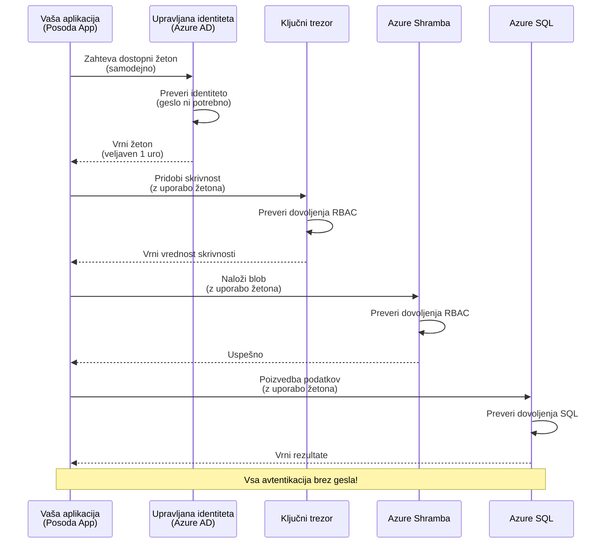
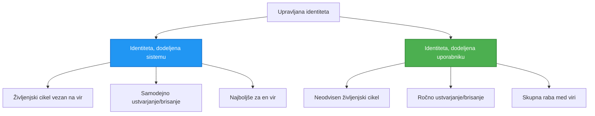

# Vzorci za preverjanje pristnosti in upravljana identiteta

⏱️ **Ocenjeni čas**: 45-60 minut | 💰 **Vpliv na stroške**: Brezplačno (brez dodatnih stroškov) | ⭐ **Kompleksnost**: Srednja

**📚 Učni načrt:**
- ← Prejšnje: [Upravljanje konfiguracije](configuration.md) - Upravljanje okoljskih spremenljivk in skrivnosti
- 🎯 **Tukaj ste**: Preverjanje pristnosti in varnost (upravljana identiteta, Key Vault, varni vzorci)
- → Naslednje: [Prvi projekt](first-project.md) - Zgradite svojo prvo aplikacijo AZD
- 🏠 [Domača stran tečaja](../../README.md)

---

## Kaj se boste naučili

Ko zaključite to lekcijo, boste:
- Razumeli vzorce preverjanja pristnosti v Azure (ključi, povezovalni nizi, upravljana identiteta)
- Implementirali **upravljano identiteto** za preverjanje pristnosti brez gesel
- Zavarovali skrivnosti z integracijo **Azure Key Vault**
- Konfigurirali **nadzor dostopa na podlagi vlog (RBAC)** za uvajanje AZD
- Uporabili najboljše varnostne prakse v Container Apps in Azure storitvah
- Prešli iz preverjanja pristnosti na podlagi ključev na preverjanje pristnosti na podlagi identitete

## Zakaj je upravljana identiteta pomembna

### Težava: Tradicionalno preverjanje pristnosti

**Pred upravljano identiteto:**
```javascript
// ❌ VARNOSTNO TVEGANJE: Trdo kodirani skrivni podatki v kodi
const connectionString = "Server=mydb.database.windows.net;User=admin;Password=P@ssw0rd123";
const storageKey = "xK7mN9pQ2wR5tY8uI0oP3aS6dF1gH4jK...";
const cosmosKey = "C2x7B9n4M1p8Q5w3E6r0T2y5U8i1O4p7...";
```

**Težave:**
- 🔴 **Razkritje skrivnosti** v kodi, konfiguracijskih datotekah, okoljskih spremenljivkah
- 🔴 **Rotacija poverilnic** zahteva spremembe kode in ponovno uvajanje
- 🔴 **Težave z revizijo** - kdo je dostopal do česa in kdaj?
- 🔴 **Razpršenost** - skrivnosti razpršene po več sistemih
- 🔴 **Tveganja skladnosti** - ne izpolnjuje varnostnih standardov

### Rešitev: Upravljana identiteta

**Po upravljani identiteti:**
```javascript
// ✅ VARNOSTNO: Brez skrivnosti v kodi
const credential = new DefaultAzureCredential();
const client = new BlobServiceClient(
  "https://mystorageaccount.blob.core.windows.net",
  credential  // Azure samodejno upravlja z avtentikacijo
);
```

**Prednosti:**
- ✅ **Brez skrivnosti** v kodi ali konfiguraciji
- ✅ **Samodejna rotacija** - Azure to upravlja
- ✅ **Popolna revizijska sled** v dnevnikih Azure AD
- ✅ **Centralizirana varnost** - upravljanje v Azure Portal
- ✅ **Pripravljeno za skladnost** - izpolnjuje varnostne standarde

**Primerjava**: Tradicionalno preverjanje pristnosti je kot nositi več fizičnih ključev za različna vrata. Upravljana identiteta je kot imeti varnostno značko, ki samodejno omogoča dostop glede na vašo identiteto—brez ključev, ki bi jih lahko izgubili, kopirali ali rotirali.

---

## Pregled arhitekture

### Tok preverjanja pristnosti z upravljano identiteto


### Vrste upravljanih identitet


| Funkcija | Sistem-dodeljena | Uporabnik-dodeljena |
|---------|----------------|---------------|
| **Življenjski cikel** | Povezan z virom | Neodvisen |
| **Ustvarjanje** | Samodejno z virom | Ročno ustvarjanje |
| **Brisanje** | Izbrisano z virom | Ostane po izbrisu vira |
| **Deljenje** | Samo en vir | Več virov |
| **Primer uporabe** | Enostavni scenariji | Kompleksni scenariji z več viri |
| **Privzeto v AZD** | ✅ Priporočeno | Opcijsko |

---

## Predpogoji

### Zahtevana orodja

Ta orodja bi morali že imeti nameščena iz prejšnjih lekcij:

```bash
# Preverite Azure Developer CLI
azd version
# ✅ Pričakovano: azd različica 1.0.0 ali višja

# Preverite Azure CLI
az --version
# ✅ Pričakovano: azure-cli 2.50.0 ali višja
```

### Zahteve za Azure

- Aktivna naročnina Azure
- Dovoljenja za:
  - Ustvarjanje upravljanih identitet
  - Dodeljevanje RBAC vlog
  - Ustvarjanje virov Key Vault
  - Uvajanje Container Apps

### Predhodno znanje

Morali bi zaključiti:
- [Vodnik za namestitev](installation.md) - nastavitev AZD
- [Osnove AZD](azd-basics.md) - osnovni koncepti
- [Upravljanje konfiguracije](configuration.md) - okoljske spremenljivke

---

## Lekcija 1: Razumevanje vzorcev preverjanja pristnosti

### Vzorec 1: Povezovalni nizi (zastarelo - izogibajte se)

**Kako deluje:**
```bash
# Niz povezave vsebuje poverilnice
STORAGE_CONNECTION_STRING="DefaultEndpointsProtocol=https;AccountName=myaccount;AccountKey=xK7mN9pQ2wR5..."
COSMOS_CONNECTION_STRING="AccountEndpoint=https://myaccount.documents.azure.com:443/;AccountKey=C2x7..."
SQL_CONNECTION_STRING="Server=myserver.database.windows.net;User=admin;Password=P@ssw0rd..."
```

**Težave:**
- ❌ Skrivnosti vidne v okoljskih spremenljivkah
- ❌ Zabeležene v sistemih za uvajanje
- ❌ Težko rotirati
- ❌ Brez revizijske sledi dostopa

**Kdaj uporabiti:** Samo za lokalni razvoj, nikoli v produkciji.

---

### Vzorec 2: Reference Key Vault (bolje)

**Kako deluje:**
```bicep
// Store secret in Key Vault
resource keyVault 'Microsoft.KeyVault/vaults@2023-02-01' = {
  name: 'mykv'
  properties: {
    enableRbacAuthorization: true
  }
}

// Reference in Container App
env: [
  {
    name: 'STORAGE_KEY'
    secretRef: 'storage-key'  // References Key Vault
  }
]
```

**Prednosti:**
- ✅ Skrivnosti varno shranjene v Key Vault
- ✅ Centralizirano upravljanje skrivnosti
- ✅ Rotacija brez sprememb kode

**Omejitve:**
- ⚠️ Še vedno uporabljate ključe/gesla
- ⚠️ Potrebno upravljanje dostopa do Key Vault

**Kdaj uporabiti:** Prehodni korak od povezovalnih nizov do upravljane identitete.

---

### Vzorec 3: Upravljana identiteta (najboljša praksa)

**Kako deluje:**
```bicep
// Enable managed identity
resource containerApp 'Microsoft.App/containerApps@2023-05-01' = {
  name: 'myapp'
  identity: {
    type: 'SystemAssigned'  // Automatically creates identity
  }
}

// Grant permissions
resource roleAssignment 'Microsoft.Authorization/roleAssignments@2022-04-01' = {
  scope: storageAccount
  properties: {
    roleDefinitionId: storageBlobDataContributorRole
    principalId: containerApp.identity.principalId
  }
}
```

**Koda aplikacije:**
```javascript
// Ni potrebnih skrivnosti!
const { DefaultAzureCredential } = require('@azure/identity');
const { BlobServiceClient } = require('@azure/storage-blob');

const credential = new DefaultAzureCredential();
const blobServiceClient = new BlobServiceClient(
  'https://mystorageaccount.blob.core.windows.net',
  credential
);
```

**Prednosti:**
- ✅ Brez skrivnosti v kodi/konfiguraciji
- ✅ Samodejna rotacija poverilnic
- ✅ Popolna revizijska sled
- ✅ Dovoljenja na podlagi RBAC
- ✅ Pripravljeno za skladnost

**Kdaj uporabiti:** Vedno, za produkcijske aplikacije.

---

## Lekcija 2: Implementacija upravljane identitete z AZD

### Koraki implementacije

Zgradimo varno Container App, ki uporablja upravljano identiteto za dostop do Azure Storage in Key Vault.

### Struktura projekta

```
secure-app/
├── azure.yaml                 # AZD configuration
├── infra/
│   ├── main.bicep            # Main infrastructure
│   ├── core/
│   │   ├── identity.bicep    # Managed identity setup
│   │   ├── keyvault.bicep    # Key Vault configuration
│   │   └── storage.bicep     # Storage with RBAC
│   └── app/
│       └── container-app.bicep
└── src/
    ├── app.js                # Application code
    ├── package.json
    └── Dockerfile
```

### 1. Konfigurirajte AZD (azure.yaml)

```yaml
name: secure-app
metadata:
  template: secure-app@1.0.0

services:
  api:
    project: ./src
    language: js
    host: containerapp

# Enable managed identity (AZD handles this automatically)
```

### 2. Infrastruktura: Omogočite upravljano identiteto

**Datoteka: `infra/main.bicep`**

```bicep
targetScope = 'subscription'

param environmentName string
param location string = 'eastus'

var tags = { 'azd-env-name': environmentName }

// Resource group
resource rg 'Microsoft.Resources/resourceGroups@2021-04-01' = {
  name: 'rg-${environmentName}'
  location: location
  tags: tags
}

// Storage Account
module storage './core/storage.bicep' = {
  name: 'storage'
  scope: rg
  params: {
    name: 'st${uniqueString(rg.id)}'
    location: location
    tags: tags
  }
}

// Key Vault
module keyVault './core/keyvault.bicep' = {
  name: 'keyvault'
  scope: rg
  params: {
    name: 'kv-${uniqueString(rg.id)}'
    location: location
    tags: tags
  }
}

// Container App with Managed Identity
module containerApp './app/container-app.bicep' = {
  name: 'container-app'
  scope: rg
  params: {
    name: 'ca-${environmentName}'
    location: location
    tags: tags
    storageAccountName: storage.outputs.name
    keyVaultName: keyVault.outputs.name
  }
}

// Grant Container App access to Storage
module storageRoleAssignment './core/role-assignment.bicep' = {
  name: 'storage-role'
  scope: rg
  params: {
    principalId: containerApp.outputs.identityPrincipalId
    roleDefinitionId: 'ba92f5b4-2d11-453d-a403-e96b0029c9fe'  // Storage Blob Data Contributor
    targetResourceId: storage.outputs.id
  }
}

// Grant Container App access to Key Vault
module kvRoleAssignment './core/role-assignment.bicep' = {
  name: 'kv-role'
  scope: rg
  params: {
    principalId: containerApp.outputs.identityPrincipalId
    roleDefinitionId: '4633458b-17de-408a-b874-0445c86b69e6'  // Key Vault Secrets User
    targetResourceId: keyVault.outputs.id
  }
}

// Outputs
output AZURE_STORAGE_ACCOUNT_NAME string = storage.outputs.name
output AZURE_KEY_VAULT_NAME string = keyVault.outputs.name
output APP_URL string = containerApp.outputs.url
```

### 3. Container App s sistem-dodeljeno identiteto

**Datoteka: `infra/app/container-app.bicep`**

```bicep
param name string
param location string
param tags object = {}
param storageAccountName string
param keyVaultName string

resource containerApp 'Microsoft.App/containerApps@2023-05-01' = {
  name: name
  location: location
  tags: tags
  identity: {
    type: 'SystemAssigned'  // 🔑 Enable managed identity
  }
  properties: {
    configuration: {
      ingress: {
        external: true
        targetPort: 3000
      }
    }
    template: {
      containers: [
        {
          name: 'api'
          image: 'myregistry.azurecr.io/api:latest'
          resources: {
            cpu: json('0.5')
            memory: '1Gi'
          }
          env: [
            {
              name: 'AZURE_STORAGE_ACCOUNT_NAME'
              value: storageAccountName
            }
            {
              name: 'AZURE_KEY_VAULT_NAME'
              value: keyVaultName
            }
            // 🔑 No secrets - managed identity handles authentication!
          ]
        }
      ]
    }
  }
}

// Output the identity for RBAC assignments
output identityPrincipalId string = containerApp.identity.principalId
output id string = containerApp.id
output url string = 'https://${containerApp.properties.configuration.ingress.fqdn}'
```

### 4. Modul za dodeljevanje vlog RBAC

**Datoteka: `infra/core/role-assignment.bicep`**

```bicep
param principalId string
param roleDefinitionId string  // Azure built-in role ID
param targetResourceId string

resource roleAssignment 'Microsoft.Authorization/roleAssignments@2022-04-01' = {
  name: guid(principalId, roleDefinitionId, targetResourceId)
  scope: resourceId('Microsoft.Resources/resourceGroups', resourceGroup().name)
  properties: {
    roleDefinitionId: subscriptionResourceId('Microsoft.Authorization/roleDefinitions', roleDefinitionId)
    principalId: principalId
    principalType: 'ServicePrincipal'
  }
}

output id string = roleAssignment.id
```

### 5. Koda aplikacije z upravljano identiteto

**Datoteka: `src/app.js`**

```javascript
const express = require('express');
const { DefaultAzureCredential } = require('@azure/identity');
const { BlobServiceClient } = require('@azure/storage-blob');
const { SecretClient } = require('@azure/keyvault-secrets');

const app = express();
const PORT = process.env.PORT || 3000;

// 🔑 Inicializiraj poverilnico (deluje samodejno z upravljano identiteto)
const credential = new DefaultAzureCredential();

// Nastavitev Azure Storage
const storageAccountName = process.env.AZURE_STORAGE_ACCOUNT_NAME;
const blobServiceClient = new BlobServiceClient(
  `https://${storageAccountName}.blob.core.windows.net`,
  credential  // Ključi niso potrebni!
);

// Nastavitev Key Vault
const keyVaultName = process.env.AZURE_KEY_VAULT_NAME;
const secretClient = new SecretClient(
  `https://${keyVaultName}.vault.azure.net`,
  credential  // Ključi niso potrebni!
);

// Preverjanje stanja
app.get('/health', (req, res) => {
  res.json({ status: 'healthy', authentication: 'managed-identity' });
});

// Naloži datoteko v blob storage
app.post('/upload', async (req, res) => {
  try {
    const containerClient = blobServiceClient.getContainerClient('uploads');
    await containerClient.createIfNotExists();
    
    const blobName = `file-${Date.now()}.txt`;
    const blockBlobClient = containerClient.getBlockBlobClient(blobName);
    
    await blockBlobClient.upload('Hello from managed identity!', 30);
    
    res.json({
      success: true,
      blobName: blobName,
      message: 'File uploaded using managed identity!'
    });
  } catch (error) {
    console.error('Upload error:', error);
    res.status(500).json({ error: error.message });
  }
});

// Pridobi skrivnost iz Key Vault
app.get('/secret/:name', async (req, res) => {
  try {
    const secretName = req.params.name;
    const secret = await secretClient.getSecret(secretName);
    
    res.json({
      name: secretName,
      value: secret.value,
      message: 'Secret retrieved using managed identity!'
    });
  } catch (error) {
    console.error('Secret error:', error);
    res.status(500).json({ error: error.message });
  }
});

// Seznam blob vsebnikov (prikazuje dostop za branje)
app.get('/containers', async (req, res) => {
  try {
    const containers = [];
    for await (const container of blobServiceClient.listContainers()) {
      containers.push(container.name);
    }
    
    res.json({
      containers: containers,
      count: containers.length,
      message: 'Containers listed using managed identity!'
    });
  } catch (error) {
    console.error('List error:', error);
    res.status(500).json({ error: error.message });
  }
});

app.listen(PORT, () => {
  console.log(`Secure API listening on port ${PORT}`);
  console.log('Authentication: Managed Identity (passwordless)');
});
```

**Datoteka: `src/package.json`**

```json
{
  "name": "secure-app",
  "version": "1.0.0",
  "dependencies": {
    "express": "^4.18.2",
    "@azure/identity": "^4.0.0",
    "@azure/storage-blob": "^12.17.0",
    "@azure/keyvault-secrets": "^4.7.0"
  },
  "scripts": {
    "start": "node app.js"
  }
}
```

### 6. Uvajanje in testiranje

```bash
# Inicializiraj AZD okolje
azd init

# Namesti infrastrukturo in aplikacijo
azd up

# Pridobi URL aplikacije
APP_URL=$(azd env get-values | grep APP_URL | cut -d '=' -f2 | tr -d '"')

# Preizkusi preverjanje zdravja
curl $APP_URL/health
```

**✅ Pričakovani rezultat:**
```json
{
  "status": "healthy",
  "authentication": "managed-identity"
}
```

**Testiranje nalaganja blobov:**
```bash
curl -X POST $APP_URL/upload
```

**✅ Pričakovani rezultat:**
```json
{
  "success": true,
  "blobName": "file-1700404800000.txt",
  "message": "File uploaded using managed identity!"
}
```

**Testiranje seznama vsebnikov:**
```bash
curl $APP_URL/containers
```

**✅ Pričakovani rezultat:**
```json
{
  "containers": ["uploads"],
  "count": 1,
  "message": "Containers listed using managed identity!"
}
```

---

## Pogoste Azure RBAC vloge

### Vgrajeni ID-ji vlog za upravljano identiteto

| Storitev | Ime vloge | ID vloge | Dovoljenja |
|---------|-----------|---------|-------------|
| **Storage** | Storage Blob Data Reader | `2a2b9908-6b94-4a3d-8e5a-a7d8f8cc8a12` | Branje blobov in vsebnikov |
| **Storage** | Storage Blob Data Contributor | `ba92f5b4-2d11-453d-a403-e96b0029c9fe` | Branje, pisanje, brisanje blobov |
| **Storage** | Storage Queue Data Contributor | `974c5e8b-45b9-4653-ba55-5f855dd0fb88` | Branje, pisanje, brisanje sporočil v vrstah |
| **Key Vault** | Key Vault Secrets User | `4633458b-17de-408a-b874-0445c86b69e6` | Branje skrivnosti |
| **Key Vault** | Key Vault Secrets Officer | `b86a8fe4-44ce-4948-aee5-eccb2c155cd7` | Branje, pisanje, brisanje skrivnosti |
| **Cosmos DB** | Cosmos DB Built-in Data Reader | `00000000-0000-0000-0000-000000000001` | Branje podatkov Cosmos DB |
| **Cosmos DB** | Cosmos DB Built-in Data Contributor | `00000000-0000-0000-0000-000000000002` | Branje, pisanje podatkov Cosmos DB |
| **SQL Database** | SQL DB Contributor | `9b7fa17d-e63e-47b0-bb0a-15c516ac86ec` | Upravljanje SQL baz |
| **Service Bus** | Azure Service Bus Data Owner | `090c5cfd-751d-490a-894a-3ce6f1109419` | Pošiljanje, prejemanje, upravljanje sporočil |

### Kako najti ID-je vlog

```bash
# Prikaži vse vgrajene vloge
az role definition list --query "[].{Name:roleName, ID:name}" --output table

# Poišči določeno vlogo
az role definition list --query "[?contains(roleName, 'Storage Blob')].{Name:roleName, ID:name}" --output table

# Pridobi podrobnosti o vlogi
az role definition list --name "Storage Blob Data Contributor"
```

---

## Praktične vaje

### Naloga 1: Omogočite upravljano identiteto za obstoječo aplikacijo ⭐⭐ (Srednje)

**Cilj**: Dodajte upravljano identiteto obstoječi uvajani aplikaciji Container App

**Scenarij**: Imate Container App, ki uporablja povezovalne nize. Pretvorite ga v upravljano identiteto.

**Izhodišče**: Container App s to konfiguracijo:

```bicep
// ❌ Current: Using connection string
env: [
  {
    name: 'STORAGE_CONNECTION_STRING'
    secretRef: 'storage-connection'
  }
]
```

**Koraki**:

1. **Omogočite upravljano identiteto v Bicep:**

```bicep
resource containerApp 'Microsoft.App/containerApps@2023-05-01' = {
  name: 'myapp'
  identity: {
    type: 'SystemAssigned'  // Add this
  }
  // ... rest of configuration
}
```

2. **Dodelite dostop do Storage:**

```bicep
// Get storage account reference
resource storageAccount 'Microsoft.Storage/storageAccounts@2023-01-01' existing = {
  name: storageAccountName
}

// Assign role
resource roleAssignment 'Microsoft.Authorization/roleAssignments@2022-04-01' = {
  name: guid(containerApp.id, 'ba92f5b4-2d11-453d-a403-e96b0029c9fe', storageAccount.id)
  scope: storageAccount
  properties: {
    roleDefinitionId: subscriptionResourceId('Microsoft.Authorization/roleDefinitions', 'ba92f5b4-2d11-453d-a403-e96b0029c9fe')
    principalId: containerApp.identity.principalId
    principalType: 'ServicePrincipal'
  }
}
```

3. **Posodobite kodo aplikacije:**

**Pred (povezovalni niz):**
```javascript
const { BlobServiceClient } = require('@azure/storage-blob');

const blobServiceClient = BlobServiceClient.fromConnectionString(
  process.env.STORAGE_CONNECTION_STRING
);
```

**Po (upravljana identiteta):**
```javascript
const { DefaultAzureCredential } = require('@azure/identity');
const { BlobServiceClient } = require('@azure/storage-blob');

const credential = new DefaultAzureCredential();
const blobServiceClient = new BlobServiceClient(
  `https://${process.env.STORAGE_ACCOUNT_NAME}.blob.core.windows.net`,
  credential
);
```

4. **Posodobite okoljske spremenljivke:**

```bicep
env: [
  {
    name: 'STORAGE_ACCOUNT_NAME'
    value: storageAccountName  // Just the name, no secrets!
  }
  // Remove STORAGE_CONNECTION_STRING
]
```

5. **Uvajanje in testiranje:**

```bash
# Ponovno uvedi
azd up

# Preveri, ali še vedno deluje
curl https://myapp.azurecontainerapps.io/upload
```

**✅ Merila uspeha:**
- ✅ Aplikacija se uvaja brez napak
- ✅ Operacije Storage delujejo (nalaganje, seznam, prenos)
- ✅ Brez povezovalnih nizov v okoljskih spremenljivkah
- ✅ Identiteta vidna v Azure Portal pod zavihkom "Identity"

**Preverjanje:**

```bash
# Preverite, ali je upravljana identiteta omogočena
az containerapp show \
  --name myapp \
  --resource-group rg-myapp \
  --query "identity.type"
# ✅ Pričakovano: "SystemAssigned"

# Preverite dodelitev vlog
az role assignment list \
  --assignee $(az containerapp show --name myapp --resource-group rg-myapp --query "identity.principalId" -o tsv) \
  --scope /subscriptions/{sub-id}/resourceGroups/rg-myapp/providers/Microsoft.Storage/storageAccounts/mystorageaccount
# ✅ Pričakovano: Prikazuje vlogo "Storage Blob Data Contributor"
```

**Čas**: 20-30 minut

---

### Naloga 2: Dostop do več storitev z uporabnik-dodeljeno identiteto ⭐⭐⭐ (Napredno)

**Cilj**: Ustvarite uporabnik-dodeljeno identiteto, ki jo delijo več aplikacij Container App

**Scenarij**: Imate 3 mikrostoritve, ki vse potrebujejo dostop do istega Storage računa in Key Vault.

**Koraki**:

1. **Ustvarite uporabnik-dodeljeno identiteto:**

**Datoteka: `infra/core/identity.bicep`**

```bicep
param name string
param location string
param tags object = {}

resource userAssignedIdentity 'Microsoft.ManagedIdentity/userAssignedIdentities@2023-01-31' = {
  name: name
  location: location
  tags: tags
}

output id string = userAssignedIdentity.id
output principalId string = userAssignedIdentity.properties.principalId
output clientId string = userAssignedIdentity.properties.clientId
```

2. **Dodelite vloge uporabnik-dodeljeni identiteti:**

```bicep
// In main.bicep
module userIdentity './core/identity.bicep' = {
  name: 'user-identity'
  scope: rg
  params: {
    name: 'id-${environmentName}'
    location: location
    tags: tags
  }
}

// Grant Storage access
resource storageRoleAssignment 'Microsoft.Authorization/roleAssignments@2022-04-01' = {
  name: guid(userIdentity.outputs.principalId, 'storage-contributor')
  scope: storageAccount
  properties: {
    roleDefinitionId: subscriptionResourceId('Microsoft.Authorization/roleDefinitions', 'ba92f5b4-2d11-453d-a403-e96b0029c9fe')
    principalId: userIdentity.outputs.principalId
    principalType: 'ServicePrincipal'
  }
}

// Grant Key Vault access
resource kvRoleAssignment 'Microsoft.Authorization/roleAssignments@2022-04-01' = {
  name: guid(userIdentity.outputs.principalId, 'kv-secrets-user')
  scope: keyVault
  properties: {
    roleDefinitionId: subscriptionResourceId('Microsoft.Authorization/roleDefinitions', '4633458b-17de-408a-b874-0445c86b69e6')
    principalId: userIdentity.outputs.principalId
    principalType: 'ServicePrincipal'
  }
}
```

3. **Dodelite identiteto več aplikacijam Container App:**

```bicep
resource apiGateway 'Microsoft.App/containerApps@2023-05-01' = {
  name: 'api-gateway'
  identity: {
    type: 'UserAssigned'
    userAssignedIdentities: {
      '${userIdentity.outputs.id}': {}
    }
  }
  // ... rest of config
}

resource productService 'Microsoft.App/containerApps@2023-05-01' = {
  name: 'product-service'
  identity: {
    type: 'UserAssigned'
    userAssignedIdentities: {
      '${userIdentity.outputs.id}': {}
    }
  }
  // ... rest of config
}

resource orderService 'Microsoft.App/containerApps@2023-05-01' = {
  name: 'order-service'
  identity: {
    type: 'UserAssigned'
    userAssignedIdentities: {
      '${userIdentity.outputs.id}': {}
    }
  }
  // ... rest of config
}
```

4. **Koda aplikacije (vse storitve uporabljajo isti vzorec):**

```javascript
const { DefaultAzureCredential, ManagedIdentityCredential } = require('@azure/identity');

// Za uporabniško dodeljeno identiteto določite ID odjemalca
const credential = new ManagedIdentityCredential(
  process.env.AZURE_CLIENT_ID  // ID odjemalca za uporabniško dodeljeno identiteto
);

// Ali uporabite DefaultAzureCredential (samodejno zazna)
const credential = new DefaultAzureCredential();

const blobServiceClient = new BlobServiceClient(
  `https://${process.env.STORAGE_ACCOUNT_NAME}.blob.core.windows.net`,
  credential
);
```

5. **Uvajanje in preverjanje:**

```bash
azd up

# Preverite, ali lahko vse storitve dostopajo do shrambe
curl https://api-gateway.azurecontainerapps.io/upload
curl https://product-service.azurecontainerapps.io/upload
curl https://order-service.azurecontainerapps.io/upload
```

**✅ Merila uspeha:**
- ✅ Ena identiteta, ki jo delijo 3 storitve
- ✅ Vse storitve lahko dostopajo do Storage in Key Vault
- ✅ Identiteta ostane, če izbrišete eno storitev
- ✅ Centralizirano upravljanje dovoljenj

**Prednosti uporabnik-dodeljene identitete:**
- Ena identiteta za upravljanje
- Dosledna dovoljenja med storitvami
- Preživi brisanje storitve
- Boljše za kompleksne arhitekture

**Čas**: 30-40 minut

---

### Naloga 3: Implementacija rotacije skrivnosti v Key Vault ⭐⭐⭐ (Napredno)

**Cilj**: Shranite API ključe tretjih oseb v Key Vault in dostopajte do njih z upravljano identiteto

**Scenarij**: Vaša aplikacija mora klicati zunanji API (OpenAI, Stripe, SendGrid), ki zahteva API ključe.

**Koraki**:

1. **Ustvarite Key Vault z RBAC:**

**Datoteka: `infra/core/keyvault.bicep`**

```bicep
param name string
param location string
param tags object = {}

resource keyVault 'Microsoft.KeyVault/vaults@2023-02-01' = {
  name: name
  location: location
  tags: tags
  properties: {
    enableRbacAuthorization: true  // Use RBAC instead of access policies
    sku: {
      family: 'A'
      name: 'standard'
    }
    tenantId: subscription().tenantId
    enableSoftDelete: true
    softDeleteRetentionInDays: 90
  }
}

// Allow Container App to read secrets
output id string = keyVault.id
output name string = keyVault.name
output uri string = keyVault.properties.vaultUri
```

2. **Shranjevanje skrivnosti v Key Vault:**

```bash
# Pridobi ime Key Vault
KV_NAME=$(azd env get-values | grep AZURE_KEY_VAULT_NAME | cut -d '=' -f2 | tr -d '"')

# Shrani API ključe tretjih oseb
az keyvault secret set \
  --vault-name $KV_NAME \
  --name "OpenAI-ApiKey" \
  --value "sk-proj-xxxxxxxxxxxxx"

az keyvault secret set \
  --vault-name $KV_NAME \
  --name "Stripe-ApiKey" \
  --value "sk_live_xxxxxxxxxxxxx"

az keyvault secret set \
  --vault-name $KV_NAME \
  --name "SendGrid-ApiKey" \
  --value "SG.xxxxxxxxxxxxx"
```

3. **Koda aplikacije za pridobivanje skrivnosti:**

**Datoteka: `src/config.js`**

```javascript
const { DefaultAzureCredential } = require('@azure/identity');
const { SecretClient } = require('@azure/keyvault-secrets');

class Config {
  constructor() {
    this.credential = new DefaultAzureCredential();
    this.secretClient = new SecretClient(
      `https://${process.env.AZURE_KEY_VAULT_NAME}.vault.azure.net`,
      this.credential
    );
    this.cache = {};
  }

  async getSecret(secretName) {
    // Najprej preveri predpomnilnik
    if (this.cache[secretName]) {
      return this.cache[secretName];
    }

    try {
      const secret = await this.secretClient.getSecret(secretName);
      this.cache[secretName] = secret.value;
      console.log(`✅ Retrieved secret: ${secretName}`);
      return secret.value;
    } catch (error) {
      console.error(`❌ Failed to get secret ${secretName}:`, error.message);
      throw error;
    }
  }

  async getOpenAIKey() {
    return this.getSecret('OpenAI-ApiKey');
  }

  async getStripeKey() {
    return this.getSecret('Stripe-ApiKey');
  }

  async getSendGridKey() {
    return this.getSecret('SendGrid-ApiKey');
  }
}

module.exports = new Config();
```

4. **Uporaba skrivnosti v aplikaciji:**

**Datoteka: `src/app.js`**

```javascript
const express = require('express');
const config = require('./config');
const { OpenAI } = require('openai');

const app = express();

// Inicializiraj OpenAI s ključem iz Key Vault
let openaiClient;

async function initializeServices() {
  const openaiKey = await config.getOpenAIKey();
  openaiClient = new OpenAI({ apiKey: openaiKey });
  console.log('✅ Services initialized with secrets from Key Vault');
}

// Pokliči ob zagonu
initializeServices().catch(console.error);

app.post('/chat', async (req, res) => {
  try {
    const completion = await openaiClient.chat.completions.create({
      model: 'gpt-4',
      messages: [{ role: 'user', content: 'Hello!' }]
    });
    
    res.json({
      response: completion.choices[0].message.content,
      authentication: 'Key from Key Vault via Managed Identity'
    });
  } catch (error) {
    res.status(500).json({ error: error.message });
  }
});

app.listen(3000, () => {
  console.log('Secure API with Key Vault integration running');
});
```

5. **Uvajanje in testiranje:**

```bash
azd up

# Preizkusite, ali API ključi delujejo
curl -X POST https://myapp.azurecontainerapps.io/chat \
  -H "Content-Type: application/json" \
  -d '{"message":"Hello AI"}'
```

**✅ Merila uspeha:**
- ✅ Brez API ključev v kodi ali okoljskih spremenljivkah
- ✅ Aplikacija pridobi ključe iz Key Vault
- ✅ Zunanji API-ji delujejo pravilno
- ✅ Ključe lahko rotirate brez sprememb kode

**Rotacija skrivnosti:**

```bash
# Posodobi skrivnost v Key Vault
az keyvault secret set \
  --vault-name $KV_NAME \
  --name "OpenAI-ApiKey" \
  --value "sk-proj-NEW_KEY_HERE"

# Znova zaženi aplikacijo, da prevzame nov ključ
az containerapp revision restart \
  --name myapp \
  --resource-group rg-myapp
```

**Čas**: 25-35 minut

---

## Preverjanje znanja

### 1. Vzorci preverjanja pristnosti ✓

Preverite svoje razumevanje:

- [ ] **V1**: Kateri so trije glavni vzorci preverjanja pristnosti? 
  - **O**: Povezovalni nizi (zastarelo), reference Key Vault (prehod), upravljana identiteta (najboljše)

- [ ] **V2**: Zakaj je upravljana identiteta boljša od povezovalnih nizov?
  - **O**: Brez skrivnosti v kodi, samodejna rotacija, popolna revizijska sled, dovoljenja na podlagi RBAC

- [ ] **V3**: Kdaj bi uporabili uporabnik-dodeljeno identiteto namesto sistem-dodeljene?
  - **O**: Ko delite identiteto med več viri ali ko je življenjski cikel identitete neodvisen od vira

**Praktično preverjanje:**
```bash
# Preverite, kakšno vrsto identitete uporablja vaša aplikacija
az containerapp show \
  --name myapp \
  --resource-group rg-myapp \
  --query "identity.type"

# Naštejte vse dodelitve vlog za identiteto
az role assignment list \
  --assignee $(az containerapp show --name myapp --resource-group rg-myapp --query "identity.principalId" -o tsv)
```

---

### 2. RBAC in dovoljenja ✓

Preverite svoje razumevanje:

- [ ] **V1**: Kakšen je ID vloge za "Storage Blob Data Contributor"?
  - **O**: `ba92f5b4-2d11-453d-a403-e96b0029c9fe`

- [ ] **V2**: Katere pravice omogoča "Key Vault Secrets User"?
  - **O**: Samo branje skrivnosti (ne more ustvarjati, posodabljati ali brisati)

- [ ] **V3**: Kako dodelite Container App dostop do Azure SQL?
  - **O**: Dodelite vlogo "SQL DB Contributor" ali konfigurirajte preverjanje pristnosti Azure AD za SQL

**Praktično preverjanje:**
```bash
# Poišči določeno vlogo
az role definition list --name "Storage Blob Data Contributor"

# Preveri, katere vloge so dodeljene tvoji identiteti
PRINCIPAL_ID=$(az containerapp show --name myapp --resource-group rg-myapp --query "identity.principalId" -o tsv)
az role assignment list --assignee $PRINCIPAL_ID --output table
```

---

### 3. Integracija Key Vault ✓

Preverite svoje razumevanje:
- [ ] **Q1**: Kako omogočite RBAC za Key Vault namesto dostopnih politik?
  - **A**: Nastavite `enableRbacAuthorization: true` v Bicep

- [ ] **Q2**: Katera knjižnica Azure SDK upravlja avtentikacijo z upravljano identiteto?
  - **A**: `@azure/identity` z razredom `DefaultAzureCredential`

- [ ] **Q3**: Kako dolgo ostanejo skrivnosti Key Vault v predpomnilniku?
  - **A**: Odvisno od aplikacije; implementirajte svojo strategijo predpomnjenja

**Praktična preverjanja:**
```bash
# Preveri dostop do Key Vault
az keyvault secret show \
  --vault-name $KV_NAME \
  --name "OpenAI-ApiKey" \
  --query "value"

# Preveri, ali je RBAC omogočen
az keyvault show \
  --name $KV_NAME \
  --query "properties.enableRbacAuthorization"
# ✅ Pričakovano: true
```

---

## Varnostne najboljše prakse

### ✅ NAREDITE:

1. **Vedno uporabljajte upravljano identiteto v produkciji**
   ```bicep
   identity: {
     type: 'SystemAssigned'
   }
   ```

2. **Uporabljajte RBAC vloge z najmanj potrebnimi privilegiji**
   - Uporabljajte vloge "Reader", kadar je to mogoče
   - Izogibajte se vlogam "Owner" ali "Contributor", razen če je nujno

3. **Shranjujte ključe tretjih oseb v Key Vault**
   ```javascript
   const apiKey = await secretClient.getSecret('ThirdPartyApiKey');
   ```

4. **Omogočite revizijsko beleženje**
   ```bicep
   diagnosticSettings: {
     logs: [{ category: 'AuditEvent', enabled: true }]
   }
   ```

5. **Uporabljajte različne identitete za razvoj/testiranje/produkcijo**
   ```bash
   azd env new dev
   azd env new staging
   azd env new prod
   ```

6. **Redno rotirajte skrivnosti**
   - Nastavite datume poteka za skrivnosti v Key Vault
   - Avtomatizirajte rotacijo z Azure Functions

### ❌ NE DELAJTE:

1. **Nikoli ne kodirajte skrivnosti v kodo**
   ```javascript
   // ❌ SLABO
   const apiKey = "sk-proj-xxxxxxxxxxxxx";
   ```

2. **Ne uporabljajte povezovalnih nizov v produkciji**
   ```javascript
   // ❌ SLABO
   BlobServiceClient.fromConnectionString(process.env.STORAGE_CONNECTION_STRING)
   ```

3. **Ne dodeljujte prekomernih dovoljenj**
   ```bicep
   // ❌ BAD - too much access
   roleDefinitionId: 'Owner'
   
   // ✅ GOOD - least privilege
   roleDefinitionId: 'Storage Blob Data Reader'
   ```

4. **Ne beležite skrivnosti**
   ```javascript
   // ❌ SLABO
   console.log('API Key:', apiKey);
   
   // ✅ DOBRO
   console.log('API Key retrieved successfully');
   ```

5. **Ne delite produkcijskih identitet med okolji**
   ```bicep
   // ❌ BAD - same identity for dev and prod
   // ✅ GOOD - separate identities per environment
   ```

---

## Vodnik za odpravljanje težav

### Težava: "Unauthorized" pri dostopu do Azure Storage

**Simptomi:**
```
Error: Unauthorized (403)
AuthorizationPermissionMismatch: This request is not authorized to perform this operation
```

**Diagnoza:**

```bash
# Preverite, ali je upravljana identiteta omogočena
az containerapp show \
  --name myapp \
  --resource-group rg-myapp \
  --query "identity.type"
# ✅ Pričakovano: "SystemAssigned" ali "UserAssigned"

# Preverite dodelitve vlog
PRINCIPAL_ID=$(az containerapp show --name myapp --resource-group rg-myapp --query "identity.principalId" -o tsv)
az role assignment list --assignee $PRINCIPAL_ID

# Pričakovano: Morali bi videti "Storage Blob Data Contributor" ali podobno vlogo
```

**Rešitve:**

1. **Dodelite pravilno RBAC vlogo:**
```bash
STORAGE_ID=$(az storage account show --name mystorageaccount --resource-group rg-myapp --query "id" -o tsv)
az role assignment create \
  --assignee $PRINCIPAL_ID \
  --role "Storage Blob Data Contributor" \
  --scope $STORAGE_ID
```

2. **Počakajte na propagacijo (lahko traja 5-10 minut):**
```bash
# Preveri stanje dodelitve vloge
az role assignment list --assignee $PRINCIPAL_ID --scope $STORAGE_ID
```

3. **Preverite, ali aplikacijska koda uporablja pravilne poverilnice:**
```javascript
// Prepričajte se, da uporabljate DefaultAzureCredential
const credential = new DefaultAzureCredential();
```

---

### Težava: Dostop do Key Vault zavrnjen

**Simptomi:**
```
Error: Forbidden (403)
The user, group or application does not have secrets get permission
```

**Diagnoza:**

```bash
# Preverite, ali je RBAC za Key Vault omogočen
az keyvault show \
  --name $KV_NAME \
  --query "properties.enableRbacAuthorization"
# ✅ Pričakovano: true

# Preverite dodelitve vlog
az role assignment list \
  --assignee $PRINCIPAL_ID \
  --scope /subscriptions/{sub-id}/resourceGroups/rg-myapp/providers/Microsoft.KeyVault/vaults/$KV_NAME
```

**Rešitve:**

1. **Omogočite RBAC na Key Vault:**
```bash
az keyvault update \
  --name $KV_NAME \
  --enable-rbac-authorization true
```

2. **Dodelite vlogo Key Vault Secrets User:**
```bash
KV_ID=$(az keyvault show --name $KV_NAME --query "id" -o tsv)
az role assignment create \
  --assignee $PRINCIPAL_ID \
  --role "Key Vault Secrets User" \
  --scope $KV_ID
```

---

### Težava: DefaultAzureCredential ne deluje lokalno

**Simptomi:**
```
Error: DefaultAzureCredential failed to retrieve a token
CredentialUnavailableError: No credential available
```

**Diagnoza:**

```bash
# Preverite, ali ste prijavljeni
az account show

# Preverite overjanje Azure CLI
az ad signed-in-user show
```

**Rešitve:**

1. **Prijavite se v Azure CLI:**
```bash
az login
```

2. **Nastavite Azure naročnino:**
```bash
az account set --subscription "Your Subscription Name"
```

3. **Za lokalni razvoj uporabite okoljske spremenljivke:**
```bash
export AZURE_TENANT_ID="your-tenant-id"
export AZURE_CLIENT_ID="your-client-id"
export AZURE_CLIENT_SECRET="your-client-secret"
```

4. **Ali uporabite drugačne poverilnice lokalno:**
```javascript
const { DefaultAzureCredential, AzureCliCredential } = require('@azure/identity');

// Uporabite AzureCliCredential za lokalni razvoj
const credential = process.env.NODE_ENV === 'production' 
  ? new DefaultAzureCredential()
  : new AzureCliCredential();
```

---

### Težava: Dodelitev vlog traja predolgo za propagacijo

**Simptomi:**
- Vloga uspešno dodeljena
- Še vedno prejemate napake 403
- Občasni dostop (včasih deluje, včasih ne)

**Razlaga:**
Spremembe Azure RBAC lahko trajajo 5-10 minut za globalno propagacijo.

**Rešitev:**

```bash
# Počakaj in poskusi znova
echo "Waiting for RBAC propagation..."
sleep 300  # Počakaj 5 minut

# Preizkusi dostop
curl https://myapp.azurecontainerapps.io/upload

# Če še vedno ne deluje, ponovno zaženi aplikacijo
az containerapp revision restart \
  --name myapp \
  --resource-group rg-myapp
```

---

## Stroškovni vidiki

### Stroški upravljane identitete

| Vir | Strošek |
|-----|---------|
| **Upravljana identiteta** | 🆓 **BREZPLAČNO** - Brez stroškov |
| **Dodelitve RBAC vlog** | 🆓 **BREZPLAČNO** - Brez stroškov |
| **Zahteve za Azure AD žetone** | 🆓 **BREZPLAČNO** - Vključeno |
| **Operacije Key Vault** | $0.03 na 10.000 operacij |
| **Shranjevanje v Key Vault** | $0.024 na skrivnost na mesec |

**Upravljana identiteta prihrani denar z:**
- ✅ Odpravo operacij Key Vault za avtentikacijo med storitvami
- ✅ Zmanjšanjem varnostnih incidentov (brez razkritih poverilnic)
- ✅ Zmanjšanjem operativnih stroškov (brez ročne rotacije)

**Primerjava stroškov (mesečno):**

| Scenarij | Povezovalni nizi | Upravljana identiteta | Prihranek |
|----------|------------------|-----------------------|-----------|
| Majhna aplikacija (1M zahtevkov) | ~$50 (Key Vault + operacije) | ~$0 | $50/mesec |
| Srednja aplikacija (10M zahtevkov) | ~$200 | ~$0 | $200/mesec |
| Velika aplikacija (100M zahtevkov) | ~$1,500 | ~$0 | $1,500/mesec |

---

## Več informacij

### Uradna dokumentacija
- [Azure Managed Identity](https://learn.microsoft.com/entra/identity/managed-identities-azure-resources/overview)
- [Azure RBAC](https://learn.microsoft.com/azure/role-based-access-control/overview)
- [Azure Key Vault](https://learn.microsoft.com/azure/key-vault/general/overview)
- [DefaultAzureCredential](https://learn.microsoft.com/dotnet/api/azure.identity.defaultazurecredential)

### Dokumentacija SDK
- [@azure/identity (Node.js)](https://www.npmjs.com/package/@azure/identity)
- [Azure.Identity (C#)](https://www.nuget.org/packages/Azure.Identity/)
- [azure-identity (Python)](https://pypi.org/project/azure-identity/)

### Naslednji koraki v tem tečaju
- ← Prejšnje: [Upravljanje konfiguracije](configuration.md)
- → Naslednje: [Prvi projekt](first-project.md)
- 🏠 [Domača stran tečaja](../../README.md)

### Povezani primeri
- [Primer Azure OpenAI Chat](../../../../examples/azure-openai-chat) - Uporablja upravljano identiteto za Azure OpenAI
- [Primer mikrostoritev](../../../../examples/microservices) - Vzorci avtentikacije za več storitev

---

## Povzetek

**Naučili ste se:**
- ✅ Tri vzorce avtentikacije (povezovalni nizi, Key Vault, upravljana identiteta)
- ✅ Kako omogočiti in konfigurirati upravljano identiteto v AZD
- ✅ Dodelitve RBAC vlog za Azure storitve
- ✅ Integracijo Key Vault za skrivnosti tretjih oseb
- ✅ Razliko med uporabniško dodeljenimi in sistemsko dodeljenimi identitetami
- ✅ Varnostne najboljše prakse in odpravljanje težav

**Ključne točke:**
1. **Vedno uporabljajte upravljano identiteto v produkciji** - Brez skrivnosti, samodejna rotacija
2. **Uporabljajte RBAC vloge z najmanj potrebnimi privilegiji** - Dodelite samo potrebna dovoljenja
3. **Shranjujte ključe tretjih oseb v Key Vault** - Centralizirano upravljanje skrivnosti
4. **Ločite identitete po okolju** - Izolacija za razvoj, testiranje in produkcijo
5. **Omogočite revizijsko beleženje** - Spremljajte, kdo je dostopal do česa

**Naslednji koraki:**
1. Dokončajte zgoraj navedene praktične vaje
2. Migrirajte obstoječo aplikacijo iz povezovalnih nizov na upravljano identiteto
3. Zgradite svoj prvi AZD projekt z varnostjo od prvega dne: [Prvi projekt](first-project.md)

---

<!-- CO-OP TRANSLATOR DISCLAIMER START -->
**Omejitev odgovornosti**:  
Ta dokument je bil preveden z uporabo storitve za prevajanje AI [Co-op Translator](https://github.com/Azure/co-op-translator). Čeprav si prizadevamo za natančnost, vas prosimo, da upoštevate, da lahko avtomatski prevodi vsebujejo napake ali netočnosti. Izvirni dokument v njegovem maternem jeziku naj se šteje za avtoritativni vir. Za ključne informacije priporočamo profesionalni človeški prevod. Ne prevzemamo odgovornosti za morebitna nesporazumevanja ali napačne razlage, ki izhajajo iz uporabe tega prevoda.
<!-- CO-OP TRANSLATOR DISCLAIMER END -->