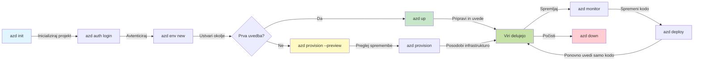
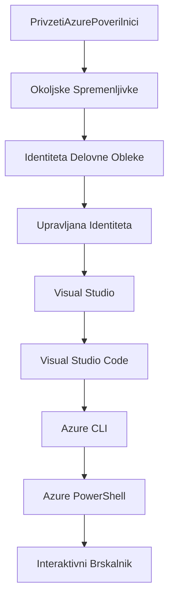

# AZD Osnove - Razumevanje Azure Developer CLI

# AZD Osnove - Ključni koncepti in temelji

**Navigacija po poglavjih:**
- **📚 Domača stran tečaja**: [AZD za začetnike](../../README.md)
- **📖 Trenutno poglavje**: Poglavje 1 - Osnove in hitri začetek
- **⬅️ Prejšnje**: [Pregled tečaja](../../README.md#-chapter-1-foundation--quick-start)
- **➡️ Naslednje**: [Namestitev in nastavitev](installation.md)
- **🚀 Naslednje poglavje**: [Poglavje 2: Razvoj z AI](../microsoft-foundry/microsoft-foundry-integration.md)

## Uvod

V tej lekciji boste spoznali Azure Developer CLI (azd), zmogljivo orodje ukazne vrstice, ki pospeši prehod od lokalnega razvoja do uvajanja v Azure. Spoznali boste temeljne koncepte, ključne funkcije in razumeli, kako azd poenostavi uvajanje aplikacij, zasnovanih za oblak.

## Cilji učenja

Do konca te lekcije boste:
- Razumeli, kaj je Azure Developer CLI in njegov glavni namen
- Spoznali ključne koncepte, kot so predloge, okolja in storitve
- Raziskali ključne funkcije, vključno z razvojem na osnovi predlog in infrastrukturo kot kodo
- Razumeli strukturo in potek dela projekta azd
- Pripravljeni na namestitev in konfiguracijo azd za vaše razvojno okolje

## Rezultati učenja

Po zaključku te lekcije boste lahko:
- Razložili vlogo azd v sodobnih delovnih tokovih razvoja za oblak
- Prepoznali komponente strukture projekta azd
- Opisali, kako predloge, okolja in storitve delujejo skupaj
- Razumeli prednosti infrastrukture kot kode z azd
- Prepoznali različne ukaze azd in njihove namene

## Kaj je Azure Developer CLI (azd)?

Azure Developer CLI (azd) je orodje ukazne vrstice, zasnovano za pospešitev prehoda od lokalnega razvoja do uvajanja v Azure. Poenostavi proces gradnje, uvajanja in upravljanja aplikacij, zasnovanih za oblak, v Azure.

### 🎯 Zakaj uporabljati AZD? Primerjava iz resničnega sveta

Primerjajmo uvajanje preproste spletne aplikacije z bazo podatkov:

#### ❌ BREZ AZD: Ročno uvajanje v Azure (30+ minut)

```bash
# Korak 1: Ustvari skupino virov
az group create --name myapp-rg --location eastus

# Korak 2: Ustvari načrt storitve aplikacije
az appservice plan create --name myapp-plan \
  --resource-group myapp-rg \
  --sku B1 --is-linux

# Korak 3: Ustvari spletno aplikacijo
az webapp create --name myapp-web-unique123 \
  --resource-group myapp-rg \
  --plan myapp-plan \
  --runtime "NODE:18-lts"

# Korak 4: Ustvari račun Cosmos DB (10-15 minut)
az cosmosdb create --name myapp-cosmos-unique123 \
  --resource-group myapp-rg \
  --kind MongoDB

# Korak 5: Ustvari bazo podatkov
az cosmosdb mongodb database create \
  --account-name myapp-cosmos-unique123 \
  --resource-group myapp-rg \
  --name tododb

# Korak 6: Ustvari zbirko
az cosmosdb mongodb collection create \
  --account-name myapp-cosmos-unique123 \
  --resource-group myapp-rg \
  --database-name tododb \
  --name todos

# Korak 7: Pridobi povezovalni niz
CONN_STR=$(az cosmosdb keys list \
  --name myapp-cosmos-unique123 \
  --resource-group myapp-rg \
  --type connection-strings \
  --query "connectionStrings[0].connectionString" -o tsv)

# Korak 8: Konfiguriraj nastavitve aplikacije
az webapp config appsettings set \
  --name myapp-web-unique123 \
  --resource-group myapp-rg \
  --settings MONGODB_URI="$CONN_STR"

# Korak 9: Omogoči beleženje
az webapp log config --name myapp-web-unique123 \
  --resource-group myapp-rg \
  --application-logging filesystem \
  --detailed-error-messages true

# Korak 10: Nastavi Application Insights
az monitor app-insights component create \
  --app myapp-insights \
  --location eastus \
  --resource-group myapp-rg

# Korak 11: Poveži App Insights s spletno aplikacijo
INSTRUMENTATION_KEY=$(az monitor app-insights component show \
  --app myapp-insights \
  --resource-group myapp-rg \
  --query "instrumentationKey" -o tsv)

az webapp config appsettings set \
  --name myapp-web-unique123 \
  --resource-group myapp-rg \
  --settings APPINSIGHTS_INSTRUMENTATIONKEY="$INSTRUMENTATION_KEY"

# Korak 12: Zgradi aplikacijo lokalno
npm install
npm run build

# Korak 13: Ustvari paket za uvajanje
zip -r app.zip . -x "*.git*" "node_modules/*"

# Korak 14: Uvedi aplikacijo
az webapp deployment source config-zip \
  --resource-group myapp-rg \
  --name myapp-web-unique123 \
  --src app.zip

# Korak 15: Počakaj in moli, da deluje 🙏
# (Brez avtomatizirane validacije, potrebno ročno testiranje)
```

**Težave:**
- ❌ 15+ ukazov, ki si jih je treba zapomniti in izvesti v pravilnem vrstnem redu
- ❌ 30-45 minut ročnega dela
- ❌ Enostavno narediti napake (tipkarske napake, napačni parametri)
- ❌ Izpostavljene povezovalne nize v zgodovini terminala
- ❌ Brez avtomatiziranega povratka v primeru napake
- ❌ Težko ponovljivo za člane ekipe
- ❌ Vsakič drugače (ni ponovljivo)

#### ✅ Z AZD: Avtomatizirano uvajanje (5 ukazov, 10-15 minut)

```bash
# Korak 1: Inicializirajte iz predloge
azd init --template todo-nodejs-mongo

# Korak 2: Avtenticirajte
azd auth login

# Korak 3: Ustvarite okolje
azd env new dev

# Korak 4: Predogled sprememb (neobvezno, vendar priporočljivo)
azd provision --preview

# Korak 5: Namestite vse
azd up

# ✨ Končano! Vse je nameščeno, konfigurirano in spremljano
```

**Prednosti:**
- ✅ **5 ukazov** v primerjavi s 15+ ročnimi koraki
- ✅ **10-15 minut** skupnega časa (večinoma čakanje na Azure)
- ✅ **Brez napak** - avtomatizirano in preizkušeno
- ✅ **Varno upravljanje skrivnosti** prek Key Vault
- ✅ **Samodejni povratek** ob napakah
- ✅ **Popolnoma ponovljivo** - isti rezultat vsakič
- ✅ **Pripravljeno za ekipo** - kdorkoli lahko uvede z istimi ukazi
- ✅ **Infrastruktura kot koda** - predloge Bicep pod nadzorom različic
- ✅ **Vgrajeno spremljanje** - Application Insights samodejno konfiguriran

### 📊 Zmanjšanje časa in napak

| Merilo | Ročno uvajanje | Uvajanje z AZD | Izboljšava |
|:-------|:---------------|:---------------|:-----------|
| **Ukazi** | 15+ | 5 | 67 % manj |
| **Čas** | 30-45 min | 10-15 min | 60 % hitreje |
| **Stopnja napak** | ~40 % | <5 % | 88 % manj |
| **Doslednost** | Nizka (ročna) | 100 % (avtomatizirana) | Popolna |
| **Uvajanje ekipe** | 2-4 ure | 30 minut | 75 % hitreje |
| **Čas povratka** | 30+ min (ročni) | 2 min (avtomatizirani) | 93 % hitreje |

## Ključni koncepti

### Predloge
Predloge so temelj azd. Vsebujejo:
- **Kodo aplikacije** - vaša izvorna koda in odvisnosti
- **Definicije infrastrukture** - Azure viri, definirani v Bicep ali Terraform
- **Konfiguracijske datoteke** - nastavitve in okoljske spremenljivke
- **Skripte za uvajanje** - avtomatizirani poteki dela za uvajanje

### Okolja
Okolja predstavljajo različne cilje uvajanja:
- **Razvojno** - za testiranje in razvoj
- **Testno** - predprodukcijsko okolje
- **Produkcijsko** - živo produkcijsko okolje

Vsako okolje ima svoje:
- Skupine virov Azure
- Konfiguracijske nastavitve
- Stanje uvajanja

### Storitve
Storitve so gradniki vaše aplikacije:
- **Uporabniški vmesnik** - spletne aplikacije, SPAs
- **Zaledje** - API-ji, mikrostoritve
- **Baza podatkov** - rešitve za shranjevanje podatkov
- **Shranjevanje** - shranjevanje datotek in blobov

## Ključne funkcije

### 1. Razvoj na osnovi predlog
```bash
# Brskaj po razpoložljivih predlogah
azd template list

# Inicializiraj iz predloge
azd init --template <template-name>
```

### 2. Infrastruktura kot koda
- **Bicep** - domensko specifičen jezik Azure
- **Terraform** - orodje za večoblačno infrastrukturo
- **ARM predloge** - predloge Azure Resource Manager

### 3. Integrirani poteki dela
```bash
# Dokončaj delovni tok uvajanja
azd up            # Priprava + Uvajanje to je brez posredovanja za prvo nastavitev

# 🧪 NOVO: Predogled sprememb infrastrukture pred uvajanjem (VARNO)
azd provision --preview    # Simuliraj uvajanje infrastrukture brez spreminjanja

azd provision     # Ustvari Azure vire, če posodobiš infrastrukturo, uporabi to
azd deploy        # Uvedi aplikacijsko kodo ali ponovno uvedi aplikacijsko kodo po posodobitvi
azd down          # Počisti vire
```

#### 🛡️ Varno načrtovanje infrastrukture s predogledom
Ukaz `azd provision --preview` je prelomnica za varno uvajanje:
- **Analiza suhega zagona** - prikaže, kaj bo ustvarjeno, spremenjeno ali izbrisano
- **Brez tveganja** - v Azure okolju se ne izvedejo nobene dejanske spremembe
- **Sodelovanje ekipe** - delite rezultate predogleda pred uvajanjem
- **Ocena stroškov** - razumite stroške virov pred zavezo

```bash
# Primer poteka predogleda
azd provision --preview           # Oglejte si, kaj se bo spremenilo
# Preglejte rezultat, razpravljajte s skupino
azd provision                     # Uvedite spremembe z zaupanjem
```

### 📊 Vizualno: Potek razvoja z AZD


**Pojasnilo poteka dela:**
1. **Init** - Začnite s predlogo ali novim projektom
2. **Auth** - Avtentikacija z Azure
3. **Okolje** - Ustvarite izolirano okolje za uvajanje
4. **Predogled** - 🆕 Vedno najprej predogled sprememb infrastrukture (varna praksa)
5. **Provision** - Ustvarite/posodobite Azure vire
6. **Deploy** - Potisnite kodo aplikacije
7. **Monitor** - Spremljajte delovanje aplikacije
8. **Iterate** - Naredite spremembe in ponovno uvedite kodo
9. **Cleanup** - Odstranite vire, ko končate

### 4. Upravljanje okolij
```bash
# Ustvari in upravljaj okolja
azd env new <environment-name>
azd env select <environment-name>
azd env list
```

## 📁 Struktura projekta

Tipična struktura projekta azd:
```
my-app/
├── .azd/                    # azd configuration
│   └── config.json
├── .azure/                  # Azure deployment artifacts
├── .devcontainer/          # Development container config
├── .github/workflows/      # GitHub Actions
├── .vscode/               # VS Code settings
├── infra/                 # Infrastructure code
│   ├── main.bicep        # Main infrastructure template
│   ├── main.parameters.json
│   └── modules/          # Reusable modules
├── src/                  # Application source code
│   ├── api/             # Backend services
│   └── web/             # Frontend application
├── azure.yaml           # azd project configuration
└── README.md
```

## 🔧 Konfiguracijske datoteke

### azure.yaml
Glavna konfiguracijska datoteka projekta:
```yaml
name: my-awesome-app
metadata:
  template: my-template@1.0.0

services:
  web:
    project: ./src/web
    language: js
    host: appservice
  api:
    project: ./src/api
    language: js
    host: appservice

hooks:
  preprovision:
    shell: pwsh
    run: echo "Preparing to provision..."
```

### .azure/config.json
Konfiguracija, specifična za okolje:
```json
{
  "version": 1,
  "defaultEnvironment": "dev",
  "environments": {
    "dev": {
      "subscriptionId": "your-subscription-id",
      "location": "eastus"
    }
  }
}
```

## 🎪 Pogosti poteki dela z vajami

> **💡 Nasvet za učenje:** Sledite tem vajam po vrsti, da postopoma razvijete svoje veščine z AZD.

### 🎯 Vaja 1: Inicializirajte svoj prvi projekt

**Cilj:** Ustvarite projekt AZD in raziščite njegovo strukturo

**Koraki:**
```bash
# Uporabite preverjeno predlogo
azd init --template todo-nodejs-mongo

# Raziščite ustvarjene datoteke
ls -la  # Oglejte si vse datoteke, vključno s skritimi

# Ustvarjene ključne datoteke:
# - azure.yaml (glavna konfiguracija)
# - infra/ (koda infrastrukture)
# - src/ (koda aplikacije)
```

**✅ Uspeh:** Imate mape azure.yaml, infra/ in src/

---

### 🎯 Vaja 2: Uvajanje v Azure

**Cilj:** Zaključite celoten postopek uvajanja

**Koraki:**
```bash
# 1. Avtenticiraj
az login && azd auth login

# 2. Ustvari okolje
azd env new dev
azd env set AZURE_LOCATION eastus

# 3. Predogled sprememb (PRIPOROČENO)
azd provision --preview

# 4. Namesti vse
azd up

# 5. Preveri namestitev
azd show    # Oglej si URL svoje aplikacije
```

**Predviden čas:** 10-15 minut  
**✅ Uspeh:** URL aplikacije se odpre v brskalniku

---

### 🎯 Vaja 3: Več okolij

**Cilj:** Uvajanje v razvojno in testno okolje

**Koraki:**
```bash
# Že imamo razvoj, ustvarimo testno okolje
azd env new staging
azd env set AZURE_LOCATION westus2
azd up

# Preklapljaj med njima
azd env list
azd env select dev
```

**✅ Uspeh:** Dve ločeni skupini virov v Azure Portalu

---

### 🛡️ Čisto stanje: `azd down --force --purge`

Ko potrebujete popolno ponastavitev:

```bash
azd down --force --purge
```

**Kaj naredi:**
- `--force`: Brez potrditvenih pozivov
- `--purge`: Izbriše vse lokalne stanje in Azure vire

**Uporabite, ko:**
- Uvajanje ni uspelo sredi postopka
- Preklapljate projekte
- Potrebujete svež začetek

---

## 🎪 Referenca izvirnega poteka dela

### Začetek novega projekta
```bash
# Metoda 1: Uporabi obstoječo predlogo
azd init --template todo-nodejs-mongo

# Metoda 2: Začni iz nič
azd init

# Metoda 3: Uporabi trenutni imenik
azd init .
```

### Razvojni cikel
```bash
# Nastavite razvojno okolje
azd auth login
azd env new dev
azd env select dev

# Namestite vse
azd up

# Naredite spremembe in ponovno namestite
azd deploy

# Po končanem delu počistite
azd down --force --purge # ukaz v Azure Developer CLI je **trda ponastavitev** za vaše okolje—še posebej uporabno pri odpravljanju težav z neuspelimi namestitvami, čiščenju osirotelih virov ali pripravi na novo namestitev.
```

## Razumevanje `azd down --force --purge`
Ukaz `azd down --force --purge` je močno orodje za popolno odstranitev vašega azd okolja in vseh povezanih virov. Tukaj je razčlenitev, kaj posamezna zastavica naredi:
```
--force
```
- Preskoči potrditvene pozive.
- Koristno za avtomatizacijo ali skriptiranje, kjer ročni vnos ni izvedljiv.
- Zagotavlja, da se odstranitev nadaljuje brez prekinitev, tudi če CLI zazna neskladja.

```
--purge
```
Izbriše **vse povezane metapodatke**, vključno z:
Stanje okolja
Lokalna mapa `.azure`
Predpomnjene informacije o uvajanju
Preprečuje, da bi azd "zapomnil" prejšnja uvajanja, kar lahko povzroči težave, kot so neusklajene skupine virov ali zastarele reference registra.

### Zakaj uporabiti oboje?
Ko naletite na težave z `azd up` zaradi preostalega stanja ali delnih uvajanj, ta kombinacija zagotavlja **čisto stanje**.

Še posebej uporabno po ročnih brisanjih virov v Azure portalu ali pri preklapljanju predlog, okolij ali poimenovalnih konvencij skupin virov.

### Upravljanje več okolij
```bash
# Ustvari okolje za testiranje
azd env new staging
azd env select staging
azd up

# Preklopi nazaj na razvojno okolje
azd env select dev

# Primerjaj okolja
azd env list
```

## 🔐 Avtentikacija in poverilnice

Razumevanje avtentikacije je ključno za uspešna uvajanja z azd. Azure uporablja več metod avtentikacije, azd pa uporablja isto verigo poverilnic kot druga orodja Azure.

### Avtentikacija z Azure CLI (`az login`)

Pred uporabo azd se morate avtenticirati z Azure. Najpogostejša metoda je uporaba Azure CLI:

```bash
# Interaktivna prijava (odpre brskalnik)
az login

# Prijava z določenim najemnikom
az login --tenant <tenant-id>

# Prijava s storitvenim principalom
az login --service-principal -u <app-id> -p <password> --tenant <tenant-id>

# Preveri trenutno stanje prijave
az account show

# Prikaži razpoložljive naročnine
az account list --output table

# Nastavi privzeto naročnino
az account set --subscription <subscription-id>
```

### Potek avtentikacije
1. **Interaktivna prijava**: Odpre vaš privzeti brskalnik za avtentikacijo
2. **Tok kode naprave**: Za okolja brez dostopa do brskalnika
3. **Servisni glavni uporabnik**: Za avtomatizacijo in scenarije CI/CD
4. **Upravljana identiteta**: Za aplikacije, gostovane v Azure

### Veriga poverilnic DefaultAzureCredential

`DefaultAzureCredential` je vrsta poverilnic, ki zagotavlja poenostavljeno izkušnjo avtentikacije z avtomatskim poskusom več virov poverilnic v določenem vrstnem redu:

#### Vrstni red verige poverilnic

#### 1. Okoljske spremenljivke
```bash
# Nastavite okoljske spremenljivke za glavno storitev
export AZURE_CLIENT_ID="<app-id>"
export AZURE_CLIENT_SECRET="<password>"
export AZURE_TENANT_ID="<tenant-id>"
```

#### 2. Identiteta delovne obremenitve (Kubernetes/GitHub Actions)
Samodejno uporabljeno v:
- Azure Kubernetes Service (AKS) z identiteto delovne obremenitve
- GitHub Actions z OIDC federacijo
- Drugih scenarijih federirane identitete

#### 3. Upravljana identiteta
Za Azure vire, kot so:
- Virtualni stroji
- App Service
- Azure Functions
- Container Instances

```bash
# Preveri, ali se izvaja na Azure viru z upravljano identiteto
az account show --query "user.type" --output tsv
# Vrne: "servicePrincipal", če se uporablja upravljana identiteta
```

#### 4. Integracija z razvojnimi orodji
- **Visual Studio**: Samodejno uporablja prijavljen račun
- **VS Code**: Uporablja poverilnice razširitve Azure Account
- **Azure CLI**: Uporablja poverilnice `az login` (najpogostejše za lokalni razvoj)

### Nastavitev avtentikacije z AZD

```bash
# Metoda 1: Uporabite Azure CLI (Priporočeno za razvoj)
az login
azd auth login  # Uporablja obstoječe Azure CLI poverilnice

# Metoda 2: Neposredna avtentikacija azd
azd auth login --use-device-code  # Za okolja brez uporabniškega vmesnika

# Metoda 3: Preverite stanje avtentikacije
azd auth login --check-status

# Metoda 4: Odjava in ponovna avtentikacija
azd auth logout
azd auth login
```

### Najboljše prakse za avtentikacijo

#### Za lokalni razvoj
```bash
# 1. Prijavite se z Azure CLI
az login

# 2. Preverite pravilno naročnino
az account show
az account set --subscription "Your Subscription Name"

# 3. Uporabite azd z obstoječimi poverilnicami
azd auth login
```

#### Za CI/CD cevovode
```yaml
# GitHub Actions example
- name: Azure Login
  uses: azure/login@v1
  with:
    creds: ${{ secrets.AZURE_CREDENTIALS }}

- name: Deploy with azd
  run: |
    azd auth login --client-id ${{ secrets.AZURE_CLIENT_ID }} \
                    --client-secret ${{ secrets.AZURE_CLIENT_SECRET }} \
                    --tenant-id ${{ secrets.AZURE_TENANT_ID }}
    azd up --no-prompt
```

#### Za produkcijska okolja
- Uporabite **upravljano identiteto**, ko delate na Azure virih
- Uporabite **servisni glavni uporabnik** za avtomatizacijo
- Izogibajte se shranjevanju poverilnic v kodi ali konfiguracijskih datotekah
- Uporabite **Azure Key Vault** za občutljive konfiguracije

### Pogoste težave z avtentikacijo in rešitve

#### Težava: "Naročnina ni najdena"
```bash
# Rešitev: Nastavite privzeto naročnino
az account list --output table
az account set --subscription "<subscription-id>"
azd env set AZURE_SUBSCRIPTION_ID "<subscription-id>"
```

#### Težava: "Premalo dovoljenj"
```bash
# Rešitev: Preverite in dodelite zahtevane vloge
az role assignment list --assignee $(az account show --query user.name --output tsv)

# Pogoste zahtevane vloge:
# - Sodelavec (za upravljanje virov)
# - Skrbnik dostopa uporabnikov (za dodeljevanje vlog)
```

#### Težava: "Žeton je potekel"
```bash
# Rešitev: Ponovna avtentikacija
az logout
az login
azd auth logout
azd auth login
```

### Avtentikacija v različnih scenarijih

#### Lokalni razvoj
```bash
# Račun za osebni razvoj
az login
azd auth login
```

#### Razvoj v ekipi
```bash
# Uporabite določen najemnik za organizacijo
az login --tenant contoso.onmicrosoft.com
azd auth login
```

#### Večnajemniški scenariji
```bash
# Preklopi med najemniki
az login --tenant tenant1.onmicrosoft.com
# Namesti na najemnika 1
azd up

az login --tenant tenant2.onmicrosoft.com  
# Namesti na najemnika 2
azd up
```

### Varnostni vidiki

1. **Shranjevanje poverilnic**: Nikoli ne shranjujte poverilnic v izvorni kodi
2. **Omejitev obsega**: Uporabite načelo najmanjših privilegijev za servisne glavne uporabnike
3. **Rotacija žetonov**: Redno rotirajte skrivnosti servisnih glavnih uporabnikov
4. **Sled dejavnosti**: Spremljajte avtentikacijo in dejavnosti uvajanja
5. **Omrežna varnost**: Uporabite zasebne končne točke, kadar je to mogoče

### Odpravljanje težav z avtentikacijo

```bash
# Odpravljanje težav z avtentikacijo
azd auth login --check-status
az account show
az account get-access-token

# Pogosti diagnostični ukazi
whoami                          # Trenutni uporabniški kontekst
az ad signed-in-user show      # Podrobnosti uporabnika Azure AD
az group list                  # Preizkus dostopa do virov
```

## Razumevanje `azd down --force --purge`

### Odkritje
```bash
azd template list              # Brskaj po predlogah
azd template show <template>   # Podrobnosti predloge
azd init --help               # Možnosti inicializacije
```

### Upravljanje projektov
```bash
azd show                     # Pregled projekta
azd env show                 # Trenutno okolje
azd config list             # Nastavitve konfiguracije
```

### Spremljanje
```bash
azd monitor                  # Odpri Azure portal
azd pipeline config          # Nastavi CI/CD
azd logs                     # Ogled dnevnikov aplikacije
```

## Najboljše prakse

### 1. Uporabljajte smiselna imena
```bash
# Dobro
azd env new production-east
azd init --template web-app-secure

# Izogibaj
azd env new env1
azd init --template template1
```

### 2. Izkoristite predloge
- Začnite z obstoječimi predlogami
- Prilagodite jih svojim potrebam
- Ustvarite ponovno uporabne predloge za svojo organizacijo

### 3. Izolacija okolij
- Uporabite ločena okolja za razvoj/testiranje/produkcijo
- Nikoli ne uvajajte neposredno v produkcijo z lokalnega računalnika
- Uporabite CI/CD cevovode za produkcijska uvajanja

### 4. Upravljanje konfiguracije
- Uporabite okoljske spremenljivke za občutljive podatke
- Shranjujte konfiguracijo pod nadzorom različic
- Dokumentirajte nastavitve, specifične za okolje

## Napredovanje v učenju

### Začetnik (1-2 tedna)
1. Namestite azd in se avtenticirajte
2. Uvedite preprosto predlogo
3. Razumite strukturo projekta
4. Naučite se osnovnih ukazov (up, down, deploy)

### Srednje napreden (3-4 tedne)
1. Prilagodite predloge
2. Upravljajte več okolij
3. Razumite infrastrukturo kot kodo
4. Nastavite CI/CD cevovode

### Napreden (5+ tednov)
1. Ustvarite lastne predloge
2. Napredni vzorci infrastrukture
3. Uvajanja v več regijah
4. Konfiguracije na ravni podjetja

## Naslednji koraki

**📖 Nadaljujte z učenjem v poglavju 1:**
- [Namestitev in nastavitev](installation.md) - Namestite in konfigurirajte azd
- [Vaš prvi projekt](first-project.md) - Popoln praktični vodič
- [Vodnik za konfiguracijo](configuration.md) - Napredne možnosti konfiguracije

**🎯 Pripravljeni na naslednje poglavje?**
- [Poglavje 2: Razvoj z AI na prvem mestu](../microsoft-foundry/microsoft-foundry-integration.md) - Začnite graditi AI aplikacije

## Dodatni viri

- [Pregled Azure Developer CLI](https://learn.microsoft.com/en-us/azure/developer/azure-developer-cli/)
- [Galerija predlog](https://azure.github.io/awesome-azd/)
- [Primeri skupnosti](https://github.com/Azure-Samples)

---

## 🙋 Pogosto zastavljena vprašanja

### Splošna vprašanja

**V: Kakšna je razlika med AZD in Azure CLI?**

O: Azure CLI (`az`) je namenjen upravljanju posameznih Azure virov. AZD (`azd`) pa upravlja celotne aplikacije:

```bash
# Azure CLI - Upravljanje virov na nizki ravni
az webapp create --name myapp --resource-group rg
az sql server create --name myserver --resource-group rg
# ...potrebnih je še veliko več ukazov

# AZD - Upravljanje na ravni aplikacije
azd up  # Namesti celotno aplikacijo z vsemi viri
```

**Pomislite na to takole:**
- `az` = Delo s posameznimi Lego kockami
- `azd` = Delo s celotnimi Lego kompleti

---

**V: Ali moram poznati Bicep ali Terraform za uporabo AZD?**

O: Ne! Začnite s predlogami:
```bash
# Uporabite obstoječo predlogo - ni potrebno znanje IaC
azd init --template todo-nodejs-mongo
azd up
```

Kasneje se lahko naučite Bicep za prilagoditev infrastrukture. Predloge ponujajo delujoče primere za učenje.

---

**V: Koliko stane uporaba predlog AZD?**

O: Stroški se razlikujejo glede na predlogo. Večina razvojnih predlog stane $50-150/mesec:

```bash
# Preglejte stroške pred uvajanjem
azd provision --preview

# Vedno počistite, ko ne uporabljate
azd down --force --purge  # Odstrani vse vire
```

**Nasvet:** Uporabite brezplačne nivoje, kjer so na voljo:
- App Service: F1 (brezplačni) nivo
- Azure OpenAI: 50.000 žetonov/mesec brezplačno
- Cosmos DB: 1000 RU/s brezplačni nivo

---

**V: Ali lahko uporabljam AZD z obstoječimi Azure viri?**

O: Da, vendar je lažje začeti na novo. AZD najbolje deluje, ko upravlja celoten življenjski cikel. Za obstoječe vire:

```bash
# Možnost 1: Uvoz obstoječih virov (napredno)
azd init
# Nato spremenite infra/, da se sklicuje na obstoječe vire

# Možnost 2: Začnite na novo (priporočeno)
azd init --template matching-your-stack
azd up  # Ustvari novo okolje
```

---

**V: Kako lahko delim svoj projekt s sodelavci?**

O: Projekt AZD shranite v Git (vendar NE .azure mape):

```bash
# Že privzeto v .gitignore
.azure/        # Vsebuje skrivnosti in podatke o okolju
*.env          # Spremenljivke okolja

# Člani ekipe takrat:
git clone <your-repo>
azd auth login
azd env new <their-name>-dev
azd up
```

Vsi dobijo identično infrastrukturo iz istih predlog.

---

### Vprašanja o odpravljanju težav

**V: "azd up" se je ustavil na polovici. Kaj naj storim?**

O: Preverite napako, jo odpravite in poskusite znova:

```bash
# Oglejte si podrobne dnevnike
azd show

# Pogoste rešitve:

# 1. Če je kvota presežena:
azd env set AZURE_LOCATION "westus2"  # Poskusite drugo regijo

# 2. Če pride do konflikta imen virov:
azd down --force --purge  # Začnite znova
azd up  # Poskusite znova

# 3. Če je avtentikacija potekla:
az login
azd auth login
azd up
```

**Najpogostejša težava:** Izbrana napačna naročnina Azure
```bash
az account list --output table
az account set --subscription "<correct-subscription>"
```

---

**V: Kako lahko uvedem samo spremembe kode brez ponovnega zagotavljanja?**

O: Uporabite `azd deploy` namesto `azd up`:

```bash
azd up          # Prvič: priprava + uvedba (počasno)

# Naredite spremembe kode...

azd deploy      # Naslednjič: samo uvedba (hitro)
```

Primerjava hitrosti:
- `azd up`: 10-15 minut (zagotavlja infrastrukturo)
- `azd deploy`: 2-5 minut (samo koda)

---

**V: Ali lahko prilagodim infrastrukturne predloge?**

O: Da! Uredite Bicep datoteke v `infra/`:

```bash
# Po azd inicializaciji
cd infra/
code main.bicep  # Uredi v VS Code

# Predogled sprememb
azd provision --preview

# Uveljavi spremembe
azd provision
```

**Nasvet:** Začnite z majhnimi spremembami - najprej spremenite SKUs:
```bicep
// infra/main.bicep
sku: {
  name: 'B1'  // Change to 'P1V2' for production
}
```

---

**V: Kako izbrišem vse, kar je ustvaril AZD?**

O: En ukaz odstrani vse vire:

```bash
azd down --force --purge

# To izbriše:
# - Vse Azure vire
# - Skupino virov
# - Stanje lokalnega okolja
# - Predpomnjene podatke o uvajanju
```

**Vedno izvedite to, ko:**
- Končate testiranje predloge
- Preklapljate na drug projekt
- Želite začeti na novo

**Prihranek stroškov:** Brisanje neuporabljenih virov = $0 stroškov

---

**V: Kaj če sem pomotoma izbrisal vire v Azure Portalu?**

O: Stanje AZD se lahko ne ujema. Pristop s čistim začetkom:

```bash
# 1. Odstrani lokalno stanje
azd down --force --purge

# 2. Začni na novo
azd up

# Alternativa: Naj AZD zazna in popravi
azd provision  # Ustvaril bo manjkajoče vire
```

---

### Napredna vprašanja

**V: Ali lahko uporabljam AZD v CI/CD procesih?**

O: Da! Primer za GitHub Actions:

```yaml
# .github/workflows/deploy.yml
name: Deploy with AZD

on:
  push:
    branches: [main]

jobs:
  deploy:
    runs-on: ubuntu-latest
    steps:
      - uses: actions/checkout@v2
      
      - name: Install azd
        run: curl -fsSL https://aka.ms/install-azd.sh | bash
      
      - name: Azure Login
        run: |
          azd auth login \
            --client-id ${{ secrets.AZURE_CLIENT_ID }} \
            --client-secret ${{ secrets.AZURE_CLIENT_SECRET }} \
            --tenant-id ${{ secrets.AZURE_TENANT_ID }}
      
      - name: Deploy
        run: azd up --no-prompt
```

---

**V: Kako ravnam s skrivnostmi in občutljivimi podatki?**

O: AZD se samodejno poveže z Azure Key Vault:

```bash
# Skrivnosti so shranjene v Key Vault, ne v kodi
azd env set DATABASE_PASSWORD "$(openssl rand -base64 32)"

# AZD samodejno:
# 1. Ustvari Key Vault
# 2. Shrani skrivnost
# 3. Dodeli dostop aplikaciji prek upravljane identitete
# 4. Vstavi med izvajanjem
```

**Nikoli ne shranjujte:**
- `.azure/` mape (vsebuje podatke o okolju)
- `.env` datotek (lokalne skrivnosti)
- Povezovalnih nizov

---

**V: Ali lahko uvedem v več regij?**

O: Da, ustvarite okolje za vsako regijo:

```bash
# Vzhodno ZDA okolje
azd env new prod-eastus
azd env set AZURE_LOCATION eastus
azd up

# Zahodno Evropa okolje
azd env new prod-westeurope
azd env set AZURE_LOCATION westeurope
azd up

# Vsako okolje je neodvisno
azd env list
```

Za prave aplikacije v več regijah prilagodite Bicep predloge za hkratno uvedbo v več regij.

---

**V: Kje lahko dobim pomoč, če se zataknem?**

1. **Dokumentacija AZD:** https://learn.microsoft.com/azure/developer/azure-developer-cli/
2. **GitHub Issues:** https://github.com/Azure/azure-dev/issues
3. **Discord:** [Azure Discord](https://discord.gg/microsoft-azure) - kanal #azure-developer-cli
4. **Stack Overflow:** Oznaka `azure-developer-cli`
5. **Ta tečaj:** [Vodnik za odpravljanje težav](../troubleshooting/common-issues.md)

**Nasvet:** Preden vprašate, izvedite:
```bash
azd show       # Prikazuje trenutno stanje
azd version    # Prikazuje vašo različico
```
Vključite te informacije v svoje vprašanje za hitrejšo pomoč.

---

## 🎓 Kaj sledi?

Sedaj razumete osnove AZD. Izberite svojo pot:

### 🎯 Za začetnike:
1. **Naprej:** [Namestitev in nastavitev](installation.md) - Namestite AZD na svoj računalnik
2. **Nato:** [Vaš prvi projekt](first-project.md) - Uvedite svojo prvo aplikacijo
3. **Vadite:** Dokončajte vse 3 vaje v tej lekciji

### 🚀 Za razvijalce AI:
1. **Preskočite na:** [Poglavje 2: Razvoj z AI na prvem mestu](../microsoft-foundry/microsoft-foundry-integration.md)
2. **Uvedite:** Začnite z `azd init --template get-started-with-ai-chat`
3. **Učite se:** Gradite med uvedbo

### 🏗️ Za izkušene razvijalce:
1. **Preglejte:** [Vodnik za konfiguracijo](configuration.md) - Napredne nastavitve
2. **Raziskujte:** [Infrastruktura kot koda](../deployment/provisioning.md) - Poglobljen pogled na Bicep
3. **Gradite:** Ustvarite prilagojene predloge za svoj sklad

---

**Navigacija po poglavjih:**
- **📚 Domača stran tečaja**: [AZD za začetnike](../../README.md)
- **📖 Trenutno poglavje**: Poglavje 1 - Osnove in hitri začetek  
- **⬅️ Prejšnje**: [Pregled tečaja](../../README.md#-chapter-1-foundation--quick-start)
- **➡️ Naslednje**: [Namestitev in nastavitev](installation.md)
- **🚀 Naslednje poglavje**: [Poglavje 2: Razvoj z AI na prvem mestu](../microsoft-foundry/microsoft-foundry-integration.md)

---

<!-- CO-OP TRANSLATOR DISCLAIMER START -->
**Omejitev odgovornosti**:  
Ta dokument je bil preveden z uporabo storitve AI prevajanja [Co-op Translator](https://github.com/Azure/co-op-translator). Čeprav si prizadevamo za natančnost, vas prosimo, da upoštevate, da lahko avtomatski prevodi vsebujejo napake ali netočnosti. Izvirni dokument v njegovem maternem jeziku je treba obravnavati kot avtoritativni vir. Za ključne informacije priporočamo profesionalni človeški prevod. Ne odgovarjamo za morebitne nesporazume ali napačne razlage, ki izhajajo iz uporabe tega prevoda.
<!-- CO-OP TRANSLATOR DISCLAIMER END -->