<!--
CO_OP_TRANSLATOR_METADATA:
{
  "original_hash": "e5aa37cdb6378c09099500ac31600b8c",
  "translation_date": "2025-11-23T23:55:08+00:00",
  "source_file": "docs/pre-deployment/application-insights.md",
  "language_code": "sl"
}
-->
# Integracija Application Insights z AZD

⏱️ **Ocenjeni čas**: 40-50 minut | 💰 **Stroški**: ~$5-15/mesec | ⭐ **Kompleksnost**: Srednja

**📚 Učni načrt:**
- ← Prejšnje: [Preflight Checks](preflight-checks.md) - Validacija pred namestitvijo
- 🎯 **Tukaj ste**: Integracija Application Insights (nadzor, telemetrija, odpravljanje napak)
- → Naslednje: [Deployment Guide](../deployment/deployment-guide.md) - Namestitev na Azure
- 🏠 [Domov](../../README.md)

---

## Kaj se boste naučili

Ko zaključite to lekcijo, boste:
- Samodejno integrirali **Application Insights** v AZD projekte
- Konfigurirali **porazdeljeno sledenje** za mikrostoritve
- Implementirali **prilagojeno telemetrijo** (metrike, dogodke, odvisnosti)
- Nastavili **živahne metrike** za spremljanje v realnem času
- Ustvarili **opozorila in nadzorne plošče** iz AZD namestitev
- Odpravljali težave v produkciji z **poizvedbami telemetrije**
- Optimizirali **stroške in strategije vzorčenja**
- Spremljali **AI/LLM aplikacije** (žetone, zakasnitve, stroške)

## Zakaj je Application Insights pomemben za AZD

### Izziv: Opazljivost v produkciji

**Brez Application Insights:**
```
❌ No visibility into production behavior
❌ Manual log aggregation across services
❌ Reactive debugging (wait for customer complaints)
❌ No performance metrics
❌ Cannot trace requests across services
❌ Unknown failure rates and bottlenecks
```

**Z Application Insights + AZD:**
```
✅ Automatic telemetry collection
✅ Centralized logs from all services
✅ Proactive issue detection
✅ End-to-end request tracing
✅ Performance metrics and insights
✅ Real-time dashboards
✅ AZD provisions everything automatically
```

**Primerjava**: Application Insights je kot "črna skrinjica" letala + nadzorna plošča za vašo aplikacijo. Vidite vse, kar se dogaja v realnem času, in lahko ponovno predvajate vsak incident.

---

## Pregled arhitekture

### Application Insights v arhitekturi AZD

```mermaid
graph TB
    User[Uporabnik/Stranka]
    App1[Posoda Aplikacija 1<br/>API Prehod]
    App2[Posoda Aplikacija 2<br/>Storitev Izdelkov]
    App3[Posoda Aplikacija 3<br/>Storitev Naročil]
    
    AppInsights[Vpogledi Aplikacije<br/>Središče Telemetrije]
    LogAnalytics[(Analitika Dnevnikov<br/>Delovni prostor)]
    
    Portal[Azure Portal<br/>Nadzorne plošče & Opozorila]
    Query[Kusto Poizvedbe<br/>Prilagojena Analiza]
    
    User --> App1
    App1 --> App2
    App2 --> App3
    
    App1 -.->|Samodejna instrumentacija| AppInsights
    App2 -.->|Samodejna instrumentacija| AppInsights
    App3 -.->|Samodejna instrumentacija| AppInsights
    
    AppInsights --> LogAnalytics
    LogAnalytics --> Portal
    LogAnalytics --> Query
    
    style AppInsights fill:#9C27B0,stroke:#7B1FA2,stroke-width:3px,color:#fff
    style LogAnalytics fill:#4CAF50,stroke:#388E3C,stroke-width:3px,color:#fff
```


### Kaj se spremlja samodejno

| Vrsta telemetrije | Kaj zajema | Uporaba |
|-------------------|------------|---------|
| **Zahteve** | HTTP zahteve, statusne kode, trajanje | Spremljanje zmogljivosti API-ja |
| **Odvisnosti** | Zunanji klici (DB, API-ji, shranjevanje) | Identifikacija ozkih grl |
| **Izjeme** | Neobdelane napake z izpisi skladov | Odpravljanje napak |
| **Prilagojeni dogodki** | Poslovni dogodki (registracija, nakup) | Analitika in tokovi |
| **Metrike** | Števci zmogljivosti, prilagojene metrike | Načrtovanje zmogljivosti |
| **Sledi** | Sporočila dnevnika z resnostjo | Odpravljanje napak in revizija |
| **Razpoložljivost** | Testi odzivnosti in časa delovanja | Spremljanje SLA |

---

## Predpogoji

### Potrebna orodja

```bash
# Preverite Azure Developer CLI
azd version
# ✅ Pričakovano: azd različica 1.0.0 ali višja

# Preverite Azure CLI
az --version
# ✅ Pričakovano: azure-cli 2.50.0 ali višja
```

### Zahteve za Azure

- Aktivna naročnina na Azure
- Dovoljenja za ustvarjanje:
  - Virov Application Insights
  - Delovnih prostorov Log Analytics
  - Container Apps
  - Skupin virov

### Zahteve glede znanja

Morali bi zaključiti:
- [Osnove AZD](../getting-started/azd-basics.md) - Temeljni koncepti AZD
- [Konfiguracija](../getting-started/configuration.md) - Nastavitev okolja
- [Prvi projekt](../getting-started/first-project.md) - Osnovna namestitev

---

## Lekcija 1: Samodejni Application Insights z AZD

### Kako AZD zagotovi Application Insights

AZD samodejno ustvari in konfigurira Application Insights ob namestitvi. Poglejmo, kako deluje.

### Struktura projekta

```
monitored-app/
├── azure.yaml                     # AZD configuration
├── infra/
│   ├── main.bicep                # Main infrastructure
│   ├── core/
│   │   └── monitoring.bicep      # Application Insights + Log Analytics
│   └── app/
│       └── api.bicep             # Container App with monitoring
└── src/
    ├── app.py                    # Application with telemetry
    ├── requirements.txt
    └── Dockerfile
```

---

### Korak 1: Konfiguracija AZD (azure.yaml)

**Datoteka: `azure.yaml`**

```yaml
name: monitored-app
metadata:
  template: monitored-app@1.0.0

services:
  api:
    project: ./src
    language: python
    host: containerapp

# AZD automatically provisions monitoring!
```

**To je vse!** AZD bo privzeto ustvaril Application Insights. Za osnovno spremljanje ni potrebna dodatna konfiguracija.

---

### Korak 2: Infrastruktura za spremljanje (Bicep)

**Datoteka: `infra/core/monitoring.bicep`**

```bicep
param logAnalyticsName string
param applicationInsightsName string
param location string = resourceGroup().location
param tags object = {}

// Log Analytics Workspace (required for Application Insights)
resource logAnalytics 'Microsoft.OperationalInsights/workspaces@2022-10-01' = {
  name: logAnalyticsName
  location: location
  tags: tags
  properties: {
    sku: {
      name: 'PerGB2018'  // Pay-as-you-go pricing
    }
    retentionInDays: 30  // Keep logs for 30 days
    features: {
      enableLogAccessUsingOnlyResourcePermissions: true
    }
  }
}

// Application Insights
resource applicationInsights 'Microsoft.Insights/components@2020-02-02' = {
  name: applicationInsightsName
  location: location
  tags: tags
  kind: 'web'
  properties: {
    Application_Type: 'web'
    WorkspaceResourceId: logAnalytics.id
    IngestionMode: 'LogAnalytics'
    publicNetworkAccessForIngestion: 'Enabled'
    publicNetworkAccessForQuery: 'Enabled'
  }
}

// Outputs for Container Apps
output logAnalyticsWorkspaceId string = logAnalytics.id
output logAnalyticsWorkspaceName string = logAnalytics.name
output applicationInsightsConnectionString string = applicationInsights.properties.ConnectionString
output applicationInsightsInstrumentationKey string = applicationInsights.properties.InstrumentationKey
output applicationInsightsName string = applicationInsights.name
```

---

### Korak 3: Povezava Container App z Application Insights

**Datoteka: `infra/app/api.bicep`**

```bicep
param name string
param location string
param tags object = {}
param containerAppsEnvironmentName string
param applicationInsightsConnectionString string

resource containerApp 'Microsoft.App/containerApps@2023-05-01' = {
  name: name
  location: location
  tags: tags
  properties: {
    configuration: {
      ingress: {
        external: true
        targetPort: 8000
      }
      secrets: [
        {
          name: 'appinsights-connection-string'
          value: applicationInsightsConnectionString
        }
      ]
    }
    template: {
      containers: [
        {
          name: 'api'
          image: 'myregistry.azurecr.io/api:latest'
          resources: {
            cpu: json('0.5')
            memory: '1Gi'
          }
          env: [
            {
              name: 'APPLICATIONINSIGHTS_CONNECTION_STRING'
              secretRef: 'appinsights-connection-string'
            }
            {
              name: 'APPLICATIONINSIGHTS_ENABLED'
              value: 'true'
            }
          ]
        }
      ]
    }
  }
}

output uri string = 'https://${containerApp.properties.configuration.ingress.fqdn}'
```

---

### Korak 4: Koda aplikacije s telemetrijo

**Datoteka: `src/app.py`**

```python
from flask import Flask, request, jsonify
from opencensus.ext.azure.log_exporter import AzureLogHandler
from opencensus.ext.azure.trace_exporter import AzureExporter
from opencensus.ext.flask.flask_middleware import FlaskMiddleware
from opencensus.trace.samplers import ProbabilitySampler
import logging
import os

app = Flask(__name__)

# Pridobi povezovalni niz za Application Insights
connection_string = os.environ.get('APPLICATIONINSIGHTS_CONNECTION_STRING')

if connection_string:
    # Konfiguriraj porazdeljeno sledenje
    middleware = FlaskMiddleware(
        app,
        exporter=AzureExporter(connection_string=connection_string),
        sampler=ProbabilitySampler(rate=1.0)  # 100% vzorčenje za razvoj
    )
    
    # Konfiguriraj beleženje
    logger = logging.getLogger(__name__)
    logger.addHandler(AzureLogHandler(connection_string=connection_string))
    logger.setLevel(logging.INFO)
    
    print("✅ Application Insights enabled")
else:
    logger = logging.getLogger(__name__)
    logger.setLevel(logging.INFO)
    print("⚠️ Application Insights not configured")

@app.route('/health')
def health():
    logger.info('Health check endpoint called')
    return jsonify({'status': 'healthy', 'monitoring': 'enabled'})

@app.route('/api/products')
def get_products():
    logger.info('Fetching products')
    
    # Simuliraj klic v bazo podatkov (samodejno sledeno kot odvisnost)
    products = [
        {'id': 1, 'name': 'Laptop', 'price': 999.99},
        {'id': 2, 'name': 'Mouse', 'price': 29.99},
        {'id': 3, 'name': 'Keyboard', 'price': 79.99}
    ]
    
    logger.info(f'Returned {len(products)} products')
    return jsonify(products)

@app.route('/api/error-test')
def error_test():
    """Test error tracking"""
    logger.error('Testing error tracking')
    try:
        raise ValueError('This is a test exception')
    except Exception as e:
        logger.exception('Exception occurred in error-test endpoint')
        return jsonify({'error': str(e)}), 500

@app.route('/api/slow')
def slow_endpoint():
    """Test performance tracking"""
    import time
    logger.info('Slow endpoint called')
    time.sleep(3)  # Simuliraj počasno operacijo
    logger.warning('Endpoint took 3 seconds to respond')
    return jsonify({'message': 'Slow operation completed'})

if __name__ == '__main__':
    app.run(host='0.0.0.0', port=8000)
```

**Datoteka: `src/requirements.txt`**

```txt
Flask==3.0.0
opencensus-ext-azure==1.1.13
opencensus-ext-flask==0.8.1
gunicorn==21.2.0
```

---

### Korak 5: Namestitev in preverjanje

```bash
# Inicializiraj AZD
azd init

# Namesti (samodejno zagotovi Application Insights)
azd up

# Pridobi URL aplikacije
APP_URL=$(azd env get-values | grep API_URL | cut -d '=' -f2 | tr -d '"')

# Ustvari telemetrijo
curl $APP_URL/health
curl $APP_URL/api/products
curl $APP_URL/api/error-test
curl $APP_URL/api/slow
```

**✅ Pričakovani rezultat:**
```json
{
  "status": "healthy",
  "monitoring": "enabled"
}
```

---

### Korak 6: Pregled telemetrije v Azure Portal

```bash
# Pridobite podrobnosti o Application Insights
azd env get-values | grep APPLICATIONINSIGHTS

# Odprite v Azure Portalu
az monitor app-insights component show \
  --app $(azd env get-values | grep APPLICATIONINSIGHTS_NAME | cut -d '=' -f2 | tr -d '"') \
  --resource-group $(azd env get-values | grep AZURE_RESOURCE_GROUP | cut -d '=' -f2 | tr -d '"') \
  --query "appId" -o tsv
```

**Pojdite na Azure Portal → Application Insights → Transaction Search**

Videti bi morali:
- ✅ HTTP zahteve s statusnimi kodami
- ✅ Trajanje zahtev (3+ sekunde za `/api/slow`)
- ✅ Podrobnosti o izjemah iz `/api/error-test`
- ✅ Prilagojena sporočila dnevnika

---

## Lekcija 2: Prilagojena telemetrija in dogodki

### Sledenje poslovnim dogodkom

Dodajmo prilagojeno telemetrijo za poslovno kritične dogodke.

**Datoteka: `src/telemetry.py`**

```python
from opencensus.ext.azure import metrics_exporter
from opencensus.stats import aggregation as aggregation_module
from opencensus.stats import measure as measure_module
from opencensus.stats import stats as stats_module
from opencensus.stats import view as view_module
from opencensus.tags import tag_map as tag_map_module
from opencensus.ext.azure.log_exporter import AzureLogHandler
from opencensus.ext.azure.trace_exporter import AzureExporter
from opencensus.trace import tracer as tracer_module
import logging
import os

class TelemetryClient:
    """Custom telemetry client for Application Insights"""
    
    def __init__(self, connection_string=None):
        self.connection_string = connection_string or os.environ.get('APPLICATIONINSIGHTS_CONNECTION_STRING')
        
        if not self.connection_string:
            print("⚠️ Application Insights connection string not found")
            return
        
        # Nastavi beleženje
        self.logger = logging.getLogger(__name__)
        self.logger.addHandler(AzureLogHandler(connection_string=self.connection_string))
        self.logger.setLevel(logging.INFO)
        
        # Nastavi izvoznik metrik
        self.stats = stats_module.stats
        self.view_manager = self.stats.view_manager
        self.stats_recorder = self.stats.stats_recorder
        
        exporter = metrics_exporter.new_metrics_exporter(
            connection_string=self.connection_string
        )
        self.view_manager.register_exporter(exporter)
        
        # Nastavi sledilnik
        self.tracer = tracer_module.Tracer(
            exporter=AzureExporter(connection_string=self.connection_string)
        )
        
        print("✅ Custom telemetry client initialized")
    
    def track_event(self, event_name: str, properties: dict = None):
        """Track custom business event"""
        properties = properties or {}
        self.logger.info(
            f"CustomEvent: {event_name}",
            extra={
                'custom_dimensions': {
                    'event_name': event_name,
                    **properties
                }
            }
        )
    
    def track_metric(self, metric_name: str, value: float, properties: dict = None):
        """Track custom metric"""
        properties = properties or {}
        self.logger.info(
            f"CustomMetric: {metric_name} = {value}",
            extra={
                'custom_dimensions': {
                    'metric_name': metric_name,
                    'value': value,
                    **properties
                }
            }
        )
    
    def track_dependency(self, name: str, dependency_type: str, duration: float, success: bool):
        """Track external dependency call"""
        with self.tracer.span(name=name) as span:
            span.add_attribute('dependency.type', dependency_type)
            span.add_attribute('duration', duration)
            span.add_attribute('success', success)

# Globalni odjemalec telemetrije
telemetry = TelemetryClient()
```

### Posodobitev aplikacije s prilagojenimi dogodki

**Datoteka: `src/app.py` (izboljšana)**

```python
from flask import Flask, request, jsonify
from telemetry import telemetry
import time
import random

app = Flask(__name__)

@app.route('/api/purchase', methods=['POST'])
def purchase():
    """Track purchase event with custom telemetry"""
    data = request.json
    product_id = data.get('product_id')
    quantity = data.get('quantity', 1)
    price = data.get('price', 0)
    
    # Sledi poslovnemu dogodku
    telemetry.track_event('Purchase', {
        'product_id': product_id,
        'quantity': quantity,
        'total_amount': price * quantity,
        'user_id': request.headers.get('X-User-Id', 'anonymous')
    })
    
    # Sledi metrikam prihodkov
    telemetry.track_metric('Revenue', price * quantity, {
        'product_id': product_id,
        'currency': 'USD'
    })
    
    return jsonify({
        'order_id': f'ORD-{random.randint(1000, 9999)}',
        'status': 'confirmed',
        'total': price * quantity
    })

@app.route('/api/search')
def search():
    """Track search queries"""
    query = request.args.get('q', '')
    
    start_time = time.time()
    
    # Simuliraj iskanje (bi bila prava poizvedba v bazi podatkov)
    results = [{'id': 1, 'name': f'Result for {query}'}]
    
    duration = (time.time() - start_time) * 1000  # Pretvori v ms
    
    # Sledi dogodku iskanja
    telemetry.track_event('Search', {
        'query': query,
        'results_count': len(results),
        'duration_ms': duration
    })
    
    # Sledi metrikam učinkovitosti iskanja
    telemetry.track_metric('SearchDuration', duration, {
        'query_length': len(query)
    })
    
    return jsonify({'results': results, 'count': len(results)})

@app.route('/api/external-call')
def external_call():
    """Track external API dependency"""
    import requests
    
    start_time = time.time()
    success = True
    
    try:
        # Simuliraj klic zunanjega API-ja
        response = requests.get('https://api.example.com/data', timeout=5)
        result = response.json()
    except Exception as e:
        success = False
        result = {'error': str(e)}
    
    duration = (time.time() - start_time) * 1000
    
    # Sledi odvisnosti
    telemetry.track_dependency(
        name='ExternalAPI',
        dependency_type='HTTP',
        duration=duration,
        success=success
    )
    
    return jsonify(result)

if __name__ == '__main__':
    app.run(host='0.0.0.0', port=8000)
```

### Testiranje prilagojene telemetrije

```bash
# Sledi dogodku nakupa
curl -X POST $APP_URL/api/purchase \
  -H "Content-Type: application/json" \
  -H "X-User-Id: user123" \
  -d '{"product_id": 1, "quantity": 2, "price": 29.99}'

# Sledi dogodku iskanja
curl "$APP_URL/api/search?q=laptop"

# Sledi zunanji odvisnosti
curl $APP_URL/api/external-call
```

**Pregled v Azure Portal:**

Pojdite na Application Insights → Logs, nato zaženite:

```kusto
// View purchase events
traces
| where customDimensions.event_name == "Purchase"
| project 
    timestamp,
    product_id = tostring(customDimensions.product_id),
    total_amount = todouble(customDimensions.total_amount),
    user_id = tostring(customDimensions.user_id)
| order by timestamp desc

// View revenue metrics
traces
| where customDimensions.metric_name == "Revenue"
| summarize TotalRevenue = sum(todouble(customDimensions.value)) by bin(timestamp, 1h)
| render timechart

// View search performance
traces
| where customDimensions.event_name == "Search"
| summarize 
    AvgDuration = avg(todouble(customDimensions.duration_ms)),
    SearchCount = count()
  by bin(timestamp, 5m)
| render timechart
```

---

## Lekcija 3: Porazdeljeno sledenje za mikrostoritve

### Omogočanje sledenja med storitvami

Za mikrostoritve Application Insights samodejno povezuje zahteve med storitvami.

**Datoteka: `infra/main.bicep`**

```bicep
targetScope = 'subscription'

param environmentName string
param location string = 'eastus'

var tags = { 'azd-env-name': environmentName }

resource rg 'Microsoft.Resources/resourceGroups@2021-04-01' = {
  name: 'rg-${environmentName}'
  location: location
  tags: tags
}

// Monitoring (shared by all services)
module monitoring './core/monitoring.bicep' = {
  name: 'monitoring'
  scope: rg
  params: {
    logAnalyticsName: 'log-${environmentName}'
    applicationInsightsName: 'appi-${environmentName}'
    location: location
    tags: tags
  }
}

// API Gateway
module apiGateway './app/api-gateway.bicep' = {
  name: 'api-gateway'
  scope: rg
  params: {
    name: 'ca-gateway-${environmentName}'
    location: location
    tags: union(tags, { 'azd-service-name': 'gateway' })
    applicationInsightsConnectionString: monitoring.outputs.applicationInsightsConnectionString
  }
}

// Product Service
module productService './app/product-service.bicep' = {
  name: 'product-service'
  scope: rg
  params: {
    name: 'ca-products-${environmentName}'
    location: location
    tags: union(tags, { 'azd-service-name': 'products' })
    applicationInsightsConnectionString: monitoring.outputs.applicationInsightsConnectionString
  }
}

// Order Service
module orderService './app/order-service.bicep' = {
  name: 'order-service'
  scope: rg
  params: {
    name: 'ca-orders-${environmentName}'
    location: location
    tags: union(tags, { 'azd-service-name': 'orders' })
    applicationInsightsConnectionString: monitoring.outputs.applicationInsightsConnectionString
  }
}

output APPLICATIONINSIGHTS_CONNECTION_STRING string = monitoring.outputs.applicationInsightsConnectionString
output GATEWAY_URL string = apiGateway.outputs.uri
```

### Pregled transakcije od začetka do konca

```mermaid
sequenceDiagram
    participant User
    participant Gateway as API Gateway<br/>(ID sledenja: abc123)
    participant Product as Storitev izdelkov<br/>(Nadrejeni ID: abc123)
    participant Order as Storitev naročil<br/>(Nadrejeni ID: abc123)
    participant AppInsights as Aplikacijski vpogledi
    
    User->>Gateway: POST /api/checkout
    Note over Gateway: Začetek sledenja: abc123
    Gateway->>AppInsights: Zabeleži zahtevo (ID sledenja: abc123)
    
    Gateway->>Product: GET /products/123
    Note over Product: Nadrejeni ID: abc123
    Product->>AppInsights: Zabeleži klic odvisnosti
    Product-->>Gateway: Podrobnosti izdelka
    
    Gateway->>Order: POST /orders
    Note over Order: Nadrejeni ID: abc123
    Order->>AppInsights: Zabeleži klic odvisnosti
    Order-->>Gateway: Naročilo ustvarjeno
    
    Gateway-->>User: Zaključek nakupa
    Gateway->>AppInsights: Zabeleži odgovor (Trajanje: 450ms)
    
    Note over AppInsights: Korelacija po ID-ju sledenja
```


**Poizvedba za sledenje od začetka do konca:**

```kusto
// Find complete request flow
let traceId = "abc123...";  // Get from response header
dependencies
| union requests
| where operation_Id == traceId
| project 
    timestamp,
    type = itemType,
    name,
    duration,
    success,
    cloud_RoleName
| order by timestamp asc
```

---

## Lekcija 4: Živahne metrike in spremljanje v realnem času

### Omogočanje toka živahnih metrik

Živahne metrike zagotavljajo telemetrijo v realnem času z zakasnitvijo <1 sekunde.

**Dostop do živahnih metrik:**

```bash
# Pridobi vir Application Insights
APPI_NAME=$(azd env get-values | grep APPLICATIONINSIGHTS_NAME | cut -d '=' -f2 | tr -d '"')

# Pridobi skupino virov
RG_NAME=$(azd env get-values | grep AZURE_RESOURCE_GROUP | cut -d '=' -f2 | tr -d '"')

echo "Navigate to: Azure Portal → Resource Groups → $RG_NAME → $APPI_NAME → Live Metrics"
```

**Kaj vidite v realnem času:**
- ✅ Hitrost dohodnih zahtev (zahtev/sekundo)
- ✅ Odhodni klici odvisnosti
- ✅ Število izjem
- ✅ Uporaba CPU in pomnilnika
- ✅ Število aktivnih strežnikov
- ✅ Vzorčna telemetrija

### Ustvarjanje obremenitve za testiranje

```bash
# Ustvarite obremenitev za ogled živih metrik
for i in {1..100}; do
  curl $APP_URL/api/products &
  curl $APP_URL/api/search?q=test$i &
done

# Opazujte žive metrike v Azure Portalu
# Videti bi morali porast stopnje zahtev
```

---

## Praktične vaje

### Naloga 1: Nastavitev opozoril ⭐⭐ (Srednja)

**Cilj**: Ustvarite opozorila za visoke stopnje napak in počasne odzive.

**Koraki:**

1. **Ustvarite opozorilo za stopnjo napak:**

```bash
# Pridobite ID vira Application Insights
APPI_ID=$(az monitor app-insights component show \
  --app $APPI_NAME \
  --resource-group $RG_NAME \
  --query "id" -o tsv)

# Ustvarite opozorilo za metriko za neuspele zahteve
az monitor metrics alert create \
  --name "High-Error-Rate" \
  --resource-group $RG_NAME \
  --scopes $APPI_ID \
  --condition "count requests/failed > 10" \
  --window-size 5m \
  --evaluation-frequency 1m \
  --description "Alert when error rate exceeds 10 per 5 minutes"
```

2. **Ustvarite opozorilo za počasne odzive:**

```bash
az monitor metrics alert create \
  --name "Slow-Responses" \
  --resource-group $RG_NAME \
  --scopes $APPI_ID \
  --condition "avg requests/duration > 3000" \
  --window-size 5m \
  --evaluation-frequency 1m \
  --description "Alert when average response time exceeds 3 seconds"
```

3. **Ustvarite opozorilo prek Bicep (priporočljivo za AZD):**

**Datoteka: `infra/core/alerts.bicep`**

```bicep
param applicationInsightsId string
param actionGroupId string = ''
param location string = resourceGroup().location

// High error rate alert
resource errorRateAlert 'Microsoft.Insights/metricAlerts@2018-03-01' = {
  name: 'high-error-rate'
  location: 'global'
  properties: {
    description: 'Alert when error rate exceeds threshold'
    severity: 2
    enabled: true
    scopes: [
      applicationInsightsId
    ]
    evaluationFrequency: 'PT1M'
    windowSize: 'PT5M'
    criteria: {
      'odata.type': 'Microsoft.Azure.Monitor.SingleResourceMultipleMetricCriteria'
      allOf: [
        {
          name: 'Error rate'
          metricName: 'requests/failed'
          operator: 'GreaterThan'
          threshold: 10
          timeAggregation: 'Count'
        }
      ]
    }
    actions: actionGroupId != '' ? [
      {
        actionGroupId: actionGroupId
      }
    ] : []
  }
}

// Slow response alert
resource slowResponseAlert 'Microsoft.Insights/metricAlerts@2018-03-01' = {
  name: 'slow-responses'
  location: 'global'
  properties: {
    description: 'Alert when response time is too high'
    severity: 3
    enabled: true
    scopes: [
      applicationInsightsId
    ]
    evaluationFrequency: 'PT1M'
    windowSize: 'PT5M'
    criteria: {
      'odata.type': 'Microsoft.Azure.Monitor.SingleResourceMultipleMetricCriteria'
      allOf: [
        {
          name: 'Response duration'
          metricName: 'requests/duration'
          operator: 'GreaterThan'
          threshold: 3000
          timeAggregation: 'Average'
        }
      ]
    }
  }
}

output errorAlertId string = errorRateAlert.id
output slowResponseAlertId string = slowResponseAlert.id
```

4. **Testiranje opozoril:**

```bash
# Ustvari napake
for i in {1..20}; do
  curl $APP_URL/api/error-test
done

# Ustvari počasne odzive
for i in {1..10}; do
  curl $APP_URL/api/slow
done

# Preveri stanje opozorila (počakaj 5-10 minut)
az monitor metrics alert list \
  --resource-group $RG_NAME \
  --query "[].{Name:name, Enabled:enabled, State:properties.enabled}" \
  --output table
```

**✅ Merila uspeha:**
- ✅ Opozorila uspešno ustvarjena
- ✅ Opozorila se sprožijo ob preseganju pragov
- ✅ Zgodovina opozoril vidna v Azure Portal
- ✅ Integrirano z namestitvijo AZD

**Čas**: 20-25 minut

---

### Naloga 2: Ustvarjanje prilagojene nadzorne plošče ⭐⭐ (Srednja)

**Cilj**: Zgradite nadzorno ploščo, ki prikazuje ključne metrike aplikacije.

**Koraki:**

1. **Ustvarite nadzorno ploščo prek Azure Portal:**

Pojdite na: Azure Portal → Dashboards → New Dashboard

2. **Dodajte ploščice za ključne metrike:**

- Število zahtev (zadnjih 24 ur)
- Povprečni odzivni čas
- Stopnja napak
- 5 najpočasnejših operacij
- Geografska porazdelitev uporabnikov

3. **Ustvarite nadzorno ploščo prek Bicep:**

**Datoteka: `infra/core/dashboard.bicep`**

```bicep
param dashboardName string
param applicationInsightsId string
param location string = resourceGroup().location

resource dashboard 'Microsoft.Portal/dashboards@2020-09-01-preview' = {
  name: dashboardName
  location: location
  properties: {
    lenses: [
      {
        order: 0
        parts: [
          // Request count
          {
            position: { x: 0, y: 0, rowSpan: 4, colSpan: 6 }
            metadata: {
              type: 'Extension/Microsoft_OperationsManagementSuite_Workspace/PartType/LogsDashboardPart'
              inputs: [
                {
                  name: 'resourceId'
                  value: applicationInsightsId
                }
                {
                  name: 'query'
                  value: '''
                    requests
                    | summarize RequestCount = count() by bin(timestamp, 1h)
                    | render timechart
                  '''
                }
              ]
            }
          }
          // Error rate
          {
            position: { x: 6, y: 0, rowSpan: 4, colSpan: 6 }
            metadata: {
              type: 'Extension/Microsoft_OperationsManagementSuite_Workspace/PartType/LogsDashboardPart'
              inputs: [
                {
                  name: 'resourceId'
                  value: applicationInsightsId
                }
                {
                  name: 'query'
                  value: '''
                    requests
                    | summarize 
                        Total = count(),
                        Failed = countif(success == false)
                    | extend ErrorRate = (Failed * 100.0) / Total
                    | project ErrorRate
                  '''
                }
              ]
            }
          }
        ]
      }
    ]
  }
}

output dashboardId string = dashboard.id
```

4. **Namestitev nadzorne plošče:**

```bash
# Dodaj v main.bicep
module dashboard './core/dashboard.bicep' = {
  name: 'dashboard'
  scope: rg
  params: {
    dashboardName: 'dashboard-${environmentName}'
    applicationInsightsId: monitoring.outputs.applicationInsightsId
    location: location
  }
}

# Namesti
azd up
```

**✅ Merila uspeha:**
- ✅ Nadzorna plošča prikazuje ključne metrike
- ✅ Lahko jo pripnete na domačo stran Azure Portal
- ✅ Posodablja se v realnem času
- ✅ Namestljiva prek AZD

**Čas**: 25-30 minut

---

### Naloga 3: Spremljanje AI/LLM aplikacije ⭐⭐⭐ (Napredno)

**Cilj**: Spremljajte uporabo Azure OpenAI (žetone, stroške, zakasnitve).

**Koraki:**

1. **Ustvarite ovitek za spremljanje AI:**

**Datoteka: `src/ai_telemetry.py`**

```python
from telemetry import telemetry
from openai import AzureOpenAI
import time

class MonitoredAzureOpenAI:
    """Azure OpenAI client with automatic telemetry"""
    
    def __init__(self, api_key, endpoint, api_version="2024-02-01"):
        self.client = AzureOpenAI(
            api_key=api_key,
            api_version=api_version,
            azure_endpoint=endpoint
        )
    
    def chat_completion(self, model: str, messages: list, **kwargs):
        """Track chat completion with telemetry"""
        start_time = time.time()
        
        try:
            # Pokliči Azure OpenAI
            response = self.client.chat.completions.create(
                model=model,
                messages=messages,
                **kwargs
            )
            
            duration = (time.time() - start_time) * 1000  # ms
            
            # Izvleči uporabo
            usage = response.usage
            prompt_tokens = usage.prompt_tokens
            completion_tokens = usage.completion_tokens
            total_tokens = usage.total_tokens
            
            # Izračunaj stroške (GPT-4 cenik)
            prompt_cost = (prompt_tokens / 1000) * 0.03  # $0.03 na 1K žetonov
            completion_cost = (completion_tokens / 1000) * 0.06  # $0.06 na 1K žetonov
            total_cost = prompt_cost + completion_cost
            
            # Sledi prilagojenemu dogodku
            telemetry.track_event('OpenAI_Request', {
                'model': model,
                'prompt_tokens': prompt_tokens,
                'completion_tokens': completion_tokens,
                'total_tokens': total_tokens,
                'duration_ms': duration,
                'cost_usd': total_cost,
                'success': True
            })
            
            # Sledi metrikam
            telemetry.track_metric('OpenAI_Tokens', total_tokens, {
                'model': model,
                'type': 'total'
            })
            
            telemetry.track_metric('OpenAI_Cost', total_cost, {
                'model': model,
                'currency': 'USD'
            })
            
            telemetry.track_metric('OpenAI_Duration', duration, {
                'model': model
            })
            
            return response
            
        except Exception as e:
            duration = (time.time() - start_time) * 1000
            
            telemetry.track_event('OpenAI_Request', {
                'model': model,
                'duration_ms': duration,
                'success': False,
                'error': str(e)
            })
            
            raise
```

2. **Uporaba spremljanega odjemalca:**

```python
from flask import Flask, request, jsonify
from ai_telemetry import MonitoredAzureOpenAI
import os

app = Flask(__name__)

# Inicializiraj nadzorovanega OpenAI odjemalca
openai_client = MonitoredAzureOpenAI(
    api_key=os.environ['AZURE_OPENAI_API_KEY'],
    endpoint=os.environ['AZURE_OPENAI_ENDPOINT']
)

@app.route('/api/chat', methods=['POST'])
def chat():
    data = request.json
    user_message = data.get('message')
    
    # Klic z avtomatskim nadzorovanjem
    response = openai_client.chat_completion(
        model='gpt-4',
        messages=[
            {'role': 'user', 'content': user_message}
        ]
    )
    
    return jsonify({
        'response': response.choices[0].message.content,
        'tokens': response.usage.total_tokens
    })
```

3. **Poizvedba metrik AI:**

```kusto
// Total AI spend over time
traces
| where customDimensions.event_name == "OpenAI_Request"
| where customDimensions.success == "True"
| summarize TotalCost = sum(todouble(customDimensions.cost_usd)) by bin(timestamp, 1h)
| render timechart

// Token usage by model
traces
| where customDimensions.event_name == "OpenAI_Request"
| summarize 
    TotalTokens = sum(toint(customDimensions.total_tokens)),
    RequestCount = count()
  by Model = tostring(customDimensions.model)

// Average latency
traces
| where customDimensions.event_name == "OpenAI_Request"
| summarize AvgDuration = avg(todouble(customDimensions.duration_ms))
| project AvgDurationSeconds = AvgDuration / 1000

// Cost per request
traces
| where customDimensions.event_name == "OpenAI_Request"
| extend Cost = todouble(customDimensions.cost_usd)
| summarize 
    TotalCost = sum(Cost),
    RequestCount = count(),
    AvgCostPerRequest = avg(Cost)
```

**✅ Merila uspeha:**
- ✅ Vsak klic OpenAI samodejno spremljan
- ✅ Vidna uporaba žetonov in stroški
- ✅ Spremljanje zakasnitve
- ✅ Možnost nastavitve opozoril za proračun

**Čas**: 35-45 minut

---

## Optimizacija stroškov

### Strategije vzorčenja

Nadzor stroškov z vzorčenjem telemetrije:

```python
from opencensus.trace.samplers import ProbabilitySampler

# Razvoj: 100% vzorčenje
sampler = ProbabilitySampler(rate=1.0)

# Proizvodnja: 10% vzorčenje (zmanjšanje stroškov za 90%)
sampler = ProbabilitySampler(rate=0.1)

# Prilagodljivo vzorčenje (samodejno prilagaja)
from opencensus.trace.samplers import AdaptiveSampler
sampler = AdaptiveSampler()
```

**V Bicep:**

```bicep
resource applicationInsights 'Microsoft.Insights/components@2020-02-02' = {
  name: applicationInsightsName
  properties: {
    SamplingPercentage: 10  // 10% sampling
  }
}
```

### Hramba podatkov

```bicep
resource logAnalytics 'Microsoft.OperationalInsights/workspaces@2022-10-01' = {
  name: logAnalyticsName
  properties: {
    retentionInDays: 30  // Minimum (cheapest)
    // Options: 30, 31, 60, 90, 120, 180, 270, 365, 550, 730
  }
}
```

### Ocenjeni mesečni stroški

| Obseg podatkov | Hramba | Mesečni stroški |
|----------------|--------|-----------------|
| 1 GB/mesec | 30 dni | ~$2-5 |
| 5 GB/mesec | 30 dni | ~$10-15 |
| 10 GB/mesec | 90 dni | ~$25-40 |
| 50 GB/mesec | 90 dni | ~$100-150 |

**Brezplačna stopnja**: 5 GB/mesec vključeno

---

## Preverjanje znanja

### 1. Osnovna integracija ✓

Preverite svoje razumevanje:

- [ ] **V1**: Kako AZD zagotovi Application Insights?
  - **O**: Samodejno prek Bicep predlog v `infra/core/monitoring.bicep`

- [ ] **V2**: Katera okoljska spremenljivka omogoča Application Insights?
  - **O**: `APPLICATIONINSIGHTS_CONNECTION_STRING`

- [ ] **V3**: Katere so tri glavne vrste telemetrije?
  - **O**: Zahteve (HTTP klici), Odvisnosti (zunanji klici), Izjeme (napake)

**Praktično preverjanje:**
```bash
# Preverite, ali je Application Insights konfiguriran
azd env get-values | grep APPLICATIONINSIGHTS

# Preverite, ali telemetrija deluje
az monitor app-insights metrics show \
  --app $APPI_NAME \
  --resource-group $RG_NAME \
  --metric "requests/count"
```

---

### 2. Prilagojena telemetrija ✓

Preverite svoje razumevanje:

- [ ] **V1**: Kako sledite prilagojenim poslovnim dogodkom?
  - **O**: Uporabite logger z `custom_dimensions` ali `TelemetryClient.track_event()`

- [ ] **V2**: Kakšna je razlika med dogodki in metrikami?
  - **O**: Dogodki so diskretni pojavi, metrike so numerične meritve

- [ ] **V3**: Kako povežete telemetrijo med storitvami?
  - **O**: Application Insights samodejno uporablja `operation_Id` za povezovanje

**Praktično preverjanje:**
```kusto
// Verify custom events
traces
| where customDimensions.event_name != ""
| summarize count() by tostring(customDimensions.event_name)
```

---

### 3. Spremljanje produkcije ✓

Preverite svoje razumevanje:

- [ ] **V1**: Kaj je vzorčenje in zakaj ga uporabljati?
  - **O**: Vzorčenje zmanjša obseg podatkov (in stroške) z zajemanjem le odstotka telemetrije

- [ ] **V2**: Kako nastavite opozorila?
  - **O**: Uporabite opozorila za metrike v Bicep ali Azure Portal na podlagi metrik Application Insights

- [ ] **V3**: Kakšna je razlika med Log Analytics in Application Insights?
  - **O**: Application Insights shranjuje podatke v delovni prostor Log Analytics; App Insights zagotavlja aplikacijsko specifične poglede

**Praktično preverjanje:**
```bash
# Preverite konfiguracijo vzorčenja
az monitor app-insights component show \
  --app $APPI_NAME \
  --resource-group $RG_NAME \
  --query "properties.SamplingPercentage"
```

---

## Najboljše prakse

### ✅ NAREDITE:

1. **Uporabite ID-je za povezovanje**
   ```python
   logger.info('Processing order', extra={
       'custom_dimensions': {
           'order_id': order_id,
           'user_id': user_id
       }
   })
   ```

2. **Nastavite opozorila za ključne metrike**
   ```bicep
   // Error rate, slow responses, availability
   ```

3. **Uporabite strukturirano beleženje**
   ```python
   # ✅ DOBRO: Strukturirano
   logger.info('User signup', extra={'custom_dimensions': {'user_id': 123}})
   
   # ❌ SLABO: Nestrukturirano
   logger.info(f'User 123 signed up')
   ```

4. **Spremljajte odvisnosti**
   ```python
   # Samodejno spremljajte klice v bazo podatkov, HTTP zahteve itd.
   ```

5. **Uporabite živahne metrike med namestitvami**

### ❌ NE NAREDITE:

1. **Ne beležite občutljivih podatkov**
   ```python
   # ❌ SLABO
   logger.info(f'Login: {username}:{password}')
   
   # ✅ DOBRO
   logger.info('Login attempt', extra={'custom_dimensions': {'username': username}})
   ```

2. **Ne uporabljajte 100% vzorčenja v produkciji**
   ```python
   # ❌ Drago
   sampler = ProbabilitySampler(rate=1.0)
   
   # ✅ Stroškovno učinkovito
   sampler = ProbabilitySampler(rate=0.1)
   ```

3. **Ne ignorirajte vrst za nedostavljena sporočila**

4. **Ne pozabite nastaviti omejitev hrambe podatkov**

---

## Odpravljanje težav

### Težava: Telemetrija se ne prikazuje

**Diagnoza:**
```bash
# Preverite, ali je niz povezave nastavljen
azd env get-values | grep APPLICATIONINSIGHTS

# Preverite dnevniške zapise aplikacije
azd logs api --tail 50
```

**Rešitev:**
```bash
# Preverite povezovalni niz v aplikaciji Container
az containerapp show \
  --name $APP_NAME \
  --resource-group $RG_NAME \
  --query "properties.template.containers[0].env" \
  | grep -i applicationinsights
```

---

### Težava: Visoki stroški

**Diagnoza:**
```bash
# Preveri vnos podatkov
az monitor app-insights metrics show \
  --app $APPI_NAME \
  --resource-group $RG_NAME \
  --metric "availabilityResults/count"
```

**Rešitev:**
- Zmanjšajte stopnjo vzorčenja
- Zmanjšajte obdobje hrambe
- Odstranite podrobno beleženje

---

## Več informacij

### Uradna dokumentacija
- [Pregled Application Insights](https://learn.microsoft.com/azure/azure-monitor/app/app-insights-overview)
- [Application Insights za Python](https://learn.microsoft.com/azure/azure-monitor/app/opencensus-python)
- [Kusto Query Language](https://learn.microsoft.com/azure/data-explorer/kusto/query/)
- [AZD Monitoring](https://learn.microsoft.com/azure/developer/azure-developer-cli/monitor-your-app)

### Naslednji koraki v tem tečaju
- ← Prejšnje: [Preflight Checks](preflight-checks.md)
- → Naslednje: [Deployment Guide](../deployment/deployment-guide.md)
- 🏠 [Domov](../../README.md)

### Povezani primeri
- [Primer Azure OpenAI](../../../../examples/azure-openai-chat) - Telemetrija AI
- [Primer mikrostoritev](../../../../examples/microservices) - Porazdeljeno sledenje

---

## Povzetek

**Naučili ste se:**
- ✅ Samodejno zagotavljanje Application Insights z AZD
- ✅ Prilagojena telemetrija (dogodki, metrike, odvisnosti)
- ✅ Porazdeljeno sledenje med mikrostoritvami
- ✅ Živahne metrike in spremljanje v realnem času
- ✅ Opozorila in nadzorne plošče
- ✅ Spremljanje aplikacij AI/LLM
- ✅ Strategije za optimizacijo stroškov

**Ključne točke:**
1. **AZD samodejno omogoča spremljanje** - Brez ročne nastavitve
2. **Uporabljajte strukturirano beleženje** - Olajša poizvedovanje
3. **Spremljajte poslovne dogodke** - Ne samo tehnične metrike
4. **Spremljajte stroške AI** - Spremljajte žetone in porabo
5. **Nastavite opozorila** - Bodite proaktivni, ne reaktivni
6. **Optimizirajte stroške** - Uporabljajte vzorčenje in omejitve hrambe

**Naslednji koraki:**
1. Dokončajte praktične vaje
2. Dodajte Application Insights v svoje AZD projekte
3. Ustvarite prilagojene nadzorne plošče za svojo ekipo
4. Preučite [Vodič za uvajanje](../deployment/deployment-guide.md)

---

<!-- CO-OP TRANSLATOR DISCLAIMER START -->
**Omejitev odgovornosti**:  
Ta dokument je bil preveden z uporabo storitve AI prevajanja [Co-op Translator](https://github.com/Azure/co-op-translator). Čeprav si prizadevamo za natančnost, vas prosimo, da upoštevate, da lahko avtomatski prevodi vsebujejo napake ali netočnosti. Izvirni dokument v njegovem maternem jeziku je treba obravnavati kot avtoritativni vir. Za ključne informacije priporočamo profesionalni človeški prevod. Ne prevzemamo odgovornosti za morebitne nesporazume ali napačne razlage, ki izhajajo iz uporabe tega prevoda.
<!-- CO-OP TRANSLATOR DISCLAIMER END -->