# Vzorci koordinacije več agentov

⏱️ **Ocenjeni čas**: 60-75 minut | 💰 **Ocenjeni stroški**: ~$100-300/mesec | ⭐ **Kompleksnost**: Napredno

**📚 Učni načrt:**
- ← Prejšnje: [Načrtovanje kapacitet](capacity-planning.md) - Strategije določanja velikosti in skaliranja virov
- 🎯 **Tukaj ste**: Vzorci koordinacije več agentov (Orkestracija, komunikacija, upravljanje stanja)
- → Naslednje: [Izbira SKU](sku-selection.md) - Izbira pravih storitev Azure
- 🏠 [Domača stran tečaja](../../README.md)

---

## Kaj se boste naučili

Z zaključkom te lekcije boste:
- Razumeli **arhitekturne vzorce več agentov** in kdaj jih uporabiti
- Implementirali **vzorce orkestracije** (centralizirano, decentralizirano, hierarhično)
- Oblikovali strategije **komunikacije med agenti** (sinhrono, asinhrono, na podlagi dogodkov)
- Upravljali **skupno stanje** med porazdeljenimi agenti
- Namestili **sisteme več agentov** na Azure z AZD
- Uporabili **vzorce koordinacije** za resnične scenarije AI
- Spremljali in odpravljali napake v porazdeljenih sistemih agentov

## Zakaj je koordinacija več agentov pomembna

### Evolucija: Od enega agenta do več agentov

**En agent (preprosto):**
```
User → Agent → Response
```
- ✅ Enostavno za razumevanje in implementacijo
- ✅ Hitro za preproste naloge
- ❌ Omejeno z zmogljivostmi enega modela
- ❌ Ne omogoča paralelizacije kompleksnih nalog
- ❌ Brez specializacije

**Sistem več agentov (napredno):**
```
           ┌─────────────┐
           │ Orchestrator│
           └──────┬──────┘
        ┌─────────┼─────────┐
        │         │         │
    ┌───▼──┐  ┌──▼───┐  ┌──▼────┐
    │Agent1│  │Agent2│  │Agent3 │
    │(Plan)│  │(Code)│  │(Review)│
    └──────┘  └──────┘  └───────┘
```
- ✅ Specializirani agenti za specifične naloge
- ✅ Paralelno izvajanje za hitrost
- ✅ Modularno in vzdrževalno
- ✅ Boljše pri kompleksnih delovnih tokovih
- ⚠️ Zahteva logiko koordinacije

**Primerjava**: En agent je kot ena oseba, ki opravlja vse naloge. Sistem več agentov je kot ekipa, kjer ima vsak član specializirane veščine (raziskovalec, programer, recenzent, pisec), ki delajo skupaj.

---

## Osnovni vzorci koordinacije

### Vzorec 1: Sekvenčna koordinacija (veriga odgovornosti)

**Kdaj uporabiti**: Naloge morajo biti zaključene v določenem vrstnem redu, vsak agent gradi na izhodu prejšnjega.

```mermaid
sequenceDiagram
    participant User
    participant Orchestrator
    participant Agent1 as Raziskovalni agent
    participant Agent2 as Pisateljski agent
    participant Agent3 as Uredniški agent
    
    User->>Orchestrator: "Napiši članek o umetni inteligenci"
    Orchestrator->>Agent1: Raziskuj temo
    Agent1-->>Orchestrator: Rezultati raziskave
    Orchestrator->>Agent2: Napiši osnutek (z uporabo raziskave)
    Agent2-->>Orchestrator: Osnutek članka
    Orchestrator->>Agent3: Uredi in izboljšaj
    Agent3-->>Orchestrator: Končni članek
    Orchestrator-->>User: Izpopolnjen članek
    
    Note over User,Agent3: Sekvenčno: Vsak korak čaka na prejšnjega
```


**Prednosti:**
- ✅ Jasno tok podatkov
- ✅ Enostavno za odpravljanje napak
- ✅ Predvidljiv vrstni red izvajanja

**Omejitve:**
- ❌ Počasnejše (brez paralelizma)
- ❌ Ena napaka blokira celotno verigo
- ❌ Ne more obravnavati medsebojno odvisnih nalog

**Primeri uporabe:**
- Proces ustvarjanja vsebine (raziskovanje → pisanje → urejanje → objava)
- Generiranje kode (načrt → implementacija → testiranje → namestitev)
- Generiranje poročil (zbiranje podatkov → analiza → vizualizacija → povzetek)

---

### Vzorec 2: Paralelna koordinacija (razširitev/zbiranje)

**Kdaj uporabiti**: Neodvisne naloge lahko tečejo hkrati, rezultati se združijo na koncu.

```mermaid
graph TB
    User[Uporabniška zahteva]
    Orchestrator[Orkestrator]
    Agent1[Analitični agent]
    Agent2[Raziskovalni agent]
    Agent3[Podatkovni agent]
    Aggregator[Agrigator rezultatov]
    Response[Kombiniran odgovor]
    
    User --> Orchestrator
    Orchestrator --> Agent1
    Orchestrator --> Agent2
    Orchestrator --> Agent3
    Agent1 --> Aggregator
    Agent2 --> Aggregator
    Agent3 --> Aggregator
    Aggregator --> Response
    
    style Orchestrator fill:#2196F3,stroke:#1976D2,stroke-width:3px,color:#fff
    style Aggregator fill:#4CAF50,stroke:#388E3C,stroke-width:3px,color:#fff
```


**Prednosti:**
- ✅ Hitro (paralelno izvajanje)
- ✅ Odporno na napake (delni rezultati sprejemljivi)
- ✅ Horizontalno skalabilno

**Omejitve:**
- ⚠️ Rezultati lahko prispejo v napačnem vrstnem redu
- ⚠️ Potrebna logika združevanja
- ⚠️ Kompleksno upravljanje stanja

**Primeri uporabe:**
- Zbiranje podatkov iz več virov (API-ji + baze podatkov + spletno strganje)
- Konkurenčna analiza (več modelov generira rešitve, izbere se najboljša)
- Prevajalske storitve (prevajanje v več jezikov hkrati)

---

### Vzorec 3: Hierarhična koordinacija (vodja-delavec)

**Kdaj uporabiti**: Kompleksni delovni tokovi s podnalogami, potrebna delegacija.


**Prednosti:**
- ✅ Obvladuje kompleksne delovne tokove
- ✅ Modularno in vzdrževalno
- ✅ Jasne meje odgovornosti

**Omejitve:**
- ⚠️ Bolj kompleksna arhitektura
- ⚠️ Višja zakasnitev (več slojev koordinacije)
- ⚠️ Zahteva sofisticirano orkestracijo

**Primeri uporabe:**
- Procesiranje dokumentov v podjetju (klasifikacija → usmerjanje → obdelava → arhiviranje)
- Večstopenjski podatkovni tokovi (zajem → čiščenje → transformacija → analiza → poročilo)
- Kompleksni avtomatizirani delovni tokovi (načrtovanje → dodelitev virov → izvajanje → spremljanje)

---

### Vzorec 4: Koordinacija na podlagi dogodkov (objava-naročanje)

**Kdaj uporabiti**: Agenti morajo reagirati na dogodke, zaželeno je ohlapno povezovanje.

```mermaid
sequenceDiagram
    participant Agent1 as Zbiralnik podatkov
    participant EventBus as Azure Service Bus
    participant Agent2 as Analizator
    participant Agent3 as Obveščevalec
    participant Agent4 as Arhivar
    
    Agent1->>EventBus: Objavi dogodek "PodatkiPrejeti"
    EventBus->>Agent2: Naroči se: Analiziraj podatke
    EventBus->>Agent3: Naroči se: Pošlji obvestilo
    EventBus->>Agent4: Naroči se: Arhiviraj podatke
    
    Note over Agent1,Agent4: Vsi naročniki obdelujejo neodvisno
    
    Agent2->>EventBus: Objavi dogodek "AnalizaDokončana"
    EventBus->>Agent3: Naroči se: Pošlji poročilo analize
```


**Prednosti:**
- ✅ Ohlapno povezovanje med agenti
- ✅ Enostavno dodajanje novih agentov (samo naročanje)
- ✅ Asinhrono procesiranje
- ✅ Odporno (persistenca sporočil)

**Omejitve:**
- ⚠️ Eventualna konsistenca
- ⚠️ Kompleksno odpravljanje napak
- ⚠️ Izzivi pri urejanju sporočil

**Primeri uporabe:**
- Sistemi za spremljanje v realnem času (opozorila, nadzorne plošče, dnevniki)
- Večkanalna obvestila (e-pošta, SMS, potisna sporočila, Slack)
- Tokovi obdelave podatkov (več porabnikov istih podatkov)

---

### Vzorec 5: Koordinacija na podlagi konsenza (glasovanje/kvorum)

**Kdaj uporabiti**: Potrebno je soglasje več agentov pred nadaljevanjem.


**Prednosti:**
- ✅ Višja natančnost (več mnenj)
- ✅ Odporno na napake (manjšinske napake sprejemljive)
- ✅ Vgrajeno zagotavljanje kakovosti

**Omejitve:**
- ❌ Drago (več klicev modelov)
- ❌ Počasnejše (čakanje na vse agente)
- ⚠️ Potrebna logika reševanja konfliktov

**Primeri uporabe:**
- Moderacija vsebine (več modelov pregleda vsebino)
- Pregled kode (več analizatorjev/linters)
- Medicinska diagnoza (več AI modelov, validacija strokovnjakov)

---

## Pregled arhitekture

### Celoten sistem več agentov na Azure


**Ključne komponente:**

| Komponenta | Namen | Storitev Azure |
|------------|-------|----------------|
| **API Gateway** | Vstopna točka, omejevanje hitrosti, avtentikacija | API Management |
| **Orkestrator** | Koordinira delovne tokove agentov | Container Apps |
| **Vrsta sporočil** | Asinhrona komunikacija | Service Bus / Event Hubs |
| **Agenti** | Specializirani AI delavci | Container Apps / Functions |
| **Shranjevanje stanja** | Skupno stanje, sledenje nalogam | Cosmos DB |
| **Shranjevanje artefaktov** | Dokumenti, rezultati, dnevniki | Blob Storage |
| **Spremljanje** | Porazdeljeno sledenje, dnevniki | Application Insights |

---

## Predpogoji

### Zahtevana orodja

```bash
# Preverite Azure Developer CLI
azd version
# ✅ Pričakovano: azd različica 1.0.0 ali višja

# Preverite Azure CLI
az --version
# ✅ Pričakovano: azure-cli 2.50.0 ali višja

# Preverite Docker (za lokalno testiranje)
docker --version
# ✅ Pričakovano: Docker različica 20.10 ali višja
```

### Zahteve za Azure

- Aktivna naročnina na Azure
- Dovoljenja za ustvarjanje:
  - Container Apps
  - Service Bus namespaces
  - Cosmos DB računi
  - Storage računi
  - Application Insights

### Predhodno znanje

Morali bi zaključiti:
- [Upravljanje konfiguracije](../getting-started/configuration.md)
- [Avtentikacija in varnost](../getting-started/authsecurity.md)
- [Primer mikroservisov](../../../../examples/microservices)

---

## Vodnik za implementacijo

### Struktura projekta

```
multi-agent-system/
├── azure.yaml                    # AZD configuration
├── infra/
│   ├── main.bicep               # Main infrastructure
│   ├── core/
│   │   ├── servicebus.bicep     # Message queue
│   │   ├── cosmos.bicep         # State store
│   │   ├── storage.bicep        # Artifact storage
│   │   └── monitoring.bicep     # Application Insights
│   └── app/
│       ├── orchestrator.bicep   # Orchestrator service
│       └── agent.bicep          # Agent template
└── src/
    ├── orchestrator/            # Orchestration logic
    │   ├── app.py
    │   ├── workflows.py
    │   └── Dockerfile
    ├── agents/
    │   ├── research/            # Research agent
    │   ├── writer/              # Writer agent
    │   ├── analyst/             # Analyst agent
    │   └── reviewer/            # Reviewer agent
    └── shared/
        ├── state_manager.py     # Shared state logic
        └── message_handler.py   # Message handling
```

---

## Lekcija 1: Sekvenčni vzorec koordinacije

### Implementacija: Proces ustvarjanja vsebine

Zgradimo sekvenčni proces: Raziskovanje → Pisanje → Urejanje → Objava

### 1. Konfiguracija AZD

**Datoteka: `azure.yaml`**

```yaml
name: content-pipeline
metadata:
  template: multi-agent-sequential@1.0.0

services:
  orchestrator:
    project: ./src/orchestrator
    language: python
    host: containerapp
  
  research-agent:
    project: ./src/agents/research
    language: python
    host: containerapp
  
  writer-agent:
    project: ./src/agents/writer
    language: python
    host: containerapp
  
  editor-agent:
    project: ./src/agents/editor
    language: python
    host: containerapp
```

### 2. Infrastruktura: Service Bus za koordinacijo

**Datoteka: `infra/core/servicebus.bicep`**

```bicep
param name string
param location string
param tags object = {}

resource serviceBusNamespace 'Microsoft.ServiceBus/namespaces@2022-10-01-preview' = {
  name: name
  location: location
  tags: tags
  sku: {
    name: 'Standard'
    tier: 'Standard'
  }
  properties: {
    minimumTlsVersion: '1.2'
  }
}

// Queue for orchestrator → research agent
resource researchQueue 'Microsoft.ServiceBus/namespaces/queues@2022-10-01-preview' = {
  parent: serviceBusNamespace
  name: 'research-tasks'
  properties: {
    maxDeliveryCount: 3
    lockDuration: 'PT5M'
    deadLetteringOnMessageExpiration: true
  }
}

// Queue for research agent → writer agent
resource writerQueue 'Microsoft.ServiceBus/namespaces/queues@2022-10-01-preview' = {
  parent: serviceBusNamespace
  name: 'writer-tasks'
  properties: {
    maxDeliveryCount: 3
    lockDuration: 'PT5M'
  }
}

// Queue for writer agent → editor agent
resource editorQueue 'Microsoft.ServiceBus/namespaces/queues@2022-10-01-preview' = {
  parent: serviceBusNamespace
  name: 'editor-tasks'
  properties: {
    maxDeliveryCount: 3
    lockDuration: 'PT5M'
  }
}

output namespace string = serviceBusNamespace.name
output connectionString string = listKeys('${serviceBusNamespace.id}/AuthorizationRules/RootManageSharedAccessKey', serviceBusNamespace.apiVersion).primaryConnectionString
```

### 3. Upravljalnik skupnega stanja

**Datoteka: `src/shared/state_manager.py`**

```python
from azure.cosmos import CosmosClient, PartitionKey
from datetime import datetime
import os

class StateManager:
    """Manages shared state across agents using Cosmos DB"""
    
    def __init__(self):
        endpoint = os.environ['COSMOS_ENDPOINT']
        key = os.environ['COSMOS_KEY']
        
        self.client = CosmosClient(endpoint, key)
        self.database = self.client.get_database_client('agent-state')
        self.container = self.database.get_container_client('tasks')
    
    def create_task(self, task_id: str, task_type: str, input_data: dict):
        """Create a new task"""
        task = {
            'id': task_id,
            'type': task_type,
            'status': 'pending',
            'input': input_data,
            'created_at': datetime.utcnow().isoformat(),
            'steps': []
        }
        self.container.create_item(task)
        return task
    
    def update_task_step(self, task_id: str, step_name: str, result: dict):
        """Update task with completed step"""
        task = self.container.read_item(task_id, partition_key=task_id)
        
        task['steps'].append({
            'name': step_name,
            'completed_at': datetime.utcnow().isoformat(),
            'result': result
        })
        
        self.container.replace_item(task_id, task)
        return task
    
    def complete_task(self, task_id: str, final_result: dict):
        """Mark task as complete"""
        task = self.container.read_item(task_id, partition_key=task_id)
        task['status'] = 'completed'
        task['result'] = final_result
        task['completed_at'] = datetime.utcnow().isoformat()
        self.container.replace_item(task_id, task)
        return task
    
    def get_task(self, task_id: str):
        """Retrieve task state"""
        return self.container.read_item(task_id, partition_key=task_id)
```

### 4. Storitev orkestratorja

**Datoteka: `src/orchestrator/app.py`**

```python
from flask import Flask, request, jsonify
from azure.servicebus import ServiceBusClient, ServiceBusMessage
import json
import uuid
import os
from shared.state_manager import StateManager

app = Flask(__name__)
state_manager = StateManager()

# Povezava s Service Bus
servicebus_connection_str = os.environ['SERVICEBUS_CONNECTION_STRING']
servicebus_client = ServiceBusClient.from_connection_string(servicebus_connection_str)

@app.route('/health', methods=['GET'])
def health():
    return jsonify({'status': 'healthy', 'service': 'orchestrator'})

@app.route('/create-content', methods=['POST'])
def create_content():
    """
    Sequential workflow: Research → Write → Edit → Publish
    """
    data = request.json
    topic = data.get('topic')
    
    if not topic:
        return jsonify({'error': 'Topic required'}), 400
    
    # Ustvari nalogo v stanju shrambe
    task_id = str(uuid.uuid4())
    task = state_manager.create_task(
        task_id=task_id,
        task_type='content_creation',
        input_data={'topic': topic}
    )
    
    # Pošlji sporočilo raziskovalnemu agentu (prvi korak)
    sender = servicebus_client.get_queue_sender('research-tasks')
    message = ServiceBusMessage(
        body=json.dumps({
            'task_id': task_id,
            'topic': topic,
            'next_queue': 'writer-tasks'  # Kam poslati rezultate
        }),
        content_type='application/json'
    )
    
    with sender:
        sender.send_messages(message)
    
    return jsonify({
        'task_id': task_id,
        'status': 'started',
        'workflow': 'sequential',
        'steps': ['research', 'write', 'edit', 'publish'],
        'message': 'Content creation pipeline initiated'
    }), 202

@app.route('/task/<task_id>', methods=['GET'])
def get_task_status(task_id):
    """Check task status"""
    try:
        task = state_manager.get_task(task_id)
        return jsonify(task)
    except Exception as e:
        return jsonify({'error': str(e)}), 404

if __name__ == '__main__':
    app.run(host='0.0.0.0', port=8080)
```

### 5. Raziskovalni agent

**Datoteka: `src/agents/research/app.py`**

```python
from azure.servicebus import ServiceBusClient, ServiceBusMessage
from openai import AzureOpenAI
import json
import os
import time
from shared.state_manager import StateManager

# Inicializiraj stranke
state_manager = StateManager()
servicebus_client = ServiceBusClient.from_connection_string(
    os.environ['SERVICEBUS_CONNECTION_STRING']
)

openai_client = AzureOpenAI(
    api_key=os.environ['AZURE_OPENAI_API_KEY'],
    api_version="2024-02-01",
    azure_endpoint=os.environ['AZURE_OPENAI_ENDPOINT']
)

def process_research_task(message_data):
    """Process research request and pass to writer"""
    task_id = message_data['task_id']
    topic = message_data['topic']
    next_queue = message_data['next_queue']
    
    print(f"🔬 Researching: {topic}")
    
    # Pokliči Azure OpenAI za raziskave
    response = openai_client.chat.completions.create(
        model="gpt-4",
        messages=[
            {"role": "system", "content": "You are a research assistant. Provide comprehensive research on the given topic."},
            {"role": "user", "content": f"Research this topic thoroughly: {topic}"}
        ],
        max_tokens=1500
    )
    
    research_results = response.choices[0].message.content
    
    # Posodobi stanje
    state_manager.update_task_step(
        task_id=task_id,
        step_name='research',
        result={'research': research_results}
    )
    
    # Pošlji naslednjemu agentu (piscu)
    sender = servicebus_client.get_queue_sender(next_queue)
    message = ServiceBusMessage(
        body=json.dumps({
            'task_id': task_id,
            'topic': topic,
            'research': research_results,
            'next_queue': 'editor-tasks'
        }),
        content_type='application/json'
    )
    
    with sender:
        sender.send_messages(message)
    
    print(f"✅ Research complete for task {task_id}")

def main():
    """Listen to research queue"""
    receiver = servicebus_client.get_queue_receiver('research-tasks')
    
    print("🔬 Research Agent started, listening for tasks...")
    
    with receiver:
        while True:
            messages = receiver.receive_messages(max_wait_time=5)
            for message in messages:
                try:
                    message_data = json.loads(str(message))
                    process_research_task(message_data)
                    receiver.complete_message(message)
                except Exception as e:
                    print(f"❌ Error processing message: {e}")
                    receiver.abandon_message(message)

if __name__ == '__main__':
    main()
```

### 6. Pisec agent

**Datoteka: `src/agents/writer/app.py`**

```python
from azure.servicebus import ServiceBusClient, ServiceBusMessage
from openai import AzureOpenAI
import json
import os
from shared.state_manager import StateManager

state_manager = StateManager()
servicebus_client = ServiceBusClient.from_connection_string(
    os.environ['SERVICEBUS_CONNECTION_STRING']
)

openai_client = AzureOpenAI(
    api_key=os.environ['AZURE_OPENAI_API_KEY'],
    api_version="2024-02-01",
    azure_endpoint=os.environ['AZURE_OPENAI_ENDPOINT']
)

def process_writing_task(message_data):
    """Write article based on research"""
    task_id = message_data['task_id']
    topic = message_data['topic']
    research = message_data['research']
    next_queue = message_data['next_queue']
    
    print(f"✍️ Writing article: {topic}")
    
    # Pokliči Azure OpenAI za pisanje članka
    response = openai_client.chat.completions.create(
        model="gpt-4",
        messages=[
            {"role": "system", "content": "You are a professional writer. Write engaging, well-structured articles."},
            {"role": "user", "content": f"Based on this research:\n\n{research}\n\nWrite a comprehensive article about: {topic}"}
        ],
        max_tokens=2000
    )
    
    article_draft = response.choices[0].message.content
    
    # Posodobi stanje
    state_manager.update_task_step(
        task_id=task_id,
        step_name='writing',
        result={'draft': article_draft}
    )
    
    # Pošlji uredniku
    sender = servicebus_client.get_queue_sender(next_queue)
    message = ServiceBusMessage(
        body=json.dumps({
            'task_id': task_id,
            'topic': topic,
            'draft': article_draft
        }),
        content_type='application/json'
    )
    
    with sender:
        sender.send_messages(message)
    
    print(f"✅ Article draft complete for task {task_id}")

def main():
    """Listen to writer queue"""
    receiver = servicebus_client.get_queue_receiver('writer-tasks')
    
    print("✍️ Writer Agent started, listening for tasks...")
    
    with receiver:
        while True:
            messages = receiver.receive_messages(max_wait_time=5)
            for message in messages:
                try:
                    message_data = json.loads(str(message))
                    process_writing_task(message_data)
                    receiver.complete_message(message)
                except Exception as e:
                    print(f"❌ Error: {e}")
                    receiver.abandon_message(message)

if __name__ == '__main__':
    main()
```

### 7. Uredniški agent

**Datoteka: `src/agents/editor/app.py`**

```python
from azure.servicebus import ServiceBusClient
from openai import AzureOpenAI
import json
import os
from shared.state_manager import StateManager

state_manager = StateManager()
servicebus_client = ServiceBusClient.from_connection_string(
    os.environ['SERVICEBUS_CONNECTION_STRING']
)

openai_client = AzureOpenAI(
    api_key=os.environ['AZURE_OPENAI_API_KEY'],
    api_version="2024-02-01",
    azure_endpoint=os.environ['AZURE_OPENAI_ENDPOINT']
)

def process_editing_task(message_data):
    """Edit and finalize article"""
    task_id = message_data['task_id']
    topic = message_data['topic']
    draft = message_data['draft']
    
    print(f"📝 Editing article: {topic}")
    
    # Pokliči Azure OpenAI za urejanje
    response = openai_client.chat.completions.create(
        model="gpt-4",
        messages=[
            {"role": "system", "content": "You are an expert editor. Improve grammar, clarity, and structure."},
            {"role": "user", "content": f"Edit and improve this article:\n\n{draft}"}
        ],
        max_tokens=2000
    )
    
    final_article = response.choices[0].message.content
    
    # Označi nalogo kot dokončano
    state_manager.complete_task(
        task_id=task_id,
        final_result={
            'topic': topic,
            'final_article': final_article,
            'word_count': len(final_article.split())
        }
    )
    
    print(f"✅ Article finalized for task {task_id}")

def main():
    """Listen to editor queue"""
    receiver = servicebus_client.get_queue_receiver('editor-tasks')
    
    print("📝 Editor Agent started, listening for tasks...")
    
    with receiver:
        while True:
            messages = receiver.receive_messages(max_wait_time=5)
            for message in messages:
                try:
                    message_data = json.loads(str(message))
                    process_editing_task(message_data)
                    receiver.complete_message(message)
                except Exception as e:
                    print(f"❌ Error: {e}")
                    receiver.abandon_message(message)

if __name__ == '__main__':
    main()
```

### 8. Namestitev in testiranje

```bash
# Inicializiraj in uvedi
azd init
azd up

# Pridobi URL usklajevalnika
ORCHESTRATOR_URL=$(azd env get-values | grep ORCHESTRATOR_URL | cut -d '=' -f2 | tr -d '"')

# Ustvari vsebino
curl -X POST $ORCHESTRATOR_URL/create-content \
  -H "Content-Type: application/json" \
  -d '{"topic": "The Future of AI in Healthcare"}'
```

**✅ Pričakovani izhod:**
```json
{
  "task_id": "a1b2c3d4-e5f6-7890-abcd-ef1234567890",
  "status": "started",
  "workflow": "sequential",
  "steps": ["research", "write", "edit", "publish"],
  "message": "Content creation pipeline initiated"
}
```

**Preverite napredek naloge:**
```bash
TASK_ID="a1b2c3d4-e5f6-7890-abcd-ef1234567890"
curl $ORCHESTRATOR_URL/task/$TASK_ID
```

**✅ Pričakovani izhod (zaključen):**
```json
{
  "id": "a1b2c3d4-e5f6-7890-abcd-ef1234567890",
  "type": "content_creation",
  "status": "completed",
  "steps": [
    {
      "name": "research",
      "completed_at": "2025-11-19T10:30:00Z",
      "result": {"research": "..."}
    },
    {
      "name": "writing",
      "completed_at": "2025-11-19T10:32:00Z",
      "result": {"draft": "..."}
    }
  ],
  "result": {
    "topic": "The Future of AI in Healthcare",
    "final_article": "...",
    "word_count": 1500
  }
}
```

---

## Lekcija 2: Paralelni vzorec koordinacije

### Implementacija: Agregator za raziskovanje iz več virov

Zgradimo paralelni sistem, ki hkrati zbira informacije iz več virov.

### Paralelni orkestrator

**Datoteka: `src/orchestrator/parallel_workflow.py`**

```python
from flask import Flask, request, jsonify
from azure.servicebus import ServiceBusClient, ServiceBusMessage
import json
import uuid
import os
from shared.state_manager import StateManager

app = Flask(__name__)
state_manager = StateManager()

servicebus_client = ServiceBusClient.from_connection_string(
    os.environ['SERVICEBUS_CONNECTION_STRING']
)

@app.route('/research-parallel', methods=['POST'])
def research_parallel():
    """
    Parallel workflow: Multiple agents work simultaneously
    """
    data = request.json
    query = data.get('query')
    
    task_id = str(uuid.uuid4())
    task = state_manager.create_task(
        task_id=task_id,
        task_type='parallel_research',
        input_data={
            'query': query,
            'agents': ['web', 'academic', 'news', 'social']
        }
    )
    
    # Razširitev: Pošlji vsem agentom hkrati
    agents = [
        ('web-research-queue', 'web'),
        ('academic-research-queue', 'academic'),
        ('news-research-queue', 'news'),
        ('social-research-queue', 'social')
    ]
    
    for queue_name, agent_type in agents:
        sender = servicebus_client.get_queue_sender(queue_name)
        message = ServiceBusMessage(
            body=json.dumps({
                'task_id': task_id,
                'query': query,
                'agent_type': agent_type,
                'result_queue': 'aggregation-queue'
            }),
            content_type='application/json'
        )
        
        with sender:
            sender.send_messages(message)
    
    return jsonify({
        'task_id': task_id,
        'status': 'started',
        'workflow': 'parallel',
        'agents_dispatched': 4,
        'message': 'Parallel research initiated'
    }), 202

if __name__ == '__main__':
    app.run(host='0.0.0.0', port=8080)
```

### Logika združevanja

**Datoteka: `src/agents/aggregator/app.py`**

```python
from azure.servicebus import ServiceBusClient
import json
import os
from collections import defaultdict
from shared.state_manager import StateManager

state_manager = StateManager()
servicebus_client = ServiceBusClient.from_connection_string(
    os.environ['SERVICEBUS_CONNECTION_STRING']
)

# Sledi rezultatom po nalogi
task_results = defaultdict(list)
expected_agents = 4  # splet, akademsko, novice, družbeno

def process_result(message_data):
    """Aggregate results from parallel agents"""
    task_id = message_data['task_id']
    agent_type = message_data['agent_type']
    result = message_data['result']
    
    # Shrani rezultat
    task_results[task_id].append({
        'agent': agent_type,
        'data': result
    })
    
    print(f"📊 Received result from {agent_type} agent ({len(task_results[task_id])}/{expected_agents})")
    
    # Preveri, ali so vsi agenti zaključili (fan-in)
    if len(task_results[task_id]) == expected_agents:
        print(f"✅ All agents completed for task {task_id}. Aggregating...")
        
        # Združi rezultate
        aggregated = {
            'query': message_data['query'],
            'sources': task_results[task_id],
            'summary': generate_summary(task_results[task_id])
        }
        
        # Označi kot zaključeno
        state_manager.complete_task(task_id, aggregated)
        
        # Počisti
        del task_results[task_id]
        
        print(f"✅ Aggregation complete for task {task_id}")

def generate_summary(results):
    """Generate summary from all sources"""
    summaries = [r['data'].get('summary', '') for r in results]
    return '\n\n'.join(summaries)

def main():
    """Listen to aggregation queue"""
    receiver = servicebus_client.get_queue_receiver('aggregation-queue')
    
    print("📊 Aggregator started, listening for results...")
    
    with receiver:
        while True:
            messages = receiver.receive_messages(max_wait_time=5)
            for message in messages:
                try:
                    message_data = json.loads(str(message))
                    process_result(message_data)
                    receiver.complete_message(message)
                except Exception as e:
                    print(f"❌ Error: {e}")
                    receiver.abandon_message(message)

if __name__ == '__main__':
    main()
```

**Prednosti paralelnega vzorca:**
- ⚡ **4x hitrejše** (agenti tečejo hkrati)
- 🔄 **Odporno na napake** (delni rezultati sprejemljivi)
- 📈 **Skalabilno** (enostavno dodajanje več agentov)

---

## Praktične vaje

### Naloga 1: Dodajte logiko časovne omejitve ⭐⭐ (Srednje)

**Cilj**: Implementirajte logiko časovne omejitve, da agregator ne čaka predolgo na počasne agente.

**Koraki**:

1. **Dodajte sledenje časovni omejitvi v agregator:**

```python
from datetime import datetime, timedelta

task_timeouts = {}  # task_id -> čas_poteka

def process_result(message_data):
    task_id = message_data['task_id']
    
    # Nastavi časovno omejitev na prvi rezultat
    if task_id not in task_timeouts:
        task_timeouts[task_id] = datetime.utcnow() + timedelta(seconds=30)
    
    task_results[task_id].append({
        'agent': message_data['agent_type'],
        'data': message_data['result']
    })
    
    # Preveri, ali je dokončano ALI je poteklo
    if len(task_results[task_id]) == expected_agents or \
       datetime.utcnow() > task_timeouts[task_id]:
        
        print(f"📊 Aggregating with {len(task_results[task_id])}/{expected_agents} results")
        
        aggregated = {
            'query': message_data['query'],
            'sources': task_results[task_id],
            'completed_agents': len(task_results[task_id]),
            'timed_out': len(task_results[task_id]) < expected_agents
        }
        
        state_manager.complete_task(task_id, aggregated)
        
        # Čiščenje
        del task_results[task_id]
        del task_timeouts[task_id]
```

2. **Testirajte z umetnimi zamudami:**

```python
# V enem agentu dodajte zamudo za simulacijo počasne obdelave
import time
time.sleep(35)  # Presega 30-sekundni časovni omejitev
```

3. **Namestite in preverite:**

```bash
azd deploy aggregator

# Oddaj nalogo
curl -X POST $ORCHESTRATOR_URL/research-parallel \
  -H "Content-Type: application/json" \
  -d '{"query": "AI safety research"}'

# Preveri rezultate po 30 sekundah
curl $ORCHESTRATOR_URL/task/$TASK_ID
```

**✅ Merila uspeha:**
- ✅ Naloga se zaključi po 30 sekundah, tudi če agenti niso zaključili
- ✅ Odziv kaže delne rezultate (`"timed_out": true`)
- ✅ Na voljo so vrnjeni rezultati (3 od 4 agentov)

**Čas**: 20-25 minut

---

### Naloga 2: Implementirajte logiko ponovnega poskusa ⭐⭐⭐ (Napredno)

**Cilj**: Samodejno ponovno poskusite naloge agentov, ki so spodletele, preden obupate.

**Koraki**:

1. **Dodajte sledenje ponovnim poskusom v orkestrator:**

```python
from dataclasses import dataclass
from typing import Dict

@dataclass
class RetryConfig:
    max_retries: int = 3
    backoff_seconds: int = 5

retry_counts: Dict[str, int] = {}  # message_id -> število_ponovitev

def send_with_retry(queue_name: str, message_data: dict, retry_config: RetryConfig):
    """Send message with retry metadata"""
    message_id = message_data.get('message_id', str(uuid.uuid4()))
    message_data['message_id'] = message_id
    message_data['retry_count'] = retry_counts.get(message_id, 0)
    message_data['max_retries'] = retry_config.max_retries
    
    sender = servicebus_client.get_queue_sender(queue_name)
    message = ServiceBusMessage(
        body=json.dumps(message_data),
        content_type='application/json',
        message_id=message_id
    )
    
    with sender:
        sender.send_messages(message)
```

2. **Dodajte upravljalnik ponovnih poskusov v agente:**

```python
def process_with_retry(message, receiver, process_func):
    """Process message with automatic retry on failure"""
    try:
        message_data = json.loads(str(message))
        
        # Obdelaj sporočilo
        process_func(message_data)
        
        # Uspešno - dokončano
        receiver.complete_message(message)
        
    except Exception as e:
        message_id = message.message_id
        retry_count = message_data.get('retry_count', 0)
        max_retries = message_data.get('max_retries', 3)
        
        if retry_count < max_retries:
            # Ponovni poskus: opusti in ponovno uvrsti v vrsto s povečanim števcem
            print(f"⚠️ Retry {retry_count + 1}/{max_retries} for message {message_id}")
            
            message_data['retry_count'] = retry_count + 1
            
            # Pošlji nazaj v isto vrsto z zamudo
            time.sleep(5 * (retry_count + 1))  # Eksponentno zmanjševanje
            send_with_retry(queue_name, message_data, RetryConfig())
            
            receiver.complete_message(message)  # Odstrani izvirnik
        else:
            # Preseženo največje število poskusov - premakni v vrsto za neobdelana sporočila
            print(f"❌ Max retries exceeded for message {message_id}")
            receiver.dead_letter_message(
                message,
                reason="MaxRetriesExceeded",
                error_description=str(e)
            )
```

3. **Spremljajte vrsto za neuspele naloge:**

```python
def monitor_dead_letters():
    """Check dead letter queue for failed messages"""
    receiver = servicebus_client.get_queue_receiver(
        'research-queue',
        sub_queue='deadletter'
    )
    
    with receiver:
        messages = receiver.receive_messages(max_wait_time=5)
        for message in messages:
            print(f"☠️ Dead letter: {message.message_id}")
            print(f"Reason: {message.dead_letter_reason}")
            print(f"Description: {message.dead_letter_error_description}")
```

**✅ Merila uspeha:**
- ✅ Spodletele naloge se samodejno ponovno poskusijo (do 3-krat)
- ✅ Eksponentno povečanje časa med ponovnimi poskusi (5s, 10s, 15s)
- ✅ Po največ ponovnih poskusih sporočila gredo v vrsto za neuspele naloge
- ✅ Vrsto za neuspele naloge je mogoče spremljati in ponovno obdelati

**Čas**: 30-40 minut

---

### Naloga 3: Implementirajte varovalko ⭐⭐⭐ (Napredno)

**Cilj**: Preprečite kaskadne napake z ustavitvijo zahtev do neuspešnih agentov.

**Koraki**:

1. **Ustvarite razred varovalke:**

```python
from enum import Enum
from datetime import datetime, timedelta

class CircuitState(Enum):
    CLOSED = "closed"      # Normalno delovanje
    OPEN = "open"          # Neuspešno, zavrni zahteve
    HALF_OPEN = "half_open"  # Preverjanje, če je obnovljeno

class CircuitBreaker:
    def __init__(self, failure_threshold=5, timeout_seconds=60):
        self.failure_threshold = failure_threshold
        self.timeout_seconds = timeout_seconds
        self.failure_count = 0
        self.last_failure_time = None
        self.state = CircuitState.CLOSED
    
    def call(self, func):
        """Execute function with circuit breaker protection"""
        if self.state == CircuitState.OPEN:
            # Preveri, ali je časovna omejitev potekla
            if datetime.utcnow() - self.last_failure_time > timedelta(seconds=self.timeout_seconds):
                self.state = CircuitState.HALF_OPEN
                print("🔄 Circuit breaker: HALF_OPEN (testing)")
            else:
                raise Exception(f"Circuit breaker OPEN for agent. Try again in {self.timeout_seconds}s")
        
        try:
            result = func()
            
            # Uspešno
            if self.state == CircuitState.HALF_OPEN:
                self.state = CircuitState.CLOSED
                self.failure_count = 0
                print("✅ Circuit breaker: CLOSED (recovered)")
            
            return result
            
        except Exception as e:
            self.failure_count += 1
            self.last_failure_time = datetime.utcnow()
            
            if self.failure_count >= self.failure_threshold:
                self.state = CircuitState.OPEN
                print(f"🔴 Circuit breaker: OPEN (too many failures)")
            
            raise e
```

2. **Uporabite pri klicih agentov:**

```python
# V orkestratorju
agent_circuits = {
    'web': CircuitBreaker(failure_threshold=5, timeout_seconds=60),
    'academic': CircuitBreaker(failure_threshold=5, timeout_seconds=60),
    'news': CircuitBreaker(failure_threshold=5, timeout_seconds=60),
    'social': CircuitBreaker(failure_threshold=5, timeout_seconds=60)
}

def send_to_agent(agent_type, message_data):
    """Send with circuit breaker protection"""
    circuit = agent_circuits[agent_type]
    
    try:
        circuit.call(lambda: send_message(agent_type, message_data))
    except Exception as e:
        print(f"⚠️ Skipping {agent_type} agent: {e}")
        # Nadaljuj z drugimi agenti
```

3. **Testirajte varovalko:**

```bash
# Simuliraj ponavljajoče se napake (ustavi enega agenta)
az containerapp stop --name web-research-agent --resource-group rg-agents

# Pošlji več zahtevkov
for i in {1..10}; do
  curl -X POST $ORCHESTRATOR_URL/research-parallel \
    -H "Content-Type: application/json" \
    -d '{"query": "test query '$i'"}'
  sleep 2
done

# Preveri dnevnike - po 5 napakah bi moral videti odprto vezje
azd logs orchestrator --tail 50
```

**✅ Merila uspeha:**
- ✅ Po 5 napakah se varovalka odpre (zavrne zahteve)
- ✅ Po 60 sekundah se varovalka delno zapre (testira obnovitev)
- ✅ Drugi agenti nadaljujejo z delom normalno
- ✅ Varovalka se samodejno zapre, ko se agent obnovi

**Čas**: 40-50 minut

---

## Spremljanje in odpravljanje napak

### Porazdeljeno sledenje z Application Insights

**Datoteka: `src/shared/tracing.py`**

```python
from opencensus.ext.azure.log_exporter import AzureLogHandler
from opencensus.ext.azure.trace_exporter import AzureExporter
from opencensus.trace import config_integration
from opencensus.trace.tracer import Tracer
from opencensus.trace.samplers import AlwaysOnSampler
import logging
import os

# Konfiguriraj sledenje
config_integration.trace_integrations(['requests', 'logging'])

connection_string = os.environ.get('APPLICATIONINSIGHTS_CONNECTION_STRING')

# Ustvari sledilnik
tracer = Tracer(
    exporter=AzureExporter(connection_string=connection_string),
    sampler=AlwaysOnSampler()
)

# Konfiguriraj beleženje
logger = logging.getLogger(__name__)
logger.addHandler(AzureLogHandler(connection_string=connection_string))
logger.setLevel(logging.INFO)

def trace_agent_call(agent_name, task_id, operation):
    """Trace agent operations"""
    with tracer.span(name=f'{agent_name}.{operation}') as span:
        span.add_attribute('agent', agent_name)
        span.add_attribute('task_id', task_id)
        span.add_attribute('operation', operation)
        
        try:
            result = operation()
            span.add_attribute('status', 'success')
            return result
        except Exception as e:
            span.add_attribute('status', 'error')
            span.add_attribute('error', str(e))
            raise
```

### Poizvedbe v Application Insights

**Sledite delovnim tokovom več agentov:**

```kusto
// Trace complete workflow for a task
traces
| where customDimensions.task_id == "a1b2c3d4-..."
| project timestamp, message, customDimensions.agent, customDimensions.operation
| order by timestamp asc
```

**Primerjava zmogljivosti agentov:**

```kusto
// Compare agent execution times
dependencies
| where name contains "agent"
| summarize 
    avg_duration = avg(duration),
    p95_duration = percentile(duration, 95),
    count = count()
  by agent = tostring(customDimensions.agent)
| order by avg_duration desc
```

**Analiza napak:**

```kusto
// Find which agents fail most
exceptions
| where customDimensions.agent != ""
| summarize 
    failure_count = count(),
    unique_errors = dcount(outerMessage)
  by agent = tostring(customDimensions.agent)
| order by failure_count desc
```

---

## Analiza stroškov

### Stroški sistema več agentov (mesečne ocene)

| Komponenta | Konfiguracija | Stroški |
|------------|---------------|---------|
| **Orkestrator** | 1 Container App (1 vCPU, 2GB) | $30-50 |
| **4 Agenti** | 4 Container Apps (0.5 vCPU, 1GB vsak) | $60-120 |
| **Service Bus** | Standardna stopnja, 10M sporočil | $10-20 |
| **Cosmos DB** | Strežnik brez strežnika, 5GB prostora, 1M RUs | $25-50 |
| **Blob Storage** | 10GB prostora, 100K operacij | $5-10 |
| **Application Insights** | 5GB vnosa | $10-15 |
| **Azure OpenAI** | GPT-4, 10M žetonov | $100-300 |
| **Skupaj** | | **$240-565/mesec** |

### Strategije optimizacije stroškov

1. **Uporabite strežnik brez strežnika, kjer je mogoče:**
   ```bicep
   // Cosmos DB serverless (no minimum cost)
   properties: {
     databaseAccountOfferType: 'Standard'
     capabilities: [{ name: 'EnableServerless' }]
   }
   ```

2. **Skalirajte agente na nič, ko so neaktivni:**
   ```bicep
   scale: {
     minReplicas: 0  // Scale to zero when no messages
     maxReplicas: 10
   }
   ```

3. **Uporabite združevanje za Service Bus:**
   ```python
   # Pošiljajte sporočila v serijah (ceneje)
   sender.send_messages([message1, message2, message3])
   ```

4. **Predpomnite pogosto uporabljene rezultate:**
   ```python
   # Uporabite Azure Cache za Redis
   if cache.exists(query_hash):
       return cache.get(query_hash)
   ```

---

## Najboljše prakse

### ✅ NAREDITE:

1. **Uporabljajte idempotentne operacije**
   ```python
   # Agent lahko varno obdeluje isto sporočilo večkrat
   def process_task(task_id):
       if state_manager.task_exists(task_id):
           print(f"Task {task_id} already processed, skipping")
           return
       # Obdelava naloge...
   ```

2. **Implementirajte celovito beleženje**
   ```python
   logger.info(f"Agent: {agent_name}, Task: {task_id}, Action: {action}")
   ```

3. **Uporabljajte ID-je za korelacijo**
   ```python
   # Posreduj task_id skozi celoten potek dela
   message_data = {
       'task_id': task_id,  # ID korelacije
       'timestamp': datetime.utcnow().isoformat()
   }
   ```

4. **Nastavite TTL (čas trajanja) sporočil**
   ```bicep
   properties: {
     defaultMessageTimeToLive: 'PT1H'  // 1 hour max
   }
   ```

5. **Spremljajte vrste za neuspele naloge**
   ```python
   # Redno spremljanje neuspelih sporočil
   monitor_dead_letters()
   ```

### ❌ NE NAREDITE:

1. **Ne ustvarjajte krožnih odvisnosti**
   ```python
   # ❌ SLABO: Agent A → Agent B → Agent A (neskončna zanka)
   # ✅ DOBRO: Določite jasen usmerjen aciklični graf (DAG)
   ```

2. **Ne blokirajte niti agentov**
   ```python
   # ❌ SLABO: Sinhrono čakanje
   while not task_complete:
       time.sleep(1)
   
   # ✅ DOBRO: Uporabite povratne klice sporočilne vrste
   ```

3. **Ne ignorirajte delnih napak**
   ```python
   # ❌ SLABO: Neuspeh celotnega poteka dela, če en agent odpove
   # ✅ DOBRO: Vrni delne rezultate z indikatorji napak
   ```

4. **Ne uporabljajte neskončnih ponovnih poskusov**
   ```python
   # ❌ SLABO: poskušaj znova za vedno
   # ✅ DOBRO: max_retries = 3, nato mrtvo pismo
   ```

---
## Vodnik za odpravljanje težav

### Težava: Sporočila ostajajo v čakalni vrsti

**Simptomi:**
- Sporočila se kopičijo v čakalni vrsti
- Agentje ne obdelujejo
- Status naloge ostaja "čakajoče"

**Diagnoza:**
```bash
# Preveri globino vrste
az servicebus queue show \
  --namespace-name mybus \
  --name research-tasks \
  --query "countDetails"

# Preveri zdravje agenta
azd logs research-agent --tail 50
```

**Rešitve:**

1. **Povečajte število replik agentov:**
   ```bash
   az containerapp update \
     --name research-agent \
     --min-replicas 3 \
     --max-replicas 10
   ```

2. **Preverite čakalno vrsto za neobdelana sporočila:**
   ```bash
   az servicebus queue show \
     --namespace-name mybus \
     --name research-tasks \
     --query "countDetails.deadLetterMessageCount"
   ```

---

### Težava: Časovna omejitev naloge/naloga se nikoli ne zaključi

**Simptomi:**
- Status naloge ostaja "v_teku"
- Nekateri agentje zaključijo, drugi ne
- Brez sporočil o napakah

**Diagnoza:**
```bash
# Preveri stanje naloge
curl $ORCHESTRATOR_URL/task/$TASK_ID

# Preveri Application Insights
# Zaženi poizvedbo: traces | where customDimensions.task_id == "..."
```

**Rešitve:**

1. **Implementirajte časovno omejitev v agregatorju (Vaja 1)**

2. **Preverite napake agentov:**
   ```bash
   azd logs --follow | grep "ERROR\|FAIL"
   ```

3. **Preverite, ali vsi agenti delujejo:**
   ```bash
   az containerapp list \
     --resource-group rg-agents \
     --query "[].{name:name, status:properties.runningStatus}"
   ```

---

## Več informacij

### Uradna dokumentacija
- [Azure Service Bus](https://learn.microsoft.com/azure/service-bus-messaging/service-bus-messaging-overview)
- [Cosmos DB](https://learn.microsoft.com/azure/cosmos-db/introduction)
- [Container Apps DAPR](https://learn.microsoft.com/azure/container-apps/dapr-overview)
- [Vzorce oblikovanja za več agentov](https://learn.microsoft.com/azure/architecture/guide/ai/multi-agent-systems)

### Naslednji koraki v tem tečaju
- ← Prejšnje: [Načrtovanje zmogljivosti](capacity-planning.md)
- → Naslednje: [Izbira SKU](sku-selection.md)
- 🏠 [Domača stran tečaja](../../README.md)

### Povezani primeri
- [Primer mikroservisov](../../../../examples/microservices) - Vzorci komunikacije med storitvami
- [Primer Azure OpenAI](../../../../examples/azure-openai-chat) - Integracija umetne inteligence

---

## Povzetek

**Naučili ste se:**
- ✅ Pet vzorcev koordinacije (zaporedni, vzporedni, hierarhični, dogodkovno vodeni, konsenz)
- ✅ Arhitektura več agentov na Azure (Service Bus, Cosmos DB, Container Apps)
- ✅ Upravljanje stanja med razpršenimi agenti
- ✅ Upravljanje časovnih omejitev, ponovnih poskusov in varovalnih stikal
- ✅ Spremljanje in odpravljanje napak v razpršenih sistemih
- ✅ Strategije optimizacije stroškov

**Ključne točke:**
1. **Izberite pravi vzorec** - Zaporedni za urejene delovne tokove, vzporedni za hitrost, dogodkovno vodeni za prilagodljivost
2. **Skrbno upravljajte stanje** - Uporabite Cosmos DB ali podobno za skupno stanje
3. **Obravnavajte napake premišljeno** - Časovne omejitve, ponovni poskusi, varovalna stikala, čakalne vrste za neobdelana sporočila
4. **Spremljajte vse** - Razpršeno sledenje je ključno za odpravljanje napak
5. **Optimizirajte stroške** - Skalirajte na nič, uporabite strežnike brez strežnika, implementirajte predpomnjenje

**Naslednji koraki:**
1. Dokončajte praktične vaje
2. Zgradite sistem z več agenti za vaš primer uporabe
3. Preučite [Izbiro SKU](sku-selection.md) za optimizacijo zmogljivosti in stroškov

---

<!-- CO-OP TRANSLATOR DISCLAIMER START -->
**Omejitev odgovornosti**:  
Ta dokument je bil preveden z uporabo storitve za prevajanje AI [Co-op Translator](https://github.com/Azure/co-op-translator). Čeprav si prizadevamo za natančnost, vas prosimo, da upoštevate, da lahko avtomatski prevodi vsebujejo napake ali netočnosti. Izvirni dokument v njegovem maternem jeziku naj se šteje za avtoritativni vir. Za ključne informacije priporočamo profesionalni človeški prevod. Ne prevzemamo odgovornosti za morebitna nesporazumevanja ali napačne razlage, ki izhajajo iz uporabe tega prevoda.
<!-- CO-OP TRANSLATOR DISCLAIMER END -->