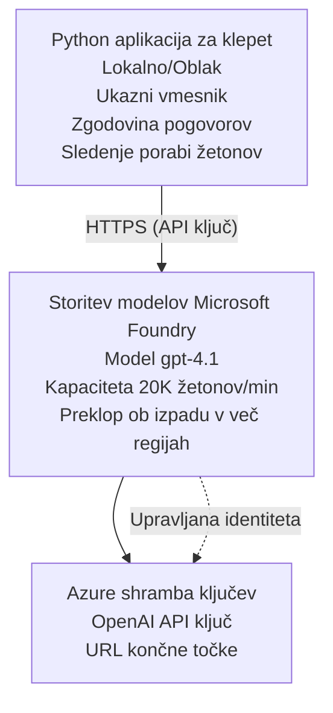

# Microsoft Foundry Models Chat aplikacija

**Učna pot:** Srednje zahtevno ⭐⭐ | **Čas:** 35-45 minut | **Strošek:** $50-200/mesec

Popolna Microsoft Foundry Models klepetalna aplikacija nameščena z uporabo Azure Developer CLI (azd). Ta primer prikazuje namestitev gpt-4.1, varovan dostop do API-ja in preprost vmesnik za klepet.

## 🎯 Kaj se boste naučili

- Namestiti Microsoft Foundry Models Service z modelom gpt-4.1
- Varnostno shraniti OpenAI API ključe v Key Vault
- Zgraditi preprost vmesnik za klepet v Pythonu
- Spremljati porabo tokenov in stroške
- Izvesti omejevanje hitrosti in ravnanje z napakami

## 📦 Kaj je vključeno

✅ **Microsoft Foundry Models Service** - namestitev modela gpt-4.1  
✅ **Python Chat App** - preprost vmesnik za klepet v ukazni vrstici  
✅ **Key Vault Integration** - varno shranjevanje API ključev  
✅ **ARM Templates** - popolna infrastruktura kot koda  
✅ **Cost Monitoring** - spremljanje porabe tokenov  
✅ **Rate Limiting** - preprečevanje izčrpavanja kvote  

## Architecture



## Predpogoji

### Zahtevano

- **Azure Developer CLI (azd)** - [Navodila za namestitev](https://learn.microsoft.com/azure/developer/azure-developer-cli/install-azd)
- **Azure subscription** s dostopom do OpenAI - [Zahtevaj dostop](https://aka.ms/oai/access)
- **Python 3.9+** - [Namestite Python](https://www.python.org/downloads/)

### Preverite predpogoje

```bash
# Preveri različico azd (potrebna je 1.5.0 ali novejša)
azd version

# Preveri prijavo v Azure
azd auth login

# Preveri različico Pythona
python --version  # ali python3 --version

# Preveri dostop do OpenAI (preveri v Azure Portalu)
az cognitiveservices account list-skus \
  --kind OpenAI \
  --location eastus
```

> **⚠️ Pomembno:** Microsoft Foundry Models zahteva odobritev vloge. Če se še niste prijavili, obiščite [aka.ms/oai/access](https://aka.ms/oai/access). Odobritev običajno traja 1–2 delovna dneva.

## ⏱️ Časovnica namestitve

| Phase | Duration | What Happens |
|-------|----------|--------------|
| Prerequisites check | 2-3 minutes | Preverite razpoložljivost kvote OpenAI |
| Deploy infrastructure | 8-12 minutes | Ustvarite OpenAI, Key Vault, namestitev modela |
| Configure application | 2-3 minutes | Nastavite okolje in odvisnosti |
| **Total** | **12-18 minutes** | Pripravljeno za pogovor z gpt-4.1 |

**Opomba:** Prva namestitev OpenAI lahko traja dlje zaradi zagotavljanja modela.

## Hitri začetek

```bash
# Pojdi do primera
cd examples/azure-openai-chat

# Inicializiraj okolje
azd env new myopenai

# Namesti vse (infrastruktura + konfiguracija)
azd up
# Bili boste pozvani, da:
# 1. Izberite Azure naročnino
# 2. Izberite lokacijo z razpoložljivostjo OpenAI (npr. eastus, eastus2, westus)
# 3. Počakajte 12-18 minut za razmestitev

# Namestite Python odvisnosti
pip install -r requirements.txt

# Začnite klepetati!
python chat.py
```

**Pričakovani izhod:**
```
🤖 Microsoft Foundry Models Chat Application
Connected to: gpt-4.1 (eastus)
Type your message (or 'quit' to exit)

You: Hello! Tell me about Microsoft Foundry Models.
Assistant: Microsoft Foundry Models Service provides REST API access to OpenAI's powerful language models including gpt-4.1, GPT-3.5-Turbo, and Embeddings...

[Tokens used: 145 | Estimated cost: $0.0044]
```

## ✅ Preverite namestitev

### 1. korak: Preverite Azure vire

```bash
# Ogled nameščenih virov
azd show

# Pričakovani izhod prikazuje:
# - Storitev OpenAI: (ime vira)
# - Skladišče ključev: (ime vira)
# - Namestitev: gpt-4.1
# - Lokacija: eastus (ali vaša izbrana regija)
```

### 2. korak: Preizkusite OpenAI API

```bash
# Pridobi OpenAI končno točko in ključ
OPENAI_ENDPOINT=$(azd env get-value AZURE_OPENAI_ENDPOINT)
OPENAI_KEY=$(azd env get-value AZURE_OPENAI_API_KEY)

# Preizkusi klic API-ja
curl "$OPENAI_ENDPOINT/openai/deployments/gpt-4.1/chat/completions?api-version=2024-08-01-preview" \
  -H "Content-Type: application/json" \
  -H "api-key: $OPENAI_KEY" \
  -d '{
    "messages": [{"role": "user", "content": "Say hello!"}],
    "max_tokens": 50
  }'
```

**Pričakovani odgovor:**
```json
{
  "choices": [
    {
      "message": {
        "role": "assistant",
        "content": "Hello! How can I assist you today?"
      }
    }
  ],
  "usage": {
    "prompt_tokens": 8,
    "completion_tokens": 9,
    "total_tokens": 17
  }
}
```

### 3. korak: Preverite dostop do Key Vault

```bash
# Naštejte skrivnosti v Key Vaultu
KV_NAME=$(azd env get-value AZURE_KEY_VAULT_NAME)

az keyvault secret list \
  --vault-name $KV_NAME \
  --query "[].name" \
  --output table
```

**Pričakovane skrivnosti:**
- `openai-api-key`
- `openai-endpoint`

**Kriteriji uspeha:**
- ✅ Storitev OpenAI nameščena z gpt-4.1
- ✅ Klic API vrne veljaven odgovor
- ✅ Skrivnosti shranjene v Key Vault
- ✅ Spremljanje porabe tokenov deluje

## Struktura projekta

```
azure-openai-chat/
├── README.md                   ✅ This guide
├── azure.yaml                  ✅ AZD configuration
├── infra/                      ✅ Infrastructure as Code
│   ├── main.bicep             ✅ Main Bicep template
│   ├── main.parameters.json   ✅ Parameters
│   └── openai.bicep           ✅ OpenAI resource definition
├── src/                        ✅ Application code
│   ├── chat.py                ✅ Chat interface
│   ├── config.py              ✅ Configuration loader
│   └── requirements.txt       ✅ Python dependencies
└── .gitignore                  ✅ Git ignore rules
```

## Značilnosti aplikacije

### Vmesnik za klepet (`chat.py`)

Klepetalna aplikacija vključuje:

- **Zgodovina pogovorov** - Ohranja kontekst med sporočili
- **Štetje tokenov** - Sledi porabi in ocenjuje stroške
- **Ravnanje z napakami** - Graceful obravnava omejitev zahtevkov in napak API
- **Ocena stroškov** - Izračun stroškov v realnem času na sporočilo
- **Podpora pretakanju** - Izbirni streaming odgovorov

### Ukazi

Med klepetom lahko uporabite:
- `quit` or `exit` - Končajte sejo
- `clear` - Počisti zgodovino pogovora
- `tokens` - Prikaži skupno porabo tokenov
- `cost` - Prikaži ocenjeno skupno ceno

### Konfiguracija (`config.py`)

Naloži konfiguracijo iz okoljskih spremenljivk:
```python
AZURE_OPENAI_ENDPOINT  # Iz Key Vaulta
AZURE_OPENAI_API_KEY   # Iz Key Vaulta
AZURE_OPENAI_MODEL     # Privzeto: gpt-4.1
AZURE_OPENAI_MAX_TOKENS # Privzeto: 800
```

## Primeri uporabe

### Osnovni klepet

```bash
python chat.py
```

### Klepet z lastnim modelom

```bash
export AZURE_OPENAI_MODEL=gpt-35-turbo
python chat.py
```

### Klepet s pretakanjem

```bash
python chat.py --stream
```

### Primer pogovora

```
You: Explain Microsoft Foundry Models Service in 3 sentences.
Assistant: Microsoft Foundry Models Service is Microsoft Azure's cloud platform offering 
that provides access to OpenAI's powerful language models. It enables developers 
to integrate capabilities like gpt-4.1 into their applications with enterprise-grade 
security and compliance. The service includes features for content filtering, 
abuse monitoring, and responsible AI practices.

[Tokens used: 89 | Estimated cost: $0.0027]

You: What models are available?
Assistant: Microsoft Foundry Models Service offers several model families including gpt-4.1 
(most capable), GPT-3.5-Turbo (faster and cost-effective), and Embeddings models 
for vector search. Each model has different capabilities, pricing, and token limits.

[Tokens used: 67 | Estimated cost: $0.0020]

Total session: 156 tokens | $0.0047
```

## Upravljanje stroškov

### Cene tokenov (gpt-4.1)

| Model | Vhod (per 1K tokens) | Izhod (per 1K tokens) |
|-------|----------------------|------------------------|
| gpt-4.1 | $0.03 | $0.06 |
| GPT-3.5-Turbo | $0.0015 | $0.002 |

### Ocenjeni mesečni stroški

Na podlagi vzorcev uporabe:

| Usage Level | Messages/Day | Tokens/Day | Monthly Cost |
|-------------|--------------|------------|--------------|
| **Light** | 20 messages | 3,000 tokens | $3-5 |
| **Moderate** | 100 messages | 15,000 tokens | $15-25 |
| **Heavy** | 500 messages | 75,000 tokens | $75-125 |

**Osnovni strošek infrastrukture:** $1-2/mesec (Key Vault + minimalni računalniški viri)

### Nasveti za optimizacijo stroškov

```bash
# 1. Uporabite GPT-3.5-Turbo za enostavnejša opravila (20× ceneje)
export AZURE_OPENAI_MODEL=gpt-35-turbo

# 2. Zmanjšajte največje število žetonov za krajše odgovore
export AZURE_OPENAI_MAX_TOKENS=400

# 3. Spremljajte porabo žetonov
python chat.py --show-tokens

# 4. Nastavite opozorila o proračunu
az consumption budget create \
  --budget-name "openai-budget" \
  --amount 50 \
  --time-grain Monthly
```

## Spremljanje

### Ogled porabe tokenov

```bash
# V Azure portalu:
# OpenAI vir → Meritve → Izberite "Transakcija žetonov"

# Ali prek Azure CLI:
az monitor metrics list \
  --resource $(azd env get-value AZURE_OPENAI_RESOURCE_ID) \
  --metric "TokenTransaction" \
  --start-time $(date -u -d '1 hour ago' '+%Y-%m-%dT%H:%M:%S') \
  --interval PT1M
```

### Ogled dnevnikov API

```bash
# Pretakanje diagnostičnih dnevnikov
az monitor diagnostic-settings create \
  --resource $(azd env get-value AZURE_OPENAI_RESOURCE_ID) \
  --name openai-logs \
  --logs '[{"category": "Audit", "enabled": true}]' \
  --workspace $(azd env get-value LOG_ANALYTICS_WORKSPACE_ID)

# Dnevniki poizvedb
az monitor log-analytics query \
  --workspace $(azd env get-value LOG_ANALYTICS_WORKSPACE_ID) \
  --analytics-query "AzureDiagnostics | where Category == 'Audit' | top 10 by TimeGenerated"
```

## Odpravljanje težav

### Težava: "Access Denied" napaka

**Simptomi:** 403 Forbidden pri klicu API

**Rešitve:**
```bash
# 1. Preverite, ali je dostop do OpenAI odobren
az cognitiveservices account show \
  --name $(azd env get-value AZURE_OPENAI_NAME) \
  --resource-group $(azd env get-value AZURE_RESOURCE_GROUP)

# 2. Preverite, ali je API ključ pravilen
azd env get-value AZURE_OPENAI_API_KEY

# 3. Preverite format URL-ja končne točke
azd env get-value AZURE_OPENAI_ENDPOINT
# Mora biti: https://[name].openai.azure.com/
```

### Težava: "Rate Limit Exceeded"

**Simptomi:** 429 Too Many Requests

**Rešitve:**
```bash
# 1. Preverite trenutno kvoto
az cognitiveservices account deployment show \
  --name $(azd env get-value AZURE_OPENAI_NAME) \
  --resource-group $(azd env get-value AZURE_RESOURCE_GROUP) \
  --deployment-name gpt-4.1

# 2. Zahtevajte povečanje kvote (če je potrebno)
# Pojdite v Azure Portal → OpenAI vir → Kvote → Zahtevajte povečanje

# 3. Implementirajte logiko ponovnih poskusov (že v chat.py)
# Aplikacija samodejno ponavlja poskuse z eksponentnim zamikom
```

### Težava: "Model Not Found"

**Simptomi:** 404 error for deployment

**Rešitve:**
```bash
# 1. Naštej razpoložljive razmestitve
az cognitiveservices account deployment list \
  --name $(azd env get-value AZURE_OPENAI_NAME) \
  --resource-group $(azd env get-value AZURE_RESOURCE_GROUP)

# 2. Preveri ime modela v okolju
echo $AZURE_OPENAI_MODEL

# 3. Posodobi na pravilno ime razmestitve
export AZURE_OPENAI_MODEL=gpt-4.1  # ali gpt-35-turbo
```

### Težava: Visoka latenca

**Simptomi:** Počasen odziv (>5 sekund)

**Rešitve:**
```bash
# 1. Preverite regionalno zakasnitev
# Razporedite v regijo, najbližjo uporabnikom

# 2. Zmanjšajte max_tokens za hitrejše odgovore
export AZURE_OPENAI_MAX_TOKENS=400

# 3. Uporabite pretakanje za boljšo uporabniško izkušnjo
python chat.py --stream
```

## Najboljše varnostne prakse

### 1. Zaščitite API ključe

```bash
# Ključev nikoli ne vključujte v sistem za nadzor različic
# Uporabite Key Vault (že konfigurirano)

# Redno menjajte ključe
az cognitiveservices account keys regenerate \
  --name $(azd env get-value AZURE_OPENAI_NAME) \
  --resource-group $(azd env get-value AZURE_RESOURCE_GROUP) \
  --key-name key1
```

### 2. Uvedite filtriranje vsebine

```python
# Microsoft Foundry Models vključuje vgrajeno filtriranje vsebin
# Konfigurirajte v portalu Azure:
# OpenAI vir → Filtri vsebine → Ustvari prilagojen filter

# Kategorije: Sovraštvo, Seksualno, Nasilje, Samopoškodovanje
# Ravni filtriranja: Nizko, Srednje, Visoko
```

### 3. Uporabite upravljano identiteto (produkcija)

```bash
# Za produkcijske namestitve uporabite upravljano identiteto
# namesto API ključev (zahteva gostovanje aplikacije na Azure)

# Posodobite infra/openai.bicep, da vključuje:
# identity: { type: 'SystemAssigned' }
```

## Razvoj

### Zaženite lokalno

```bash
# Namestite odvisnosti
pip install -r src/requirements.txt

# Nastavite spremenljivke okolja
export AZURE_OPENAI_ENDPOINT="https://[name].openai.azure.com/"
export AZURE_OPENAI_API_KEY="your-api-key"
export AZURE_OPENAI_MODEL="gpt-4.1"

# Zaženite aplikacijo
python src/chat.py
```

### Zaženite teste

```bash
# Namesti odvisnosti za teste
pip install pytest pytest-cov

# Zaženi teste
pytest tests/ -v

# Z merjenjem pokritosti kode
pytest tests/ --cov=src --cov-report=html
```

### Posodobite namestitev modela

```bash
# Razporedi drugo različico modela
az cognitiveservices account deployment create \
  --name $(azd env get-value AZURE_OPENAI_NAME) \
  --resource-group $(azd env get-value AZURE_RESOURCE_GROUP) \
  --deployment-name gpt-35-turbo \
  --model-name gpt-35-turbo \
  --model-version "0613" \
  --model-format OpenAI \
  --sku-capacity 20 \
  --sku-name "Standard"
```

## Čiščenje

```bash
# Izbriši vse vire v Azure
azd down --force --purge

# To odstrani:
# - Storitev OpenAI
# - Key Vault (z 90-dnevnim mehkim izbrisom)
# - Skupina virov
# - Vse namestitve in konfiguracije
```

## Naslednji koraki

### Razširite ta primer

1. **Dodajte spletni vmesnik** - Zgradite React/Vue frontend
   ```bash
   # Dodaj frontend storitev v azure.yaml
   # Objavi v Azure Static Web Apps
   ```

2. **Implementirajte RAG** - Dodajte iskanje dokumentov z Azure AI Search
   ```python
   # Integrirajte Azure AI Search
   # Naložite dokumente in ustvarite vektorski indeks
   ```

3. **Dodajte klice funkcij** - Omogočite uporabo orodij
   ```python
   # Definirajte funkcije v datoteki chat.py
   # Naj gpt-4.1 kliče zunanje API-je
   ```

4. **Podpora več modelov** - Namestite več modelov
   ```bash
   # Dodaj gpt-35-turbo in modele za embeddings
   # Implementiraj logiko usmerjanja modelov
   ```

### Sorodni primeri

- **[Retail Multi-Agent](../retail-scenario.md)** - Napredna arhitektura z več agenti
- **[Database App](../../../../examples/database-app)** - Dodajte trajno shrambo
- **[Container Apps](../../../../examples/container-app)** - Namestite kot vsebnike storitev

### Viri za učenje

- 📚 [Tečaj AZD za začetnike](../../README.md) - Glavna stran tečaja
- 📚 [Dokumentacija Microsoft Foundry Models](https://learn.microsoft.com/azure/ai-services/openai/) - Uradna dokumentacija
- 📚 [OpenAI API Reference](https://platform.openai.com/docs/api-reference) - Podrobnosti API-ja
- 📚 [Responsible AI](https://www.microsoft.com/ai/responsible-ai) - Najboljše prakse

## Dodatni viri

### Dokumentacija
- **[Microsoft Foundry Models Service](https://learn.microsoft.com/azure/ai-services/openai/)** - Celovit vodnik
- **[gpt-4.1 Models](https://learn.microsoft.com/azure/ai-services/openai/concepts/models)** - Zmožnosti modela
- **[Content Filtering](https://learn.microsoft.com/azure/ai-services/openai/concepts/content-filter)** - Varnostne funkcije
- **[Azure Developer CLI](https://learn.microsoft.com/azure/developer/azure-developer-cli/)** - Referenca azd

### Vodiči
- **[OpenAI Quickstart](https://learn.microsoft.com/azure/ai-services/openai/quickstart)** - Prva namestitev
- **[Chat Completions](https://learn.microsoft.com/azure/ai-services/openai/how-to/chatgpt)** - Gradnja klepetalnih aplikacij
- **[Function Calling](https://learn.microsoft.com/azure/ai-services/openai/how-to/function-calling)** - Napredne funkcije

### Orodja
- **[Microsoft Foundry Models Studio](https://oai.azure.com/)** - Spletno igrišče
- **[Prompt Engineering Guide](https://platform.openai.com/docs/guides/prompt-engineering)** - Pisanje boljših pozivov
- **[Token Calculator](https://platform.openai.com/tokenizer)** - Ocenite porabo tokenov

### Skupnost
- **[Azure AI Discord](https://discord.gg/azure)** - Pridobite pomoč skupnosti
- **[GitHub Discussions](https://github.com/Azure-Samples/openai/discussions)** - Forum vprašanj in odgovorov
- **[Azure Blog](https://azure.microsoft.com/blog/tag/azure-openai-service/)** - Zadnje posodobitve

---

**🎉 Uspeh!** Namestili ste Microsoft Foundry Models in zgradili delujočo klepetalno aplikacijo. Začnite raziskovati zmogljivosti gpt-4.1 in eksperimentirajte z različnimi pozivi in primeri uporabe.

**Vprašanja?** [Odprite issue](https://github.com/microsoft/AZD-for-beginners/issues) ali preverite [FAQ](../../resources/faq.md)

**Opozorilo glede stroškov:** Ne pozabite zagnati `azd down`, ko končate s testiranjem, da se izognete tekočim stroškom (~$50-100/mesec za aktivno uporabo).

---

<!-- CO-OP TRANSLATOR DISCLAIMER START -->
**Omejitev odgovornosti**:
Ta dokument je bil preveden z uporabo AI prevajalske storitve [Co-op Translator](https://github.com/Azure/co-op-translator). Čeprav si prizadevamo za natančnost, vas prosimo, da upoštevate, da avtomatizirani prevodi lahko vsebujejo napake ali netočnosti. Izvirni dokument v njegovem izvirnem jeziku je treba obravnavati kot avtoritativni vir. Za kritične informacije je priporočljiv strokovni človeški prevod. Ne odgovarjamo za morebitna nesporazume ali napačne interpretacije, ki izhajajo iz uporabe tega prevoda.
<!-- CO-OP TRANSLATOR DISCLAIMER END -->