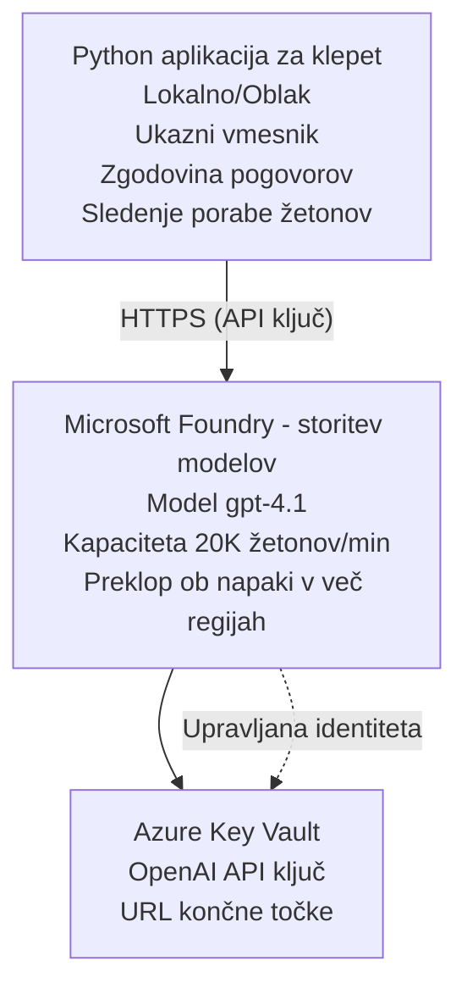

# Microsoft Foundry Models klepetalna aplikacija

**Pot učenja:** Srednja stopnja ⭐⭐ | **Čas:** 35-45 minut | **Strošek:** $50-200/mesec

Popolna Microsoft Foundry Models klepetalna aplikacija nameščena z uporabo Azure Developer CLI (azd). Ta primer prikazuje uvajanje gpt-4.1, varnostni dostop do API-ja in preprost klepetalni vmesnik.

## 🎯 Česa se boste naučili

- Uvesti Microsoft Foundry Models Service z modelom gpt-4.1
- Varno shranjevati OpenAI API ključe v Key Vault
- Zgraditi preprost klepetalni vmesnik v Pythonu
- Spremljati porabo tokenov in stroške
- Uvesti omejevanje hitrosti in obravnavo napak

## 📦 Kaj je vključeno

✅ **Microsoft Foundry Models Service** - uvajanje modela gpt-4.1  
✅ **Python klepetalna aplikacija** - preprost vmesnik v ukazni vrstici  
✅ **Integracija s Key Vault** - varno shranjevanje API ključev  
✅ **ARM predloge** - popolna infrastruktura kot koda  
✅ **Spremljanje stroškov** - sledenje porabi tokenov  
✅ **Omejevanje hitrosti** - preprečevanje izpraznitve kvot  

## Arhitektura


## Predpogoji

### Zahtevano

- **Azure Developer CLI (azd)** - [Namestitveni vodnik](https://learn.microsoft.com/azure/developer/azure-developer-cli/install-azd)
- **Azure naročnina** z dostopom do OpenAI - [Zahtevajte dostop](https://aka.ms/oai/access)
- **Python 3.9+** - [Namestite Python](https://www.python.org/downloads/)

### Preverite predpogoje

```bash
# Preveri različico azd (potrebna je 1.5.0 ali novejša)
azd version

# Preveri prijavo v Azure
azd auth login

# Preveri različico Pythona
python --version  # ali python3 --version

# Preveri dostop do OpenAI (preveri v Azure Portalu)
az cognitiveservices account list-skus \
  --kind OpenAI \
  --location eastus
```

> **⚠️ Pomembno:** Microsoft Foundry Models zahteva odobritev vloge. Če še niste zaprosili, obiščite [aka.ms/oai/access](https://aka.ms/oai/access). Odobritev običajno traja 1–2 delovna dneva.

## ⏱️ Časovni okvir namestitve

| Faza | Trajanje | Kaj se zgodi |
|-------|----------|--------------|
| Preverjanje predpogojev | 2-3 minute | Preverite razpoložljivost kvote OpenAI |
| Namestitev infrastrukture | 8-12 minut | Ustvari OpenAI, Key Vault, uvajanje modela |
| Konfiguracija aplikacije | 2-3 minute | Nastavitev okolja in odvisnosti |
| **Skupaj** | **12-18 minut** | Pripravljeno za klepet z gpt-4.1 |

**Opomba:** Prvo uvajanje OpenAI lahko traja dlje zaradi zagotavljanja modela.

## Hiter začetek

```bash
# Pojdite do primera
cd examples/azure-openai-chat

# Inicializirajte okolje
azd env new myopenai

# Namestite vse (infrastrukturo + konfiguracijo)
azd up
# Pozvani boste, da:
# 1. Izberite Azure naročnino
# 2. Izberite lokacijo, kjer je na voljo OpenAI (npr. eastus, eastus2, westus)
# 3. Počakajte 12–18 minut za namestitev

# Namestite odvisnosti Pythona
pip install -r requirements.txt

# Začnite klepet!
python chat.py
```

**Pričakovani izhod:**
```
🤖 Microsoft Foundry Models Chat Application
Connected to: gpt-4.1 (eastus)
Type your message (or 'quit' to exit)

You: Hello! Tell me about Microsoft Foundry Models.
Assistant: Microsoft Foundry Models Service provides REST API access to OpenAI's powerful language models including gpt-4.1, GPT-3.5-Turbo, and Embeddings...

[Tokens used: 145 | Estimated cost: $0.0044]
```

## ✅ Preverite namestitev

### Korak 1: Preverite Azure vire

```bash
# Ogled nameščenih virov
azd show

# Pričakovani izhod prikazuje:
# - OpenAI storitev: (ime vira)
# - Skladišče ključev: (ime vira)
# - Namestitev: gpt-4.1
# - Lokacija: eastus (ali vaša izbrana regija)
```

### Korak 2: Preizkusite OpenAI API

```bash
# Pridobi OpenAI končno točko in ključ
OPENAI_ENDPOINT=$(azd env get-value AZURE_OPENAI_ENDPOINT)
OPENAI_KEY=$(azd env get-value AZURE_OPENAI_API_KEY)

# Preizkusi klic API
curl "$OPENAI_ENDPOINT/openai/deployments/gpt-4.1/chat/completions?api-version=2024-08-01-preview" \
  -H "Content-Type: application/json" \
  -H "api-key: $OPENAI_KEY" \
  -d '{
    "messages": [{"role": "user", "content": "Say hello!"}],
    "max_tokens": 50
  }'
```

**Pričakovani odziv:**
```json
{
  "choices": [
    {
      "message": {
        "role": "assistant",
        "content": "Hello! How can I assist you today?"
      }
    }
  ],
  "usage": {
    "prompt_tokens": 8,
    "completion_tokens": 9,
    "total_tokens": 17
  }
}
```

### Korak 3: Preverite dostop do Key Vault

```bash
# Našteti skrivnosti v Key Vault
KV_NAME=$(azd env get-value AZURE_KEY_VAULT_NAME)

az keyvault secret list \
  --vault-name $KV_NAME \
  --query "[].name" \
  --output table
```

**Pričakovane skrivnosti:**
- `openai-api-key`
- `openai-endpoint`

**Kriteriji uspeha:**
- ✅ OpenAI storitev nameščena z gpt-4.1
- ✅ Klic API-ja vrne veljavno dopolnitev
- ✅ Skrivnosti shranjene v Key Vault
- ✅ Sledenje porabi tokenov deluje

## Struktura projekta

```
azure-openai-chat/
├── README.md                   ✅ This guide
├── azure.yaml                  ✅ AZD configuration
├── infra/                      ✅ Infrastructure as Code
│   ├── main.bicep             ✅ Main Bicep template
│   ├── main.parameters.json   ✅ Parameters
│   └── openai.bicep           ✅ OpenAI resource definition
├── src/                        ✅ Application code
│   ├── chat.py                ✅ Chat interface
│   ├── config.py              ✅ Configuration loader
│   └── requirements.txt       ✅ Python dependencies
└── .gitignore                  ✅ Git ignore rules
```

## Funkcionalnosti aplikacije

### Vmesnik za klepet (`chat.py`)

Klepetalna aplikacija vključuje:

- **Zgodovina pogovorov** - Ohranja kontekst med sporočili
- **Štetje tokenov** - Sledi porabi in ocenjuje stroške
- **Obravnava napak** - Nežno obravnava omejitve hitrosti in napake API-ja
- **Ocena stroškov** - Izračun stroškov v realnem času na sporočilo
- **Podpora pretakanju** - Opcijsko pretakanje odgovorov

### Ukazi

Med klepetom lahko uporabite:
- `quit` or `exit` - Zaključi sejo
- `clear` - Počisti zgodovino pogovora
- `tokens` - Prikaže skupno porabo tokenov
- `cost` - Prikaže ocenjeni skupni strošek

### Konfiguracija (`config.py`)

Naloži konfiguracijo iz okolijskih spremenljivk:
```python
AZURE_OPENAI_ENDPOINT  # Iz Key Vaulta
AZURE_OPENAI_API_KEY   # Iz Key Vaulta
AZURE_OPENAI_MODEL     # Privzeto: gpt-4.1
AZURE_OPENAI_MAX_TOKENS # Privzeto: 800
```

## Primeri uporabe

### Osnovni klepet

```bash
python chat.py
```

### Klepet z lastnim modelom

```bash
export AZURE_OPENAI_MODEL=gpt-35-turbo
python chat.py
```

### Klepet s pretakanjem

```bash
python chat.py --stream
```

### Primer pogovora

```
You: Explain Microsoft Foundry Models Service in 3 sentences.
Assistant: Microsoft Foundry Models Service is Microsoft Azure's cloud platform offering 
that provides access to OpenAI's powerful language models. It enables developers 
to integrate capabilities like gpt-4.1 into their applications with enterprise-grade 
security and compliance. The service includes features for content filtering, 
abuse monitoring, and responsible AI practices.

[Tokens used: 89 | Estimated cost: $0.0027]

You: What models are available?
Assistant: Microsoft Foundry Models Service offers several model families including gpt-4.1 
(most capable), GPT-3.5-Turbo (faster and cost-effective), and Embeddings models 
for vector search. Each model has different capabilities, pricing, and token limits.

[Tokens used: 67 | Estimated cost: $0.0020]

Total session: 156 tokens | $0.0047
```

## Upravljanje stroškov

### Cene tokenov (gpt-4.1)

| Model | Vhod (na 1K tokenov) | Izhod (na 1K tokenov) |
|-------|----------------------|------------------------|
| gpt-4.1 | $0.03 | $0.06 |
| GPT-3.5-Turbo | $0.0015 | $0.002 |

### Ocenjeni mesečni stroški

Glede na vzorce uporabe:

| Stopnja uporabe | Sporočila/dan | Tokeni/dan | Mesečni strošek |
|-------------|--------------|------------|--------------|
| **Nizka** | 20 sporočil | 3,000 tokenov | $3-5 |
| **Zmerna** | 100 sporočil | 15,000 tokenov | $15-25 |
| **Visoka** | 500 sporočil | 75,000 tokenov | $75-125 |

**Osnovni strošek infrastrukture:** $1-2/mesec (Key Vault + minimalni računski viri)

### Nasveti za optimizacijo stroškov

```bash
# 1. Uporabite GPT-3.5-Turbo za preprostejše naloge (20-krat ceneje)
export AZURE_OPENAI_MODEL=gpt-35-turbo

# 2. Zmanjšajte največje število tokenov za krajše odgovore
export AZURE_OPENAI_MAX_TOKENS=400

# 3. Spremljajte uporabo tokenov
python chat.py --show-tokens

# 4. Nastavite proračunska opozorila
az consumption budget create \
  --budget-name "openai-budget" \
  --amount 50 \
  --time-grain Monthly
```

## Nadzor

### Ogled porabe tokenov

```bash
# V portalu Azure:
# Sredstvo OpenAI → Meritve → Izberite "Token Transaction"

# Ali prek Azure CLI:
az monitor metrics list \
  --resource $(azd env get-value AZURE_OPENAI_RESOURCE_ID) \
  --metric "TokenTransaction" \
  --start-time $(date -u -d '1 hour ago' '+%Y-%m-%dT%H:%M:%S') \
  --interval PT1M
```

### Ogled dnevnikov API

```bash
# Pretakanje diagnostičnih dnevnikov
az monitor diagnostic-settings create \
  --resource $(azd env get-value AZURE_OPENAI_RESOURCE_ID) \
  --name openai-logs \
  --logs '[{"category": "Audit", "enabled": true}]' \
  --workspace $(azd env get-value LOG_ANALYTICS_WORKSPACE_ID)

# Dnevniki poizvedb
az monitor log-analytics query \
  --workspace $(azd env get-value LOG_ANALYTICS_WORKSPACE_ID) \
  --analytics-query "AzureDiagnostics | where Category == 'Audit' | top 10 by TimeGenerated"
```

## Odpravljanje težav

### Težava: "Access Denied" napaka

**Simptomi:** 403 Forbidden pri klicu API-ja

**Rešitve:**
```bash
# 1. Preverite, ali je dostop do OpenAI odobren
az cognitiveservices account show \
  --name $(azd env get-value AZURE_OPENAI_NAME) \
  --resource-group $(azd env get-value AZURE_RESOURCE_GROUP)

# 2. Preverite, ali je API ključ pravilen
azd env get-value AZURE_OPENAI_API_KEY

# 3. Preverite format URL-ja končne točke
azd env get-value AZURE_OPENAI_ENDPOINT
# Mora biti: https://[name].openai.azure.com/
```

### Težava: "Rate Limit Exceeded"

**Simptomi:** 429 Too Many Requests

**Rešitve:**
```bash
# 1. Preverite trenutno kvoto
az cognitiveservices account deployment show \
  --name $(azd env get-value AZURE_OPENAI_NAME) \
  --resource-group $(azd env get-value AZURE_RESOURCE_GROUP) \
  --deployment-name gpt-4.1

# 2. Zahtevajte povečanje kvote (če je potrebno)
# Pojdite v Azure Portal → OpenAI vir → Kvote → Zahtevajte povečanje

# 3. Implementirajte logiko ponovnih poizkusov (že v chat.py)
# Aplikacija samodejno ponavlja poskuse z eksponentnim zamikom med poskusi
```

### Težava: "Model Not Found"

**Simptomi:** 404 napaka za uvajanje

**Rešitve:**
```bash
# 1. Prikaži razpoložljive namestitve
az cognitiveservices account deployment list \
  --name $(azd env get-value AZURE_OPENAI_NAME) \
  --resource-group $(azd env get-value AZURE_RESOURCE_GROUP)

# 2. Preveri ime modela v okolju
echo $AZURE_OPENAI_MODEL

# 3. Posodobi na pravilno ime namestitve
export AZURE_OPENAI_MODEL=gpt-4.1  # ali gpt-35-turbo
```

### Težava: Visoka zakasnitev

**Simptomi:** Počasni odzivi (>5 sekund)

**Rešitve:**
```bash
# 1. Preverite regionalno zakasnitev
# Namestite v regijo, najbližjo uporabnikom

# 2. Zmanjšajte max_tokens za hitrejše odgovore
export AZURE_OPENAI_MAX_TOKENS=400

# 3. Uporabite pretakanje za boljšo uporabniško izkušnjo
python chat.py --stream
```

## Najboljše varnostne prakse

### 1. Zaščitite API ključe

```bash
# Nikoli ne shranjujte ključev v sistem za nadzor različic
# Uporabite Key Vault (že konfigurirano)

# Ključe redno zamenjajte
az cognitiveservices account keys regenerate \
  --name $(azd env get-value AZURE_OPENAI_NAME) \
  --resource-group $(azd env get-value AZURE_RESOURCE_GROUP) \
  --key-name key1
```

### 2. Uvedite filtriranje vsebine

```python
# Microsoft Foundry Models vključuje vgrajeno filtriranje vsebine
# Konfigurirajte v Azure portalu:
# OpenAI vir → Filtri vsebine → Ustvari prilagojen filter

# Kategorije: Sovražni govor, Seksualno, Nasilje, Samopoškodovanje
# Ravni: nizka, srednja, visoka stopnja filtriranja
```

### 3. Uporabite upravljano identiteto (produkcija)

```bash
# Za proizvodne namestitve uporabite upravljano identiteto
# namesto API ključev (zahteva gostovanje aplikacije na Azure)

# Posodobite infra/openai.bicep, da vključuje:
# identity: { type: 'SystemAssigned' }
```

## Razvoj

### Zaženite lokalno

```bash
# Namestite odvisnosti
pip install -r src/requirements.txt

# Nastavite spremenljivke okolja
export AZURE_OPENAI_ENDPOINT="https://[name].openai.azure.com/"
export AZURE_OPENAI_API_KEY="your-api-key"
export AZURE_OPENAI_MODEL="gpt-4.1"

# Zaženite aplikacijo
python src/chat.py
```

### Zaženite teste

```bash
# Namesti odvisnosti za teste
pip install pytest pytest-cov

# Zaženi teste
pytest tests/ -v

# Z merjenjem pokritosti kode
pytest tests/ --cov=src --cov-report=html
```

### Posodobite nameščanje modela

```bash
# Razmestite drugo različico modela
az cognitiveservices account deployment create \
  --name $(azd env get-value AZURE_OPENAI_NAME) \
  --resource-group $(azd env get-value AZURE_RESOURCE_GROUP) \
  --deployment-name gpt-35-turbo \
  --model-name gpt-35-turbo \
  --model-version "0613" \
  --model-format OpenAI \
  --sku-capacity 20 \
  --sku-name "Standard"
```

## Čiščenje

```bash
# Izbriši vse Azure vire
azd down --force --purge

# To odstrani:
# - Storitev OpenAI
# - Key Vault (z 90-dnevnim mehkim brisanjem)
# - Skupina virov
# - Vse uvajanja in konfiguracije
```

## Naslednji koraki

### Razširite ta primer

1. **Dodajte spletni vmesnik** - Zgradite frontend v React/Vue
   ```bash
   # Dodaj frontend storitev v azure.yaml
   # Objavi v Azure Static Web Apps
   ```

2. **Uvedite RAG** - Dodajte iskanje po dokumentih z Azure AI Search
   ```python
   # Integrirajte Azure Cognitive Search
   # Naložite dokumente in ustvarite vektorski indeks
   ```

3. **Dodajte klicanje funkcij** - Omogočite uporabo orodij
   ```python
   # Definirajte funkcije v chat.py
   # Dovolite, da gpt-4.1 kliče zunanje API-je
   ```

4. **Podpora več modelov** - Uvedite več modelov
   ```bash
   # Dodaj gpt-35-turbo in modele za vdelave
   # Implementiraj logiko usmerjanja modelov
   ```

### Sorodni primeri

- **[Večagentni primer za maloprodajo](../retail-scenario.md)** - Napredna večagentna arhitektura
- **[Aplikacija z bazo podatkov](../../../../examples/database-app)** - Dodajte trajno shrambo
- **[Kontejnerske aplikacije](../../../../examples/container-app)** - Uvedite kot storitev v kontejnerjih

### Viri za učenje

- 📚 [Tečaj AZD za začetnike](../../README.md) - Glavni dom tečaja
- 📚 [Dokumentacija Microsoft Foundry Models](https://learn.microsoft.com/azure/ai-services/openai/) - Uradna dokumentacija
- 📚 [Referenca OpenAI API](https://platform.openai.com/docs/api-reference) - Podrobnosti API-ja
- 📚 [Odgovorna umetna inteligenca](https://www.microsoft.com/ai/responsible-ai) - Najboljše prakse

## Dodatni viri

### Dokumentacija
- **[Microsoft Foundry Models Service](https://learn.microsoft.com/azure/ai-services/openai/)** - Popoln vodnik
- **[Modeli gpt-4.1](https://learn.microsoft.com/azure/ai-services/openai/concepts/models)** - Zmožnosti modela
- **[Filtriranje vsebine](https://learn.microsoft.com/azure/ai-services/openai/concepts/content-filter)** - Varnostne funkcije
- **[Azure Developer CLI](https://learn.microsoft.com/azure/developer/azure-developer-cli/)** - Referenca azd

### Vadnice
- **[Hitri začetek OpenAI](https://learn.microsoft.com/azure/ai-services/openai/quickstart)** - Prvo uvajanje
- **[Dopolnitve klepeta](https://learn.microsoft.com/azure/ai-services/openai/how-to/chatgpt)** - Gradnja klepetalnih aplikacij
- **[Klicanje funkcij](https://learn.microsoft.com/azure/ai-services/openai/how-to/function-calling)** - Napredne funkcije

### Orodja
- **[Microsoft Foundry Models Studio](https://oai.azure.com/)** - Spletno okolje za preizkušanje
- **[Vodnik za oblikovanje pozivov](https://platform.openai.com/docs/guides/prompt-engineering)** - Pisanje boljših pozivov
- **[Kalkulator tokenov](https://platform.openai.com/tokenizer)** - Ocenite porabo tokenov

### Skupnost
- **[Azure AI Discord](https://discord.gg/azure)** - Pomoč skupnosti
- **[Razprave na GitHubu](https://github.com/Azure-Samples/openai/discussions)** - Forum za vprašanja in odgovore
- **[Azure Blog](https://azure.microsoft.com/blog/tag/azure-openai-service/)** - Najnovejše novice

---

**🎉 Čestitamo!** Namestili ste Microsoft Foundry Models in zgradili delujočo klepetalno aplikacijo. Začnite raziskovati zmogljivosti gpt-4.1 in eksperimentirajte z različnimi pozivi in primeri uporabe.

**Vprašanja?** [Odprite težavo](https://github.com/microsoft/AZD-for-beginners/issues) ali preverite [FAQ](../../resources/faq.md)

**Opozorilo glede stroškov:** Ne pozabite zagnati `azd down` po končanem testiranju, da se izognete nadaljnjim stroškom (~$50-100/mesec pri aktivni uporabi).

---

<!-- CO-OP TRANSLATOR DISCLAIMER START -->
**Izjava o omejitvi odgovornosti**:
Ta dokument je bil preveden z uporabo storitve za prevajanje z umetno inteligenco [Co-op Translator](https://github.com/Azure/co-op-translator). Čeprav si prizadevamo za natančnost, upoštevajte, da avtomatizirani prevodi lahko vsebujejo napake ali netočnosti. Izvirni dokument v izvirnem jeziku velja za zavezujoči vir. Za kritične informacije priporočamo strokovni človeški prevod. Nismo odgovorni za kakršne koli nesporazume ali napačne interpretacije, ki izhajajo iz uporabe tega prevoda.
<!-- CO-OP TRANSLATOR DISCLAIMER END -->