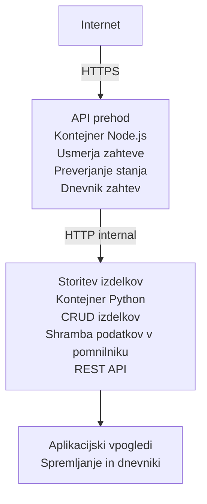

# Microservices Architecture - Container App Example

⏱️ **Ocenjeni čas**: 25-35 minut | 💰 **Ocenjeni stroški**: ~$50-100/mesec | ⭐ **Kompleksnost**: Napredno

Poenostavljena, a funkcionalna mikroservisna arhitektura, nameščena v Azure Container Apps z uporabo AZD CLI. Ta primer prikazuje komunikacijo med storitvami, orkestracijo kontejnerjev in spremljanje s praktično postavitvijo z 2 storitvama.

> **📚 Pristop k učenju**: Ta primer se začne z minimalno arhitekturo z 2 storitvama (API Gateway + Backend Service), ki jo lahko dejansko namestite in se iz nje učite. Ko osvojite to osnovo, nudimo navodila za razširitev v poln mikroservisni ekosistem.

## Kaj se boste naučili

Z dokončanjem tega primera boste:
- Namestili več kontejnerjev v Azure Container Apps
- Implementirali komunikacijo med storitvami z interno mrežo
- Konfigurirali skaliranje na podlagi okolja in kontrole zdravja
- Spremljali distribuirane aplikacije z Application Insights
- Razumeli vzorce nameščanja mikroservisov in najboljše prakse
- Se naučili postopne razširitve od preproste do kompleksne arhitekture

## Arhitektura

### Faza 1: Kar gradimo (vključeno v ta primer)


**Zakaj začeti preprosto?**
- ✅ Hitro namestite in razumite (25-35 minut)
- ✅ Naučite se osnovnih vzorcev mikroservisov brez kompleksnosti
- ✅ Delujoča koda, ki jo lahko spreminjate in preizkušate
- ✅ Nižji stroški za učenje (~$50-100/mesec v primerjavi s $300-1400/mesec)
- ✅ Pridobite zaupanje, preden dodate podatkovne zbirke in vrstice sporočil

**Analogija**: Pomislite na to kot učenje vožnje. Začnete na praznem parkirišču (2 storitvi), osvojite osnove, nato nadaljujete v mestni promet (5+ storitev z bazami podatkov).

### Faza 2: Prihodnja razširitev (referenčna arhitektura)

Ko boste obvladali arhitekturo z 2 storitvama, jo lahko razširite na:

```
Full Architecture (Not Included - For Reference)
├── API Gateway (✅ Included)
├── Product Service (✅ Included)
├── Order Service (🔜 Add next)
├── User Service (🔜 Add next)
├── Notification Service (🔜 Add last)
├── Azure Service Bus (🔜 For async communication)
├── Cosmos DB (🔜 For product persistence)
├── Azure SQL (🔜 For order management)
└── Azure Storage (🔜 For file storage)
```

Glejte razdelek "Vodnik za razširitev" na koncu za korak za korakom navodila.

## Vključene funkcije

✅ **Odkritje storitev**: Samodejno DNS-odkrijevanje med kontejnerji  
✅ **Uravnoteženje obremenitve**: Vgrajeno uravnoteženje obremenitve med replikami  
✅ **Samodejno skaliranje**: Neodvisno skaliranje za vsako storitev na podlagi HTTP zahtevkov  
✅ **Spremljanje zdravja**: Liveness in readiness probe za obe storitvi  
✅ **Distribuirano beleženje**: Centralizirano beleženje z Application Insights  
✅ **Interna omrežja**: Varna komunikacija med storitvami  
✅ **Orkestracija kontejnerjev**: Samodejno nameščanje in skaliranje  
✅ **Posodobitve brez izpada**: Rolling updates z upravljanjem revizij  

## Predpogoji

### Zahtevana orodja

Pred začetkom preverite, ali imate nameščena ta orodja:

1. **[Azure Developer CLI (azd)](https://learn.microsoft.com/azure/developer/azure-developer-cli/install-azd)** (različica 1.0.0 ali novejša)
   ```bash
   azd version
   # Pričakovan izhod: azd različica 1.0.0 ali novejša
   ```

2. **[Azure CLI](https://learn.microsoft.com/cli/azure/install-azure-cli)** (različica 2.50.0 ali novejša)
   ```bash
   az --version
   # Pričakovani izhod: azure-cli 2.50.0 ali novejša
   ```

3. **[Docker](https://www.docker.com/get-started)** (za lokalni razvoj/testiranje - neobvezno)
   ```bash
   docker --version
   # Pričakovani izhod: Docker različica 20.10 ali novejša
   ```

### Zahteve za Azure

- Aktivna **Azure naročnina** ([ustvarite brezplačen račun](https://azure.microsoft.com/free/))
- Dovoljenja za ustvarjanje virov v vaši naročnini
- **Contributor** vloga na naročnini ali skupini virov

### Zahtevano predznanje

To je primer na **napredni ravni**. Morate:
- Dokončati [Preprost primer Flask API](../../../../../examples/container-app/simple-flask-api) 
- Imati osnovno razumevanje arhitekture mikroservisov
- Poznavati REST API-je in HTTP
- Razumevanje konceptov kontejnerjev

**Nov pri Container Apps?** Najprej začnite s [Preprost primer Flask API](../../../../../examples/container-app/simple-flask-api), da se naučite osnov.

## Hitri začetek (korak za korakom)

### Korak 1: Klonirajte in se premaknite

```bash
git clone https://github.com/microsoft/AZD-for-beginners.git
cd AZD-for-beginners/examples/container-app/microservices
```

**✓ Preverjanje uspeha**: Preverite, da vidite `azure.yaml`:
```bash
ls
# Pričakovano: README.md, azure.yaml, infra/, src/
```

### Korak 2: Avtentikacija z Azure

```bash
azd auth login
```

To odpre vaš brskalnik za Azure avtentikacijo. Prijavite se z vašimi Azure poverilnicami.

**✓ Preverjanje uspeha**: Videti bi morali:
```
Logged in to Azure.
```

### Korak 3: Inicializacija okolja

```bash
azd init
```

**Vprašanja, ki se bodo pojavila**:
- **Environment name**: Vnesite kratek ime (npr. `microservices-dev`)
- **Azure subscription**: Izberite vašo naročnino
- **Azure location**: Izberite regijo (npr. `eastus`, `westeurope`)

**✓ Preverjanje uspeha**: Videti bi morali:
```
SUCCESS: New project initialized!
```

### Korak 4: Namestitev infrastrukture in storitev

```bash
azd up
```

**Kaj se zgodi** (traja 8-12 minut):
1. Ustvari Container Apps okolje
2. Ustvari Application Insights za spremljanje
3. Zgradi API Gateway kontejner (Node.js)
4. Zgradi Product Service kontejner (Python)
5. Namesti oba kontejnerja v Azure
6. Konfigurira omrežje in probes za zdravje
7. Nastavi spremljanje in beleženje

**✓ Preverjanje uspeha**: Videti bi morali:
```
SUCCESS: Your application was deployed to Azure in X minutes Y seconds.
Endpoint: https://api-gateway-<unique-id>.azurecontainerapps.io
```

**⏱️ Čas**: 8-12 minut

### Korak 5: Preizkus namestitve

```bash
# Pridobi končno točko prehoda
GATEWAY_URL=$(azd env get-values | grep API_GATEWAY_URL | cut -d '=' -f2 | tr -d '"')

# Preizkusi zdravje API Gatewaya
curl $GATEWAY_URL/health

# Pričakovan izhod:
# {"status":"zdravo","service":"api-gateway","timestamp":"2025-11-19T10:30:00Z"}
```

**Preizkus Product Service prek API Gateway**:
```bash
# Seznam izdelkov
curl $GATEWAY_URL/api/products

# Pričakovani izhod:
# [
#   {"id":1,"name":"Laptop","price":999.99,"stock":50},
#   {"id":2,"name":"Mouse","price":29.99,"stock":200},
#   {"id":3,"name":"Keyboard","price":79.99,"stock":150}
# ]
```

**✓ Preverjanje uspeha**: Obe končni točki vrneta JSON podatke brez napak.

---

**🎉 Čestitamo!** Namestili ste mikroservisno arhitekturo v Azure!

## Struktura projekta

Vključene so vse implementacijske datoteke — to je popoln, delujoč primer:

```
microservices/
│
├── README.md                         # This file
├── azure.yaml                        # AZD configuration
├── .gitignore                        # Git ignore patterns
│
├── infra/                           # Infrastructure as Code (Bicep)
│   ├── main.bicep                   # Main orchestration
│   ├── abbreviations.json           # Naming conventions
│   ├── core/                        # Shared infrastructure
│   │   ├── container-apps-environment.bicep  # Container environment + registry
│   │   └── monitor.bicep            # Application Insights + Log Analytics
│   └── app/                         # Service definitions
│       ├── api-gateway.bicep        # API Gateway container app
│       └── product-service.bicep    # Product Service container app
│
└── src/                             # Application source code
    ├── api-gateway/                 # Node.js API Gateway
    │   ├── app.js                   # Express server with routing
    │   ├── package.json             # Node dependencies
    │   └── Dockerfile               # Container definition
    └── product-service/             # Python Product Service
        ├── main.py                  # Flask API with product data
        ├── requirements.txt         # Python dependencies
        └── Dockerfile               # Container definition
```

**Kaj počne vsaka komponenta:**

**Infrastructure (infra/)**:
- `main.bicep`: Orkestrira vse Azure vire in njihove odvisnosti
- `core/container-apps-environment.bicep`: Ustvari Container Apps okolje in Azure Container Registry
- `core/monitor.bicep`: Nastavi Application Insights za distribuirano beleženje
- `app/*.bicep`: Posamezne definicije container app z nastavitvami skaliranja in probes za zdravje

**API Gateway (src/api-gateway/)**:
- Javna storitev, ki usmerja zahteve do backend storitev
- Implementira beleženje, obravnavo napak in posredovanje zahtev
- Prikazuje HTTP komunikacijo med storitvami

**Product Service (src/product-service/)**:
- Interna storitev s katalogom izdelkov (v pomnilniku zaradi enostavnosti)
- REST API z kontrolami zdravja
- Primer vzorca backend mikroservisa

## Pregled storitev

### API Gateway (Node.js/Express)

**Vrata**: 8080  
**Dostop**: Javno (zunanji vhod)  
**Namen**: Usmerja dohodne zahteve do ustreznih backend storitev  

**Končne točke**:
- `GET /` - Podatki o storitvi
- `GET /health` - Endpoint za preverjanje zdravja
- `GET /api/products` - Posreduje zahtevo Product Service (pridobi seznam)
- `GET /api/products/:id` - Posreduje zahtevo Product Service (pridobi po ID)

**Ključne funkcije**:
- Usmerjanje zahtev z axios
- Centralizirano beleženje
- Obravnava napak in upravljanje časovnih omejitev
- Odkritje storitev preko okoljskih spremenljivk
- Integracija z Application Insights

**Izpostavljena koda** (`src/api-gateway/app.js`):
```javascript
// Notranja komunikacija med storitvami
app.get('/api/products', async (req, res) => {
  const response = await axios.get(`${PRODUCT_SERVICE_URL}/products`);
  res.json(response.data);
});
```

### Product Service (Python/Flask)

**Vrata**: 8000  
**Dostop**: Samo interno (brez zunanjega vnosa)  
**Namen**: Upravljanje kataloga izdelkov s podatki v pomnilniku  

**Končne točke**:
- `GET /` - Podatki o storitvi
- `GET /health` - Endpoint za preverjanje zdravja
- `GET /products` - Pridobi seznam vseh izdelkov
- `GET /products/<id>` - Pridobi izdelek po ID

**Ključne funkcije**:
- RESTful API z Flask
- Shramba izdelkov v pomnilniku (preprosto, brez baze)
- Spremljanje zdravja z probes
- Strukturirano beleženje
- Integracija z Application Insights

**Podatkovni model**:
```python
{
  "id": 1,
  "name": "Laptop",
  "description": "High-performance laptop",
  "price": 999.99,
  "stock": 50
}
```

**Zakaj samo interno?**
Storitev Product Service ni javno izpostavljena. Vse zahteve morajo iti skozi API Gateway, ki nudi:
- Varnost: Nadzorovana točka dostopa
- Prilagodljivost: Spremeni backend brez vpliva na odjemalce
- Spremljanje: Centralizirano beleženje zahtev

## Razumevanje komunikacije med storitvami

### Kako storitve komunicirajo med seboj

V tem primeru API Gateway komunicira s Product Service z uporabo notranjih HTTP klicev:

```javascript
// API prehod (src/api-gateway/app.js)
const PRODUCT_SERVICE_URL = process.env.PRODUCT_SERVICE_URL;

// Naredi notranji HTTP zahtevek
const response = await axios.get(`${PRODUCT_SERVICE_URL}/products`);
```

**Ključne točke**:

1. **DNS-odkritje**: Container Apps samodejno zagotavlja DNS za interne storitve
   - Product Service FQDN: `product-service.internal.<environment>.azurecontainerapps.io`
   - Poenostavljeno kot: `http://product-service` (Container Apps to razreši)

2. **Brez javne izpostavitve**: Product Service ima v Bicep `external: false`
   - Dostopna le znotraj Container Apps okolja
   - Ni dosegljiva z interneta

3. **Okoljske spremenljivke**: URL-ji storitev se vbrizgajo ob času nameščanja
   - Bicep posreduje interno FQDN v gateway
   - Brez trdo kodiranih URL-jev v aplikacijski kodi

**Analogija**: Pomislite na to kot kancelarijske sobe. API Gateway je recepcija (javno dostopna), Product Service pa je pisarna (samo interna). Obiskovalci morajo najprej skozi recepcijo, da pridejo do pisarne.

## Možnosti nameščanja

### Polna namestitev (priporočeno)

```bash
# Razmestite infrastrukturo in obe storitve
azd up
```

To namesti:
1. Container Apps okolje
2. Application Insights
3. Container Registry
4. API Gateway kontejner
5. Product Service kontejner

**Čas**: 8-12 minut

### Namestitev posamezne storitve

```bash
# Razmestite samo eno storitev (po začetnem ukazu azd up)
azd deploy api-gateway

# Ali razmestite storitev product
azd deploy product-service
```

**Uporaba**: Ko ste posodobili kodo v eni storitvi in želite ponovno namestiti le to storitev.

### Posodobitev konfiguracije

```bash
# Spremenite parametre skaliranja
azd env set GATEWAY_MAX_REPLICAS 30

# Ponovno razporedite z novo konfiguracijo
azd up
```

## Konfiguracija

### Konfiguracija skaliranja

Obe storitvi so v Bicep datotekah konfigurirani s samodejnim skaliranjem na podlagi HTTP:

**API Gateway**:
- Min število replik: 2 (vedno vsaj 2 za razpoložljivost)
- Max število replik: 20
- Sprožilec skaliranja: 50 sočasnih zahtev na repliko

**Product Service**:
- Min število replik: 1 (po potrebi lahko skalira na nič)
- Max število replik: 10
- Sprožilec skaliranja: 100 sočasnih zahtev na repliko

**Prilagoditev skaliranja** (v `infra/app/*.bicep`):
```bicep
scale: {
  minReplicas: 1
  maxReplicas: 10
  rules: [
    {
      name: 'http-scale-rule'
      http: {
        metadata: {
          concurrentRequests: '100'  // Adjust this
        }
      }
    }
  ]
}
```

### Dodeljevanje virov

**API Gateway**:
- CPU: 1.0 vCPU
- Pomnilnik: 2 GiB
- Razlog: Obvladuje ves zunanji promet

**Product Service**:
- CPU: 0.5 vCPU
- Pomnilnik: 1 GiB
- Razlog: Lahka obdelava v pomnilniku

### Preverjanje zdravja

Obe storitvi vključujeta liveness in readiness probes:

```bicep
probes: [
  {
    type: 'Liveness'
    httpGet: {
      path: '/health'
      port: 8080
    }
    initialDelaySeconds: 10
    periodSeconds: 30
  }
  {
    type: 'Readiness'
    httpGet: {
      path: '/health'
      port: 8080
    }
    initialDelaySeconds: 5
    periodSeconds: 10
  }
]
```

**Kaj to pomeni**:
- **Liveness**: Če preverjanje zdravja ne uspe, Container Apps znova zažene kontejner
- **Readiness**: Če ni pripravljen, Container Apps preneha usmerjati promet na to repliko


## Spremljanje in opazovanje

### Ogled dnevnikov storitve

```bash
# Ogled dnevnikov z ukazom azd monitor
azd monitor --logs

# Ali uporabite Azure CLI za določene Container Apps:
# Pretakajte dnevnike iz API-gatewaya
az containerapp logs show --name api-gateway --resource-group $RG_NAME --follow

# Ogled nedavnih dnevnikov storitve product
az containerapp logs show --name product-service --resource-group $RG_NAME --tail 100
```

**Pričakovani izhod**:
```
[api-gateway] API Gateway listening on port 8080
[api-gateway] Product Service URL: http://product-service
[api-gateway] GET /api/products 200 - 45ms
[product-service] Retrieved 5 products
```

### Poizvedbe Application Insights

Dostopajte do Application Insights v Azure Portal, nato zaženite te poizvedbe:

**Poiščite počasne zahteve**:
```kusto
requests
| where timestamp > ago(1h)
| where duration > 1000  // Requests taking >1 second
| summarize count() by name, cloud_RoleName
| order by count_ desc
```

**Spremljajte klice med storitvami**:
```kusto
dependencies
| where timestamp > ago(1h)
| where type == "Http"
| project timestamp, name, target, duration, success
| order by timestamp desc
```

**Stopnja napak po storitvah**:
```kusto
exceptions
| where timestamp > ago(24h)
| summarize errorCount = count() by cloud_RoleName, type
| order by errorCount desc
```

**Obseg zahtev skozi čas**:
```kusto
requests
| where timestamp > ago(1h)
| summarize requestCount = count() by bin(timestamp, 5m), cloud_RoleName
| render timechart
```

### Dostop do nadzorne plošče za spremljanje

```bash
# Pridobi podrobnosti storitve Application Insights
azd env get-values | grep APPLICATIONINSIGHTS

# Odpri spremljanje v Azure portalu
az monitor app-insights component show \
  --app $(azd env get-values | grep APPLICATIONINSIGHTS_CONNECTION_STRING | cut -d '=' -f2) \
  --resource-group $(azd env get-values | grep AZURE_RESOURCE_GROUP | cut -d '=' -f2) \
  --query "appId" -o tsv
```

### Živi metrični prikaz

1. Pojdite na Application Insights v Azure Portal
2. Kliknite "Live Metrics"
3. Oglejte si realne zahteve, napake in zmogljivost
4. Preizkusite z zagonom: `curl $(azd env get-values | grep API_GATEWAY_URL | cut -d '=' -f2 | tr -d '"')/api/products`

## Praktične vaje

[Opomba: Glejte popolne vaje zgoraj v razdelku "Praktične vaje" za podrobne korak-po-korak vaje, vključno s preverjanjem nameščanja, spreminjanjem podatkov, testi avtomatskega skaliranja, ravnanjem z napakami in dodajanjem tretje storitve.]

## Analiza stroškov

### Ocenjeni mesečni stroški (za ta primer z 2 storitvama)

| Vir | Konfiguracija | Ocenjeni stroški |
|----------|--------------|----------------|
| API Gateway | 2-20 replik, 1 vCPU, 2GB RAM | $30-150 |
| Product Service | 1-10 replik, 0.5 vCPU, 1GB RAM | $15-75 |
| Container Registry | Basic tier | $5 |
| Application Insights | 1-2 GB/mesec | $5-10 |
| Log Analytics | 1 GB/mesec | $3 |
| **Skupaj** | | **$58-243/mesec** |

**Razčlenitev stroškov po uporabi**:
- **Nizek promet** (testiranje/učenje): ~$60/mesec
- **Zmeren promet** (mala produkcija): ~$120/mesec
- **Visok promet** (zaseda obdobja): ~$240/mesec

### Nasveti za optimizacijo stroškov

1. **Skaaliranje na nič za razvoj**:
   ```bicep
   scale: {
     minReplicas: 0  // Save $30-40/month when not in use
     maxReplicas: 10
   }
   ```

2. **Uporabite Consumption plan za Cosmos DB** (ko ga dodate):
   - Plačajte le za to, kar uporabljate
   - Brez minimalnih stroškov

3. **Nastavite sampling v Application Insights**:
   ```javascript
   appInsights.defaultClient.config.samplingPercentage = 50; // Vzorči 50 % zahtev
   ```

4. **Počistite, ko ni več potrebno**:
   ```bash
   azd down
   ```

### Brezplačne možnosti

Za učenje/testiranje razmislite o:
- Uporabite brezplačne Azure kredite (prvih 30 dni)
- Ohranjajte najmanjše število replik
- Izbrišite po testiranju (brez stalnih stroškov)

---

## Čiščenje

Da se izognete stalnim stroškom, izbrišite vse vire:

```bash
azd down --force --purge
```

**Poziv za potrditev**:
```
? Total resources to delete: 6, are you sure you want to continue? (y/N)
```

Type `y` to confirm.

**Kaj se izbriše**:
- Container Apps Environment
- Obe Container Apps (gateway & product service)
- Container Registry
- Application Insights
- Log Analytics Workspace
- Resource Group

**✓ Preverite čiščenje**:
```bash
az group list --query "[?starts_with(name,'rg-microservices')]" --output table
```

Naj bi vrnilo prazno.

---

## Vodnik za razširitev: Od 2 do 5+ storitev

Ko boste obvladali to arhitekturo z 2 storitvama, tukaj je, kako jo razširiti:

### Faza 1: Dodajte vztrajnost podatkovne baze (naslednji korak)

**Dodajte Cosmos DB za Product Service**:

1. Create `infra/core/cosmos.bicep`:
   ```bicep
   resource cosmosAccount 'Microsoft.DocumentDB/databaseAccounts@2023-04-15' = {
     name: name
     location: location
     kind: 'GlobalDocumentDB'
     properties: {
       databaseAccountOfferType: 'Standard'
       locations: [{ locationName: location, failoverPriority: 0 }]
     }
   }
   ```

2. Posodobite product service, da uporablja Cosmos DB namesto podatkov v pomnilniku

3. Ocenjeni dodaten strošek: ~$25/mesec (serverless)

### Faza 2: Dodajte tretjo storitev (upravljanje naročil)

**Ustvarite Order Service**:

1. Nova mapa: `src/order-service/` (Python/Node.js/C#)
2. Nov Bicep: `infra/app/order-service.bicep`
3. Posodobite API Gateway, da usmerja `/api/orders`
4. Dodajte Azure SQL Database za trajno shranjevanje naročil

**Arhitektura postane**:
```
API Gateway → Product Service (Cosmos DB)
           → Order Service (Azure SQL)
```

### Faza 3: Dodajte asinhrono komunikacijo (Service Bus)

**Uvedite arhitekturo, ki temelji na dogodkih**:

1. Dodajte Azure Service Bus: `infra/core/servicebus.bicep`
2. Product Service objavlja dogodke "ProductCreated"
3. Order Service se naroči na dogodke izdelkov
4. Dodajte Notification Service za obdelavo dogodkov

**Vzorec**: Zahteva/Odgovor (HTTP) + Dogodkovno (Service Bus)

### Faza 4: Dodajte preverjanje pristnosti uporabnikov

**Uvedite User Service**:

1. Ustvarite `src/user-service/` (Go/Node.js)
2. Dodajte Azure AD B2C ali lastno JWT avtentikacijo
3. API Gateway preverja žetone
4. Storitve preverjajo uporabniške pravice

### Faza 5: Pripravljenost za produkcijo

**Dodajte te komponente**:
- Azure Front Door (globalno uravnoteženje obremenitve)
- Azure Key Vault (upravljanje skrivnosti)
- Azure Monitor Workbooks (prilagojene nadzorne plošče)
- CI/CD cevovod (GitHub Actions)
- Blue-Green uvajanja
- Managed Identity za vse storitve

**Polni stroški produkcijske arhitekture**: ~$300-1,400/mesec

---

## Več informacij

### Povezana dokumentacija
- [Dokumentacija Azure Container Apps](https://learn.microsoft.com/azure/container-apps/)
- [Vodnik za arhitekturo mikrostoritev](https://learn.microsoft.com/azure/architecture/guide/architecture-styles/microservices)
- [Application Insights za porazdeljeno sledenje](https://learn.microsoft.com/azure/azure-monitor/app/distributed-tracing)
- [Dokumentacija Azure Developer CLI](https://learn.microsoft.com/azure/developer/azure-developer-cli/)

### Naslednji koraki v tem tečaju
- ← Prejšnji: [Simple Flask API](../../../../../examples/container-app/simple-flask-api) - Primer za začetnike z enim kontejnerjem
- → Naslednji: [AI Integration Guide](../../../../../examples/docs/ai-foundry) - Dodajte AI zmogljivosti
- 🏠 [Domača stran tečaja](../../README.md)

### Primerjava: Kdaj uporabiti kaj

**Single Container App** (primer Simple Flask API):
- ✅ Enostavne aplikacije
- ✅ Monolitna arhitektura
- ✅ Hitra za namestitev
- ❌ Omejena razširljivost
- **Strošek**: ~$15-50/mesec

**Mikrostoritve** (ta primer):
- ✅ Kompleksne aplikacije
- ✅ Neodvisno skaliranje po storitvah
- ✅ Avtonomija ekip (različne storitve, različne ekipe)
- ❌ Bolj kompleksno za upravljanje
- **Strošek**: ~$60-250/mesec

**Kubernetes (AKS)**:
- ✅ Največji nadzor in prilagodljivost
- ✅ Prenosljivost med več oblaki
- ✅ Napredno omrežje
- ❌ Zahteva strokovno znanje Kubernetes
- **Strošek**: ~$150-500/mesec najmanj

**Priporočilo**: Začnite s Container Apps (ta primer), preidite na AKS le, če potrebujete funkcije specifične za Kubernetes.

---

## Pogosto zastavljena vprašanja

**Q: Zakaj le 2 storitvi namesto 5+?**  
A: Izobraževalni pristop. Najprej obvladate osnove (komunikacija med storitvami, spremljanje, skaliranje) s preprostim primerom, preden dodate zapletenost. Vzorci, ki se jih tukaj naučite, veljajo tudi za arhitekture s 100 storitvami.

**Q: Lahko sam dodam več storitev?**  
A: Seveda! Sledite zgornjemu vodniku za razširitev. Vsaka nova storitev sledi istemu vzorcu: ustvarite mapo src, ustvarite Bicep datoteko, posodobite azure.yaml, namestite.

**Q: Je to primerno za produkcijo?**  
A: To je trdna osnova. Za produkcijo dodajte: managed identity, Key Vault, trajne podatkovne baze, CI/CD cevovod, opozorila za spremljanje in strategijo varnostnega kopiranja.

**Q: Zakaj ne uporabiti Dapr ali drugega service mesha?**  
A: Ostanite pri preprostosti za učenje. Ko boste razumeli izvorno omrežje Container Apps, lahko dodate Dapr za napredne scenarije.

**Q: Kako odpravljam napake lokalno?**  
A: Zaženite storitve lokalno z Dockerjem:
```bash
cd src/api-gateway
docker build -t local-gateway .
docker run -p 8080:8080 -e PRODUCT_SERVICE_URL=http://localhost:8000 local-gateway
```

**Q: Ali lahko uporabim različne programske jezike?**  
A: Da! Ta primer prikazuje Node.js (gateway) + Python (product service). Lahko mešate poljubne jezike, ki tečejo v kontejnerjih.

**Q: Kaj, če nimam Azure kreditov?**  
A: Uporabite Azure free tier (prvih 30 dni za nove račune) ali namestite za kratke preskusne periode in takoj izbrišite.

---

> **🎓 Povzetek učne poti**: Naučili ste se nameščati arhitekturo z več storitvami z avtomatskim skaliranjem, notranjim omrežjem, centraliziranim spremljanjem in vzorci primernimi za produkcijo. Ta osnova vas pripravi na kompleksne porazdeljene sisteme in mikrostoritevne arhitekture v podjetjih.

**📚 Navigacija po tečaju:**
- ← Prejšnji: [Simple Flask API](../../../../../examples/container-app/simple-flask-api)
- → Naslednji: [Primer integracije podatkovne baze](../../../../../examples/database-app)
- 🏠 [Domača stran tečaja](../../../README.md)
- 📖 [Najboljše prakse Container Apps](../../../docs/chapter-04-infrastructure/deployment-guide.md)

---

<!-- CO-OP TRANSLATOR DISCLAIMER START -->
**Izjava o omejitvi odgovornosti**:
Ta dokument je bil preveden z uporabo storitve za prevajanje z umetno inteligenco [Co-op Translator](https://github.com/Azure/co-op-translator). Čeprav si prizadevamo za natančnost, upoštevajte, da avtomatski prevodi lahko vsebujejo napake ali netočnosti. Izvirni dokument v izvorni različici velja za avtoritativni vir. Za kritične informacije priporočamo strokovni človeški prevod. Ne odgovarjamo za morebitne nesporazume ali napačne interpretacije, ki izhajajo iz uporabe tega prevoda.
<!-- CO-OP TRANSLATOR DISCLAIMER END -->