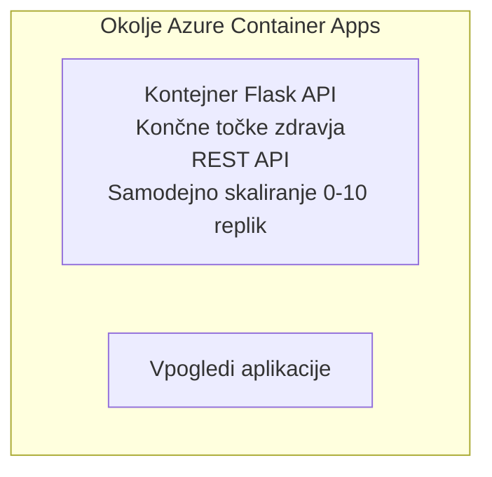

# Preprost Flask API - primer Container App

**Učna pot:** Začetnik ⭐ | **Čas:** 25-35 minut | **Strošek:** $0-15/month

Popoln, delujoč Python Flask REST API, razmeščen v Azure Container Apps z uporabo Azure Developer CLI (azd). Ta primer prikazuje razmestitev kontejnerja, osnovno avtomatsko skaliranje in spremljanje.

## 🎯 Kaj se boste naučili

- Razmestiti kontejnerizirano Python aplikacijo v Azure
- Nastaviti avtomatsko skaliranje (scale-to-zero)
- Uvesti preizkuse zdravstvenega stanja in preverjanja pripravljenosti
- Spremljati dnevniške zapise in metrike aplikacije
- Uporabiti Azure Developer CLI za hitro razmestitev

## 📦 Vsebuje

✅ **Flask aplikacija** - Popoln REST API s CRUD operacijami (`src/app.py`)  
✅ **Dockerfile** - Pripravljen za produkcijo konfiguracija kontejnerja  
✅ **Bicep infrastruktura** - Okolje Container Apps in razmestitev API-ja  
✅ **AZD konfiguracija** - Nastavitev za razmestitev z enim ukazom  
✅ **Preizkusi stanja** - Konfigurirani liveness in readiness preizkusi  
✅ **Avtomatsko skaliranje** - 0-10 replik glede na HTTP obremenitev  

## Arhitektura



## Predpogoji

### Potrebno
- **Azure Developer CLI (azd)** - [Namestitveni vodič](https://learn.microsoft.com/azure/developer/azure-developer-cli/install-azd)
- **Azure subscription** - [Brezplačen račun](https://azure.microsoft.com/free/)
- **Docker Desktop** - [Namestite Docker](https://www.docker.com/products/docker-desktop/) (za lokalno testiranje)

### Preverite predpogoje

```bash
# Preverite različico azd (potrebna je 1.5.0 ali novejša)
azd version

# Preverite prijavo v Azure
azd auth login

# Preverite Docker (neobvezno, za lokalno testiranje)
docker --version
```

## ⏱️ Časovni potek razmestitve

| Faza | Trajanje | Kaj se zgodi |
|-------|----------|--------------||
| Nastavitev okolja | 30 sekund | Ustvari azd okolje |
| Gradnja kontejnerja | 2-3 minute | Izgradi Docker sliko Flask aplikacije |
| Zagotavljanje infrastrukture | 3-5 minute | Ustvari Container Apps, registar, nadzor |
| Razmestitev aplikacije | 2-3 minute | Potisni sliko in razmestitev v Container Apps |
| **Skupaj** | **8-12 minut** | Razmestitev končana |

## Hiter začetek

```bash
# Pojdite do primera
cd examples/container-app/simple-flask-api

# Inicializirajte okolje (izberite edinstveno ime)
azd env new myflaskapi

# Razmestite vse (infrastruktura + aplikacija)
azd up
# Boste pozvani, da:
# 1. Izberite naročnino Azure
# 2. Izberite lokacijo (npr. eastus2)
# 3. Počakajte 8-12 minut za razmestitev

# Pridobite naslov svojega API-ja
azd env get-values

# Preizkusite API
curl $(azd env get-value API_ENDPOINT)/health
```

**Pričakovani izhod:**
```json
{
  "status": "healthy",
  "timestamp": "2025-11-19T10:30:00Z",
  "service": "simple-flask-api",
  "version": "1.0.0"
}
```

## ✅ Preverite razmestitev

### Korak 1: Preverite stanje razmestitve

```bash
# Prikaži nameščene storitve
azd show

# Pričakovani izhod prikazuje:
# - Storitev: api
# - Končna točka: https://ca-api-[env].xxx.azurecontainerapps.io
# - Status: V teku
```

### Korak 2: Preizkusite API končne točke

```bash
# Pridobi končno točko API-ja
API_URL=$(azd env get-value API_ENDPOINT)

# Preveri stanje
curl $API_URL/health

# Preizkusi korensko končno točko
curl $API_URL/

# Ustvari postavko
curl -X POST $API_URL/api/items \
  -H "Content-Type: application/json" \
  -d '{"name": "Test Item", "description": "My first item"}'

# Pridobi vse postavke
curl $API_URL/api/items
```

**Merila uspeha:**
- ✅ Zdravstvena končna točka vrne HTTP 200
- ✅ Korenska končna točka prikaže informacije o API-ju
- ✅ POST ustvari element in vrne HTTP 201
- ✅ GET vrne ustvarjene elemente

### Korak 3: Ogled dnevnikov

```bash
# Pretakajte žive dnevnike z ukazom azd monitor
azd monitor --logs

# Ali uporabite Azure CLI:
az containerapp logs show --name api --resource-group $RG_NAME --follow

# Morali bi videti:
# - sporočila ob zagonu Gunicorna
# - dnevniki HTTP zahtev
# - informacijski dnevniki aplikacije
```

## Struktura projekta

```
simple-flask-api/
├── azure.yaml              # AZD configuration
├── infra/
│   ├── main.bicep         # Main infrastructure
│   ├── main.parameters.json
│   └── app/
│       ├── container-env.bicep
│       └── api.bicep
└── src/
    ├── app.py             # Flask application
    ├── requirements.txt
    └── Dockerfile
```

## API končne točke

| Končna točka | Metoda | Opis |
|----------|--------|-------------|
| `/health` | GET | Preverjanje stanja |
| `/api/items` | GET | Seznam vseh elementov |
| `/api/items` | POST | Ustvari nov element |
| `/api/items/{id}` | GET | Pridobi določen element |
| `/api/items/{id}` | PUT | Posodobi element |
| `/api/items/{id}` | DELETE | Izbriši element |

## Konfiguracija

### Spremenljivke okolja

```bash
# Nastavi prilagojeno konfiguracijo
azd env set PORT 8000
azd env set LOG_LEVEL info
azd env set MAX_REPLICAS 20
```

### Konfiguracija skaliranja

API se samodejno skalira glede na HTTP promet:
- **Minimalno število replik**: 0 (pomanjša se na nič, ko je neaktiven)
- **Maksimalno število replik**: 10
- **Sočasne zahteve na repliko**: 50

## Razvoj

### Zaženite lokalno

```bash
# Namestite odvisnosti
cd src
pip install -r requirements.txt

# Zaženite aplikacijo
python app.py

# Preizkusite lokalno
curl http://localhost:8000/health
```

### Gradnja in testiranje kontejnerja

```bash
# Zgradi Docker sliko
docker build -t flask-api:local ./src

# Zaženi kontejner lokalno
docker run -p 8000:8000 flask-api:local

# Testiraj kontejner
curl http://localhost:8000/health
```

## Razmestitev

### Polna razmestitev

```bash
# Razporedi infrastrukturo in aplikacijo
azd up
```

### Razmestitev samo kode

```bash
# Razporedi samo kodo aplikacije (infrastruktura nespremenjena)
azd deploy api
```

### Posodobitev konfiguracije

```bash
# Posodobite spremenljivke okolja
azd env set API_KEY "new-api-key"

# Ponovno razmestite z novo konfiguracijo
azd deploy api
```

## Nadzor

### Ogled dnevnikov

```bash
# Pretakajte žive dnevnike z ukazom azd monitor
azd monitor --logs

# Ali pa uporabite Azure CLI za Container Apps:
az containerapp logs show --name api --resource-group $RG_NAME --follow

# Prikaži zadnjih 100 vrstic
az containerapp logs show --name api --resource-group $RG_NAME --tail 100
```

### Spremljanje metrik

```bash
# Odprite nadzorno ploščo Azure Monitor
azd monitor --overview

# Prikažite določene metrike
az monitor metrics list \
  --resource $(azd show --output json | jq -r '.services.api.resourceId') \
  --metric "Requests,ResponseTime"
```

## Testiranje

### Preverjanje stanja

```bash
curl $(azd show --output json | jq -r '.services.api.endpoint')/health
```

Pričakovani odgovor:
```json
{
  "status": "healthy",
  "timestamp": "2025-11-19T10:30:00Z"
}
```

### Ustvarjanje elementa

```bash
curl -X POST $(azd show --output json | jq -r '.services.api.endpoint')/api/items \
  -H "Content-Type: application/json" \
  -d '{"name": "Test Item", "description": "A test item"}'
```

### Pridobi vse elemente

```bash
curl $(azd show --output json | jq -r '.services.api.endpoint')/api/items
```

## Optimizacija stroškov

Ta razmestitev uporablja scale-to-zero, zato plačate le, ko API obdeluje zahteve:

- **Stroški v mirovanju**: ~$0/mesec (zmanjšano na nič)
- **Aktivni strošek**: ~$0.000024/sekundo na repliko
- **Pričakovani mesečni strošek** (pri nizki uporabi): $5-15

### Nadaljnje zmanjšanje stroškov

```bash
# Zmanjšaj največje število replik za razvoj
azd env set MAX_REPLICAS 3

# Uporabi krajši čas neaktivnosti
azd env set SCALE_TO_ZERO_TIMEOUT 300  # 5 minut
```

## Odpravljanje težav

### Kontejner se ne zažene

```bash
# Preveri dnevnike kontejnerja z uporabo Azure CLI
az containerapp logs show --name api --resource-group $RG_NAME --tail 100

# Preveri, ali se Dockerova slika gradi lokalno
docker build -t test ./src
```

### API ni dostopen

```bash
# Preverite, ali je ingress zunanji
az containerapp show --name api --resource-group rg-simple-flask-api \
  --query properties.configuration.ingress.external
```

### Visoki časi odziva

```bash
# Preveri porabo CPU-ja in pomnilnika
az monitor metrics list \
  --resource $(azd show --output json | jq -r '.services.api.resourceId') \
  --metric "CPUPercentage,MemoryPercentage"

# Povečaj vire, če je potrebno
az containerapp update --name api --resource-group rg-simple-flask-api \
  --cpu 1.0 --memory 2Gi
```

## Čiščenje

```bash
# Izbriši vse vire
azd down --force --purge
```

## Naslednji koraki

### Razširite ta primer

1. **Dodaj bazo podatkov** - Integrirajte Azure Cosmos DB ali SQL bazo podatkov
   ```bash
   # Dodaj modul Cosmos DB v infra/main.bicep
   # Posodobi app.py za povezavo z bazo podatkov
   ```

2. **Dodajte avtentikacijo** - Implementirajte Microsoft Entra ID ali API ključe
   ```python
   # Dodaj avtentikacijski middleware v app.py
   from functools import wraps
   ```

3. **Vzpostavite CI/CD** - GitHub Actions delovni tok
   ```yaml
   # Create .github/workflows/deploy.yml
   name: Deploy to Azure
   on: [push]
   ```

4. **Dodajte upravljano identiteto** - Zavarujte dostop do Azure storitev
   ```bicep
   # Update infra/app/api.bicep
   identity: { type: 'SystemAssigned' }
   ```

### Sorodni primeri

- **[Aplikacija z bazo podatkov](../../../../../examples/database-app)** - Popoln primer z SQL bazo podatkov
- **[Mikrostoritve](../../../../../examples/container-app/microservices)** - Arhitektura z več storitvami
- **[Vodnik za Container Apps](../README.md)** - Vsi vzorci za kontejnerje

### Učni viri

- 📚 [Tečaj AZD za začetnike](../../../README.md) - Glavna stran tečaja
- 📚 [Vzorci Container Apps](../README.md) - Več vzorcev razmestitve
- 📚 [Galerija predlog AZD](https://azure.github.io/awesome-azd/) - Predloge skupnosti

## Dodatni viri

### Dokumentacija
- **[Dokumentacija Flask](https://flask.palletsprojects.com/)** - Vodnik po ogrodju Flask
- **[Azure Container Apps](https://learn.microsoft.com/azure/container-apps/)** - Uradna Azure dokumentacija
- **[Azure Developer CLI](https://learn.microsoft.com/azure/developer/azure-developer-cli/)** - Referenca ukazov azd

### Vodiči
- **[Hitri začetek Container Apps](https://learn.microsoft.com/azure/container-apps/quickstart-portal)** - Razmestite svojo prvo aplikacijo
- **[Python na Azure](https://learn.microsoft.com/azure/developer/python/)** - Vodnik za razvoj v Pythonu
- **[Jezik Bicep](https://learn.microsoft.com/azure/azure-resource-manager/bicep/)** - Infrastruktura kot koda

### Orodja
- **[Azure Portal](https://portal.azure.com)** - Vizualno upravljanje virov
- **[Razširitev Azure za VS Code](https://marketplace.visualstudio.com/items?itemName=ms-azuretools.vscode-azurecontainerapps)** - Integracija z IDE

---

**🎉 Čestitke!** Razmeščeni ste produkcijsko pripravljeni Flask API v Azure Container Apps z avtomatskim skaliranjem in spremljanjem.

**Vprašanja?** [Odprite težavo](https://github.com/microsoft/AZD-for-beginners/issues) ali preverite [Pogosta vprašanja](../../../resources/faq.md)

---

<!-- CO-OP TRANSLATOR DISCLAIMER START -->
**Omejitev odgovornosti**:
Ta dokument je bil preveden z uporabo AI prevajalske storitve [Co-op Translator](https://github.com/Azure/co-op-translator). Čeprav si prizadevamo za natančnost, vas prosimo, da upoštevate, da avtomatizirani prevodi lahko vsebujejo napake ali netočnosti. Izvirni dokument v njegovem izvirnem jeziku je treba obravnavati kot avtoritativni vir. Za kritične informacije je priporočljiv strokovni človeški prevod. Ne odgovarjamo za morebitna nesporazume ali napačne interpretacije, ki izhajajo iz uporabe tega prevoda.
<!-- CO-OP TRANSLATOR DISCLAIMER END -->