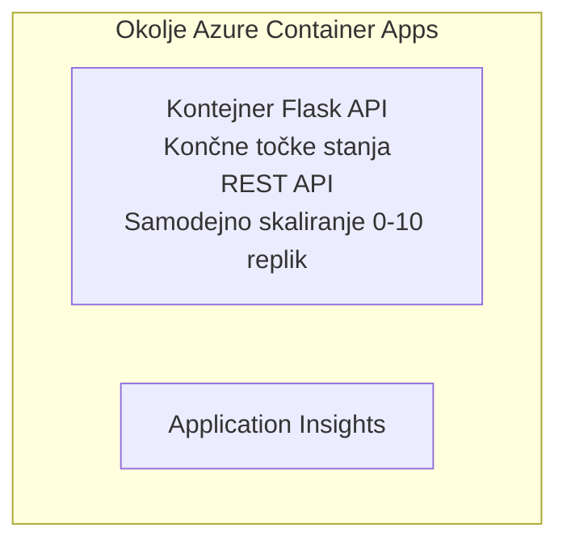

# Preprost Flask API - primer Container App

**Učilna pot:** Začetnik ⭐ | **Čas:** 25-35 minut | **Strošek:** $0-15/mesec

Popoln, delujoč Python Flask REST API nameščen v Azure Container Apps z uporabo Azure Developer CLI (azd). Ta primer prikazuje uvajanje kontejnerjev, samodejno skaliranje in osnove spremljanja.

## 🎯 Kaj se boste naučili

- Uvajati containerizirano Python aplikacijo v Azure
- Konfigurirati samodejno skaliranje z možnostjo scale-to-zero
- Implementirati health probe in readiness check
- Spremljati dnevniške zapise in metrike aplikacije
- Uporabljati Azure Developer CLI za hitro uvajanje

## 📦 Kaj je vključeno

✅ **Flask aplikacija** - Popoln REST API z operacijami CRUD (`src/app.py`)  
✅ **Dockerfile** - Konfiguracija kontejnerja primerna za produkcijo  
✅ **Infrastruktura v Bicep** - Okolje Container Apps in uvajanje API-ja  
✅ **AZD konfiguracija** - Namestitev z enim ukazom  
✅ **Pregledi zdravja** - Konfigurirane liveness in readiness preveritve  
✅ **Avtomatsko skaliranje** - 0-10 replik glede na HTTP obremenitev  

## Arhitektura


## Predpogoji

### Zahtevano
- **Azure Developer CLI (azd)** - [Vodnik za namestitev](https://learn.microsoft.com/azure/developer/azure-developer-cli/install-azd)
- **Azure naročnina** - [Brezplačen račun](https://azure.microsoft.com/free/)
- **Docker Desktop** - [Namestite Docker](https://www.docker.com/products/docker-desktop/) (za lokalno testiranje)

### Preverite predpogoje

```bash
# Preveri različico azd (zahteva 1.5.0 ali novejšo)
azd version

# Preveri prijavo v Azure
azd auth login

# Preveri Docker (izbirno, za lokalno testiranje)
docker --version
```

## ⏱️ Časovni načrt uvajanja

| Phase | Duration | What Happens |
|-------|----------|--------------||
| Environment setup | 30 sekund | Create azd environment |
| Build container | 2-3 minute | Docker build Flask app |
| Provision infrastructure | 3-5 minute | Create Container Apps, registry, monitoring |
| Deploy application | 2-3 minute | Push image and deploy to Container Apps |
| **Total** | **8-12 minute** | Complete deployment ready |

## Hiter začetek

```bash
# Pojdite do primera
cd examples/container-app/simple-flask-api

# Inicializirajte okolje (izberite edinstveno ime)
azd env new myflaskapi

# Razmestite vse (infrastrukturo + aplikacijo)
azd up
# Boste pozvani, da:
# 1. Izberite naročnino Azure
# 2. Izberite lokacijo (npr. eastus2)
# 3. Počakajte 8-12 minut za razmestitev

# Pridobite končno točko API-ja
azd env get-values

# Preizkusite API
curl $(azd env get-value API_ENDPOINT)/health
```

**Pričakovani izhod:**
```json
{
  "status": "healthy",
  "timestamp": "2025-11-19T10:30:00Z",
  "service": "simple-flask-api",
  "version": "1.0.0"
}
```

## ✅ Preverite uvajanje

### Korak 1: Preverite stanje uvajanja

```bash
# Ogled nameščenih storitev
azd show

# Pričakovan izpis prikazuje:
# - Storitev: api
# - Končna točka: https://ca-api-[env].xxx.azurecontainerapps.io
# - Stanje: Deluje
```

### Korak 2: Preizkusite API končne točke

```bash
# Pridobi API končno točko
API_URL=$(azd env get-value API_ENDPOINT)

# Preveri stanje
curl $API_URL/health

# Preveri glavno končno točko
curl $API_URL/

# Ustvari element
curl -X POST $API_URL/api/items \
  -H "Content-Type: application/json" \
  -d '{"name": "Test Item", "description": "My first item"}'

# Pridobi vse elemente
curl $API_URL/api/items
```

**Kriteriji uspeha:**
- ✅ Health endpoint vrača HTTP 200
- ✅ Root endpoint prikazuje informacije o API-ju
- ✅ POST ustvari element in vrne HTTP 201
- ✅ GET vrne ustvarjene elemente

### Korak 3: Ogled dnevnikov

```bash
# Pretakajte žive dnevniške zapise z ukazom azd monitor
azd monitor --logs

# Ali uporabite Azure CLI:
az containerapp logs show --name api --resource-group $RG_NAME --follow

# Morali bi videti:
# - Gunicornova zagonska sporočila
# - Dnevniški zapisi HTTP zahtev
# - Informacijski dnevniški zapisi aplikacije
```

## Struktura projekta

```
simple-flask-api/
├── azure.yaml              # AZD configuration
├── infra/
│   ├── main.bicep         # Main infrastructure
│   ├── main.parameters.json
│   └── app/
│       ├── container-env.bicep
│       └── api.bicep
└── src/
    ├── app.py             # Flask application
    ├── requirements.txt
    └── Dockerfile
```

## API končne točke

| Endpoint | Method | Description |
|----------|--------|-------------|
| `/health` | GET | Preverjanje stanja |
| `/api/items` | GET | Seznam vseh elementov |
| `/api/items` | POST | Ustvari nov element |
| `/api/items/{id}` | GET | Pridobi določen element |
| `/api/items/{id}` | PUT | Posodobi element |
| `/api/items/{id}` | DELETE | Izbriši element |

## Konfiguracija

### Spremenljivke okolja

```bash
# Nastavi prilagojeno konfiguracijo
azd env set PORT 8000
azd env set LOG_LEVEL info
azd env set MAX_REPLICAS 20
```

### Konfiguracija skaliranja

API se samodejno skalira glede na HTTP promet:
- **Min Replicas**: 0 (se skrči na nič, ko je neaktiven)
- **Max Replicas**: 10
- **Concurrent Requests per Replica**: 50

## Razvoj

### Zaženi lokalno

```bash
# Namestite odvisnosti
cd src
pip install -r requirements.txt

# Zaženite aplikacijo
python app.py

# Preizkusite lokalno
curl http://localhost:8000/health
```

### Zgradi in preizkusi kontejner

```bash
# Zgradi Docker sliko
docker build -t flask-api:local ./src

# Zaženi kontejner lokalno
docker run -p 8000:8000 flask-api:local

# Preizkusi kontejner
curl http://localhost:8000/health
```

## Uvajanje

### Popolno uvajanje

```bash
# Namestite infrastrukturo in aplikacijo
azd up
```

### Uvajanje samo kode

```bash
# Namesti samo kodo aplikacije (infrastruktura ostane nespremenjena)
azd deploy api
```

### Posodobi konfiguracijo

```bash
# Posodobite spremenljivke okolja
azd env set API_KEY "new-api-key"

# Ponovno razmestite z novo konfiguracijo
azd deploy api
```

## Spremljanje

### Ogled dnevnikov

```bash
# Pretakajte dnevniške zapise v živo z ukazom azd monitor
azd monitor --logs

# Ali pa uporabite Azure CLI za Container Apps:
az containerapp logs show --name api --resource-group $RG_NAME --follow

# Prikažite zadnjih 100 vrstic
az containerapp logs show --name api --resource-group $RG_NAME --tail 100
```

### Spremljanje metrik

```bash
# Odpri nadzorno ploščo Azure Monitor
azd monitor --overview

# Prikaži določene metrike
az monitor metrics list \
  --resource $(azd show --output json | jq -r '.services.api.resourceId') \
  --metric "Requests,ResponseTime"
```

## Preizkušanje

### Preverjanje stanja

```bash
curl $(azd show --output json | jq -r '.services.api.endpoint')/health
```

Pričakovan odgovor:
```json
{
  "status": "healthy",
  "timestamp": "2025-11-19T10:30:00Z"
}
```

### Ustvari element

```bash
curl -X POST $(azd show --output json | jq -r '.services.api.endpoint')/api/items \
  -H "Content-Type: application/json" \
  -d '{"name": "Test Item", "description": "A test item"}'
```

### Pridobi vse elemente

```bash
curl $(azd show --output json | jq -r '.services.api.endpoint')/api/items
```

## Optimizacija stroškov

To uvajanje uporablja scale-to-zero, tako da plačate le, ko API obdeluje zahteve:

- **Strošek med mirovanjem**: ~0 $/mesec (skrči se na nič)
- **Strošek med aktivnostjo**: ~0.000024 $/sekundo na repliko
- **Pričakovani mesečni strošek** (nizka uporaba): $5-15

### Dodatno znižajte stroške

```bash
# Zmanjšaj največje število replik za razvojno okolje
azd env set MAX_REPLICAS 3

# Uporabi krajši čas poteka neaktivnosti
azd env set SCALE_TO_ZERO_TIMEOUT 300  # 5 minut
```

## Odpravljanje težav

### Kontejner se ne zažene

```bash
# Preverite dnevnike vsebnika z uporabo Azure CLI
az containerapp logs show --name api --resource-group $RG_NAME --tail 100

# Preverite, ali se Dockerova slika zgradi lokalno
docker build -t test ./src
```

### API ni dostopen

```bash
# Preverite, ali je ingress zunanji
az containerapp show --name api --resource-group rg-simple-flask-api \
  --query properties.configuration.ingress.external
```

### Dolgi odzivni časi

```bash
# Preveri uporabo CPU/pomnilnika
az monitor metrics list \
  --resource $(azd show --output json | jq -r '.services.api.resourceId') \
  --metric "CPUPercentage,MemoryPercentage"

# Povečaj vire, če je potrebno
az containerapp update --name api --resource-group rg-simple-flask-api \
  --cpu 1.0 --memory 2Gi
```

## Čiščenje

```bash
# Izbrišite vse vire
azd down --force --purge
```

## Naslednji koraki

### Razširite ta primer

1. **Dodajte bazo podatkov** - Integrirajte Azure Cosmos DB ali SQL Database
   ```bash
   # Dodaj modul Cosmos DB v infra/main.bicep
   # Posodobi app.py s povezavo z bazo podatkov
   ```

2. **Dodajte avtentikacijo** - Implementirajte Azure AD ali API ključe
   ```python
   # Dodaj middleware za preverjanje pristnosti v app.py
   from functools import wraps
   ```

3. **Nastavite CI/CD** - GitHub Actions workflow
   ```yaml
   # Create .github/workflows/deploy.yml
   name: Deploy to Azure
   on: [push]
   ```

4. **Dodajte upravljano identiteto** - Varen dostop do Azure storitev
   ```bicep
   # Update infra/app/api.bicep
   identity: { type: 'SystemAssigned' }
   ```

### Sorodni primeri

- **[Aplikacija z bazo podatkov](../../../../../examples/database-app)** - Popoln primer z SQL Database
- **[Mikrostoritve](../../../../../examples/container-app/microservices)** - Arhitektura z več storitvami
- **[Vodnik Container Apps](../README.md)** - Vsi vzorci za kontejnere

### Viri za učenje

- 📚 [Tečaj AZD za začetnike](../../../README.md) - Glavna stran tečaja
- 📚 [Vzorci Container Apps](../README.md) - Več vzorcev uvajanja
- 📚 [Galerija predlog AZD](https://azure.github.io/awesome-azd/) - Predloge skupnosti

## Dodatni viri

### Dokumentacija
- **[Dokumentacija Flaska](https://flask.palletsprojects.com/)** - Vodnik po ogrodju Flask
- **[Azure Container Apps](https://learn.microsoft.com/azure/container-apps/)** - Uradna dokumentacija Azure
- **[Azure Developer CLI](https://learn.microsoft.com/azure/developer/azure-developer-cli/)** - Referenca ukazov azd

### Vadnice
- **[Hiter začetek Container Apps](https://learn.microsoft.com/azure/container-apps/quickstart-portal)** - Uvedite svojo prvo aplikacijo
- **[Python na Azure](https://learn.microsoft.com/azure/developer/python/)** - Vodnik za razvoj v Pythonu
- **[Jezik Bicep](https://learn.microsoft.com/azure/azure-resource-manager/bicep/)** - Infrastruktura kot koda

### Orodja
- **[Azure Portal](https://portal.azure.com)** - Upravljajte vire vizualno
- **[VS Code Azure Extension](https://marketplace.visualstudio.com/items?itemName=ms-azuretools.vscode-azurecontainerapps)** - Integracija z IDE

---

**🎉 Čestitamo!** Uvedli ste Flask API pripravljen za produkcijo v Azure Container Apps z avtomatskim skaliranjem in spremljanjem.

**Vprašanja?** [Odprite težavo](https://github.com/microsoft/AZD-for-beginners/issues) ali preverite [Pogosta vprašanja](../../../resources/faq.md)

---

<!-- CO-OP TRANSLATOR DISCLAIMER START -->
**Omejitev odgovornosti**:
Ta dokument je bil preveden z uporabo prevajalske storitve na osnovi umetne inteligence [Co-op Translator](https://github.com/Azure/co-op-translator). Čeprav si prizadevamo za natančnost, upoštevajte, da avtomatizirani prevodi lahko vsebujejo napake ali netočnosti. Izvirni dokument v njegovem izvirnem jeziku naj se šteje za avtoritativni vir. Za kritične informacije priporočamo strokovni človeški prevod. Ne odgovarjamo za morebitne nesporazume ali napačne interpretacije, ki izhajajo iz uporabe tega prevoda.
<!-- CO-OP TRANSLATOR DISCLAIMER END -->