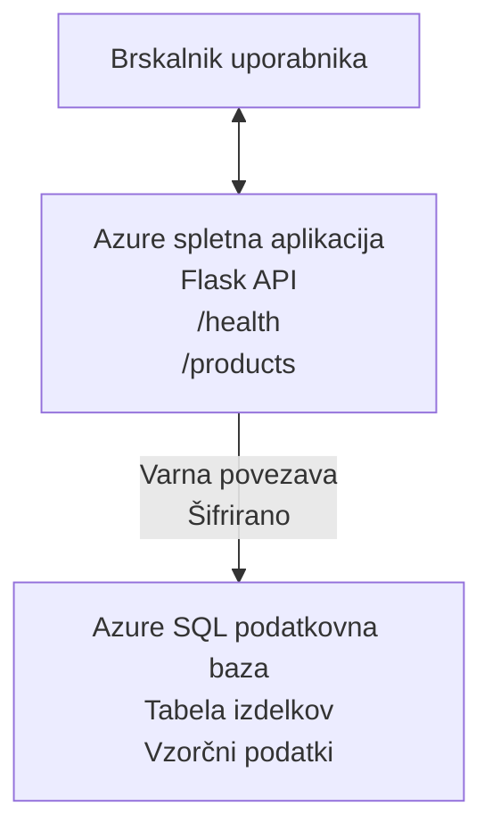

# Uvajanje Microsoft SQL podatkovne baze in spletne aplikacije z AZD

⏱️ **Ocenjeni čas**: 20-30 minut | 💰 **Ocenjeni stroški**: ~$15-25/mesec | ⭐ **Kompleksnost**: Srednje zahtevno

Ta **popoln, delujoč primer** prikazuje, kako uporabiti [Azure Developer CLI (azd)](https://learn.microsoft.com/azure/developer/azure-developer-cli/) za razmestitev Python Flask spletne aplikacije z Microsoft SQL podatkovno bazo v Azure. Vsa koda je vključena in testirana—ni potrebnih zunanjih odvisnosti.

## Kaj se boste naučili

Z dokončanjem tega primera boste:
- Razporediti večnivojsko aplikacijo (spletna aplikacija + podatkovna baza) z infrastrukturo kot kodo
- Konfigurirati varne povezave do baze brez trdega vnašanja skrivnosti v kodo
- Nadzorovati zdravje aplikacije z Application Insights
- Učinkovito upravljati Azure vire z AZD CLI
- Slediti najboljšim praksam Azure za varnost, optimizacijo stroškov in opazljivost

## Pregled scenarija
- **Spletna aplikacija**: Python Flask REST API s povezavo na bazo
- **Podatkovna baza**: Azure SQL Database z vzorčnimi podatki
- **Infrastruktura**: Zagotovljena z Bicep (modularne, ponovno uporabne predloge)
- **Razmestitev**: Popolnoma avtomatizirano z `azd` ukazi
- **Nadzor**: Application Insights za dnevnike in telemetrijo

## Predpogoji

### Potrebna orodja

Pred začetkom preverite, da imate ta orodja nameščena:

1. **[Azure CLI](https://learn.microsoft.com/cli/azure/install-azure-cli)** (različica 2.50.0 ali višja)
   ```sh
   az --version
   # Pričakovan izhod: azure-cli 2.50.0 ali novejša
   ```

2. **[Azure Developer CLI (azd)](https://learn.microsoft.com/azure/developer/azure-developer-cli/install-azd)** (različica 1.0.0 ali višja)
   ```sh
   azd version
   # Pričakovan izhod: azd različica 1.0.0 ali novejša
   ```

3. **[Python 3.8+](https://www.python.org/downloads/)** (za lokalni razvoj)
   ```sh
   python --version
   # Pričakovan izhod: Python 3.8 ali novejši
   ```

4. **[Docker](https://www.docker.com/get-started)** (neobvezno, za lokalni razvoj v vsebnikih)
   ```sh
   docker --version
   # Pričakovani izhod: Docker različica 20.10 ali novejša
   ```

### Zahteve za Azure

- Aktivno **Azure naročnino** ([ustvarite brezplačen račun](https://azure.microsoft.com/free/))
- Dovoljenja za ustvarjanje virov v vaši naročnini
- vloga **Owner** ali **Contributor** na naročnini ali skupini virov

### Potrebno predznanje

To je primer srednje zahtevnosti. Priporočeno je, da poznate:
- Osnovne ukaze v ukazni vrstici
- Osnovne pojme v oblaku (viri, skupine virov)
- Osnovno razumevanje spletnih aplikacij in podatkovnih baz

**Nov pri AZD?** Najprej začnite z [uvodnim vodičem](../../docs/chapter-01-foundation/azd-basics.md).

## Arhitektura

Ta primer razporedi dvonivojsko arhitekturo s spletno aplikacijo in SQL bazo:



**Razporeditev virov:**
- **Skupina virov**: Kontejner za vse vire
- **App Service Plan**: Gostovanje na Linuxu (nivo B1 za ekonomičnost)
- **Web App**: Python 3.11 runtime z Flask aplikacijo
- **SQL Server**: Upravljen strežnik baze podatkov z vsaj TLS 1.2
- **SQL Database**: Osnovni razred (2GB, primeren za razvoj/testiranje)
- **Application Insights**: Nadzor in beleženje
- **Log Analytics Workspace**: Centralizirano shranjevanje dnevnikov

**Prispodoba**: Predstavljajte si to kot restavracijo (spletna aplikacija) z velikim hladilnikom (podatkovna baza). Stranke naročijo z jedilnika (API končne točke), kuhinja (Flask aplikacija) vzame sestavine (podatke) iz hladilnika. Vodja restavracije (Application Insights) spremlja vse.

## Struktura map

Vse datoteke so vključene v tem primeru—nobenih zunanjih odvisnosti ni potrebno:

```
examples/database-app/
│
├── README.md                    # This file
├── azure.yaml                   # AZD configuration file
├── .env.sample                  # Sample environment variables
├── .gitignore                   # Git ignore patterns
│
├── infra/                       # Infrastructure as Code (Bicep)
│   ├── main.bicep              # Main orchestration template
│   ├── abbreviations.json      # Azure naming conventions
│   └── resources/              # Modular resource templates
│       ├── sql-server.bicep    # SQL Server configuration
│       ├── sql-database.bicep  # Database configuration
│       ├── app-service-plan.bicep  # Hosting plan
│       ├── app-insights.bicep  # Monitoring setup
│       └── web-app.bicep       # Web application
│
└── src/
    └── web/                    # Application source code
        ├── app.py              # Flask REST API
        ├── requirements.txt    # Python dependencies
        └── Dockerfile          # Container definition
```

**Kaj počne vsaka datoteka:**
- **azure.yaml**: Pove AZD, kaj in kam razporediti
- **infra/main.bicep**: Orkestrira vse Azure vire
- **infra/resources/*.bicep**: Posamezne definicije virov (modularno za ponovno uporabo)
- **src/web/app.py**: Flask aplikacija z logiko baze podatkov
- **requirements.txt**: Odvisnosti paketov za Python
- **Dockerfile**: Navodila za kontejnerizacijo za razmestitev

## Hiter začetek (korak za korakom)

### Korak 1: Klonirajte in se premaknite

```sh
git clone https://github.com/microsoft/AZD-for-beginners.git
cd AZD-for-beginners/examples/database-app
```

**✓ Preverjanje uspeha**: Preverite, da vidite `azure.yaml` in mapo `infra/`:
```sh
ls
# Pričakovano: README.md, azure.yaml, infra/, src/
```

### Korak 2: Avtentikacija v Azure

```sh
azd auth login
```

To odpre brskalnik za avtentikacijo v Azure. Prijavite se z vašimi Azure poverilnicami.

**✓ Preverjanje uspeha**: Videli bi morali:
```
Logged in to Azure.
```

### Korak 3: Inicializacija okolja

```sh
azd init
```

**Kaj se zgodi**: AZD ustvari lokalno konfiguracijo za vašo razmestitev.

**Pozivi, ki jih boste videli**:
- **Ime okolja**: Vnesite kratko ime (npr. `dev`, `myapp`)
- **Azure naročnina**: Izberite vašo naročnino s seznama
- **Lokacija Azure**: Izberite regijo (npr. `eastus`, `westeurope`)

**✓ Preverjanje uspeha**: Videli bi morali:
```
SUCCESS: New project initialized!
```

### Korak 4: Vzpostavitev Azure virov

```sh
azd provision
```

**Kaj se zgodi**: AZD razporedi vso infrastrukturo (traja 5–8 minut):
1. Ustvari skupino virov
2. Ustvari SQL Server in bazo
3. Ustvari App Service Plan
4. Ustvari Web App
5. Ustvari Application Insights
6. Konfigurira omrežje in varnost

Zahtevali se bodo:
- **Uporabniško ime za SQL skrbnika**: Vnesite uporabniško ime (npr. `sqladmin`)
- **Geslo SQL skrbnika**: Vnesite močno geslo (shranite ga!)

**✓ Preverjanje uspeha**: Videli bi morali:
```
SUCCESS: Your application was provisioned in Azure in X minutes Y seconds.
You can view the resources created under the resource group rg-<env-name> in Azure Portal:
https://portal.azure.com/#@/resource/subscriptions/.../resourceGroups/rg-<env-name>
```

**⏱️ Čas**: 5–8 minut

### Korak 5: Razmestitev aplikacije

```sh
azd deploy
```

**Kaj se zgodi**: AZD gradi in razporedi vašo Flask aplikacijo:
1. Pakira Python aplikacijo
2. Gradi Docker vsebnik
3. Potisne v Azure Web App
4. Inicializira bazo s vzorčnimi podatki
5. Zažene aplikacijo

**✓ Preverjanje uspeha**: Videli bi morali:
```
SUCCESS: Your application was deployed to Azure in X minutes Y seconds.
You can view the resources created under the resource group rg-<env-name> in Azure Portal:
https://portal.azure.com/#@/resource/subscriptions/.../resourceGroups/rg-<env-name>
```

**⏱️ Čas**: 3–5 minut

### Korak 6: Brskanje po aplikaciji

```sh
azd browse
```

To odpre vašo razmestjeno spletno aplikacijo v brskalniku na `https://app-<unique-id>.azurewebsites.net`

**✓ Preverjanje uspeha**: Videli bi morali JSON izhod:
```json
{
  "message": "Welcome to the Database App API",
  "endpoints": {
    "/": "This help message",
    "/health": "Health check endpoint",
    "/products": "List all products",
    "/products/<id>": "Get product by ID"
  }
}
```

### Korak 7: Testiranje API končnih točk

**Preverjanje stanja** (preverite povezavo z bazo):
```sh
curl https://app-<your-id>.azurewebsites.net/health
```

**Pričakovan odziv**:
```json
{
  "status": "healthy",
  "database": "connected"
}
```

**Seznam izdelkov** (vzorec podatkov):
```sh
curl https://app-<your-id>.azurewebsites.net/products
```

**Pričakovan odziv**:
```json
[
  {
    "id": 1,
    "name": "Laptop",
    "description": "High-performance laptop",
    "price": 1299.99,
    "created_at": "2025-11-19T10:30:00"
  },
  ...
]
```

**Pridobi en izdelek**:
```sh
curl https://app-<your-id>.azurewebsites.net/products/1
```

**✓ Preverjanje uspeha**: Vse končne točke vračajo JSON podatke brez napak.

---

**🎉 Čestitke!** Uspešno ste razmestili spletno aplikacijo z bazo v Azure z uporabo AZD.

## Podrobna konfiguracija

### Spremenljivke okolja

Skrivnosti so varno upravljane prek konfiguracije Azure App Service—**nikoli jih ne trdo vpisujte v izvorno kodo**.

**Avtomatsko konfigurirano z AZD**:
- `SQL_CONNECTION_STRING`: Povezava do baze z šifriranimi poverilnicami
- `APPLICATIONINSIGHTS_CONNECTION_STRING`: Končna točka telemetrije za nadzor
- `SCM_DO_BUILD_DURING_DEPLOYMENT`: Omogoča samodejno namestitev odvisnosti

**Kje so skrivnosti shranjene**:
1. Med `azd provision` zagotovite SQL poverilnice preko varnih pozivov
2. AZD jih shrani v lokalno datoteko `.azure/<env-name>/.env` (git-ignored)
3. AZD jih vbrizga v konfiguracijo Azure App Service (šifrirano pri mirovanju)
4. Aplikacija jih bere preko `os.getenv()` ob izvajanju

### Lokalni razvoj

Za lokalno testiranje ustvarite `.env` datoteko iz vzorca:

```sh
cp .env.sample .env
# Uredite .env z lokalno povezavo do baze podatkov
```

**Potek lokalnega razvoja**:
```sh
# Namestite odvisnosti
cd src/web
pip install -r requirements.txt

# Nastavite spremenljivke okolja
export SQL_CONNECTION_STRING="your-local-connection-string"

# Zaženite aplikacijo
python app.py
```

**Testirajte lokalno**:
```sh
curl http://localhost:8000/health
# Pričakovano: {"status": "healthy", "database": "connected"}
```

### Infrastruktura kot koda

Vsi Azure viri so definirani v **Bicep predlogah** (`infra/` mapa):

- **Modularna zasnova**: Vsaka vrsta vira ima svojo datoteko za ponovno uporabo
- **Parametrizirano**: Prilagodite SKU-je, regije, konvencije poimenovanja
- **Najboljše prakse**: Sledi Azure standardom poimenovanja in varnostnim privzetkom
- **Nadzor različic**: Spremembe infrastrukture se sledijo v Gitu

**Primer prilagoditve**:
Za spremembo razreda baze uredite `infra/resources/sql-database.bicep`:
```bicep
sku: {
  name: 'Standard'  // Changed from 'Basic'
  tier: 'Standard'
  capacity: 10
}
```

## Najboljše varnostne prakse

Ta primer sledi najboljšim varnostnim praksam Azure:

### 1. **Brez skrivnosti v izvorni kodi**
- ✅ Poverilnice shranjene v konfiguraciji Azure App Service (šifrirane)
- ✅ `.env` datoteke izključene iz Gita preko `.gitignore`
- ✅ Skrivnosti posredovane preko varnih parametrov med vzpostavitvijo

### 2. **Šifrirane povezave**
- ✅ TLS 1.2 ali višje za SQL Server
- ✅ Obvezno HTTPS-only za Web App
- ✅ Povezave do baze uporabljajo šifrirane kanale

### 3. **Omrežna varnost**
- ✅ Firewall za SQL Server nastavljen za dovoljenje samo Azure storitev
- ✅ Javni dostop do omrežja omejen (lahko se dodatno zaščiti s Private Endpoints)
- ✅ FTPS onemogočen na Web App

### 4. **Avtentikacija in avtorizacija**
- ⚠️ **Trenutno**: SQL avtentikacija (uporabniško ime/geslo)
- ✅ **Priporočilo za produkcijo**: Uporabite Azure Managed Identity za prijavo brez gesla

**Za nadgradnjo na Managed Identity** (za produkcijo):
1. Omogočite managed identity na Web App
2. Dodelite identiteti SQL dovoljenja
3. Posodobite connection string za uporabo managed identity
4. Odstranite geselno avtentikacijo

### 5. **Revizija in skladnost**
- ✅ Application Insights beleži vse zahteve in napake
- ✅ Revizija SQL baze omogočena (nastavljiva za skladnost)
- ✅ Vsi viri označeni za upravljanje

**Varnostni kontrolni seznam pred produkcijo**:
- [ ] Omogočite Azure Defender za SQL
- [ ] Konfigurirajte Private Endpoints za SQL Database
- [ ] Omogočite Web Application Firewall (WAF)
- [ ] Implementirajte Azure Key Vault za rotacijo skrivnosti
- [ ] Konfigurirajte Microsoft Entra ID avtentikacijo
- [ ] Omogočite diagnostično beleženje za vse vire

## Optimizacija stroškov

**Ocenjeni mesečni stroški** (stanje november 2025):

| Vir | SKU/Razred | Ocenjeni strošek |
|----------|----------|----------------|
| App Service Plan | B1 (Basic) | ~$13/mesec |
| SQL Database | Basic (2GB) | ~$5/mesec |
| Application Insights | Plačilo-po-porabi | ~$2/mesec (nizek promet) |
| **Skupaj** | | **~$20/mesec** |

**💡 Nasveti za prihranek stroškov**:

1. **Uporabite brezplačni razred za učenje**:
   - App Service: F1 razred (brezplačno, omejene ure)
   - SQL Database: uporabite Azure SQL Database serverless
   - Application Insights: 5GB/mesec brezplačen vnos

2. **Ustavite vire, ko jih ne uporabljate**:
   ```sh
   # Ustavi spletno aplikacijo (baza podatkov še vedno ustvarja stroške)
   az webapp stop --name <app-name> --resource-group <rg-name>
   
   # Ponovno zaženi po potrebi
   az webapp start --name <app-name> --resource-group <rg-name>
   ```

3. **Izbrišite vse po testiranju**:
   ```sh
   azd down
   ```
   To odstrani VSE vire in ustavi zaračunavanje.

4. **Razredi za razvoj proti produkciji**:
   - **Razvoj**: Basic razred (uporabljen v tem primeru)
   - **Produkcija**: Standard/Premium razred z redundanco

**Nadzor stroškov**:
- Ogled stroškov v [Azure Cost Management](https://portal.azure.com/#view/Microsoft_Azure_CostManagement)
- Nastavite opozorila za stroške, da se izognete nepričakovanim stroškom
- Označite vse vire z `azd-env-name` za sledenje

**Alternativa brezplačnega razreda**:
Za učenje lahko spremenite `infra/resources/app-service-plan.bicep`:
```bicep
sku: {
  name: 'F1'  // Free tier
  tier: 'Free'
}
```
**Opomba**: Brezplačni razred ima omejitve (60 min/dan CPU, ni vedno vklopljen).

## Nadzor in opazljivost

### Integracija Application Insights

Ta primer vključuje **Application Insights** za celovit nadzor:

**Kaj se nadzira**:
- ✅ HTTP zahteve (zakasnitev, statusne kode, končne točke)
- ✅ Napake in izjeme aplikacije
- ✅ Po meri zapisovanje iz Flask aplikacije
- ✅ Zdravje povezave do baze
- ✅ Metrična zmogljivost (CPU, pomnilnik)

**Dostop do Application Insights**:
1. Odprite [Azure Portal](https://portal.azure.com)
2. Pojdite v vašo skupino virov (`rg-<env-name>`)
3. Kliknite na Application Insights vir (`appi-<unique-id>`)

**Uporabne poizvedbe** (Application Insights → Logs):

**Prikaži vse zahteve**:
```kusto
requests
| where timestamp > ago(1h)
| order by timestamp desc
| project timestamp, name, url, resultCode, duration
```

**Poišči napake**:
```kusto
exceptions
| where timestamp > ago(24h)
| order by timestamp desc
| project timestamp, type, outerMessage, operation_Name
```

**Preveri endpoint stanja**:
```kusto
requests
| where name contains "health"
| summarize count() by resultCode, bin(timestamp, 1h)
```

### Revizija SQL baze podatkov

**Revizija SQL baze je omogočena** za sledenje:
- Vzorcev dostopa do baze
- Neuspelih poskusov prijave
- Sprememb sheme
- Dostopa do podatkov (za skladnost)

**Dostop do zapisov revizije**:
1. Azure Portal → SQL Database → Auditing
2. Ogled zapisov v Log Analytics delovnem prostoru

### Spremljanje v realnem času

**Ogled metrik v živo**:
1. Application Insights → Live Metrics
2. Oglejte si zahteve, napake in zmogljivost v realnem času

**Nastavite opozorila**:
Ustvarite opozorila za kritične dogodke:
- HTTP 500 napake > 5 v 5 minutah
- Napake povezave do baze
- Visoke časovne odzive (>2 sekundi)

**Primer ustvarjanja opozorila**:
```sh
az monitor metrics alert create \
  --name "High-Response-Time" \
  --resource-group <rg-name> \
  --scopes <app-insights-resource-id> \
  --condition "avg requests/duration > 2000" \
  --description "Alert when response time exceeds 2 seconds"
```

## Odpravljanje težav
### Pogoste težave in rešitve

#### 1. `azd provision` spodleti z napako "Location not available"

**Simptom**:
```
Error: The subscription is not registered for the resource type 'components' in the location 'centralus'.
```

**Rešitev**:
Izberite drugo regijo Azure ali registrirajte ponudnika virov:
```sh
az provider register --namespace Microsoft.Insights
```

#### 2. Povezava do SQL med uvajanjem spodleti

**Simptom**:
```
pyodbc.OperationalError: ('08001', '[08001] [Microsoft][ODBC Driver 18 for SQL Server]TCP Provider...')
```

**Rešitev**:
- Preverite, da požarni zid SQL Serverja dovoljuje storitve Azure (samodejno konfigurirano)
- Preverite, da je bilo geslo skrbnika SQL pravilno vneseno med `azd provision`
- Prepričajte se, da je SQL Server v celoti vzpostavljen (lahko traja 2-3 minute)

**Preverjanje povezave**:
```sh
# V Azure portalu pojdite na SQL Database → Urejevalnik poizvedb
# Poskusite se povezati s svojimi poverilnicami
```

#### 3. Spletna aplikacija prikaže "Application Error"

**Simptom**:
Brskalnik prikaže generično stran z napako.

**Rešitev**:
Preverite dnevnike aplikacije:
```sh
# Prikaži nedavne zapise
az webapp log tail --name <app-name> --resource-group <rg-name>
```

**Pogosti vzroki**:
- Manjkajoče okoljske spremenljivke (preverite App Service → Konfiguracija)
- Namestitev Python paketov ni uspela (preverite dnevnike uvajanja)
- Napaka pri inicializaciji baze podatkov (preverite povezljivost do SQL)

#### 4. `azd deploy` spodleti z napako "Build Error"

**Simptom**:
```
Error: Failed to build project
```

**Rešitev**:
- Poskrbite, da `requirements.txt` nima sintaktičnih napak
- Preverite, da je v `infra/resources/web-app.bicep` naveden Python 3.11
- Preverite, da Dockerfile uporablja pravilno osnovno sliko

**Odpravljanje napak lokalno**:
```sh
cd src/web
docker build -t test-app .
docker run -p 8000:8000 test-app
```

#### 5. "Unauthorized" pri izvajanju AZD ukazov

**Simptom**:
```
ERROR: (Unauthorized) The client '<id>' with object id '<id>' does not have authorization
```

**Rešitev**:
Ponovno se prijavite v Azure:
```sh
# Potrebno za AZD poteke dela
azd auth login

# Neobvezno, če tudi neposredno uporabljate ukaze Azure CLI
az login
```

Preverite, da imate ustrezna dovoljenja (vloga Contributor) za naročnino.

#### 6. Visoki stroški baze podatkov

**Simptom**:
Nepričakovan račun za Azure.

**Rešitev**:
- Preverite, ali ste pozabili zagnati `azd down` po testiranju
- Preverite, da SQL Database uporablja nivo Basic (ne Premium)
- Preglejte stroške v Azure Cost Management
- Nastavite opozorila glede stroškov

### Dobivanje pomoči

**Ogled vseh AZD okoljskih spremenljivk**:
```sh
azd env get-values
```

**Preverite stanje uvajanja**:
```sh
az webapp show --name <app-name> --resource-group <rg-name> --query state
```

**Dostop do dnevnikov aplikacije**:
```sh
az webapp log download --name <app-name> --resource-group <rg-name> --log-file app-logs.zip
```

**Potrebujete več pomoči?**
- [Vodnik za odpravljanje težav z AZD](../../docs/chapter-07-troubleshooting/common-issues.md)
- [Odpravljanje težav Azure App Service](https://learn.microsoft.com/azure/app-service/troubleshoot-diagnostic-logs)
- [Odpravljanje težav Azure SQL](https://learn.microsoft.com/azure/azure-sql/database/troubleshoot-common-errors-issues)

## Praktične vaje

### Vaja 1: Preverite svoje uvajanje (Začetnik)

**Cilj**: Potrdite, da so vse vire uvajene in aplikacija deluje.

**Koraki**:
1. Naštejte vse vire v vaši skupini virov:
   ```sh
   az resource list --resource-group rg-<env-name> --output table
   ```
   **Pričakovano**: 6-7 virov (Web App, SQL Server, SQL Database, App Service Plan, Application Insights, Log Analytics)

2. Preizkusite vse API končne točke:
   ```sh
   curl https://app-<your-id>.azurewebsites.net/
   curl https://app-<your-id>.azurewebsites.net/health
   curl https://app-<your-id>.azurewebsites.net/products
   curl https://app-<your-id>.azurewebsites.net/products/1
   ```
   **Pričakovano**: Vse vrnejo veljaven JSON brez napak

3. Preverite Application Insights:
   - Pomaknite se do Application Insights v Azure Portalu
   - Pojdite na "Live Metrics"
   - Osvežite stran brskalnika na spletni aplikaciji
   **Pričakovano**: Vidite zahtevke, ki se pojavljajo v realnem času

**Merila uspeha**: Vsi 6-7 viri obstajajo, vse končne točke vračajo podatke, Live Metrics prikazuje aktivnost.

---

### Vaja 2: Dodajte novo API končno točko (Srednje zahtevno)

**Cilj**: Razširite Flask aplikacijo z novo končno točko.

**Izhodiščna koda**: Trenutne končne točke v `src/web/app.py`

**Koraki**:
1. Uredite `src/web/app.py` in dodajte novo končno točko po funkciji `get_product()`:
   ```python
   @app.route('/products/search/<keyword>')
   def search_products(keyword):
       """Search products by name or description."""
       try:
           conn = get_db_connection()
           cursor = conn.cursor()
           cursor.execute(
               "SELECT id, name, description, price, created_at FROM products WHERE name LIKE ? OR description LIKE ?",
               (f'%{keyword}%', f'%{keyword}%')
           )
           
           products = []
           for row in cursor.fetchall():
               products.append({
                   'id': row[0],
                   'name': row[1],
                   'description': row[2],
                   'price': float(row[3]) if row[3] else None,
                   'created_at': row[4].isoformat() if row[4] else None
               })
           
           cursor.close()
           conn.close()
           
           logger.info(f"Search for '{keyword}' returned {len(products)} results")
           return jsonify(products), 200
           
       except Exception as e:
           logger.error(f"Error searching products: {str(e)}")
           return jsonify({'error': str(e)}), 500
   ```

2. Razmestite posodobljeno aplikacijo:
   ```sh
   azd deploy
   ```

3. Preizkusite novo končno točko:
   ```sh
   curl https://app-<your-id>.azurewebsites.net/products/search/laptop
   ```
   **Pričakovano**: Vrnitev izdelkov, ki ustrezajo "laptop"

**Merila uspeha**: Nova končna točka deluje, vrača filtrirane rezultate, se prikaže v dnevnikih Application Insights.

---

### Vaja 3: Dodajte nadzor in opozorila (Napredno)

**Cilj**: Nastavite proaktivno spremljanje z opozorili.

**Koraki**:
1. Ustvarite opozorilo za HTTP 500 napake:
   ```sh
   # Pridobi ID vira Application Insights
   AI_ID=$(az monitor app-insights component show \
     --app appi-<your-id> \
     --resource-group rg-<env-name> \
     --query id -o tsv)
   
   # Ustvari opozorilo
   az monitor metrics alert create \
     --name "High-Error-Rate" \
     --resource-group rg-<env-name> \
     --scopes $AI_ID \
     --condition "count requests/failed > 5" \
     --window-size 5m \
     --evaluation-frequency 1m \
     --description "Alert when >5 failed requests in 5 minutes"
   ```

2. Sprožite opozorilo s povzročanjem napak:
   ```sh
   # Zahtevaj neobstoječ izdelek
   for i in {1..10}; do curl https://app-<your-id>.azurewebsites.net/products/999; done
   ```

3. Preverite, ali se je opozorilo sprožilo:
   - Azure Portal → Opozorila → Pravila opozoril
   - Preverite svoj e-poštni predal (če je konfigurirano)

**Merila uspeha**: Pravilo opozorila je ustvarjeno, se sproži ob napakah, prejmete obvestila.

---

### Vaja 4: Spremembe sheme baze podatkov (Napredno)

**Cilj**: Dodajte novo tabelo in spremenite aplikacijo, da jo uporablja.

**Koraki**:
1. Povežite se z SQL bazo podatkov prek Azure Portal Query Editor

2. Ustvarite novo tabelo `categories`:
   ```sql
   CREATE TABLE categories (
       id INT PRIMARY KEY IDENTITY(1,1),
       name NVARCHAR(50) NOT NULL,
       description NVARCHAR(200)
   );
   
   INSERT INTO categories (name, description) VALUES
   ('Electronics', 'Electronic devices and accessories'),
   ('Office Supplies', 'Office equipment and supplies');
   
   -- Add category to products table
   ALTER TABLE products ADD category_id INT;
   UPDATE products SET category_id = 1; -- Set all to Electronics
   ```

3. Posodobite `src/web/app.py`, da v odzive vključite informacije o kategorijah

4. Razmestite in preizkusite

**Merila uspeha**: Nova tabela obstaja, izdelki prikazujejo informacije o kategorijah, aplikacija še vedno deluje.

---

### Vaja 5: Implementirajte predpomnjenje (Ekspert)

**Cilj**: Dodajte Azure Redis Cache za izboljšanje zmogljivosti.

**Koraki**:
1. Dodajte Redis Cache v `infra/main.bicep`
2. Posodobite `src/web/app.py`, da predpomni poizvedbe izdelkov
3. Izmerite izboljšanje zmogljivosti z Application Insights
4. Primerjajte odzivne čase pred in po predpomnjenju

**Merila uspeha**: Redis je razmeščen, predpomnjenje deluje, odzivni časi se izboljšajo za >50%.

**Namig**: Začnite z [dokumentacijo za Azure Cache for Redis](https://learn.microsoft.com/azure/azure-cache-for-redis/).

---

## Čiščenje

Da se izognete nadaljnjim stroškom, izbrišite vse vire, ko končate:

```sh
azd down
```

**Poziv za potrditev**:
```
? Total resources to delete: 7, are you sure you want to continue? (y/N)
```

Vnesite `y`, da potrdite.

**✓ Preverba uspeha**: 
- Vsi viri so izbrisani iz Azure Portala
- Ni nadaljnjih stroškov
- Lokalno mapo `.azure/<env-name>` lahko izbrišete

**Alternativa** (obdržite infrastrukturo, izbrišite podatke):
```sh
# Izbriši samo skupino virov (ohrani konfiguracijo AZD)
az group delete --name rg-<env-name> --yes
```
## Izvedite več

### Povezana dokumentacija
- [Dokumentacija Azure Developer CLI](https://learn.microsoft.com/azure/developer/azure-developer-cli/)
- [Dokumentacija Azure SQL Database](https://learn.microsoft.com/azure/azure-sql/database/)
- [Dokumentacija Azure App Service](https://learn.microsoft.com/azure/app-service/)
- [Dokumentacija Application Insights](https://learn.microsoft.com/azure/azure-monitor/app/app-insights-overview)
- [Referenca jezika Bicep](https://learn.microsoft.com/azure/azure-resource-manager/bicep/)

### Naslednji koraki v tem tečaju
- **[Primer Container Apps](../../../../examples/container-app)**: Razmestite mikroservise z Azure Container Apps
- **[Vodnik za integracijo AI](../../../../docs/ai-foundry)**: Dodajte AI zmogljivosti v vašo aplikacijo
- **[Najboljše prakse uvajanja](../../docs/chapter-04-infrastructure/deployment-guide.md)**: Vzorci uvajanja v produkciji

### Napredne teme
- **Upravljana identiteta**: Odstranite gesla in uporabite avtentikacijo Microsoft Entra ID
- **Zasebni končni priključki**: Zavarujte povezave do baze znotraj virtualnega omrežja
- **Integracija CI/CD**: Avtomatizirajte uvajanja z GitHub Actions ali Azure DevOps
- **Več okolij**: Nastavite razvojno, predprodukcijsko in produkcijsko okolje
- **Migracije baze podatkov**: Uporabite Alembic ali Entity Framework za verzioniranje sheme

### Primerjava z drugimi pristopi

**AZD vs. ARM Templates**:
- ✅ AZD: Višja abstrakcija, preprostejši ukazi
- ⚠️ ARM: Bolj obširno, podroben nadzor

**AZD vs. Terraform**:
- ✅ AZD: Nativno za Azure, integrirano s storitvami Azure
- ⚠️ Terraform: Podpora za več oblakov, večji ekosistem

**AZD vs. Azure Portal**:
- ✅ AZD: Ponovljivo, verzionirano, avtomatizirano
- ⚠️ Portal: Ročno klikanje, težko reproducirati

AZD si predstavljajte kot: Docker Compose za Azure — poenostavljena konfiguracija za kompleksna uvajanja.

---

## Pogosta vprašanja

**Q: Ali lahko uporabim drug programski jezik?**  
A: Da! Zamenjajte `src/web/` z Node.js, C#, Go ali katerimkoli drugim jezikom. Posodobite `azure.yaml` in Bicep ustrezno.

**Q: Kako dodam več baz podatkov?**  
A: Dodajte še en modul SQL Database v `infra/main.bicep` ali uporabite PostgreSQL/MySQL iz Azure Database storitev.

**Q: Ali lahko to uporabim v produkciji?**  
A: To je izhodišče. Za produkcijo dodajte: upravljano identiteto, zasebne končne točke, redundanco, strategijo varnostnih kopij, WAF in izboljšano spremljanje.

**Q: Kaj, če želim uporabiti kontejnerje namesto uvajanja kode?**  
A: Oglejte si [Primer Container Apps](../../../../examples/container-app), ki uporablja Docker kontejnerje povsod.

**Q: Kako se povežem z bazo iz lokalnega računalnika?**  
A: Dodajte svoj IP v požarni zid SQL Serverja:
```sh
az sql server firewall-rule create \
  --resource-group rg-<env-name> \
  --server sql-<unique-id> \
  --name AllowMyIP \
  --start-ip-address <your-ip> \
  --end-ip-address <your-ip>
```

**Q: Ali lahko uporabim obstoječo bazo namesto ustvarjanja nove?**  
A: Da, prilagodite `infra/main.bicep`, da se sklicuje na obstoječ SQL Server in posodobite parametre niza povezave.

---

> **Opomba:** Ta primer prikazuje najboljše prakse za uvajanje spletne aplikacije z bazo podatkov z uporabo AZD. Vključuje delujočo kodo, obsežno dokumentacijo in praktične vaje za utrjevanje znanja. Za produkcijska uvajanja preglejte varnost, skaliranje, skladnost in zahteve glede stroškov, specifične za vašo organizacijo.

**📚 Navigacija tečaja:**
- ← Prejšnje: [Primer Container Apps](../../../../examples/container-app)
- → Naslednje: [Vodnik za integracijo AI](../../../../docs/ai-foundry)
- 🏠 [Domov tečaja](../../README.md)

---

<!-- CO-OP TRANSLATOR DISCLAIMER START -->
**Omejitev odgovornosti**:
Ta dokument je bil preveden z uporabo AI prevajalske storitve [Co-op Translator](https://github.com/Azure/co-op-translator). Čeprav si prizadevamo za natančnost, vas prosimo, da upoštevate, da avtomatizirani prevodi lahko vsebujejo napake ali netočnosti. Izvirni dokument v njegovem izvirnem jeziku je treba obravnavati kot avtoritativni vir. Za kritične informacije je priporočljiv strokovni človeški prevod. Ne odgovarjamo za morebitna nesporazume ali napačne interpretacije, ki izhajajo iz uporabe tega prevoda.
<!-- CO-OP TRANSLATOR DISCLAIMER END -->